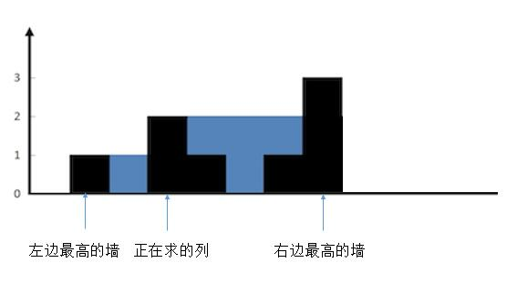

## 42. 接雨水

- [42. 接雨水](https://leetcode.cn/problems/trapping-rain-water/)
- 0616，hard，answer
- 暴力解、动态规划、栈、巧解

#### 方法一：暴力解｜按行遍历

复杂度：

- 时间复杂度：如果最大的高度是 *m*，height总个数是 *n*，那么就是 *O(m∗n)*;
- 空间复杂度：*O(1)*；

解析：

- 计算出一个 container，就加入到总水量 sum 中。


思路：遍历每一层高度（1～3）然后计算这一层的储水量：

- container 记录每一个水坑，
- 当计算好一个 container 时（左右都有高于它的挡板），就把 container 加到 sum 总水量中，并重置 container。

通过第一层举例，高度 i = 1，j 从 0～height.length：

- 左侧 `[0, 2]` 位置，用 flag 排除，只有当 (`height[j] >= i`) 时，找到了第一个左侧的挡板，flag 设置为 true，才开始统计雨水量。
- 右侧 `[10,11]` 位置，用 container 添加的时机排除，开始统计雨水量后，每当遇到一个新的挡板。这个挡板既是左侧 container 的挡板，圈成一个水坑，也是右侧 container 的挡板，开始圈一个新的水坑。所以遇到一个新的挡板，表明左侧的 container 已经圈出来，把当前 container 的值加到总量 sum 中。然后重置 container = 0。
  - 最后一个水坑 height.length - 2 位置，因为没有右挡板，所以统计的 container 并没有添加到 sum 中，而是作废了。

```js
var trap = function (height) {
  let max = 0;  // 获取最大高度
  height.forEach(item => max = Math.max(item, max));
  let sum = 0;

  for (let i = 1; i <= max; i++) {
    let container = 0;  // 遇到第二个边界，就把当前池子的水加入sum中，防止最右侧不构成一个池子
    let flag = false;
    for (let j = 0; j < height.length; j++) {
      if (flag && height[j] < i) container++;
      else if (height[j] >= i) {
        sum += container;
        container = 0;
        flag = true;
      }
    }
  }
  return sum
};
```


#### 方法二：动态规划｜按列遍历

复杂度：

- 时间复杂度：height 总个数是 *n*，有 3 次 for 循环，那么就是 *O(n)*;
- 空间复杂度：二维 dp 数组的长度为 n，每个成员又是一个长度为 2 的子数组，所以总空间为 2n，得 *O(n)*；

解题思路：


当要计算某一列 i 的水量时，只需要有该列左侧 / 右侧的最高高度即可。

情况一：


比如上图中，正在求的列 i 左侧最高墙，就是 i - 1；右侧最高墙是 i + 3。那么高度 i 的储水量，就是左右两侧高墙的较低高度 - i 的高度

```js
const container = Math.min(左侧高墙, 右侧高墙) - height[i];
```

情况二：



如果当前列的高度高于左侧强高度，则不存在任何储水。如上图，那么按照上面 container 公式计算出结果就小于 0，这时只需要在每次添加总水量 sum 时，判断一下 container 是否大于 0 即可：

```js
const container = Math.min(左侧高墙, 右侧高墙) - height[i];
if (container > 0) sum += container;
```

求左侧 / 右侧最高高度：

- 这里我隐隐感觉到要动态规划，但是还是没理性的分析出来。

动态规划的雏形就是递归，找到最小子问题，找到 base case。

这里的 base case ：

- 当 1 判断储水量时，也就是 i = 1 时，左侧最高墙就是 height[0]；
- 当 height.length - 2 判断储水量时，i = height.length - 2 时，右侧最高墙就是 height[height.length - 1]；

递归：

- 当 2 判断储水量时，也就是 i = 2 时，左侧最高墙就是 ：`Math.max( i-1的高度，i-1的左侧最高高度)`；
- 右边同理。

所以就找到了动态规划的状态转移方程

1. 定义 `dp[i][j]`
   - `dp[i][0]` 表示当 i 为判断容器时，它左侧的最高高度；
   - `dp[i][1]` 表示当 i 为判断容器时，它右侧的最高高度；

2. 定义状态转移方程

```js
// 状态转移方程 (初始化)：i 的范围从[1,height.length-1]，左右两段肯定不能作为容器。

// 从左往后遍历，求左侧最高高度
for (let i = 1; i < height.length - 1; i++)
  dp[i][0] = Math.max(dp[i - 1][0], height[i - 1]);

// 从后往前遍历，求右侧最高高度
for (let i = height.length - 2; i > 0; i--) 
  dp[i][1] = Math.max(dp[i + 1][1], height[i + 1]);
```

有了 dp，然后在 for 循环遍历一遍 height，求出每一个高度的储水量：

```js
var trap = function (height) {
  // dp[i][0] // i 位置的左侧最高高度
  // dp[i][1] // i 位置的右侧最高高度
  const dp = Array.from(new Array(height.length), () => new Array(2).fill(0));
  let sum = 0;
  
  // 状态转移方程 (初始化)：i 的范围从[1,height.length-1]，左右两段肯定不能作为容器。
  for (let i = 1; i < height.length - 1; i++)
    dp[i][0] = Math.max(dp[i - 1][0], height[i - 1]);

  for (let i = height.length - 2; i > 0; i--) 
    dp[i][1] = Math.max(dp[i + 1][1], height[i + 1]);
  
  for (let i = 1; i < height.length - 1; i++) {
    const container = Math.min(dp[i][0], dp[i][1]) - height[i];
    if (container > 0) sum += container;
  }
  return sum;
};
```


#### 方法三：栈


栈结构的思路如下：

- 想象为括号匹配，栈内维护一个递减序列，
- while 循环，如果当前高度 `height[i]` 大于栈顶元素，那么就说明 `height[i]` 应该是一个水池的右边界。那么就用 while 循环，把栈内所有当前高度是右边界的水池计算掉：
  - 栈顶元素取出，作为 bottom（水池底端）；
  - 现在要找水池的左边界，在栈内。
    - 此时要额外判断，如果栈内已经没有任何元素了，说明没有左边界，此时跳过 while 循环。（上图中 height[0]、height[1]）
  - 左边界就是当前栈顶元素（上面已经取出了 bottom）；
  - 计算 distance 水池的宽度：左右两个墙之间的距离 - 1：右边（`i`） - 左边（栈顶：`stack[stack.length - 1]`）。
  - 计算左右两边的较低边，min
  - 计算水池的容量，并加到 sum 中，水池容量：` (side - height[bottom]) * distance`。
- 当 while 循环结束，表明栈内已经没有水坑了（栈内为空，或者栈内的高度都大于当前元素 height[i]），那么这时候就把当前元素 push 到栈内。

```js
var trap = function (height) {
  const len = height.length;
  const stack = []; // 栈内一定是一个递减序列, 保存index
  let sum = 0;

  for (let i = 0; i < height.length; i++) {
    while (stack.length && height[i] >= height[stack[stack.length - 1]]) {
      // 出栈
      const bottom = stack.pop();
      if (!stack.length) break;
      let distance = i - stack[stack.length - 1] - 1; //两堵墙之前的距离。
      const side = Math.min(height[i], height[stack[stack.length - 1]]);
      sum += (side - height[bottom]) * distance;
    }
    stack.push(i);
  }
  return sum
};
```


## 6. Z 字形变换

- [6. Z 字形变换](https://leetcode.cn/problems/zigzag-conversion/)
- 0623，mid，normal
- 字符串

#### 方法一：二维数组

自己的方法太差，直接 **忽略** 吧。

从 numRows == 1, 2, 3, 4 找到规律。可以建立一个二维数组，按列递增把每一个字符串添加其中：

```js
//-- 示例 2 --//
输入：s = "PAYPALISHIRING", numRows = 4
输出："PINALSIGYAHRPI"
解释：
P     I    N
A   L S  I G
Y A   H R
P     I
```

如果 numRows === 4 时，可以发现周期 t 有如下规律：

- 第 0 列，二位数组的所有位置都被填满， t = numRows - 1；
- 第 1 列，二位数组的 `arr[1][numRows - 2]` 也就是 `arr[1][t]` 被填入字符，t = numRows - 2；
- 第 2 列，二位数组的 `arr[2][numRows - 3]` 也就是 `arr[1][t]` 被填入字符，t = numRows - 3； 
- 第 3 列，二位数组的所有位置都被填满， t 重制为 numRows - 1；

如此循环，直到 s 中所有字符填入其中即可。

```js
var convert = function (s, numRows) {
  if (numRows === 1) return s;
  // 建立二维数组，row = numRows
  const arr = Array.from(new Array(numRows), () => []);
  let char = 0;  // 字符
  let j = 0;     // 数组的列
  let t = numRows - 1;  // 周期：numRows - 1
  while (char < s.length) {
    // 全列都要写入
    if (t === numRows - 1) {
      for (let i = 0; i < numRows; i++) {
        arr[i][j] = s[char];
        char++;
      }
    } else {
      // 一列只有一个写入
      arr[t][j] = s[char];
      char++;
    }
    // 初始化：下一次循环
    t = t === 1 ? numRows - 1 : t - 1;
    j++;
  }
  // 输出: 扁平化 + 拼接 -- flat、foreach、filter等,遍历时会过滤空值。
  return arr.flat().join("");
};
```

#### 方法二：一维数组

事实上，结果要返回上题中二维数组的扁平化内容：

```js
//-- 示例 2 --//
输入：s = "PAYPALISHIRING", numRows = 4
输出："PINALSIGYAHRPI"
解释：
[
  P     I    N
  A   L S  I G
	Y A   H R
	P     I
]

// 调整为一维数组 
dict = [str0, str1, str2, str3]
// str0 = "PIN"
// str1 = "ALSIG"
// str2 = "YAHR"
// str3 = "PI"
```

不是一个二维数组，而是 4 个一维数组也可以，不需要建立二位数组，也不需要中间有空余位置，满足 'z' 的形状，因为最终输出的字符串并不需要这些额外的信息。

- 重点：

如果 numRows 为 4， 依次放入 s 中的成员时，一维数组 dict 下标的变化是这样的：0, 1, 2, 3, 2, 1, 0 ... 在 [0, numRows - 1] 之间往返。

所以，用 flag 表明下标 i 应当 +1，还是 -1：

- 当 i == 0 时，下一步 i 应当累加，flag 设置为 +1；
- 当 i == numRows - 1时，下一步 i 应当累减，flag 设置为 -1；

```js
var convert = function (s, numRows) {
  if (numRows < 2) return s; // 一行直接返回

  const dict = Array.from(new Array(numRows), () => "");
  let i = 0;  // dict 下标
  let flag = -1;

  for (const char of s) {
    dict[i] += char;
    // i 遍历到头/尾，就重制flag
    if (i === 0 || i === numRows - 1) flag = -flag;
    i += flag;
  }
  return dict.join('');
};
```


## 7. 整数反转

- [7. 整数反转](https://leetcode.cn/problems/reverse-integer/)
- 0624，mid，quick
- 字符串，取余

#### 方法一：利用字符串

我的方法

审题清楚后，解决问题即可，注意先后顺序：

- 整数反转：借助字符串，for 循环即可。
- 负数：最先判断是否有负数，用 flag 标记，并裁剪字符串（`substring(startindex, endindex)`）。
- 删除0：反转后，如果开头有 0，就裁剪字符串。
- 添加符号：查看 flag 并添加符号；
- 判断是否超过 64 位，转化为 number 后，判断是否超出大小。

```js
var reverse = function (x) {
  let str = String(x);
  let res = '';

  // flag 判断负号
  let flag = 0;
  if (str[0] === '-') {
    flag = 1;
    str = str.substring(1);
  }

  // 反向重塑字符串
  for (let i = 0; i < str.length; i++) {
    res = '' + str[i] + res;
  }

  // 删去0
  for (let i = 0; i < res.length; i++) {
    if (res !== '0') break;
    res = res.substring(i + 1);
  }

  // 添加负号，并转化为number
  if (flag) res = '-' + res;
  res = Number(res);

  // 超出范围返回0
  if (res < -1 * 2 ** 31 || res > 2 ** 31 - 1) res = 0;

  return res;
};
```

#### 方法二：取余

```js
%10 运算：得到数字的个位数；
/10 运算：得到截去个位数的数字；

1、将12345 % 10 得到5，之后将12345 / 10
2、将1234 % 10 得到4，再将1234 / 10
3、将123 % 10 得到3，再将123 / 10
4、将12 % 10 得到2，再将12 / 10
5、将1 % 10 得到1，再将1 / 10
```

需要注意的是，Js 中的除法运算 `/` 是带小数点的，所以要用 Math.floor 截断小数点。此时要考虑如果是负数，就需要 `Math.ceil` 或和上一个解法一样，用 flag 过滤掉负数。

所以代码如下：

```js
var reverse = function (x) {
  let res = 0;
  const Max = 2 ** 31 - 1;
  const Min = -1 * 2 ** 31;

  while (x !== 0) {
    //取个位数
    const num = x % 10;
    res = res * 10 + num;
    // 判断是否超过上限
    if (res < Min || res > Max) return 0;
    // 截断小数点：负数是ceil，正数是floor    
    x = x > 0 ? Math.floor(x / 10) : Math.ceil(x / 10);
  }
  return res;
};
```


## 146. LRU 缓存

- [146. LRU 缓存](https://leetcode.cn/problems/lru-cache/)
- 0626，mid，normal
- class 类、map结构、链表定义

#### 方法一：map 结构

利用 map 结构的特性：

- map 的插入是有序的，新加入的排在队尾。
- 遍历：
  - `for (const item of map)` 可以从 旧 -> 新 的遍历出所有成员；
  - `const iter = map.keys()` 可以返回一个迭代器，用 `iter.next().value` 获得最旧的值。

所以，

- get 函数的思路：调用 get 函数会刷新数字的生命周期，那么如果 map 中存在该数，就删掉，然后重新插入。这样该数字就放在最末尾。
- get 函数的思路：调用 set 函数插入有几个情况：
  - 如果 map 中已存在该 key，则需要更新对应的 value。需要删除掉旧成员 (key, value) 然后插入新的 (key, value)，让成员生命周期保持最新。
  - 如果 map 中不存在 key，有两种情况：
    - 如果 map 没有达到容量上限，那么直接插入即可，同时让 capacity 减 1；
    - 如果 map 达到上限，删除 map 中第一个元素，然后再插入当前成员。
      - 查找到第一个：`this.map.keys().next().value`

```js
/**
 * @param {number} capacity
 */
var LRUCache = function (capacity) {
  this.map = new Map();
  // 登记容量上限，每当插入一个元素就让capacity--。到0时表明到达容量上限
  this.capacity = capacity;  
};

/** 
 * @param {number} key
 * @return {number}
 */
LRUCache.prototype.get = function (key) {
	// 不存在，返回 -1
  if (!this.map.has(key)) return -1;  
  // 存在，需要刷新生命周期，先删除，再重新插入原值
  const value = this.map.get(key);
  this.map.delete(key);
  this.map.set(key, value);
  return value;
};

/** 
 * @param {number} key 
 * @param {number} value
 * @return {void}
 */
LRUCache.prototype.put = function (key, value) {
  // 存在: 删除、插入、返回
  if (this.map.has(key)) {
    this.map.delete(key);
    this.map.set(key, value);
    return;
  }
  // 不存在: 先判断是容量-1，还是删除元素，最后插入
  if (this.capacity) this.capacity--;  // 容量没超
  else this.map.delete(this.map.keys().next().value); // 容量超了，删除
  this.map.set(key, value);
};

/**
 * Your LRUCache object will be instantiated and called as such:
 * var obj = new LRUCache(capacity)
 * var param_1 = obj.get(key)
 * obj.put(key,value)
 */
```

#### 方法二：链表｜原生操作

[🔍](https://leetcode.cn/problems/lru-cache/solution/bu-yong-yu-yan-nei-jian-de-map-gua-dang-feng-zhuan/).


## 143. 重排链表

- [143. 重排链表](https://leetcode.cn/problems/reorder-list/)
- 0627， mid，normal
- 链表操作

#### 方法一：反转 + 合并

总体思路：

1. 新建一个链表：`dummyhead`，将原来的链表反转；
   1. 反转的时候，用 num 记录链表的总长度。
2. 新建一个链表：`newHead`，重排的链表就是 newHead；
   1. p1 指向正序链表 head；
   2. p2 指向反序链表 dummyhead；
   3. point 指向合并后的重排链表 newHead；
3. 进行合并，先合并 p1，再合并 p2。
   - 每合并一个节点到 newHead 上，就让 num--。直到减少到 0，排列结束。

```js
var reorderList = function (head) {
  // 反转
  let dummyhead = new ListNode();
  let point = head;
  let num = 0;  // 记录链表的总长度
  while (point !== null) {
    const node = new ListNode(point.val);
    node.next = dummyhead;
    dummyhead = node;
    point = point.next;
    num++;
  }
  // console.log(dummyhead, num);

  let newHead = new ListNode();
  point = newHead;
  let p1 = head;
  let p2 = dummyhead;
  while (num) {
    point.next = p1; // 先插入正序链表
    p1 = p1.next;
    point = point.next;
    num--;

    if (!num) break;  // 如果此时 num 为 0，就提前结束
    point.next = p2;  // 后插入反序链表
    p2 = p2.next;
    point = point.next;
    num--;
  }
  point.next = null;
  // console.log(newHead.next);
};
```

#### 方法二：优化反转｜快慢指针

上面的思路，对链表进行了完整的反转，而实际上我们只需要后半段合并。

如何把链表分割为两半？

- 快慢指针。遍历链表时，快指针走两步，慢指针走一步。当快指针走完的时，慢指针就正好在中点位置。

上面的思路，没有原地反转，而是通过生成新节点操作，利用临时节点 tempNode 来实现原地反转。

```js
var reorderList = function (head) {
  // 快慢指针找中点
  let slow = head;
  let fast = head;
  // 注意这里的while循环判断：节点有5个，slow=3；节点有4个，slow=2；
  while (fast.next !== null && fast.next.next !== null) {
    slow = slow.next;
    fast = fast.next.next;
  }

  // 反转 slow
  const reverseHead = reverseList(slow.next);
  slow.next = null; // slow是重排后的尾节点，所以应指向null

  let p1 = head;
  let p2 = reverseHead;
  // console.log(p1, p2);
  // 相当于把p2中的节点插入到p1中
  while (p2) {
    const node1 = p2.next;  // 临时保存p2的后续节点
    const node2 = p1.next;  // 临时保存p1的后续节点
    // p1 -> p2 -> p1.next。p1 链表中插入一个p2节点
    p1.next = p2;
    p1.next.next = node2;
    // 初始化 p1、p2
    p1 = p1.next.next;
    p2 = node1;
  }

  // 反转链表
  function reverseList(head) {
    if (!head) return null;
    let tail = head; // 从尾添加节点
    let point = head.next; // 从头遍历
    tail.next = null; // tail是尾巴，结尾为null

    while (point !== null) {
      const tempNode = point.next; // 临时保存point的后续节点
      point.next = tail;
      tail = point;
      point = tempNode; // point继续指向head中下一个节点
    }
    return tail;
  }
};
```


## 92. 反转链表 II

- [92. 反转链表 II](https://leetcode.cn/problems/reverse-linked-list-ii/)
- 0628，mid，answer
- 链表操作，迭代和递归思想

#### 方法一：递归

**1：递归链表反转**

思路 [🔍](https://leetcode.cn/problems/reverse-linked-list-ii/solution/bu-bu-chai-jie-ru-he-di-gui-di-fan-zhuan-lian-biao/)：

1. 明确 reverse 的定义：reverse会把head为头节点的链表反转，然后返回新的头节点；
2. 明确 base case，如果只有一个节点了，就放回节点本身；
3. 反转：递归只反转 head 第二个节点 head.next 到末尾；
4. 把 head 接到末尾节点上。注意，这里比较绕：
   - `head.next` 一直指向了链表第二个节点，而 `reverse(head.next)` 后，这个节点实际上处于反转后新链表（reverseHead）的末尾位置。所以此时 `	head.next` 指向了 reverseHead 最后一个节点。
   - `head.next.next = head` 就是把  head 节点接在 reverseHead 最后一个节点上，实现完整的 reverse 链表。

```js
// 【1定义】reverse会把head为头节点的链表反转，然后返回新的头节点
function reverse(head) {
	//【2base case】如果head为最后一个节点，那么直接返回head。
  if (head.next == null) return head;
  
  // 【3递归反转head.next】lastNode 是链表head.next到末尾反转后的开头。
  const reverseHead = reverse(head.next);
	// 【4接上head】递归反转没有包括head，现在要将head放到lastNode链表的最后一个节点。
  head.next.next = head;  // head.next现在指向了lastNode链表的最后一个节点
  head.next = null; // head现在是lastNode链表的最后一个节点了，让其next指向null
  return reverseHead;
}
```

**2：递归反转前n项链表**

与1 直接反转链表相比，反转前 n 项链表要记录一下第 n + 1 项的位置，在 0 ~ n 个节点完成反转后，把现在已经在末尾的 head 节点后，接上第 n + 1 项链表。

1. 函数定义：reverse，把以head为头节点的链表，其前n项反转后返回。
2. base case：递归返回，当 n = 1 时，表明只反转一个节点，那直接返回这个节点，同时记录第 n + 1 个节点。这个节点要接在 head 的后面。
3. 反转：递归只反转 head 第二个节点 head.next 到第 n 个节点截止（一共有 n-1 个）；
4. 把 head 接到末尾节点上。
   - 这里和之前不同。之前 `head.next = null` 因为 head 是链表的最后一个节点，所以 next 指向null；
   - 而这里 head 只是参与反转的部分链表中最后一个节点，所以后面要接上第 n+1 个节点 `head.next = nextNode`

```js
function reverseN(head, n) {
  // 全局变量，记录第n+1个节点
  let nextNode = null;
  return reverse(head, n);

  // 【1定义】 reverse，把以head为头节点的链表，其前n项反转后返回。
  function reverse(head, n) {
    // 【2base case】递归截止、并找到第n+1个节点
    if (n === 1) {
      nextNode = head.next;
      return next;
    }
    // 【3递归】
    const reverseHead = reverse(head.next, n-1);
    // 【4接上head】
    head.next.next = head;
    head.next = nextNode;  // 接上n+1个节点
    return reverseHead;
  }  
}
```

**3：反转 m~n 区间内的节点**

相比 2 中的反转前 n 个节点，我们只需要跳过前m项，然后转化为 “反转前x项链表” 问题即可。

考虑如何转化：

- 定义函数： reverseBetween(head, m, n) 表示将链表 head 中第 m～n 项反转，并返回 head 链表。
  - 和之前的递归思路一样，每次递归都从 head.next 开始。那么 m 和 n 就变成 m-1 和 n-1。
  - 当 m 最后等于 1 时，表明从当前节点开始开始反转，也就转化为反转前 (n-m) 项链表问题了。

```js
function reverseBetween(head, m, n) {
  // base case
  if (m === 1) return reverseN(head, n);

	head.next = reverseBetween(head.next, m-1, n-1);
  return head;
}
```

最后的代码如下：

```js
var reverseBetween = function (head, left, right) {
  // 反转前n项链表时，记录第n+1项的位置
  let nextNode = null;

  if (left === 1) return reverseN(head, right);
  head.next = reverseBetween(head.next, left - 1, right - 1);
  return head;
};

// 反转前n项链表：
function reverseN(head, n) {
  // base case
  if (n === 1) {
    nextNode = head.next;
    return head;
  }
  // 迭代head.next
  const reverseHead = reverseN(head.next, n - 1);
  head.next.next = head;
  head.next = nextNode;
  return reverseHead;
}
```


#### 方法二：迭代

当时没做出来，是返回的时候没有用 dummyHead.next，而是直接返回了 head。但是我忘记了 head 作为头节点，也有可能参与反转，反转后 head 就不再是头指针了，而 dummyHead.next 是永远指向头指针的。

迭代的思路比较朴素，有如下几个步骤：

1. 找到 start 和 end。start.next 和 end 就是参与反转的子链表。
2. 子链表反转后需要将头、尾接上原链表中，考虑：
   - 不反转的开头节点（dymmyHead～start）--> 要反转的子链表（start.next～end） --> 不反转的尾节点（end.next～最后）。
   - leftNode，rightNode：start.next 节点和 end.next 节点位置，用来在反转后拼接不反转的尾节点。
   - 切断 end.next 不反转
3. 反转子链表
4. 拼接上开头和结尾。

```js
var reverseBetween = function (head, left, right) {
  // 先找到 left 上一个节点 和 right 节点：start,end
  // start.next 到 end(含) 就是要反转的节点。
  const dummyHead = new ListNode();
  dummyHead.next = head;

  let start = dummyHead;
  while (left > 1) {
    start = start.next;
    left--;
    right--;
  }

  let end = start;
  while (right > 0) {
    end = end.next;
    right--;
  }
  // console.log(start, end);

  // 保存反转前链表关键节点的位置。方便反转后接上剩余不反转的子链表
  const leftNode = start.next;   // start.next节点，在链表反转前，是待反转链表的头节点；在链表反转后就是反转链表的最后一个节点，要接上不反转的剩余节点;
  const rightNode = end.next;     // end.next节点，是不反转的剩余节点的头节点，在链表反转后，接在 leftNode 后面。

  // 切断链接, 切断末尾不反转的链表
  end.next = null;

  // 反转的子链表，接回到原来的链表中
  start.next = reverseList(start.next);  // 反转后，接上反转子链表的开头；
  leftNode.next = rightNode;  // 反转后，接上反转子链表的结尾；
  return dummyHead.next;
};

// 反转链表迭代
function reverseList(head) {
  if (!head || !head.next) return head;
  let point = head;
  head = head.next;
  point.next = null; // point当前指向的head，是反转后的最后一个节点，head.next应当为null

  while (head) {
    // 保存head的后续关系
    const node = head.next;
    // 提取head.next节点
    head.next = point;
    point = head;
    head = node;
  }
  return point
};
```


===== notion ===============================

题库（记得点一下按频率排序）：https://leetcode.cn/company/bytedance/problemset/

[215. 数组中的第K个最大元素](https://leetcode.cn/problems/kth-largest-element-in-an-array/)

[31. 下一个排列](https://leetcode.cn/problems/next-permutation/)

[54. 螺旋矩阵](https://leetcode.cn/problems/spiral-matrix/)

[200. 岛屿数量](https://leetcode.cn/problems/number-of-islands/)


### 1.链表的操作

- 注意操作链表前，设置 dummyHead。然后在返回时，返回 dummyHead.next；
- 快慢指针，可以找到链表的中点位置。
- 反转链表，迭代和递归的思想都要掌握，及时复习（92. 反转链表 II）。


