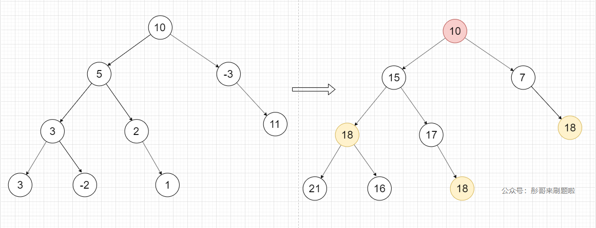

---

title: 6. 二叉树1
sidebar_position: 6
date: 2022-04-15
tags: [algorithm]

---


## 5. 最长回文串

- 0417，mid

- 考点：动态规划、分类讨论


#### 解法一：动态规划

**分析：**

- 动态规划的 dp：
- `dp[i][j]` 表示 `i~j` 是一个回文串，此时赋值为 true： `dp[i][j] = true`;

判断当前 dp[i][j] 是否为一个回文串时，分析：
1. `s[i]` 和 `s[j]` 是否相等，如果相等，则：
	1. 子串 `dp[i+1][j-1]` 是回文串，它就是回文串；
	2. 反之，子串不是回文串，它就不是回文串
2. 如果不相等，就一定不是回文串。


**找到转换方程：**

```js
if (s[i] === s[j]) {
  dp[i][j] = dp[i-1][j+1];
  range = [x-1, y+1];
} else {
  dp[i-1][j+1] = false;
}
```


**找到问题边界：**

```js
// 子串长度为1，肯定是一个回文串
for (let i = 0; i < len ; i++) {
  dp[i][i] = true;
}

// 字串长度为2，如果两个元素相等，也是一个回文串
for (let i = 0; i < len - 1 ; i++) {
  if (s[i] === [i+1])
    dp[i][i+1] = true;
}
```


**求解：**

```js
var longestPalindrome = function (s) {
  // 特例
  if (!s || s.length === 0) return;
  const len = s.length;
  let range = [0, 0]

  // 初始化二维数组
  // dp[i][j] 表示s[i...j] 是否是回文串
  const dp = new Array(len)
  for (let i = 0; i < len; i++) {
    dp[i] = [];
  }

  // 处理边界:
  for (let i = 0; i < len; i++) {
    //n=1时，都是回文串
    dp[i][i] = true;
    if (i < len - 1 && s[i] === s[i + 1]) {
      // n=2时，两个元素相等也是回文串：'bb'
      dp[i][i + 1] = true;
      range = [i, i + 1]
    }
  }

  // n 为判断回文串的长度，从3开始
  for (let n = 3; n <= len; n++) {
    // 左下标
    for (let i = 0; i <= len - n; i++) {
      // 右下标
      let j = i + n - 1;
      if (dp[i + 1][j - 1]) {
        // 如果上一个是回文串，则判断当前下标是不是回文串
        if (s[i] === s[j]) {
          dp[i][j] = true;
          range = [i, j];
        }
      }
    }
  }

  return s.slice(range[0], range[1] + 1)
};
```


#### 解法二：分类讨论

- 中心扩展算法

把每一个节点当成中心（中心是一个回文串）然后左右扩展，寻找以当前中心为基的最长回文串。

```js
var longestPalindrome = function (s) {
  // 特殊情况
  if (!s || s.length === 0) return;
  
  const len = s.length;
  // range[0]和range[1]代表最长回文串的起始和终点坐标
  let range = [0, 0]

  // 遍历每一个数，把这个数当成回文串的中心，向左右方向扩展。
  for (let i = 0; i < len; i++) {
    estimate(i);
  }
  return s.slice(range[0], range[1] + 1);

  // 回文有两种：中心点是一个的单数(aba)，中心点是两个以上的双数(abba、abbba) 
  // 把回文串统一看成：中间部分+左右不分。中间部分全部是同一字符，左右部分对称相等
  function estimate(x) {
    let y = x;
    // 处理回文中间部分：连续相同字符
    while (y + 1 < len && s[y] === s[y + 1]) {
      y++
    }
    // 处理回文的左右两边：找到最长回文串
    while ( x - 1 >= 0 && y < len && s[x-1] === s[y+1]) {
      x--;
      y++;
    }
    // 判断当前找到的回文串和之前保存的回文串哪一个更长
    if (range[1] - range[0] < y - x) {
      range = [x, y];
    }
  }
};
```


犯错：

1. `dp[i][j] = true` 写成了 `dp[i][j] === true`，这个问题还看了很久没找到。


## 105. 从前序与中序遍历序列构造二叉树

- [从前序与中序遍历序列构造二叉树](https://leetcode-cn.com/problems/construct-binary-tree-from-preorder-and-inorder-traversal/)

- 0419、mid
- 动态规划，二叉树构造

**1. 找特点**


```
preorder = [3,9,20,15,7], 
inorder = [9,3,15,20,7]
```

前序遍历的特点：根、左、右。`preorder[0]` 就是根节点

中序遍历的特点：左、根、右。找到根节点后，左边的是左子树，右边的是右子树：

```js
// 中序列表中，根的下标:
const index = inorder.indexOf(preorder[0]);
// 从中序列表中，找到左子树长度，右子树长度：
const leftLen = index
const rightLen = inorder.length - leftLen - 1;
```

**2. 找思路**

这样，可以根据下标切分出：

- 前序列表：`[根、左子树、右子树]`；
- 中序列表：`[左子树、根、右子树]`；

创建一个新节点，其值为当前找到的 `根节点`，`左子树` 和 `右子树` 递归等待答案；

然后递归，把 `前序列表` 和 `中序列表` 中的 `左子树` 提取出来，进一步拆分找到 **根**、**左**、**右**；右子树同样操作。

这样，直到切分为长度为 3 的最小子树：

- 前序列表：`[根、左、右]`；
- 中序列表：`[左、根、右]`；

开始逐层返回，得到一整个树。

```js
假定：
- 先序遍历：[3，_, _, _, _, _];
- 中序遍历：[0, 1, 2, 3, 4, 5];

那么我们就可以确定：根、左子树、右子树了:
- 先序遍历：['根', 左, 左, 左 , 右, 右]
- 中序遍历：[ 左 , 左, 左,'根', 右, 右]

然后求出：根的下标、左子树的长度
最后可以确定左子树、右子树的头尾两个下标了（见下文）
```


**3. 抽象**

假定：

- 前序列表的左子树，下标为：`[preL, preR]`
- 中序列表的左子树，下标为：`[inL, inR]`

```js
// 根的值：
const rootValue = preorder[preL];
// 中序列表中，根坐标：
const index = inorder.indexOf(root);
// 由此找到左子树的长度
const subLen = index - inL;
// 前序列中的左子树、右子树
const preLeftTree = [preL + 1, preL + subLen];
const preRightTree = [preL + subLen + 1, preR];
// 中序列中的左子树、右子树
const inLeftTree = [inL, index - 1];
const inRightTree = [index + 1, inR];
```

**4. 边界**

每次递归，都是先确定一个根结点，然后以这个根结点为子树的基，构造左子树和右子树。

- 左右子树全部确定完成后，再返回这个 **子树本身**。

考虑：

- 面对某一个子序列，我们会先找根结点，再通过根结点下表找左子树和右子树的结点。

当某个子序列拆分的足够小：

- 长度为 3 和 3 以上时，一定有根结点，左子树和右子树 **可能** 有一个子树不存在；
- 长度为 2 时，一定有根结点，左子树和右子树 **必定** 有一个子树不存在；
- 长度为 1 时，一定有根结点，左子树和右子树 **全部不存在**；

综上，长度为 1 以上时，肯定有根结点，所以一定能创建一个子节点，不是问题的边界。

- 长度为 0 时，根结点、左子树、右子树都不存在，**这个节点也不存在了**。

找到了边界，当这个节点不存在，则遍历到了分支的边界，不会再返回新的结点了。

所以，边界就是当子序列的 左下标 > 右下标时，证明这个序列已经不存在了，返回 null

```js
if (preL > preR) {
  return null;
}
```

**5. 求解**

```js
var buildTree = function(preorder, inorder) {
  const len = preorder.length
  // 开始递归
  return build(0, len-1, 0, len-1);

  function build(preL, preR, inL, inR) {
    // 边界，递归的 return
    if (preL > preR) {
      return null;
    }

    // 新建根结点
    const root = new TreeNode();
    root.val = preorder[preL];
    // 找根结点在中序列中的下标
    const index = inorder.indexOf(root.val);
    // 找到左子树的长度
    const subLen = index - inL;
    // 递归：左子树、右子树
    root.left = build(preL+1, preL+subLen, inL, index-1);
    root.right = build(preL+subLen+1, preR, index+1, inR);
    return root;
  }
};
```


## 106. 从中序与后序遍历序列构造二叉树

- [106. 从中序与后序遍历序列构造二叉树](https://leetcode-cn.com/problems/construct-binary-tree-from-inorder-and-postorder-traversal/)

- 0420，mid
- 动态规划，二叉树构造

思路同 105。

```js
var buildTree = function(inorder, postorder) {
  // 特例
  if (!inorder || !postorder || inorder.length === 0 || postorder.length === 0)  return null;
  const len = inorder.length;
  return build(0, len-1, 0, len-1);

  function build(inL, inR, poL, poR) {
    // 边界
    if (inL > inR) {
      return null;
    }

    // 结点
    const root = new TreeNode();
    root.val = postorder[poR];
    // 下标
    const index = inorder.indexOf(root.val);
    const length = index - inL;
    // 递归左子树、右子树
    root.left = build(inL, index-1, poL, poL+length-1);
    root.right = build(index+1, inR, poL+length, poR-1);

    return root;
  }
};
```

- 相关题目：0511｜[449. 序列化和反序列化二叉搜索树](https://leetcode.cn/problems/serialize-and-deserialize-bst/)


## 107. 二叉树的层序遍历 II

- [107. 二叉树的层序遍历 II](https://leetcode-cn.com/problems/binary-tree-level-order-traversal-ii/)
- 0420, mid
- 二叉树构造

题解：

- 主要是对 `curRes` 放入 `res` 时的改动，只需要从之前的队头 `push`，改为队尾的 `unshift` 就可以了。

```js
var levelOrderBottom = function (root) {
  if (!root) return [];
  const res = [];
  const quene = [];
  quene.push(root);

  while (quene.length) {
    // 记录层级信息
    const len = quene.length;
    const curRes = [];
    for (let i = 0; i < len; i++) {
      const node = quene.shift();
      curRes.push(node.val);
      
      node.left && quene.push(node.left);
      node.right && quene.push(node.right);
    }
    res.unshift(curRes);
  }
  return res;
};
```


## 102. 二叉树的层序遍历

- [102. 二叉树的层序遍历](https://leetcode-cn.com/problems/binary-tree-level-order-traversal/)
- 0421， mid，quick
- 层序遍历基本功

```js
var levelOrder = function(root) {
  // 特值
  if (!root) return [];
  // 队列
  //   unshift, [push]
  //   [shift], pop
  const quene = [];
  const res = [];

  // 先放入一根结点，然后while循环
  quene.push(root);
  while (quene.length){
    // 记录每层的长度、结果
    const levelLength = quene.length;
    const levelRes = [];
    // for遍历该行
    for (let i = 0; i < levelLength; i++){
      const node = quene.shift();
      levelRes.push(node.val);
      //❗️千万记得要判断存在，然后再push
      node.left && quene.push(node.left);
      node.right && quene.push(node.right);
    }
    res.push(levelRes);
  }
  return res;
};
```


## 103. 二叉树的锯齿形层序遍历

- [103. 二叉树的锯齿形层序遍历](https://leetcode-cn.com/problems/binary-tree-zigzag-level-order-traversal/)
- 0421，mid，answer
- 解析：https://leetcode-cn.com/problems/binary-tree-zigzag-level-order-traversal/solution/er-cha-shu-de-ju-chi-xing-ceng-xu-bian-l-qsun/
- 根据图表自己画一下就记忆深刻。

```js
var zigzagLevelOrder = function (root) {
  // 特
  if (!root) return [];

  const res = []
  const quene = [];
  // true is ==>
  let flag = false;
  // shift, push
  quene.push(root);

  while (quene.length) {
    const levelLen = quene.length;
    const levelRes = []
    for (let i = 0; i < levelLen; i++) {
      const node = quene.shift();
      // 在每层推入数时，需要根据flag进行正向/反向推入
      flag ? levelRes.unshift(node.val) : levelRes.push(node.val);
      node.left && quene.push(node.left);
      node.right && quene.push(node.right);

    }
    flag = !flag;
    res.push(levelRes);
  }
  return res
};
```


## 199. 二叉树的右视图

- [199. 二叉树的右视图](https://leetcode-cn.com/problems/binary-tree-right-side-view/)
- 0422，mid，quick
- 基本题，广度优先（层序遍历），深度优先（❓❓遍历）

#### 解题一：广度优先

基于层序遍历，只需要在 level 每层返回该层遍历出的所有值的时候，只返回遍历到的最后一个值即可。

```js
var rightSideView = function (root) {
  // 先层序，
  // 后只提取每层最右边的节点

  // 特
  if (!root) return [];

  //  shift<=======< push
  const res = [];
  const quene = [root];

  while (quene.length) {
    const levelLen = quene.length;
    const levelRes = []
    for (let i = 0; i < levelLen; i++) {
      const node = quene.shift();
      levelRes.push(node.val);
      node.left && quene.push(node.left);
      node.right && quene.push(node.right);
    }
    // ❗️只返回该层的最后一个值。
    res.push(levelRes[levelRes.length - 1])
  }
  return res
};
```

更妙的解法：

不需要在 for 循环遍历每层结点的时候，用 levelRes 保存全部的结点值：

- 我们要的是 level 这一层中，最后一个节点的值。
- levelLen 记录了该层的全部节点数
  - 我可以在每遍历该层一个节点的时候，就让 levelLen 减1，当 levelLen 减少到 1 的时候，说明已经便利到最后一个节点了，然后记录这个节点的值即可。

```js
// 仅贴出 while 内的代码
while (quene.length) {
  let levelLen = quene.length;
  while (levelLen) {
    const node = quene.shift();
    if (levelLen === 1) res.push(node.val);
    node.left && quene.push(node.left);
    node.right && quene.push(node.right);
    levelLen--;
  }
}

// 这样也可以，只需要判断 'i === levelLen - 1' 即可
while (quene.length) {
  const levelLen = quene.length;
  for (let i = 0; i < levelLen; i++) {
    const node = quene.shift();
    if (i === levelLen - 1) res.push(node.val)
    node.left && quene.push(node.left);
    node.right && quene.push(node.right);
  }
}
```

#### 解法二：深度优先

- https://leetcode-cn.com/problems/binary-tree-right-side-view/solution/shen-du-you-xian-sou-suo-by-shetia-2/

技巧：

1. 深度优先，顺序是：根、右、左。 
2. 因为每一层只要一个数，所以用结果数组 `res.length` 来表示当前已经遍历过的深度，假如 `res.length` 值为 2，表示头两层已经遍历过，拿到了最右侧的值，所以接下来如果有对第二层的其他节点进行遍历，就跳过。
3. 用 `step` 记录每次 `dfs` 时的深度。

```js
var rightSideView = function (root) {
  // dfs
  if (!root) return [];
  const res = [];
  
  dfs(root, 0);
  
  // params: 当前结点、结点所在层数
  function dfs(node, level) {
    // 边界
    if(!node) return;

    // 层数相同就push
    if (level === res.length) {
      res.push(node.val);      
    }
    // 递归
    dfs(node.right, level + 1);
    dfs(node.left, level + 1);
  }
  return res;
};
```


## 637. 二叉树的层平均值

- [637. 二叉树的层平均值](https://leetcode-cn.com/problems/average-of-levels-in-binary-tree/)
- 0423, easy, quick
- 广度优先

求平均值用到了 `reduce` 要熟悉 `reduce` 的语法：

- `prev` 是上一次 callback 的返回值。
- 最终返回 `prev`

```js
// 有 initialValue
// 从 0 开始遍历，多循环一次。
// 循环第一次 preV 的值是 initV；
//          curV 的值是 Array[0]，
//          item 的值是 0
Array.reduce((preV, curV, item) => {
  return preV + curV
}, initV);

// 没有 initialValue
// 从 1开始遍历，
// 循环第一次 preV 的值是 Array[0]；
//          curV 的值是 Array[1]；
// 					item 的值是 1；
```

#### 解法一：广度优先

```js
var averageOfLevels = function (root) {
  // 层序遍历
  if (!root) return [];

  const quene = [root];
  const res = [];

  while(quene.length) {
    const levelVal = [];
    const levelLen = quene.length;
    for (let i = 0; i < levelLen; i++) {
      // shift <=========< push
      const node = quene.shift();
      levelVal.push(node.val);
      node.left && quene.push(node.left);
      node.right && quene.push(node.right);
    }
    // 求平均值
    const total = levelVal.reduce((acc, cur) => acc + cur, 0);
    const average = levelVal.length;
    res.push(total/average);
  }

  return res;
};
```

- 时间复杂度：每个数组遍历一边，O(n)
- 空间复杂度：
  - quene、res： O(1)；
  - levelVal、levelLen：O(n)；
  - 总体空间复杂度依赖于树的深度，为 O(n)；


#### 解法二：深度优先

- 我的思路是实现了一个用 「深度优先」，遍历出一个 「广度优先」；
- levelVal 是一个二位数组，其成员是一个带层级的广度优先序列结果。
  - 如一个数是：[3, 9, 20, 15, 7]，`levelVal` 值是 `[[3], [9, 20], [15, 7]]`

```js
  // DFS
var averageOfLevels = function (root) {
  if (!root) return [];

  const res = [];
  // 二位数组：<node.val[]>[]，该数组的成员是每一层的结点值。
  // 也就是一个广度优先遍历出的结果
  const levelVal = [];
  dfs(root, 0)

  function dfs(node, level) {
    // 边界
    if (!node) return;

    // 数组长度 > 层数，已经定义过该层，可以直接push；反之没定义过，先定义再push
    // 最开始是第0层，levelVal.length = 1；
    levelVal.length > level ? levelVal[level].push(node.val) : levelVal.push([node.val]);

    dfs(node.left, level + 1);
    dfs(node.right, level + 1);
  }

  // 求每层的平均值
  levelVal.forEach(item => {
    const average = item.reduce((acc, cur) => acc + cur, 0) / item.length;
    res.push(average);
  })
  return res;
};
```

- 事实上没必要记录每一层的所有结点值，而只需要对值进行累加即可，这样之维护两个一维数组：
  - `levelTotal`: 每层结点的值的总数 `total` 
  - `levelCount`：每层结点的个数 `count`

```js
var averageOfLevels = function (root) {
  // DFS
  if (!root) return [];

  const res = [];
  const levelTotal = [];
  const levelCount = [];

  dfs(root, 0)

  function dfs(node, level) {
    // 边界
    if (!node) return;

    // 最开始是第0层，levelTotal.length = 1；
    // 第i层时，levelTotla.length = i+1
    levelTotal[level] ? levelTotal[level] += node.val : levelTotal[level] = node.val;
    levelCount[level] ? levelCount[level] += 1 : levelCount[level] = 1;

    dfs(node.left, level + 1);
    dfs(node.right, level + 1);
  }

  // 求每层的平均值
  levelTotal.forEach((item, index) => {
    res.push(item / levelCount[index]);
  })

  return res;
};
```

- 时间复杂度：所有节点只遍历一边，O(n)。
- 空间复杂度：只维护 3 个数组， O(1)。


## 429. N 叉树的层序遍历

- [429. N 叉树的层序遍历](https://leetcode-cn.com/problems/n-ary-tree-level-order-traversal/)

- 0423, mid, quick
- 层序遍历

```js
var levelOrder = function(root) {
  // bfs
  if (!root) return [];

  const quene = [root];
  const res = [];

  while(quene.length) {
    const levelLen = quene.length;
    const levelRes = [];
    for (let i = 0; i < levelLen; i++) {
      // shift <=====< push
      const node = quene.shift();
      levelRes.push(node.val);

      // 遍历n叉子节点
      if (node.children) {
        node.children.forEach( item => {
          quene.push(item);
        })
      }
    }
    res.push(levelRes);
  }
  return res;
};
```


## 515. 在每个树行中找最大值

- [515. 在每个树行中找最大值](https://leetcode-cn.com/problems/find-largest-value-in-each-tree-row/)

- 0423，mid，quick
- 和 637 找平均数一样，bfs、dfs 都可以实现

**BFS**

```js
var largestValues = function (root) {
  // bfs
  if (!root) return [];

  const quene = [root];
  const res = [];

  while (quene.length) {
    let levelRes = -Infinity;
    const levelLen = quene.length;
    for (let i = 0; i < levelLen; i++) {
      const node = quene.shift();
      levelRes = Math.max(levelRes, node.val);
      node.left && quene.push(node.left);
      node.right && quene.push(node.right);
    }
    res.push(levelRes);
  }
  return res;
};
```

**DFS**

注意两点：

- res 保存了每层的最大值；
- 在初始化判断 `res[level]` 是否存在时，不能用 `res[level]` 判断，必须用 `res[level] !== undefined` ，因为当 `res[level]` 的值为 0 时，也会判断为 **不存在**， 返回 false；

```js
var largestValues = function (root) {
  // dfs
  if (!root) return [];

  const res = [];
  dfs(root, 0);

  // 当前节点，深度
  function dfs(node, level) {
    // 边界
    if (!node) return;
    // 第 1 层时，level = 0, res.length = 1;
    // 第 n 层时，level = n-1, res.length = n;
    // 初始化
    if (res[level] !== undefined) {
      res[level] = Math.max(res[level], node.val);
    } else {
      res[level] = node.val
    }
    // 或者这样：
    // res[level] = res[level] === undefined ? node.val : Math.max(res[level], node.val);

    dfs(node.left, level + 1);
    dfs(node.right, level + 1);
  }
  return res;
};
```


## 116. 填充每个节点的下一个右侧节点指针

- [116. 填充每个节点的下一个右侧节点指针](https://leetcode-cn.com/problems/populating-next-right-pointers-in-each-node/)
- 0423，mid，quick answer
- 广度优先遍历

问题：

- 这道题刚开始干扰我的是返回值，其不是一个数组，而是直接返回 **整个树**，即 **根结点 root**。
  - 注意在最终 return，和刚开始的特殊值 return，都是返回 root。

```js
var connect = function (root) {
  if (!root) return root;		// 注意这里是return rook，不是 return []

  // bfs
  const quene = [root];

  while (quene.length) {
    const levelLen = quene.length;
    // 记录上一个节点
    let lastNode = null;
    for (let i = 0; i < levelLen; i++) {
      const node = quene.shift();
      // 如果上一个节点不存在（说明是每层开头第一个），则不执行 next 赋值
      if (lastNode) {
        lastNode.next = node;
      }
      lastNode = node;
			// 递归
      node.left && quene.push(node.left);
      node.right && quene.push(node.right);
    }
    // 对最后一个结点.next赋值为null
    lastNode.next = null;
  }

  return root;
};
```


## 117. 填充每个节点的下一个右侧节点指针 II

- [117. 填充每个节点的下一个右侧节点指针 II](https://leetcode-cn.com/problems/populating-next-right-pointers-in-each-node-ii/)
- 0424，mid，quick
- BFS
- 同上一道题 116 完全一样，只是写的更精炼了：

```js
// BFS
var connect = function(root) {
  if (!root) return root;

  const quene  = [root];
  while (quene.length) {
    const len = quene.length;
    let lastNode = null;
    for (let i = 0; i < len; i++) {
      const node = quene.shift();
      if (i !== 0) lastNode.next = node;
      node.left && quene.push(node.left);
      node.right && quene.push(node.right);
      lastNode = node;
    }
    lastNode.next = null;
  }
  return root;
};
```

#### 优化：内存优化

- 用三个指针省去队列的维护

核心：

- 第i层：已经通过 `.next` 建立联系，形成一个链表；
- 第i+1层：通过 `.left` 和 `.right` 与上层链表建立联系，利用上层链表，把 `i+1` 层也通过 `.next` 关联起来。

变量：

- `start`：第i层链表的开始结点；
  `nextStart`：下一个链表的开始结点（也就是第i+1层的第一个结点）；
  `lastNode`：执行遍历时，第i+1层子节点的上一个结点

注意点：

- 每一个变量都有生命周期：定义、每次循环的初始化、每次循环结束的重置。

```js
var connect = function(root) {
  if (!root) return root;
  // 变量：第i层链表的开始结点；下一个链表的开始结点（也就是第i+1层的第一个结点）；执行遍历时，第i+1层子节点的上一个结点
  // 根结点是第一个链表
  let start = root;
  let nextStart = null;
  let lastNode = null;

  while(start !== null) {
    // 遍历第i层链表
    for (let node = start; node !== null; node = node.next) {
      // 把子节点（i+1层）都关联起来
      node.left && connectNextPoint(node.left);
      node.right && connectNextPoint(node.right);
    }

    // 重置变量：确定下一轮链表的开头
    start = nextStart;
    nextStart = null;
    lastNode = null;
  }

  function connectNextPoint(node){
    // 绑定nextStart
    if(nextStart === null) nextStart = node;
    // 与lastNode链接
    if(lastNode !== null) lastNode.next = node;
    lastNode = node;
  }

  return root;
};
```


## 104. 二叉树的最大深度

- [104. 二叉树的最大深度](https://leetcode-cn.com/problems/maximum-depth-of-binary-tree/)
- 0424，easy，answer

#### 方法一：深度优先

- 自己构造复杂了，直接递归 `maxDepth` 自身就可以。因为 `maxDepth` 的返回值既是我们要定义的递归函数的值，又是最终的返回值。所以就把 `maxDepth` 直接改造成递归函数就可以。不需要再 `maxDepth` 中单独定义一个递归函数。

```js
var maxDepth = function (root) {
  if (!root) return root;

  // 递归：获得左子树最大深度
  const leftLevel = maxDepth(root.left);
  // 递归：获得右子树最大深度
  const rightLevel = maxDepth(root.right);
  // 返回：本结点最大深度 = 子树最大深度 + 1
  return Math.max(leftLevel, rightLevel) + 1;
};
```

自己最初的方法：

- 在 `maxDepth` 又定义了一个 `dfs`。

```js
var maxDepth = function (root) {
  // dfs
  if (!root) return root;

  let maxLevel = 1;
  dfs(root, maxLevel);
  return maxLevel;

  function dfs(node, level) {
    if (node === null) return null;
    maxLevel = Math.max(maxLevel, level);
    dfs(node.left, level + 1);
    dfs(node.right, level + 1);
  }
};
```

#### 方法二：广度优先

用 `deep` 表示遍历的层数，bfs 的特点是：

- 每当 `while` 循环一次，则遍历层数加深一次；
- 每当 `for` 循环一次，则便利同一层的一个节点；

```js
var maxDepth = function (root) {
  if (!root) return root;

  const quene = [root];
  let deep = 0;

  while(quene.length) {
    const levelLen = quene.length;
    deep += 1;
    for (let i = 0; i < levelLen; i++) {
      const node = quene.shift();
      node.left && quene.push(node.left);
      node.right && quene.push(node.right);
    }
  }
  return deep;
};
```


## 111. 二叉树的最小深度

- [111. 二叉树的最小深度](https://leetcode-cn.com/problems/minimum-depth-of-binary-tree/)
- 0424，easy，quick

#### 方法一：广度优先 bfs

牢记：

- `while` 循环是层级的，每一次 `while` 循环都是对一层的访问；
- `for` 循环是结点级的，每一次 `for` 循环是对一个节点的访问；

本题要找最小深度：“深度” 就是 tree 中，从 **根结点** 到任意一个 **叶子结点** 的层级数。最小深度就是这些深度中最小的一个。

所以：

- 在 `while` 记录 “深度” 数据；
- 在 `for` 检测是否访问到叶子结点，一旦访问到（没有左右子树），就找到了最小深度。

```js
var minDepth = function(root) {
  // bfs
  if (!root) return root;

  const quene = [root];
  let level = 0;

  while(quene.length) {
    const levelLen = quene.length;
    level += 1;
    for (let i = 0; i < levelLen; i++) {
      const node = quene.shift();
      if (!node.left && !node.right) return level;
      node.left && quene.push(node.left);
      node.right && quene.push(node.right);
    }
  }
};
```

#### 方法二：深度优先 dfs

需要注意几点：

- 如果当前结点是叶子结点，则访问到了一个深度，返回层级 1；

- 如果当前节点不是一个叶子结点：

  1. 一个子树存在，另一个子树不存在（为 null）。则该层节点的层数，只能取存在的子树的那个值。

     - 联想 `root = [2,null,3,null,4,null,5,null,6]` 的情况。

     - 所以，把子树不存在的深度值去值为无穷大，最终返回的就是另一个存在深度的子树值了。 

  2. 两个子树都存在，则返回这两个子树深度值的更小的那一个。

```js
var minDepth = function (root) {
	// 当前节点不存在，返回 null
  if (!root) return null;
  // 叶子结点
  if (!root.left && !root.right) return 1;

  const leftDepth = minDepth(root.left) ?? Infinity;
  const rightDepth = minDepth(root.right) ?? Infinity;


  return Math.min(leftDepth, rightDepth) + 1;
};
```


## 226. 翻转二叉树

- [226. 翻转二叉树](https://leetcode-cn.com/problems/invert-binary-tree/)
- 0424，easy，quick
- 考点：递归+迭代两种方法都要会。

深度优先递归的思考方式，是从叶子结点开始翻转，逐层最后根结点进行翻转；

广度优先迭代的思考方式，是从根结点开始翻转，逐层最后叶子结点进行翻转；

**总结：**

1. 深度优先、递归，做题的思考方式是自下而上的；
2. 广度优先，迭代，做题的思考方式是自上而下的；

#### 方法一：dfs 递归

1. 每个结点都有两个动作：

   - 左、右子树交换位置；

   - 左、右子树各自反转其子树；
   - 返回该节点。

2. 注意递归边界，当遍历到叶子，则返回 null；

```js
var invertTree = function (root) {
  if(!root) return null;
  const tempNode = root.left;
  root.left = invertTree(root.right);
  root.right = invertTree(tempNode);
  return root;
};
```

#### 方法二：bfs 迭代

如果没有 `for`，只有 `while`。则每一次 while 循环都是一个结点。

```js
var invertTree = function (root) {
  // bfs
  if(!root) return root;

  const quene = [root];
  while (quene.length) {
    const node = quene.shift();
    // exchange
    [node.left, node.right] = [node.right, node.left];
    node.left && quene.push(node.left);
    node.right && quene.push(node.right);
  }
  return root
};
```


## 144. 二叉树的前序遍历

- [144. 二叉树的前序遍历](https://leetcode-cn.com/problems/binary-tree-preorder-traversal/)
- 0425，easy，quick
- 三种方法：递归、迭代、通用迭代

#### 方法一：递归

```js
var preorderTraversal = function(root) {
  if (!root) return [];

  const res = [];
  dfs(root)
  return res;

  function dfs(node){
    if (!node) return null;
    // 根、左、右
    res.push(node.val);
    dfs(node.left)
    dfs(node.right)
    return null
  }
};
```

#### 方法二：迭代

栈结构直接解决

```js
var preorderTraversal = function(root) {
  if (!root) return [];

  const stack = [root];
  const res = [];
  while (stack.length) {
    // 中
    const node = stack.pop();
    res.push(node.val);
    // 右
    node.right && stack.push(node.right);
    // 左
    node.left && stack.push(node.left);
  }
  return res;
};
```

#### 方法三：通用迭代

对结点的遍历分为：

- 访问：左子树、本节点 + `null`、右子树；
- 读取：在 `null` 后的结点，读取其值；

每次访问到一个结点，按照遍历顺序对 左子树、结点本身(值)、右子树进行访问（`stack.push`）。

- 但注意的是，访问值的时候，再额外 `push` 一个 `null` 标明下次要读取其值。

```js
var preorderTraversal = function (root) {
  if (!root) return [];
  const stack = [root];
  const res = [];

  stack.push();
  
  while (stack.length) {
    // 每次循环拿出栈中的一个结点
    const point = stack.pop();
    if (point === null) {
      // 如果是 null，则要读取栈中下一个结点
      res.push(stack.pop().val);
    } else {
      // 如果不是 null，则访问这个节点：left/right/val，依次 push；
      point.right && stack.push(point.right); // 右
      point.left && stack.push(point.left);   // 左
      stack.push(point);    // 根
      stack.push(null);			// 根的尾巴
    }
  }
  return res
}
```


## 145. 二叉树的后序遍历

- [145. 二叉树的后序遍历](https://leetcode-cn.com/problems/binary-tree-postorder-traversal/)
- 0425, easy, quick
- 三种方法：递归、迭代、统一迭代

#### 方法一：递归

```js
var postorderTraversal = function(root) {
  const res = []
  if (!root) return res;
  dfs(root);

  function dfs(node){
    node.left && dfs(node.left);  // 左
    node.right && dfs(node.right); // 右
    res.push(node.val);	// 根
  }
  return res;
};
```

#### 方法二：迭代

```js
var postorderTraversal = function(root) {
  const res = [];
  if (!root) return res;
  const stack = [root];
  
  while(stack.length) {
    const node = stack.pop();
    res.push(node.val);		// 根
    node.left && stack.push(node.left);  // 左
    node.right && stack.push(node.right); // 右
  }
  // 翻转结果
  return res.reverse();
};
```

#### 方式三：统一迭代

```js
var postorderTraversal = function (root) {
  if (!root) return [];
  const res = [];
  const stack = [root];

  while (stack.length) {
    const point = stack.pop();
    if (point === null) {
      res.push(stack.pop().val);
    } else {
      // 根(null)、右、左      
      stack.push(point);
      stack.push(null);
      point.right && stack.push(point.right);
      point.left && stack.push(point.left);
    }
  }
  return res;
};
```


## 94. 二叉树的中序遍历

- [94. 二叉树的中序遍历](https://leetcode-cn.com/problems/binary-tree-inorder-traversal/)
- 0425，easy，answer
- 常规迭代的解法二不好理解，要多看看


- 参考：[二叉树的统一迭代法.md](https://github.com/youngyangyang04/leetcode-master/blob/master/problems/%E4%BA%8C%E5%8F%89%E6%A0%91%E7%9A%84%E7%BB%9F%E4%B8%80%E8%BF%AD%E4%BB%A3%E6%B3%95.md)


#### 方法一：递归

略，见 144. / 145. 题。

#### 方法二：迭代

用 point 指向要取值的结点，栈结构来维护要遍历 **左子树** 结点；

- 一直往栈中压入左子树，一旦遇到叶子结点，则证明该分支已经到头；
  - 判断是否为叶子结点的依据：当 point 指向了 null，则说明遍历已经到头了。
- 此时读取叶子结点的值，然后往栈中压入右子树；

```js
var inorderTraversal = function (root) {
  if (!root) return [];
  const res = [];
  const stack = [];  // stack 不预先放入root，stack未来只会放入.left的结点
  let point = root;

  while (stack.length || point) {
    if (point !== null) {
      // 遍历左子树
      stack.push(point);    // 这里push(point)，不是push(cur.point)
      point = point.left;

    } else {
      point = stack.pop()
      res.push(point.val);
      point = point.right
    }
  }
  return res;
};
```

#### 方法三：统一迭代

```js
var inorderTraversal = function (root) {
  if (!root) return [];
  const res = [];
  const stack = [root];

  while (stack.length) {
    const point = stack.pop();
    // 取值
    if (point === null) {
      res.push(stack.pop().val);
      continue;
    }
    // 访问
    point.right && stack.push(point.right);
    stack.push(point);
    stack.push(null);
    point.left && stack.push(point.left);
  }
  return res;
};
```


## 101. 对称二叉树

- [101. 对称二叉树](https://leetcode-cn.com/problems/symmetric-tree/)
- 0425，easy，answer
- 对称二叉树 ---> 平衡二叉树

对称二叉树的最小判断结点，不是一个结点树为 3 的最小树：


而是一个结点数为 7 的树：


只有判断第三层 [3, 4, 4, 3] 对称，才可以决定该结点是否对称。

**边界问题：**

以 root 为判断的根，需要满足以下几点才可以决定平衡：

1. **存在**。root 的左右子节点存在性， `root.left`，`root.right` （对应图中的 `2`）；
   1. root 的左右子节点都不存在，则该 root 为叶子结点，平衡；
   2. root 的左右子节点有一个不存在，另一个存在，不平衡；
2. **两个值相等**。root 的左右子节点的值 `root.left.val`，`root.right.val` （对应图中的 `2`）； 
   1. 值相等，则平衡；不相等，则不平衡；
3. **四个子树平衡**。root 的左右子节点的子树：
   `root.left.left`、`root.left.right`、`root.right.left`、`root.right.right`；
   1. `inSide` 内侧递归判断是否平衡；
   2. `outSide` 外侧递归判断是否平衡；


#### 方法一：递归

```js
var isSymmetric = function (root) {
  if (!root) return false;
  // 递归 dfs
  // 判断是否平衡
  return compare(root.left, root.right);
  
  function compare(leftNode, rightNode) {
    // 边界问题
    // 叶子结点，到头了，没有子节点，所以返回 true
    if (leftNode === null && rightNode === null) return true;
    // 有一边空，另一边不空，肯定不平衡
    if ((leftNode === null && rightNode !== null) || (leftNode !== null && rightNode === null)) return false;

    // 判断这两个结点是否平衡；
    if (leftNode.val !== rightNode.val) return false;
    // 递归：判断子树是否平衡：
    // 内侧：左结点的右子树、右结点的左子树
    // 外侧：左结点的左子树、右结点的右子树
    const inSide = compare(leftNode.right, rightNode.left);
    const outSide = compare(leftNode.left, rightNode.right);
    return inSide && outSide;
  }
};
```

#### 方法二：栈迭代

- 因为递归就是利用了函数的调用栈，所以我们自己维护一个 “调用栈”，就把递归改造成了迭代。
- 都是一次拿出来两个，然后比较是否对称，所以队列和栈的效果是完全一样的。
  - 注意：队列是先进先出，栈是后进先出。
    - 所以一次取两个结点的时候 (`left`, `right`)，顺序会不一样 (注释)，其他逻辑完全相同。

```js
var isSymmetric = function (root) {
  if (!root) return false;
  const stack = [];
  stack.push(root.right);
  stack.push(root.left);

  while (stack.length) {
    // ⚠️ 注意和队列对比取出的顺序
    const rightNode = stack.pop();
    const leftNode = stack.pop();

    // 存在
    if (leftNode === null && rightNode === null) continue;
    if ((leftNode === null && rightNode !== null) || 
			  (leftNode !== null && rightNode === null)) return false;
    // 两个值相等
    if (leftNode.val !== rightNode.val) return false;
		// “递归” 四个子树平衡
    stack.push(leftNode.right, rightNode.left);
    stack.push(leftNode.left, rightNode.right);
  }
  return true;
};
```

#### 方法三：队列迭代

```js
var isSymmetric = function (root) {
  if (!root) return false;
  const quene = [];
  quene.push(root.left);
  quene.push(root.right);

  while (quene.length) {
    // ⚠️ 注意和栈对比取出的顺序
    const left = quene.shift();
    const right = quene.shift();
    // 存在
    if (left === null && right === null) continue;
    if (left !== null && right === null || left === null && right !== null) return false;
    // 两个值相等
    if (left.val !== right.val) return false;
    // 四个子树平衡
    quene.push(left.left, right.right);
    quene.push(left.right, right.left);
  }
  return true;
};
```


## 559. N 叉树的最大深度

- [559. N 叉树的最大深度](https://leetcode-cn.com/problems/maximum-depth-of-n-ary-tree/)
- 0425，easy，quick
- 思路见：104. 二叉树的最大深度

#### 方法一：bfs 迭代

```js
var maxDepth = function(root) {
    if (!root) return root;
    const quene = [root];
    let depth = 0;

    while (quene.length) {
      const levelLen = quene.length;
      for (let i = 0; i < levelLen; i++) {
        const node = quene.shift();
        // 循环遍历n叉树
        if (node.children) {
          node.children.forEach(item => {
            quene.push(item);
          })
        }
      }
      depth += 1;
    }
    return depth;
};
```

#### 方法二：dfs 递归

```js
var maxDepth = function (root) {
  // dfs
  if (!root) return root;
  let maxDepth = 0;
  dfs(root, 1);

  function dfs(node, level) {
    maxDepth = Math.max(maxDepth, level);
    if (node.children) {
      node.children.forEach(item => dfs(item, level + 1));
    }
  }

  return maxDepth;
};

// 精简代码：
// 直接把 maxDepth 作为递归函数。每调用一次，depth+1
var maxDepth = function (root) {
  if (!root) return root;
  let depth = 0;

  if (root.children) {
    root.children.forEach(item => depth = Math.max(depth, maxDepth(item)));
  }
  return depth + 1;
};
```

#### 方法三：dfs 迭代

- 递归转化为迭代，就是把对应的函数函数调用栈实现，在栈保存了用到的参数：`node` 和 `level`；

```js
var maxDepth = function (root) {
  // dfs
  if (!root) return root;
  let maxDepth = 0;
  const stack = [{ node: root, level: 1 }];

  while (stack.length) {
    const {node, level} = stack.pop();
    maxDepth = Math.max(maxDepth, level);
    if (node.children) {
      node.children.forEach(item => stack.push({ node: item, level: level + 1 }));
    }
  }

  return maxDepth;
};
```


## 222. 完全二叉树的节点个数

- [222. 完全二叉树的节点个数](https://leetcode-cn.com/problems/count-complete-tree-nodes/)
- 0425，mid，answer
- 方法二利用了题目特点，这种解题思路要学习一下

#### 方法一：dfs

```js
var countNodes = function(root) {
  return dfs(root);

  function dfs(node){
    if (!node) return 0;
    return dfs(node.left) + dfs(node.right) + 1;
  }
};

// 递归函数dfs：是下面这个版本的简化
function dfs(node){
  // 结点不存在，则返回 0
  if (!node) return 0;
  // 结点存在，返回做左子树和右子树结点总和 + 1
  const leftNum = dfs(node.left);
  const rightNum = dfs(node.right);
  return leftNum + rightNum + 1
}
```

- 时间复杂度：O(n)
- 空间复杂度：O(log n)，算上了递归系统栈占用的空间

#### 方法二：利用完全二叉树特点

```js
var countNodes = function(root) {
  // 叶子结点
  if (!root) return 0;
  // 如果是满二叉树：左子树的左子树的左子树... 和 右子树的右子树的右子树... 深度相等；
  let [leftDepth, rightDepth] = [0, 0];
  let [leftNode, rightNode] = [root.left, root.right];
  while (leftNode) {
    leftDepth++;
    leftNode = leftNode.left;
  }
  while (rightNode) {
    rightDepth++;
    rightNode = rightNode.right;
  }
  // 满二叉树： node总数 = 2^层数-1
  if (leftDepth === rightDepth) return (2 << leftDepth ) - 1
 									   // 不同写法：return (2 ** leftDepth )
  // 不是满二叉树：递归求各自子树的node总数
  return countNodes(root.left) + countNodes(root.right) + 1
};
```

- 计算满二叉树时，用到了位移运算，用 `** 2 `，也可以：

  ```js
  3 << 1 // 相当于：3 * 2 ** 1 = 6
  3 << 4 // 相当于：3 * 2 ** 4 = 32
  2 << 3 // 相当于：2 * 2 ** 3，相当于 2 ** 4，相当于 2^4
  
  // 左移1位就是扩大2倍
  // 左移2位就是扩大4倍
  ```


## 110. 平衡二叉树

- [110. 平衡二叉树](https://leetcode-cn.com/problems/balanced-binary-tree/)
- 0425，easy，answer
- 平衡二叉树定义，后序遍历

一棵高度平衡二叉树定义为：

> 一个二叉树*每个节点* 的左右两个子树的高度差的绝对值不超过 1 

某个结点的：

- 高度：从叶子结点到这个节点的最短路径；
- 深度：从根结点到这个节点的最短路径；

求高度，自底向上的遍历，所以采用后序遍历（左、右、根）

- 参考文章：[平衡二叉树.md](https://github.com/youngyangyang04/leetcode-master/blob/master/problems/0110.%E5%B9%B3%E8%A1%A1%E4%BA%8C%E5%8F%89%E6%A0%91.md)

```js
var isBalanced = function(root) {
  // 递归
  return getNodeDepth(root) === -1 ? false : true;

  function getNodeDepth(node){
    //边界，遍历到边界，返回高度0
    if (!node) return 0;  
  
    //分别获得左、右子树的高度，如果返回了 -1 表明"子树"不是平衡树，本树也不是，直接返回 -1；
    let leftDepth = getNodeDepth(node.left);
    if (leftDepth === -1) return -1;
    let rightDepth = getNodeDepth(node.right);
    if (rightDepth === -1) return -1;
    
    //左右子树都是平衡树，计算它们的高度差，如果 <=1，则返回：更高的子树+1，否则返回 -1
    return Math.abs(leftDepth - rightDepth) > 1 
      	? -1 
    		: Math.max(leftDepth, rightDepth) + 1;
  }
};
```


## 257. 二叉树的所有路径

- [257. 二叉树的所有路径](https://leetcode-cn.com/problems/binary-tree-paths/)
- 0426，easy，answer
- 先序遍历的迭代/递归

明白什么时候用：

- 先序遍历：在自顶向下的遍历中，需要获得遍历过的每一个结点的信息；
  - 如：二叉树的所有路径，二叉树的最大深度等等；
- 后序遍历：在自顶向下的遍历中，获得最后一个结点的信息；
  - 如：二叉树的全部叶子结点的高度，判断平衡二叉树等等；


#### 方法一：递归+回溯

1. 递归的函数：参数、返回值。
   1. 参数：本次递归节点、本条路径 path、结果数组 result；
2. 递归的返回条件。
   1. 当递归到一个叶子结点时返回。此时把结果 push 到 result 中。
3. 递归 + 回赎
   1. 递归：当该节点不是叶子结点，存在左、右子树的时候，递归的向下探寻路径；
   2. 回赎：当遍历到叶子结点，则结束该条路径遍历。向上回溯到父节点，遍历下一个子树的路径。

- 参考文章：[二叉树的所以路径.md](https://github.com/youngyangyang04/leetcode-master/blob/master/problems/0257.%E4%BA%8C%E5%8F%89%E6%A0%91%E7%9A%84%E6%89%80%E6%9C%89%E8%B7%AF%E5%BE%84.md)

```js
var binaryTreePaths = function (root) {
  if (!root) return [];
  const result = []
  traversal(root, '', result)

  // 递归
  function traversal(node, path, result) {
    // 边界：叶子节点,path 写入 result
    if (node.left === null && node.right === null) {
      respath = (path + '->' + node.val).substr(2)
      result.push(respath);
    }
    //递归+回溯
    node.left && traversal(node.left, path + '->' + node.val, result);
    node.right && traversal(node.right, path + '->' + node.val, result);
  }
  return result;
};
```

- `substr` 获得字符串的子串，参数1: 子串开头，参数2: 子串的长度；

#### 方法二：迭代

- 用 stack 代替函数调用栈。

```js
var binaryTreePaths = function (root) {
  if (!root) return [];
  // 迭代：用 stack 代替函数递归：保存 {node + path}
  const stack = [];
  const result = []

  stack.push({ node: root, path: '' });

  // 遍历
  while (stack.length) {
    const { node, path } = stack.pop();
    // 边界：叶子节点,path 写入 result
    if (node.left === null && node.right === null) {
      respath = (path + '->' + node.val).substr(2);
      result.push(respath);
    }
    //注意调用顺序，因为栈的特性，顺序与递归相反：
    node.right && stack.push({ node: node.right, path: path + '->' + node.val });
    node.left && stack.push({ node: node.left, path: path + '->' + node.val });
  }
  return result;
};
```


## 100. 相同的树

- [100. 相同的树](https://leetcode-cn.com/problems/same-tree/)
- 0426，easy，quick
- 和对称二叉树类似

#### 方式一：递归 dfs

```js
var isSameTree = function(p, q) {
  // 递归：先序遍历
  return compare(p, q)

  function compare(p, q){
    // 边界
    // 结点都不存在 / 有一个不存在
    if (p === null && q === null) return true;
    if (p === null || q === null) return false;
    
    // 结点值
    if (p.val !== q.val) return false;
    // 都是叶子结点
    if (p.left === null && p.right === null && q.left === null && q.right === null) return true;
    // 递归
    const left = compare(p.left, q.left);
    const right = compare(p.right, q.right);
    return left && right
  }
};

// 优化一下：
var isSameTree = function (p, q) {
  // 都是叶子结点
  if (p === null && q === null) return true;
  // 有一个不是叶子结点，有一个是叶子结点
  if (p === null || q === null) return false;
  // 值不相等
  if (p.val !== q.val) return false;
  // 递归：判断子树
  return isSameTree(p.left, q.left) && isSameTree(p.right, q.right);
};

// 还能优化：

```

#### 方法二：迭代 bfs

- 也可以使用 dfs 迭代，就是换成了 stack 结构。
  - 注意：在对递归进行改造时，要注意增加回溯逻辑：以往的 `return true` 全部改为 `continue`.
    - 这是因为，`true` 只判断了当前节点符合了相等逻辑，但其余节点尚未遍历，还不确定是否相等。所以要回溯到父节点，对其他分支进行遍历。
  - 要把所有的分支都遍历并判断一遍。
  - `continue`：本轮循环已经可以确定节点相等，所以不需要（也不能）执行后面的代码了。

```js
var isSameTree = function (p, q) {
  // 用层序遍历（quene）和先序遍历（stack）迭代也可以
  if (!p && !q) return true;
  const quene = [{ leftNode: p, rightNode: q }];

  while (quene.length) {
    const { leftNode, rightNode } = quene.shift();
    // 边界
    // 结点都不存在 / 有一个不存在
    if (leftNode === null && rightNode === null) continue;  //注意，不是return true
    if (leftNode === null || rightNode === null) return false;

    // 结点值
    if (leftNode.val !== rightNode.val) return false;
    // 都是叶子结点
    if (
      leftNode.left === null && leftNode.right === null
      && rightNode.left === null && rightNode.right === null
    ) continue;  //注意，不是return true
    // 判断下一个结点是否相等
    quene.push({ leftNode: leftNode.left, rightNode: rightNode.left })
    quene.push({ leftNode: leftNode.right, rightNode: rightNode.right })
  }
  return true;
};
```


- [404. 左叶子之和](https://leetcode-cn.com/problems/sum-of-left-leaves/)
- 0426，easy，answer
- 左叶子定义需要明白

左叶子的定义：

- 如果左节点不为空，且左节点没有左右孩子，那么这个节点的左节点就是左叶子。

左叶子的判断：

- 如果该节点的左节点不为空，该节点的左节点的 `左节点, 右节点`均为空，则为一个左叶子。

#### 方法一：递归 dfs

```js
var sumOfLeftLeaves = function(root) {
  let res = 0;
  if (!root) return res;
  dfs(root);
  
  function dfs(node) {
    if (!node) return 
    // 如果该节点的左节点不为空，该节点的左节点的 `左节点, 右节点` 均为空，则为一个左叶子。
    if (node.left && !node.left.left && !node.left.right) {
      res += node.left.val;
    }
    node.left && dfs(node.left);
    node.right && dfs(node.right);
  }
  return res
};
```

#### 方法二：迭代 bfs

- 迭代用 dfs 也可以，用 stack 结构，注意左右子节点 push 的顺序；

```js
var sumOfLeftLeaves = function(root) {
  let res = 0;
  if (!root) return res;
  const quene = [root];

  while (quene.length) {
    const node = quene.shift();
    if (!node) continue;

    // 如果该节点的左节点不为空，该节点的左节点的 `左节点, 右节点` 均为空，则为一个左叶子。
    if (node.left && !node.left.left && !node.left.right) {
      res += node.left.val;
    }
    node.left && quene.push(node.left);
    node.right && quene.push(node.right);
  }
  return res
};
```

#### 方法三：迭代 dfs

```js
var sumOfLeftLeaves = function(root) {
  let res = 0;
  if (!root) return res;
  const stack = [root];

  while (stack.length) {
    const node = stack.pop();
    if (!node) continue;

    // 如果该节点的左节点不为空，该节点的左节点的 `左节点, 右节点` 均为空，则为一个左叶子。
    if (node.left && !node.left.left && !node.left.right) {
      res += node.left.val;
    }
    node.right && stack.push(node.right);  // 右：顺序颠倒
    node.left && stack.push(node.left);    // 左
  }
  return res
};
```


## 513. 找树左下角的值

- [513. 找树左下角的值](https://leetcode-cn.com/problems/find-bottom-left-tree-value/)
- 0426，mid，quick
- 递归 dfs 有点忘记了，见：104. 二叉树的最大深度

⚠️ 注意：`if (i === 0)` 我写成了 `if (i = 0)` 看了好久没发现，自己需要注意了，别粗心。

#### 方法一：迭代 bfs 

```js
var findBottomLeftValue = function (root) {
  // bfs
  let res = NaN;
  if (!root) return res;
  const quene = [root];

  while (quene.length) {
    const levelLen = quene.length;
    for (let i = 0; i < levelLen; i++) {
      const node = quene.shift();
      if (i === 0) res = node.val;    // 判断中我写成了 `1 = 0`
      node.left && quene.push(node.left);
      node.right && quene.push(node.right);
    }
  }
  return res;
};
```

#### 方法二：递归 dfs

- 找深度最深的子节点、前序遍历（确保是最左边的）

```js
var findBottomLeftValue = function (root) {
  // dfs 深度
  if (!root) return 0;
  let resLevel = 0;
  let res = null;
  dfs(root, 1);

  function dfs(node, level) {
    // 叶子结点判断深度：
    if (!node.left && !node.right) {
      if (level > resLevel) {
        resLevel = level
        res = node.val;
      }
    }
    node.left && dfs(node.left, level + 1);
    node.right && dfs(node.right, level + 1);
  }
  return res;
};
```


## 112. 路径总和

- [112. 路径总和](https://leetcode-cn.com/problems/path-sum/)
- 0427，easy，quick

#### 方式一：dfs 递归

- 涉及到回溯和及时返回，一旦找到满足条件的路径，就停止继续遍历，直接返回。
- 所以对递归要 **有返回值**。

```js
var hasPathSum = function (root, targetSum) {
  if (!root) return false;
  // dfs，先序
  return dfs(root, 0);

  function dfs(node, lastSum) {
    const curSum = lastSum + node.val;
    // 叶子结点判断
    if (!node.left && !node.right) {
      return curSum === targetSum ? true : false;
    }
    if (node.left && dfs(node.left, curSum)) return true;
    if (node.right && dfs(node.right, curSum)) return true;
    return false;
  }
};
```

#### 方式二：dfs 迭代

- 主要涉及到两个更改：
  - 栈中保存：递归的两个参数；
  - 递归的返回值，`true` 不变继续返回，`false` 调整为 `continue`

```js
var hasPathSum = function (root, targetSum) {
  if (!root) return false;
  // dfs，先序
  const stack = [{ node: root, count: 0 }];

  while (stack.length) {
    const { node, count } = stack.pop();
    const curSum = count + node.val;
    // 叶子结点
    if (!node.left && !node.right) {
      if (curSum === targetSum) return true 
      continue;
    }
    node.right && stack.push({ node: node.right, count: curSum });
    node.left && stack.push({ node: node.left, count: curSum });
  }
  return false;
};
```


## 113. 路径总和 II

- [113. 路径总和 II](https://leetcode-cn.com/problems/path-sum-ii/)
- 0427，mid，quick

#### 方式一：dfs 递归

```js
var pathSum = function (root, targetSum) {
  const res = [];
  if (!root) return res;
  // dfs
  dfs(root, 0, [])

  function dfs(node, count, path) {
    const curSum = count + node.val;
    const curPath = [...path];
    curPath.push(node.val);
    // 叶子结点
    if (!node.left && !node.right) {
      if (targetSum === curSum) res.push(curPath);
      return
    }
    node.left && dfs(node.left, curSum, curPath);
    node.right && dfs(node.right, curSum, curPath);
  }
  return res;
};

// 显式回溯，少一个 ...path 的复制操作，提升速度
var pathSum = function (root, targetSum) {
  const res = [];
  if (!root) return res;
  // dfs
  dfs(root, 0, []);
  return res;

  function dfs(node, count, path) {
    const curSum = count + node.val;
    path.push(node.val);
    // 叶子结点
    if (!node.left && !node.right) {
      if (targetSum === curSum) res.push([...path]);

    }
    node.left && dfs(node.left, curSum, path);
    node.right && dfs(node.right, curSum, path);
    path.pop();    // ❗️回溯
  }
};
```

#### 方式二：bfs 迭代

回溯的解决方式，是把当前节点状态都在 quene 中保存：

- 当前节点的路径总数值：count；
- 当前节点的路径：path。注意 path 在保存时要浅拷贝一份。

```js
var pathSum = function (root, targetSum) {
  const res = [];
  if (!root) return res;
  // bfs
  const quene = [{ node: root, count: 0, path: [] }];

  while (quene.length) {
    const { node, count, path } = quene.shift();
    const curCount = count + node.val;
    const curPath = [...path];
    curPath.push(node.val);
    // 叶子结点：
    if (!node.left && !node.right) {
      if (targetSum === curCount) res.push(curPath);
    }
    node.left && quene.push({ node: node.left, count: curCount, path: curPath });
    node.right && quene.push({ node: node.right, count: curCount, path: curPath });
  }
  return res;
};
```

#### 方法三：dfs 迭代 + map 优化内存

用map存储节约内存

- key为当前节点，value为父节点，
- 需要在定义后初始化放入 `map.set(root, null)`
- 当找到符合条件的根节点后，可通过 while 循环向上查找，即可找到完整的路径。

```js
var pathSum = function (root, targetSum) {
    if (!root) return [];
    // dfs 迭代
    const res = [];
    const stack = [{ node: root, curSum: targetSum }];
    // 用map存储节约内存，key为当前节点，value为父节点，通过while循环向上查找，即可找到完整的路径。
    const map = new Map();
    // 初始化父节点指向null
    map.set(root, null);
    while (stack.length) {
        let { node, curSum } = stack.pop();
        curSum -= node.val;
        if (!node.left && !node.right && curSum === 0) {
            res.push(getPath(node));
        }
        if (node.right) {
            map.set(node.right, node);
            stack.push({ node: node.right, curSum });
        }
        if (node.left) {
            map.set(node.left, node);
            stack.push({ node: node.left, curSum });
        }
    }

  	// while向上查找完整路径
    function getPath(node) {
        const res = [];
        while (node !== null) {
            res.unshift(node.val);
            node = map.get(node);
        }
        return res;
    }
    return res;
};
```


## 437. 路径总和 III

## 面试题 04.12. 求和路径

- [437. 路径总和 III](https://leetcode-cn.com/problems/path-sum-iii/)
- 面试题 04.12. 求和路径
- 0427，0428，mid，hard answer
- 深度优先，求和

思路：

- 遍历每一个节点，然后记录从 root 到这个节点遍历过的所有值，用 path 记录。
  - 每当遍历到一个新节点，就从这个节点为底，自下而上（从后往前）的读取 path 中的值，不断累加，找到所有累加值 === `sum` 的情况，每找到一个就让结果 `res` + 1；
- 两个重点：
  - 求和路径中，有负值的节点、不一定是从根结点开始，不一定是从叶子结点开始的。
  - 遍历是从上往下，而每遍历一个节点，是从下往上计算的。相当于把叶子结点当成了一个端点。
  - 一个路径上可能有多个满足累加和 === sum 的情况，需要全部考虑在内。

#### 方法一：自底向上求和（自己的方法）

```js
var pathSum = function (root, targetSum) {
  let res = 0;
  if (!root) return res;
  dfs(root, []);
  return res;


  function dfs(node, path) {
    // 加一个子节点，计算当前的 path 值
    const curPath = [...path, node.val];
    let curSum = 0;
    // 从最后一个节点往前倒着遍历，计算满足的情况
    for (let i = curPath.length - 1; i >= 0; i--) {
      curSum += curPath[i];
      // 如果当前 path sum 相等，方法加1
      if (curSum === targetSum) res += 1;
    }

    node.left && dfs(node.left, curPath);
    node.right && dfs(node.right, curPath);
  }
};
```

时间复杂度：for 循环一个，递归一个：O(n^2)；

空间复杂度：维护数组 path，O(n^2)；


#### 方法二：自顶向下求和

> 链接：https://leetcode-cn.com/problems/path-sum-iii/solution/lu-jing-zong-he-iii-by-leetcode-solution-z9td/


- 自底向上的缺点是每个节点都维护了一个 path 数组。
  - 而把 sum 每次见去 val，省去了维护 path，而仅仅需要维护一个数字。
- 递归逻辑：
- 假设 root 到 A 结点的路径和为 targetSum，那么自然 root 下一个子结点到 A 结点的路径和为 targetSum - 1。


```js
// dfs
// 以 root 为根结点，递归遍历二叉树的每个节点，对节点求rootSum，然后将每个节点所有求的值进行相加求和返回。
var pathSum = function (root, targetSum) {
  if (!root)  return 0;

    let ret = rootSum(root, targetSum);
    ret += pathSum(root.left, targetSum);
    ret += pathSum(root.right, targetSum);
    return ret;
  };

  // dfs，
  // 以 root 为根结点，向下遍历所有路径，返回满足路径和为 targetSum 的总数
  const rootSum = (root, targetSum) => {
    let ret = 0;
    if (root.val === targetSum) ret++;
    // 递归逻辑：
    // 假设root到A结点的路径和为targetSum，那么自然root下一个子结点到A结点的路径和为 targetSum - 1，
    ret += root.left ? rootSum(root.left, targetSum - root.val) : 0;
    ret += root.right ? rootSum(root.right, targetSum - root.val) : 0;
    return ret;
  }
```

- `pathSum` 是递归二叉树的所有结点，让每个节点都调用一次 `rootSum`，然后累加 `	rootSum` 的返回值；
- `rootSum` 是以 `root` 为根结点，递归所有路径，求路径和满足 sum 的总数。

综上，时间复杂度：O(n^2)；空间复杂度：O(n)，递归需要在栈上开辟空间。

#### 方法三：前缀和

> 参考：https://leetcode-cn.com/problems/path-sum-iii/solution/tong-ge-lai-shua-ti-la-qian-zhui-he-tu-j-trcq/

- 思考，为什么别人的解析看不懂？

  - 自己没有去一步步落实，不能光看，要边看边画图，边手算。根据解析自己找一找规律，画出一个树状图。后面看懂了就是因为有一个解析它画了图，一目了然。

- 思考，方法一中哪些地方需要改进？

  - 主要是每次 dfs 都保存了一个完整的路径 path，在计算路径和是否相等时，会用 for 循环计算一次，想办法把重复计算的 for 循环变成 O(1) 的复杂度。

  - 解决：用一个 Map 记录每一次 dfs 时，计算的结果，这样结果就可以重复利用。

  - 利用了前缀和的概念：

    

  - 在 dfs 遍历每一个节点的时候，把节点到 root 的路径和做一个记录，用 Map 结构。
  - 当 targetSum 为 6 时，可以看到左下角叶子结点 21 到它的祖父节点 15 的差，正好是 21 - 15 =  6，即找到了一个满足的路径。
  - 所以，我们在用 Map 结构作记录时，仅保存路径上存在的路径和（key），和存在的次数（value）即可。然后当我们遍历到一个新节点，就用 `TargetSum - 新节点路径和` 在 Map 中查找。得到的 value 就是这新节点满足条件的路径总数。
  - 需要注意：
    - 最开始先放入根结点 `(0, 1)` 到 Map 中；
    - 及时回溯，从 Map 中删除不要的数据；

```js
var pathSum = function (root, targetSum) {
  let res = 0;
  if (root == null) return res;

  // 记录路径中某个前缀和出现的次数
  const count = new Map();
  // 防止包含根节点的时候找不到
  count.set(0, 1);
  dfs(root, 0);
  return res;

  // dfs：当前节点，map结构，上一次前缀和，目标总数
  function dfs(node, curSum) {
    if (!node) return null;

    // 判断是否存在符合条件的前缀和
    curSum += node.val;
    res += count.get(curSum - targetSum) || 0;
    // 将当前前缀和记录下来
    count.set(curSum, (count.get(curSum) || 0) + 1);

    // 继续往下递归
    dfs(node.left, curSum);
    dfs(node.right, curSum);

    // 回溯，恢复状态
    count.set(curSum, count.get(curSum) - 1);
  }
}
```


## 70. 爬楼梯

- [70. 爬楼梯](https://leetcode-cn.com/problems/climbing-stairs/)
- 0428，easy，answer
- 动态规划，不能用dfs

#### 方法一：[动态规划] 正解

- `dp[n] == dp[n-1] + dp[n-2];`

```js
var climbStairs = function (n) {
  if (n < 3) return n;
  // 
  const dp = [];
  dp[1] = 1;
  dp[2] = 2;

  for (let i = 3; i <= n; i++) {
    dp[i] = dp[i - 1] + dp[i - 2];
  }
  return dp[n];
};
```

- 时间复杂度：循环执行 n 次，时间复杂度为 O(n)。
- 空间复杂度：用一个长度为 n 的数组维护，空间复杂度为 O(n)。

#### 方法二：优化-动态规划

转换公式中得出结论：第 n 个值只受 n-1 和 n-2 值的影响。所以没有必要维护一整个数组，只需要维护最后两个数即可。

```js
var climbStairs = function (n) {
  if (n < 3) return n;
  // dp[n] == dp[n-1] + dp[n-2];
  let dp1 = 1;
  let dp2 = 2;

  for (let i = 3; i <= n; i++) {
    // dp[i] = dp[i - 1] + dp[i - 2];
    const temp = dp2;
    dp2 = dp2 + dp1;
    dp1 = temp;
  }
  return dp2;
};
```

- 时间复杂度：循环执行 n 次，时间复杂度为 O(n)。
- 空间复杂度：用 2 个数维护，空间复杂度为 O(1)。


#### 方法三：[dfs] 超时

```js
var climbStairs = function (n) {
  let res = 0;
  if (n === 0) return res;
  dfs(n);
  return res;

  // dfs:每次可以选择 1, 2
  function dfs(n) {
    if (n - 2 > 0) {
      dfs(n - 2);
    } else {
      if (n - 2 === 0) res += 1;
    }

    if (n - 1 > 0) {
      dfs(n - 1);
    } else {
      if (n - 1 === 0) res += 1;
    }
  }
};
```

- 时间复杂度：递归每一个节点，当传入数值为 n 时，递归执行了 n 次，时间复杂度为 O(n)。
  - 但是递归时分为 1 和 2 两个情况，虽然不是 O(n^2)，但是也比动态规划多。


- 这里只用了常数个变量作为辅助空间，故渐进空间复杂度为 O(1)。


## 988. 从叶结点开始的最小字符串

- [988. 从叶结点开始的最小字符串](https://leetcode-cn.com/problems/smallest-string-starting-from-leaf/)
- 0428，mid，quick
- dfs 的使用

#### 方法一：dfs

- 注意审题：
  - 最终的值是一个字符串，但节点值是数字，需要转换：`String.fromCharCode(97 + node.val)` 公式。
  - 最终的值是倒序的，也就是说叶子结点在开头，根结点在结尾。

```js
var smallestFromLeaf = function (root) {
  // 只返回一个即可
  // 返回一个从root到叶子的路径，要求值最小。

  // dfs
  let res = Infinity;
  if (!root) return '';
  dfs(root, '');
  return res;

  function dfs(node, lastVal) { 
    // String.fromCharCode(64 + 1);  --> A
    const valNumber = String.fromCharCode(97 + node.val);
    const val = '' + valNumber + lastVal;
    
    // 到达叶子节点，返回值
    if (!node.left && !node.right) { 
        if (res === Infinity) res = val;
      res = res > val ? val : res;
      return;
    }
    node.left && dfs(node.left, val);
    node.right && dfs(node.right, val);
  }
};
```

数字向字母的转化：

```js
const valNumber = String.fromCharCode(97 + node.val);
```


## 543. 二叉树的直径

- [543. 二叉树的直径](https://leetcode-cn.com/problems/diameter-of-binary-tree/)
- 0428，easy，answer
- dfs

我一直在求从 `root` 到某个节点的最大深度，而不是从 `“某个节点”` 到叶子结点的最大深度。

- 所以要明确返回值，明确始端和末端的值。

为什么当时没想到？

- 没思路时，从末端开始倒退，当节点为 null，深度就是 0；当节点为叶子结点，深度就是1；
- 按照递归思路考虑问题：
  - 递归的入参和返回值：
    - 入参：`node` 。
    - 出参：`node` 为基的最大深度。
    - 递归结束：当 `node` 不存在时，此时深度为 0；（叶子结点深度为 1）
  - 递归内容：
    - 求分别递归求左子树和右子树的最大深度 maxDepth，然后本节点的最大深度就是 `maxDepth + 1` 这也是返回值。
- 明确两个问题：
  - 求 node 结点为基的最长直径 === node.left 最大深度 + node.right 最大深度
  - 求 node 结点为基的最大深度 === Math.max( node.left 最大深度, node.right 最大深度 )

```js
var diameterOfBinaryTree = function (root) {
  if (!root) return 0;
  let max = 0;
  dfs(root);
  return max;

  // 求 node 的最大深度。
  function dfs(node) {
    if (!node) return 0;

    const left = dfs(node.left);
    const right = dfs(node.right);

    // 求 node 节点的直径 = node.left最大深度 + node.right最大深度
    // 比较并保存最大直径
    max = Math.max(max, left + right);

    // 返回：node 节点的最大深度 = node 子节点的最大深度 + 1；
    return Math.max(left + right) + 1;
  }
};
```


## 687. 最长同值路径

- [687. 最长同值路径](https://leetcode-cn.com/problems/longest-univalue-path/)
- 0428，mid，answer
- 区分：最长路径 和 深度的概念

最长路径：

- 只有一个节点时，最长路径 0，相同值 1
- node有 2 个结点时，最长路径 = node.left + node.right，

相同值：

- 在判定最长路径时，要先设定 左右子树的最长路径为 0。只有 node.val 与 node.left.val 相等，最长路径才是 `dfs(node.left)`，右子树同理；

```js
var longestUnivaluePath = function (root) {
  if (!root) return 0;
  // 相同值的最长路径
  let max = 0;
  dfs(root);
  return max;

  // dfs返回值：node的最大深度
  function dfs(node) {
    if (!node) return 0;

    // 左子树和右子树的最大深度
    const left = dfs(node.left);
    const right = dfs(node.right);

    //  左子树和node值相同，才记录最大深度，否则左子树深度为0. 右子树同理
    let leftLength = 0;
    let rightLength = 0;
    if (node.left && node.val === node.left.val) {
      leftLength = left;
    }
    if (node.right && node.val === node.right.val) {
      rightLength = right;
    }

    // 相同值最长路径：
    max = Math.max(max, leftLength + rightLength);

    // node(相同值)的最大深度
    return Math.max(leftLength, rightLength) + 1;
  }
};

```


## 124. 二叉树中的最大路径和

- [124. 二叉树中的最大路径和](https://leetcode-cn.com/problems/binary-tree-maximum-path-sum/)
- 0428，hard，answer
- 本质上是 988、543 一脉相承的，但有了更好的题解思路：

#### **树问题的本质：**

1.  所有树的题目，都想成一颗只有根、左节点、右节点 的小树。然后一颗颗小树构成整棵大树，所以只需要考虑这颗小树即可。
2. 接下来分情况， 按照题意：一颗三个节点的小树的结果只可能有如下6种情况，然后一一去分析：
   1. 根 + 左 + 右
   2. 根 + 左
   3. 根 + 右
   4. 根
   5. 左
   6. 右

#### 解题思路

二叉树 abc，a 是根结点（递归中的 root），bc、 是左、右子结点（代表其递归后的最优解）。

```shell
    a
   / \
  b   c 
```

最大的路径，可能的路径情况：

1. b + a + c，以 a 结点为基的最大路径。
2. b + a +  a 的父结点。以 a 的某一个父节点为最大路径，b + a 只是它其中一个分支的一小段；
3. c  + a + a 的父结点。以 a 的某一个父节点为最大路径，c + a 只是它其中一个分支的一小段；

情况一：在我们每次遍历一个 `node` 时，通过 `Math.max()`  比较计算；

情况二、三：在我们遍历完 `node` 时提供的返回值，给 a 的父节点做参考。

负值的情况：

- 在计算 b 和 c 时，如果遇到结果为负数，那直接舍弃，分支的结果为 0；

和 988、543 不同的是，这里是求的不再是层数和深度，而是值的总和，所以返回值应当是 ` + node.val`。

```java
var maxPathSum = function(root) {
  if (!root) return 0
  let max = -Infinity;
  dfs(root);
  return max;

  // 返回 node 节点大单边最大路径和，即Math.max(root, root+left, root+right)
  function dfs(node){
    if (!node) return 0;

    //计算左边分支最大值，左边分支如果为负数还不如不选择
    const left = Math.max(0, dfs(node.left));
    //计算右边分支最大值，右边分支如果为负数还不如不选择
    const right = Math.max(0, dfs(node.right));

    // 情况一：left + root + right 作为路径与已经计算过历史最大值做比较
    max = Math.max(max, left + right + node.val);

    // 情况二、三:返回经过root的单边最大分支给当前root的父节点计算使用
    return Math.max(left, right) + node.val;
  }
};
```


## 654. 最大二叉树

- [654. 最大二叉树](https://leetcode-cn.com/problems/maximum-binary-tree/)

- 0429，mid，quick

- 思路和 105. 106. 相似，可以一起复习
- 优化点：找最大值是 O(n) 的复杂度，二分法可以优化为 O(logn)。
- 时间复杂度：最大值+递归 == 时间复杂度：O(n^2)，可以优化为 O(nlogn)。

```js
var constructMaximumBinaryTree = function (nums) {
  if (!nums) return null;
  return build(0, nums.length - 1);

  // 返回：构建好的子树
  function build(start, end) {
    // 边界
    if (start > end) return null;

    // 找最大值和下标
    let maxIndex = start;
    let maxVal = nums[start];
    for (let i = start; i <= end; i++) {
      if (nums[i] > maxVal) {
        maxVal = nums[i];
        maxIndex = i;
      }
    }
    // 创建节点
    const root = new TreeNode();
    root.val = maxVal;
    // 分割
    root.left = build(start, maxIndex - 1);
    root.right = build(maxIndex + 1, end);
    return root;
  }
};
```


## 617. 合并二叉树

- [617. 合并二叉树](https://leetcode-cn.com/problems/merge-two-binary-trees/)
- 0429，easy，answer
- dfs 方法较为好理解，bfs 可以暂时不看了

#### 方法一：dfs

```js
var mergeTrees = function (root1, root2) {
  return dfs(root1, root2);

  function dfs(node1, node2) {
    // 返回，如果两个数都不存在这个节点，则返回 null
    if (!node1 && !node2) return null
    
    // 有一个不存在，则不用再判断相加，直接吧另一个存在的子树附到node即可。
    if (!node1) return node2;
    if (!node2) return node1;
    // 新建节点
    const node = new TreeNode();
    node.val = node1.val + node2.val;
    node.left = dfs(node1.left, node2.left);
    node.right = dfs(node1.right, node2.right);
    return node;
  }
};

// 优化：
var mergeTrees = function (root1, root2) {
  // 返回，如果两个数都不存在这个节点，则返回 null
  if (!root1 && !root2) return null

  // 有一个不存在，则不用再判断相加，直接吧另一个存在的子树附到node即可。
  if (!root1) return root2;
  if (!root2) return root1;
  // 新建节点
  const node = new TreeNode(root1.val + root2.val);
  node.left = mergeTrees(root1.left, root2.left);
  node.right = mergeTrees(root1.right, root2.right);
  return node;
};
```

- 时间 / 空间复杂度：*O*(min(*m*,*n*))，主要取决于节点数更少的那个二叉树。

#### 方法二：bfs

- 不好理解，复习时暂时忽略吧；
- 时间复杂度、空间复杂度和 dfs 相同。

```js
var mergeTrees = function (root1, root2) {
  // 边界
  if (root1 === null) return root2;
  if (root2 === null) return root1;

  const root = new TreeNode(root1.val + root2.val);
  const queue = [[root, root1, root2]];

  // bfs
  // 与传统思维不同，在每次push node的时候，已经处理了node.val，需要处理的是 node.left 和 node.right
  while (queue.length) {
    const [node, node1, node2] = queue.shift();

    // 左子树
    if (node1.left || node2.left) {
      if (node1.left && node2.left) {
        node.left = new TreeNode(node1.left.val + node2.left.val);
        queue.push([node.left, node1.left, node2.left]);
      } else {
        node.left = node1.left || node2.left;
      }
    }
    // 右子树
    if (node1.right || node2.right) {
      if (node1.right && node2.right) {
        node.right = new TreeNode(node1.right.val + node2.right.val);
        queue.push([node.right, node1.right, node2.right]);
      } else {
        node.right = node1.right || node2.right;
      }
    }
  }
  return root;
}
```


