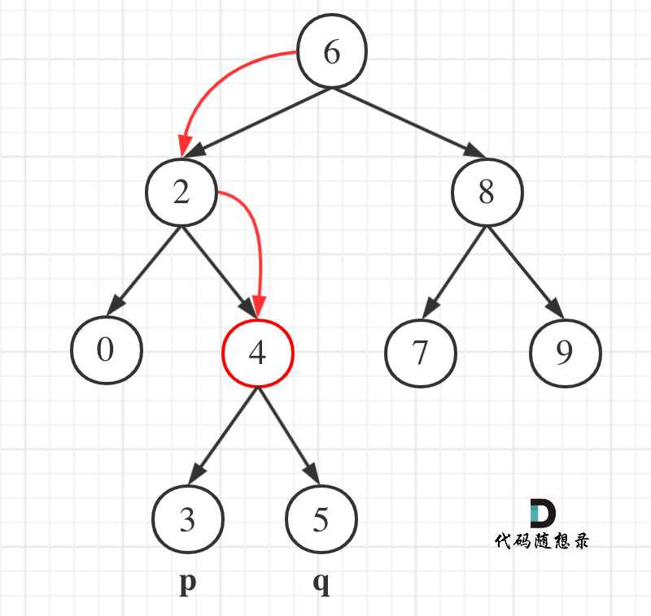
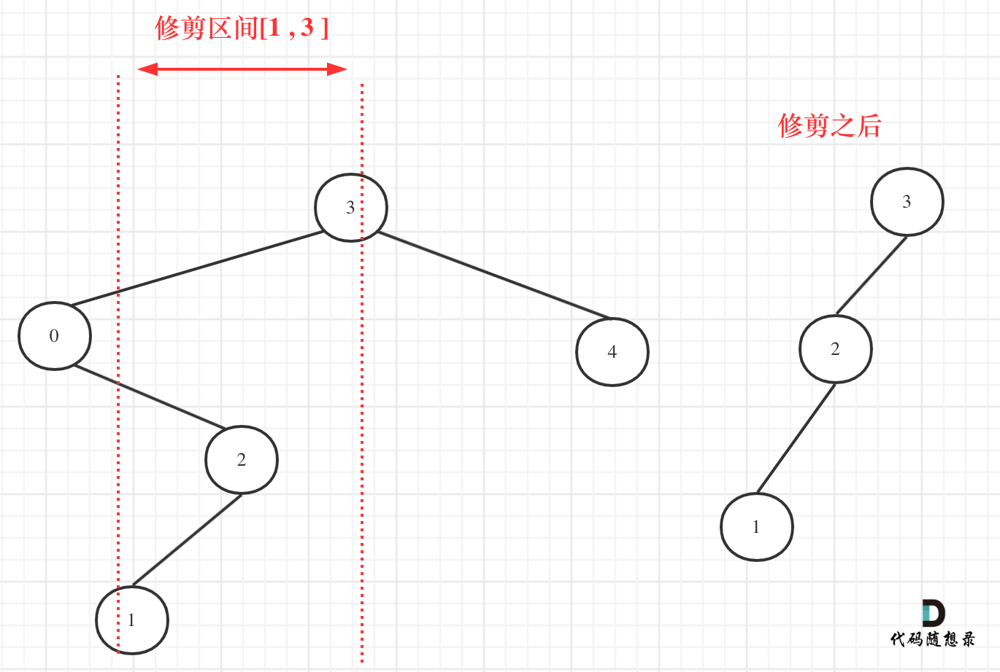

---

title: 6. 二叉树2
sidebar_position: 6.5
date: 2022-04-15

tags: [algorithm]

---


## 700. 二叉搜索树中的搜索

-  [700. 二叉搜索树中的搜索](https://leetcode-cn.com/problems/search-in-a-binary-search-tree/)
- 0429，easy，answer
- 注意递归返回的时机（return）

#### 方法一：递归

- 注意对值的判断是在函数的返回体中。

```js
var searchBST = function (root, val) {
  // 找不到，返回null
  // 找到了，返回 root
  if (!root || val === root.val) return root;

  // 如果 val < 根值，则递归左子树；否则递归右子树
  return val < root.val
    ? searchBST(root.left, val)
    : searchBST(root.right, val);
};
```

#### 方法二：迭代

```js
var searchBST = function (root, val) {
  while (root) {
    if (!root || val === root.val) break;
    root = val < root.val
      ? searchBST(root.left, val)
      : searchBST(root.right, val);
  }
  return root;
}
```


## 98. 验证二叉搜索树

- [98. 验证二叉搜索树](https://leetcode-cn.com/problems/validate-binary-search-tree/)
- 0429，mid，answer
- 中序遍历、二叉搜索树的复习


中序遍历下，输出的二叉搜索树节点的数值是有序序列。

- 判断中序遍历的结果是否是一个递增数列。

#### 方法一：中序遍历 ｜递归

- 注意递归函数是否需要返回值，根源是这个递归函数的作用是什么：
  - 本题中 dfs 的作用是判断入参 node 节点是否是一个二叉搜索树，应当返回 true 和 false；
  - 当达到叶子结点的时候，这里卡了很久。其实明白叶子结点也是一个二叉搜索树，应当返回 true。

```js
var isValidBST = function (root) {
  if (!root) return true;
  // 中序遍历出的二叉搜索树，是一个递增的有序数列，
  // 不需要保存一个数列，我们只需要判断递归出来第 k 个数 > k-1 个数，就是递增的，否则返回 false；
  let preVal;
  return dfs(root);

  function dfs(node) {
    // 左
    const leftRes = node.left ? dfs(node.left) : true;
    // 根
    // 判断第一个数时，没有 preVal，所以要判断不是 undefined
    // 非增序：返回 false 结束递归
    if (preVal !== undefined && node.val <= preVal) return false;
    // 增序：符合预期，替换 preVal
    preVal = node.val;
    // 右
    const rightRes = node.right ? dfs(node.right) : true;
    return leftRes && rightRes;
  }
};
```

#### 方法二：中序遍历 | 迭代 ｜通用方法

```js
var isValidBST = function (root) {
  if (!root) return true;
  let pre = -Infinity;
  const stack = [root];

  while (stack.length) {
    const node = stack.pop();
    // 通用法左、中、右，遇到中先放null，下次遇到读取值。
    if (node === null) {
      val = stack.pop().val;
      if ( pre < val) {
        pre = val;
        continue;
      }
      return false;
    }
    // 右
    if (node.right) stack.push(node.right);
    // 中
    stack.push(node);
    stack.push(null);
    // 左
    if (node.left) stack.push(node.left);
  }
  return true;
};
```

#### 方法三：中序遍历｜迭代

```js
var isValidBST = function (root) {
  // 迭代: 中序遍历的传统方法
  // 先遍历到最左叶子结点，然后回溯到根结点，然后遍历右节点
  // 指针访问
  if (!root) return false;
  const stack = [];
  let cur = root;
  let pre = -Infinity;
  while (stack.length || cur) {
    // 深度遍历左
    while (cur !== null) {
      stack.push(cur);
      cur = cur.left;
    }
    cur = stack.pop();
    // 回溯中
    if (pre >= cur.val) {
      return  false;
    }
    pre = cur.val
    // 遍历一次右
    cur = cur.right;
  }
  return true;
};
```


## 530. 二叉搜索树的最小绝对差

- [530. 二叉搜索树的最小绝对差](https://leetcode-cn.com/problems/minimum-absolute-difference-in-bst/)
- 0430，easy，quick
- 中序遍历的复习

二叉搜索树问题转化为有序数组问题

- pre 和 cur 求最小差绝对值

中序遍历的三种方法：

- 递归、迭代、通用迭代

#### 方法一：中序遍历｜迭代

- 迭代: 用指针控制下一个遍历元素

```js
var getMinimumDifference = function (root) {
	const stack = [];
  let cur = root;
  let pre;
  let res = Infinity;
  while (stack.length || cur !== null) {
    // 指针指向了node，则遍历这个node的左节点。
    // 指针指向了null，则没有左节点了，开始回溯遍历根和右节点。
    while (cur !== null) {
      stack.push(cur);
      // 左
      cur = cur.left;
    }
    cur = stack.pop();
    // 中
    if (pre !== undefined) {
      res = Math.min(res, cur.val - pre);
    };
    pre = cur.val;
    // 右
    cur = cur.right
  }
  return res;
};
```

#### 方法二：中序遍历｜通用迭代

- while 循环有两种执行：
  - 读取根结点值：判断 node === null，则stack 中下一个节点出栈，并读取值。
  - 迭代：分别右、中（+null）、左挨个入栈。
    - 注意：stack 结构，**左右对换**，从 **右** 开始。

```js
var getMinimumDifference = function (root) {
  const stack = [root];
  let pre;
  let res = Infinity;
  while (stack.length) {
    let node = stack.pop();
    // 如果有null，则证明应该读取根了，然后这轮while循环就是读取根，读取根后continue。
    if (node === null) {
      cur = stack.pop().val;
      if (pre !== undefined) {
        res = Math.min(res, cur - pre);
      }
      pre = cur;
      continue;
    }
    // 右
    node.right && stack.push(node.right);
    // 中，遇到放入node，放入null
    stack.push(node);
    stack.push(null);
    // 左
    node.left && stack.push(node.left);
  }
  return res;
};
```

#### 方法三：中序遍历｜递归

```js
var getMinimumDifference = function (root) {
  let pre;
  let res = Infinity;
  dfs(root);

  // 遍历所有的node
  function dfs(node) {
    // 左、中、右
    node.left && dfs(node.left);
    if (pre !== undefined) {
      res = Math.min(res, node.val - pre);
    }
    pre = node.val;
    node.right && dfs(node.right);
  }

  return res;
};
```


## 501. 二叉搜索树中的众数

- [501. 二叉搜索树中的众数](https://leetcode-cn.com/problems/find-mode-in-binary-search-tree/)
- 0430，easy，answer
- 二叉搜索树、中序遍历、众数

主要的难点是对题目的认知，题目要求出现频率最高的众数，如果有多个频率相同的众数，就返回多个。

- 结果是 n 个，不是只有一个；
- 不要通过一个长数组维护全部众数的频率，而是：
  - 用 pre 去判断当前遍历的数值是否发生改变，从而可以得出 pre 值的出现频率 count；
  - 用 count 统计 pre 值的出现频率；
  - 用 maxCount 维护当前结果的频率（遍历时，到当前为止的最大频率，但不一定是结果的最大频率）；
    - 如果 count > maxCount 则需要重置 maxCount，清空 res。
  - 用 res 维护一个数组，成员是多个最大频率相同的值。

#### 方法一：中序遍历｜递归

- 也可以使用 迭代、通用迭代两种方法，只是中序遍历方式的改变，对众数的判断一模一样，不在此列出了。

```js
var findMode = function (root) {
  if (root === null) return 0;
  // res中的最大频率、当前的频率
  let maxCount = 0;
  let count = 0;
  // 上一个结点值、最高频率元素集合
  let pre = root.val;
  let res = [];
  dfs(root);
  return res;

  // 递归
  function dfs(node) {
    // 左
    node.left && dfs(node.left);
    // 中：判断众数
    // 计算count，相等则加1，不等则重置为1
    if (node.val === pre) count++;
    else count = 1;
    pre = node.val;
    // 比较count，
    // 大于maxcount：重置 maxCount、res，并将当前值放入新res，
    // 等于maxcount：当前值放入res
    // 小于maxcount：丢弃不操作
    if (count > maxCount) {
      maxCount = count;
      res = [node.val];
    } else if (count === maxCount) {
      res.push(node.val);
    }
    // 右
    node.right && dfs(node.right);
  }
}
```


## 236. 二叉树的最近公共祖先

- [236. 二叉树的最近公共祖先](https://leetcode-cn.com/problems/lowest-common-ancestor-of-a-binary-tree/)
- 0430，mid，answer
- 最近公共祖先的概念、后序遍历、自底向上

要点：

- 理解最近公共祖先的概念：

  - 两个结点共同的根、这根深度尽可能深。
  - 公共祖先有可能是A、B节点本身。

- 公共祖先因为要找最深的节点，适用于后序遍历（天然的自底向上查找）。

  - 后序遍历的特点：对于一个最小单位树（3个结点），依次遍历左、右，最后才是中。所以根结点的左树和右树是先遍历的。

  - 回溯，当遍历到要找的 A、B结点时，会通过 回溯把这个消息告诉父节点。
    - 所以：用递归时，出现第一个结点的 left 或 right 树遍历到了 A、B 结点，那这个节点就应当是要找的最近公共祖先。


```js
var lowestCommonAncestor = function (root, p, q) {
  // 后序遍历
  return dfs(root);

  // 需要返回值：如果找到 p、q 则返回节点本身，否则返回 false
  // 会遍历整个数，把结果及时回溯。
  function dfs(root) {
    // 遇到节点为空、p、q，就返回节点本身
    if (!root || root === p || root === q) return root;
    //左
    const left = dfs(root.left);
    //右
    const right = dfs(root.right);
    //中
    // 如果left、right都有值，说明当前root节点就是最近公共祖先，返回root
    if (left && right) return root;
    // 如果只有一边有值，则向上回溯，只返回有值的一边
    return left ? left : right ? right : false;
  }
};
```

- 思考，如果查找的是 6 和 7，其最近公共祖先就是 7 本身。

  - 自然的，当我们遍历到 7 这个根结点时，会先执行：

    ```js
    // 遇到节点为空、p、q，就返回节点本身
    if (!root || root === p || root === q) return root;
    ```

    所以 7 会直接向上返回 7 本身，然后一路回溯到根结点，得到答案 7。是符合预期的。


## 235. 二叉搜索树的最近公共祖先

- [235. 二叉搜索树的最近公共祖先](https://leetcode-cn.com/problems/lowest-common-ancestor-of-a-binary-search-tree/)
- 0430，easy，answer
- 二叉搜索树的特点

**本题：遍历已经不是一个二叉树了，其实更像是一个数组，当满足条件时及时返回遍历的结果。**



二叉搜索树自带方向性：

- 可以看上图，如果查找 3 和 5，相比上一题 501，只要我们判断某一个节点位于 `[3, 5]` 之间就可以了。

具体来讲：

- 不再需要回溯，遍历到一个节点时，直接判断：
  - 如果当前节点值比 q 和 p 都小，那么下一步需要遍历 left 子树，放弃 right 子树。
  - 反之，如果当前节点值更大，那么下一步便利 right 子树。
- 最后，如果当前节点处在 `[p, q]` 区间之间（可以等于 p 或 q），左闭右闭区间，那么得到答案，返回这个节点。

#### 方法一：递归

- return 写在 左、右子树的遍历上，则每次调用 `dfs` 只会遍历其中的一边。且如果一旦命中了 `return root` 递归就会结束，携带着 root 节点一路向上 return，最终返回的结果就是 root。

```js
// 返回：q、p的公共祖先 root
var lowestCommonAncestor = function (root, p, q) {
  if (!root) return root;
  const val = root.val;

  // 左，查找左子树
  if (val > p.val && val > q.val) {
    // 如果没有左子树，则证明找不到返回null
    return lowestCommonAncestor(root.left, p, q);
  }
  // 右，查找右子树
  if (val < p.val && val < q.val) {
    // 如果没有右子树，则证明找不到返回null
    return lowestCommonAncestor(root.right, p, q);
  }
  return root;
};
```

#### 方法二：迭代

- 不是传统的遍历迭代方式，还是记住上面的图。遍历已经不是一个二叉树了，其实更像是一个数组，当满足条件时及时返回遍历的结果。

```js
var lowestCommonAncestor = function (root, p, q) {
  while (root) {
    const val = root.val;
    // 左，查找左子树
    if (val > p.val && val > q.val) {
      root = root.left;
      // 右，查找右子树
    } else if (val < p.val && val < q.val) {      
      root = root.right;
    } else {
      // 找到值
      return root;
    }
  }
  return null;
};
```


## 701. 二叉搜索树中的插入操作

- [701. 二叉搜索树中的插入操作](https://leetcode-cn.com/problems/insert-into-a-binary-search-tree/)
- 0501，mid，quick

对于如下二叉树，如果要插入 5，从 root 开始比较节点大小。


遍历节点，如果便利到 node 值 > 要插入的 val。则继续遍历 node.left，反之遍历 node.right。

- 这相当于每次面对一个小二叉树时，只选择其中一个分支遍历。

#### 方法一：迭代，我的方法

- 利用 cur 指向当前遍历的节点，pre 指向他上一个遍历的节点。
- 当 cur 遍历到 null 时，表明这是一个插入位置，然后用 pre 进行插入。

问：pre 的作用是什么？

- cur 如果指向了 null，此时 cur 已经不再指向 root 树中的任何一个节点了，无法对 root 进行增加节点的操作。所以要用 pre 指向 cur 遍历的上一个节点，然后当 cur 指向 null，表明此时可以在 pre 上增加节点了。
- 虽然知道要在 pre 上增加节点了，但不清楚是 .left 还是 .right 上添加，这时候需要再进行一次判断。

```js
var insertIntoBST = function (root, val) {
  if (!root) return new TreeNode(val);
  let cur = root;
  let pre = null;

  while (cur !== null) {
    pre = cur;
    cur = cur.val > val ? cur.left : cur.right;
  }
  // 对 pre 进行判断，确定是在左子树还是右子树上添加新节点
  pre.val > val ? pre.left = new TreeNode(val) : pre.right = new TreeNode(val);
  return root;
};
```

#### 方法二：递归

可以看到，如果使用迭代，需要用 pre 指针保留 cur 遍历到的上一个节点，方便后续的插入操作。

- cur 一旦遍历到 null，则不再指向 root 中任何一个节点了，换句话说 cur 无法再控制 root 了，必须要用另一个指针 pre “留在” root 上。
- 自上而下的递归。使用递归返回值 return ，让父节点等待一个字节点返回回来并绑定到对应的子树上，可以解决多一个 pre 的问题：

总结：

- **返回值：利用返回值完成新加入的节点与其父节点的赋值操作**。换句话说，父节点在 root.left 或 root.right 等待一个子节点，这个子节点可能是新插入的节点，也可能是和之前一样的节点。

- 终止条件：遍历的节点为 null 时，找到要插入节点的位置，把插入的节点返回。

```js
var insertIntoBST = function (root, val) {
  // 找到合适的放置位置
  if (root === null) {
    return new TreeNode(val);
  }
  // 判断是左子树还是右子树
  root.val > val
    ? root.left = insertIntoBST(root.left, val)
    : root.right = insertIntoBST(root.right, val);

  return root;
};
```


## 450. 删除二叉搜索树中的节点

- [450. 删除二叉搜索树中的节点](https://leetcode-cn.com/problems/delete-node-in-a-bst/)
- 0501，mid，answer
- 了解二叉树的删除方法、了解二叉搜索树的删除特点、
- 利用 pre 和 cur 锁定节点、利用 while 找到叶子结点

#### 方法一：迭代

两个步骤：

1. 找到要删除的元素 cur，和他的父节点 pre；
   - pre 如果为 null，择表明要删除的是根结点本身；
2. 删除 cur，并把 cur 的子树按照搜索二叉树的规则放好：
   1. `cur.left` 一定是比 `cur.right` 的所有值都要小；
   2. `cur.right` 中的最小值一定是该子树的最左下角叶子结点；
   3. 所以 `cur.left`要放置在 `cur.right` 的最左下角叶子结点下即可。


```js
var deleteNode = function (root, n) {
  if (!root) return null;
  let cur = root;
  let pre = null;

  // 找带删除节点
  while (cur !== null) {
    if (cur.val === n) break;
    pre = cur;
    cur.val > n ? cur = cur.left : cur = cur.right;
  }
  // 此时:cur指向待删除节点，pre指向cur的父节点

	// 通过pre确定删除父元素
  // pre为null，说明cur是根结点
  if (pre === null) return delNode(cur);
  pre.val > n ? pre.left = delNode(cur) : pre.right = delNode(cur);
  return root;

  // 删除node节点
  // 总体来说，就是要把node.left按照搜索二叉树的规定，放到node.right上，然后返回node.right；
  // 删除node时，要把node.left放到node.right.left.left.left...下（根据搜索二叉树的定义）
  function delNode(node) {
    if (!node) return node;
    if (!node.right) return node.left;
    let cur = node.right;
    // 找到 node.right.left.left...
    while (cur.left) {
      cur = cur.left;
    }
    cur.left = node.left
		// 	返回 node.right
    return node.right;
  }
}
```

#### 方法二：递归

- 将迭代改造为递归，其实更简单了：

```js
var deleteNode = function (root, n) {
  if (!root) return root
  // 定位到目标结点
  if (root.val === n) return delNode(root);
  // 没定位到继续递归
  root.val > n
    ? root.left = deleteNode(root.left, n)
    : root.right = deleteNode(root.right, n)
  return root


  // 和迭代中的方法相同
  function delNode(node) {
    if (!node) return node;
    if (!node.right) return node.left;
    let cur = node.right;
    // 找到 node.right.left.left...
    while (cur.left) {
      cur = cur.left;
    }
    cur.left = node.left
		// 	返回 node.right
    return node.right;
  }
}
```


## 669. 修剪二叉搜索树

- [669. 修剪二叉搜索树](https://leetcode-cn.com/problems/trim-a-binary-search-tree/)
- 0501，mid，answer
- 二叉树的特性，递归返回的时机、递归返回值的确定



上图可以直观的看到，当一个区间是 `[1, 3]` 时，把 1 和 4 节点抛弃了。[代码随想录](https://programmercarl.com/0669.%E4%BF%AE%E5%89%AA%E4%BA%8C%E5%8F%89%E6%90%9C%E7%B4%A2%E6%A0%91.html#%E9%80%92%E5%BD%92%E6%B3%95)

**搜索二叉树的修剪，一定是图中那样，把不符合区间的左右分支抛弃掉。**

- 搜索二叉树的特点：
  - 一个节点的左子树的所有成员，一定大于节点本身；
  - 一个节点的右子树的所有成员，一定大于节点本身；
- 所以，当由顶向下遍历到某个 node 时，如果 `node.val < low`，那么这个节点需要被抛弃了，随之它的 `node.left` 也要被抛弃，但它的 `node.right` 中可能有大于 low 的子树不能被抛弃。

递归 `	trimBST`：

- 返回值：返回一个经过修剪的，符合条件的子树。所以每一个 node 节点的遍历，都会在 `node.left` 和 `node.right` 等待一个返回值，最终也会返回修剪好的 node 节点自身。
- 当节点自身不符合 `[low, high]` 区间内时，则自身不能被返回。
  - 此时返回 `node.left` 或者 `node.right` 中符合条件的子树。

#### 方法一：递归

```js
var trimBST = function (root, low, high) {
  if (!root) return root;

  // 如果比low小，从 root.right 找到符合条件的子树返回，其余的节点全部抛弃
  if (root.val < low) {
    return trimBST(root.right, low, high);
  }

  // 如果比high大，从 root.left 找到符合条件的子树返回，其余的节点全部抛弃
  if (root.val > high) {
    return trimBST(root.left, low, high);
  }

  // 执行到这里，说明 node.val 在[low,high]区间内，递归左右子树，返回自身节点
  root.left = trimBST(root.left, low, high);
  root.right = trimBST(root.right, low, high);
  return root
};
```

#### 方法二：迭代｜暂时不看

**搜索二叉树的修剪，一定是图中那样，把不符合区间的左右分支抛弃掉。**

- 这是上图得出的结论，所以迭代的主要思想是：
  1. 先确定符合`[low,high]` 区间的根结点 resNode；
  2. 然后 while 循环 `res.left` 找到符合条件的左子树；
  3. 最后 while 循环 `res.right` 找到符合条件的右子树；

```js
var trimBST = function (root, low, high) {
  if (!root) return root;
  let cur = root;

  // 找到符合条件的根结点，处在 [low, high] 区间内
  while (cur !== null && (cur.val < low || cur.val > high)) {
    if (cur.val < low) cur = cur.right;
    if (cur.val > high) cur = cur.left;
  }

  // 此时cur指向符合条件[low,high]的root节点，resNode就是最后要返回的节点
  const resNode = cur;
  // 处理左子树
  while (cur !== null) {
    // 让 cur.left 处在[low,high] 区间
    while (cur.left && cur.left.val < low) cur.left = cur.left.right;
    // cur.left 处在 [low, high] 区间循环处理 cur.left.left
    cur = cur.left;
  }

  // 与resNode.left同理，处理resNode.right
  cur = resNode;
  while (cur !== null) {
    while (cur.right && cur.right.val > high) cur.right = cur.right.left;
    cur = cur.right;
  }

  // 如果比low小，从 root.right 找到符合条件的子树返回，其余的节点全部抛弃
  if (root.val < low) {
    return trimBST(root.right, low, high);
  }

  return resNode;
};
```


## 108. 将有序数组转换为二叉搜索树

- [108. 将有序数组转换为二叉搜索树](https://leetcode-cn.com/problems/convert-sorted-array-to-binary-search-tree/)
- 0501，easy，quick
- 平衡二叉树、二叉搜索树、下标分割序列构造二叉树

#### 方法一：递归

不断中间分割，然后递归处理左区间，右区间，也可以说是分治。

先从 **“中序遍历一个二叉搜索树，得出的结果是一个递增序列”** 这个规律入手。

- 中序遍历的特性是：左、中、右，要先确定序列中 **根** 的位置 `index = Math.floor(nums.length / 2);`
- 然后通过 index 把序列切分为 左、右 两个部分，递归寻找 `root.left` 和 `root.right`子树。

确定递归：

- 递归返回值：根据序列构造好的子节点本身。
- 递归的结束：
  - 序列 nums.length === 0，则返回 null，递归结束；
  - 序列 nums.length === 1，index 计算结果为 0，刚好创建一个叶子结点返回。

```js
var sortedArrayToBST = function (nums) {
  if (nums.length === 0) return null;
  // 	求序列的中间树，为根 root.val 
  const index = Math.floor(nums.length / 2);
  const root = new TreeNode(nums[index]);
  // 递归获得左、右子树
  root.left = sortedArrayToBST(nums.slice(0, index));
  root.right = sortedArrayToBST(nums.slice(index + 1, nums.length));
  // 返回构造好的子树
  return root;
};
```

#### 方法二：递归｜优化空间

- 不需要每次对 nums 进行切割，递归函数 build 传入数组的下标 left 和 right 即可。

注意：

- 求 `index`  时，不要忘记加上基数 `	left`；
- `[left, right]` 是左闭右闭区间。

```js
var sortedArrayToBST = function (nums) {
  return build(nums, 0, nums.length - 1);

  function build(nums, left, right) {
    // 递归结束
    if (left > right) return null;
		// 根结点
    const index = left + Math.floor((right - left) / 2);
    const root = new TreeNode(nums[index]);
		// 左右子树
    root.left = build(nums, left, index - 1);
    root.right = build(nums, index + 1, right);
    // 返回
    return root;
  }
};
```

- 时间复杂度：*O*(*n*)，其中 *n* 是数组的长度。每个数字只访问一次。
- 空间复杂度：O(logn)，其中 n 是数组的长度。空间复杂度不考虑返回值，因此空间复杂度主要取决于递归栈的深度，递归栈的深度是 O(logn)。
  - 为什么是 log？联想二分法：
  - 第一次递归：数组长度为 n，有两个 `left` 和 `right` 递归，则再乘以一个基数 2，但复杂度不考虑基数，所以直接忽略掉。
  - 第二次递归：数组长度为 n / 2；
  - 第三次递归：数组长度为 n / 2 * 2 == n / 4；
  - ...
  - 所以每次递归数组长度会减少一半。这样列出等式计算：[有机会自己写一个](https://blog.csdn.net/u011614717/article/details/82624095)


迭代太复杂，暂时不考虑。


## 538. 把二叉搜索树转换为累加树

- [538. 把二叉搜索树转换为累加树](https://leetcode-cn.com/problems/convert-bst-to-greater-tree/)

- 0501，mid，quick
- 累加树特性、二叉搜索树特性、中序遍历


累加树中，每个节点 node 的值是原树中 大于等于 node.val 的值之和；

二叉搜索树中，中序遍历的序列是一个递增序列；

所以：如果一个二叉搜索树遍历出来的序列是：`[3 ,8 ,11, 14]` ，则累加树就是 `[14, 25, 33, 36]`。也就从最后一个节点（最大）往前累加即可。

#### 方法一：递归｜反中序遍历

反中序遍历，也就是遍历出的结果是递减的，有些遍历右下角的节点。

- 中序遍历：左、根、右；反中序遍历：右、根、左。
- 上面例子中，反中序遍历的结果就是：`[14, 11, 8, 3]`，累加后：`[36, 33, 25, 14]`。

递归需要整个树，不需要返回值。

需要 pre 节点指向当前节点的前一个节点，方便累加。

```js
var convertBST = function(root) {
  if (!root) return root;
  let pre = null;
  dfs(root);
  return root;
  
  function dfs(node) {
    // 反中序遍历：右、中、左
    node.right && dfs(node.right);
    // 如果pre为null，则表明此时递归root结点，跳过累加
    if (pre) node.val += pre.val;
    pre = node;
    node.left && dfs(node.left);
  }
};
```

#### 方法二：迭代｜反中序遍历

有两种写法：指针写法和通用写法：

- 指针写法：
  - 先 while 到左下角叶子结点，
  - 然后回溯到父节点 node、遍历 node.right，
  - 继续 while 到叶子结点

```js
var convertBST = function (root) {
  if (!root) return root;
  let pre = null;
  let cur = root
  const stack = [];   // stack 不预先放入root，stack未来只会放入.right的结点

  while (cur !== null || stack.length) {
    // 右
    while (cur !== null) {
      stack.push(cur);   // 这里push(cur)，不是push(cur.left)
      cur = cur.right;
    }
    // 中
    cur = stack.pop();
    const ans = cur.val;
    if (pre) cur.val += pre.val;
    pre = cur;
    console.log(ans, cur.val);
    // 左
    cur = cur.left;
  }
  return root;
};
```

#### 方法三：统一迭代｜反中序遍历

- 这个方法是真的慢，尽量还是记 “指针迭代” 的方法。

```js
var convertBST = function (root) {
  if (!root) return root;
  let pre = null;
  const stack = [root];

  while (stack.length) {
    const node = stack.pop()
    // null, 读取值
    if (!node) {
      cur = stack.pop();
      if (pre) cur.val += pre.val;
      pre = cur;
      continue;
    }
    // 反中序遍历的stack，左开始
    // 左
    node.left && stack.push(node.left);
    // 中
    stack.push(node);
    stack.push(null);
    // 右
    node.right && stack.push(node.right);
  }
  return root;
};
```


- 二叉树结束：[代码随想录](https://programmercarl.com/%E4%BA%8C%E5%8F%89%E6%A0%91%E6%80%BB%E7%BB%93%E7%AF%87.html#%E4%BA%8C%E5%8F%89%E6%A0%91%E7%9A%84%E7%90%86%E8%AE%BA%E5%9F%BA%E7%A1%80)。


=== Todo List ============================

0428 - 刚做完的几道题：124，543，988，70，437 找机会复习一下，最晚 **5** 天内：5月3日前。

0430 - 复习：236、501、530、700、236，5天内，5月5日前。


经验总结：

- **所有树的题目，都想成一颗只有根、左节点、右节点 的小树。然后一颗颗小树构成整棵大树，所以只需要考虑这颗小树即可。**
- 可以不需要直接用 debugger，用 console.log() 在关键位置输出，也能及时的发现问题；
- 递归逻辑要按照以下逻辑来考虑：
  - 入参、出参；
  - 返回条件；
  - 递归条件；
- 二叉搜索树的特点：
  - 中序遍历，是一个递增序列。
  - 反中序遍历（右、中左），是一个递减序列（538题）。
  - 任意一个结点的左子树的结点，一定小于右子树的结点；
    - 任意一个结点的左子树中，最大值是 `node.left.right.right.right ...`；
    - 任意一个结点的右子树中，最大值是 `node.right.left.left.left...`；


=== 待确认 ===============================

1. root 是一个节点，就算 val 是负，其本身应当也没有正负之分， root 还是会返回 true？？
   - 想判断 `root`  是否为空，不能用 `!root`，必须用 `root !== null` 因为有可能 `root` 的值是负的。


