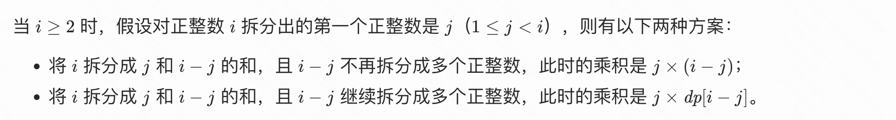

## 动态规划

定义三大步骤：

1. 确定 dp 数组及下标的含义；
2. 确定递推公式（状态转移方程）；
3. 执行：
   1. 初始化 dp 数组；
   2. 确定遍历顺序；
   3. 举例推导 dp 数组；


## 509. 斐波那契数

- [509. 斐波那契数](https://leetcode.cn/problems/fibonacci-number/)
- 0608，easy，quick
- 动态规划

定义一个 dp 数组：

```js
var fib = function (n) {
  dp = [];
  dp[0] = 0;
  dp[1] = 1;

  for (let i = 2; i <= n; i++) {
    dp[i] = dp[i - 1] + dp[i - 2];
  }
  return dp[n];
};
```

优化：将 dp 数组压缩为两个变量：

```js
var fib = function (n) {
  if (n === 0) return 0;
  if (n === 1) return 1;

  let f1 = 0, f2 = 1;
  for (let i = 2; i <= n; i++)
    [f2, f1] = [f2 + f1, f2];

  return f2;
};
```


## 70. 爬楼梯

- [70. 爬楼梯](https://leetcode.cn/problems/climbing-stairs/)

- 0608，easy，answer
- 动态规划

只有两种方法：跳一步和跳两步。所以，当要计算第 i 层有多少种方法时，如果已经知道第 i - 1 层有多少种方法；第 i - 2 层有多少种方法，相加即可。

- i - 2 层需要直接迈两步到当前楼层。不能迈一步，迈一步就成为 ` i - 1 层有多少种方法` 了

定义一个 dp 数组：

```js
  // dp[i] 爬到第i层楼梯，有多少方法：
  const dp = [];
  dp[1] = 1, dp[2] = 2;

  for (let i = 3; i <= n; i++) {
    dp[i] = dp[i - 1] + dp[i - 2];
  }
  return dp[n];
};
```

优化：改为滚动数组

```js
var climbStairs = function (n) {
  // dp[i] 爬到第i层楼梯，有多少方法：
  if (n <= 1) return n;
  const dp = [];
  dp[1] = 1;
  dp[2] = 2;

  for (let i = 3; i <= n; i++) {
    const sum = dp[2] + dp[1];
    dp[1] = dp[2], dp[2] = sum;
  }
  return dp[2];
};
```


## 746. 使用最小花费爬楼梯

- [746. 使用最小花费爬楼梯](https://leetcode.cn/problems/min-cost-climbing-stairs/)

- 0608，easy，quick
- 动态规划

复杂度：时间 / 空间 *O(n)*。

```js
var minCostClimbingStairs = function (cost) {
  // dp[i]：到达第i个台阶所花费的最少费用
  const dp = [];
  dp[0] = cost[0];
  dp[1] = cost[1];
  for (let i = 2; i < cost.length; i++) {
    dp[i] = Math.min(dp[i - 2], dp[i - 1]) + cost[i];
  }
 // 最后一步可以是倒数第二级台阶直接登顶，所以求倒数的两层台阶哪一个花费最小
  return Math.min(dp[cost.length - 2], dp[cost.length - 1]);
};
```

优化：滚动数组可以把空间复杂度压缩为 *O(1)*。

```js
var minCostClimbingStairs = function (cost) {
  const dp = [];
  dp[0] = cost[0];
  dp[1] = cost[1];
  for (let i = 2; i < cost.length; i++) {
    const sum = Math.min(dp[1], dp[0]) + cost[i];
    dp[0] = dp[1], dp[1] = sum;
  }

  return Math.min(dp[1], dp[0]);
};
```


## 62. 不同路径

- [62. 不同路径](https://leetcode.cn/problems/unique-paths/)
- 0608，mid，quick
- 动态规划

```js
var uniquePaths = function (m, n) {
  // dp[i][j]：机器人到达(i,j)时的方法总数
  const dp = Array.from(new Array(m), () => new Array(n).fill(0));
  dp[0][0] = 1;
  for (let i = 0; i < m; i++) {
    for (let j = 0; j < n; j++) {
      if (!i && !j) continue; // (0,0)的情况已初始化为1
      else if (!i) dp[i][j] = dp[i][j - 1]; //(0,x) 的情况只能向右走到达
      else if (!j) dp[i][j] = dp[i - 1][j]; //(x,0) 的情况只能向下走到达
      else dp[i][j] = dp[i - 1][j] + dp[i][j - 1]; // (i,j) 的情况向右/向下走达到
    }
  }
  return dp[m - 1][n - 1];
};
```

优化：用一维数组存储 dp

- 因为 `(i, j)` 位置只涉及到上一个、左一个位置的值。所以用一维数组 `dp[]` 统计 `(i-1, j)` 即上一列的值，然后内层 for 循环一次，就遍历了一行坐标，dp 对应更新一次。

```js
var uniquePaths = function (m, n) {
  // 初始化时，全部赋值为1，边界的第一行(i,x)全部为1。
  const dp = new Array(n).fill(1);

  for (let i = 1; i < m; i++) {
    for (let j = 1; j < n; j++) {
      // 等式右边的 dp[j] 是上一行计算的结果，也就是 (i-1,j) 的总次数。
      // 等式右边的 dp[j-1]，是上一列计算的结果，也就是 (i, j-1) 的总次数。
      dp[j] = dp[j] + dp[j - 1];
    }
  }
  return dp[n - 1];
};
```


## 63. 不同路径 II

- [63. 不同路径 II](https://leetcode.cn/problems/unique-paths-ii/)
- 0608，mid，slow
- 动态规划

在初始化时，原本（上一题）一行一列都为 1，意为有一种方法到达该点。而在这道题中，如果最上边一行的中间有一个障碍物，则障碍物右边的所有位置都无法到达。

- 所以初始化时，默认所有位置值为 0。然后对第一行、第一列进行 for 循环遍历，赋值初始化为1，当遇到障碍物时截止。


然后进行对 `(i,j)` 进行遍历，遇到障碍物就跳过（因为所有点已经初始化为0）。

- 理论上讲，如果当前点 `(i, j)` 遇到上方有障碍物，只能通过左侧走到。`dp[i][j] =  dp[i-1][j]` ，
  - 而实际上 `(i-1, j)` 这个点已经初始化为0，所以不用特殊判断，
  - 全部用 `dp[i][j] = dp[i - 1][j] + dp[i][j - 1]` 即可。

```js
var uniquePathsWithObstacles = function (obstacleGrid) {
  const m = obstacleGrid.length;
  const n = obstacleGrid[0].length;
  const dp = Array.from(new Array(m), () => new Array(n).fill(0));

  // 初始化第一列(x, 0)
  for (let i = 0; i < m && obstacleGrid[i][0] === 0; i++) dp[i][0] = 1;

  // 初始化第一行(0, x)
  for (let j = 0; j < n && obstacleGrid[0][j] === 0; j++) dp[0][j] = 1;

  for (let i = 1; i < m; i++) {
    for (let j = 1; j < n; j++) {
      // 如果当前位置有障碍，就不能到达
      if (obstacleGrid[i][j]) continue;
      dp[i][j] = dp[i - 1][j] + dp[i][j - 1];
    }
  }
  return dp[obstacleGrid.length - 1][obstacleGrid[0].length - 1];
};
```


## 343. 整数拆分

- [343. 整数拆分](https://leetcode.cn/problems/integer-break/)
- 0608，mid，answer
- 动态规划

【有点绕】

假定一个整数为 n，它被拆分后的最大乘积 k。则 n 和 k 的大小关系无法确定：

- 若 n 为 2，则拆分最大乘积为 1，小于自身；
- 若 n 为 10，则拆分最大乘积为 36，大于自身；

所以：

- 定义 `dp[i]` ：表示整数 i 的拆分最大乘积。

- 状态转移方程：

  - 利用 for 循环，让 `dp[i]` 一分为二，`j + (i-j) ` ，遍历所有一分为二的情况，注意 j 的取值范围为 `[1, n-1]`。
    - 情况一：求这两个数的乘积：`j * (i-j)`，把 i 拆分成两个数相乘；
    - 情况二：把 `j` 换为最大乘积，也就是 `dp[j]`，把 i 拆分成两个以上的数相乘；
      - 为什么没有 `j` 和 `j-i` 都拆分的情况？
      - 答：已经包含了：当 `j-i` 为 1 的时候

  - `dp[i]` 最终的值就是 for 循环中所有的情况（每一个 j 对应的这两种情况）的最大值。



```js
var integerBreak = function (n) {
  // dp[i] 表示正整数i的最大乘积
  const dp = [];
  dp[2] = 1;
  for (let i = 3; i <= n; i++) {
    //把i拆分为：j + (i-j) 两个数。j的取值范围：2~j-1
    let curMax = 0;
    for (let j = 1; j < i - 1; j++) {
      curMax = Math.max(curMax, j * (i - j), j * dp[i - j]);
    }
    dp[i] = curMax;
  }
  return dp[n];
};
```


## 96. 不同的二叉搜索树

- [96. 不同的二叉搜索树](https://leetcode.cn/problems/unique-binary-search-trees/)
- 0609，mid，answer
- 动态规划

非常的费解：[🔗](https://www.programmercarl.com/0096.%E4%B8%8D%E5%90%8C%E7%9A%84%E4%BA%8C%E5%8F%89%E6%90%9C%E7%B4%A2%E6%A0%91.html#%E6%80%9D%E8%B7%AF)

```js
```


思路：

第一步：求最大值为 n 时，可以构造出几种二叉搜索树

1. 问题转化为元素有 n 个时，可以构造出几种二叉搜索树；
2. 1~n 这几个结点，每个结点都有可能当作头结点；
3. 如果 i 为头结点，则左子树的元素为：`[1, i-1]`，右子树的元素为：`[i+1, n]`；
4. 则 i 为头结点时构造出的总数 = 元素个数为 `i` 时构造的二叉搜索树总数 * 元素个数为 `n - i+1` 时构造的二叉搜索树总数。
5. 以此类推，把 1～n 全部的总数全部累加即可。

得出递归，但此方法超过最大调用栈：


```js
var numTrees = function (n) {
  if (n <= 1) return 1;
  let count = 0;
  for (let i = 0; i <= n; i++) {
    const leftNum = numTrees(i);
    const rightNum = numTrees(n - i);
    count += leftNum * rightNum;
  }
  return count;
};
```


