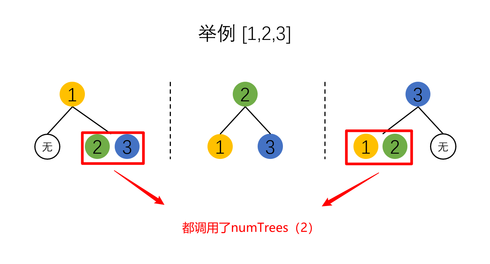
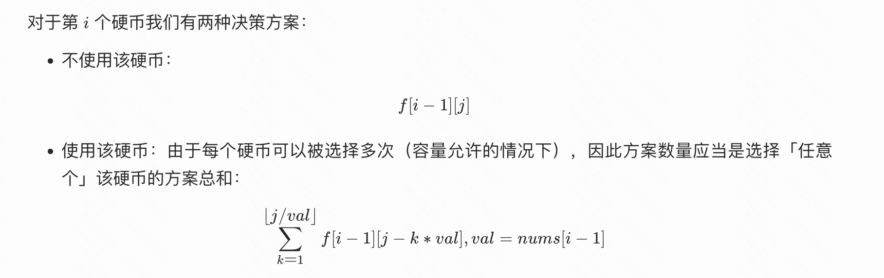

动态规划（1）主要讲了动态规划基本题型 + 0 1 背包问题、完全背包问题


## 动态规划

定义三大步骤：

1. 确定 dp 数组及下标的含义；
2. 确定递推公式（状态转移方程）；
3. 执行：
   1. 初始化 dp 数组；
   2. 确定遍历顺序；
   3. 举例推导 dp 数组；


## 509. 斐波那契数

- [509. 斐波那契数](https://leetcode.cn/problems/fibonacci-number/)
- 0608，easy，quick
- 动态规划

定义一个 dp 数组：

```js
var fib = function (n) {
  dp = [];
  dp[0] = 0;
  dp[1] = 1;

  for (let i = 2; i <= n; i++) {
    dp[i] = dp[i - 1] + dp[i - 2];
  }
  return dp[n];
};
```

优化：将 dp 数组压缩为两个变量：

```js
var fib = function (n) {
  if (n === 0) return 0;
  if (n === 1) return 1;

  let f1 = 0, f2 = 1;
  for (let i = 2; i <= n; i++)
    [f2, f1] = [f2 + f1, f2];

  return f2;
};
```


## 70. 爬楼梯

- [70. 爬楼梯](https://leetcode.cn/problems/climbing-stairs/)

- 0608，easy，answer
- 动态规划

只有两种方法：跳一步和跳两步。所以，当要计算第 i 层有多少种方法时，如果已经知道第 i - 1 层有多少种方法；第 i - 2 层有多少种方法，相加即可。

- i - 2 层需要直接迈两步到当前楼层。不能迈一步，迈一步就成为 ` i - 1 层有多少种方法` 了

定义一个 dp 数组：

```js
  // dp[i] 爬到第i层楼梯，有多少方法：
  const dp = [];
  dp[1] = 1, dp[2] = 2;

  for (let i = 3; i <= n; i++) {
    dp[i] = dp[i - 1] + dp[i - 2];
  }
  return dp[n];
};
```

优化：改为滚动数组

```js
var climbStairs = function (n) {
  // dp[i] 爬到第i层楼梯，有多少方法：
  if (n <= 1) return n;
  const dp = [];
  dp[1] = 1;
  dp[2] = 2;

  for (let i = 3; i <= n; i++) {
    const sum = dp[2] + dp[1];
    dp[1] = dp[2], dp[2] = sum;
  }
  return dp[2];
};
```


## 746. 使用最小花费爬楼梯

- [746. 使用最小花费爬楼梯](https://leetcode.cn/problems/min-cost-climbing-stairs/)

- 0608，easy，quick
- 动态规划

复杂度：时间 / 空间 *O(n)*。

```js
var minCostClimbingStairs = function (cost) {
  // dp[i]：到达第i个台阶所花费的最少费用
  const dp = [];
  dp[0] = cost[0];
  dp[1] = cost[1];
  for (let i = 2; i < cost.length; i++) {
    dp[i] = Math.min(dp[i - 2], dp[i - 1]) + cost[i];
  }
 // 最后一步可以是倒数第二级台阶直接登顶，所以求倒数的两层台阶哪一个花费最小
  return Math.min(dp[cost.length - 2], dp[cost.length - 1]);
};
```

优化：滚动数组可以把空间复杂度压缩为 *O(1)*。

```js
var minCostClimbingStairs = function (cost) {
  const dp = [];
  dp[0] = cost[0];
  dp[1] = cost[1];
  for (let i = 2; i < cost.length; i++) {
    const sum = Math.min(dp[1], dp[0]) + cost[i];
    dp[0] = dp[1], dp[1] = sum;
  }

  return Math.min(dp[1], dp[0]);
};
```


## 62. 不同路径

- [62. 不同路径](https://leetcode.cn/problems/unique-paths/)
- 0608，mid，quick
- 动态规划

```js
var uniquePaths = function (m, n) {
  // dp[i][j]：机器人到达(i,j)时的方法总数
  const dp = Array.from(new Array(m), () => new Array(n).fill(0));
  dp[0][0] = 1;
  for (let i = 0; i < m; i++) {
    for (let j = 0; j < n; j++) {
      if (!i && !j) continue; // (0,0)的情况已初始化为1
      else if (!i) dp[i][j] = dp[i][j - 1]; //(0,x) 的情况只能向右走到达
      else if (!j) dp[i][j] = dp[i - 1][j]; //(x,0) 的情况只能向下走到达
      else dp[i][j] = dp[i - 1][j] + dp[i][j - 1]; // (i,j) 的情况向右/向下走达到
    }
  }
  return dp[m - 1][n - 1];
};
```

优化：用一维数组存储 dp

- 因为 `(i, j)` 位置只涉及到上一个、左一个位置的值。所以用一维数组 `dp[]` 统计 `(i-1, j)` 即上一列的值，然后内层 for 循环一次，就遍历了一行坐标，dp 对应更新一次。

```js
var uniquePaths = function (m, n) {
  // 初始化时，全部赋值为1，边界的第一行(i,x)全部为1。
  const dp = new Array(n).fill(1);

  for (let i = 1; i < m; i++) {
    for (let j = 1; j < n; j++) {
      // 等式右边的 dp[j] 是上一行计算的结果，也就是 (i-1,j) 的总次数。
      // 等式右边的 dp[j-1]，是上一列计算的结果，也就是 (i, j-1) 的总次数。
      dp[j] = dp[j] + dp[j - 1];
    }
  }
  return dp[n - 1];
};
```


## 63. 不同路径 II

- [63. 不同路径 II](https://leetcode.cn/problems/unique-paths-ii/)
- 0608，mid，slow
- 动态规划

在初始化时，原本（上一题）一行一列都为 1，意为有一种方法到达该点。而在这道题中，如果最上边一行的中间有一个障碍物，则障碍物右边的所有位置都无法到达。

- 所以初始化时，默认所有位置值为 0。然后对第一行、第一列进行 for 循环遍历，赋值初始化为1，当遇到障碍物时截止。


然后进行对 `(i,j)` 进行遍历，遇到障碍物就跳过（因为所有点已经初始化为0）。

- 理论上讲，如果当前点 `(i, j)` 遇到上方有障碍物，只能通过左侧走到。`dp[i][j] =  dp[i-1][j]` ，
  - 而实际上 `(i-1, j)` 这个点已经初始化为0，所以不用特殊判断，
  - 全部用 `dp[i][j] = dp[i - 1][j] + dp[i][j - 1]` 即可。

```js
var uniquePathsWithObstacles = function (obstacleGrid) {
  const m = obstacleGrid.length;
  const n = obstacleGrid[0].length;
  const dp = Array.from(new Array(m), () => new Array(n).fill(0));

  // 初始化第一列(x, 0) 遇到障碍之前
  for (let i = 0; i < m && obstacleGrid[i][0] === 0; i++) dp[i][0] = 1;

  // 初始化第一行(0, x) 遇到障碍之前
  for (let j = 0; j < n && obstacleGrid[0][j] === 0; j++) dp[0][j] = 1;

  for (let i = 1; i < m; i++) {
    for (let j = 1; j < n; j++) {
      // 如果当前位置有障碍，就不能到达
      if (obstacleGrid[i][j]) continue;
      dp[i][j] = dp[i - 1][j] + dp[i][j - 1];
    }
  }
  return dp[obstacleGrid.length - 1][obstacleGrid[0].length - 1];
};
```


## 343. 整数拆分

- [343. 整数拆分](https://leetcode.cn/problems/integer-break/)
- 0608，mid，answer
- 动态规划

【有点绕】

假定一个整数为 n，它被拆分后的最大乘积 k。则 n 和 k 的大小关系无法确定：

- 若 n 为 2，则拆分最大乘积为 1，小于自身；
- 若 n 为 10，则拆分最大乘积为 36，大于自身；

所以：

- 定义 `dp[i]` ：表示整数 i 的拆分最大乘积。

- 状态转移方程：

  - 利用 for 循环，让 `dp[i]` 一分为二，`j + (i-j) ` ，遍历所有一分为二的情况，注意 j 的取值范围为 `[1, n-1]`。
    - 情况一：求这两个数的乘积：`j * (i-j)`，把 i 拆分成两个数相乘；
    - 情况二：把 `j` 换为最大乘积，也就是 `dp[j]`，把 i 拆分成两个以上的数相乘；
      - 为什么没有 `j` 和 `j-i` 都拆分的情况？
      - 答：已经包含了：当 `j-i` 为 1 的时候

  - `dp[i]` 最终的值就是 for 循环中所有的情况（每一个 j 对应的这两种情况）的最大值。


```js
var integerBreak = function (n) {
  // dp[i] 表示正整数i的最大乘积
  const dp = [];
  dp[2] = 1;
  for (let i = 3; i <= n; i++) {
    //把i拆分为：j + (i-j) 两个数。j的取值范围：2~j-1
    let curMax = 0;
    for (let j = 1; j < i - 1; j++) {
      curMax = Math.max(curMax, j * (i - j), j * dp[i - j]);
    }
    dp[i] = curMax;
  }
  return dp[n];
};
```


## 96. 不同的二叉搜索树

- [96. 不同的二叉搜索树](https://leetcode.cn/problems/unique-binary-search-trees/)
- 0609，mid，answer
- 动态规划

构造二叉搜索树，重点不是这棵树的最大值，而是这棵树的元素总数。

- 换句话说，最大值为 n 时，可以构造出的二叉搜索树总数 === 元素为 `[2, n+2]` 时可以构造出的二叉搜索树总数。重点是看总数量，是否从 0 开始则不是必须的。
- 随时复习：二叉搜索树的中序遍历结果是一个递增序列。

三种方法是依次递增的：

- 暴力递归、优化递归、最后总结出动态规划。

#### 方法一：递归｜暴力

思路：

第一步：求最大值为 n 时，可以构造出几种二叉搜索树

1. 问题转化为元素有 n 个时，可以构造出几种二叉搜索树；
2. 1~n 这几个结点，每个结点都有可能当作头结点；
3. 如果 i 为头结点，则左子树的元素为：`[1, i-1]`，右子树的元素为：`[i+1, n]`；
4. 则 i 为头结点时构造出的总数 = 元素总数为 `i-1` 时构造的二叉搜索树总数 * 元素总数为 `n - i` 时构造的二叉搜索树总数。
5. 以此类推，把 1～n 全部的总数全部累加即可。

得出递归：


```js
var numTrees = function (n) {
  if (n <= 1) return 1;
  let count = 0;
  for (let i = 1; i <= n; i++) {
    const leftNum = numTrees(i - 1);
    const rightNum = numTrees(n - i);
    count += leftNum * rightNum;
  }
  return count;
};
```

#### 方法二：递归｜优化

第二步：减少重复计算

上面的问题是，元素个数位 i 时可以构造的二叉搜索树总数，有可能会重复计算，需要剔除这些重复计算：



用 map 结构统计，按元素总数的不同分别记录：

```js
var numTrees = function (n) {
  const map = new Map();
  map.set(0, 1);  // 当元素总数为0时，为了方便做乘积运算，设置为1.
  map.set(1, 1);
  return getTrees(n);

  function getTrees(n) {
    if (map.has(n))  return map.get(n);

    let count = 0;
    for (let i = 1; i <= n; i++) {
      const leftNum = getTrees(i - 1);
      const rightNum = getTrees(n - i);
      count += leftNum * rightNum;
    }
    map.set(n, count);
    return count;
  }
};
```

#### 方法三：动态规划｜总结

从上面的递归思路可以总结出结论：

把 map 结构转化为一个 array 结构。array 中成员下标就是对应 map 的 key，值就是对应 map 的 value，这个 array 其实是一个 dp：

设：`dp[i]` 表示元素总数为 i 时，可构造二叉搜索树的总个数。

当元素总数为 3 时，分别有：

1. 头结点为 1 时，左子树总数为 0，右子树总数为 2。可构造二叉搜索树的总个数为：dp[0] * dp[2]
2. 头结点为 2 时，左子树总数为 1，右子树总数为 1。可构造二叉搜索树的总个数为：dp[1] * dp[1]
3. 头结点为 3 时，左子树总数为 2，右子树总数为 0。可构造二叉搜索树的总个数为：dp[2] * dp[0]

最后：`dp[3] = dp[0] * dp[2] + dp[1] * dp[1] + dp[2] * dp[0];`

以此推广，当元素总数为 i 时，动态转移方程为：

- 遍历所有头结点的情况：头结点 j 的范围为`[1, i-1]`。
  - 假设 i = 7，j = 3：则左侧元素个数为 `j-1` ==> 2，右侧元素个数为 `i-j` ==> 4。
- `dp[i] += dp[j-1] * dp[i-j]`

```js
for (let i = 2; i <=n; i++) {  // 从2开始，0和1已经初始化为1
  for (let j = 1; j <=i; j++) {
    dp[i] += dp[j-1] * dp[i-j];
  }
}
```

最后，得代码：

```js
var numTrees = function (n) {
  // 因为dp[i]在for循环重要做 += 运算，所以必须有一个初始值
  const dp = new Array(n + 1).fill(0);
  dp[0] = 1, dp[1] = 1;

  for (let i = 2; i <= n; i++) {
    for (let j = 1; j <= i; j++) {
      dp[i] += dp[j - 1] * dp[i - j];
    }
  }
  return dp[n]
};
```


## 0 1 背包问题

**理解不了，就自己画一个二维数组模拟过程，然后执行代码的同时console.log一下过程。**

作为「0-1 背包问题」，它的特点是：「每个数只能用一次」。解决的基本思路是：**物品一个一个选，容量也一点一点增加去考虑**，这一点是「动态规划」的思想，特别重要。

举例：[🔍](https://www.programmercarl.com/%E8%83%8C%E5%8C%85%E7%90%86%E8%AE%BA%E5%9F%BA%E7%A1%8001%E8%83%8C%E5%8C%85-1.html#_01-%E8%83%8C%E5%8C%85)

背包最大重量为 4 。物品为：

|       | 重量 | 价值 |
| ----- | ---- | ---- |
| 物品0 | 1    | 15   |
| 物品1 | 3    | 20   |
| 物品2 | 4    | 30   |

问背包能背的物品最大价值是多少？

- 重量数组：`weight`，其中 `weight[i]` 表示物品 i 的重量；
- 价值数组：`value`，其中 `value[i]` 物品 i 的价值。

#### 二维dp数组

动态规划的 3 + 2 步：

1. **dp 数组的含义**

`dp[i][j]` ：从下标为 [0-i] 的物品里任意取 x 个，放进容量为 j 的背包，所得价值总和最大是多少。


2. **递推公式**

从 `dp[i-1][xxx]` 系列中（也就是从 [1, i-1] 随便取的最大价值），有两个情况可以推出来 `dp[i][j]`：

- **不放物品 i**：由 `dp[i - 1][j]` 推出，即背包容量为 `j`，里面不放物品 `i ` 的最大价值，此时 `dp[i][j]` 就是 `dp[i - 1][j]` 。
  - 当物品 i 的重量大于背包 j 的重量时，物品 i 无法放进背包中，所以被背包内的价值依然和前面相同。
- **放入物品 i**：由 `dp[i - 1][j - weight[i]]` 推出，`dp[i - 1][j - weight[i]]` 为背包容量为 `j - weight[i]` 的时候不放物品 i 的最大价值，那么 `dp[i - 1][j - weight[i]] + value[i]` （物品i的价值），就是背包放物品 i 得到的最大价值。

所以递归公式： `dp[i][j] = max(dp[i - 1][j], dp[i - 1][j - weight[i]] + value[i])`;

3. **初始化 dp 数组**

二维 dp 的初始化，主要在讨论上边 / 左边 两条边的情况：

- 当背包容量 j === 0 时，啥都放不下，所以 `dp[x][0]` 应当都为 0；
- 当物品 i === 0 时，只有一个物品可以讨论，当背包容量可以下 i 时，最大利润就是 `value[0]`，放不下，最大利润是 `0`；


所以，初始化是把二维数组的所有成员都置为0，然后重置一下 `dp[0][x]` 最上方一行即可。

4. **遍历顺序**

```js
for (let i = 1; i < weight.length; i++) {	// 遍历物品
  for (let j = 0; j <= bagweight; j++) {	// 遍历背包容量
    if (j < weight[i]) dp[i][j] = dp[i - 1][j];  // 如果本身就放不下
    else dp[i][j] = Math.max(dp[i - 1][j], dp[i - 1][j - weight[i]] + value[i]);
  }
}
```

5. **模拟推导**


代码：

```js
var weightbagproblem = function (weight, value, bagweight) {
  // 定义dp
  const dp = Array.from(new Array(weight.length), () => new Array(bagweight + 1).fill(0));
  
  // 初始化 dp[0][x]
  for (let j = weight[0]; j <= bagweight; j++)
    dp[0][j] = value[0];

  for (let i = 1; i < weight.length; i++) {	// 遍历物品
    for (let j = 0; j <= bagweight; j++) {	// 遍历背包容量
      if (j < weight[i]) dp[i][j] = dp[i - 1][j];  // 如果本身就放不下
      else dp[i][j] = Math.max(dp[i - 1][j], dp[i - 1][j - weight[i]] + value[i]);
    }
  }
  return dp[weight.length - 1][bagweight];
};

console.log(weightbagproblem([1, 3, 4, 5], [15, 20, 30, 55], 6));
```

#### 一维dp数组（滚动数组）

**1. 定义 dp 数组**

将二维数组转化为一维数组：`dp[i][j]` ====> `dp[j]`

**2. 定义状态转移方程**

上一题中，状态转移方程：

```js
dp[i][j] = Math.max(dp[i - 1][j], dp[i - 1][j - weight[i]] + value[i]);
```

可以看到，`dp[i][j]` 是从 `dp[i-1][x]` 这一行得出的，在二维数组dp中，就是 `dp[i][j]` 的上一行。所以，当前判断的 dp 值，只依赖它上一行的一维 dp 数组。而其余的一维数组则没必要维护了。

修改后的状态转移方程：

```js
dp[j] = Math.max(dp[j], dp[j - weight[i]] + value[i]);
```

但是需要注意的是，这里利用一维数组 `dp[]` 的反复写入，即新一行 `dp[i][x]` 的结果，会覆盖 `dp[i-1][x]` 的数据。所以要在写入时，要避免先覆盖掉后面还要用的值。比如 ：

```js
// 假如 weight(2) = 1
// 遍历某行 2： 
dp[1] = Math.max(dp[1], dp[1 - weight[2]] + value[2]); // ==> Math.max(dp[1], dp[0] + value[2])
dp[2] = Math.max(dp[2], dp[2 - weight[2]] + value[2]); // ==> Math.max(dp[2], dp[1] + value[2])
...
```

**3. 一维dp数组初始化**

初始化放在了 for 循环遍历中，外层的 i 从 0 开始遍历。

唯一需要确定的是 `dp[0] = 0`。

**4. 定义 for 遍历**

这里可以看到，在求 `dp[1]` 时，用到了 `dp[0]` 的值；在求 `dp[2]` 时，用到了 `dp[1]` 的值：

也就是 `dp[i]` 数组中靠后的数，会用到在数组中它左边的 / 更靠前的值。那么我们在进行循环时，不能从左到右循环，提前覆盖掉会用的值，而是从右到左循环，先覆盖靠后的数。

同时，j 的遍历范围为 `[weight[i], bagWeight]`这里做了一个剪枝：

- 背包容量只有大于当前物品 i 的重量（weight[i]）时，`dp[j]` 才有可能比之前有更大的值，否则背包放不下物品 i，`dp[j]` 的值不会发生改变。
  - 这样子就省去了在两层 for 循环中，再添加一个 if 判断情况了。
  - 同时也进行了 i == 0 时的 dp 初始化。

得到 for 循环：

```js
for (let i = 0; i < weight.length; i++) { // 遍历物品
  for (let j = bagWeight; j >= weight[i]; j--) { // 遍历背包容量
    dp[j] = Math.max(dp[j], dp[j - weight[i]] + value[i]);
  }
}
```

最后代码如下：

```js
var weightbagproblem = function (weight, value, bagweight) {
  // 定义dp
  const dp = new Array(bagweight + 1).fill(0);
  
  // i从0开始遍历，达到初始化 dp[0][x]
  for (let i = 0; i < weight.length; i++) {	// 遍历物品
    for (let j = bagweight; j >= weight[i]; j--) {	// 遍历背包容量
				dp[j] = Math.max(dp[j], dp[j - weight[i]] + value[i]);
    }
  }
  return dp[bagweight];
};

console.log(weightbagproblem([1, 3, 4, 5], [15, 20, 30, 55], 6));
```


## 416. 分割等和子集

- [416. 分割等和子集](https://leetcode.cn/problems/partition-equal-subset-sum/)
- 0609，mid，
- 动态规划、背包问题

#### 方法一：背包｜二维dp

0 1 背包问题：`dp[i][j]`，表示随意选取在区间 `[0, i]` 内的物品，可以将容量为 `j` 的背包装满（或尽可能满）。

而这道题要求：随意选取在区间 `[0, nums.length]` 内的数字，可否等于 **数组 nums 全部数字和的一半**。

- 这里转化为 01 背包，需要考虑的点就是 “将数字分割相等的两个子集”，其实就是选取一些数，其和是 nums 总和的一半。

（1）定义二维 dp

`dp[i][j]` 表示选取区间 `[0,i]` 之间的数字，其总和是否刚好等于 `j`。等于为 true，不等于为 false。

（2）确定状态转移方程：

有2种情况：

- 不选择 `nums[i]`：如果 `[0, i-1]` 的选择区间内，已经有一部分元素的和为 `j`，这里继续用同样的选择方案，自然也可以为 true。
- 选择 `nums[i]`：`[0, i-1]` 的选择区间内，刚好有总和等于 `j - nums[i]` 的。如果 `dp[i-1][j - nums[i]] === true`，那么 `dp[i][j]` 就相当于在 `dp[i-1][j - nums[i]]` 的基础上，多加一个新纳入可选择区间的 `nums[i]`，自然也为 true。

两种情况只要有一个为 true， `dp[i][j]` 就可以为 ture。

```js
dp[i][j] = dp[i-1][j] 或者 dp[i-1][j- nums[i]]
```

但判断不选择时，要先判断 `j- nums[i]` 是否大于等于 0，如果小于 0 则不存在 `dp[i-1][j- nums[i]]`。如果等于 0 ，则刚好可以放下 `nums[i]`，从这里可以看到下一步初始化的一些问题：

- `	dp[x][0]` 应当等于 true。

（3）初始化 dp

初始化时，要考虑左边、上边的两条边界是否需要初始化。

- `dp[x][0]` 中，`dp[x][0] = true`
- `dp[0][x]` 中，`dp[0][nums[0]] = true`

（4）for 循环

- 外层遍历 i：从 0 ~ nums.length - 1，是每次可选择的区间。

- 内层遍历 j：从 0 ~ nums 总和的一半。

得代码：

```js
var canPartition = function (nums) {
  // 如果长度为1，则直接false
  if (nums.length <= 1) return false;

  // 求数组总和的一半
	let count = nums.reduce((prev, curv) => prev + curv);
  // 如果总和不是2的倍数，无法平均分两半，则直接返回false
  if (count % 2 !== 0) return false;
  count = count / 2;

  // dp[i][j] 表示选取区间[0,i]之间的数字，其总和是否刚好等于j
  const dp = Array.from(new Array(nums.length), () => new Array(count).fill(false));
  // 初始化：
  dp[0][nums[0]] = true;
  for (let i = 0; i < nums.length; i++)
    dp[i][0] = true;

  for (let i = 1; i < nums.length; i++) {
    for (let j = 0; j <= count; j++) {
      if (j - nums[i] < 0) dp[i][j] = dp[i - 1][j];
      else dp[i][j] = dp[i - 1][j] || dp[i - 1][j - nums[i]];
    }
  }
  return dp[nums.length - 1][count];
};
```


#### 方法二：背包｜一维dp

背包问题是可以把二维 dp 优化为一维 dp 的：

定义：`dp[j]` 判断选取 **当前区间** 之间的数字，其总和是否刚好等于 j。

状态转移方程：

```js
for (let i = 1; i < nums.length; i++) {
  for (let j = count; j >= nums[i]; j++) { // j 从后往前遍历
		dp[j]  = dp[j - nums[i]];
  }
}
```

最后的代码：

```js
var canPartition = function (nums) {
  // 如果长度为1，则直接false
  if (nums.length <= 1) return false;

  // 求数组总和的一半
	let count = nums.reduce((prev, curv) => prev + curv);
  // 如果总和不是2的倍数，无法平均分两半，则直接返回false
  if (count % 2 !== 0) return false;
  count = count / 2;

  // dp[j] 表示选取区间[0,i]之间的数字，其总和是否刚好等于j
  const dp = new Array(count).fill(false);
  // 初始化：
  dp[nums[0]] = true;
  dp[0] = true;

  for (let i = 1; i < nums.length; i++) {
    for (let j = count; j >= nums[i]; j--) { // j 从后往前遍历
      // 如果 dp[j] == ture，则不选择 nums[i] 的方案已经可以，直接跳过;
      if (dp[j]) continue;
      // 如果 dp[j] !== false，则看看选择 nums[i] 的方案是否可行
      dp[j] = dp[j - nums[i]];
    }
  }

  return dp[count];
};
```


## 1049. 最后一块石头的重量 II（待做）

- [1049. 最后一块石头的重量 II](https://leetcode.cn/problems/last-stone-weight-ii/)
- 不是top100题
- [🔍](https://www.programmercarl.com/1049.%E6%9C%80%E5%90%8E%E4%B8%80%E5%9D%97%E7%9F%B3%E5%A4%B4%E7%9A%84%E9%87%8D%E9%87%8FII.html#_1049-%E6%9C%80%E5%90%8E%E4%B8%80%E5%9D%97%E7%9F%B3%E5%A4%B4%E7%9A%84%E9%87%8D%E9%87%8F-ii)


## 494. 目标和

- [494. 目标和](https://leetcode.cn/problems/target-sum/)
- 0610，mid，answer
- 动态规划，背包问题

思路转化为背包问题

本题和 416 分割等和子集的转换思路相似。01背包问题是选或者不选，但本题必须选，是选+还是选-。先将本问题转换为01背包问题。

假设所有符号为 + 的元素和为 x，符号为 - 的元素和的绝对值是 y。

我们想要的 target = 正数和 - 负数和 = x - y；已知 x 与 y 的和就是数组所有元素的总和：x + y = sum。

所以：`x - (sum - x) = target ===> x = (target + sum) / 2 `。

得出转化：

也就是我们要从 nums 数组里选出几个数，令其和为 x。

于是转化成了求容量为 x 的 01 背包问题 => 要装满容量为 x 的背包，有几种方案。

（1）定义 dp

`dp[i][j]`：表示在 `[0, i]` 区间内任意选择，填满总和为 j 的背包，有几种方案。

直接压缩为一维 `dp[j]`。

（2）状态转移方程

两种情况：不选择 `nums[i]` + 选择 `nums[i]` 

```js
dp[j] = dp[j] + dp[j - num[i]]
```

（3）初始化

特例1：如果 target 都绝对值大于数组总和 sum，不可能实现，返回 0；

特例2：如果 target + sum 不是偶数，这导致 x 不是整数，无法实现，返回 0；

```js
// 初始化
dp[0] = 1;  
dp[nums[0]] = nums[0] === 0 ? 2 : 1;
```

不能初始化 `dp[nums[i]] = 1`，因为背包容量有 0 的情况，假设：nums = [0, 0]，背包容量为 0；

**则 `dp[0][0]` 为 2：**

- 选择物品 0，则总容量为 0，满足要求；
- 不选择物品 0，则总容量为 0，也满足要求。

所以，当 `nums[0]` 为 0 时，dp[nums[0]] 也就是 dp[0]，也就是为 2。

（4）遍历

```js
for (let i = 1; i < nums.length; i++) { 
  for (let j = bagSize; j >= nums[i]; j--) {
    dp[j] += dp[j - nums[i]];
  }
}
```

得出代码：

- 优化初始化，只需要 dp[0] = 1，然后 for 循环从 0 开始遍历 i

```js
var findTargetSumWays = function (nums, target) {
  const sum = nums.reduce((prev, curv) => prev + curv);
  // 特例
  if (Math.abs(target) > sum) return 0;
  if ((sum + target) % 2) return 0;
  // 求 bagSize
  const bagSize = (sum + target) / 2;
  const dp = new Array(bagSize + 1).fill(0);
  // 初始化
  dp[0] = 1;

  for (let i = 0; i < nums.length; i++) {   // 从0开始，只初始化dp[0]=1
    for (let j = bagSize; j >= nums[i]; j--) {
      dp[j] += dp[j - nums[i]];
    }
  }
  return dp[bagSize];
};
```


## 474.一和零(待做)

- [474. 一和零](https://leetcode.cn/problems/ones-and-zeroes/)
- 不是 top100的题目：[🔍](https://www.programmercarl.com/0474.%E4%B8%80%E5%92%8C%E9%9B%B6.html#_474-%E4%B8%80%E5%92%8C%E9%9B%B6)


## 完全背包问题

有N件物品和一个最多能背重量为W的背包。第i件物品的重量是weight[i]，得到的价值是value[i] 。每件物品都有无限个（也就是可以放入背包多次），求解将哪些物品装入背包里物品价值总和最大。

完全背包和01背包问题唯一不同的地方就是，每种物品有无限件。

#### 二维dp数组

#### 一维dp数组（滚动数组）

整体思路与 0 1 背包相差不大，主要的区别在于遍历的时机：

首先在回顾一下01背包的核心代码

```js
for(let i = 0; i < weight.length; i++) { // 遍历物品
  for(let j = bagWeight; j >= weight[i]; j--) { // 遍历背包容量，倒序
    dp[j] = Math.max(dp[j], dp[j - weight[i]] + value[i]); // 不选择 + 选择
  }
}
```

我们知道 0 1 背包内嵌的循环是从大到小遍历，为了保证每个物品仅被添加一次。

而完全背包的物品是可以添加多次的，所以物品是从小到大去遍历，即：

- `dp[i-1][j]`：表示从 `[0, i-1]` 中选择出容量为 j 的最大价值；

- `dp[i][j]`：表示从 `[0, i]` 中选择出容量为 j 的最大价值；
  - 在选择物品 i 时，可以选择 1 次、2次、3次 ...
  - `dp[j - weight[i]]`：从小开始遍历时，较大的数会复用刚更新的较小的数。[科学的证明](https://mp.weixin.qq.com/s/nke1OjkhKACaONx1opk8AA)

以下是零钱兑换II 的推导，其原理是一样的，这个易懂：

```js
// 第i种硬币的面值
v = coins[i]

// 不选 + 选1个 + 选2个 + ... + 选k个
dp[i][j]   = dp[i-1][j]   + dp[i-1][j-v] + dp[i-1][j-2v] + .... + dp[i-1][j-kv]);
dp[i][j-v] = dp[i-1][j-v] + dp[i-1][j-2v]+ dp[i-1][j-3v] + .... + dp[i-1][j-kv]);
// 因为 j-kv 必须大于零，所以 dp[i][j] 和 dp[i][j-v] 最后的k值是相同的，
// 由此：
dp[i][j] = Math.max(dp[i-1][j],  dp[i][j-v])
```


```js
for(let i = 0; i < weight.length; i++) { // 遍历物品
  for(let j = weight[i]; j <= bagWeight ; j++) { // 遍历背包容量，正序
    dp[j] = Math.max(dp[j], dp[j - weight[i]] + value[i]);
  }
}
```

同时，完全背包问题因为没有背包容量的限制，遍历物品和容量的顺序可以颠倒：

```js
// 先遍历背包，再遍历物品
for(let j = 0; j <= bagWeight; j++) {
  for(let i = 0; i < weight.length; i++) {
    // 判断：容量必须大于新增物品的重量，否则是不选择情况，容量不会变化。
    if (j >= weight[i]) dp[j] = Math.max(dp[j], dp[j - weight[i]] + value[i])
  }
}
```

最终得出代码：

```js
// 先遍历物品，再遍历背包容量
function test_completePack(weight, value, bagWeight) {
  let dp = new Array(bagWeight + 1).fill(0)

  for(let i = 0; i <= weight.length; i++) {
    for(let j = weight[i]; j <= bagWeight; j++) {
      dp[j] = Math.max(dp[j], dp[j - weight[i]] + value[i])
    }
  }
  console.log(dp)
}

test_completePack([1, 3, 5], [15, 20, 30], 4) 
```


## 322. 零钱兑换

- [322. 零钱兑换](https://leetcode.cn/problems/coin-change/)
- 0610，mid，answer
- 动态规划，完全背包

#### 方法一：二维dp

这里代码还有点小问题，更多细节看 [这里](https://leetcode.cn/problems/coin-change/solution/dong-tai-gui-hua-bei-bao-wen-ti-zhan-zai-3265/)，完全背包问题通常不会使用二维数组去解决。因为相比 01 背包，完全背包不限制选择的次数，状态转移方程中在判断 “选择” 时，需要额外的一个 for 循环去挨个分析：选择1个、选择2个、....。

但是，如果使用一维 dp 数组，则多次选择的问题，在 for 背包容量从小到大遍历时，就顺带全部计算在内了。

- 结论：完全背包问题直接用一维 dp 数组解决。

```js
var coinChange = function (coins, amount) {
  // f[i][j] 代表从[0, 1]随意选取coin，当总额是 j 时的最少硬币数
  // 初始化为 Infinity，表示不满足情况时，值为 Infinity，方便参与计算。如果设置为-1，Math.min()的结果就永远为-1了
  const dp = Array.from(new Array(coins.length), () => new Array(amount + 1).fill(Infinity));
  // dp[0][x]: coin可选择为0时，只有总额为0时最少硬币数为0，除此之外都不构成组合，值为Infinity
  dp[0][0] = 0;
  // dp[x][0]: 总额为0时，coin不论什么区间最少硬币数都为0
  for (let i = 0; i < coins.length; i++) dp[i][0] = 0;

  for (let i = 1; i < coins.length; i++) {
    for (let j = 0; j <= amount; j++) {
      // 不选择新硬币的情况
      dp[i][j] = dp[i - 1][j];
      // 选择新硬币的情况，因为可以无限次数选择，那么需要一个for循环：选择1个、2个 ...直到不能再选择这么多
      for (let k = 1; k * coins[i] <= j; k++) {
        if (dp[i - 1][j - k * coins[i]] !== Infinity) {
          dp[i][j] = Math.min(dp[i][j], dp[i - 1][j - k *coins[i]] + k);
        }
      }
    }
  }
  console.log(dp);
  return dp[coins.length - 1][amount] == Infinity ? -1 : dp[coins.length - 1][amount];
};
```

#### 方法二：一维dp（正解）

一维数组才是此题正解

```js
var coinChange = function (coins, amount) {
  // dp[i] 代表当总额是 i 时的最少硬币数。
  const dp = new Array(amount + 1).fill(Infinity);
  dp[0] = 0;
  for (let i = 0; i < coins.length; i++) {
    for (let j = coins[i]; j <= amount; j++) {
      dp[j] = Math.min(dp[j], dp[j - coins[i]] + 1);
    }
  }
  return dp[amount] == Infinity ? -1 : dp[amount];
};
```


## 518. 零钱兑换 II

- [518. 零钱兑换 II](https://leetcode.cn/problems/coin-change-2/)
- 0610，mid，answer
- 动态规划，完全背包

1. 注意状态转移方程：

不选择和选择，都是面额为 j 的组合，所以两种情况都有效，加起来。

```js
dp[j] = dp[j] + dp[j - coins[i]];
// 面额为j的总组合数 = 不选择物品i的总数 + 选择物品i的总数
```

二维维度：



一维维度：

1. 在二维解法的基础上，直接取消「物品维度」；
2. 确保「容量维度」的遍历顺序为「从小到大」（适用于「完全背包」）；
3. 将形如 `f[i - 1][j - k * coin[i]]` 的式子更替为 `f[j − coin[i]]`，同时解决「数组越界」问题（将物品维度的遍历修改为从 `coin[i]` 开始）。

2. 注意遍历的顺序：

纯完全背包求的是能否凑成一个总和，或者让总和尽可能大。 不考虑凑成总和的元素是否存在特定顺序，有顺序也行，没有顺序也行。

而本题要求凑成总和的 **组合数**，元素之间是存在顺序问题的：{1, 3} 和 {3, 1} 一个相同的 **组合方案**，不同的 **排列方案**。

所以纯完全背包是能凑成总和就行，不用管怎么凑的。本题是求凑出来的方案总数，且每个方案总数就是组合数。

- 外层 for 循环遍历物品，内层 for 遍历背包：得出的是 **组合方案**；
- 外层 for 循环遍历背包，内层 for 遍历物品：得出的是 **排列方案**；

得出代码：

```js
var change = function (amount, coins) {
  // dp[i][j]: [0, i]区间内选择，面额正好等于j的组合总数.
  const dp = new Array(amount + 1).fill(0);
  dp[0] = 1;

  for (let i = 0; i < coins.length; i++) {  // 遍历物品
    for (let j = coins[i]; j <= amount; j++) {  // 遍历背包
      dp[j] = dp[j] + dp[j - coins[i]];
    }
  }
  return dp[amount];
};
```


## 377. 组合总和 Ⅳ

- [377. 组合总和 Ⅳ](https://leetcode.cn/problems/combination-sum-iv/)
- 0610，mid，answer
- 动态规划，背包问题

题目中要求，顺序不同的序列被视作不同的组合。所以，这里要改变 for 循环的嵌套关系：

- 如果是完全背包，数组中的元素可重复使用。同时，关注结果的顺序（{1, 3} 和 {3, 1} 两个不同的 **排列方案**）

  外层 for 遍历 nums (背包)，内层 for 遍历 target (物品)，且内循环正序 (重复拿)：

代码如下：

```js
var combinationSum4 = function (nums, target) {
  // dp[i][j] 从区间[0,i]之间选择数，总和为j的组合种类
  const dp = new Array(target + 1).fill(0);
  dp[0] = 1;
  
  for (let i = 0; i <= target; i++) { // 遍历背包
    for (let j = 0; j < nums.length; j++) { // 遍历物品
      if (i < nums[j]) continue;
      dp[i] += dp[i - nums[j]];
    }
  }
  return dp[target];
};
```


## 279. 完全平方数

- [279. 完全平方数](https://leetcode.cn/problems/perfect-squares/)
- 0610，mid，normal
- 动态规划，背包问题

犯错：初始化问题。

可以想到，在状态转移方程中求 `Math.min()`，所以各值初始化应当为 Infinity，如果设置为 0（我就是这样犯错了），那一定永远无法被更新，0 一直是最小的。

同时 `dp[0]  = [0]` 是为了满足可以完成题解，没有任何实际意义，n 是从 1开始统计的。如果 `dp[0]` 设置为 Infinity，无法正确出结果。

```js
var numSquares = function (n) {
  // 完全背包 + 无顺序组合
  // dp[i][j], 从[0, i]中选择数字，和为j的最少数量
  const dp = new Array(n + 1).fill(Infinity);
  dp[0] = 0;
  for (let i = 0; i <= n; i++) {
    for (let j = i ** 2; j <= n; j++) {
      // 选择，不选择
      dp[j] = Math.min(dp[j], dp[j - i ** 2] + 1);
    }
  }
  return dp[n]
};
```


## 139. 单词拆分

- [139. 单词拆分](https://leetcode.cn/problems/word-break/)
- 0611，mid，quick

本题有三个不同点：

（1）dp 的定义

`dp[i][j]` 为从 wordDict 中选择 `[0, i]` 范围内的单词，是否可以拼出 s 字符串前 `j ` 个元素。

- 所以，在定义 dp 时，长度为 `s.length + 1`，如 s = `'leetcode'`，dp 长度为 9，`dp[8]` 表示 'leetcode'；`dp[1]` 表示 `'l'`。
- 而 `dp[0]` 没有任何意义，只提供一个初始的 ture。对 j 的遍历 从 1 开始即可。


（2）for 循环是否要求顺序

回顾之前的总结：

1. 如果要求组合，则结果无顺序，遍历要先物品再背包，其特点
   - 物品 i 在外层，从头至尾只遍历一次，所以物品的选择只有 {1, 5} 这样，不会出现 {5, 1}，也就排除了顺序不同的重复结果。

2. 如果要求排列，则结果有顺序，遍历要先背包再物品，其特点
   - 物品 j 在内层，所以每当容量 j 发生一次变化，物品都要从 `	[0, i]` 再遍历一边，会出现 {1, 5} 和 {5, 1} 这样顺序不同的结果。

而本题的第 2 个例子：

```js
输入: s = "applepenapple", wordDict = ["apple", "pen"]
输出: true
解释: 返回 true 因为 "applepenapple" 可以由 "apple" "pen" "apple" 拼接成。
```

可以看到，'apple' 作为 `i == 0` 的物品，在开头用过一次，末尾也用过一次。所以本题需要反复遍历物品结果，则选择 ‘**要求顺序**’。

**如果对此理解不透彻，可以把两种顺序调换一下，打印一下内存 for 循环的 log，就能看出来区别。**

（3）状态转移方程

本题是字符串，所以物品 i 的遍历是对 `wordDict` 数组遍历，一组单词整体判断。而容量 j 依然是一个字母一个字母的添加。

```JS
if (j < wordDict[i].length) continue;
```

- 如果当前容量 j 小于新加入的单词长度，则 `[0, j]` 区间的字符串一定没有新单词的加入，所以 `dp[j]` 不做修改，之前能拼成（true），就继续为 true；不能拼成（false），就继续为 false。

```js
if (!dp[j] && wordDict[i] === s.substring(j - wordDict[i].length, j)) {
  dp[j] = dp[j - wordDict[i].length];
}
```

如果 `dp[j]` 之前为 true，那现在一定也为 true，不用判断这个字符串。

当  `!dp[j]`  时，需要判断：如果在 `[0, wordDict[i]]` 区间的有某个单词（物品），刚好等于容量 j 的最后几个单词，比如：

- s 为 `leetcode`，当 i== 2，j = 8， 时（从1计算）：

  ```js
  s.substring(j - wordDict[i].length, j) 
    ==> s.substring(8 - 4, 8) 
    ==> s.substring(4, 8) 
    ==> 'code' // 刚好等于 wordDict[i]
  // 此时，
  dp[j] = dp[j - wordDict[i].length]
  	==> = dp[8 - 4] ==> dp[4] 
  // 然后 dp[5] 之间已经计算过，其 leet 刚好在 wordDict 中有对应单词，dp[4] = dp[4 - 4] 为 dp[0]，其值曾初始化为 true。
  // 自然, dp[0]、dp[4]、dp[8] 都为 true
  ```

得代码：

```js
var wordBreak = function (s, wordDict) {

  // dp[i][j] 从dict中前[0,i]个单词中选择，能否拼出来[0,j]区间的s字符串
  const dp = new Array(s.length + 1).fill(false);
  dp[0] = true;
  for (let j = 1; j <= s.length; j++) {
    for (let i = 0; i < wordDict.length; i++) {
      // 不选择(不能选择)
      if (j < wordDict[i].length) continue;
      // 不选择 + 选择
      // console.log(j, wordDict[i], s.substring(j - wordDict[i].length, j));
      if (!dp[j] && wordDict[i] === s.substring(j - wordDict[i].length, j)) {
        dp[j] = dp[j - wordDict[i].length];
      }
    }
  }
  // console.log('end', dp);
  return dp[s.length];
};
```


## 背包问题总结：

常见的背包问题有：

1. 组合问题：
   - [377. 组合总和 Ⅳ](https://leetcode-cn.com/problems/combination-sum-iv/description/)
   - [494. 目标和](https://leetcode-cn.com/problems/target-sum/description/)
   - [518. 零钱兑换 II](https://leetcode-cn.com/problems/coin-change-2/description/)
2. True、False 问题：
   - [139. 单词拆分](https://leetcode-cn.com/problems/word-break/)
   - [416. 分割等和子集](https://leetcode-cn.com/problems/partition-equal-subset-sum/description/)
3. 最大最小问题：
   - [474. 一和零](https://leetcode-cn.com/problems/ones-and-zeroes/description/)
   - [322. 零钱兑换](https://leetcode-cn.com/problems/coin-change/description/)

**看到问题后，需要做到以下几个步骤：**

1. （背包问题）：分析是否为背包问题。
2. （哪种背包）：是 0-1 背包问题，还是完全背包问题，也就是题目给的 nums 数组中的元素是否可以重复使用。
3. （状态方程）：判定是 组合问题、True、False问题、最大最小问题哪一种。
4. （遍历顺序）：如果是组合问题，是否需要考虑元素之间的顺序，这影响到 for 遍历物品和背包的顺序。

**（1）状态转移方程**

组合问题公式

```js
dp[i] = dp[i] + dp[i-num];
```

True、False 问题公式

```js
dp[i] = dp[i] or dp[i-num];
```

最大最小问题公式

```js
dp[i] = Math.min(dp[i], dp[i-num]+1);
// 或者
dp[i] = Math.max(dp[i], dp[i-num]+1);
```

**（2 + 3）是否为背包问题**

背包问题具备的特征：

- 一个 target，target 可以是数字也可以是字符串，这个是 **背包容量**
- 一个数组 nums，nums 中装的可能是数字，也可能是字符串，这个是 **全部物品**

问：能否使用 nums 中的元素做各种排列组合得到 target？

- nums 中的数字只能使用一次：0 1 背包

- nums 中的数字可以使用 n 次：完全背包

**（4）确定遍历顺序**

如果是组合问题，需要确定 for 循环遍历的顺序：

- 如果是 0 1 背包，数组中的元素不可重复使用。

  外层 for 遍历 nums (物品)，内层 for 遍历 target (背包)，且内循环倒序 (不可重复拿)：

  ```js
  for (let i = 0; i < nums.length; i++) { // 遍历物品
    for (let j = target; j >= nums[i]; j--) { // 遍历背包容量，倒序
      dp[j] = Math.max(dp[j], dp[j - nums[i]] + value[i]);
    }
  }
  ```

- 如果是完全背包，数组中的元素可重复使用。同时，不关注结果的顺序（{1, 3} 和 {3, 1} 一个相同的 **组合方案**）

  外层 for 遍历 nums (物品)，内层 for 遍历 target (背包)，且内循环正序 (重复拿)：

  ```js
  for (let i = 0; i < nums.length; i++) { // 遍历物品
    for (let j = nums[i]; j <= target; j++) { // 遍历背包，正序
      dp[j] += dp[j - nums[i]];
    }
  }
  ```

- 如果是完全背包，数组中的元素可重复使用。同时，关注结果的顺序（{1, 3} 和 {3, 1} 两个不同的 **排列方案**）

  外层 for 遍历 nums (背包)，内层 for 遍历 target (物品)，且内循环正序 (重复拿)：

  ```js
  for (let i = 0; i < nums.length; i++) { // 遍历物品
    for (let j = nums[i]; j <= target; j++) { // 遍历背包
      dp[j] += dp[j - nums[i]];
    }
  }
  ```


