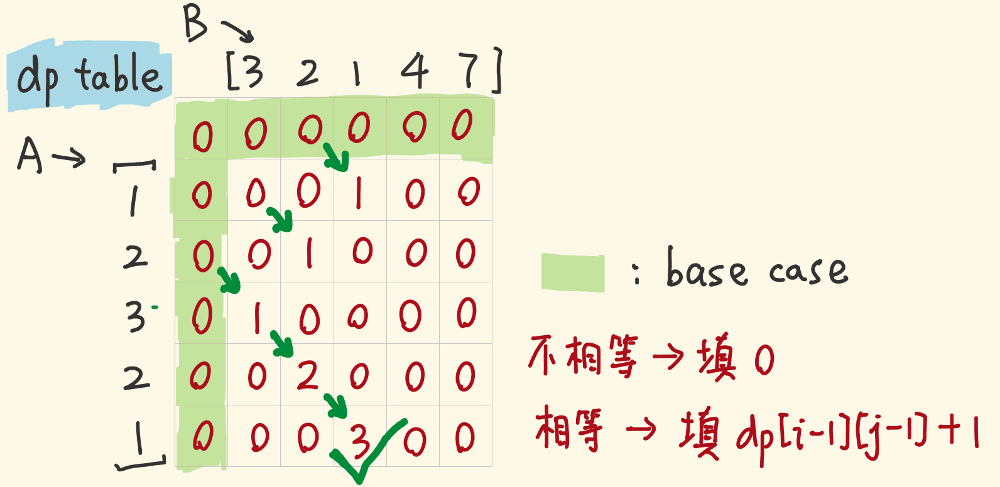
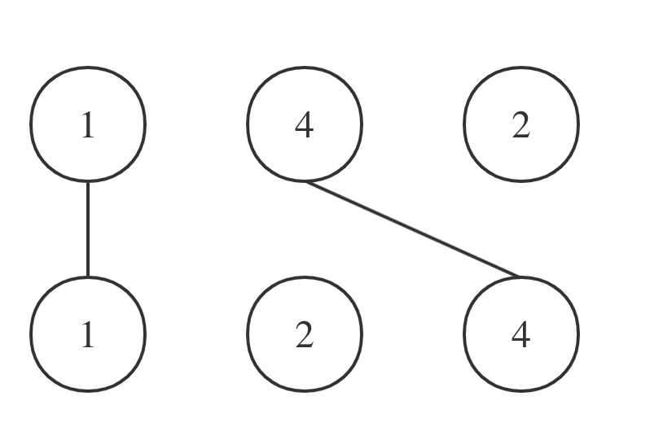

动态规划（2）主要讲了动态规划的打家劫舍系列、买卖股票系列


## 198. 打家劫舍

- [198. 打家劫舍](https://leetcode.cn/problems/house-robber/)
- 0613，mid，quick
- 动态规划

#### 方法一：二维dp

1. 确定dp

`dp[i][j]` 表示偷窃到第 i 号房屋时的收益

- `dp[i][0]` 表示不偷窃 i 号房屋
- `dp[i][1]` 表示偷窃 i 号房屋

2. 状态转移方程：

- 情况一：当前🏠 i 不偷，则上一个房屋偷也行，不偷也行，选择最大收益：`Math.max(dp[i - 1][1], dp[i - 1][0])`。
- 情况二：当前🏠 i 偷：则只能是上一个房屋不偷 => `dp[i - 1][0] + nums[i]`。

3. 初始化
4. 遍历

```js
var rob = function (nums) {
  // dp[i][j] 表示偷窃到第i号房屋时的收益
  // dp[i][0] 表示不偷窃i号房屋
  // dp[i][1] 表示偷窃i号房屋。
  const dp = Array.from(new Array(nums.length), () => new Array(2).fill(0));
  dp[0][1] = nums[0];

  for (let i = 1; i < nums.length; i++) {
    // i不偷：前一天偷/不偷的最大收益
    dp[i][0] = Math.max(dp[i - 1][1], dp[i - 1][0]);
    // i偷：[i-1] 没偷，则i能偷
    dp[i][1] = dp[i - 1][0] + nums[i];
  }
  // console.log(dp);
  return Math.max(dp[nums.length - 1][0], dp[nums.length - 1][1]);
};
```

#### 方法二：一维dp

1. 确定dp

`dp[i]`：i（包括i）以内的房屋，最多可以偷窃的金额为`dp[i]`

2. 状态转移方程

有两种情况，第 i 房间偷还是不偷：

- 偷第 i 房间，那么 `dp[i] = dp[i - 2] + nums[i]` ，即：第i-1房一定不能偷，最多偷窃的金额为 `dp[i-2]` +  第 i 房间偷的钱。
- 不偷第 i 房间，那么`dp[i] = dp[i - 1]`，即：考虑 i-1 房可以偷，收益是 i-1房的最大收益（不一定偷了 i - 1）。

最后，取最大值，即 `dp[i] = max(dp[i - 2] + nums[i], dp[i - 1])`；

3. 初始化

- `dp[0]` 一定是偷，才有最大收益 nums[0]，不偷的收益是 0；

0 `	dp[1]` 如果不偷，收益是 nums[0]；如果偷，收益是 num[1]。取最大值。

```js
var rob = function (nums) {
  const dp = [];
  dp[0] = nums[0];
  dp[1] = Math.max(nums[0], nums[1]);

  for (let i = 2; i < nums.length; i++) {
    // 不偷 + 偷
    dp[i] = Math.max(dp[i - 1], dp[i - 2] + nums[i]);
  }
  // console.log(dp);
  return dp[nums.length - 1];
};
```

#### 方法三：一维dp｜滚动数组

因为 `dp[i]` 只被 `i-1` 和`i-2` 影响，所以设置一个长度为 2 的 dp 即可。

注意：因为 return 的 dp 从 dp[length - 1] 修改为 固定的 dp[1]，所以注意 nums 长度为 1 的情况。在开头判断特例。

```js
var rob = function (nums) {
  if (nums.length === 1) return nums[0];
  const dp = [nums[0], Math.max(nums[0], nums[1])];

  for (let i = 2; i < nums.length; i++) {
    const profit = Math.max(dp[1], dp[0] + nums[i]); // 不偷 + 偷
    [dp[0], dp[1]] = [dp[1], profit];
  }
  return dp[1];
};
```


## 213. 打家劫舍 II

- [213. 打家劫舍 II](https://leetcode.cn/problems/house-robber-ii/)
- 0613，mid，answer
- 动态规划

#### 方法一：一维dp

根据分析题意，可以拆分出两种情况：

- 如果🏠 1 偷窃了，最后一个房屋就不能偷窃，判断偷窃的房屋范围是：`[0, len - 1]`；
- 如果🏠 1 不偷窃，最后一个房屋就不受影响，正常可偷。判断偷窃的房屋范围是：`[1, len]`；

则定制个方法 robbing，入参 start，len。用来表示遍历的房屋范围。

最后结果返回两个 case 的较大值。

```js
var rob = function (nums) {
  // 特例：
  if (nums.length === 1) return nums[0];
  // 情况一：如果第一个被偷，最后一个不能偷，前一个可以偷，房屋范围：[0, len - 1]
  const case1 = robbing(0, nums.length - 1);
  // 情况二：如果第一个没偷，最后一个可以偷，房屋范围：[1, len - 2]
  const case2 = robbing(1, nums.length);
  return Math.max(case1, case2);

  function robbing(start, len) {
    // 在[start, len]这个范围内偷窃，而不是之前的[0, len]
    const dp = [];
    // 初始化
    dp[start] = nums[start];
    dp[start + 1] = Math.max(nums[start], nums[start + 1]);

    for (let i = start + 2; i < len; i++) {
      dp[i] = Math.max(dp[i - 1], dp[i - 2] + nums[i]); // 不偷 + 偷
    }
    return dp[len - 1];
  }
};
```

#### 方法二：一维dp｜滚动数组

这道题当然也可以用滚动数组，对 robbing 稍加改动即可：

- 注意特例要对 nums.length === 2 时判断。

```js
var rob = function (nums) {
  // 特例：
  if (nums.length === 1) return nums[0];
  if (nums.length === 2) return Math.max(nums[0], nums[1]);
  // 情况一：如果第一个被偷，最后一个不能偷，房屋范围：[0, len - 1]
  const case1 = robbing(0, nums.length - 1);
  // 情况二：如果第一个没偷，最后一个可以偷，房屋范围：[1, len - 2]
  const case2 = robbing(1, nums.length);
  return Math.max(case1, case2);

  function robbing(start, len) {
    const dp = [nums[start], Math.max(nums[start], nums[start + 1])];

    for (let i = start + 2; i < len; i++) {
      const profit = Math.max(dp[1], dp[0] + nums[i]); // 不偷 + 偷
      dp[0] = dp[1];
      dp[1] = profit;
    }
    return dp[1];
  }
};
```


## 337. 打家劫舍 III

- [337. 打家劫舍 III](https://leetcode.cn/problems/house-robber-iii/)
- 0613，mid，
- 记忆化递归，动态规划


树的递归，是自下而上去做统计的。

比如判断某个节点 A 的最大收益，是判断 A 已经连带它的孩子、孙子 ... 的最大收益，所以：

- 叶子结点的最大收益就是自身 `node.val`；
- 空节点没有收益，收益值为 `0`；

这和传统的 `dp` 从前往后叠加收益不同，是从底向上叠加收益。


#### 方法一：记忆化递归

对二叉树考虑 dfs 递归。

- 使用后序遍历。 通过递归函数的返回值来做下一步计算。即：先获得了左右孩子的值，自身的值才能确定。

1. 状态转移方程：

当遍历到某个节点时，有两个 case：

- case1：偷当前节点的房子，则收益为：当前房屋的收益 + 左右孩子各自孩子的收益（跳过左右两个孩子，看四个孙子）；
- case2：不偷当前节点的房子，则收益为：左右孩子的收益（跳过自身收益，看两个孩子）；

最后当前节点的最佳收益：`Math.max(case1, case2)`。

2. 记忆化递归：用 map 结构来存储每个节点计算的收益，防止重复计算。

- 为什么会重复计算？

- 因为这不是传统的先序、中序、后序遍历。

  遍历道当前节点时，我们会直接遍历其 2 个孩子节点 +  4 个孙子节点；而遍历到左孩子节点时，也会遍历它的两个孩子，也就是当前节点的孙子节点，这就发生了重复。

```js
var rob = function (root) {
  const map = new Map();
  return dfs(root);

  //  表达当前node节点返回的收益
  function dfs(node) {
    if (node === null) return 0 // 遍历到头，没有节点了，返回收益0
    if (map.has(node)) return map.get(node); // 如果map已经保存该值，则直接返回
    // 偷自身，跳过左右子节点，直接获得左右孩子的孩子返回的收益
    let profit1 = node.val;
    if (node.left) profit1 += dfs(node.left.left) + dfs(node.left.right);
    if (node.right) profit1 += dfs(node.right.left) + dfs(node.right.right);
    // 偷子节点，跳过自身，获得左右孩子返回的收益
    let profit2 = dfs(node.left) + dfs(node.right);
    map.set(node, Math.max(profit1, profit2));
    return map.get(node);
  }
};
```

#### 方法二：动态规划

**相比记忆化递归的好处：**

避免重复计算节点。因为动态规划思想的递归，并没有跳过任何一个节点，而是完全正常的按序后序遍历。

- 为什么可以不用跳过？
- 因为每次递归的返回值都是两种情况：偷和不偷。所以当前节点拿到孩子节点的返回值，根据自己 case 的要求，获取相应的数值就可以。
  - 比如在记忆化递归中，如果当前节点选择不偷，那么要跳过孩子，获取四个孙子的最大收益。
  - 而在动态规划中，如果当前当前节点选择不偷，不需要跳过，直接选择孩子节点中不偷的结构即可 `dp[0]`。

**思路：**

对树结构的动态规划，要结合二叉树 + 动态规划的解题方法：

- 递归三部曲：确定递归函数（入参 / 出参）、确定终止条件、确定遍历顺序

- 动归五部曲：确定 dp 含义、确定状态转移方程、确定 dp 初始化、确定遍历条件、手动dp一个案例验证

1. **确定：递归函数（入参 / 出参）+ dp 含义**

对每个节点（房屋）有偷 / 不偷 两个 case，则递归返回值应当是一个长度为 2 的数组：`[偷，不偷]`，分别是偷和不偷的最大收益。

- `dp[0]`：当前节点不偷的最大收益；
- `dp[1]`：当前节点偷的最大收益。

这其实是一个二维 dp，调用栈中的每个函数都会生成一个长度为 2 的数组。这相当于 `dp[i][0]` 和 `dp[i][1]`。

2. **确定终止条件**

遇到空节点则达到边界，返回 0。

```js
if (node == NULL) return [0, 0];
```

3. **确定遍历顺序**

后序遍历。通过递归函数的返回值来做下一步计算。

- 左、右、根

4. **状态转移方程**

```js
// 后序遍历：获取左右节点偷/不偷的收益
const left = dfs(node.left);
const right = dfs(node.right);
const val = node.val;
// 不偷当前节点：左右孩子都能偷，分别取他们的较大值
const profit1 = Math.max(left[0], left[1]) + Math.max(right[0], right[1]);
// 偷当前节点：val
const profit2 = val + left[0] + right[0];
return [profit1, profit2];
```

得代码：

```js
var rob = function (root) {
  const [profit1, profit2] = dfs(root);
  return Math.max(profit1, profit2);

  // 表达当前node节点返回的收益
  function dfs(node) {
    if (node === null) return [0, 0];
    // 后序遍历：获取左右节点偷/不偷的收益
    const left = dfs(node.left);
    const right = dfs(node.right);
    const val = node.val;
    // 不偷当前节点：左右孩子都能偷，分别取他们的较大值
    const profit1 = Math.max(left[0], left[1]) + Math.max(right[0], right[1]);
    // 偷当前节点：val
    const profit2 = val + left[0] + right[0];
    return [profit1, profit2];
  }
};
```


## 121. 买卖股票的最佳时机

- [121. 买卖股票的最佳时机](https://leetcode.cn/problems/best-time-to-buy-and-sell-stock/)

- 0613，easy，normal

#### 方法一：贪心

结果为：右侧最大值 - 左侧最小值。最大值的下标应比最小值的下标靠右。

- `low` 一直获取更靠左侧的最小值；
- `result` 不断计算当前值 - 当前最小值的收益。

```js
var maxProfit = function (prices) {
  // 贪心：获取最小值和最大值
  let result = 0;
  let low = prices[0];
  for (let i = 0; i < prices.length; i++) {
    low = Math.min(prices[i], low);
    result = Math.max(result, prices[i] - low);
  }
  return result;
};
```

#### 方法二：动态规划｜滚动数组

用二维 `dp[i][j]` 记录：

- `dp[i][0]`：当前 i 价格不持有股票；
- `dp[i][1]`：当前 i 价格持有股票；

注意状态转移方程：

- 不持有：如果前一天不持有，就保持不变；如果前一天持有，就当前卖出，获得收益。
  - `Math.max(dp[0], dp[1] + prices[i]);`
- 持有：如果一直不持有，则当前 **第一次** 当前买入；如果前一天持有，则保持不变
  - `Math.max(-prices[i], dp[1]);`
  - 注意：这里一定是第一次买入，因为题目中要求只能有一次买入，所以如果在当前价格买入，那收益一定是 `-prices[i]`，之前一定没有进行过任何交易。

这里直接把二维数组优化为长度为 2 的滚动数组：

```js
var maxProfit = function (prices) {
  // 当前i价格：dp[i][0]不持有股票, dp[i][1]持有股票
  const dp = [0, -prices[0]];
  for (let i = 1; i < prices.length; i++) {
    // 不持有:前一天不持有,保持不变 + 前一天持有,当前卖出,获得收益
    const unhold = Math.max(dp[0], dp[1] + prices[i]);
    // 持有:一直不持有,当前买入 + 前一天持有,保持不变
    const hold = Math.max(-prices[i], dp[1]);
    dp[0] = unhold;
    dp[1] = hold;
  }
  return dp[0];
};
```


## 122. 买卖股票的最佳时机 II

- [122. 买卖股票的最佳时机 II](https://leetcode.cn/problems/best-time-to-buy-and-sell-stock-ii/)
- 0613，mid，quick
- 动态规划

#### 方法一：动态规划｜滚动数组

如果想看传统的二维dp解析，见：贪心章节中对该题的解答。

与上一题相比，可以多次买卖，每次是否持有发生改变，都需要参考上一次（`dp[i-1]`） 的值。

这里直接把二维数组优化为长度为 2 的滚动数组：

```js
var maxProfit = function (prices) {
  // dp[i][0] 表示第i天不持有
  // dp[i][1] 表示第i天持有
  const dp = [0, -prices[0]];
  for (let i = 0; i < prices.length; i++) {
    // 不持有：之前不持有；之前持有，卖出
    const unhold = Math.max(dp[0], dp[1] + prices[i]);
    // 持有：之前不持有，买入；之前持有
    const hold = Math.max(dp[0] - prices[i], dp[1]);
    dp[0] = unhold;
    dp[1] = hold;
  }
  return dp[0];
};
```


## 123. 买卖股票的最佳时机 III

- [123. 买卖股票的最佳时机 III](https://leetcode.cn/problems/best-time-to-buy-and-sell-stock-iii/)
- 0613，hard，answer
- 动态规划

本题可最多交易2次，这意味着可以有 1～2 次交易，先从状态机角度分析这五种状态：

- 没有任何买入 / 卖出行为，状态一：不持有股票：`dp[i][0]`

- 第一次买入 ===> 状态二，持有第一支股票：`dp[i][1]`
- 第一次卖出 ===> 状态三，不持有股票：`dp[i][2]`
- 第二次买入 ===> 状态四，持有第二支股票：`dp[i][3]`
- 第二次卖出 ===> 状态五，不持有股票：`dp[i][4]`

1. 定义 dp

所以，从上面顺便也定义了 dp 的含义：`dp[i][j]` 表示当股票价格为 i 时的状态。

2. 初始化：

- `dp[0][0]` 没有任何交易，一定为 0；
- `dp[0][1]` 购入第一支股票，收益为 `-prices[i]`
- `dp[0][2]` 出售第一支股票，可以想象为当天买当天卖，收益 0；
- `dp[0][3]` 购入第二支股票，想象为当天买卖了第一支，收益 0 ，买入第二支收益为 `-prices[i]`
- `dp[0][4]` 出售第二支股票，当天买的当天卖，收益 0。

```js
var maxProfit = function (prices) {
  const dp = Array.from(new Array(prices.length), () => new Array(5).fill(0));
  dp[0][1] = -prices[0];
  dp[0][3] = -prices[0];

  for (let i = 1; i < prices.length; i++) {
    // 没有买卖
    dp[i][0] = dp[i - 1][0];
    // 持有第一支股票:以前持有 + 刚持有
    dp[i][1] = Math.max(dp[i - 1][1], dp[i - 1][0] - prices[i]);
    // 已出售第一支股票:以前出售 + 刚出售
    dp[i][2] = Math.max(dp[i - 1][2], dp[i - 1][1] + prices[i]);
    // 持有第二支
    dp[i][3] = Math.max(dp[i - 1][3], dp[i - 1][2] - prices[i]);
    // 已出售第二支
    dp[i][4] = Math.max(dp[i - 1][4], dp[i - 1][3] + prices[i]);
  }
  return dp[prices.length-1][4];
};
```

#### 方法二：一维dp｜滚动数组

1. 当前时间 i 的收益只受上一个时间 i - 1的影响，所以可以优化为滚动数组。
2. 同时可以省略情况一，因为最开始没有买卖，收益一定是一直为 0 的。

```js
var maxProfit = function (prices) {
  let dp = new Array(4).fill(0);
  dp[0] = -prices[0];
  dp[2] = -prices[0];

  for (let i = 1; i < prices.length; i++) {
    // 持有第一支股票:以前持有 + 刚持有
    const r0 = Math.max(dp[0], -prices[i]);
    // 已出售第一支股票:以前出售 + 刚出售
    const r1 = Math.max(dp[1], dp[0] + prices[i]);
    // 持有第二支
    const r2 = Math.max(dp[2], dp[1] - prices[i]);
    // 已出售第二支
    const r3 = Math.max(dp[3], dp[2] + prices[i]);
    dp = [r0, r1, r2, r3];
  }
  return dp[3];
};
```


## 188. 买卖股票的最佳时机 IV

- [188. 买卖股票的最佳时机 IV](https://leetcode.cn/problems/best-time-to-buy-and-sell-stock-iv/)
- 0614，hard，quick
- 动态规划

#### 方法一：二维dp数组

思路其实就是（123. 买卖股票的最佳时机 III）的延伸：

- 如果是两次交易 `dp[i][j]` 中，j 的长度就是 5；
- 如果是 k 次交易，那 j 的长度就是 2 * k + 1；

倒序：

- 因为 `dp[j]` 受到 `dp[j-1]` 的影响，所以如果 j 从前往后遍历，就会影响到前一位的 `dp[j-1]` ，那么 j 从后往前遍历并更新值即可。

```js
var maxProfit = function (k, prices) {
  if (prices.length <= 1) return 0;
  let dp = new Array(k * 2 + 1).fill(0);

  // 第0次不买不卖，奇数持有，偶数不持有
  for (let i = 1; i <= k * 2; i++)
    if (i % 2) dp[i] = -prices[0];

  for (let i = 1; i < prices.length; i++) {
    for (let j = k * 2; j >= 1 ; j--) { // 倒序
      dp[j] = j % 2
      	? Math.max(dp[j], dp[j - 1] - prices[i])  // 第x次持有：以前持有 + 刚买入
      	: Math.max(dp[j], dp[j - 1] + prices[i])  // 第x次不持有：以前不持有 + 刚卖出
    }
  }
  return dp[k * 2];
};
```

#### 方法二：一维dp数组

```js
var maxProfit = function (k, prices) {
  if (prices.length <= 1) return 0;

  let dp = new Array(k * 2 + 1).fill(0);

  // 第0次不买不卖，奇数持有，偶数不持有
  for (let i = 1; i <= k * 2; i++)
    if (i % 2) dp[i] = -prices[0];

  for (let i = 1; i < prices.length; i++) {
    const newdp = new Array(k * 2 + 1).fill(0);
    for (let j = 1; j <= k * 2; j++) {
      newdp[j] = j % 2
      	? Math.max(dp[j], dp[j - 1] - prices[i])  // 第x次持有：以前持有 + 刚买入
      	: Math.max(dp[j], dp[j - 1] + prices[i])  // 第x次不持有：以前不持有 + 刚卖出
    }
    dp = [...newdp];
  }
  return dp[k * 2];
};
```


## 309. 最佳买卖股票时机含冷冻期

- [309. 最佳买卖股票时机含冷冻期](https://leetcode.cn/problems/best-time-to-buy-and-sell-stock-with-cooldown/)
- 0614，mid，answer
- 动态规划

思路：重点是要把这几个状态分析清楚，要把冷冻期考虑在状态转移的类型内。

1. 状态转移方程

- case1：持有股票（一直持有 / 刚买入(前一天是冷冻期，前一天已经过了冷冻期)）；
- case2：一直不持有股票，过了冷冻期(保持不变，前一天是冷冻期)
- case4：刚不持有股票，卖出
- case3：不持有股票，前一天刚卖出，还在冷冻期；

2. 初始化：

- case1：持有股票，最开始刚持有股票，收益肯定是 `-prices[0]`；

不持有股票，收益最低也只能为 0，不可能为负数：

- case2：一直不持有股票，收益为 0；
- case4：刚不持有股票，收益为 0；
- case3：不持有股票，前一天刚卖出，还在冷冻期：收益为 0.

解题：

```js
var maxProfit = function (prices) {
  if (prices.length <= 1) return 0

  const dp = Array.from(new Array(prices.length), () => new Array(4).fill(0));
  dp[0][0] = -prices[0];

  for (let i = 1; i < prices.length; i++) {
    // case1：持有股票（一直持有 / 刚买入(前一天是冷冻期，前一天已经过了冷冻期)）；
    dp[i][0] = Math.max(dp[i - 1][0], Math.max(dp[i - 1][1], dp[i - 1][3]) - prices[i]);
    // case2：一直不持有股票，过了冷冻期(保持不变，前一天是冷冻期)
    dp[i][1] = Math.max(dp[i - 1][1], dp[i - 1][3]);
    // case3：刚不持有股票，卖出
    dp[i][2] = dp[i - 1][0] + prices[i];
    // case4：不持有股票，前一天刚卖出，还在冷冻期；
    dp[i][3] = dp[i - 1][2];
  }
  return Math.max(dp[prices.length - 1][1], dp[prices.length - 1][2], dp[prices.length - 1][3]);
};
```


## 714. 买卖股票的最佳时机含手续费

- [714. 买卖股票的最佳时机含手续费](https://leetcode.cn/problems/best-time-to-buy-and-sell-stock-with-transaction-fee/)
- 0614，mid，
- 动态规划

与普通的买卖股票相比，就是在出售的时候多剪掉一个手续费即可：

```js
var maxProfit = function (prices, fee) {
  const dp = [0, -prices[0]];  // 不持有，持有

  for (let i = 1; i < prices.length; i++) {
    // 不持有:(保持不持有，刚卖)
    sell = Math.max(dp[0], dp[1] + prices[i] - fee);
    // 持有:(保持持有，刚买)
    buy = Math.max(dp[1], dp[0] - prices[i]);
    dp[0] = sell;
    dp[1] = buy;
  }
  return dp[0];
};
```


## 300. 最长递增子序列

- [300. 最长递增子序列](https://leetcode.cn/problems/longest-increasing-subsequence/)
- 0614，mid，answer
- 动态规划

时间复杂度：*O(nlgn)*

`dp[i]` 表示在下标 [0, i] 区间内，最长递增子序列的长度为多少。

状态转移方程：

- `[0, i]` 之间是否存在 `j`，它的值 nums[j] 是小于 nums[i] 的。通过 for 循环找到所有比 nums[i] 小的值。然后获得他们的最长递增子序列长度 `dp[j]` 。则 `dp[i]` 的值就是全部这些 dp[j] 中最大的一个，再加1；

`res` 用来统计最终的结果，每次 for 循环过后都更新 res 为 dp 中的最大值，省去 return 的时候判断最大值。

初始化：

- 子序列最短也一定为 1，所以 res 和 dp 成员的默认值为最小的 1，不要设置为 0。

```js
var lengthOfLIS = function (nums) {
  //  dp[i] 到数字i时，最长的子序列
  const dp = new Array(nums.length).fill(1);
  let res = 1;
  for (let i = 1; i < nums.length; i++) {
    for (let j = 0; j < i; j++) {
      if (nums[j] < nums[i]) dp[i] = Math.max(dp[i], dp[j] + 1);
      res = Math.max(res, dp[i]);
    }
  }
  // console.log(dp);
  return res;
};
```


## 674. 最长连续递增序列

- [674. 最长连续递增序列](https://leetcode.cn/problems/longest-continuous-increasing-subsequence/)
- 0614，easy，quick
- 动态规划

#### 方法一：一维dp

- 状态转移方程：如果当前值 nums[i] 大于上一个 nums[i - 1]，那么总数就是 dp[i - 1] + 1，否则就重新计算，值为 1。

```js
var findLengthOfLCIS = function (nums) {
  const dp = Array(nums.length).fill(1);
  let res = 1;

  for (let i = 1; i < nums.length; i++) {
    if (nums[i - 1] < nums[i]) dp[i] = dp[i - 1] + 1;
    res = Math.max(res, dp[i]);
  }
  return res;
};
```

#### 方法二：滚动数组

因为 dp[i] 只依赖于前一个值 dp[i-1]，所以只保存当前值为 point 即可，不断更新 point 的值。res 用来统计 point 曾经的最大值。

```js
var findLengthOfLCIS = function (nums) {
  let point = res = 1;

  for (let i = 1; i < nums.length; i++) {
    point = nums[i - 1] < nums[i] ? point + 1 : 1;
    res = Math.max(res, point);
  }
  return res;
};
```


## 718. 最长重复子数组

- [718. 最长重复子数组](https://leetcode.cn/problems/maximum-length-of-repeated-subarray/)
- 0614，mid，answer
- 动态规划

为什么没做出来？这两个没考虑清楚：

- 两个数组的每个元素各自进行对比，对比后有一个结果（是否相等）。这个结果要进行记录，一定是用 二维 dp。
- 数组 A 和数组 B 的中有两个元素 i ，j，一旦相等，那此时的最长重复字数组长度就应当是 i-1，i-1 长度 + 1。

#### 方法一：二维dp



1. 定义 dp

`dp[i][j]` ：数组 A `[0, i-1]` 区间，数组 B `[0, j-1]` 区间的最长重复子数组长度

- 为什么是 i-1? 因为二维数组的左边 `dp[x][0]`和上边 `dp[0][x]`，定义为没有实际意义的空位置，赋默认值为 0（上图）。这样才能确保状态转移方程正确。

2. 确定状态转移方程

要把 `[1,i-1]` 的 A 数组，和 `[1,j-1]` 的 B 数组内每个成员都要比较一次。

- 如果遇到值相等，则 `dp[i][j] = dp[i - 1][j - 1] + 1`

3. 初始化

因为区间是从 `[0, i-1]` 开始判断，则从 1 开始判断，`dp[0][0]`、`dp[0][x]`、`dp[x][0]` 都没有意义，设置为 0；

```js
var findLength = function (nums1, nums2) {
  const dp = Array.from(new Array(nums1.length + 1), () => new Array(nums2.length + 1).fill(0));
  let res = 0;

  for (let i = 1; i <= nums1.length; i++) {
    for (let j = 1; j <= nums2.length; j++) {
      if (nums1[i - 1] === nums2[j - 1]) dp[i][j] = dp[i - 1][j - 1] + 1;
      res = Math.max(res, dp[i][j]);
    }
  }
	return res;
};
```

#### 方法二：一维dp


倒序：

因为 `dp[j]` 受到 `dp[j-1]` 的影响，所以如果 j 从前往后遍历，就会影响到前一位的 `dp[j-1]` ，那么 j 从后往前遍历并更新值即可。

- 注意，因为 dp 数组是一维的被复用，所以初始值 0 有可能在上一轮的时候已经设置为新的值，这时在状态转移方程是重新设置为 0

```js
var findLength = function (nums1, nums2) {
  let dp = new Array(nums2.length + 1).fill(0);
  let res = 0;

  for (let i = 1; i <= nums1.length; i++) {
    for (let j = nums2.length; j >= 1; j--) {
      dp[j] = nums1[i - 1] === nums2[j - 1]
        ? dp[j - 1] + 1
        : 0 // 默认值要重新设置为 0
      res = Math.max(res, dp[j]);
    }
  }
  return res;
};
```


## 1143.最长公共子序列

- [1143. 最长公共子序列](https://leetcode.cn/problems/longest-common-subsequence/)
- 0614，mid，answer
- 动态规划

1. 定义 dp

`dp[i][j]`：长度为 `[0, i - 1]` 的字符串 text1 与长度为 `[0, j - 1]` 的字符串 `text2` 的最长公共子序列为 `dp[i][j]`。

2. 定义状态转移方程

注意：因为是判断 `[0, i - 1]` 和 `[0, j - 1]` 这个区间，所以当前判断点位应当是 i - 1 和 j - 1。

case1：`text1[i - 1]` 与 `text2[j - 1]` 相同

- 找到了一个公共元素，所以 `dp[i][j] = dp[i - 1][j - 1] + 1`;

case2：`text1[i - 1]` 与 `text2[j - 1]`不相同

- 从上一轮中，取更长的的最长公共子序列：即：`dp[i][j] = max(dp[i - 1][j], dp[i][j - 1])`

有三个方向可以递推出 `dp[i][j]`：


代码：

```js
var longestCommonSubsequence = function (text1, text2) {
  const dp = Array.from(new Array(text1.length + 1), () => new Array(text2.length + 1).fill(0));

  for (let i = 1; i <= text1.length; i++) {
    for (let j = 1; j <= text2.length; j++) {
      dp[i][j] = text1[i - 1] === text2[j - 1]
        ? dp[i - 1][j - 1] + 1
        : Math.max(dp[i - 1][j], dp[i][j - 1])
    }
  }
  return dp[text1.length][text2.length];
};
```


## 1035. 不相交的线

- [1035. 不相交的线](https://leetcode.cn/problems/uncrossed-lines/)
- 0614，mid，answer
- 动态规划

**本题说是求绘制的最大连线数，其实就是求两个字符串的最长公共子序列的长度**

- 要剖析题干要求，找到规律。nums1 和 nums2 两个数组中，最终被连线的字母所组成的子序列，一定是完全相等的。



代码与（1143.）一模一样。

```js
var maxUncrossedLines = function (nums1, nums2) {
  const dp = Array.from(new Array(nums1.length + 1), () => new Array(nums2.length + 1).fill(0));

  for (let i = 1; i <= nums1.length; i++) {
    for (let j = 1; j <= nums2.length; j++) {
      dp[i][j] = nums1[i - 1] === nums2[j - 1]
        ? dp[i - 1][j - 1] + 1
        : Math.max(dp[i - 1][j], dp[i][j - 1])
    }
  }
  return dp[nums1.length][nums2.length];
};
```


## 53. 最大子数组和

- [53. 最大子数组和](https://leetcode.cn/problems/maximum-subarray/)
- 0614，easy，quick
- 贪心，动态规划

#### 方法一：贪心

注意点一：cur 记录遍历时实时统计的总和，res 记录所有 cur 中的最高值

注意点二：如果 cur 已经小于 0 了，那就直接放弃之前统计的数字，从 0 开始；反之，就把当前值加到 cur 上。

```js
var maxSubArray = function (nums) {
  // 贪心
  let cur = -Infinity;
  let res = -Infinity;
  for (let i = 0; i < nums.length; i++) {
    if (cur < 0) cur = Math.max(cur + nums[i], nums[i]);
    else cur += nums[i];
    res = Math.max(cur, res);
  }
  return res;
};
```

#### 方法二：动态规划

可以看到，贪心就是动态规划的一维 dp 思路。

1. `dp[i]` 的状态转移方程：
   - case1：继续累加和
   - case2：不再累加，而是从 0 开始。

`dp[i]` 记录两者的较大值。

2. 初始化

注意初始化，`dp[0]` 和 `res` 应当为 `nums[0]`。

```js
var maxSubArray = function (nums) {
  const dp = new Array(nums.length).fill(-Infinity);
  dp[0] = nums[0];
  let res = nums[0];
  for (let i = 1; i < nums.length; i++) {
    dp[i] = Math.max(dp[i - 1] + nums[i], nums[i]);
    res = Math.max(res, dp[i]);
  }
  return res;
};
```


## 392. 判断子序列

- [392. 判断子序列](https://leetcode.cn/problems/is-subsequence/)
- 0614，easy，normal
- 动态规划

#### 方法一：动态规划

问题转化为：判断 s 是否是 t 的子序列，就是要在 t 中能否按需查找到一个 s。

1. 定义 dp

`dp[i][j]` 表示，从区间为 `[0, j-1]` 的字符串 t，寻找区间为 `[0, i-1]` 的字符串 s ，能找到的最长长度。

2. 定义状态转移方程

- case1：`s[i-1] === t[j-1]`  ，也就是当前判断的两个数字相等，则统计数字可以 + 1：`dp[i][j] = dp[i-1][j-1] + 1`。
- case2：`s[i-1] !== t[j-1]` ，
  - 题目的目的是把 s 全部匹配掉，所以 s 的每一个成员是不可跳过的。
  - 当 i -1 这个元素没有匹配上时，就继续等待 i -1，跳过 j -1。这相当于 t 要删除元素 `t[j - 1]`，那么 `dp[i][j]` 的数值就是看 `s[i - 1]`与 `t[j - 2]` 的比较结果了：`dp[i][j] = dp[i][j - 1]`。


```js
var isSubsequence = function (s, t) {
  const dp = Array.from(new Array(s.length + 1), () => new Array(t.length + 1).fill(0));

  for (let i = 1; i <= s.length; i++) {
    for (let j = 1; j <= t.length; j++) {
      dp[i][j] = s[i - 1] === t[j - 1]
        ? dp[i - 1][j - 1] + 1
        : dp[i][j - 1]
    }
  }
  return dp[s.length][t.length] === s.length
};
```

#### 方法二：双指针

两个指针分别指向两个数组，如果相当则子序列指针 +1。

```js
var isSubsequence = function (s, t) {
  let sp = 0; // 子序列
  let tp = 0;

  while (sp < s.length && tp < t.length) {
    if (s[sp] === t[tp]) sp++
    tp++;
  }
  return sp === s.length;
};
```


https://programmercarl.com/0115.%E4%B8%8D%E5%90%8C%E7%9A%84%E5%AD%90%E5%BA%8F%E5%88%97.html


