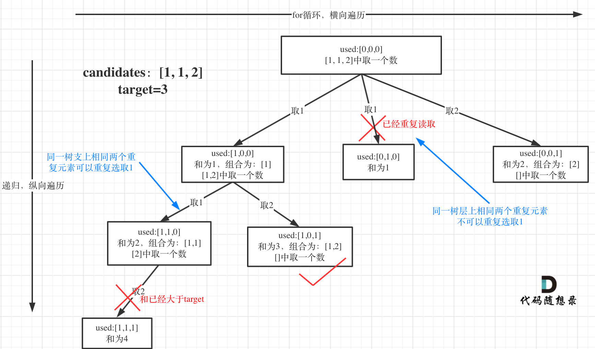
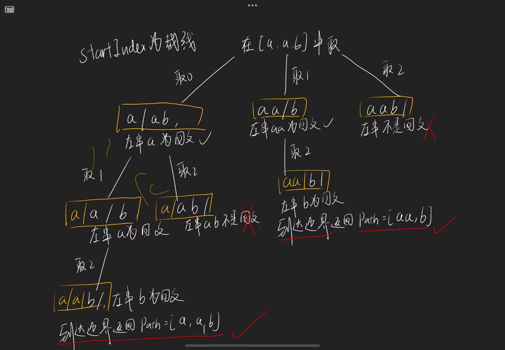

## ⏰ 组合问题

## 77. 组合

- [77. 组合](https://leetcode.cn/problems/combinations/)
- 0510，mid，answer
- 回溯、剪枝

回溯

- `n` 代表数字组合的范围：`[1, n]`；`k` 代表组合的长度：结果集合中，每一成员的长度均为 `k`。
- 在代码中，`path` 表示了每一个成员，表示其中一个组合；`res` 是 `path` 的集合，也就是组合的集合。


正确的把题意拆分为一个数结构，是解题的关键。

- 在本题中：
  - 横向 for 循环的是 `	[1, n]` 这个可选的去值区间；纵向递归的是 `path` 这个结果组合。
  - 横向的范围就是 `[startIndex, n]`，纵向的范围是 `[path.length, k]`；

#### 方法一：回溯

```js
var combine = function (n, k) {
  const res = [];
  const path = [];
  backtracking(n ,k ,1);
  return res;
	
  // 递归：每次传入 startIndex 确定下一次 for 循环的范围
  function backtracking(n, k, startIndex) {
    // 边界：当找到一个组合时，登记结果，结束递归。
    if (path.length == k) {
      res.push([...path]);
      return;
    }

    for (let i = startIndex; i <= n; i++) {
      path.push(i);
      backtracking(n, k, i + 1);
      path.pop(i);
    }
  }
};
```

#### 方法二：回溯｜剪枝优化

- 假设：`n = 4`， `k = 4`，直观的告诉我们只有一种组合结果，就是 `	[1,2,3,4]`。但之前的算法中，第一层递归的 for 循环会依次遍历 1，2，3，4。而我们知道只需要遍历 1 就够了。
  - 缩小 for 循环的范围：若当前 path 的剩余位置（`k - path.length`），大于 n 中剩余的可用数字（`n - startIndex + 1 `）。换句话说如果 n 中剩余的可用数字即使全部放在 path 中，也无法达到 k 的长度。那么此时就不需要 for 遍历了（剪枝）。


```js
var combine = function (n, k) {
  const res = [];
  const path = [];
  backtracking(n, k, 1);
  return res;

  function backtracking(n, k, startIndex) {
    if (path.length == k) {
      res.push([...path]);
      return;
    }
    
		// 剪枝，不执行接下来的 for 循环
    if (k - path.length > n - startIndex + 1) return;

    for (let i = startIndex; i <= n; i++) {
      path.push(i);
      backtracking(n, k, i + 1);
      path.pop(i);  // 回溯
    }
  }
};
```

直接合并到 for 循环中：

- `for` 循环从 i 开始，`i` 必须小于这个值，`startIndex <= n - k - path.length + 1`，放到 for 循环中：

```js
var combine = function (n, k) {
  const res = [];
  const path = [];
  backtracking(n, k, 1);
  return res;

  function backtracking(n, k, startIndex) {
    if (path.length == k) {
      res.push([...path]);
      return;
    }
    
    for (let i = startIndex; i <= n - (k - path.length) + 1; i++) {
      path.push(i);
      backtracking(n, k, i + 1);
      path.pop(i);  // 回溯
    }
  }
};
```


## 216. 组合总和 III

- [216. 组合总和 III](https://leetcode.cn/problems/combination-sum-iii/)
- 0510，mid，quick
- 回溯、剪枝

回溯的整体思路和上一题（77）大致相同，要确定这三个事情：

1. `for` 循环的范围：`[1,9]`，这9个数字；
   - 需要注意这 9 个数字需要筛选`(2)`：用过的不能再用，数字相加要 = `9`；
2. `dfs` 递归的深度：`k`，遍历的深度就是组合的长度，为 k；
3. 最后确定声明的变量，dfs 返回的边界，res.push 的条件。

#### 方法一：回溯

```js
var combinationSum3 = function (k, n) {
  const res = [];
  const path = [];
  dfs(k, n, path, 1);
  return res;

  function dfs(k, n, path, startIndex) {
    // 边界
    if (path.length === k) {
      const count = path.reduce((prev, curv) => prev + curv);
      if (count === n) res.push([...path]);
      return;
    }

    // 递归
    for (let i = startIndex; i <= 9; i++) {
      path.push(i);
      dfs(k, n, path, i + 1);
      path.pop();
    }
  }
};
```

#### 方法二：回溯｜剪枝优化

- 优化的思路也和上一个题相同，如果剩余的数字（`n`）不足以填充 k 的剩余长度，就没必要再执行 for 循环了。
  - 换句话说，startIndex 不仅需要满足 '小于 9 ' 的要求，还要满足下面的要求：

```js
9 - startIndex + 1 >= k - path.length
// 转化一下
startIndex <= 10 - (k - path.length)
```

同时，求和 `count` 也可以在每次递归的时候计算，不需要在 `res.push()` 执行 reduce 进行计算。

```js
var combinationSum3 = function (k, n) {
  // for:[1,9]，这9个数字；需要注意这 9 个数字需要筛选：用过的不能再用，数字相加要=9
  // dfs:k，遍历的深度就是组合的长度，为k
  const res = [];
  const path = [];
  dfs(k, n, path, 1, 0);
  return res;

  function dfs(k, n, path, startIndex, sum) { 
    // 边界：结束递归
    if (path.length === k) {
      // res：结束递归不一定满足条件，满足条件才能放入 res 中
      if (sum === n) res.push([...path]);
      return;
    }

    // 递归
    for (let i = startIndex; i <= 10 - (k - path.length); i++) {
      path.push(i);
      sum += i;
      dfs(k, n, path, i + 1, sum);
      path.pop();
      sum -= i;
    }
  }
};
```


## 17. 电话号码的字母组合

- [17. 电话号码的字母组合](https://leetcode.cn/problems/letter-combinations-of-a-phone-number/)
- 0510，mid，quick
- 回溯

依然是确定回溯的三个条件：

1. for：每层for循环的范围都不一样，这取决于当前的具体数字，数字不同则范围不同。同时，剪枝思路和（77.组合）相同。
2. dfs：`digits.length`，即输入数字的长度。如果输入数字的长度为3，那结果组合的长度就是 3；
3. 返回：当 `path.length === digits.length` 即，结果组合的长度，和传入数字的长度相同时，返回结果并结束递归。

这里不仅可以用 map，也可以用 数组，实际上数组在这里更快：

```js
const map = [
    "", // 0
    "", // 1
    "abc", // 2
    "def", // 3
    "ghi", // 4
    "jkl", // 5
    "mno", // 6
    "pqrs", // 7
    "tuv", // 8
    "wxyz", // 9
  ];
```

解答：

```js
var letterCombinations = function (digits) {
  if (digits.length === 0) return [];
  const map = new Map([
    ['2', 'abc'],
    ['3', 'def'],
    ['4', 'ghi'],
    ['5', 'jkl'],
    ['6', 'mno'],
    ['7', 'pqrs'],
    ['8', 'tuv'],
    ['9', 'wxyz']
  ])
  const res = [];
  const path = [];
  dfs(digits, path);
  return res;

  // digits = ‘23’
  function dfs(digits, path) {
    // 结束
    if (path.length === digits.length) {
      res.push(path.join(""));
      return;
    }

    //soruce = 'abc'
    //path.length 表明目前遍历到哪一个数字了，如果值时1，表明已经遍历过 digits[0]，下一层该遍历 digits[1] 了。
    const source = map.get(digits[path.length]);

    // 递归
    for (let i = 0 ; i < source.length ; i++) {
      path.push(source[i]);
      dfs(digits, path);
      path.pop();
    }
  }
};
```


## 39. 组合总和

- [39. 组合总和](https://leetcode.cn/problems/combination-sum/)
- 0518，mid，mormal
- 回溯

思路：

做回溯时，一定要在脑海中构思一个树来。然后考虑这棵树的横向遍历（for循环），和纵向递归（dfs 递归），最后考虑递归的结束。

- for：横向遍历，题目中数字可以重复取，所以如图，当 `[2,5,3]` 中本轮取 2，那下一轮 2，5，3 都可以取。本轮取 5，下一轮只能取5，3。所以，只能取 >= 当前数字的范围。
- dfs：纵向递归，题目中数字的取用不限次数，就遍历数字而言，意味着 dfs 的深度可以是无限。
- 递归的结束：当取用的数字总和 >= target 时，递归结束。
  - 此时如果 === ，那登记该组合，是一个答案；
  - 此时如果 > target，那直接结束递归，丢弃结果。


#### 方法一：回溯

```js
var combinationSum = function (candidates, target) {
  const res = [];
  const path = [];

  dfs(0, target);
  return res;

  function dfs(startindex, target) {
    // 边界。
    // 大于0，表示 path 还没有填满，需要再加数字；
    // 等于0，表示 path 已经是目标组合；
    // 小于0，表示 path 的总和超出target，丢弃。
    if (target < 0) return;
    else if (target === 0) {
      res.push([...path]);
      return;
    }

    // 下一层只能用大于等于当前层的数字
    	for (let i = startIndex; i < candidates.length; i++) {
      target -= candidates[i];
      path.push(candidates[i]);
      dfs(i, target);
      path.pop(candidates[i]);
      target += candidates[i];
    }
  }
};
```

#### 方法二：回溯｜剪枝优化

优化的目的是提前结束递归，省去对 path 的 pop 和 push 操作。

- 如果 candidates 是按照从小到大的顺序排序（sort），那在 for 循环时，出现超出 target 的情况，后面的数字便不需要再遍历。
  - 比如 candidates = [2, 3, 5, 7]，terget = 6，目前的 path = [2, 2]。此时我们发现，[3,5,7] 都可以剪掉了。

- 操作：
  - 对 candidates 进行排序；
  - 在 for 循环的条件上额外加一条，如果当前 target 减去正要递归的数字 candidates[i]，已经 <0，那不再需要递归，提前结束。

```js
var combinationSum = function (candidates, target) {
	candidates.sort((x, y) => x - y). // 排序。
  const res = [];
  const path = [];

  // 下一层只能用大于等于当前层的数字
  dfs(0, target);

  function dfs(startindex, target) {
    // 边界。
    // 大于0，表示 path 还没有填满，需要再加数字；
    // 等于0，表示 path 已经是目标组合；
    // 小于0，表示 path 的总和超出target，丢弃。
    if (target < 0) return;
    else if (target === 0) {
      res.push([...path]);
      return;
    }

    // 剪枝：target - candidates[i] <= target 只有符合条件才进一步递归
    for (let i = startindex; i < candidates.length && target - candidates[i] <= target; i++) {
      target -= candidates[i];
      path.push(candidates[i]);
      dfs(i, target);
      path.pop(candidates[i]);
      target += candidates[i];
    }
  }
  return res;
};

```


## 40. 组合总和 II

- [40. 组合总和 II](https://leetcode.cn/problems/combination-sum-ii/)
- 0518，mid，answer
- 回溯

思路：

- 这道题的难点在于去重：

```js
示例 1:
输入: candidates = [1,1,2], target = 3,
```

可以看到，1 在输入是重复的，在同一个 for 横向遍历中，取两次 1 数字。for 中重复取的结果一定是重复的，比如结果 [1,2] 中的 `1` 可以是取 `candidates[0]`，也有可能是 `candidates[1]`。

但是，在 dfs 时，1 是可以重复取的：`[1,1,2]` 就是一个重复取出的结果。



在 for 循环中，对重复取数字进行处理：

```js
if (i > startIndex && candidates[i] === candidates[i - 1]) continue;
```

- 如果当前数字 `candidates[i]` 和 前一个数 `candidates[i-1]` 相等，则证明出现了重复。此时还需要额外判断是否是 dfs 重复：
  - 如果 `i === startIndex` ，则表明当前的 for 循环是一个全新的一层。对新的一层取数字不应当有 “重复” 不能取的限制，所以跳过。


**剪枝：**

这里不再用方法二，指出剪枝了。如果在进行 for 循环时，当前 target - candadies[i] 已经小于 0，表明 path 中的成员总数已经超过目标值，所以不再往下递归。

```js
var combinationSum2 = function (candidates, target) {
  candidates.sort((x, y) => x - y);   // 排序
  const res = [], path = [];

  dfs(0, target);
  return res;

  function dfs(startIndex, target) {
    // dfs截止
    if (target < 0) return;
    else if (target === 0) res.push([...path]);

    // 剪枝：target - candidates[i] >= 0
    for (let i = startIndex; i < candidates.length && target - candidates[i] >= 0; i++) {
      // 数字重复的处理：
      if (i > startIndex && candidates[i] === candidates[i - 1]) continue;

      target -= candidates[i];
      path.push(candidates[i]);
      dfs(i + 1, target);
      path.pop(candidates[i]);
      target += candidates[i];
    }
  }
};
```


## 分割问题

## 131. 分割回文串

- [131. 分割回文串](https://leetcode.cn/problems/palindrome-partitioning/)
- 0518，mid，answer
- 回溯

思路如下：[链接](https://www.programmercarl.com/0131.%E5%88%86%E5%89%B2%E5%9B%9E%E6%96%87%E4%B8%B2.html#%E5%9B%9E%E6%BA%AF%E4%B8%89%E9%83%A8%E6%9B%B2)

- 需要注意到是，每次切割后判断的是左子串。




可以把分割的过程，想象为回溯中选取组合的过程。

- startIndex 为上一轮切割线，
  - 每切割一次，都要判断切下的左子串是否符合一个回文串：
    - 如果符合，则进行递归，进行后序的切割；
    - 如果不符合，则不能这样切割，跳过本次递归；
  - 直到切割到 s 字符串的最后一个位置。证明所有的子串都是回文的，则把 path 放入结果中。
- for 循环：每次切割，都把字符串切割为：`[startIndex, i]` 和 `[3, s.length - 1]` 的两个回文串。
- dfs 递归：结束的标志就是切割到最后一个数字，也就是不再有右子串以供切割了，则结束遍历，同时 `res.push()`。

```js
var partition = function (s) {
  const res = [];
  const path = [];

  dfs(0);
  return res;

	// 下一步切割的范围：[startIndex, s.length - 1];
  function dfs(startIndex) {
    // 切割结束，登记结果
    if (startIndex >= s.length) {
      res.push([...path]);
      return;
    }
    
    // i 就是切割线，i == 2，表示切割出：[startIndex, 2] 和 [3, s.length - 1] 的两个回文串。
    for (let i = startIndex; i < s.length; i++) {
			// 剪枝：切下的左边 [startIndex, i] 不是子串，则不进行递归。
      if (!isCorrect(startIndex, i)) continue;
			// 递归
      path.push(s.substr(startIndex, i - startIndex + 1));
      dfs(i + 1);
      path.pop();
    }
  }

  // 判断回文: 双指针
  function isCorrect(left, right) {
    while (left < right) {
      if (s[left] !== s[right]) return false;
      left++, right--;
    }
    return true;
  }
};
```


## 93. 复原 IP 地址

- [93. 复原 IP 地址](https://leetcode.cn/problems/restore-ip-addresses/)
- 0521，mid，normal
  - 回溯、剪枝	

我的回溯做题思路：

- 先确定 3 核心：dfs 纵向递归、for 横向遍历、dfs 结束的边界；
- 然后把回溯框写出来，确定自己的回溯框架正确；
  - startIndex 是剩余数组的起始位置；
  - for 中的 `i` 切割字符串的位置，`[startIndex, i]` 和 `[i + 1, s.length - 1]`  切割出左边一个数字
- 接着确定特殊条件，比如本文中的条件：
  1. 这区间 `[startIndex, i]` 形成的数字，必须小于255，且大于1位的数字不能以0开头；
  2. 当切割完会产生 4 个数字时，表明切割结束（dfs 结束边界），此时也要判断  `[i + 1, s.length - 1]`   符合标准；
- 确定特殊条件的位置：在 for 循环内判断，如果不满足就跳过本轮循环。

```js
var restoreIpAddresses = function (s) {
  // 回溯算法
  // dfs：startindex为剩余数组的第一个数字
  // for: 可切割的数字
  // 边界：dfs的层数为4，即切割出四个数字
  const path = [], res = [];
  dfs(0);
  return res;

  function dfs(startIndex) {
    if (path.length === 3) {
      res.push([...path , s.substring(startIndex)].join("."));
      return;
    }

    // [开头，startIndex, startIndex + 1, 结尾]
    for (let i = startIndex; i < s.length - 1; i++) {
      // 如果不符合标准，则跳过
      if (isNotTure(startIndex, i)) continue;
      // 如果是最后一刀，需要判断右侧是否符合
      if (path.length === 2 && isNotTure(i + 1, s.length - 1)) continue;
      // 这里切分的一定符合
      path.push(s.substring(startIndex, i + 1));
      dfs(i + 1);
      path.pop();
    }
  }

  // 判断数字是否符合标准:区间 [left, right] 右闭;
  function isNotTure(left, right) {
    // 剪掉不满足的，开头是0的数字1位以上、数字总和必须大于255的
    return Number(s[left]) === 0 && right - left >= 1 || 
      		 Number(s.substring(left, right + 1) > 255);
  }
};
```


## 78. 子集

- [78. 子集](https://leetcode.cn/problems/subsets/)
- 0522，mid，quick
- 回溯

#### 方法一：我的思路

确定回溯的三个核心：

- for 循环遍历：for 循环只有两个选项，对当前数字 **选择**，或者 **不选择**；
- dfs 深度递归：对 nums 数组的每个成员依次执行 dfs 递归；
- dfs 边界，当 `递归深度 === nums.length` 数组的长度时，表明无法接着往下递归，返回答案。


```js
var subsets = function(nums) {
  const path = [], res = [];
  dfs(0);
  return res;

  function dfs(startIndex){
    if (startIndex === nums.length) {      
      res.push([...path]);
      return;
    }

    // 不选
    dfs(startIndex + 1);
    // 选择
    path.push(nums[startIndex]);
    dfs(startIndex + 1);
    path.pop();
  }
};
```

#### 方法二：借用 startIndex

如下图，

- dfs：和之前一样，就是 nums 的长度，一旦遍历完所有 nums 成员，就结束递归。
- for：遍历剩余的所有数字；
- 边界：这里需要注意，res 不是在达到边界时才获得，而是每当进行一次 dfs 递归，就会得到一个 res。
  - 所以在每轮 dfs 时，都先 res.push([...path])，同时也不需要对边界进行判断因为 for 循环就限制了范围不可能超过 nums.length


```js
var subsets = function (nums) {
  const path = [], res = [];
  dfs(0);
  return res;

  function dfs(startIndex) {
    res.push([...path]);
    for (let i = startIndex; i < nums.length; i++) {
      path.push(nums[i]);
      dfs(i + 1);
      path.pop();
    }
  }
};
```


## 90. 子集 II

- [90. 子集 II](https://leetcode.cn/problems/subsets-ii/)
- 0521，mid，quick
- 回溯，剪枝

思路和上一题的方法二相同，是方法二的剪枝。

- 这道题的不同点在于，nums 中有重复的元素，但返回的子集 res 中，不能有重复的结果。
- 这就造成了我们需要对可能出现的重复结果进行处理。
  - 去重思路见：【40. 组合总和 II】
  - 如果 `nums = [1,2,2,3]`，也就是说我们可以有子集 `[1,2,2]`，但不能有两个 `[1,2,3], [1,2,3]`
    - 可以有 `[1,2,2]` 表明在 dfs 的纵轴递归方向上可以重复选择；
    - 不可以有两个 `[1,2,3]` 表明在横向的 for 循环上，不可以重复选择两个；
    - 所以，for 循环的第一个数一定是可以选择的，但除第一个数之外，如果出现重复，就跳过。


```js
var subsetsWithDup = function (nums) {
  nums.sort((x, y) => x - y);   // 先排序，让重复的数字在一起
  const res = [], path = [];
  dfs(0);
  return res;

  function dfs(startIndex) {
      res.push([...path]);

    for (let i = startIndex; i < nums.length; i++) {
      // 剪枝，非第一个数以外，不能重复选
      if (i !== startIndex && nums[i] === nums[i - 1]) continue;
      path.push(nums[i]);
      dfs(i + 1);
      path.pop();
    }
  }
};
```


## 491. 递增子序列

- [491. 递增子序列](https://leetcode.cn/problems/increasing-subsequences/)
- 0522，mid，answer
- 回溯，剪枝

本题思路大题上和上两道题一样（78、90 子集）。注意这里的难点是对去重的处理，本题涉及到两个剪枝：

- 剪枝一：结果必须是递增的，也就是说 path 新加入的数字，必须是 >= path 数组中最后一个数字；
- 剪枝二：结果不能是重复的，在 res 中不能有两个一模一样的结果。

剪枝二的情况，仔细思考，实际上意味着 dfs 深度递归时，可以选择重复的数字： `[1,2,2]` ；但 for 横向遍历时，不可以选项该层 for 已经选择过的重复数字，详细见下图：


上一题子集中，因为我们预先进行了 sort，所以只需要判断 nums[i] 与 mus[i - 1] 是否相等，即可明白同一层是否出现重复选择，但这里有可能出现 `[6,7,6]` 的情况，即两个数字并不是并排挨着。所以我们给每个 for 循环定义一个 set，去保存已经用过的数字，解决该问题。

```js
var findSubsequences = function (nums) {
  const path = [], res = [];
  dfs(0);
  return res;

  function dfs(startIndex) {
    // 得到结果
    if (path.length > 1) res.push([...path]);

    const set = new Set();  // 去重，保存用过的值
    for (let i = startIndex; i < nums.length; i++) {
      // 剪枝一，当前数字非递增，则跳过
      if (path.length && path[path.length - 1] > nums[i]) continue;
      // 剪枝二，同一层取过的元素不能再取
      if (set.has(nums[i])) continue;
      else set.add(nums[i]);
			// dfs
      path.push(nums[i]);
      dfs(i + 1);
      path.pop();
    }
  }
};
```


## 46. 全排列

- [46. 全排列](https://leetcode.cn/problems/permutations/)
- 0522，mid，quick
- 回溯，剪枝

这里三个核心：

- dfs 遍历的深度，从结果子集来看，每个成员的长度都是固定的， `nums.length - 1`。
  - dfs 遍历一定是 nums 的每一个成员。也就是用 startIndex 控制 dfs 递归的深度
- for 遍历的宽度，因为题目要求的是全排列，所以每次 for 循环都要从 0  开始。
  - 但题目中要求不能重复选择，所以如果当前子集 setPath 中出现了即将选择的值，就跳过。
- 边界，dfs 的返回。当递归到 nums 的边界时，即递归结束。但不需要额外判断，因为 for 循环遍历结束也是 nums 的边界，所以 for 这里就结束了递归。

`setPath`，这里用 set 结构代替了之前的 path，就是因为在每次新加入一个值时，要求不能有之前已经用过的，所以这里用 `set.has()` 来查找，如果用 `array.include()` 时间复杂度是 *O(n)*。

复杂度：

- 时间：*O(n x n!)*。
  - dfs 递归深度是 n 层；for 循环的遍历次数是 n! 次，所以时间复杂度应该是 *O(n x n!)*。
- 空间：*O(n)* 。
  - res，结果数组本身不在栈中递归，只有这一个，长度不确定但肯定是 *O(n)* 级别的；
  - setPath，setPath 也是所有 dfs 共用的一个 set，*O(n)*  级别。

```js
var permute = function (nums) {
  const res = [];
  const setPath = new Set();
  dfs(0);
  return res;

  function dfs(startIndex) {
    //  if (setPath.size === nums.length)
    if (startIndex === nums.length)  res.push([...setPath]);

    for (let i = 0; i < nums.length; i++ ) {
      // 去掉已经用过的
      if (setPath.has(nums[i])) continue;

      setPath.add(nums[i]);
      dfs(startIndex + 1);
      setPath.delete(nums[i]);
    }
  }
};
```


## 47. 全排列 II

- [47. 全排列 II](https://leetcode.cn/problems/permutations-ii/)
- 0522，mid，answer
- 回溯，剪枝

使用 used 来记录之前的数值是否被用过。

#### 方法一：used + `nums[i-1]` 去重

- 全排列中的数组 nums 中，每层的 for 循环都是从 1 到 len 的整个遍历 nums 数组。这里面有两种重复：
  1. 如果当前数字已经在 path 中（下标相同），则跳过。
     - 利用 used 数组可以解决，只需要判断当前 index 在 used 中是 true，则跳过。
  2. 如果当前数字选择后，继续 dfs 递归产生的树，已经存在。也就是说最后产生的res子集重复，则跳过。

面对第二个情况，要分清楚：

- dfs 递归的 `[1,1,2]`，是可以重复选择 1 的；而 for 横向的 [1. ...] 是不能既选择过下标0的数字1，也想选择下标1的数字1。

所以用 `i > 0 && nums[i] === nums[i-1]` 来判断这个情况。

但是需要注意，如果只用上述条件，`[1,1,2]` 这结果也会被剪枝掉。因为每层 for 循环都是从 0 开始的。当我们已经遍历了 [1, ....] 时，进入第二层，

1. 判断下标0，此时因为已经选择过（`used[0] === false`），会跳过。
2. 判断下标1，此时因为 `i > 0 && nums[i] === nums[i-1]` 这个条件成立，也会跳过。所以我添加一个额外的条件，让这个情况不要跳过：`used[i-1] === false` ，因为前一位我们使用过，所以这里就不会跳过了。
   - **`used[i-1]` 表明同一个分支(dfs)上，前一个数字读取过，所以这里可以选择当前 i 的值 `nums[i]`，为 [1,1,2] 这个情况。**


- 这个视频可能有所启发：([回溯搜索 + 剪枝（Java、Python） - 全排列 II - 力扣（LeetCode）](https://leetcode.cn/problems/permutations-ii/solution/hui-su-suan-fa-python-dai-ma-java-dai-ma-by-liwe-2/))

```js
var permuteUnique = function (nums) {
  nums.sort((x, y) => x - y);
  const res = [], path = [];
  dfs([]);
  return res;

  function dfs(used) {
    // 返回结果+边界
    if (path.length === nums.length) {
      res.push([...path]);
      return;
    }

    for (let i = 0; i < nums.length; i++) {
      // 同一行中，重复的不再选择，
      // used[i-1]判断前一个值相等的数是否被用过，如果前一个用过，这里是不能进行剪枝的：[1,1,2]
      if (i > 0 && nums[i] === nums[i - 1] && used[i - 1] === false) {
        console.log(i, nums[i])
        continue
      };
      // 选择过的不再选择
      if (used[i]) continue;

      used[i] = true;
      path.push(nums[i]);
      dfs(used);
      path.pop()
      used[i] = false;
    }
  }
};
```

#### 方法二：set 去重

`set` 去重复更好理解，但增加了空间复杂度。

- 因为我们要去除的重复元素是 for 循环中，及每一层中不能取重复的数字。所以我们在每层 for 遍历时，都有一个 set 记录已经选择的数字，一旦出现值重复的情况，就跳过。这样既筛选了每层重复的数字问题，也不影响纵向 dfs 递归时可以重复选择。

```js
var permuteUnique = function (nums) {
  nums.sort((x, y) => x - y);
  const res = [], path = [];
  dfs([]);
  return res;

  function dfs(used) {
    // 返回结果+边界
    if (path.length === nums.length) {
      res.push([...path]);
      return;
    }

    const set = new Set() // 每一层，重复的数字不再重复选择
    for (let i = 0; i < nums.length; i++) {
			// 重复的不再选择
      if (set.has(nums[i])) continue;
      // 选择过的不再选择
      if (used[i]) continue;

      set.add(nums[i]);
      used[i] = true;
      path.push(nums[i]);
      dfs(used);
      path.pop()
      used[i] = false;
    }
  }
};
```


## 332. 重新安排行程 (hard)

- [332. 重新安排行程](https://leetcode.cn/problems/reconstruct-itinerary/)，考的少
- 0523，hard，answer
- 深度优先、回溯

按照题意，需要把 tickets 中保存的所有航程，规划为一个可以完整走下来的路线。这个路线是唯一的，如果有多个满足的路线，按照字典顺序更靠前的返回。所以：

- 定义 result 为最终的路线，而不再需要 path，因为这回的结果只有一个，就是在深度遍历完后的唯一满足条件的路径。

- 定义 map 为一个字典，以供 dfs 时寻找尚未使用的 ticket（航线）。字典的 key 为所有航线的起点，value 为一个数组，成员是对应的终点，以 key 起点的所有航线的终点：

  ```js
  map = {
  //  起点: [终点1，终点2，终点3]
    from1: [to1, to2, to3 ...],
    from2: [to1, to2 ...],
    ...
  }
  ```

`dfs` 纵向递归的就是路线中的节点起点。最初的起点是 JFK，这是固定的。下一个起点就是 `result[result.length - 1]`。 当 map 为空时，递归结束，所有的航班都在路线中经过了。

`for` 横向遍历，

- 就是起点对应的终点，挨个查看哪个终点满足条件，如果满足条件就继续往深度遍历，不满足条件就回溯排查下一个，直到最终 map 为空，此时 result 就是想要的答案。

解决排序问题，

- 这里必须对 map 中，所有航线终点进行排序，这样按序取出来的一定是满足字典顺序的，当找到一个合适的结果，就及时返回，所以返回的最终结果一定是字典最小的。

dfs 的结束，

- 上面说到，map 为空，也就字典中没有航班信息的时候 result 就是答案，但敲代码的时候，发现 map 为空很难实现，因为 map 中每个 value 都是一个数组。数组清空还要顺带删掉 key。但每次回溯的时候又需要把删掉的 value 加回来，此时还要判断是否要加入 key ....
  - 解决：规律发现 `result.length` 一定比 `tickets.length` 多 1。判断 `result.length` 的大小即可。
- 我们仅仅只需要一个 递归的结果，也就是第一个符合条件的、从根节点到叶子节点的路径。那么一旦发现这个路径，就结束递归，反悔 true。在每次进行递归的时候，用 if 判断，`if (dfs()) return true` 如果这个递归返回了一个 `true`，那表明已经找到答案，需要结束递归了，该层递归终止后续的遍历，继续向上返回 `true`，这样一个 dfs 就结束了。


```js
var findItinerary = function (tickets) {
    const result = ['JFK'];
    const map = {};

    // 创建map
    for (const ticket of tickets) {
        if (!map[ticket[0]]) map[ticket[0]] = [];
        map[ticket[0]].push(ticket[1]);
    }
    // 排序map中的值
    for (const ticket in map) {
        map[ticket].sort();
    }
    // dfs递归
    dfs('JFK');
    return result;

    function dfs(start) {
        // 字典为空，找到了结果，但是字典为空不好判断。
        // 另一个角度想，如果 result 已经有 航班数 + 1 的节点也是找到了结果。
        if (result.length === tickets.length + 1) return true;
        // 没有该起点对应的航班，该分支错误，返回。
        if (!map[start]) return false;

        // 字典中有航班信息，横向遍历
        for (let i = 0; i < map[start].length; i++){
            const city = map[start][i];
            // 每次取出一个航班，就在字典中删除一个航班
            map[start].splice(i, 1);
            result.push(city);
            if (dfs(city)) return true;
            result.pop();
            map[start].splice(i, 0, city);
        }
    }
};
```


## 51. N 皇后

- [51. N 皇后](https://leetcode.cn/problems/n-queens/)
- 0528，hard，answer
- 回溯

思路，文章已经写的非常好了：[链接](https://www.programmercarl.com/0051.N%E7%9A%87%E5%90%8E.html)


图中可以看到，这道题需要用回溯解决：

- dfs 迭代深度：就是数组的行；
- for 遍历宽度：就是数组的列，每一行中的所有成员；
- 变量：
  - path：是一个二维数组，记录着递归时的棋盘情况。
  - res：当完成一个符合条件的棋盘时，对棋盘进行 deepClone 然后写入到 path 中。
- 返回：当深度达到 n 时，则证明遍历到最后一行，且满足条件，则把结果 push 到 res 中。
- 判断是否满足条件：
  - 在 for 循环内，需要判断每个元素是否可以放入棋盘中，条件需要满足：
    - 所有 Q 不能放入同一行、同一列；
    - 所有 Q 不能放入斜对角（45°、135°）；
    - 利用 `isValid()` 去判断，因为 for 循环中，每一行只会选择其中一个，所以函数中只需要判断 是否同一列、45°、135° 三个条件即可。

复杂度分析：

- 时间复杂度：*O(N!)*，其中 *N* 是皇后数量。回溯的复杂度往往可以考虑是否是 **阶乘** 关系。
  - 因为所有皇后不能同列，所以随着递归深度的增加，for 中可选的行也在相应减少，是阶乘关系。

- 空间复杂度：*O(N^2)*，其中 *N* 是皇后数量。
  - 递归调用层数不会超过 *N*，二维数组的长度为 *N*，数组中的元素个数也为 *N*。

```js
var solveNQueens = function (n) {
  // 回溯
  // dfs:棋盘的所有行 row
  // for: 棋盘的某一行中的列 col
  const path = new Array(n).fill().map(() => new Array(n).fill('.'));
  const res = [];
  dfs(0);
  return res;

  function dfs(row) {
    if (row === n) {
      res.push(deepClone(path));
      return;
    };

    for (let col = 0; col < n; col++) {
      if (!isValid(row, col)) continue;
      path[row][col] = 'Q';
      dfs(row + 1);
      path[row][col] = '.';
    }
  }

  // 验证 path[row][col] 位置是否合法
  function isValid(row, col) {
    // 不能同列
    for (let i = row - 1; i >= 0; i--)
      if (path[i][col] === 'Q') return false;
    // 不能同45°
    for (let i = row - 1, j = col - 1; i >= 0 && j >= 0; i--, j--)
      if (path[i][j] === 'Q') return false;
    // 不能同135°
    for (let i = row - 1, j = col + 1; i >= 0 && j < n; i--, j++)
      if (path[i][j] === 'Q') return false;

    return true;
  }

  // 深拷贝一份二维数组
  function deepClone(arr) {
    const newArr = new Array(arr.length);
    for (let i = 0; i < newArr.length; i++) {
      newArr[i] = arr[i].join("");
    }
    return newArr;
  }
};
```


## 37. 解数独

- [37. 解数独](https://leetcode.cn/problems/sudoku-solver/)
- 0531，hard，answer
- 回溯，二维数组的 for 循环

很清晰的思路：[🔗](https://www.programmercarl.com/0037.%E8%A7%A3%E6%95%B0%E7%8B%AC.html#%E6%80%9D%E8%B7%AF)。


这道题的解题逻辑和 n 皇后一模一样，需要两个函数：

1. dfs 递归，遍历所有可能的结果；
2. `isValid` 判断当前选中的点 `board[i][j]`，是否可以放入值 val，满足三个条件：
   - 同一行不能重复；
   - 同一列不能重复；
   - 同一个 9 宫格内不能重复；

回溯算法：

1. for 循环：
   - 位置：因为是一个二维数组，要确定 i 和 j 两个位置，所以需要两个 for 循环嵌套；
   - 值：确定位置后，才开始选择要放入的值，for 循环遍历 1- 9 ，然后通过  `isValid` 判断是否满足要求。
2. dfs 递归：每当 `isValid` 返回 true 时，表明该位置可以放入一个 val，然后递归进入下一层，直到所有的数字全部填放完毕。
3. 剪枝：在两层 for 循环锁定一个位置时，要确认这个位置的值必须是 `"."` ，否则已经填入一个值，跳过。
4. 返回的时机：
   1. 因为每个坐标位置必须会填入一个值，当某一层 dfs 递归时，1-9 都不能填入这个位置中，证明该分支以及不合法，返回 false。
   2. 在两层 for 循环找坐标时，如果两层 for 循环都执行完了，证明所有位置都已经放好了值，则返回 true，表明递归需要结束。
      - 注意，能执行到这里，一定是一个 **叶子结点**。
   3. 某一层 dfs 中，
      1. 当它递归的 dfs 返回了 true，则证明，已经找到了一个结果（叶子结点返回的），则向上继续告知，所有递归结束。
      2. 当它递归的 dfs 返回了 false，则证明该分支结点不满足条件，递归不能结束，继续接下来的递归。

```js
var solveSudoku = function (board) {
  const len = board.length;
  dfs();
  return board;

  function dfs() {
    // 遍历所有尚未填充的[空位]
    for (let i = 0; i < len; i++) {
      for (let j = 0; j < len; j++) {
        // 剪枝，如果位置已经有数字，则跳过
        if (board[i][j] !== '.') continue;
        // 遍历可填空数字
        for (let val = 1; val <= 9; val++) {
          if (isValid(i, j, val.toString())) {
            // 如果合法，递归
            board[i][j] = val.toString();
            if (dfs()) //【返回时机 3】如果返回了ture，证明找到了一个符合的结果，不需要再下递归了，提前返回；
              return true; 
            board[i][j] = '.';
          }
        }
        return false;  // 【返回时机 1】如果都不合法，证明不存在满足数独的结果，提前结束（答案一定有解）
      }
    }
    return true; //【返回时机 2】叶子结点，所有位置都填入了数字，证明找到了一个结果
  }

  // 验证位置是否合法
  function isValid(row, col, val) {
    // 不能同行
    for (let i = 0; i < len; i++)
      if (board[row][i] === val)
        return false;

    // 不能同列
    for (let i = 0; i < len; i++)
      if (board[i][col] === val)
        return false;

    // 不能在一组9宫格里有重复
    const startRow = Math.floor(row / 3) * 3;
    const startCol = Math.floor(col / 3) * 3;
    for (let i = startRow; i < startRow + 3; i++)
      for (let j = startCol; j < startCol + 3; j++)
        if (board[i][j] === val)
          return false;

    return true;
  }
};
```


===== Q & A =================================

1. 回溯的 时间复杂度、空间复杂度 怎么计算？

参考：[本周小结！（回溯算法系列三） | 代码随想录 (programmercarl.com)](https://programmercarl.com/周总结/20201112回溯周末总结.html#性能分析)

对于算法的空间复杂度也可以简单的进行总结一下：

- 如果申请的是有限个数（常量）的变量，空间复杂度为 `O(1)`。
- 如果申请的是一维数组，队列或者链表等，那么空间复杂度为 `O(n)`。
- 如果申请的是二维数组，那么空间复杂度为 `O(n²)`。
- 如果是在循环体中申请的数组等，可能就需要取嵌套的乘积来作为空间复杂度，这种就需要具体的进一步分析。


====== summary ============================

回溯模版：

- 三个核心：递归边界、for 循环、dfs 递归。

```js
var xxx = function (s) {
  const res = [];   // 存放结果
  const path = [];  // 存放递归时的组合
  dfs(0)
  return res;

  function dfs(startIndex) {
    // 结果：判断 path 是否符合
    if (xxxx) res.push([...path]);

    // 边界：判断 dfs 递归的返回
    if (xxxx) return;;

    for (let i = startIndex; i < s.length; i++) {
      // 剪枝：阻止进一步递归，也可以放在 for 循环的判断中
      if (xxxx) continue;
      // 递归
      path.push(s[i]);
      dfs(i + 1);
      path.pop();
    }
  }
}
```


2. `Array` 和 `Set` 的区别

```js
// 数组中，查找某个值，用:
[1,2,3].include(2)  // true
// 它的时间复杂度是 O(n)

// Set中，查找某个值，用:
const set = new Set([1,2,3]);
set.has(2) /// true
// 它的时间复杂度是 O(1)
// 缺点：需要对数组进行一次 copy，并创建一个 set，这个的时间复杂度为 O(n);
```


