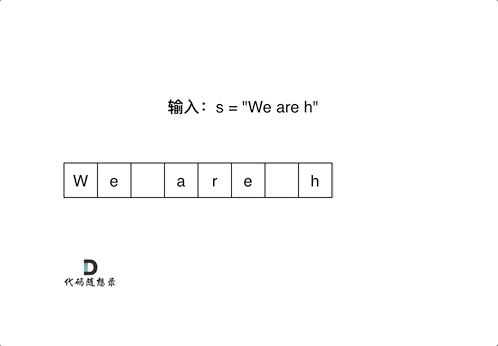
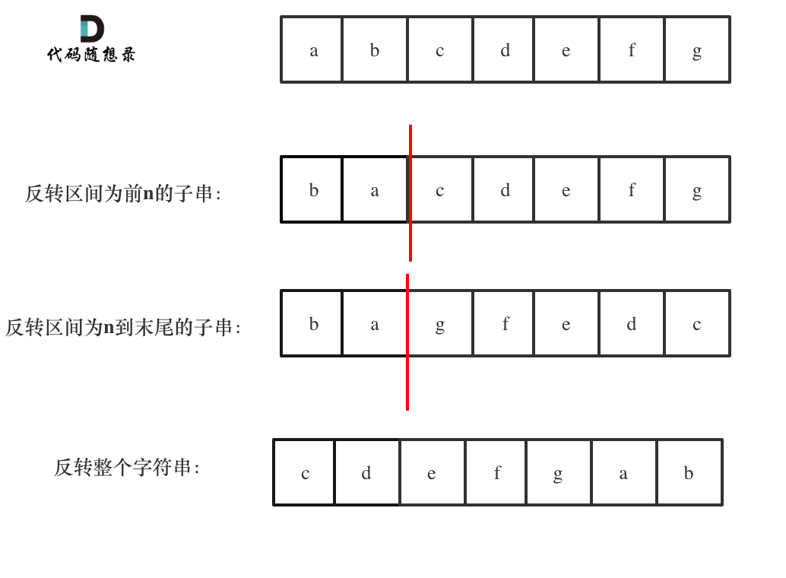

## 344. 反转字符串

- [344. 反转字符串](https://leetcode-cn.com/problems/reverse-string/)
- 0508，easy，quick
- 双指针

```js
var reverseString = function (s) {
  if (s.length === 1) return s;

  let [left, right] = [0, s.length - 1];
  while (left < right) {
    [s[left], s[right]] = [s[right], s[left]];
    left++, right--;
  }
  return s;
};
```


## 541. 反转字符串 II

- [541. 反转字符串 II](https://leetcode-cn.com/problems/reverse-string-ii/)
- 0508，easy，quick
- 双指针

自己要动手举例子画图：

1. 假设数组长度 n = 15，周期 k= 3，则通过找规律：
   - for 循环中，i 的去值就是 0, 6, 12 ==> `i += k * 2`；
   - 在每一个 for 循环时，left 指针为 i，right 指针为有三种情况：不可以反转，可以全部反转，可以部分反转
     - 不可以反转： `len - i < 1`时不可以，但等于 1 时，只有一个数也没反转的意义，所以取值 `len - i <= 1`；
     - 通过 `len - i` 和 `k` 判断字符串接近结尾的最后周期，剩余字符够不够反转完整的 k 个数字：
     - 全部反转：`right = i + k - 1`，这里面减1 就是画图得出来的，光靠想肯定容易出错；
     - 部分反转：`right = len - 1`，不够 k 个，就部分反转。

```js
var reverseStr = function (s, k) {
  const len = s.length;
  if (len == 1) return s;
  const arr = s.split("");

  for (let i = 0; i < len; i += k * 2) {
    // 不反转的情况
    if (len - i <= 1) break;

    // 反转
    let left = i;
    let right = len - i > k
      ? i + k - 1
      : len - 1;
    while (left < right) {
      [arr[left], arr[right]] = [arr[right], arr[left]];
      left++, right--;
    }
  }
  return arr.join("");
};
```


## 剑指 Offer 05. 替换空格

- [剑指 Offer 05. 替换空格](https://leetcode-cn.com/problems/ti-huan-kong-ge-lcof/)
- 0508，easy，quick

直接用 API：

```js
var replaceSpace = function(s) {
  return s.split(" ").join("%20");
};
```

用正则表达式：

```js
var replaceSpace = function(s) {
  return s.replace(/\s/g, '%20');
};
```

用双指针：

- 先统计一个有几个空格，然后扩充原字符串；
- 从后往前遍历，并赋值，遇到空格就填入 `%2`。



```js
var replaceSpace = function (s) {
  let arr = s.split('');
  let oldLength = arr.length;

  // 统计空格数量
  let count = 0;
  for (let i = 0; i < oldLength; i++) {
    if (arr[i] === ' ') count++;
  }

  // 将数组长度扩充，然后从后往前遍历，并写入字符
  arr.length = oldLength + 2 * count;
  let cur = oldLength - 1;
  for (let i = arr.length - 1; i >= 0; i--, cur--) {
    if (arr[cur] !== ' ') arr[i] = arr[cur];
    else {
      arr[i] = '0';
      arr[--i] = '2';
      arr[--i] = '%';
    }
  }
  return arr.join('');
};
```


## 151. 颠倒字符串中的单词

- [151. 颠倒字符串中的单词](https://leetcode-cn.com/problems/reverse-words-in-a-string/)
- 0508，mid，quick

方法一：熟练使用 API

- 用 trim 把开头结尾多余的空格剪掉；
- 用 split + regex 把 **连续的** 空格剪开，转化为数组；
- 用 reverse 反转数组（相当于 for 循环双指针反转）；
- 用 join 把数组转化为字符串。
- 返回结果。

```js
var reverseWords = function (s) {
  return s.trim().split(/\s+/).reverse().join(' ')
};
```

方法二：要求使用 *O(1)* 的空间解决，有空看一下[解析](https://programmercarl.com/0151.%E7%BF%BB%E8%BD%AC%E5%AD%97%E7%AC%A6%E4%B8%B2%E9%87%8C%E7%9A%84%E5%8D%95%E8%AF%8D.html#%E5%85%B6%E4%BB%96%E8%AF%AD%E8%A8%80%E7%89%88%E6%9C%AC)，这里就不做了。

方法三：如果不让用语言特性，就利用 stack 结构，依次对所有的单词执行，pop 操作即可。


## 剑指 Offer 58 - II. 左旋转字符串

- [剑指 Offer 58 - II. 左旋转字符串](https://leetcode-cn.com/problems/zuo-xuan-zhuan-zi-fu-chuan-lcof/)
- 0508，easy，quick

方法一：

```js
var reverseLeftWords = function (s, n) {
  const arr = s.split("");
  const sub = arr.slice(0, n);

  // 快慢指针
  let [slow, fast] = [0, n];
  while (fast < s.length) {
    arr[slow++] = arr[fast++];
  }
  let i = 0;
  while (slow < s.length) {
    arr[slow++] = sub[i++];
  }
  return arr.join("");
};
```

方法二：原字符串的尾部拼接 + 头部剪掉

```js
var reverseLeftWords = function (s, n) {
  return s.substring(n) + s.substring(0, n);
};
```

方法三：反转字符串，空间复杂度控制在 *O(1)*，[解析](https://programmercarl.com/%E5%89%91%E6%8C%87Offer58-II.%E5%B7%A6%E6%97%8B%E8%BD%AC%E5%AD%97%E7%AC%A6%E4%B8%B2.html)。

通过三次反转实现左旋字符串效果，空间复杂度  *O(2n)*。



## 28. 实现 strStr()

- [28. 实现 strStr()](https://leetcode-cn.com/problems/implement-strstr/)
- 0508，easy，answer ❗️
- KMP 算法

先暂时跳过 KMP 算法，因为这种算法需要背诵，现在记容易忘。

- [代码随想录：KMP](https://programmercarl.com/0028.%E5%AE%9E%E7%8E%B0strStr.html#%E5%85%B6%E4%BB%96%E8%AF%AD%E8%A8%80%E7%89%88%E6%9C%AC).

```js
var strStr = function (haystack, needle) {
    if (needle.length === 0)
        return 0;

    const getNext = (needle) => {
        let next = [];
        let j = 0;
        next.push(j);

        for (let i = 1; i < needle.length; ++i) {
            while (j > 0 && needle[i] !== needle[j])
                j = next[j - 1];
            if (needle[i] === needle[j])
                j++;
            next.push(j);
        }

        return next;
    }

    let next = getNext(needle);
    let j = 0;
    for (let i = 0; i < haystack.length; ++i) {
        while (j > 0 && haystack[i] !== needle[j])
            j = next[j - 1];
        if (haystack[i] === needle[j])
            j++;
        if (j === needle.length)
            return (i - needle.length + 1);
    }

    return -1;
};
```

方法二：暴力实现

```js
var strStr = function (haystack, needle) {
  // 	0 和 1 的特殊情况
  if (!needle.length) return 0;
  if (!haystack.length) return -1;

  for (let i = 0; i < haystack.length; i++) {
    // 找到和 needle第一个字符配对的情况
    if (needle[0] === haystack[i]) {
      // 然后和 needle后面的字符一一匹配   
      for (let j = 0; j < needle.length; j++) {
        // 如果遇到不匹配的情况，结束遍历
        if (needle[j] !== haystack[i + j]) {
          break;
        }
        // 如果needle的字符全部匹配了还没有结束遍历，则证明找到了一个想要答案
        if (j === needle.length - 1) return i;
      }
    }
  }
  return -1
};
```


## 459. 重复的子字符串

- [459. 重复的子字符串](https://leetcode.cn/problems/repeated-substring-pattern/)
- 0509，easy，answer
- 滑动窗口

想象：如果一个字符串 s 中，存在一个子串 s' ，可以在一定次数重复后构造为 s，那它们满足如下关系：

- s' 的开头一定和 s 的开头一样；
- s' 的长度最多只能是 s 的一半 ---> s' 的长度就是一个滑动窗口，从 `[1, s.length / 2]` 的范围内寻找满足条件的子串；
- s 的长度一定可以整除 s' 的长度 ---> 使用 `.repeat()` 方法重复子串。

```js
var repeatedSubstringPattern = function (s) {
    if (s.length == 1) return false;
    const len = s.length;

    for (let i = 0; i < len / 2; i++) {
        const sub = s.slice(0, i + 1);
        if (len % sub.length === 0 && sub.repeat(len / sub.length) === s) return true;
    }
    return false;
};
```


