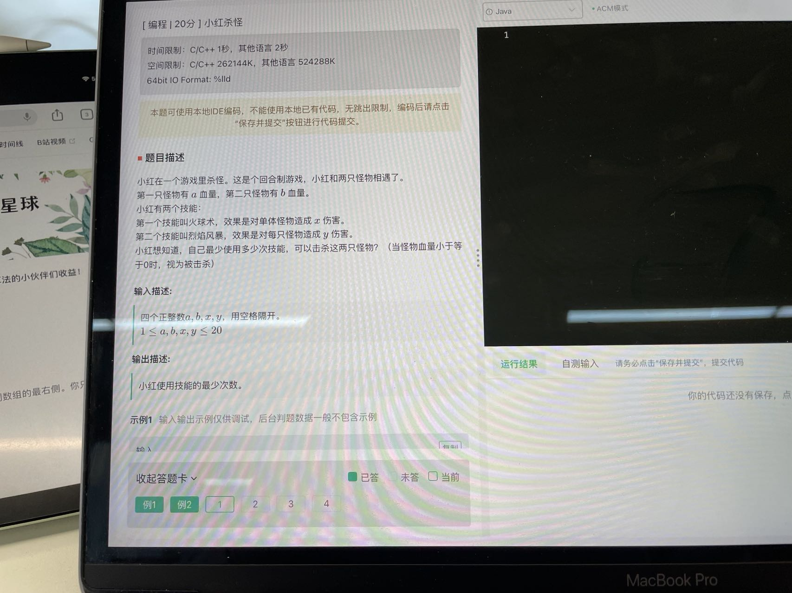
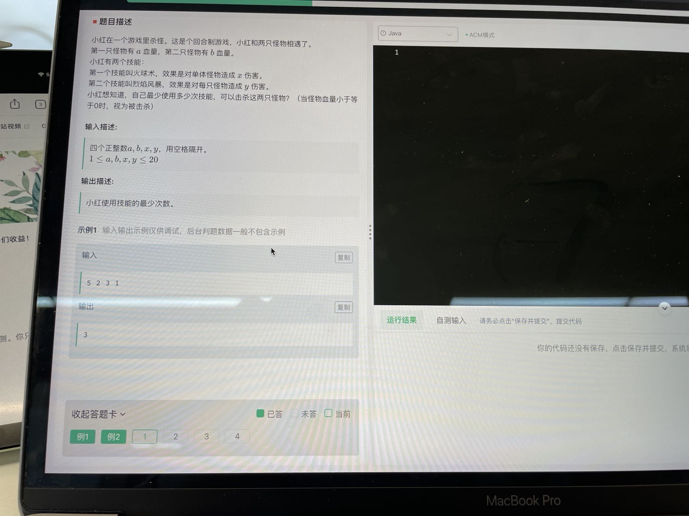
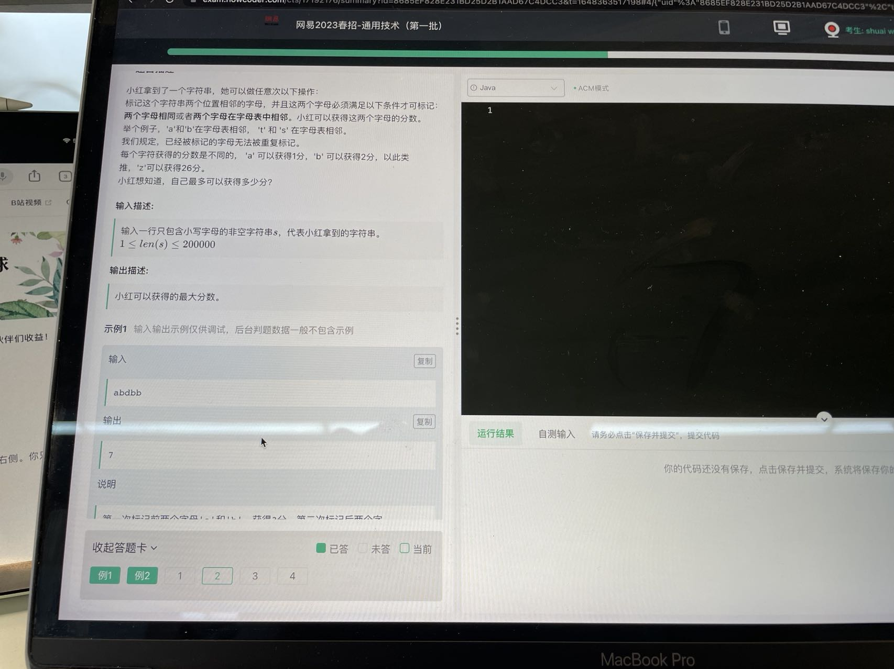
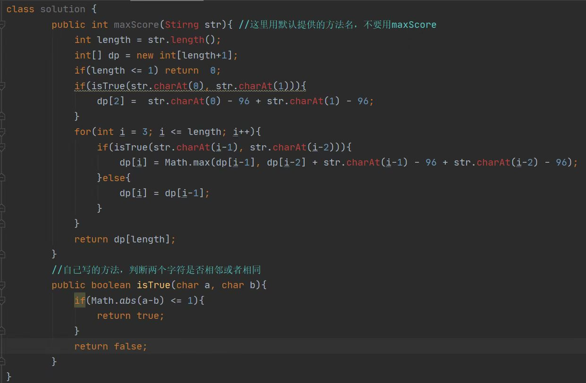
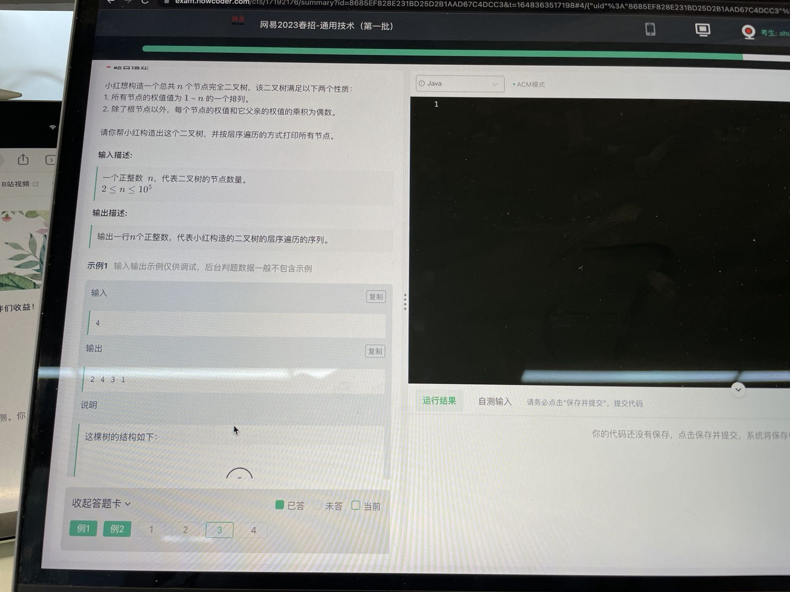
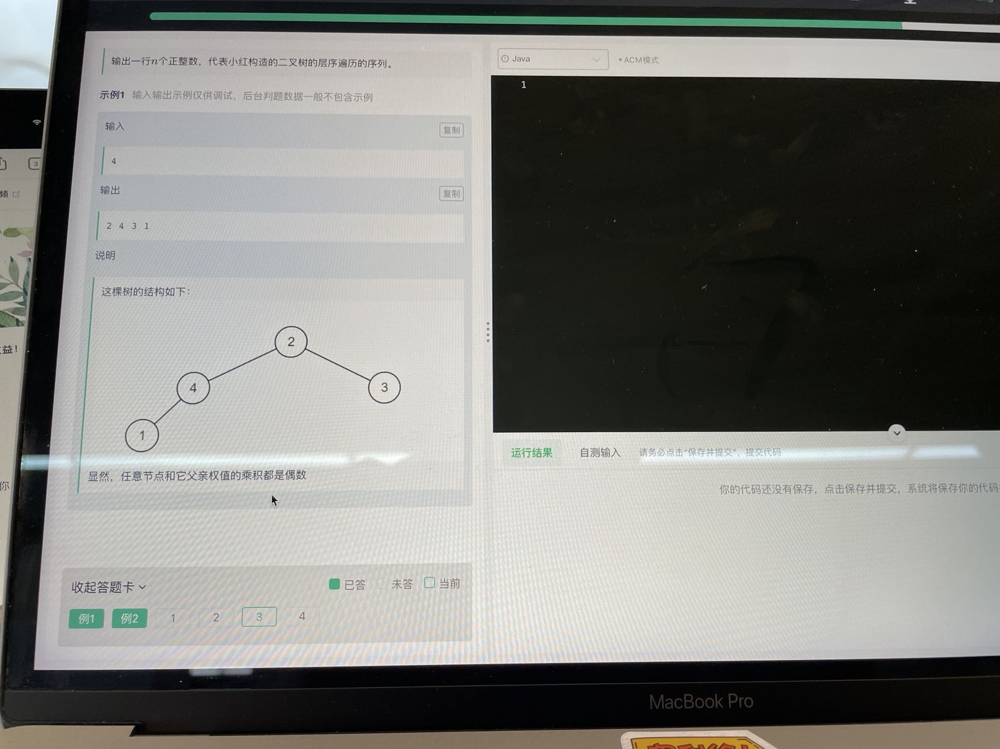
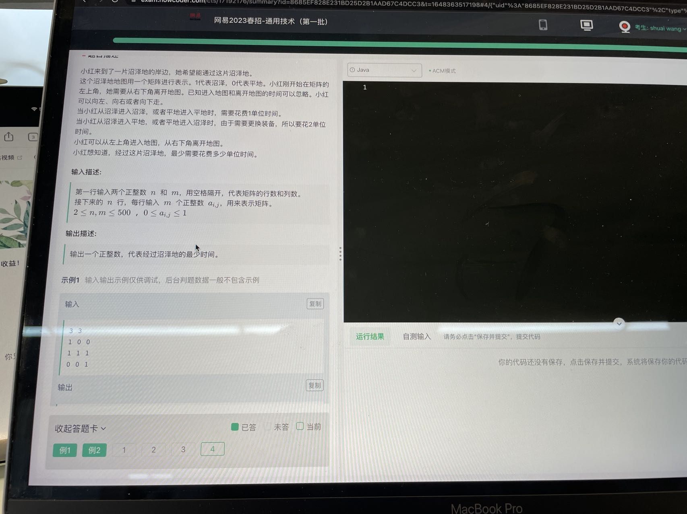

- 动态规划等等自己还不会，会了然后把这些大厂的笔试题都做了；
- 别灰心，自己掌握了做题规律，可以顺利做出来的。

牛客网资料：

- 03.27 网易笔试题：https://www.nowcoder.com/discuss/914859?type=post&order=create&pos=&page=1&ncTraceId=&channel=-1&source_id=search_post_nctrack&gio_id=DB620C113447740516A74984E52D85F7-1648370020569
- 0326 网易雷火前端笔试题：https://www.nowcoder.com/discuss/914609?type=post&order=create&pos=&page=0&ncTraceId=&channel=-1&source_id=search_post_nctrack&gio_id=DB620C113447740516A74984E52D85F7-1648370020569
- OB、ACM 模式做题：https://ac.nowcoder.com/acm/contest/5657

0327 网易原题图片：

第一题：

这个解答通过率 80，最好看看网上有没有更好的解答：

第二题：

第三题：

第四题：

