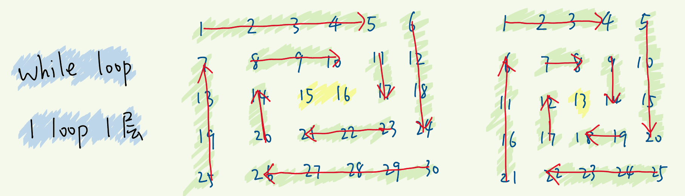

> 参考：代码随想录：[链接](https://programmercarl.com/%E6%95%B0%E7%BB%84%E7%90%86%E8%AE%BA%E5%9F%BA%E7%A1%80.html).


## 704. 二分查找

- [704. 二分查找](https://leetcode-cn.com/problems/binary-search/)
- 0502，easy，qick

中间一分为二，搜索二叉树中常用的方法。

- 二分法查找的前提是数组已经排序完成。

#### 方法一：递归

```js
var search = function (nums, target) {
	// 特值
  if (!nums.length) return -1;   
  return findNumber(nums, 0, nums.length - 1);

  function findNumber(nums, left, right) {
    const index = left + Math.floor((right - left) / 2);
    // 找不到返回 -1
    if (right < left) return -1;
    // 找得到返回结果
    if (nums[index] === target) return index;
    // 递归，寻找结果
    return target < nums[index]
      ? findNumber(nums, left, index - 1)
      : findNumber(nums, index + 1, right);
  }
};
```

- 时间复杂度：O(logn)，
- 空间复杂度：O(logn)，
  - 递归算法的空间复杂度 = 递归深度 n * 每次递归所要的辅助空间。
  - 本题中，每一次递归，都保存了 left 和 right 两个参数，所以空间复杂度和递归的次数相同为 `O(logn)`

#### 方法二：迭代

```js
var search = function (nums, target) {
  if (!nums.length) return -1;
  let [left, right] = [0, nums.length - 1];
  while (left <= right) {
    const index = left + Math.floor((right - left) / 2);

    // 找到值
    if (nums[index] === target) return index;
    // 缩小范围
    target < nums[index]
      ? right = index - 1
      : left = index + 1
  }
  return -1;
};
```

- 时间复杂度：O(logn)，
- 空间复杂度：O(1)，


## 35. 搜索插入位置

- [35. 搜索插入位置](https://leetcode-cn.com/problems/search-insert-position/)
- 0502，easy，quick
- 二分查找：递归、迭代都可以

```js
var searchInsert = function (nums, target) {
  if (nums.length === 0) return 0;
  // 二分法
  let [left, right] = [0, nums.length - 1];

  while (left <= right) {
    const index = left + Math.floor((right - left) / 2);
    if (nums[index] === target) return index;
    nums[index] > target
      ? right = index - 1
      : left = index + 1
  }
  return left;
};
```

- 时间复杂度：O(logn)，
- 空间复杂度：O(1)，


## 34. 在排序数组中查找元素的第一个和最后一个位置

- [34. 在排序数组中查找元素的第一个和最后一个位置](https://leetcode-cn.com/problems/find-first-and-last-position-of-element-in-sorted-array/)
- 0502，mid，quick
- 二分法查找的运用

思路：

1. 二分法查找，找到一个符合 target 的下标；
2. 定义 start 和 end，分别向左、右探寻重复的 target；
3. 返回 start 和 end 区间，注意减去多余的 `1` ；

```js
var searchRange = function (nums, target) {
  if (!nums) return [-1, -1];
  let [left, right] = [0, nums.length - 1];
  while (left <= right) {
    let index = left + Math.floor((right - left) / 2);
    // 找到任意一个target位置
    if (nums[index] === target) {
      // 左、右探寻target区间
      let start = end = index;
      while (nums[start] === target) start--;
      while (nums[end] === target) end++;
      return [start + 1, end - 1];
    }
    nums[index] > target
      ? right = index - 1
      : left = index + 1;
  }
  return [-1, -1]
};
```


## 69. x 的平方根

- [69. x 的平方根 ](https://leetcode-cn.com/problems/sqrtx/)
- 0502，easy，quick
- 二分法查找

我觉得有点绕，最终返回 right 而不是 left（为啥？？）

```js
var mySqrt = function (x) {
  if (x <= 1) return x;
  let [left, right] = [2, x];

  // 直到区间不存在，即 left>right结束
  while (left <= right) {
    const mid = left + Math.floor((right - left) / 2);
    x < mid * mid
      ? right = mid - 1
      : left = mid + 1;
  }
  return right;
}
```


## 367. 有效的完全平方数

- [367. 有效的完全平方数](https://leetcode-cn.com/problems/valid-perfect-square/)
- 0502，easy，quick
- 二分法查找，简单

```js
var isPerfectSquare = function (num) {
  if (num === 1) return true;
  // 二分法
  let [left, right] = [2, num];
  while (left <= right) {
    const mid = left + Math.floor((right - left) / 2);
    const pow = mid * mid;
    if (pow === num) return true;
    pow < num
      ? left = mid + 1
      : right = mid - 1;
  }
  return false;
};
```


## 27. 移除元素

- [27. 移除元素](https://leetcode-cn.com/problems/remove-element/)
- 0502，easy，quick
- 双指针

```js
var removeElement = function (nums, val) {
  if (!nums || nums.legth === 0) return 0;

  let pre = 0;
  for (let i = 0; i < nums.length; i++) {
    // 如果不是val，则i的值赋值到pre下标上。
    if (nums[i] !== val) {
      nums[pre] = nums[i];
      pre++;
    }
    // 如果遇到val，则i右移，pre等待不动。
  }
  return pre;
};
```

- 时间复杂度：O(n)
- 空间复杂度：O(1)


## 26. 删除有序数组中的重复项

- [26. 删除有序数组中的重复项](https://leetcode-cn.com/problems/remove-duplicates-from-sorted-array/)
- 0502，easy，quick
- 双指针

```js
var removeDuplicates = function (nums) {
  if (!nums || !nums.length) return 0;

  let pre = 0;
  for (let i = 0; i < nums.length; i++) {
    // 有重复
    while (nums[i] === nums[i + 1]) {
      i++;
    }
    // 正常
    nums[pre] = nums[i];
    pre++;
  }
  return pre;
};
```


## 283. 移动零

- [283. 移动零](https://leetcode-cn.com/problems/move-zeroes/)
- 0502，easy，quick
- 双指针

```js
var moveZeroes = function (nums) {
  if (!nums || !nums.length) return 0;
  let pre = 0;
  for (let i = 0; i < nums.length; i++) {
    // 先删除值为0的位置
    while (nums[i] === 0) i++;
    // 解决 nums = [0] 的情况
    if(i >= nums.length) break;
    nums[pre] = nums[i];
    pre++;
  }
  // 空余的位置填0
  while (pre < nums.length) nums[pre++] = 0;
  return nums;
};
```


## 844. 比较含退格的字符串

- [844. 比较含退格的字符串](https://leetcode-cn.com/problems/backspace-string-compare/)
- 0502，easy，anser
- 栈的应用。

字符串可以和数组一样的用下标遍历。

- 这道题考到不多，看看第一个方法，理解一下栈的用法就算了。

#### 方法一：栈

- 每当遇到普通字符，则 push 到 stack 中；
- 每当遇到 '#' 则判断：
  - 如果 stack 中有字符，则 pop；
  - 如果 stack 中没有字符，则不做任何处理；
- 最后返回 stack 去比较即可。

```js
var backspaceCompare = function (s, t) {
  return transfor(s) === transfor(t);

  // stack，遇到'#' 出栈一个元素，遇到字符入栈一个元素；
  function transfor(str) {
    if (str.length === 0) return "";
    const stack = [];
    for (let i = 0; i < str.length; i++) {
      if (str[i] === '#') {
        if (stack.length !== 0) stack.pop();
      }
      else stack.push(str[i]);
    }
    return stack.join();
  }
};
```

- 时间复杂度：*O(m+n)*，每一个字符都遍历一遍；
- 空间复杂度：*O(M+n)*，每一个字符都可能保存在 stack 中。

#### 方法二：双指针，从后遍历

从后遍历：

- 增加个中间变量 b，用来记录当前还存在的 `'#'` 数量。
- 遇到 `"#"`， `b++`；
- 遇到字符，
  - 如果 b >0 ，表示还需要跳过 b 个字符，跳过字符，同时 `b--`；
  - 如果 b = 0，表示不需要跳过字符了，正常加入字符。

```js
var backspaceCompare = function (s, t) {
  return transfor(s) === transfor(t);

  function transfor(str) {
    const arr = [];
    let b = 0;
    for (let i = str.length - 1; i >= 0; i--) {
      // 遇到 '#'
      if (str[i] === '#') b++;
      else {
        // b 有缓存，要跳过字符
        if (b > 0) b--;
        // b 没缓存，加入字符
        else arr.unshift(str[i]);
      }
    }
    return arr.join(',');
  }
};
```


## 977. 有序数组的平方

- [977. 有序数组的平方](https://leetcode-cn.com/problems/squares-of-a-sorted-array/)
- 0502，easy，quick
- 排序

#### 方法一：排序

主要考察排序算法，我这里先偷懒了，排序复习完再做。

```js
var sortedSquares = function (nums) {
  for (let i = 0; i < nums.length; i++) {
    nums[i] = nums[i] ** 2;
  }
  return nums.sort((x, y) => x - y);
};
```

#### 方法二：双指针

nums 平方的特性：

- 数组 `nums` 中的所有数都是非负数，那么将每个数平方后，数组仍然保持升序；

- 数组 `nums` 中的所有数都是负数，那么将每个数平方后，数组会保持降序。

所以，寻找 nums 中的正负数分界线 neg。neg 是负数，neg + 1 就是非负数。

- 平方后，nums 从 neg 到数组开头是一个递增序列，从 neg + 1 到数组结束也是一个递增序列。
- 所以，指针 i 指向 neg 往开头遍历，指针 j 指向 neg + 1 往结尾遍历。

```js
var sortedSquares = function (nums) {
  const len = nums.length;
  let neg = -1;
  for (let i = 0; i < len; i++) {
    if (nums[i] < 0) neg = i;
  }

  const res = [];
  // i前的都小于零，i后的都大于零；平方后，越靠近数组两端的值越大。
  let [i, j] = [neg, neg + 1];
  while (i >= 0 || j < len) {
    // 如果有一方已经全部读去完，另一方直接放入结果中;
    if (i < 0) {
      res.push(nums[j] * nums[j]);
      j++;
    }
    else if (j === len) {
      res.push(nums[i] * nums[i]);
      i--;
    }
    // 谁大就放谁
    else if (nums[i] * nums[i] < nums[j] * nums[j]) {
      res.push(nums[i] * nums[i]);
      i--;
    } else {
      res.push(nums[j] * nums[j]);
      j++;
    }
  }
  return res;
};
```

#### 方法三：双指针

- 直接从队列两端开始往里遍历。

时间复杂度：*O(n)*，

- 方法三平均时间复杂度虽然和方法二相同。但其不论最好、最坏、平均都要把数组完全遍历一遍。而方法二如果一段遍历到开头，则另一端不需要额外判断，直接往数组里按序放入即可，提升了速度。

```js
var sortedSquares = function (nums) {
  if (nums.length === 1) return [nums[0] * nums[0]];

  //  从 neg 开始，左右两端依次是一个递增序列
  let [i, j] = [0, nums.length - 1];
  const res = [];
  while (i <= j) {
    // 谁大放谁，res 是递增序列，所以从队尾插入
    if (nums[i] * nums[i] > nums[j] * nums[j]) {
      res.unshift(nums[i] * nums[i]);
      i++;
    } else {
      res.unshift(nums[j] * nums[j]);
      j--;
    }
  }
  return res;
};
```


## 209. 长度最小的子数

- [209. 长度最小的子数组](https://leetcode-cn.com/problems/minimum-size-subarray-sum/)
- 0503，mid，answer
- 滑动窗口

利用滑动窗口，可以只遍历一次就得到答案，将时间复杂度压缩到 *O(n)*。

滑动窗口的思路：

- i 和 j 分别代表窗口的开头和结尾；
- for 循环遍历序列，每次遍历使 j 先向前移动一位；
- sum 记录滑动窗口内的总值，i 和 j 只要发生变化，sum 就会重新计算。
- while 循环遍历滑动窗口，当 j 向前移动后，sum 发生变化，随之 i 也在 while 内跟着变化。

总结，i 和 j 是滑动窗口的开头和结尾，for 循环使 j 变化，带动窗口条件（sum）变化，最终让 i 变化（在 while

中）。

```js
var minSubArrayLen = function (target, nums) {
  // minLength: 返回答案，最小长度；subLength：每次遍历时符合条件的长度
  let [minLength, subLength] = [Infinity, 0];
  let sum = 0;  // 滑动窗口内的成员总值，每当i、j发生改变，就会重新计算。
  let i = 0;   // 滑动窗口的起始位置

  for (let j = 0; j < nums.length; j++) {
    // console.log('for', i, j);
    sum += nums[j];
    // 滑动窗口，每当j向前推进，就判断并推进i，从而使窗口向前推进
    while (sum >= target && i <= j) {
      // console.log('while', i, j, sum, subLength);
      subLength = j - i + 1;
      minLength = Math.min(subLength, minLength);
      sum -= nums[i];
      i++;
    }
  }
  return minLength === Infinity ? 0: minLength;
};
```


## 904. 水果成篮

- [904. 水果成篮](https://leetcode-cn.com/problems/fruit-into-baskets/)
- 0503，mid，answer

**滑动窗口** 就是解决连续去值的问题。

- 必须连着采摘，中间不能中断；

- 最多只能采摘两种，
- 寻找最长的、连续的、值仅仅有两种的序列。

要点：

- 窗口的种类是固定的，必须为 2，其实也是长度是固定的。
- res 的结果，可以直接用 窗口的宽度计算得出，不需要用 map 保存的值。


我的解法：

- 按照滑动窗口的模版，但效率不好。

```js
var totalFruit = function (fruits) {
  let res = 0;
  let i = 0   // 滑动窗口的起始
  const map = new Map(); // map 用来保存这两种水果

  for (let j = 0; j < fruits.length; j++) {
    // 新增一个
    map.set(fruits[j], (map.get(fruits[j]) || 0) + 1);

    // 窗口只能有两种果子，多了就删去
    while (map.size > 2) {
      // 减去一个
      map.set(fruits[i], map.get(fruits[i]) - 1);
      if (map.get(fruits[i]) === 0) map.delete(fruits[i]);
      i++;
    }
    res = Math.max(res, j - i + 1);
  }
  return res;
};
```

`map` 的操作：

```js
const map = new Map();
map.set("m", 2);  // 增
map.has("m");  		// 查
map.set("m", 3); 	// 改
map.delete("m");	// 删
map.clear();			// 清空
map.size;         // 长度，注意没有括号。

// 注意：
['moxy', 'ninjee', 'world'].includes('moxy')  // true 数组可以用 includes 判断是否存在某个值；

// map 的操作
map.set(fruits[j], (map.get(fruits[j]) || 0) + 1);
// 表示：对map中值为'fruits[j]'的key，执行+1操作。如果fruits[j]不存在，则设置为 1；
// 利用 || '或' 关系，如果 get()返回undefined证明这值不存在，则使用 0 为默认值。
```


## 76. 最小覆盖子串

- 0503，hard，answer
- [76. 最小覆盖子串](https://leetcode-cn.com/problems/minimum-window-substring/)
- 动态窗口解法，用  map 维护。

过于复杂，先放过，思路是上一题（904）的延伸。

- 一个 map 用来解析并保存 t 字符串中的字母和个数，在滑动窗口的时候，动态的维护这个 map。

```js
// 字符串操作
s.substring(a, b)； // 获取字符串的一个子串，效果等同于 string.slice

a.localeCompare(b)  // 比较两个字符串，按照字典顺序谁应当排在前面。
'a'.localeCompare('c');  // -1
'c'.localeCompare('a');  // 1

// 如果想删去字符串中开头的一些内容
// 先转化为 array，删去后再转化回 string
aSp.split(" ").slice(1).join(" ")
// aSp = "let1 art can" => ['xxx','own','kit','dig'] => ['own','kit','dig'] => "art can"
```

滑动窗口的要点：

- 确定窗口的条件。比如这里窗口条件就是 “s字符全部在窗口中”，具体到代码中，就是 needType === 0 需要的类型全部在窗口中。
- 动态维护的数据。这里动态维护的就是 "子串需要的字符以及个数"，每当 i 和 j 发生移动，就要重新计算这个数据。窗口是否满足要求，也是根据 动态数据 而得出的。

```js
var minWindow = function (s, t) {
  const need = new Map(); // 建立字典表示：子串需要的字符以及个数

  for (let i = 0; i < t.length; i++) { // 解析t字符串，并更新到tmap中
    need.set(t[i], (need.get(t[i]) || 0) + 1);
  }
  // console.log(need);
  let needType = need.size; // 需要的类型数量。例如t="ABC"，需要3个类型的字符，初始化时值为need.size
  let res = '';

  // 滑动窗口
  for (let l = 0, r = 0; r < s.length; r++) {
    // 【1】获取新纳入窗口的字符c
    const c = s[r]; 
    // 【2】维护动态数据，更新需求列表need
    if (need.has(c)) { // 如果c在需求列表中
      need.set(c, need.get(c) - 1);  // 窗口中，对应字符的需求总数-1
      if (need.get(c) === 0) needType -= 1;  // 如果这个类型已经没有需求，则类型总数-1；
    }
    // 【3】窗口满足条件时，更新res、移动左指针
    while (needType === 0) {  // 需求类型=0时，子串满足题干要求，包含t的所有字符
      // console.log(s.substring(l,r+1)) // subString 打印滑动窗口

      const newRes = s.substring(l, r + 1); //获取结果
      if (!res || newRes.length < res.length) res = newRes;
      // 收缩窗口
      const c2 = s[l];  // 左指针当前的字符
      if (need.has(c2)) {  // 左指针的字符在需求列表里
        need.set(c2, need.get(c2) + 1);  // 左指针即将右移，该字符的需求数量增加
        if (need.get(c2) === 1) needType += 1; // 如果字符的需求数量为1，则类型+1.
      }
      l++;  // 把左指针右移
    }
  }
  return res;
};
```


## 59. 螺旋矩阵 II

- [59. 螺旋矩阵 II](https://leetcode-cn.com/problems/spiral-matrix-ii/)
- 0504，mid，answer

> 代码随想录：[链接](https://programmercarl.com/0059.%E8%9E%BA%E6%97%8B%E7%9F%A9%E9%98%B5II.html#_59-%E8%9E%BA%E6%97%8B%E7%9F%A9%E9%98%B5ii)

- 找规律：当正整数为 n 时，可以确定循环的圈数、中间的位置等等；
- 循环不变量：要坚持顺时针循环去填入数字，同事要坚持 **左闭右开** 的原则，这样每次循环规律是相同的。

```js
var generateMatrix = function (n) {
  if (n === 1) return [[1]];
  let arr = Array.from(new Array(n), () => new Array(n).fill(0));

  let [top, bottom] = [0, n - 1];
  let [left, right] = [0, n - 1];
  let count = 1;     // 填充的数字

  while (top < bottom && left < right) {
    for (let i = left; i < right; i++) res[top][i] = count++;   // 上层
    for (let i = top; i < bottom; i++) res[i][right] = count++; // 右层 
    for (let i = right; i > left; i--) res[bottom][i] = count++;// 下层
    for (let i = bottom; i > top; i--) res[i][left] = count++;  // 左层

    top++, bottom--;
    left++, right--;
  }
  // 添加最中间的一个
  if (top == bottom) res[top][top] = count;
  return res;
};
```


## 剑指 Offer 29. 顺时针打印矩阵

- [剑指 Offer 29. 顺时针打印矩阵](https://leetcode-cn.com/problems/shun-shi-zhen-da-yin-ju-zhen-lcof/)
- 0504，easy，answer
- 太绕了，用四个下标解决

最近剩余的无法圈成一圈的条，单独输出：



```js
const spiralOrder = (matrix) => {
  if (matrix.length == 0) return [];
  const res = [];
  let [top, bottom] = [0, matrix.length - 1];
  let [left, right] = [0, matrix[0].length - 1];

  while (top < bottom && left < right) {
    for (let i = left; i < right; i++) res.push(matrix[top][i]);   // 上层
    for (let i = top; i < bottom; i++) res.push(matrix[i][right]); // 右层
    for (let i = right; i > left; i--) res.push(matrix[bottom][i]);// 下层
    for (let i = bottom; i > top; i--) res.push(matrix[i][left]);  // 左层

    top++, bottom--;
    left++, right--; 
  }
  if (top == bottom) { // 剩下一行，从左到右依次添加
    for (let i = left; i <= right; i++)  res.push(matrix[top][i]);
  } else if (left == right) { // 剩下一列，从上到下依次添加
    for (let i = top; i <= bottom; i++) res.push(matrix[i][left]);
  }
  return res;
};
```


