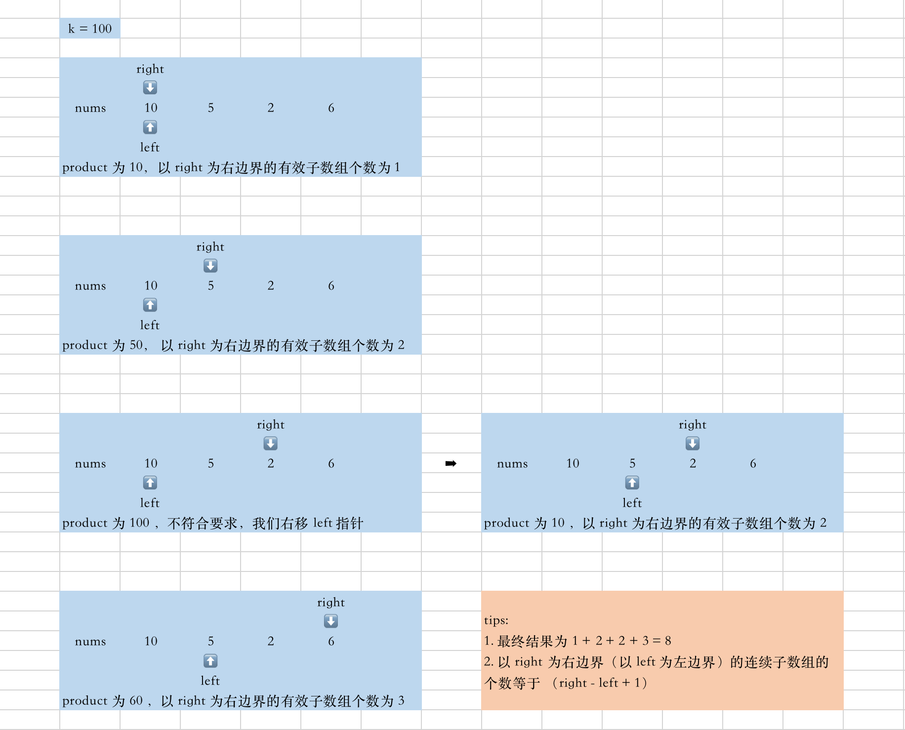

---

title: 5月 上
date: 2022-05-01
tags: [algorithm, everyday]

---


## 0501｜[1305. 两棵二叉搜索树中的所有元素](https://leetcode-cn.com/problems/all-elements-in-two-binary-search-trees/)

暴力解：

- 递归中序遍历，把结果全部写的 res 中，然后 sort 排序；
- 优化空间：见官方解法，
  - 用 num1 和 nums2 分别拿到 root1 和 root2 中序遍历的结果，是递增的；
  - 然后利用双指针 p1 和 p2 把 num1 和 num2 合并到 res 数组中。时间复杂度为 *O(m+n)*

```js
var getAllElements = function (root1, root2) {
  const res = [];
  dfs(root1);
  dfs(root2);
  return res.sort((x, y) => x - y);

  function dfs(node) {
    if (!node) return node;
    dfs(node.left);
    res.push(node.val);
    dfs(node.right);
  }
};
```

时间复杂度：*O(n+m) + nlogn* ===> *O(nlogn)*


## 0502 ｜ [591. 标签验证器](https://leetcode-cn.com/problems/tag-validator/)

正则：

> - [正则表达式不要背](https://juejin.cn/post/6844903845227659271).
> - 留个标记，winter 玩具浏览器 toy browser 可以按照这个思路优化。

#### 1. 正则中 `.*?` 是什么意思？

- `.` ： 匹配 1 个字符，匹配 **任何** 单个字符；
- `*` ：匹配 ≥ 0 个字符，匹配 **在它之前的那个** 字符。
- `?`：匹配 0|1 个字符，匹配 **在它之前的那个** 字符。

所以：

- `.*`：匹配任何字符 ≥ 0 个；
- `.?`：匹配任何字符 0|1 个；

那么：

`.*？` ： 匹配表示匹配任意字符到下一个符合条件的字符。

- 例子：正则表达式`a.*?xxx` 可以匹配 `abxxx` `axxxxx` `abbbbbxxx`。

`.*`：尽可能匹配符合条件的字符，尽可能长，贪婪模式

例子：

- 字符串：`` 如果要匹配 src 的属性值；
- `src=".*"`， 匹配结果是：`src="test.jpg" width="60px" height="80px" `
  - 贪婪模式：意思是从 `="` 往后匹配，直到最后一个 `"`，匹配结束。
- `src=".*?"`，匹配结果是：`src="test.jpg"`
  - 懒惰模式：匹配到第一个 `"` 就结束了一次匹配，不会继续向后匹配。


#### 2. 正则中 `[A-Z]{1,9}` 是什么意思？

- 正则中的方括号 `[]` 表示集合，也就是说只要字符串内容是 A-Z 中的任意大写字母都可以。

- 正则中的大括号 `{}` 表示次数，也就是匹配 `{}` 的前一个字符的次数：

  ```js
  - {x} // x次
  
  - {min, max} // 介于 min 次到 max 次之间
  
  - {min, } // 至少 min 次
  
  - {0, max} // 至多 max 次
  
  - ？ // 0|1 次
  - *  // ≥ 0 次, 也就是不限制次数，尽可能匹配最长
  - +  // ≥ 1 次
  ```

  - `/a{3}/` 表示匹配 a 3次

所以：原题目中的意思是匹配一个字符串，长度是 1-9 (含9) 个字符，这些字符必须是大写字母。

#### 方法一：使用正则

```js
var isValid = function (code) {
  // cdata 内容
  let reg1 = new RegExp(/<!\[CDATA\[.*?\]\]>|t/g);
  // 开始、结束标签 \1 是一个回溯引用，引用了开始标签`<...>`的内容。
  let reg2 = new RegExp(/<([A-Z]{1,9})>[^<]*<\/\1>/);
  // 匹配cdata，然后置换为 - ；
  code = code.replace(reg1, "-");
  let temp = '';
  while (temp != code) {
    temp = code;
    code = code.replace(reg2, "t");
    console.log(code);
  }
  return code == 't';
};
```

#### 方法二：使用状态机

- leetcode解析：[链接](https://leetcode-cn.com/problems/tag-validator/solution/biao-qian-yan-zheng-qi-by-leetcode-solut-fecy/).
- 栈 + 字符串遍历

```js
var isValid = function (code) {
  const n = code.length;
  const tags = [];

  let i = 0;
  while (i < n) {
    // 开始标签、结束标签、CDATA开头
    if (code[i] === '<') {
      if (i === n - 1) {
        return false;
      }
      // 结束标签
      if (code[i + 1] === '/') {
        const j = code.indexOf('>', i);
        if (j < 0) {
          return false;
        }
        const tagname = code.slice(i + 2, j);
        // 找到结束标签，让栈中的开始标签出栈，比对是否相等。
        if (tags.length === 0 || tags[tags.length - 1] !== tagname) {
          return false;
        }
        tags.pop();
        i = j + 1;
        if (tags.length === 0 && i !== n) {
          return false;
        }
        // CDATA 内容
      } else if (code[i + 1] === '!') {
        if (tags.length === 0) {
          return false;
        }
        if (i + 9 > n) {
          return false;
        }
        const cdata = code.slice(i + 2, i + 9);
        if ("[CDATA[" !== cdata) {
          return false;
        }
        const j = code.indexOf("]]>", i);
        if (j < 0) {
          return false;
        }
        i = j + 1;
        // 开始标签
      } else {
        const j = code.indexOf('>', i);
        if (j < 0) {
          return false;
        }
        const tagname = code.slice(i + 1, j);
        // 判断开始标签是否符合长度 1-9 要求
        if (tagname.length < 1 || tagname.length > 9) {
          return false;
        }
        // 判断开始标签是否符合字母 A-Z 要求
        for (let k = 0; k < tagname.length; ++k) {
          if (!(tagname[k] >= 'A' && tagname[k] <= 'Z')) {
            return false;
          }
        }
        // 开始标签符合要求，写入 stack 中。
        tags.push(tagname);
        i = j + 1;
      }
    } else {
      // 如果没有 '<' 则只有两种情况：
      // 1. 处在一个开始标签內，且不在CDATA内：'<HTML> ......'，这时候让 i++；
      // 2. 不在一个开始标签内，'....<HTML>aaa</HTML>'，这时候不符合标准，返回false。通过判断 tags.length 是否为0可以知道。
      if (tags.length === 0) {
        return false;
      }
      ++i;
    }
  }

  return tags.length === 0;
};
```


## 0503 | [937. 重新排列日志文件](https://leetcode-cn.com/problems/reorder-data-in-log-files/)

对 sort 的灵活运用。

```js
var reorderLogFiles = function (logs) {
  // 保存 0 和 9 字母的code值
  const ZERO = '0'.charCodeAt(0);  // 48
  const NINE = '9'.charCodeAt(0);  // 57

  // 原地排序
  logs.sort((a, b) => {
    // 判断是否为数字日志：dig开头。
    // 思路：题干说“数字日志的所有字均由数字组成”，
    // 所以：判断最后一个字符是否为数字。
    const aDig = a.charCodeAt(a.length - 1) >= ZERO && a.charCodeAt(a.length - 1) <= NINE;
    const bDig = b.charCodeAt(b.length - 1) >= ZERO && b.charCodeAt(b.length - 1) <= NINE;
    // console.log(a, '->', aDig, '||', b, "->", bDig);

    if (aDig && bDig) return 0; // 都是数字：保留相对位置
    else if (aDig) return 1;    // 如果只有a是数字，则a排在后面；反之亦然
    else if (bDig) return -1;

    // 都是false，都是字母日志:
    // 由空格把 string 切割为 array ：eg. "let1 art can" ==> ['let2', 'own', 'kit', 'dig']
    const [aSp, bSp] = [a.split(" "), b.split(" ")];
    // slice(1) 删去数组第一个成员，其为字母标识符。
    // join(" ") 把 array 合并为 string。
    // localeCompare 比较两个字符串，按照字典顺序谁应当排在前面。
    const cmp = aSp.slice(1).join(" ").localeCompare(bSp.slice(1).join(" "));
    // console.log(aSp, bSp, cmp);

    if (cmp != 0) return cmp;
    // 如果内容相同，则按照标识符排序
    return aSp[0].localeCompare(bSp[0]);
  })
  return logs;
};
```


## 0504｜[1823. 找出游戏的获胜者](https://leetcode-cn.com/problems/find-the-winner-of-the-circular-game/)

这道题使用队列也可以。

- 遍历 quene 时，从队尾拿出一个成员，然后再从对头插入。如此循环。

这里使用的是链表：

```js
var findTheWinner = function (n, k) {
  // 边界
  if (k === 1) return n;
  // 构造一个循环链表
  const head = new TreeNode(1);
  let point = head;
  for (let i = 2; i <= n; i++) {
    point.next = new TreeNode(i);
    point = point.next;
  }
  point.next = head;


  // 循环
  point = head;
  while (point !== point.next) {  // 当一个结点.next指向自己时，表明链表成员只有一个。
    let pre = point; // pre 用于删除结点
    for (let i = 0; i < k - 1; i++) {  // 遍历，point 指向了待删除节点
      pre = point;
      point = point.next;
    }
    // 删除结点
    pre.next = point.next;
    point = pre.next;
  }
  return point.val;

  // 创建一个结点
  function TreeNode(val) {
    this.val = val;
    this.next = null;
  }
};
```


## 0505｜[713. 乘积小于 K 的子数组](https://leetcode-cn.com/problems/subarray-product-less-than-k/)

- mid
- 滑动窗口。

求连续子树组的个数，“**连续子树组**”很强的暗示———使用滑动窗口。

本题只需记录 **以每个数字为右边界所形成的有效子数组的个数** ==>  `right  - left + 1 `。

注意：

- 如果 k 为 <= 1 时，一定不存在有效结果，直接返回 0；
- 每次 while 循环，窗口因 right 都会向右扩展。
  - 然后需要根据条件 `count` 小于总数 k，通过移动 left 收缩左边界。
  - 直到 count 满足条件，计算此时 "**以 right 为右边界的有效子数组个数**" ，累加到结果中。



```js
var numSubarrayProductLessThanK = function (nums, k) {
  if (k <= 1) return 0;
  // 滑动窗口：right
  let res = 0;
  let left = right = 0;
  let count = 1;

  while (right < nums.length) {
    count *= nums[right];
    // 不满足情况
    while ( count >= k) {
      count /= nums[left];
      left++;
    }
    // 以 right 为右边界的有效子数组个数
    res += right - left + 1;
    right++;
  }
  return res;
};
```


###  **❗️todo 看解析，学一下动态区间的模版，在这道题的题解里**


## 0506｜[933. 最近的请求次数](https://leetcode-cn.com/problems/number-of-recent-calls/)

- 队列的动态存储，不需要的值就及时抛弃（每次把超时的踢掉）
- `this` 的使用，原型链时间长了有点忘。

复杂度：

- 时间复杂度：均摊 *O*(1)，每个元素最多 入队 / 出队 各一次。
- 空间复杂度：*O*(*L*)，*L* 为队列的元素个数。

```js
var RecentCounter = function () {
  this.queue = [];
};

RecentCounter.prototype.ping = function (t) {
  this.queue.push(t);
  while ( this.queue[0] < t - 3000 ) {
    this.queue.shift();
  }
  return this.queue.length;
};
```


## 0507｜[433. 最小基因变化](https://leetcode-cn.com/problems/minimum-genetic-mutation/)

- 一个 bfs / dfs 的应用题。
- 历年没考过，但思路不错。

方法一：bfs

```js
const CHARS = ["A", "C", "G", "T"]
var minMutation = function (start, end, bank) {
  const bankSet = new Set(bank);
  const queue = [{ gene: start, step: 0 }];

  // bfs
  while (queue.length) {
    const { gene, step } = queue.shift();
    // 遍历单个基因: A, C, G, T
    for (let i = 0; i < gene.length; i++) {
      // 对每个基因进行替换，有3种替换方式
      for (const nextChar of CHARS) {
        if (gene !== nextChar) {
          // 构建下一个基因序列
          const next = gene.substring(0, i) + nextChar + gene.substring(i + 1);
          // 下一个序列必须在基因库中，
          if (bankSet.has(next)) {
            // 返回结果
            if (next === end) return step + 1;
            // 已经使用过该基因，则从库中删去
            bankSet.delete(next);
            // 迭代：bfs
            queue.push({ gene: next, step: step + 1 });
          }
        }
      }
    }
  }
  return -1;
};
```

方法二：dfs

```js
var minMutation = function (start, end, bank) {
  // 基因库不存在目标基因
  if (bank.indexOf(end) === -1) return -1;

  // 可以进行的操作，如果基因段是 'A'，则可以改变为 C,G,T，共3种基因字段。
  const map = new Map([['A', 'CGT'], ['C', 'AGT'], ['G', 'ACT'], ['T', 'ACG']]);
  // 基因库
  const bankMap = new Set(bank);
  // 基因发生变化的过程
  const changeMap = new Set();

  return dfs(start, end, 0);

  // dfs: cur 当前基因序列
  function dfs(cur, target, step) {
    // 找到 target 返回结果
    if (cur === target) return step;
    // 找到 cur 变化的下一个基因序列（24种）
    const nextStatus = getNextStatus(cur);

    for (let nextStr of nextStatus) {
      // 过滤：基因库中不存在该序列，或者与已经变化过的序列重复
      if (!bankMap.has(nextStr) || changeMap.has(nextStr)) continue;
      changeMap.add(nextStr);
      // 递归: 深度遍历
      const ans = dfs(nextStr, target, step + 1);
      // 剪枝: 找不到有效的下一个基因序列，就及时结束递归
      if (ans !== -1) return ans;
    }
    // 找不到一个有效的下一个基因序列
    return -1;
  }

  // 获得当前基因序列的下一次变化序列（一共有24种可能性）。
  // params: geneStr 当前基因序列
  // return: <nextGeneStr>[]
  function getNextStatus(geneStr) {
    let geneArr = Array.from(geneStr), nextStatus = [];

    // 遍历基因序列的每一个字母，列出所有可以能改变，一共有 3*8=24 种
    for (let i = 0; i < 8; i++) {
      const temp = [...geneArr];
      const nextChars = map.get(geneArr[i]);  // 'A' -> 'CGT'

      for (let j = 0; j < 3; j++) {   // 遍历 'CGT'
        temp[i] = nextChars[j];       // ['A','T','T'...] -> ['C','T','T'...]
        nextStatus.push(temp.join(''));    //            --> .push('CTT...');
      }
    }
    return nextStatus;
  }
};
```


## 0508｜[442. 数组中重复的数据](https://leetcode-cn.com/problems/find-all-duplicates-in-an-array/)

方法一：set

遍历时，用 set 保存数据，当遍历到重复内容（`set.has()`)，则 push 到结果中。

时间复杂度：*O(n)*，空间复杂度：*O(n)*；

```js
var findDuplicates = function(nums) {
  if (nums.length < 2) return [];
  const set = new Set();
  const res = [];

  for (let n of nums) {
    if (set.has(n)) res.push(n);
    else set.add(n);
  }
  return res;
};
```


## 0509｜[942. 增减字符串匹配](https://leetcode.cn/problems/di-string-match/)

贪心：根据提干规则，输入的 s 字符串长度为 n，输出的 perm 的长度就是 n + 1，

- 那么可以定义 perm 中所有 number  的范围为 `[0, n]`。其中 `min = 0, max = n`；
- 我们可以这样想，如果：
  - `s[i] == 'I'`，那么只要 `perm[i]` 尽可能小就可满足条件，那只需要把当前最小的 `min` 放入即可，同时把 `min++`；
  - `s[i] == 'D' `，同样的放入当前最大的值 `max` 即可，然后把 `max++`；
  - perm 直到最后一个成员，此时 `min` 和 `max` 已经相等，加入哪一个都可以。


- 时间复杂度：*O*(*n*)；空间复杂度：*O*(1)

```js
var diStringMatch = function (s) {
  const len = s.length;
  const res = [];
  let [min, max] = [0, len];

  for (let i = 0; i < len; i++) {
    res[i] = s[i] === 'I' ? min++ : max--;
  }
  res.push(min);
  return res;
};
```


## 0510｜[1728. 猫和老鼠 II](https://leetcode.cn/problems/cat-and-mouse-ii/)

太难，不做。


## 0511｜[449. 序列化和反序列化二叉搜索树](https://leetcode.cn/problems/serialize-and-deserialize-bst/)

二叉树相关知识。

- 二叉搜索树的中序遍历，会生成一个递增序列；
- 中序遍历 + 前序 / 后序遍历可以还原一个二叉树。

所以，当拥有一个二叉搜索树的后序遍历时，可以通过 sort 生成一个中序遍历序列，然后根据 中序 + 后序 的序列还原。

```js
var serialize = function (root) {
  if (!root) return "";

  // 后序遍历
  const res = [];
  const stack = [root];
  while (stack.length) {
    const node = stack.pop();
    // 根、左、右
    res.push(node.val);
    node.left && stack.push(node.left);
    node.right && stack.push(node.right);
  }
  return res.reverse().join(',');
};


var deserialize = function (data) {
  if (!data) return null;

  const porder = data.split(',').map(item => parseInt(item));
  const inorder = [...porder].sort((x, y) => x - y);
  const len = porder.length;
  return build(0, len - 1, 0, len - 1);

  function build(inL, inR, poL, poR) {
    // 边界
    if (inL > inR) return null;
    const root = new TreeNode();
    root.val = porder[poR];
    const index = inorder.indexOf(root.val);
    const length = index - inL;

    // 中序：左、根、右；[inL, inR]
    // 后序：左、右、根；[poL, poR]
    root.left = build(inL, index - 1, poL, poL + length - 1);
    root.right = build(index + 1, inR, poL + length, poR - 1);
    return root;
  }
};
```

取巧：绕过了从序列构造二叉树的问题，直接用 JSON 相关 API 完成。

```js
var serialize = function (root) {
  return JSON.stringify(root);
};

var deserialize = function (data) {
  return JSON.parse(data);
};
```

**最终版本：**

- 不需要再构造一个 中序遍历的序列，直接在 build 的时候判断即可：
- 因为可以唯一确定，所以我们只需要通过 `stack.pop()`  不断拿出中序遍历的结果。
  - 结果是按照：左、右、根的顺序放入的。所以 `stack.pop()` 拿出来的顺序自然是：根、左、右。每次拿出当前子树的根结点。
  - 需要判断：当前要处理的根结点 `stack[stack.length - 1]` 是否处在合理区间内：
    - 左子树的区间：`(root.val, right)`；
    - 右子树的区间：`(left, root.val)`；
  - 如果符合区间，那可以确定当前处理节点应当放入对应子树下，否则证明对应子树下不再有节点，返回 null，判断下一个位置。
    - 因为如果有节点，在按照后序遍历序列化时，一定要放在序列的这个位置。如果序列的这个位置没有符合条件的值（在合理区间内），那么说明原二叉树中的对应位置为 null。

```js
var serialize = function (root) {
  // [12,5,18,2,9,15,19,null,null,null,null,null,17]
  if (!root) return "";

  // 后序遍历
  const res = [];
  const stack = [root];
  while (stack.length) {
    const node = stack.pop();
    // 根、左、右
    res.push(node.val);
    node.left && stack.push(node.left);
    node.right && stack.push(node.right);
  }
  return res.reverse().join(',');
};


var deserialize = function (data) {
  if (!data) return null;
  
  // [2, 9, 5, 17, 15, 19, 18, 12]
  const stack = data.split(',').map(item => parseInt(item));
  const length = stack.length;
  
  return construct(-Infinity, Infinity);

  function construct(left, right) {
    // 边界
    if (stack.length === 0) return null;
    // 要判断的当前插入的根结点在不在 (left, right) 区间内，不在返回null，位置不是这里。
    if (stack[stack.length - 1] < left || stack[stack.length - 1] > right) return null;

    const val = stack.pop();  // stack 中的顺序：根、右、左
    const root = new TreeNode(val);
    root.right = construct(val, right);  // root.right.val > root.val 右子树要大，取值区间为 (val, right);
    root.left = construct(left, val);    //  root.left.val < root.val 左子树要小，取值区间为 (left, val);
    return root;
  }
};
```


## 0512｜[944. 删列造序](https://leetcode.cn/problems/delete-columns-to-make-sorted/)

解答思路：

```js
var minDeletionSize = function(strs) {
    const row = strs.length;
    const col = strs[0].length;
    let ans = 0;
    for (let j = 0; j < col; ++j) {
        for (let i = 1; i < row; ++i) {
          	// 直接比较同列上一个数字是否小即可，注意 i 从‘1’开始遍历
            if (strs[i - 1][j] > strs[i][j]) {
                ans++;
                break;
            }
        }
    }
    return ans;
};
```

- 时间复杂度：*O(m×n)*，其中 *m* 为字符串数组的长度，*n* 为数组中每个字符串的长度，判定每一列的的字典序需要遍历字符串数组每一列，因此时间复杂度为 *O(m×n)*。

- 空间复杂度：*O(1)*。


我的思路：

- 对按照列进行判断，那我们初始化一个保存每列情况的 list，并对 list 赋小于初始值 ‘a’ 的初始值。
- 然后双层 for 循环遍历成员，对每个数字按照自己对应的列来比较，如果符合预期（递增）就让 list 对应位置更新值，如果不如何预期，则对 list 对应位置赋 Inifinity。
- 最后，计算 list 中有几个 Inifinity，就证明有几个不符合条件。

```js
var minDeletionSize = function (strs) {
  let list = new Array(strs[0].length).fill('a'.charCodeAt() - 1);

  for (let row = 0; row < strs.length; row++) {
    for (let col = 0; col < strs[0].length; col++) {
      if (strs[row][col].charCodeAt() < list[col]) list[col] = Infinity;
      else list[col] = strs[row][col].charCodeAt();
    }
  }
  return list.reduce((prev, curv) => {
    if (curv === Infinity) return prev += 1;
    return prev;
  }, 0)
};
```

- 时间复杂度不变，空间需要额外维护一个长度为 m（每个单词的长度）的数组。


## 0515｜[812. 最大三角形面积](https://leetcode.cn/problems/largest-triangle-area/)

方法一：回溯算法，同时利用剪枝优化。

- 时间复杂度：参考回溯的时间复杂度。

```js
var largestTriangleArea = function (points) {
  let res = 0;
  const len = points.length;
  const path = [];

  backtracking(0);
  return res;

  // 递归：每次传入 startIndex 确定下一次 for 循环的范围
  function backtracking(startIndex) {
    // 边界：当找到一个组合时，登记结果，结束递归。
    if (path.length === 3) {
      const [[x1, y1], [x2, y2], [x3, y3]] = [path[0], path[1], path[2]];
      res = Math.max(res, 0.5 * Math.abs(x1 * (y2 - y3) + x2 * (y3 - y1) + x3 * (y1 - y2)));
      return;
    }

    for (let i = startIndex; i < len - (3 - path.length) + 1 ; i++) {
      path.push(points[i]);
      backtracking(i + 1);
      path.pop(points[i]);
    }
  }
};
```

方法二：暴力解

- 用三层 for 循环，虽然时间复杂度提升，但不需要额外的空间。

```js
var largestTriangleArea = function(points) {
    const n = points.length;
    let ret = 0.0;
    for (let i = 0; i < n; i++) {
        for (let j = i + 1; j < n; j++) {
            for (let k = j + 1; k < n; k++) {
                ret = Math.max(ret, triangleArea(points[i][0], points[i][1], points[j][0], points[j][1], points[k][0], points[k][1]));
            }
        }
    }
    return ret;
};

const triangleArea = (x1, y1, x2, y2, x3, y3) => {
    return 0.5 * Math.abs(x1 * y2 + x2 * y3 + x3 * y1 - x1 * y3 - x2 * y1 - x3 * y2);
}
```


