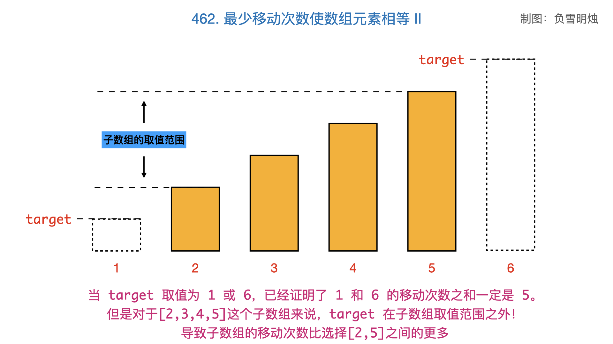

---

title: 5月 下
date: 2022-05-15
tags: [algorithm, everyday]

---


## 0515｜[面试题 04.06. 后继者](https://leetcode.cn/problems/successor-lcci/)

#### 方法一：中序遍历

思路：当在 while 中遍历每一个节点时，

1. 如果找到了节点 p，那把 flag 的值从默认的 false 设置为 true；
2. 在遍历每个节点时判断：如果 flag 为 true，证明已经找到了节点 p，此时当前节点 point 就是要找的 p 的后继节点，直接返回。

```js
var inorderSuccessor = function (root, p) {
  if (!root) return null;

  let flag = false;
  const stack = [];  // stack.push(point.left)
  let point = root;

  while (stack.length || point) {
    if (point !== null) {
      stack.push(point);     // 遍历左子树
      point = point.left;
    } else {
      point = stack.pop()
      if (point.val === p.val) flag = true;  // 找到 p 节点，调整 flag
      else if (flag) return point; 	// 如果 flag 为 true，返回 point
      point = point.right
    }
  }
  return null;
};
```

#### 方法二：利用二叉搜索树的特性

二叉搜索树的中序遍历，结果是递增的，这就意味着当找到节点 p 后，后继节点是 ` p.val` 值大的所有集合中，最小的值。

它的后继节点只有两种情况：

- `p.right` 存在，那么后继节点就在右子树中的最左下角：`p.right.left.left...left`。
- `p.right` 不存在，那么此时中序遍历回回溯到父节点，也就是进入 `p` 这左子树的父节点。

```js
var inorderSuccessor = function (root, p) {
  let parent = null;
  let cur = root;
  while (cur !== null) {
    if (cur.val <= p.val) {
      // 往右子树找
      cur = cur.right;
    } else {
      // 往左子树找，保存父节点信息
      parent = cur;
      cur = cur.left;
    }
  }
  return parent;
};
```


## 0516｜[691. 贴纸拼词](https://leetcode.cn/problems/stickers-to-spell-word/)

hard 跳过。


## 0517｜[953. 验证外星语词典](https://leetcode.cn/problems/verifying-an-alien-dictionary/)

#### 方法一：下标

从第二个单词开始（`i = 1`），每个单词与前一个单词进行对比，看是否符合标准。

- 时间复杂度：单词个数 * ( 单词长度 + 26 个字母 * 2 ) = *O(m x ( n + 26 x 2))*;
  - *m* 为字符串数组的长度，*n* 为数组中字符串的平均长度，26 为 order 的长度，是 indexOf 的时间复杂度。
- 空间复杂度：*O(1)*

```js
var isAlienSorted = function (words, order) {
  if (words.length === 1) return ture; // 长度不足1，直接true
  const len = words.length;
  let i = 1, j = 0;
  while (i < len) {
    // 相等就跳过，直到找到不相等的
    while (order.indexOf(words[i - 1][j]) === order.indexOf(words[i][j])) {
      // 相等，比较第二位，所以 j++
      j++;
      // 一样长，且达到边界，则两组单词相等，跳过while循环
      if (words[i-1].length === words[i].length && j === words[i].length - 1) break;
      // 前面的短，符合规则，跳过while循环
      if (words[i - 1].length === j && words[i].length !== j) break;
      // 后面的短，不符合规则，直接false
      else if (words[i - 1].length !== j && words[i].length === j) return false;
    }
    // 第一个单词大，不符合规则，直接false
    if (order.indexOf(words[i - 1][j]) > order.indexOf(words[i][j])) return false;
    i++;
  }
  return true;
};
```

#### 方法二：map

用 map 存储 26个字母的顺序，且用 charAt 来比较，更直观：

- 优化，内层以第一个单词的长度来遍历。
- 复杂度：
  - 空间复杂度提升（存储一个 map）：*O(C)*，C 为 26个字母。？？存疑，一个 map  的空间复杂度怎么看。
  - 时间复杂度：单词个数 * 单词长度 = *O(m x n)*;
    - *m* 为字符串数组的长度，*n* 为数组中字符串的平均长度，省区 indexOf 的时间复杂度。

```js
var isAlienSorted = function (words, order) {
  if (words.length === 1) return ture;
  const map = new Map();
  for (let i = 0; i < order.length; i++) map.set(order[i].charAt(), i);

  for (let i = 1; i < words.length; i++) {
    // 遍历的次数：前一个单词的长度
    // 如果两个单词的字母一直相等，就一直循环
    for (let j = 0; j < words[i - 1].length; j++) {
      // 查看后一个单词是否超出边界
      if (j === words[i].length) return false;

      const temp = map.get(words[i][j].charAt()) - map.get(words[i - 1][j].charAt());

      if (temp < 0) return false;
      else if (temp > 0) break;
    }
  }
  return true;
};
```


## 0518｜[668. 乘法表中第k小的数](https://leetcode.cn/problems/kth-smallest-number-in-multiplication-table/)

hard 跳过。


## 0519｜[462. 最少移动次数使数组元素相等 II](https://leetcode.cn/problems/minimum-moves-to-equal-array-elements-ii/)

移动最少的次数。

- 需要先找到那个最合适的值是什么，结论：数组的中位数。

原因：假设数组已经排序（有点动态规划的意思）。[解析：](https://leetcode.cn/problems/minimum-moves-to-equal-array-elements-ii/solution/by-fuxuemingzhu-13z3/)

- 如果数组的成员是 2，那选取最大值，最小值都可以。
- 如果数组的成员是 3，那选取中位数，是最佳选择。
- 如果数组的成员是 5，那按照 2 + 3 对数组进行切分，位于中间位置的 3 个数，最中间的数是最佳选择。纳入另外两个数，那 5 个数中也是最中间的数是最佳选择。
- 。。。以此类推，最佳数就是排好序的最中间的数，也就是中位数。




#### 方法一：快排

```js
var minMoves2 = function (nums) {
  nums.sort((x, y) => x - y);
  const mid = nums[Math.floor(nums.length / 2)];   // 找中位数
  let res = 0;

  for (let i = 0; i < nums.length; i++) {
    res += Math.abs(nums[i] - mid);
  }
```

时间复杂度取决于快排，为 *O(nlogn)*

#### 方法二：快速选择

快速选择可把时间复杂度降低到 *O(n)*。

- todo：涉及到快速选择相关的知识：[215. 数组中的第K个最大元素](https://leetcode.cn/problems/kth-largest-element-in-an-array/)。
- 等复习到排序、分治相关知识的时候，再返回头做 [方法二：快速选择](https://leetcode.cn/problems/minimum-moves-to-equal-array-elements-ii/solution/zui-shao-yi-dong-ci-shu-shi-shu-zu-yuan-xt3r2/)。


## 0520｜[436. 寻找右区间](https://leetcode.cn/problems/find-right-interval/)

方法：map 结构 + 快排 + 二分查找。

- 二分查找。首先想到，这里涉及到了对值的查找。面对某个区间数组 `a = [start, end]`，要找到一个 `>= a[0]`  的数，且这个数字尽可能的小。

- map 结构 + sort。其次要用一个 map 结构登记：`{区间的右值，区间的下标}`，然后对区间进行快排序。
  - 排序的目的是给二分查找提供一个递增序列。
  - 在 二分查找的 while 循环中，不断缩小 left 和 right 的区间，只要找到的值 `>= a[0]` 就先用 `target` 保存起来。因为要找尽可能小的值，所以下一步还有尝试从 `[start, mid]` 中能否找到一个更小的符合条件的值。

复杂度：

- 时间复杂度：*O(nlogn)*，其中 n 为区间数组的长度。排序的时间为 *O(nlogn)*，每次进行二分查找花费的时间为 *O(logn)*，一共需要进行 n 次二分查找，因此总的时间复杂度为 *O(nlogn)*。

- 空间复杂度：*O(n)*，其中 n 为区间数组的长度。 sortedIntervals 一共存储了 n 个元素，因此空间复杂度为 *O(n)*。

```js
var findRightInterval = function (intervals) {
  const res = [];
  const len = intervals.length;
  const sortedIntervals = [];
  for (let i = 0; i < len; i++) {
    sortedIntervals[i] = [intervals[i][0], i];
  }
  sortedIntervals.sort((x, y) => x[0] - y[0]);


  // 遍历intervals的所有区间，寻找是否有满足的右区间:
  for (let i = 0; i < len; i++) {
    // 二分查找
    let left = 0, right = len - 1;
    let terget = -1;
    while (left <= right) {
      const mid = left + Math.floor((right - left) / 2);
      if (intervals[i][1] <= sortedIntervals[mid][0] ) {
        terget = sortedIntervals[mid][1]; // 只要找到一个大于intervals[i][1]的值就先保存起来
        right = mid - 1;
      } else {
        left = mid + 1;
      }
    }
    res.push(terget);
  }
  return res;
};
```