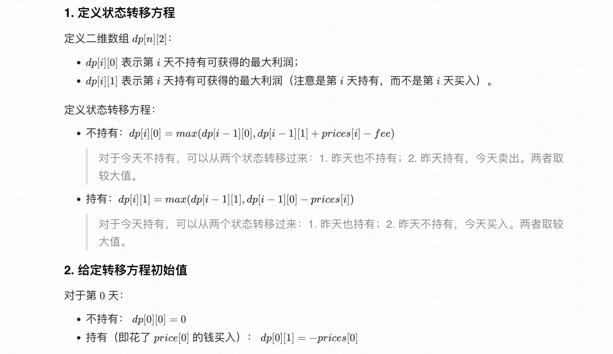

## 什么是贪心算法

> 代码随想录
>
> - **贪心的本质是选择每一阶段的局部最优，从而达到全局最优**。
> - 刷题或者面试的时候，手动模拟一下感觉可以局部最优推出整体最优，而且想不到反例，那么就试一试贪心。
>
> - 面试中基本不会让面试者现场证明贪心的合理性，代码写出来跑过测试用例即可，或者自己能自圆其说理由就行了。


## 455. 分发饼干

- [455. 分发饼干](https://leetcode.cn/problems/assign-cookies/)
- 0601，easy，quick
- 贪心

只需要对 🍪 g，和 🧒 s 进行 sort，然后确保每个饼干 `s[j]` 是大于小孩 `g[i]`的，且是最小值。


```js
var findContentChildren = function (g, s) {
  s.sort((x, y) => x - y);
  g.sort((x, y) => x - y);

  // 饼干 s[j] 是大于 g[i] 的最小值
  let i = 0, j = 0;
  while (s[j] && g[i]) {
    while (s[j] && s[j] < g[i]) j++;
    if (!s[j]) break;
    i++, j++;
  }
  return i;
};
```


- [376. 摆动序列](https://leetcode.cn/problems/wiggle-subsequence/)
- 0602，mid，answer
- 贪心，动态规划

#### 方法一：贪心

对这种问题，自己能画出一个图清晰的图，可以快速的找到解题思路。

下图可以看到，当出现相等、连续递增、连续递减的情况时，我们跳过中间数，去判断下一个数即可。

复杂度：时间（*O(n)*），空间（*O(1)*）。


- preDiff 统计上一个可参考的差值；
- curDiff 统计当前的差值，只有当前差值和上一个差值不相同时，结果 count 才 +1；否则就跳过，进行判断下一个数字。
- 因为至少长度为 2 以上，才可以有差值的记录，所以 index 从 1 开始、count 最小值为 1。

```js
var wiggleMaxLength = function (nums) {
  if (nums.length === 1) return 1; // 特例
  let preDiff = 0; // 只有在初始化时，preDiff = 0，除此之外一定是大于/小于0的
  let count = 1;

  for (let index = 1; index < nums.length; index++) {
    // 当前差值
    const curDiff = nums[index] - nums[index - 1];
    // 如果没有差值为0、出现递增 / 递减序列，则跳过。
    if (curDiff > 0 && preDiff <= 0 || curDiff < 0 && preDiff >= 0) {
      count++;
      preDiff = curDiff;
    }
  }
  return count;
};
```

#### 方法二：动态规划

可以发现，对于我们当前考虑的这个数，要么是作为山峰（即nums[i] > nums[i-1]），要么是作为山谷（即nums[i] < nums[i - 1]）：

- 时间复杂度：*O(n)*， 空间复杂度：*O(1)*

如果一切顺利，没有连续相等、连续递增、连续递减的情况：

- 如果当前是山峰，当前山峰的最长序列值就是山谷 + 1： `up = down + 1`；
- 如果当前是山谷，当前山谷的最长序列值就是山峰 + 1： `down = up + 1`；

但如果发生不顺的时候，及产生了连续相等、连续递增、连续递减的情况：

- 山谷 down 和山峰  up 的值就不发生改变。
- 比如当前是山峰，`up = Math.max( down + 1, up)`，因为在连续递增的最初，up 已经被赋值为 `down + 1`，此时后续发生连续递增 / 连续相等，up 的值就不会再增加了，而是一直维持 `down + 1` 不变。

```js
var wiggleMaxLength = function (nums) {
  if (nums.length === 1) return 1;

  let down = 1; // 考虑前i个数，当第i个值作为峰谷时的情况（则第i-1是峰顶）
  let up = 1;   // 考虑前i个数，当第i个值作为峰顶时的情况（则第i-1是峰谷）

  for (let i = 1; i < nums.length; i++) {
    // 当前是峰谷：如果之前经历过连续递减 / 连续相等，这里就会用 down 值；
    if (nums[i - 1] > nums[i])
      down = Math.max(up + 1, down);

    // 当前是峰顶：如果之前经历过连续递增 / 连续相等，这里就会用 up 值；
    if (nums[i - 1] < nums[i])
      up = Math.max(down + 1, up)

    // console.log(Math.max(nums[i] - nums[i - 1]), down, up);
  }
  return Math.max(down, up);
};
```


## 53. 最大子数组和

- [53. 最大子数组和](https://leetcode.cn/problems/maximum-subarray/)
- 0603，easy，quick
- 贪心，动态规划

#### 方法一：贪心

时间复杂度：O(n)，空间复杂度：O(1)

- 注意我当时总弄错的地方：max 的初始化一定是 `-Infinity`；

```js
var maxSubArray = function (nums) {
  let max = -Infinity; // 初始化的和一定是 -Inifinity
  let count = 0;
  for (let i = 0; i < nums.length; i++) {
    count += nums[i];
    max = Math.max(count, max);
    // 如果当前和为负数，则丢弃
    if (count < 0) count = 0;
  }
  return max;
};
```

另一种思路，两个不同之处：

1. 初始化值为 `nums[0]`，`for` 循环从 1 开始；
2. 丢弃原有和的实际放在下一次循环的开头。

```js
var maxSubArray = function (nums) {
  let max = nums[0];
  let count = nums[0];
  
  for (let i = 1; i < nums.length; i++) {
    // 如果当前和为负数，且下一个数字大于当前和，丢弃原有和
    if (count < 0 && nums[i] > count) count = nums[i];
    else count += nums[i];
    max = Math.max(count, max);
  }
  return max;
};
```

#### 方法二：动态规划

时间复杂度：O(n)，空间复杂度：O(n)

- `dp[i]` ：当前的最大连续子序列和（包括 `i ` 本身）。
- 状态转移方程：`dp[i] = max(dp[i - 1] + nums[i], nums[i]);` 
  - 上一个最大和 + 当前 `nums[i]` ，与当前数字 `nums[i]` 哪一个更大？

```js
var maxSubArray = function (nums) {
  const dp = new Array(nums.length);
  dp[0] = nums[0];
  let max = dp[0];

  for (let i = 1; i < nums.length; i++) {
    dp[i] = Math.max(dp[i - 1] + nums[i], nums[i]); // 状态转移公式
    max = Math.max(max, dp[i]);  // max: 保存dp[i]的最大值
  }
  return max;
};
```


## 122. 买卖股票的最佳时机 II

- [122. 买卖股票的最佳时机 II](https://leetcode.cn/problems/best-time-to-buy-and-sell-stock-ii/)
- 0603，mid，quick
- 贪心，动态规划

#### 方法一：贪心算法

时间复杂度：O(n)；空间复杂度：O(1)

贪心： 统计每一天和上一天之间的股票差值，找局部最优。只要 `prices[i] - prices[i-1] > 0`，就 把当前利润加入 profit 中；

```js
var maxProfit = function (prices) {
  let profit = 0;

  for (let i = 1; i < prices.length; i++) {
    if (prices[i] - prices[i - 1] > 0)
      profit += prices[i] - prices[i - 1]
  }

  return profit;
};
```

#### 方法二：动态规划

速度慢：时间复杂度：O(n)；空间复杂度：O(n)。

动态规划对每一天对股票 持有 / 不持有 两个状态进行模拟，得出每一天的最大收益。

定义 `dp`：

- `dp[i][0]`：表示第 i 天交易完后，不持有股票的最大利润；
- `dp[i][1]`：表示第 i 天交易完后，持有股票的最大利润。

分析买卖股票的两个动作：

- 股票买入。股票买入后，当前现金 = 之前现金 - 股票价格；
- 股票卖出。股票卖出后，当前现金 = 之前现金 + 股票价格；

得出两个状态转移方程：

1. 第 `i` 天持有股票 即 `dp[i][0]`， 可以由两个状态推出来：

   - `dp[i][0] = Math.max(dp[i - 1][0], dp[i - 1][1] - prices[i]);`

   - （不卖出）第 `i-1` 天就持有股票，当前先进和昨天持有股票的所得现金一样，即：`dp[i - 1][0]`。
     - 因为这里没有任何卖出、买入的操作，所以自己手里的现金是没发生变化的。

   - （没买过）第 `i` 天买入股票，所得现金 = [昨天不持有股票的所得现金] - [今天股票价格]，即：`dp[i - 1][1] - prices[i]`；
     - 因为今天买入了股票，现金肯定要减去买股票的价格。

2. 第 `i`天不持有股票 即 `dp[i][1]`， 可以由两个状态推出来：
   - （没买过）第 `i-1` 天就没持有股票，那么所得现金和昨天不持有股票的所得现金相同 即：`dp[i - 1][1]`；
   - （今天卖）第 `i` 天没持有股票，按照今天股票价格卖出后，剩余的现金就是所得现金：`prices[i] + dp[i - 1][0]`。

```js
const maxProfit = (prices) => {
    const dp = Array.from(new Array(prices.length), () => new Array(2).fill(0));
    dp[0][0] = 0 - prices[0];  // 持有
    dp[0][1] = 0;  // 不持有
    for (let i = 1; i < prices.length; i++) {
        // 持有:前一天持有，前一天没持有（要买入）
        dp[i][0] = Math.max(dp[i - 1][0], dp[i - 1][1] - prices[i]);
        // 不持有: 前一天持有（要卖出），前一天没持有
        dp[i][1] = Math.max(dp[i - 1][0] + prices[i], dp[i - 1][1]);
    }
    // 返回最后一天卖出所有股票，即不持有的情况
    return dp[prices.length - 1][1];
};
```


## 55. 跳跃游戏

- [55. 跳跃游戏](https://leetcode.cn/problems/jump-game/)
- 0603，mid，normal
- 贪心

#### 方法一：贪心

题目关键点：不要拘泥于每次究竟怎么跳跳几步，而是看覆盖范围，范围内的位置是一定可以跳到的，不用管是怎么跳到的这个位置。


贪心的思路，我们定义一个变量 jump，表示当前我们可以达到的最远范围。也就是说，`[0, jump]` 内的所有位置我们都可以访问。

- 然后通过 for 循环遍历 `[0, jump]` 这个区间，一旦 `jump >= nums.length - 1` 表明此时 jump 的范围已经包括了数组的终点。返回 true；反之，如果 for 遍历完毕，都没有达到终点，那就返回 false。

复杂度分析：

- 时间复杂度：*O(n)* 
- 空间复杂度：*O(1)*

```js
var canJump = function (nums) {
    if (nums.length === 1) return true;
    let jump = 0; // 可以跳到的范围

    for (let i = 0; i <= jump; i++) {
      jump = Math.max(jump, i + nums[i]);
      if (jump >= nums.length - 1) return true;
    }
    return false;
};
```


#### 方法二：贪心（倒着分析）

我想到的方法，但更复杂。考虑自己当时为什么没想从正面直接解决？两个原因：

- 好多题的分析都是倒着来，这里有了思维惯性，想到倒着能做，就直接做了。
- 看到需要两层 for 循环略复杂，但没仔细考虑是否可以有另一种方法，应该考虑更全面。

定义一个数组 dp，dp[i] 表示当前位置是否可以达到终点如果可以为 true，不可以为 false。

- 从最后一步 `nums[nums.length - 2]`，倒着往前分析：如果可以达到，就置为 true，不可以达到就置为 false。分析步骤：
  1. 计算当前位置可以达到的范围 jump。如果跳跃范围大于终点 `jump > lastIndex` ，则为 true；
  2. 利用 for 循环，寻找 jump 的范围内是否有一个点可以达到终点，有则为 true；

复杂度分析：

- 时间复杂度：*O(n x n!)* （最坏，嵌套的 for 循环次数无法保证）；
- 空间复杂度：*O(n^2)*；

```js
var canJump = function (nums) {
    if (nums.length === 1) return true;
    const lastIndex = nums.length - 1;
    // 从最后往前，如果能到达就为true，不能到达就为false
    const dp = Array(lastIndex).fill(false);
    for (let i = lastIndex - 1; i >= 0; i--) {
        const jump = i + nums[i];
        // 直接跳到结尾
        if (jump >= lastIndex) dp[i] = true;
        else {
            // 查找 jump 范围内有没有 true:
            for (let j = i + 1; j <= jump; j++) {
                if (dp[j]) {
                    dp[i] = true;
                    break;
                }
            }
        }
    }
    return dp[0];
};
```


## 45. 跳跃游戏 II

- [45. 跳跃游戏 II](https://leetcode.cn/problems/jump-game-ii/)
- 0604，mid，answer
- 贪心

#### 方法一：贪心


- `while` 循环，每起跳一次，进行一次 while 循环。当可以达到终点时，循环终止；
- `for` 循环，每次起跳后（上一次起跳），都有一个覆盖范围，范围内的位置上次起跳后都可以达到。也就是说，本次起跳可以是这个范围内的所有位置。利用 for 循环去遍历范围内的所有位置，然后统计出本次起跳后，可以达到的覆盖范围。
- `range` ：for 循环遍历 `[start, end]` 内的起跳点；而 `range` 随 for 循环的遍历，随时更新可以达到的最远位置。当 for 循环结束时，下一组  `[start, end]`  的值就是：`[end + 1, range]`

```js
var jump = function (nums) {
  let start = 0, end = 0;
  let step = 0;

  while (end < nums.length - 1) {
    // 本次起跳范围:[start, end]
    let range = end;
    for (let i = start; i <= end; i++) {
      range = Math.max(range, i + nums[i]);
    }
    // 更新范围:[start, end]
    [start, end] = [end + 1, range];
    step++;
  }
  return step;
};
```

#### 方法二：贪心｜优化代码

可以将 while 和 for 合并起来。

- for 的作用就是遍历 `[start, end]` 内的所有点，然后找到下一个 `[start, end]` 的范围，最终目的是每一个范围代表一个 step，最后要累计 step 的值。

而仔细想来，其实我们只需要通过 end 就可以切分开每次的范围：

- for 循环遍历 nums 的每一个成员，模拟每一个点做为起跳点。
- 每次的起跳范围都是：`[... end]`，即 start 不做记录，值记录最后一个 end 值。
- range 的作用依然不变，更新在当前 step 内的所有覆盖的点 `[... start]` 可以达到的最远距离，最后用来更新 end。

```js
var jump = function (nums) {
  let end = 0;
  let step = 0;
  let range = end;
  for (let i = 0; i < nums.length - 1; i++) {
    range = Math.max(range, i + nums[i]);
    // 剪枝：如果range已经覆盖到最后一个值了，那么可以提前返回结果，因为跳过了step++，所以要让 step + 1
    if (range >= nums.length - 1) return step + 1;
    // 遍历完一个起跳范围:[... end]
    if (i === end) {
      end = range;
      step++;
    }
  }
  return step;
};
```


## 1005. K 次取反后最大化的数组和

- [1005. K 次取反后最大化的数组和](https://leetcode.cn/problems/maximize-sum-of-array-after-k-negations/)
- 0604，easy，quick
- 贪心

#### 方法一：贪心｜我的方法

比较笨。

共有以下几个步骤：

1. 数组从小到大排序；
2. for 循环，寻找数组中绝对值最小的值。
   - 这里有一个剪枝，数组从负数 -> 正数遍历，当遍历到第一个正数时，此时一定找到了一个最小绝对值，结束循环。
3. for 循环，开始执行取反操作，优先把更小的负数取反。
   - 结束时机：当 k 值消耗完，结束循环；当 nums 数组遍历完，结束循环；
   - 如果当前 `nums[i]` 为负数，则取反；
   - 如果当前 `nums[i]` 不是负数，则提前结束 for 循环；
4. if 判断：执行的条件是：如果 `k > 0` 表明还需要执行取反操作，此时负数已经全部取反了，此时只需要对最小值进行取反即可。
   - 优化：`k % 2 === 1` 目的是计算 k 是否是 2 的倍数；如果是，则不需要进行取反操作了。因为如果取反两次，最后的值没发生变化。如果不是 2 的倍数，就进行一次取反即可。

```js
var largestSumAfterKNegations = function (nums, k) {
  nums.sort((x, y) => x - y); // 排序
  let minIndex = 0;
  for (let i = 0; i < nums.length; i++) {
    if (Math.abs(nums[minIndex]) > Math.abs(nums[i])) minIndex = i;
    if (nums[i] >= 0 && nums[i + 1] >= 0) break;
  }

  for (let i = 0; i < nums.length && k > 0; i++, k--) {
    // 如果有负数，从最小到最大，依次修改；
    if (nums[i] < 0) nums[i] = -nums[i];
    else break;
  }
  
  // 如果有剩余次数，修改绝对值最小的数 min
  if (k > 0 && k % 2 === 1)
    nums[minIndex] = -nums[minIndex];
  
  return nums.reduce((prev, curv) => prev + curv);
};
```

#### 方法二：贪心

如果k还没消耗完，这一步操作在上面有解释。

```js
var largestSumAfterKNegations = function (nums, k) {
  // 按照绝对值从小到大排序:
  nums.sort((a, b) => Math.abs(b) - Math.abs(a));

  // 遇到负数就进行取反，同时 k-1
  for (let i = 0; i < nums.length; i++) {
    if (nums[i] < 0 && k > 0) {
      nums[i] *= -1;
      k--;
    }
  }

  // 如果k还没消耗完，且操作次数是奇数次，就对绝对值最小的数进行一次取反
  if (k > 0 && k % 2 === 1)
    nums[nums.length - 1] = -nums[nums.length - 1];

  return nums.reduce((prev, curv) => prev + curv);
};
```


## 134. 加油站

- [134. 加油站](https://leetcode.cn/problems/gas-station/)
- 0605，mid，answer
- 数学归纳、暴力循环

#### 方法一：暴力解

以每一个点为起点，查看是否则可以完整的走完，如果可以则返回这个点；如果循环一圈都不可以，则返回 -1。

- 外层 for 循环，遍历所有点，start 为当前起点。
  - 在 start 起点时，先尝试往前走一步，即初始化 count（当前油量）和 point（当前加油站）。
- 内层 while 循环，完整的走一圈。如果走完一圈后，count 油量一直大于等于0，则证明是一个可以走完的，返回 start 起点。
- 需要注意如何让 point 形成循环：
  1. 方法一：判断当前点是否是数组的最后一个点 len - 1，如果是就赋值为 0；
  2. 方法二：`point = (point + 1) % len`，即 + 1后取余，如果是数组最后一个点，取余为 0。

```js
var canCompleteCircuit = function (gas, cost) {
  const len = gas.length;
  // i 起点
  for (let start = 0; start < len; start++) {
    let count = gas[start] - cost[start];  // 初始化当前油量: 当前站加油 - 开往下一站耗油
    let point = start === len - 1 ? 0 : start + 1;  // 初始化下一个加油站位置
    // 剩余油箱不足，或循环一圈结束
    while (count >= 0 && point !== start) {
      count = count + gas[point] - cost[point];
      point = point === len - 1? 0 : point + 1;
    }
    if (count >= 0 && point === start) return start;
  }
  return -1;
};
```

#### 方法二：贪心｜数学归纳

> 详细题解：[🔎](https://leetcode.cn/problems/gas-station/solution/shou-hua-tu-jie-liang-ge-guan-jian-jie-lun-de-jian/).

每个站的剩余油量累加给`left`，即`left += gas[i]-cost[i]`。如果`left`一直大于0，则可以一直走下去，如果出现了小于0，说明到不了下一站。

从起点站 *a* 出发，必须 `gas[a] - cost[a] >= 0` 才能到 *b* 站。假设去到 c 站加完油发现去不了 d 站，只是说明 a 站不是合格起点吗？

- 到不了 d 站，就说明： *(gas[a] - cost[a]) + (gas[b] - cost[b]) + (gas[c] - cost[c]) < 0* 
  - 即： *left(a) + left(b) + left(c) < 0*
  - 已知 ： *left(a) >= 0*
  - 所以： *left(b) + left(c) < 0*
- 所以，b 站不能作为起点，因为去不了 d。
- 能来到 c 站，肯定到过 b 站，所以有： *left(a) + left(b) >=0* 
  - 又因为： *left(a) + left(b) + left(c) < 0*
  - 有： *left(c) < 0*
- c 站也不能作为起点，因为去不了 d！

我们归纳出下面结论：

结论1：如果 left 累加 *gas[i]-cost[i]* 后，小于 0。则出发点到站 i 都不是起点。

- 如果总加油量 *sum(gas) < sum(cost)*  总耗油量，问题无解，油量不足以走完全程。

结论2：如果总加油量 *sum(gas) >= sum(cost)* 总耗油量，问题一定有解。


```js
var canCompleteCircuit = function (gas, cost) {
  let left = 0, // 当前油量
    start = 0,  // 当前起点
    totalGas = 0, totalCost = 0; // 统计总加油/耗油量
  for (let i = 0; i < gas.length; i++) {
    totalGas += gas[i];
    totalCost += cost[i];
    left += gas[i] - cost[i]; // 更新当前油量
    if (left < 0) {
      start = i + 1;
      left = 0;
    }
  }
  return totalGas < totalCost ? -1 : start;
};
```


## 135. 分发糖果

- [135. 分发糖果](https://leetcode.cn/problems/candy/)，不是 top100和精选 TOP 面试题。
- 0604，hard，answer
- 贪心，两个维度分析

贪心的核心：局部最优解，就是全局最优解。[🔗](https://leetcode.cn/problems/candy/solution/candy-cong-zuo-zhi-you-cong-you-zhi-zuo-qu-zui-da-/).

遇到两个维度权衡的时候，一定要先确定一个维度，再确定另一个维度。


```js
var candy = function (ratings) {
  const len = ratings.length;
  const result = new Array(len).fill(1);

  // 第一次遍历，从左至右，只判断左孩子 < 右孩子的情况:
  for (let i = 1; i < len; i++) {
    if (ratings[i - 1] < ratings[i])
      result[i] = result[i - 1] + 1;
  }

  // 第二次遍历，从右至左，只判断左孩子 > 右孩子的情况:
  for (let i = len - 2; i >= 0; i--) {
    if (ratings[i] > ratings[i + 1])
      result[i] = Math.max(result[i], result[i + 1] + 1); // 为了满足两次遍历的条件，取最大值
  }

  // 第三次遍历，对 result 求和返回结果
  return result.reduce((prev, curv) => prev + curv);
};
```


## 860. 柠檬水找零

- [860. 柠檬水找零](https://leetcode.cn/problems/lemonade-change/)
- 0605，easy，answer
- 贪心

这道题其实非常简单，主要没想到的原因还是没仔细的看懂题意，已经合理的把题意转化成代码。

- 定义变量：当前持有的、可以找零的现金：five、ten；因为 20 面值的现金只需要收好，面额太大找零时用不到，所以不统计 20 面值的钞票。
- 定义流程：
  - 如果 5 元面值，直接收下；
  - 如果 10 元面值，找一张 5 元。如果 5 元不足，就返回 false；
  - 如果 20 元面值，两个策略：
    - 局部最优：贪心，优先找面值大的，即：10 + 5 的组合；如果 10 元面值数量不足，就 5 + 5 + 5 的组合。如果 5 元面值的数量也不足，就返回 false。

```js
var lemonadeChange = function (bills) {
  let five = 0, ten = 0;
  for (let i = 0; i < bills.length; i++) {
    // 收到5面值: 直接持有
    if (bills[i] === 5) five++;
    else if (bills[i] === 10) {
      // 收到10面值: 找5，如果5不够，返回false
      if (!five) return false;
      five--, ten++;
    } else {
      // 收到15面值: 两个策略，优先找10+5的组合;。不够，就找5+5+5。如果也不够，就返回false
      if (five > 0 && ten > 0) five--, ten--;
      else if (five >= 3) five -= 3;
      else return false;
    }
  }
  return true;
};
```


## 406. 根据身高重建队列

- [406. 根据身高重建队列](https://leetcode.cn/problems/queue-reconstruction-by-height/)
- 0605，mid，answer
- 贪心，两个维度分析

遇到两个维度权衡的时候，一定要先确定一个维度，再确定另一个维度。

#### 方法一：从大到小｜贪心

局部最优推导到全局最优。[解析：📖](https://www.programmercarl.com/0406.%E6%A0%B9%E6%8D%AE%E8%BA%AB%E9%AB%98%E9%87%8D%E5%BB%BA%E9%98%9F%E5%88%97.html#%E6%80%9D%E8%B7%AF).

`[hi, ki]` 按照以下顺序排序：

- `hi` 身高：从大到小；
- `ki` 前面站的人：如果身高相同， `ki` 更小的靠前。

按照顺序依次把 people 中的人放入 queue 中，按照以下标准：

- 因为成员已经按照从大到小的顺序放入，所以当我们遇到 `[7,2]` 时，只需要在 `queue[2]` 位置插入即可，这样前面的 0，1 两个位置一定是放置了大于等于 7 的人，满足局部最优条件。
  - 数组插入：`queue.splice(people[i][1], 0, people[i]);`
- 这样一个个依次从大到小放入，最终会满足全局最优条件。

时间复杂度：

- `splice()` 的最坏时间复杂度是 *O(n)*；
- `sort()` 的时间复杂度是 *O(nlogn)*；
- 所以，`splice()` 外层还套着一个 for 循环，总体复杂度是 *O(n^2)*。

```js
var reconstructQueue = function (people) {
  people.sort((x, y) => x[0] === y[0] ? x[1] - y[1] : y[0] - x[0]); // 排序
  const queue = [];
  for (let i = 0; i < people.length; i++) {
    queue.splice(people[i][1], 0, people[i]); // 对应位置插入
  }
  return queue;
};  
```

#### 方法二：从小到大｜我的方法

`[hi, ki]` 按照以下顺序排序（和方法一完全相反）：

- `hi` 身高：从小到大；
- `ki` 前面站的人：如果身高相同， `ki` 更大的靠前。

按照顺序依次把 people 中的人放入 queue 中，按照以下标准：

- 假如遇到 `[4,4]`，那就必须在前面空出 4 个位置，用来填放比 4 更大的数字，以满足要求。
- start 统计已经找到了几个空位，当 `start == 4` 时，找到四个空位，此时结束 for 循环；
- point 表示 `[4,4]` 要放入的位置，当 空位已经全部找到，利用 while 要找下一个可以放置 `[4,4]`的空位；
- `queue[point] = people[i]` 把 `[4,4]` 放入空位。

```js
var reconstructQueue = function (people) {
  // 按要求排序:
  people.sort((x, y) => x[0] === y[0] ? y[1] - x[1] : x[0] - y[0]);
  const queue = Array(people.length);
  
  for (let i = 0; i < people.length; i++) {
    let start = 0, point = 0;
    while (start < people[i][1]) {  // 放入点前，必须有people[i][1]个空位 
      if (!queue[point]) start++;
      point++;
    }
    while (queue[point]) point++; // 满足了people[i][1]个空位，再找下一个空位
    queue[point] = people[i];     // 找到空位，放入
  }
  return queue;
};
```


## 452. 用最少数量的箭引爆气球

- [452. 用最少数量的箭引爆气球](https://leetcode.cn/problems/minimum-number-of-arrows-to-burst-balloons/)
- 0605，mid，answer
- 贪心

分析：

局部最优：只要出现重叠，重叠的最边缘位置射气球。

- 寻找每个区间的最右端位置，按照最右端位置从小到大进行排序。

- 遍历所有气球，判断：
  - 当箭的位置在气球的区间内，就跳过该区间；
  - 如果不在区间内，就射出新的一箭，同时位置是当前气球的最右端。

全局最优：每次射出的箭都是局部最优，找不到反例，满足全局最优。


```js
var findMinArrowShots = function (points) {
  if (!points.length) return 0
  points.sort((x, y) => x[1] - y[1]); // 排序
  let count = 1; // 总箭数
  let pos = points[0][1];  // 当前箭的位置

  for (let i = 1; i < points.length; i++) {
    if (points[i][0] > pos) {  // 如果不发生重叠
      count++;
      pos = points[i][1];  // 最右端
    }
  }
  return count;
};
```


## 435. 无重叠区间

- [435. 无重叠区间](https://leetcode.cn/problems/non-overlapping-intervals/)
- 0605，mid，quick
- 贪心

这道题和上一道题 (452 箭引爆气球)，一样寻找区间重叠。

- 按照区间右端，从小到大排序；
- pos 统计当前区间的最右端，count 统计移除区间的数量。
- 最初，pos 记录了第一个区间的最右端；
  - 一旦当前区间的最左端，和 pos 发生重叠，表明两个区间存在重叠，则移除当前区间，count++。
  - 如果当前区间和 pos 没有发生重叠，则更新 pos 的位置为当前区间的最右端，以供下一个区间判断。

```js
var eraseOverlapIntervals = function (intervals) {
  if (intervals.length <= 1) return 0;

  // 按照最右端从小到大排序：
  intervals.sort((x, y) => x[1] - y[1]);
  let pos = intervals[0][1];
  let count = 0;
  for (let i = 1; i < intervals.length; i++) {
    if (intervals[i][0] < pos) count++; // 有重叠
    else pos = intervals[i][1];
  }
  return count;
};
```


## 763.划分字母区间

- [763. 划分字母区间](https://leetcode.cn/problems/partition-labels/)
- 0607，mid，answer
- 根据题干解题 [🔗](https://www.programmercarl.com/0763.%E5%88%92%E5%88%86%E5%AD%97%E6%AF%8D%E5%8C%BA%E9%97%B4.html#%E6%80%9D%E8%B7%AF).

题目要求相同的字母必须放在一个区间内，那么

- 第一次 for 循环：统计一下字符串 S 内所有字母的最后一次出现的位置；
- 变量 left 和 right 记录每次切割子区间的 左、右两边界；
- 第二次 for 循环，加入 s 为 `ababcbacadefegdehijhklij`：
  - 比如遍历到第一个 a 这个元素，把 right 置 为 `18`，也就是说， 18 以前的所有字母一定是一个子区间内。
  - 接着往后遍历，不断更新 right 的最大值。直到出现 right 和当前遍历字母下标相等 `i === right` 的时候，表明当前字母 `s[i]` 已经是最右边界了，且其他字母也没有比 right 更靠右的位置。
  - 此时就是一个完整的子区间，把结果 push 到 res 中，然后更新 left 左边界。

```js
var partitionLabels = function (s) {
  const res = [];
  const map = {};
  for (let i = 0; i < s.length; i++) {
    map[s[i]] = i;
  }
  let left = 0, right = 0;
  for (let i = 0; i < s.length; i++) {
    right = Math.max(right, map[s[i]]);
    if (right === i) {
      res.push(right - left + 1);
      left = right + 1;
    }
  }
  return res;
};
```


## 56. 合并区间

- [56. 合并区间](https://leetcode.cn/problems/merge-intervals/)
- 0607，mid，normal
- 贪心

按照左边界排序，排序之后局部最优：

- 排序后，每个新区间的 left，自然就是遍历到的第一个区间；
- 每次合并都取最大的右边界 right，这样就以 `left` 为左端点，尽可能的合并所有重叠的区间；

局部最优 --> 整体最优：合并所有重叠的区间。

流程：

- 对 intervals 进行排序，按照左边界从小到大的顺序；
- `left` 和 `right` 分别代表了当前新区间的左端和右端，因为 intervals 已经按左区间排序，所以 left 一定是最小的，不需要再判断；
- for 循环遍历每个区间：
  - 重叠：如果新区间的 `right` 大于遍历的区间，说明发生重叠，要删除该区间，更新 `right` 区间为较大值；
  - 不重叠：如果不重叠，则 `left` 和 `right` 已经圈成了一个新的区间，push 到 res 中，同时更新 `left` 和 `right`；
- 当全部遍历完后，不要忘记把最后一个区间 push 到结果中。

```js
var merge = function (intervals) {
  const res = [];
  intervals.sort((x, y) => x[0] - y[0]);
  let left = intervals[0][0], right = intervals[0][1];

  for (let i = 1; i < intervals.length; i++) {
    // 重叠
    if (right >= intervals[i][0]) {
      right = Math.max(right, intervals[i][1]);
    } else { // 不重叠
      res.push([left, right]);
      left = intervals[i][0];
      right = intervals[i][1];
    }
  }
  res.push([left, right]);
  return res;
};
```


## 738. 单调递增的数字

- [738. 单调递增的数字](https://leetcode.cn/problems/monotone-increasing-digits/)
- 0607，mid，answer
- 贪心


解题思路：

- 局部最优：遇到 `strNum[i - 1] > strNum[i]` 的情况，让 `strNum[i - 1]--`，然后 `strNum[i]` 给为9，可以保证这两位变成最大单调递增整数。
- 全局最优：得到小于等于 N 的最大单调递增的整数。

判断从头开始遍历，还是从尾开始遍历：

- 从前后向遍历会改变已经遍历过的结果：从前向后遍历的话，遇到 `strNum[i - 1] > strNum[i]` 的情况，让 `strNum[i - 1]` 减一，但此时如果 `strNum[i - 1]` 减一了，可能又小于 `strNum[i - 2]`。

`flag` 的作用，考虑数字 3234：

- 后 3 位符合递增，所以不需要任何操作；但当 `i == 2` 时，不符合递增。则第一位 `-1`，此时不仅 2 位置需要置为 9，其后所有的数字都要置为 9。最终的结果为： 2999。
- 所以，我们需要一个 flag 来标记从哪一位开始，把后面的数字置为 9。然后再用一个 for 循环统一赋值。

```js
var monotoneIncreasingDigits = function (n) {
  // 转化，n: bumber --> arr: number[]
  const arr = n.toString().split('');
  arr.forEach(item => Number(item));
  
  let flag = Infinity; // 统计最靠前的、需要置为9的位置。
  for (let i = arr.length - 1; i > 0; i--) {
    // 如果不是递增序列，则前一位减1，当前、以及之后的位置都置为9
    // 原因：一旦靠前的数字有减1的情况，后面的数字需要全部置为9
    if (arr[i - 1] > arr[i]) {
      flag = i;
      arr[i - 1] = arr[i - 1] - 1;
    }
  }
  // 统一赋值为9
  for (let i = flag; i < arr.length; i++)  arr[i] = 9;
  return Number(arr.join(''));
};
```


## 714. 买卖股票的最佳时机含手续费

- [714. 买卖股票的最佳时机含手续费](https://leetcode.cn/problems/best-time-to-buy-and-sell-stock-with-transaction-fee/)
- 0607，mid，answer
- 动态规划、贪心

#### 方法一：动态规划

虽然慢，但是好理解

一般的动态规划题目思路三步走：

1. 定义状态转移方程
2. 给定转移方程初始值
3. 写代码递推实现转移方程



```js
var maxProfit = function (prices, fee) {
  const dp = Array.from(new Array(prices.length), () => new Array(2).fill(0));
  // 2.初始化
  dp[0][0] = 0;
  dp[0][1] = -prices[0];

  for (let i = 1; i < prices.length; i++) {
    // 1.状态转移方程
    // 不持有：昨天不持有、昨天持有，今天卖出
    dp[i][0] = Math.max(dp[i - 1][0], dp[i - 1][1] + prices[i] - fee);
    // 持有：昨天持有、昨天不持有，今天买入
    dp[i][1] = Math.max(dp[i - 1][1], dp[i - 1][0] - prices[i]);
  }
  return dp[prices.length - 1][0];
};
```

#### 方法二：动态规划的优化

将二维 dp 压缩为两个变量：

- 因为本次的持有 / 不持有，仅和**上一次**的持有 / 不持有有关。所以 sell 保存上一次不持有；buy 保存上一次持有即可。

```js
var maxProfit = function (prices, fee) {
  let sell = 0;  // 不持有
  let buy = -prices[0]; // 持有

  for (let i = 1; i < prices.length; i++) {
    sell = Math.max(sell, buy + prices[i] - fee);
    buy = Math.max(buy, sell - prices[i]);
  }
  return sell
};
```

#### 方法三：贪心

for 循环遍历 prices 数组；

- 随着 for 循环遍历，一直记录最小值 buy，在卖出时，buy 就是买入价 + 手续费 fee；
- 这样 `price[i] - buy` 就是本轮交易的收益，手续费已经包含在内了。

```js
var maxProfit = function (prices, fee) {
  let profit = 0;
  let buy = prices[0] + fee;
  for (let i = 1; i < prices.length; i++) {
    if (prices[i] + fee < buy) {
      buy = prices[i] + fee; // 更新:买入的最低价+手续费
    } else if (prices[i] > buy) {
      profit += prices[i] - buy; // 卖出获利 => 未必真的在此时卖出,只是假设
      buy = prices[i]; // 因为是假设: 卖出的同时立即以原价买入，手续费只计算一次。
    }
  }
  return profit
};
```


===== summary =============================

定义一个二维数组。数组长度为 nums.length，数组的每个成员都是一个长度为 2 的数组，且对嵌套的数组赋初始化值为 `2`。

```js
// Array.from() 针对一个类似数组 / 可迭代对象，创建一个新的、浅拷贝的数组。
// 第二个可选参数 cb：新数组中的每个元素会执行该回调函数，相当于 forEach。
const dp = Array.from(new Array(nums.length), () => new Array(2).fill(0));
```

