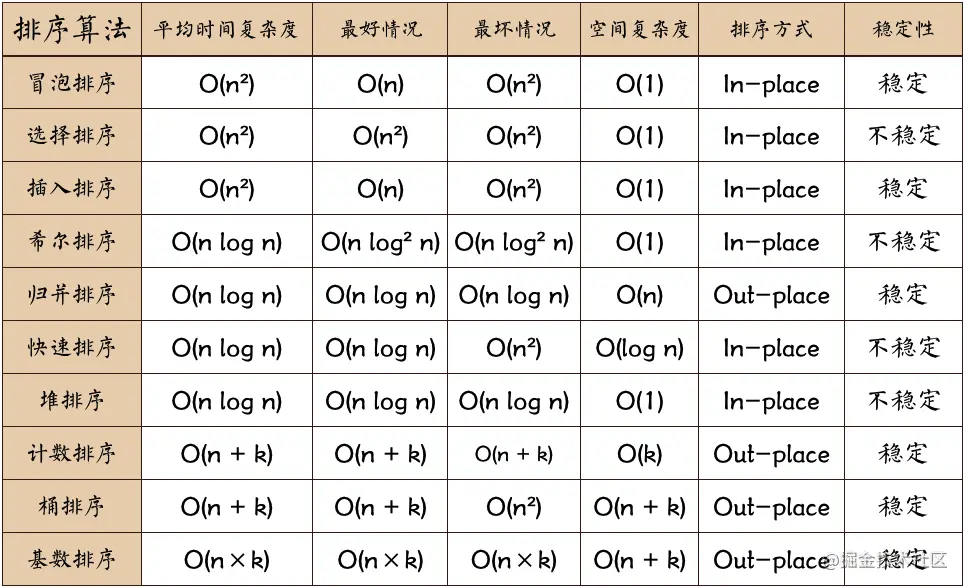

## 1 Promise

> Promise A+：https://promisesaplus.com
>
> 中文：https://www.ituring.com.cn/article/66566

### 1.1 Promise 实现

1. 搭建架子：
   - MyPromise 对象：
     - constrictor 三个函数 resolve、reject、executor；
   - promise 实例对象
     - 传入 executor 的入参（回调函数）；
     - 尝试在 executor 的回调函数中，调用 resolve 和 reject。
2. 定义状态：pending、fulfilled、rejected；
3. 定义 resolve 和 reject 内的状态执行逻辑。

```js
// ES6 ES2015 
const PROMISE_STATUS_PENDING = "pending";
const PROMISE_STATUS_FULFILLED = "fulfilled";
const PROMISE_STATUS_REJECTED = "rejected";

class MyPromise {
  constructor(executor) {
    this.status = PROMISE_STATUS_PENDING;
    this.value = undefined;
    this.reason = undefined;

    const resolve = (value) => {
      // 如果状态已经决议，则不执行resolve
      if (this.status !== PROMISE_STATUS_PENDING) return;
      this.status = PROMISE_STATUS_FULFILLED;
      this.value = value;
      console.log("resolve被调用");
    };

    const reject = (reason) => {
      // 如果状态已经决议，则不执行reject
      if (this.status !== PROMISE_STATUS_PENDING) return;
      this.status = PROMISE_STATUS_REJECTED;
      this.reason = reason;
      console.log("reject被调用");
    };

    executor(resolve, reject);
  }
}

const promise = new MyPromise((resolve, reject) => {
  console.log("pending 状态");
  resolve(1111);
  reject(2222);
});
```


### 1.2 then 实现

1. 先写出 `promise.then(回调1， 回调2);` 通过函数调用构思 then 的内容；
2. Promise 实现了回调函数的延时绑定技术，所以只有通过 `.then(回调1，回调2)` 调用时，才会动态绑定通过 then 传递进去的回调函数，绑定完毕后立即根据 promise 的结果（成功/失败）来执行对应的回调函数。
   - 延迟绑定的思路：让 `.then()` 这行代码的执行顺序提前，先绑定好 then 中的两个回调函数，再执行回调函数。
   - resolve 和 reject 在执行结束前，察看一下当前 callbacks 队列中是否有需要执行的回调，如果有依次执行
   - then 在绑定 onFulfilled 和 onRejected 回调时，判断一下当前 promise 的状态：
     - 如果还在 pending，说明 executor 内部存在异步，把回调加入 callbacks 回调队列。
     - 如果已经 fulfilled 或 rejected，executor 函数已经执行完毕，直接执行回调。
3. 对同一个 promise，可以调用多次 then，获得各自的结果：
   - 这里在 Promise 对象中定义两个数组，分别来存放多个 `.then()` 调用时，添加的 `onFulfilled` 和 `onRejected` 函数。在 promise 状态敲定后，把数组中的全部回调都执行一下即可。

```js
// @ts-nocheck
class MyPromise {
  static STATE = {
    PENDING: "pending",
    FULFILLED: "fulfilled",
    REJECTED: "rejected",
  };

  constructor(executor) {
    this.state = MyPromise.STATE.PENDING;
    this.result = undefined;
    this.fulfilledCallbacks = [];
    this.rejectedCallbacks = [];

   this.resolve = (value) => {
      if (this.state !== MyPromise.STATE.PENDING) return;
      queueMicrotask(() => {
        this.state = MyPromise.STATE.FULFILLED;
        this.result = value;
        this.fulfilledCallbacks.forEach( cb => {
          cb(this.result);
        })
      })
    };

    this.reject = (reason) => {
      if (this.state !== MyPromise.STATE.PENDING) return;
      queueMicrotask(() => {
        this.state = MyPromise.STATE.REJECTED;
        this.result = reason;
        this.rejectedCallbacks.forEach( cb => {
          cb(this.result);
        })
      })
    };

    try {
      executor(this.resolve, this.reject);
    } catch (err) {
      this.reject(err);
    }
  }

  then = (onFulfilled, onRejected) => {
    // 1 判断：如果不是函数
    // onFulfilled将 value 原封不动的返回，
    //onRejected 返回 reason, 通过 throw Error 来返回
    onFulfilled = 
      onFulfilled instanceof Function ? onFulfilled : (value) => {return value};
    onRejected = 
      onRejected instanceof Function ? onRejected : (value) => {throw value};

    // 2 如果promise状态还在pending，则加入执行队列
    if (this.state === MyPromise.STATE.PENDING) {
      this.fulfilledCallbacks.push(onFulfilled);
      this.rejectedCallbacks.push(onRejected);
    }
    
    // 3 如果promise状态已经确认，则异步执行回调
    if (this.state === MyPromise.STATE.FULFILLED) {  
      queueMicrotask(() => {
        onFulfilled(this.result);
      })
    }
      
    if (this.state === MyPromise.STATE.REJECTED) {
      queueMicrotask(() => {
        onRejected(this.result);
      })
    }
  };
}

const promise = new MyPromise((resolve, reject) => {
  console.log("pending 状态");
  // 异步执行
  setTimeout(()=> {
    resolve("resolve-1");
    reject("reject-1");  
  }, 1000)
});

promise.then(
  (res) => {
    console.log("成功", res);
  },
  (err) => {
    console.log("失败", err);
  }
);

// 多个then调用
promise.then(
  (res) => {
    console.log("成功2", res);
  },
  (err) => {
    console.log("失败2", err);
  }
);
```

三处异步处理的地方：

- then
  - then 的调用时机是异步的，所以添加异步回调。
- resolve、reject
  - executor 内，当出现 `resolve()` 执行时，promise 状态改变，但此时 resolve 内不能立即执行保存的 onFulfilled 回调，因为按照 A+ 规定，此时还要把 executor 剩余的代码执行完闭，下一个 异步时钟才执行 onFulfilled 回调。所以 resolve 和 reject 也添加异步。

执行顺序测试：

```js
console.log(1);
let promise1 = new MyPromise((resolve, reject) => {
    console.log(2);
    setTimeout(() => {
        console.log('A', promise1.state);
        resolve('这次一定');
        console.log('B', promise1.state);
        console.log(4);
    });
})
promise1.then(
    result => {
        console.log('C', promise1.state);
        console.log('fulfilled:', result);
    },
    reason => {
        console.log('rejected:', reason)
    }
)
console.log(3);
```


2. then 可以形成调用链
   - 让 then 方法再返回一个新的 promise 对象。

```js
promise.then().then().then()
```

注意以下几点：

- then 返回一个新的 promise，所以在 then 方法中，返回一个新的 MyPromise 实例。
- `onFulfilled` 和 `onRejected` 有返回结果，所以用 value 拿到这个返回结果，做为新的 promise 决议信息，通过 `resolve(value)` 决议这个新的 promise。
- 在执行 `onFulfilled` 和 `onRejected`  如果出现错误，新的 promise 的状态就立即修改为 `rejected`，所以用 try catch 包裹这两个回调函数的执行。如果 catch 到错误，就用 `reject(value)` 来决议这个新的 promise。
- 所以在情况2 “如果 promise 状态还在 pending，则加入执行队列” 时，加入队列的回调函数也要添加 try catch，同时给他们添加异步回调，确保执行顺序在 executor 执行完毕之后。
- 在 `resolve` 和 `reject`函数中，当执行异步后，再次判断一下 promise 是否决议，如果已经决议，则不再执行后面的代码。


最终代码如下：

```js
class MyPromise {
  static STATE = {
    PENDING: "pending",
    FULFILLED: "fulfilled",
    REJECTED: "rejected",
  };

  constructor(executor) {
    this.state = MyPromise.STATE.PENDING;
    this.result = undefined;
    this.fulfilledCallbacks = [];
    this.rejectedCallbacks = [];

    this.resolve = (value) => {
      if (this.state !== MyPromise.STATE.PENDING) return;
      queueMicrotask(() => {
        // 第二次判断是否已经决议
        if (this.state !== MyPromise.STATE.PENDING) return;
        this.state = MyPromise.STATE.FULFILLED;
        this.result = value;
        this.fulfilledCallbacks.forEach((cb) => {
          cb(this.result);
        });
      });
    };

    this.reject = (reason) => {
      if (this.state !== MyPromise.STATE.PENDING) return;
      queueMicrotask(() => {
        // 第二次判断是否已经决议
        if (this.state !== MyPromise.STATE.PENDING) return;
        this.state = MyPromise.STATE.REJECTED;
        this.result = reason;
        this.rejectedCallbacks.forEach((cb) => {
          cb(this.result);
        });
      });
    };

    try {
      executor(this.resolve, this.reject);
    } catch (err) {
      this.reject(err);
    }
  }

  then = (onFulfilled, onRejected) => {
    // 1 判断：如果不是函数
    // onFulfilled将 value 原封不动的返回，
    //onRejected 返回 reason, 通过 throw Error 来返回
    onFulfilled =
      onFulfilled instanceof Function ? onFulfilled : (value) => {return value};
    onRejected =
      onRejected instanceof Function ? onRejected : (value) => {throw value};

    return new MyPromise((resolve, reject) => {
      // 2 如果promise状态还在pending，则加入执行队列
      if (this.state === MyPromise.STATE.PENDING) {
        this.fulfilledCallbacks.push(() => {
          queueMicrotask(() => {
            try {
              const value = onFulfilled(this.result);
              resolve(value);
            } catch (e) {
              reject(e);
            }
          });
        });
        this.rejectedCallbacks.push(() => {
          queueMicrotask(() => {
            try {
              const value = onRejected(this.result);
              resolve(value);
            } catch (e) {
              reject(e);
            }
          });
        });
      }

      // 3 如果promise状态已经确认，则异步执行回调
      if (this.state === MyPromise.STATE.FULFILLED) {
        queueMicrotask(() => {
          try {
            const value = onFulfilled(this.result);
            resolve(value);
          } catch (e) {
            reject(e);
          }
        });
      }

      if (this.state === MyPromise.STATE.REJECTED) {
        queueMicrotask(() => {
          try {
            const value = onRejected(this.result);
            resolve(value);
          } catch (e) {
            reject(e);
          }
        });
      }
    });
  };
}
```

测试 then 调用链：

```js
const promise = new MyPromise((resolve, reject) => {
  console.log("pending 状态");
  setTimeout(() => {
    resolve("resolve-1");
    reject("reject-1");
  }, 1000);
  // resolve("resolve-1");
  // reject("reject-1");
});

promise.then(
  (res) => {
    console.log("成功1", res);
    return "resolve-2";
  },
  (err) => {
    console.log("失败1", err);
  }
).then(
  (res) => {
    console.log("成功2", res);
    throw "失败了 抛出错误";
    return "resolve-3";
  },
  (err) => {
    console.log("失败2", err);
  }
).then( 
  (res) => {
    console.log(res);
}, 
  (err) => {
    console.log('失败3', err);
  }
);
```


**注意执行顺序：**

- `new MyPromise(executor)` 
  - 实例化一个 promise 对象，给 promise 对象上绑定了 status、value、reason 属性，以及 resolve、reject、exectuor 方法。
  - 执行 `executor(resolve, reject)` 方法。
    - 执行 executor 逻辑 ...
    - 执行 resolve 或 reject。
      - 此时，遇到微任务 queueMicrotask，后续执行放入队列中。
- `.then(成功回调, 失败回调)` 
  - 执行 `promise.then()` 方法，把成功回调和失败回调两个参数传递到 `then` 中，添加到内部的 `onfulfilledFn` 和 `onRejectedFn` 数组上。

- 当前队列代码执行完毕，进行微任务队列执行
- 继续执行刚才 resolve 或 reject 剩余的代码，此时的 then 已经完成了回调函数绑定，可以执行 `onfulfilledFn` 或 `onRejectedFn` 数组上的回调函数了。
  - 改变 promise 的状态（fulfilled or rejected)，表明 executor 逻辑执行完毕。
  - 执行 `onfulfilledFn` 或 `onRejectedFn` 数组内的全部回调。


### 1.3 catch 实现

直接添加该函数：

- 注意 catch 也会返回一个新的 promise，借用 `return this.then()` 来调用它。

```js
catch(onRejected) {
  return this.then(undefined, onRejected);
}
```

测试：

可以看到，第一个 then 中没有定义错误处理，所以异常继续抛出，在 catch 上成功捕获。

```js
promise.then(
  (res) => {
    console.log("成功1", res);
    return "resolve-2";
  },
).catch(
  (err) => {
    console.log('catch 到错误：', err);
  }
)
// pending 状态
// catch 到错误： reject-1
```


### 1.4 finally 实现

直接添加函数：

```js
finally(onFinally) {
  this.then(() => {
    onFinally()
  }, () => {
    onFinally()
  })
}
```

测试：

```js
const promise = new MyPromise((resolve, reject) => {
  console.log("pending 状态");
  setTimeout(() => {
    reject("reject-1");
    resolve("resolve-1");
  }, 1000);
});

promise.then(
  (res) => {
    console.log("成功1", res);
    return "resolve-2";
  },
).catch(
  (err) => {
    console.log('catch 到错误：', err);
  }
).finally(
  ()=> {
    console.log('执行完毕！')
  })

// pending 状态
// catch 到错误： reject-1
// 执行完毕
```


### 1.5 类：resolve reject

在 MyPromise 类中添加：

```js
static resolve(value) {
	return new MyPromise((resolve) => resolve(value));
}

static reject(reason) {
  return new MyPromise((resolve, reject) => reject(reason));
}
```

测试:

```js
MyPromise.resolve('对了').then((res) => {console.log('resolve', res)});
// resolve 对了

MyPromise.reject('错了').then((res) => {}, (err) =>{console.log('reject', err)});
// or
MyPromise.reject('错了').catch((err) =>{console.log('reject', err)});
// reject 错了
```


### 1.6 .all .allSettled

all：全部 **成功** 后返回保存为数组返回，期间一旦有一个失败，直接返回失败结果。

allSettled：全部 **决议** 后保存为 object 放入数组返回，保存成员的决议状态(fulfilled / rejected)


确保结果返回的数组中，所有成员顺序和输入时不变：

- 遍历 `promises` 时不能用 forEach，而是用 for 循环，通过下标方式添加到 values 数组中。这样保证顺序不会发生改变

```js
Promise.all([p1, p2, p3])
.then(res => {
  // 返回的结果 res 顺序也应当是：[p1, p2, p3]
  console.log(res)
})
```

最终代码如下：

```js
class MyPromise extends Promise {
  constructor(values) {
    super(values);
  }
  
  static all(promises) {  
    // 1. 传入的参数不一定是数组对象，可以是 iterator，Array.from 转化为 array
    // 2. 每个成员必须是 promise，通过回调函数包装
    promises = Array.from(promises, (promise) => MyPromise.resolve(promise));
    const values = [];
    let count = promises.length;
    return new MyPromise((resolve, reject) => {
      for (let i = 0; i < promises.length; i++) {
        promise.then(
          (res) => {
            values.push(res);
            // count === 0 时，返回 fulfilled 状态
            if (!--count) resolve(values);
          }
          ,(err) => {
            reject(err);
          }
        )
      };
    })
  }
  
  // allSettled 最终状态一定是fulfilled
  // 返回成员的不再是值，而是一个有status和value/reason属性的对象
  // 最终在finally，把对象push到数组中
  static allSettled(promises) {
    promises = Array.from(promises, (promise) => MyPromise.resolve(promise));
    const values = [];
    let count = promises.length;
    return new MyPromise((resolve, reject) => {
      for (let i = 0; i < promises.length; i++) {
        const result = {}
        promises[i].then((res) => {
          result.status = 'fulfilled';
          result.value = res;
        }, (err) => {
          result.status = 'rejected';
          result.reason = err;
        }).finally(()=> {
          values[i] = result;
          // count === 0 时，返回 fulfilled 状态
          if (!--count) resolve(values);
        })
      }
    })
  }
}
```

代码测试：

```js
const p1 = new MyPromise((resolve, reject) => {
  setTimeout(() => { resolve('p1 resolve') }, 0);
})

const p2 = new MyPromise((resolve, reject) => {
  setTimeout(() => { resolve('p2 resolve') }, 100);
})

const p3= new MyPromise((resolve, reject) => {
  setTimeout(() => { resolve('p3 resolve') }, 1000);
})

const p4 = new MyPromise((resolve, reject) => {
  setTimeout(() => { reject('p4 reject') }, 101);
})

MyPromise.all([p1, p2, p3])
  .then((res) => {
  console.log('all resolved', res);
}).catch((err) => {
  console.log('someone err', err);
})
// a few moments later ...
// all resolved (3) ['p1 resolve', 'p3 resolve', 'p2 resolve']

MyPromise.all([p1, p2, p3, p4])
  .then((res) => {
  console.log('all resolved', res);
}).catch((err) => {
  console.log('someone err', err);
})
// someone err p4 reject

// 3测试入参成员是非Promise时处理
MyPromise.all([p1, p3, "heihei~"])
.then((res) => {
    console.log('all resolved', res);
}).catch((err) => {
    console.log('someone err', err);
})
// all resolved (3) ['heihei~', 'p1 resolve', 'p3 resolve']4


// 4 allSettled 测试
MyPromise.allSettled([p1, p2, p3, p4, 'heihei~'])
.then((res) => {
    console.log('all settled:', res);
}).catch(err => console.log(err));
// 输出如下：
```


### 1.7 .race .any

race：返回第一个跨过终点线的 Promise 对象，而抛弃其他 Promise。

any：返回第一个决议为 **成功** 的 Promise 对象，不关心 promise 的错误结果。

- 如果全部失败，则返回特定的 reject 信息。
- 同时, `err.errors` 保存了一个数组，内容是所有promise成员（都失败了）按序的失败信息。

```js
class MyPromise extends Promise {
  constructor(value) {
    super(value);
  }

  static race(promises) {
    // 解决两个问题：迭代器转数组、普通值转promise对象
    promises = Array.from(promises, (promises) => MyPromise.resolve(promises));
    return new MyPromise((resolve, reject) => {
      promises.forEach( promise => {
        promise.then((res) => {
          resolve(res);
        }, (err) => {
          reject(err);
        })            
      });
    })
  }


  // 如果有一个成功，就直接返回成功
  // 如果全部失败，则返回一个AggregateError，同时用 .errors 按序保存了所有错误信息
  // 固只能用 for 循环来遍历 promises，以确保按序登记错误信息
  static any(promises) {
    promises = Array.from(promises, (promise) => MyPromise.resolve(promise));
    return new MyPromise((resolve, reject) => {
      const errValues = [];
      let count = promises.length;
      for (let i = 0; i < promises.length; i++) {
        promises[i].then((res) => {
          resolve(res);
        }, (err) => {
          errValues[i] = err;
          if (!--count) {  // count === 0 时，全部promise决议完毕
            const message = new AggregateError('All promises were rejected');
            message.errors = errValues;
            reject(message);
          }
        })
      }
    })
  }
}
```


测试：

```js
// p1 p2 p3 p4 和 2.2 的测试举例相同，不再赘述

//* race测试
// 谁先完成就返回谁（成功/失败都算）
MyPromise.race([p2, p3, p4])
.then((res) => {
    console.log('res:', res);
}).catch((err)=> {
    console.log('err:', err);
})
// res: p2 resolve

// 如果传入立即值，则直接返回
MyPromise.race([p2, p3, p4, 'heihei~'])
.then((res) => {
    console.log('res:', res);
}).catch((err)=> {
    console.log('err:', err);
})
// res: heihei~

//* any测试
const p5 = new MyPromise((resolve, reject) => {
    setTimeout(() => { reject('p5 reject') }, 3001);
})

MyPromise.any([p3, p4])
.then((res) => {
    console.log('res:', res);
}).catch((err)=> {
    console.log('err:', err);
})
// res: p3 resolves

// 顺序相反
MyPromise.any([p5, p4])
.then((res) => {
    console.log('res:', res);
}).catch((err)=> {
    console.log('err:', err);
    console.log(err.errors);
})
//err: AggregateError: All promises were rejected 
// (2) ['p5 reject', 'p4 reject']
```


### 1.8 如何串行执行多个 Promise

- https://juejin.cn/post/6844903801296519182

需求：希望可以让 Promise 串行调用。如下代码：传入数组 times，可以在 1s, 2s, 3s 后执行 delay 函数

```js
function delay(time) {
    return new Promise((resovle) => {
        console.log(`wait ${time}s...`);
        setTimeout(() => {
            console.log("execute");
            // @ts-ignore
            resovle();
        }, time * 1000);
    });
}

const times = [1, 2, 3];
```

方法一：手动输入 then 回调

```js
// 回调地狱
delay(1).then(() => {
    delay(2).then(() => {
        delay(3);
    });
});

// then调用链
// then 中把delay()的结果return出去，所以可以用调用链
Promise.resolve()
  .then(() => delay(1))
  .then(() => delay(2))
  .then(() => delay(3));
```

方法二：for 循环 + 外部变量

- 把 then 调用链改为循环，实现自动调用
- 从打印结果可以看到，for 循环是在第一个宏任务内就同步执行完毕了。

其实质上，这里是利用 res 做为外部指针，在每一轮 for 循环中，让 res 指向 res.then() 返回的新 prmise。在循环结束时，res 让最初的 promise 形成了方法一中的 then 调用链。

```js
let res = Promise.resolve();
for (const time of times) {
  res = res.then(() => delay(time));
  console.log(res);
}
//     .then(() => delay(1))
//     .then(() => delay(2))
//     .then(() => delay(3));
// Promise { <pending> }
// Promise { <pending> }
// Promise { <pending> }
// wait 1s...
// execute
// wait 2s...
// execute
// wait 3s...
// execute
```

##### 方法三：forEach

- forEach 可以代替方法二的 for 循环 + 外部变量

```js
// prev：promise对象，curv：delay 时间
times.reduce((prev, curv) => {
    return prev.then(() => delay(curv));
}, Promise.resolve());
```

##### 方法四：递归

```js
function dispatch(index, p = Promise.resolve()) {
    // 递归结束
    if (!times[index]) return Promise.resolve();
    // 第一轮：dispatch(1, delay(times[0]))
    return p.then(() => dispatch(index + 1, delay(times[index])));
}
dispatch(0);
```

方法五：promise + generator

```js
// 生成器
function* gen() {
    for (const time of times) {
        yield delay(time);
    }
}

// 实现自动迭代
function run(gen) {
    const g = gen();

    function next(res) {
        const result = g.next(res);
        // 迭代结束
        if (result.done) return result.value;
        // 把delay的结果放入下一次next()迭代中
        result.value.then((res) => {
            next(res);
        });
    }
    next();
}

run(gen);
```

##### 方法六：async/await

- 规范化了 promise + generator

```js
(async function () {
    for (const time of times) {
        await delay(time);
    }
})();
```

方法七：for await of

`for await of`和`for of` 规则类似，只需要实现一个内部`[Symbol.asyncIterator]`方法即可

```js
function createAsyncIterable(times) {
  return {
    [Symbol.asyncIterator]() {
      return {
        index: 0,
        next() {
          if (this.index < times.length) {
            return delay(times[this.index]).then(() => ({ value: this.index++, done: false }));
          }
          return Promise.resolve({ done: true });
        },
      };
    },
  };
}

(async function () {
  for await (index of createAsyncIterable(times)) {}
})();
```


## 2 Array

### 2.1 数组去重

##### 方法一：双重 for + splice

```js
function arrUnique(arr) {
  for (let i = 0; i < arr.length; i++) {
    for (let j = i + 1; j < arr.length; j++) {
      if (arr[i] === arr[j]) {
        arr.splice(j, 1);   
        j--;      // 删去后，j 下标不变 (j--, j++)
      }
    }
  }
  return arr;
}

const arr = [ 1, 6, 3, 7, 8, 3, 5, 8, 234, 5, 9, 34, 23, 2, 23, 3, 5, 89, 3, 4, 8, 87, 9, 23, 2,];
arrUnique(arr);  // [1, 6, 3, 7, 8, 5, 234, 9, 34, 23, 2, 89, 4, 87]
```

- `[].splice(index, 删除个数, [添加成员])` 对数组删除 / 替换 / 添加，改变原数组。
- `[].slice(start, end)`，浅拷贝并返回数组，从 start 到 end（不含）。

##### 方法二：filter + indexOf

- filter：挑选不重复的成员
- indexOf：通过下标相等判断是否重复

```js
function arrUnique(arr) {
  return arr2 = arr.filter((value, index) => {
    return arr.indexOf(value) === index;
  });
}
```

##### 方法三：indexOf / include

- 创建一个新数组，不断往里添加不重复的成员

```js
function arrUnique(arr) {
    const newArr = [];
    for (const c of arr) {
        // if (newArr.includes(c)) continue;
        if (newArr.indexOf(c) !== -1) continue;
        newArr.push(c);
    }
    return newArr;
}
```

##### 方法四：reduce + includes

- reduce：相当于方法三中的创建新数组 + for 循环遍历的作用
- includes：判断 acc 中是否已经存在当前 cur

```js
function arrUnique(arr) {
  return arr.reduce((acc, cur) => {
    if (!acc.includes(cur)) acc.push(cur);
    return acc;
  }, []);
}
```

##### 方法五：sort + 快慢指针

- **原地修改**
- 最终把长度截断到慢指针指向的地方

```js
function arrUnique(arr) {
  arr.sort((x, y) => x - y);
  console.log(arr);
  let slow = 0, fast = 1;
  while (fast < arr.length) {
    while (arr[fast - 1] === arr[fast]) fast++;
    arr[slow] = arr[fast - 1];
    slow++, fast++;
  }
  // 如果最后一位不重复，则slow额外赋值一次，同时 slow+1
  if (arr[arr.length - 1] !== arr[arr.length - 2]) arr[slow++] = arr[arr.length - 1];
  arr.length = slow;
}
```

换一种思路：

```js
function arrUnique(arr) {
  arr.sort((x, y) => x - y);
  console.log(arr);
  let slow = 1, fast = 1;  // fast必须从1开始
  while (fast < arr.length) {
    if (arr[fast -1] !== arr[fast]) {
      arr[slow] = arr[fast];
      slow++;
    }
    fast++;
  }
  arr.length = slow;
}
```

##### 方法六：Set

```js
function arrUnique(arr) {
    // const set = new Set(arr);
    // return Array.from(set);
    return Array.from(new Set(arr));
}

// shorter
const arrUnique = (arr) => [...new Set(arr)];
```

**方法七：Map**

- 思路和 Set 一样，只是多加了一层重复判断，map 中只保存不重复的值，最后遍历出来。

```js
function arrUnique(arr) {
  const map = new Map();
  for (const c of arr) {
    if (map.has(c)) continue;
    map.set(c, true);
  }
  return [...map.keys()];
}
```

#### 另：数组成员是对象去重

根据 name 重复，名称相同的去重。

- reduce：相当于 for 循环 + 新建一个 array
- temp：如果已经添加过该对象，就登记并设置为 ture。

```js
const resources = [
  { name: "张三", age: "18" },
  { name: "张三", age: "19" },
  { name: "张三", age: "20" },
  { name: "李四", age: "19" },
  { name: "王五", age: "20" },
  { name: "赵六", age: "21" },
];

const distinct = (arr) => {
  const record = [];
  return arr.reduce((acc, curv) => {
    if (!record.includes(curv.name)) {
      acc.push(curv);
      record.push(curv.name);
    }
    return acc;
  }, [])
}

console.log(distinct(resources));
// 0: {name: '张三', age: '18'}
// 1: {name: '李四', age: '19'}
// 2: {name: '王五', age: '20'}
// 3: {name: '赵六', age: '21'}
```


### 2.2 数组扁平化

##### 实现 `Array.prototype.flat()`

`Array.prototype.flat()`  特性总结

- `Array.prototype.flat()` 用于将嵌套的数组“拉平”，变成一维的数组。该方法返回一个新数组，对原数据没有影响。
- 不传参数时，默认“拉平”一层，可以传入一个整数，表示想要“拉平”的层数。
- 传入 `<=0` 的整数将返回原数组，不“拉平”
- `Infinity` 关键字作为参数时，无论多少层嵌套，都会转为一维数组
- 如果原数组有空位，`Array.prototype.flat()` 会跳过空位。


解决：判断元素是数组的方案，按照可靠性：

- 官方 API：`Array.isArray()`
- 调用对象的 toString 方法：`Object.prototype.toString`
- 原型链上查找原型对象：`instanceof`
- 原型链上查找原型对象的构造函数属性：`constructor`

另外：`typeof` 操作符对数组取类型将返回 `object`

```javascript
const arr = [1, 2, 3, 4, [1, 2, 3, [1, 2, 3, [1, 2, 3]]], 5, "string", { name: "弹铁蛋同学" }];
arr instanceof Array					// true
arr.constructor === Array			// true
Object.prototype.toString.call(arr) === '[object Array]'			// true
Array.isArray(arr)						// true
```


解决：将元素展开一层的方案

- 展开数组：扩展运算符、`.apply()` apply（第二个参数传入数组，自动展开）
- 合并多个数组：`[].concat()` 

```js
const arr = [1, 2, 3, 4, [1, 2, 3, [1, 2, 3, [1, 2, 3]]], 5, "string", { name: "弹铁蛋同学" }];
// 扩展运算符 + concat
[].concat(...arr)
// [1, 2, 3, 4, 1, 2, 3, Array(4), 5, 'string', {…}]

// apply + concat
[].concat.apply([], arr);
// [1, 2, 3, 4, 1, 2, 3, Array(4), 5, 'string', {…}]
```


##### 方法一：forEach + 递归

```js
function flat(arr) {
  let res = [];
  deep(arr);
  return res;

  function deep(arr) {
    arr.forEach((item) => {
      if (Array.isArray(item)) deep(item);  // 如果是数组，进一步展开
      else res.push(item);									// 如果不是数组，就加入到res中
    });
  }
}
const arr = [1, 2, 3, 4, [1, 2, 3, [1, 2, 3, [1, 2, 3]]], 5, "string", { name: "弹铁蛋同学" }];
flat(arr);
//  [1, 2, 3, 4, 1, 2, 3, 1, 2, 3, 1, 2, 3, 5, 'string', {…}]
```


##### 方法二：`reduce`  + 递归

```js
const arr = [1, 2, 3, 4, [1, 2, 3, [1, 2, 3, [1, 2, 3]]], 5, "string", { name: "弹铁蛋同学" }];

// 展开一层
arr.reduce((acc, cur) => {
  return acc.concat(cur);  // 合并两个数组：acc.concat([1,2,3]) / acc.concat(4);
}, []);
// [1, 2, 3, 4, 1, 2, 3, Array(4), 5, 'string', {…}]


// 展开n层
function flat(arr) {
    return arr.reduce((acc, cur) => {
        return acc.concat(Array.isArray(cur) ? flat(cur) : cur);
    }, [])
}
console.log(flat(arr));
// [1, 2, 3, 4, 1, 2, 3, Array(4), 5, 'string', {…}]
```

- `reduce` 自动展开，并返回了数组。
- `concat` 将返回的数组和原来的 acc 进行合并。


##### 方法三：迭代（栈）

- 不用递归，用迭代思想，修改为栈
- 数组全部入栈，挨个判断每个成员是否为数组，如果是数组，则展开后继续入栈

```js
function flat(arr) {
  const res = [];
  const stack = [...arr];
  while(stack.length) {
    const item = stack.pop();
    Array.isArray(item)
      ? stack.push(...item)  // 是数组，展开后继续入栈
	    : res.unshift(item);	// 不是数组，加入res数组中
  }
  return res;
}
const arr = [1, 2, 3, 4, [1, 2, 3, [1, 2, 3, [1, 2, 3]]], 5, "string", { name: "弹铁蛋同学" }];
console.log(flat(arr))
//  [1, 2, 3, 4, 1, 2, 3, 1, 2, 3, 1, 2, 3, 5, 'string', {…}]
```

 

##### 方法四：控制展开层数量

```js
function flat(arr, num) {
  const res = [];
  deep(arr, num);
  return res;

  function deep(arr, num) {
    arr.forEach((item) => {
      num && Array.isArray(item)  // 多加一次判断，如果num为0，则不再进行展开
        ? deep(item, num-1)
      	: res.push(item);
    });
  }
}
const arr = [1, 2, 3, 4, [1, 2, 3, [1, 2, 3, [1, 2, 3]]], 5, "string", { name: "弹铁蛋同学" }];
console.log(flat(arr, 1));
// [1,2,3,4,1,2,3,[ 1, 2, 3, [ 1, 2, 3 ] ],5,'string',{ name: '弹铁蛋同学' }]
```


### 2.3 数组API

##### forEach 🌟

- MDN 官方的 polyfill：[🔗](https://developer.mozilla.org/zh-CN/docs/Web/JavaScript/Reference/Global_Objects/Array/forEach#polyfill)

官方 API 的使用：

```js
// 参数：1:callback( array[index], index, array本身)；2: cb的this绑定
arr.forEach(function(item, index, array){
    console.log(item, index, array, this);
  }, obj);
```

实现：

```js
Array.prototype.myForEach = function (callback, thisArg) {
  // 判断 this 是否合法
  if (this == null || this == undefined) {
    throw new TypeError("Cannot read property 'myForEach' of null or undefined");
  }
  // 判断 cb 是否合法
  // if (typeof callback !== "function") {
  if (Object.prototype.toString.call(callback) !== "[object Function]") {
    throw new TypeError(callback + " is not a function");
  }
  // 获取待处理数组和传入的this值（默认为window）
  const arr = this;
  thisArg ??= window;
  for (let i = 0; i < arr.length; i++) {
    callback.call(thisArg, arr[i], i, arr);
  }
};
```

测试：

```js
const obj = { name: 'moxy'};
const arr = [1, 2, 3];

// thisArg 对于箭头函数没有作用
arr.myForEach((item, index, array) => {
  console.log(item, index, array, this);
}, obj);
// 1 0 (3) [1, 2, 3] Window {window: Window, self: Window, docume}
// 2 1 (3) [1, 2, 3] Window {window: Window, self: Window, docume}
// 3 2 (3) [1, 2, 3] Window {window: Window, self: Window, docume}

// 传入有效obj
arr.myForEach( function(item, index, array) {
    console.log(item, index, array, this);
  }, obj);
// 1 0 (3) [1, 2, 3] {name: 'moxy'}
// 2 1 (3) [1, 2, 3] {name: 'moxy'}
// 3 2 (3) [1, 2, 3] {name: 'moxy'}
```

##### map

```js
Array.prototype.myMap = function (callback, thisArg) {
  // 判断 this
  if (this == null || this == undefined) {
    throw new TypeError("Cannot read property 'myForEach' of null or undefined");
  }
  // 判断 cb
  if (Object.prototype.toString.call(callback) !== "[object Function]") {
    throw new TypeError(callback + " is not a function");
  }
  
  const arr = this;
  thisArg ??= window;
  const res = [];    // 相比forEach，多一个接受参数的返回值
  for (let i = 0; i < arr.length; i++) {
    res.push(callback.call(thisArg, arr[i], i, arr));
  }
  return res;				// return 返回值
};
```

##### reduce 🌟

```js
// 参数：
array1.reduce((previousValue, currentValue, currentIndex, array) => previousValue + currentValue,
  initialValue
);
```

- 如果添加初始值，则第一次调回调函数的参数：`（initialValue, arr[0], 0, array）`
- 否则，没设定初始值的参数：`(arr[0], arr[1], 1, array)`

代码：

```js
Array.prototype.myReduce = function (callback, initialValue) {
    // 判断 this 是否合法
  if (this == null || this == undefined) {
    throw new TypeError("Cannot read property 'myForEach' of null or undefined");
  }
  // 判断 cb 是否合法
  if (Object.prototype.toString.call(callback) !== "[object Function]") {
    throw new TypeError(callback + " is not a function");
  }
  // 判断：初始值 和 非空数 必须满足一个
  if (initialValue === undefined && this.length === 0) {
    throw new Error('initVal and Array.length>0 need one')
  }
  
  // 获取待处理数组和传入的this值
  const arr = this;
  let res = initialValue;
  let i = 0;				// i 如果有初始值，则i需要加1。
  if (res === undefined) {
    res = arr[0];   // 如果无初始值，则 res 赋值为数组第一个元素
    i++;                // 消耗一个元素，下标+1
  }
  for (; i < arr.length; i++) {
    res = callback(res, arr[i],  i, arr);   // 不需要绑定 this
  }
  return res;
};
```

测试：

```js
const arr = [1, 2, 3];

const arr2 = arr.reduce(function (prev, curv, index, array){
  console.log(prev, curv, index, array, this);
  return prev + curv;
}, 2);
// 2 1 0 (3) [1, 2, 3] Window {window: Window, self: Window, document: docume
// 3 2 1 (3) [1, 2, 3] Window {window: Window, self: Window, document: docume
// 5 3 2 (3) [1, 2, 3] Window {window: Window, self: Window, document: docume
console.log(arr2);	// 8
```


##### filter

回调：和 map 逻辑基本相同，只是在 push 到 res 是额外增加判断：

- 如果 return true 就添加，false 就放弃。

```js
Array.prototype.myFilter = function(callback, thisArg) {
  // 判断 this 是否合法
  if (this == null || this == undefined) {
    throw new TypeError("Cannot read property 'myForEach' of null or undefined");
  }
  // 判断 cb 是否合法
  if (Object.prototype.toString.call(callback) !== "[object Function]") {
    throw new TypeError(callback + " is not a function");
  }
  const arr = this
  thisArg ??= window
  const res = [];
  for (let i = 0; i < arr.length; i++) {
    if (callback.call(thisArg, arr[i], i, arr)) { // 回调函数结果为 true 时，才添加
      res.push(arr[i]);
    }
  }
  return res;
}
```

##### every

`arr.every(callback(element[, index[, array]])[, thisArg])`

- 测试一个数组内的所有元素是否都能通过某个指定函数的测试。它返回一个布尔值。
- 如果有一次回调函数返回 false，every 立即返回 false 否则，返回 true

```js
Array.prototype.myEvery = function(callback, thisArg) {
  // 判断 this 是否合法
  if (this == null || this == undefined) {
    throw new TypeError("Cannot read property 'myForEach' of null or undefined");
  }
  // 判断 cb 是否合法
  if (Object.prototype.toString.call(callback) !== "[object Function]") {
    throw new TypeError(callback + " is not a function");
  }
  const arr = this;
  thisArg ??= window;

  for (let i = 0; i < arr.length; i++) {
    if (callback.call(thisArg, arr[i], i, arr) === false) return false;  //有错就立即返回
  }
  return true;
}
```

##### some

和 every 相反。

- 是不是至少有 1 个元素通过了被提供的函数测试。它返回的是一个 Boolean 类型的值。
- 如果有一次回调函数返回 true，some 立即返回 true，否则返回 false。

```js
Array.prototype.myEvery = function(callback, thisArg) {
  // 判断 this 是否合法
  if (this == null || this == undefined) {
    throw new TypeError("Cannot read property 'myForEach' of null or undefined");
  }
  // 判断 cb 是否合法
  if (Object.prototype.toString.call(callback) !== "[object Function]") {
    throw new TypeError(callback + " is not a function");
  }
  const arr = this;
  thisArg ??= window;

  for (let i = 0; i < arr.length; i++) {
    if (callback.call(thisArg, arr[i], i, arr)) return true;  // 遇到 ture，就立即返回。
  }
  return false;
}
```

##### find/findIndex

`arr.findIndex(callback(element[, index[, array]])[, thisArg])`

- 返回满足回调函数的第一个元素的下标
- **若没有找到对应元素则返回 -1。**


`arr.find(callback(element[, index[, array]])[, thisArg])`

- 返回满足回调函数的第一个元素的值
- **若没有找到对应元素则返回 `undefined`**

```js
Array.prototype.myFindIndex = function(callback, thisArg) {
  // 判断 this 是否合法
  if (this == null || this == undefined) {
    throw new TypeError("Cannot read property 'myForEach' of null or undefined");
  }
  // 判断 cb 是否合法
  if (Object.prototype.toString.call(callback) !== "[object Function]") {
    throw new TypeError(callback + " is not a function");
  }
  const arr = this;
  thisArg ??= window;

  for (let i = 0; i < arr.length; i++) {
    if (callback.call(thisArg, arr[i], i, arr)) return i;  // 遇到 ture，就立即返回下标
    // myFind：
    // if (callback.call(thisArg, arr[i], i, arr)) return i;  // 遇到 ture，就立即返回元素值
  }
  return -1; // 找不到，就返回 -1
  // myFind:
  // return undefined; // 找不到，就返回 undefined
}
```

##### indexOf

`arr.indexOf(searchElement[, fromIndex])`

- 参数：要查找的元素值，开始查找的位置。如果找到，则返回第一个元素下标，如果没找到，则返回 -1；
- `fromIndex` 如果为负数，则下标从 `arr.length + fromIndex` 开始找。如果  `arr.length + fromIndex`  为负数，则从 0 开始找。
  - 默认为 0；

```js
Array.prototype.myIndexOf = function(findVal, fromIndex = 0) {
  // 判断 this 是否合法
  if (this == null || this == undefined) {
    throw new TypeError("Cannot read property 'myForEach' of null or undefined");
  }
  // 判断不能为空数组
  if (this.length === 0)	return -1;
  // beginIndex 转化为数字
  fromIndex = Number(fromIndex);

  // beginIndex 最后必须大于0
  if (fromIndex < 0) {
   	fromIndex = this.length + fromIndex > 0 ? this.length + fromIndex : 0;
  }
  // beginIndex 必须小于数组长度
  if (fromIndex >= this.length) return -1;

  for (let i = fromIndex; i < this.length; i++) {
    if (this[i] == findVal) return i;
  }
    return -1;
}

//test
const array = [2, 5, 9];
console.log(array.myIndexOf(2)); // 0
console.log(array.myIndexOf(2, 100)); // -1 fromIndex 超出上限
console.log(array.myIndexOf(9, 2)); // 2
console.log(array.myIndexOf(2, -1)); // -1  fromIndex = 2
console.log(array.myIndexOf(2, -3)); // 0
```


### 2.4 类数组转化为数组

类数组：具有 length 属性，但不具有数组原型上的方法。常见的类数组有 arguments、DOM 操作方法返回的结果。

- 类数组可迭代，入参可以为可迭代对象，返回为数组的 API 都可以。

```js
// 方法一：Array.from
Array.from(document.querySelectorAll('div'));

// 方法二：Array.prototype.slice.call()
Array.prototype.slice.call(document.querySelectorAll('div'));

// 方法三：扩展运算符
[...document.querySelectorAll('div')]

// 方法四：利用concat
Array.prototype.concat.apply([], document.querySelectorAll('div'));
```


### 2.5 数组判断

```js
const a = [];
// 类型判断：
a instanceof Array
Object.prototype.toString.call(a).slice(8, -1) === 'Array'
// API
Array.isArray(a)
// 原型链
a.constructor === Array
a.__proto__ === Array.prototype
Object.getPrototypeOf(a) === Array.prototype
```


## 3 sort 数组排序 🌟

- https://juejin.cn/post/6844903986479251464#heading-33

在v8引擎中，对 sort方法提供了 2 种排序算法：插入排序、快排序。

```js
// sort使用方法：
const arr = [1,2,6,8,3,5,67,11];
arr.sort();//默认排序
arr.sort(comparefn(a,b));//自定义排序比较方法
```

原生API：sort() 将元素转换为字符串，然后按照 UTF-16 进行排序，即使数组内容全部是 number，也会转化为 string 然后再进行比较。

- **当 arr.length ≤ 0 时，采用插入排序； arr.length  > 10 时，采用快排。**



##### 插入排序

- 双层 for 循环。
  - 外层for循环：当遍历到 i 时，此时 [0, i-1] 已经排序完毕，需要插入 arr[i]。
  - 内层for循环：将 arr[i] 从后往前判断，只要小于前一个数，就交换位置，直到比前一个大，结束循环。

```js
function insertSort(arr) {
  for (let i = 1; i < arr.length; i++) {
    for (let j = i; j > 0; j--) {
      if (arr[j] < arr[j - 1]) 
        [arr[j - 1], arr[j]] = [arr[j], arr[j - 1]];
      else break;
    }
  }
  return arr;
}

const arr = [5, 2, 7, 8, 34, 7, 39, 12, 56, 9, 1];
console.log(insertSort(arr));
```

##### 快速排序

```js
// 原生API: sort() 将元素转换为字符串，然后按照 UTF-16 进行排序。
// 即使数组内容全部是 number，也会转化为 string 然后再进行比较。
["c","b","a","A","C","B",3,2,1].sort()		// (9) [1, 2, 3, 'A', 'B', 'C', 'a', 'b', 'c']

// 快速排序 1
function quickSort(arr) {
    let left = 0, right = arr.length - 1;
    main(arr, left, right);
    return arr;
  
    function main(arr, left, right) {
        if (arr.length === 1) return;
        let index = partition(arr, left, right);

        if (left < index - 1) main(arr, left, index - 1);
        if (index < right)    main(arr, index, right);
    }

    function partition(arr, left, right) {
        let pvoit = arr[Math.floor((left + right) / 2)];  // 取开头会非常慢

        while (left <= right) {
            while (arr[left] < pvoit) left++;
            while (arr[right] > pvoit) right--;

            if (left <= right) {
                [arr[left], arr[right]] = [arr[right], arr[left]];
                left++;
                right--;
            }
        }
        return left;
    }
}

let arr = [5, 43, 7, 60, 5, 3, 21, 8, 1];
console.log(quickSort(arr));
```

##### 简便方法

```js
// 快速排序 2
// 没有原地排序
function quickSort(array) {
  if (array.length < 2) {
    return array
  }
  let pivot = array[Math.floor(array.length / 2)]; // 取开头会非常慢
  let left = array.filter((value, index) => {
    return value <= pivot && index != array.length - 1;
  })
  let right = array.filter((value) => {
    return value > pivot
  })
  return [...quickSort(left), pivot, ...quickSort(right)]
}
```


## 4 防抖节流 🌟

### 4.1 节流（throttle）

##### 1. 时间戳版

- `Date.now()` 记录判断冷却时间是否达到，lastTime 记录上一次执行回调的时间。

```js
function throttle(func, delay) {
  var lastTime = 0;
  return function (...args) {
    var now = Date.now();
    if (now >= lastTime + delay) {
      func.apply(this, args);
      lastTime = now;
    } else {
      console.log("上一个定时器尚未完成");
    }
  }
}

function resize(e) {
  console.log("窗口大小改变了");
}
window.addEventListener('resize', throttle(resize, 1000));
```

##### 2. 定时器版

逻辑如下：

- 如果 timer 定时器存在指向，则冷却期尚未完成，不执行回调
- 反之，冷却期已到，立即执行回调。然后定义新的冷却期
  - 通过 setTimeout 定义，如果到期，将 timer 置为 null。

```js
function throttle(func, delay) {
  // func 可以添加一个函数判断
  if (typeof func !== 'function') {
    throw new TypeError('fn must be a function')
  }
  // delay 可以添加数值转化和判断（0 ~ Inifinity)
  if (typeof delay !== 'number' && delay >= 0 && isFinite(delay)) {
    throw new TypeError('delay must be a number')
  }
  
  let timer;
  return function(...args) {
    // 定时器存在，则跳过
    if(timer) {
      console.log("上一个定时器尚未完成");
      return;
    }
    // 定时器不存在：立即执行，设置新定时器（到期后自动删除）。
    func.apply(this, args);
    timer = setTimeout(()=> {
      timer = null;     
    }, delay);    
  }
}

// test
function resize(event) {
  console.log("窗口大小改变了", event);
}
window.addEventListener('resize', throttle(resize, 1000));
```


### 4.2 防抖（debounce）

事件监听的基本用法：

```js
window.addEventListener('click', function(event) {
  console.log('Element clicked through function!');
});
```

- 可以看到，第一个参数是时间类型，第二个参数是回调函数，该回调函数会接受一个 event 对象。
- 所以，`debounce(回调, 延迟时间)` 需要返回一个函数，这个函数：
  - 规定两次回调函数执行的间隔，必须大于 "延迟时间"；
  - 返回的函数必须有 event 接口。

```js
function debounce(func, delay) {
  // func 可以添加一个函数判断
  if (typeof func !== 'function') {
    throw new TypeError('fn must be a function')
  }
  // delay 可以添加数值转化和判断（0 ~ Inifinity)
  if (typeof delay !== 'number' && delay >= 0 && isFinite(delay)) {
    throw new TypeError('delay must be a number')
  }
  
  let timer;
  return function(...args) {
    clearTimeout(timer);
    timer = setTimeout(()=> {   // 对 timer 重新赋值
      func.apply(this, args);
    }, delay);
  }
}

// test
function resize(event) {
  console.log("窗口大小改变了", event);
}
window.addEventListener('resize', debounce(resize, 1000));
```


## 5 深拷贝/浅拷贝

### 5.0 遍历对象的方式：

##### 方法一：for in + hasOwnProperty

- **`for...in`语句 **以任意顺序迭代一个对象的除 Symbol 以外的 **可枚举** 属性，包括继承的可枚举属性。

```js
const a = {a:1, b:2, c:3};
const b = [1,2,3]

const func = (obj) => {
  for (let key in obj) {				// 遍历自有+原型链上所有属性
    if (obj.hasOwnProperty(key))			// 自有属性
				console.log(obj[key], key);
  }
}

func(a) 
// 1 'a'
// 2 'b'
// 3 'c'

func(b) 
// 1 '0'
// 2 '1'
// 3 '2'
```

##### 方法二：Object.keys / values / entries

**`Object.keys()` 方法** 会返回一个由一个给定对象的自身可枚举属性组成的数组，数组中属性名的排列顺序和正常循环遍历该对象时返回的顺序一致。

- 这相当于：for in + hasOwnProperty

```js
const a = {a:1, b:2, c:3};
const b = [1,2,3];

const func = (obj) => {
  Object.keys(obj).forEach(key => {
    console.log(obj[key], key);
  })
}
func(a);
func(b);
```

⚠️ 这两个方法都没有遍历 symbol，如果要遍历 symbol，用 `getOwnPropertySymbols()`。

其他，返回数组，且遍历结果包括 **可枚举** + **不可枚举**：

- **`Object.getOwnPropertyNames()`**：自身属性，非 Symbol  的属性名。
- **`Object.getOwnPropertySymbols()`**：自身属性，所有 Symbol 的属性名。
- **`Reflect.ownKeys()`**：自身的所有属性名，是上述两个方法的合体。


### 5.1 浅拷贝 (Array, Object)

JS 中浅拷贝的手段有哪些？

浅拷贝：对基本数据类型复制值，对引用数据类型复制指针。所以对于引用数据类型的属性，在浅拷贝后，新旧对象的属性会指向同一个地址。

- 即，对象的浅拷贝只拷贝了当前对象的属性名和属性值（基本数据类型、引用数据类型），是对对象进行了一层拷贝。

深拷贝：就是对对象进行多层拷贝，如果对象的属性指向引用类型，那么也会对指向的这个引用类型进行复制。进一步的，如果这个引用类型内也有指向引用类型的对象，依然要进一步拷贝 .... 这样重复 n 次，直到全部拷贝完毕，就是深拷贝。

##### 方法一：手动实现

```js
const shallowClone = (target) => {
  // 判断是否为 object
  if (typeof target === 'object' && target !== null) {
    const cloneTarget = Array.isArray(target) ? []: {};   // 支持：数组 或 对象
    for (let key in target) {
      if (target.hasOwnProperty(key)) {
          cloneTarget[key] = target[key];
      }
    }
    return cloneTarget;
  } else {
    return target;
  }
}
```

##### 方法二：Array API

```js
const a = [1,2,3];

// 静态方法
Array.from(a);

// 实例方法(2):
a.concat([4]);  // [1,2,3,4]
a.slice();	  	// [1,2,3]	子数组 begin, end
a.splice(0);		// [1,2,3]	参：操作起点，删除个数，插入数组


// 带回调的实例方法(3)
a.map((item) => item);
a.filter((item) => true);
a.reduce((prev, curv) => {
  prev.push(curv);
  return prev;
}, []);
```

##### 方法三：Object API

```js
// 静态方法
const obj = { name: 'ninjee', age: 18 };
const obj2 = Object.assign({}, obj, {name: 'sss'});
console.log(obj2);		//{ name: 'sss', age: 18 }
```

##### 方法四：展开运算符

- 对象 / 数组 都可以

```js
const a = {a:1, b:2, c:3};
const b = [1,2,3]

{...a} // {a: 1, b: 2, c: 3}
[...b] // [1, 2, 3]
```

##### 方法五：lodash clone 方法

```js
const clone = require('lodash');
const a = {a:1, b:2, c:3};
const b = [1,2,3]

clone(a);
clone(b);
```


### 5.2 深拷贝

- https://juejin.cn/post/7033275515880341512#heading-33
- https://juejin.cn/post/6844904197595332622#heading-8
- https://www.yuque.com/changyanwei-wlmrd/rbxc2v/rnnxoe#ABqD0

##### 循环引用

```js
const a = {
  info: a
}

// or
const ob1 = { info: ob2 }
const ob2 = { info: ob1 }
```

这里，如果尝试对 ob1 进行深拷贝：

1. 遍历 ob1 的属性 `ob1.info` 指向了 ob2，经过判断，ob2 也是一个对象，需要遍历属性；
2. 遍历 ob2 的属性 `ob2.info` 指向了 ob1，经过判断，ob1 也是一个对象，需要遍历属性，
3. 遍历 ob1 ...
4. 形成了死循环。

**破解循环引用：通过 Map / WeakMap 登记所有已经复制过的对象**，步骤：

1. 判断 ob1 是否在 Map 中登记。经过判断 ob1 是新对象尚未登记，创建 cloneOb1 进行深拷贝。
   - `map.set(ob1, cloneOb1);` Map 中登记 ob1 和 cloneOb1。
2. 遍历 ob1 的属性，其中 `ob1.info` 指向了 ob2，经过判断，ob2 也是一个对象。
3. 判断 ob2 是否在 Map 中登记。经过判断 ob2 是新对象尚未登记，创建 cloneOb2 进行深拷贝。
   - `map.set(ob2, cloneOb2);` Map 中登记 ob2 和 cloneOb2。
4. 遍历 ob2 的属性，其中 `ob2.info` 指向了 ob1，经过判断，ob1 在 Map 中已经登记。
   - `return Map.get(ob1)` 返回已经进行深拷贝的 cloneOb1，不用对 ob1再进行深拷贝。

死循环解除。

##### API 实现

```js
// 方法一：JSON
const newArray = JSON.parse(JSON.stringify(array));
```

- 对象 --> JSON字符串 --> 对象

必须是符合 JSON 安全的对象：

- 实现 array 或 object 深拷贝，但是不能处理 function 和 regExp；
- 对象中有值为 `NaN`、`Infinity`、`-Infinity` 会变为 null
- 对象中有值为 `undefined` ，该属性会丢失。
- 不得有循环引用

```js
// 方法二：lodash.cloneDeep()
import lodash from 'lodash';
const newObj = lodash.cloneDeep(obj);
```


##### 自己实现

缓存数据常常用 **WeakMap**。通过 weakMap 保持了对数据的缓存，又不会阻止无用数据的正常删除和内存回收，同时当缓存的数据被垃圾回收后，weakMap 中保存的引用也会自动删除。

deepClone 代码要点：

1. 入参：obj 待深拷贝值（基本类型/各种对象类型） +  WeakMap（用于记录已经拷贝的对象，防止循环引用）
   - 切记，map 在形参添加默认值 `new WeakMap()`；
2. 定义要克隆的类型：基础类型（如包装类型，用构造函数创建） + 继续遍历类型
3. 简单拷贝：当数据类型是 null、基本数据类型、函数、非 `'object'`，直接返回。
4. 读取入参类型
5. 如果是基本类型，就调用 cloneBaseType 集中处理。
6. 如果是继续遍历类型
7. Map 解决循环引用
8. 创建深拷贝对象（通过原型对象创建） + map 登记
9. 进行深拷贝（Set、Map、object / array）
   - 注意赋值，统一为：`deepClone(value, map)` 进行递归深拷贝。
   - 拷贝 Set / Map
     - forEach 遍历 + set.add / map.set 添加
   - 拷贝 object 和 array
     - for in 遍历 + `Object.hasOwnproperty` 判断

```js
// 1.入参：obj + new WeakMap
function deepClone(obj, map = new WeakMap()) {
  // 2.定义要克隆的类型：
  // 基础类型（包装函数）：直接构造函数创建
  const baseTag = ["Boolean", "Number", "String", "Date", "Error", "RegExp"];
  // 继续遍历的类型：需要deepClone
  const deepTag = ["Map", "Set", "Array", "Object"];
  
  function cloneBaseType(target, type) {
    if (type === "Boolean") return new Boolean(target);
    else if (type === "Number") return new Number(target);
    else if (type === "String") return new String(target);
    else if (type === "Date") return new Date(target);
    else if (type === "RegExp") return new RegExp(target);
    else if (type === "Error") return new target.constructor(target); // typeError
  }
  // 3.直接返回：null + 基本数据类型
  if (obj === null) return obj;
  if (typeof obj !== "object") return obj;
  // 4.获取 obj 类型：
  const type = Object.prototype.toString.call(obj).slice(8, -1).toLowerCase();
  // 5.基础类型，集中处理
  if (baseTag.includes(type)) return cloneBaseType(obj, type);
  // 6.继续遍历类型
  // 7.解决对象循环引用
  if (map.has(obj)) return map.get(obj);
	// 8.创建深拷贝对象
  const cloneObj = new obj.constructor(); // 通过原型对象创建
  map.set(obj, cloneObj);
  // set
  if (type === "Set") {
    obj.forEach((value) => {
      cloneObj.add(deepClone(value, map));
    });
    return cloneObj;
  }
  // map
  if (type === "Map") {
    obj.forEach((value, key) => {
      cloneObj.set(key, deepClone(value, map));
    });
    return cloneObj;
  }
  // object / array: for in +  hasOwnProperty
  Object.keys(obj).forEach((key) => {
    cloneObj[key] = deepClone(obj[key], map);
  });
  return cloneObj;
}
```


## 6 Object 和 关键字

### 6.1 实现 new 🌟

使用：

```js
function Person(name, age) {
	this.name = name;
  this.age = age;
}

const p = new Person('ninjee', 18);
// Person {name: 'ninjee', age: 18}
```

代码：

- `Object.create()` 如果添加入参，则会把其绑定在新创建的对象的原型链上 `.__proto__`

  ```js
  const obj = Object.create(Con.prototype);
  // 相当于：
  const obj = Object.create(null);
  Object.setPrototypeOf(obj, Con.prototype);
  ```

实现：

```js
function createObject(Con, ...args) {
  // [1]创建新对象 + 原型链指向
  const obj = Object.create(Con.prototype);

  // 执行构造函数，得到返回值
  const res = Con.apply(obj, args);

  // res 为对象，则直接返回，否则返回 obj
  return typeof(res) === 'object' ? res: obj;
}

const p = createObject(Person, 'ninjee', 18);
// Person {name: 'ninjee', age: 18}

p.__proto__ === Person.prototype		// true
p.constructor === Person.prototype.constructor		// true
Person === Person.prototype.constructor		// true
```

### 6.2 实现 instanceof 🌟

- https://juejin.cn/post/6946136940164939813#heading-4

```js
// 方法一：自己实现
// 判断对象 + 构造函数（类）
function myInstanceof(Case, Constructor) {
  // 基本数据类型返回false
  if ((typeof(Case) !== 'object' && typeof(Case) !== 'function') || Case === 'null') return false;
  let CasePrototype = Object.getPrototypeOf(Case);
  while (true) {
    // 查到原型链顶端，仍未查到，返回false
    if (CasePrototype == null) return false;
    // 找到相同的原型
    if (CasePrototype === Constructor.prototype) return true;
    CasePrototype = Object.getPrototypeOf(CasePrototype);
  }
}

// 方法二：API
object instanceof constructor;
// or
constructor.prototype.isPrototypeOf(object);
```

- typeof 只能判断基本数据类型，引用数据类型 **只有 'function'** 可以判断，其余均为 'object'。
  - `typeof` 原理： **不同的对象在底层都表示为二进制，在Javascript中二进制前（低）三位存储其类型信息**。
  - `typeof null`  为 `'object'`
- instanceof 只能判断引用类型，也就是对象。用来判断对象的原型对象。
  - 原理：从待测对象 (case) 的原型链角度，判断入参 (constructor) 的原型对象是否在原型链上。
  - `null instance null` 为 `TypeError: Right-hand side of 'instanceof' is not an object`


### 6.3 手写类型判断函数 🌟

```js
function myTypeof(obj) {
   return Object.prototype.toString.call(obj).slice(8, -1).toLowerCase();
}

// slice(8, -1) 的来源：
Object.prototype.toString.call([]);  
// '[object Array]'，前面减掉 8 == 左括号 + object + 空格；后面减掉 1。
```

为什么要用 Object 原型对象上的 toString，而不是类型自带的 toString？

> 我们可以使用 `toString` 来获取准确的引用类型：
>
> 每一个引用类型都有`toString`方法，默认情况下，`toString()`方法被每个`Object`对象继承。如果此方法在自定义对象中未被覆盖，`toString()` 返回 `"[object type]"`，其中 type 是对象的类型。

- 注意，`toString` 只有在自定义对象中未被覆盖，才会达到预想的效果。而大部分引用类型比如 `Array、Date、RegExp` 等都重写了`toString`；
- 我们可以直接调用 `Object` 原型上未被覆盖的 `toString()` 方法，使用 `call` 来改变 `this` 指向来达到我们想要的效果。

进一步，toString 读取的是原型对象的 `[Symbol.toStringTag]` 属性。

> **`Symbol.toStringTag`** 是一个内置 symbol，是对象的属性 Key。对应的属性值为 string，表示该对象的自定义类型标签。
> 内置的 [`Object.prototype.toString()`](https://developer.mozilla.org/zh-CN/docs/Web/JavaScript/Reference/Global_Objects/Object/toString) 方法会去读取这个标签并把它包含在自己的返回值里：`[Object xxxx]`。


### 9.1 Object.create 🌟

定义静态方法的基本公式：

```js
Object.defineProperty(Object, 'assign', {
  enumerable: false,   // 不可枚举 默认为false，可不填写
  writable: true,
  configurable: true,
  value: function(target, ...args) { 
    // your code ...
  }
}
```

Object.create() 的使用:

- 第二个参数是一个对象，其成员是要添加的属性，结构为：`{ key 属性名: value 属性描述符desc(一个对象) }`

```js
const ages = Object.create(null, {
  alice: { value: 18, enumerable: true },
  bob: { value: 27, enumerable: true },
});
ages; // {alice: 18, bob: 27}
```

实现如下：

```js
Object.defineProperty(Object, 'create', {
    enumerable: false,   // 不可枚举 默认为false，可不填写
    writable: true,
    configurable: true,
    value: function newCreate(proto, propertiesObject) {
    if (typeof proto !== 'object' && typeof proto !== 'function') {
      throw TypeError('Object prototype may only be an Object: ' + proto);
    }
    function F() { }
    F.prototype = proto
    const o = new F()
  
    if (propertiesObject !== undefined) {
      // 遍历对象的基本公式: forIn + hasOwnProperty === keys + forEach
      Object.keys(propertiesObject).forEach(key => {
        let desc = propertiesObject[key];
        if (typeof desc !== 'object' || desc === null) {
          throw TypeError('Object prorotype may only be an Object: ' + desc);
        } else {
          Object.defineProperty(o, key, desc);
        }
      })
    }
    return o;
  }
})

const ages = Object.create(null, {
alice: { value: 18, enumerable: true },
bob: { value: 27, enumerable: true },
});
ages // {alice: 18, bob: 27}
const a = Object.create(null);
a.__proto__.__proto__  // null

```

### Object.is

`Object.is `解决的主要是这两个问题：

```js
+0 === -0  // true
NaN === NaN // false

1 / +0	// Infinity
1 / -0  // -Infinity
```

- 对于 +-0，的判断，通过 1 / 0 为 `Infinity` 来判断
- 对于 NaN，通过 `x !== x && y !== y` 来判断，如果 x 和 y 做对比，两者都是 NaN 的话，x !== x 且 x !== y

```js
const is= (x, y) => {
  if (x === y) {
    // +0和-0应该不相等
    return x !== 0 || y !== 0 || 1/x === 1/y;
  } else {
    return x !== x && y !== y;
  }
}
```

### Object.assign

用于将所有可枚举属性的值从一个或多个源对象复制到目标对象。它将返回目标对象（浅拷贝）。

```js
Object.defineProperty(Object, "assign", {
  enumerable: false, // 不可枚举 默认为false，可不填写
  writable: true,
  configurable: true,
  value: function (target, ...args) {
    // 判断：目标对象必须存在
    if (target == null) {
      return new TypeError("Cannot convert undefined or null to object");
    }
    // 转换：目标对象为 object
    const targetObj = Object(target);

    for (let i = 0; i < args.length; i++) {
      // 源对象必须存在
      const source = args[i];
      if (source === null) return;
      // 遍历对象的基本公式：无symbol、仅可枚举。
      Object.keys(source).forEach((key) => {
        targetObj[key] = source[key];
      });
    }
    return targetObj;
  },
});
```


## 8 function 

### 8.1 柯里化 curry 🌟

- 详细情况：06-函数与函数式编程.md

```js
function currying(fn) {
  // 递归 curried，接受所有参数
  function curried(...args) {
    // base case
    if (fn.length <= args.length) return fn.call(this, ...args);
    // 接收其他参数
    return function(...args2) {
      // 递归，合并参数
      return curried.call(this, ...args, ...args2);
    }
  }
  return curried;
}


// 详细注释
function currying(fn){
  // 返回已柯里化函数
	function curried(...args){
		// args.length 传入参数的个数
    // fn.length   函数形参的个数
    // 判断当前已经接受到的参数个数，是否和函数本身需要的参数一致了
    // base case 参数足够，则直接调用原函数，并返回值
    if (args.length >= fn.length) {
      return fn.call(this, ...args); // 防止外部调用fn时绑定过this，用.call调用，不丢失this指向
    } 
    // 参数不够，返回一个新函数接受剩余参数
    return function(...otherArgs) {
      // 递归调用curried，并把之前已经接收的参数添加
      // 这里要return，因为并不知道当前参数是否足够，如果不够还会返回一个函数接受剩余的参数
			return curried.call(this, ...args, ...otherArgs);
    }
  }
  return curried;
}


// test
function add(x, y, z) {
  return x + y + z;
}

// 假如 curryAdd 最多有3个参数，但传递方式可以有如下情况：
const curryAdd = currying(add);
curryAdd(10, 20, 30);
curryAdd(10, 20)(30);
curryAdd(10)(20)(30);
```

**附：另一种柯里化的实现**

```js
function sum(...args) {
    // 调用必返回 fn 函数，该函数上绑定 sumof 方法
    // fn 可接收其他参数
    const fn = function (...args2) {
        return sum.call(this, ...args, ...args2); // 递归，合并参数
    };
    fn.sumof = () => {
        return args.reduce((acc, cur) => acc + cur);
    };
    return fn;
}

sum(1, 3)(2, 3).sumof();
```


### 8.2 call /apply / bind 🌟

```js
// mycall
Function.prototype.mycall = function (thisArg, ...args){
  // this绑定
  thisArg = thisArg !== null && thisArg !== undefined ? Object(thisArg) : window;
	const fn = Symbol();
  thisArg[fn] = this;
  // func调用
  const result = thisArg[fn](...args);
  delete thisArg[fn];
	// return
  return result;
}

// myapply，入参附默认值
Function.prototype.myapply = function (thisArg, args = []){
  // this绑定
  thisArg = thisArg !== null && thisArg !== undefined ? Object(thisArg) : window;
	const fn = Symbol();
  thisArg[fn] = this;
  // func调用
  const result = thisArg[fn](...args) 
  delete thisArg[fn];
	// return
  return result;
}

// mybind
Function.prototype.mybind = function (thisArg, ...args) {
  // 保留this引用
  thisArg = thisArg !== null && thisArg !== undefined ? Object(thisArg) : window;
	const thisfn = this;
  // 返回绑定函数
  return function (...newargs) { 
    const fn = Symbol();  // 动态绑定
    thisArg[fn] = thisfn;
    const result = thisArg[fn](...args, ...newargs); 
    delete thisArg[fn]; 
    return result;
  };
};
```


#### 1.1 call

Js 中，call 是用 C++ 实现的，这里只考虑基本实现，不考虑边界问题：

`func.call(thisArg, ...args)` 第一个参数传递一个用于绑定 this 的对象，具有以下特性：

- 如果传递一个对象，需要把 func 的 this 指向这个对象 thisArg。这里 mycall 无法实现无副作用的指向对象，只能先在对象上添加一个 func 函数，然后用隐式调用  `thisArg.func` 来确定关系，最后用 delete 删除 thisArg 上添加的 func 函数。
- 如果传递的是非对象，如：number、string、boolean 等基本数据类型，call 会进行包装，形成一个包装对象。mycall 通过 `object(thisArg)` 来把传递的非对象包装为一个对象。
- 如果传递的是非对象，且为 `null / undefined`，ca ll 会默认指向 window（node环境是undefined）。这里 mycall 通过 `object(thisArg)` 会把  `null / undefined` 包装为空对象 `{}`。那么在执行包装前，要判断一下 thisArg 是否存在，如果不存在则绑定为 window。

`func.call(thisArg, ...args)` 第二个以后的参数，是 func 的入参。mycall 直接用剩余运算符全部收集，然后在调用时全部展开即可 `...args`。

代码如下

```js
// test
func.mycall(obj, 10, 20);
func.mycall();
func.mycall(undefined, 10, 20);


// 绑定在函数类原型上
Function.prototype.mycall = function (thisArg, ...args){
  // 1.获取需要执行的函数
 	var fn = this;   // function内的this，由于是隐式调用(func.mycall())，所以指向待执行函数func
  var result = undefined;
  
  // 2.包装thisArg，如果为空则绑定window
  thisArg = thisArg !== null && thisArg !== undefined ? Object(thisArg) : window;
  
  // 3.调用待执行函数：添加属性、隐式调用、删除属性
  thisArg._fn = fn;
	result = thisArg._fn(...args);
  delete thisArg._fn;
  
  // 4.返回函数执行结果
  return result;
}
```

#### 1.2 apply

apply 和 call 大体一样，不同的是对 func 的入参格式处理，apply 第二个参数要传递一个数组，成员是所有的入参。所以，在 myapply 内执行 `thisArg._fn` 时，要判断数组是否存在，不存在则不传参数：

```js
// func调用，判断数组是否存在
var result = args
  ? thisArg._fn(...args) 
  : thisArg._fn();
```

#### 1.3 bind

```js
// bar 作为返回参数，下次调用其内部 this 指向 obj
const bar = func.bind(obj, arg1, arg2, ..)
```

1. 第一个参数作为 this 值；
   - 若是基础类型，则要包装为包装对象，使用 `Object()` 可以根据不同基础类型进行包装。
   - 若是 `null` 和 `undefined`，则 this 指向全局 `window`，node 环境下指向 undefined。	
2. 剩余的参数作为返回函数 bar 的入参，待调用返回函数是自动传入。
3. 如果 bar 在调用时用 `new bar()` 调用，那么有两个变化：
   1. bind 绑定 this 失效，this 按照 `new` 关键字的设定，绑定实例化对象；
   2. 实例化对象的原型指向原方法 `func` 的原型链上。

bind方法返回的新方法，如果使用new实例化，那么原本通过bind绑定的this指向的对象会失效，this将指向到新实例化的对象上，且可以使用原方法原型链上的属性或方法。

换句话说：一个 绑定函数 也能使用 new 操作符创建对象,这种行为就像把原函数当成构造器，thisArg 参数无效。也就是 new 操作符修改 this 指向的优先级更高。


动态绑定技巧：

- 对 `thisArg._fn = fn` 要动态绑定，即只有在调用 bar 时，才进行绑定，对 thisArg 对象的影响降低到最小化。
- bind 有两种用法，mybind 这两种用法都要考虑到（下面代码）；

```js
// bind时，传入参
var bar = func.bind(obj, arg1, arg2)；
bar(arg3, ...);

// bind时，不传入参
var bar = func.bind(obj)；
bar(arg1, arg2 ,arg3 ...);
```

最后代码如下：

```js
// ❗️考虑 new 的样式
Function.prototype.mybind = function (thisArg, ...args) {
  // 保留this引用（缓存this）
  thisArg = thisArg !== null && thisArg !== undefined ? Object(thisArg) : window;
  const thisfn = this;
  
  // 定义绑定函数，不直接返回是因为需要函数名foo
  const foo = function (...innerArgs) {
    // new foo，不修改this指向，此时this为foo的实例化对象
    if (this instanceof foo) {
      return new thisfn(...args, ...innerArgs);
    } 
    // 普通函数调用，this指向thisArg对象
    const fn = Symbol();
    thisArg[fn] = thisfn;   // 动态绑定
    const result = thisArg[fn](...args, ...innerArgs);
    delete thisArg[fn];
    return result;
  };
  return foo;  //返回函数
};


// ❗️不考虑 new 的样式：
Function.prototype.mybind = function (thisArg, ...args) {
  // 保留this引用
  thisArg = thisArg !== null && thisArg !== undefined ? Object(thisArg) : window;
	const thisfn = this;
  // 返回绑定函数
  return function (...newargs) {  // 调用bar时传递的参数
    const fn = Symbol(); 
    thisArg[fn] = thisfn; // 动态绑定，只有在调用时才进行绑定
    const result = thisArg[fn](...args, ...newargs); // 先保存执行result
    delete thisArg[fn]; // 解除绑定关系
    return result; // 返回结果
  };
};

// test
function sum(num1, num2, num3) {
  console.log(this, num1, num2, num3);
  this.name = num1;
  return num1 + num2 + num3;
}

var obj = { call: "moxy" };

// 用法一
var bar = sum.mybind(obj, 10, 20);
bar(30);
// 用法二
var baz = sum.mybind(obj);
baz(20, 10, 5);
```


### 8.3 组合函数

将可以连续执行的函数组合为一个函数：详细 **JavaScript / 06-函数与函数式编程.md**。

```js
// 下一个函数的结果，是上一个函数的入参：
func3(func2(func1(10)));

// 组合函数：
const func = compose(func1, func2, func3);
func(10);
```

实现如下：

```js
function compose(...fns) {
  const len = fns.length;  // 统计共有几个函数需要组合
  for (let i = 0; i < len; i++) {
    if (typeof fns[i] !== 'function') {
      throw new TypeError("Expected arguments are function");
    }
  }
 	// 递归执行所有fns 
  return function (...args) {
		let index = 0;
    // 如果没有传入任何函数，则直接返回参数当作结果。
    let result = len ? fns[index].call(this, ...args) : args;  
    while (++index < len) {
      result = fns[index].call(this, result);
    }
		return result;
  }
}


// 测试：
function add(num1, num2) { return num1 + num2 }
function double(num) { return num * 2 }
function square(num) { return num ** 2 }

const newFn = compose(add, double, square);
const result = newFn(1, 2);  // 36
```


### 8.4 链式调用

和 `then().then().then()` 一样无限调用。

```js
class Person {
  constructor(name){
    this.name = name;
  }
  method(param) {
    console.log(param);
    return this;			// 核心：函数执行完毕后，返回 this 即可
  }
}

let p = new Person('ninjee');
p.method('第一次调用').method('第二次链式调用').method('第三次链式调用');
// 第一次调用
// 第二次链式调用
// 第三次链式调用
Person {name: 'ninjee'}
```
