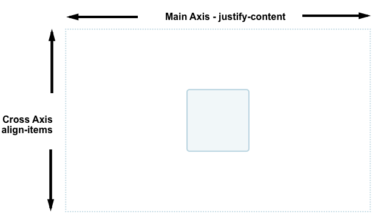
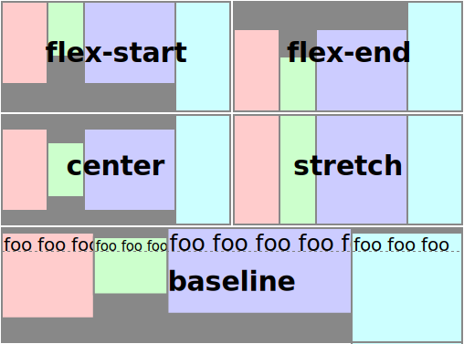
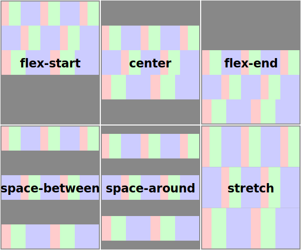
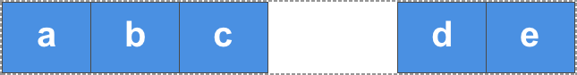

## Flexbox

Flexible box 模型，是一种一维的排版模型。Flexbox 一次只能处理一个维度上的元素排版（行 / 列）。

- 第一代排版技术：float、position 等 CSS 2.2 特性。
- 第二代排版技术：Flex Layout 弹性布局，一维排版模型。
- 第三代排版技术：Grid Layout，是一种二维的排版模型。

 ## 1.  CSS  Flexible Box Layout

CSS 弹性布局 / 弹性排版。

在弹性排版的模型中，主要划分为 flex 容器和 flex 子元素。可以在 flex容器中，规定 排版方向（flex-direction），然后 flex 子元素会按照排版方向依次排版。在 flex 子元素排版中，可以弹性伸缩自身尺寸，已适应 flex容器框的尺寸，防止子元素溢出 / 父容器未填满。

## 2. 名词

- Flex 伸缩性 / 弹性
- Flexbox 弹性盒子
- Flex item 弹性子项目 / 弹性子元素

main size：主尺寸

cross size：交叉轴尺寸

main start：主轴起始端

main end：主轴末端

cross start：交叉轴起始端

cross end：交叉轴末端

**Flex container**

- 弹性容器 / flex 容器
- 使用属性： position的值为 'flex'，或'inline-flex'。采用 floxbox 的区域，就是一个 flox 容器。
- 当一个 flex 容器被建立后，他的直系后代就会变成 flex 元素，参与 flex 排版。

**Main Axis**

- 主轴。
- 通过 flex-direction 定义，主轴决定了 flex 子元素的排版方向。分为 水平方向和垂直方向。

**Cross Axis** 

- 交叉轴。
- 垂直与主轴的方向。当主轴确定下来后，交叉轴就确定了下来。

**Start line**

- 起始线。
- 起始线就是 flex 子元素在一个 flex 容器内进行排版时，起始的位置。
- 中英文语境下，如果按照水平方向排版，起始位置就是 flex container 的最左边。
- 中英文语境下，如果按照垂直方向排版，起始位置就是 flex container 的最顶部。

**End line**

- 终止线。
- 和起始线对应，就是排版的最终位置。
- 在中英文语境下，如果按照水平方向排版，终止位置就是 flex container 的最右边。
- 在中英文语境下，如果按照垂直方向排版，终止位置就是 flex container 的最底部。

**Available sapce**

- 可用空间。

- 在一个 Flex container 中，如果按照其 Flex items 的正常尺寸（flex-basis 设定的尺寸），无法填满整个容器，则会出现可用空间。

- flex-gorw属性值，会将 Flex items按照比例拉伸，已填满可用空间。

  

## 3. 基本属性

### 3.1 flex container box 的属性

**flex-direction**

- 定义主轴的方向-子元素排版方向。
- 子元素的排版方向：默认方向是人们书写的方向，即：中英文是从左至右，阿拉伯文是从右至左。

- `row`：主轴水平 - 子元素默认方向排版。
- `row-reverse`：主轴水平 - 子元素反方向排版。
- `column`：主轴垂直 - 子元素默认方向排版。
- `column-reverse`：主轴垂直 - 子元素反方向排版。

**flex-wrap**

- 在 Flex container 中设置该属性，指定 flex 元素单行显示还是多行显示 。
  - nowrap：默认。flex子元素必须在一行中排放，可能导致 flex 容器溢出。
  - wrap：flex可以多行排放。（和书写方向相同）在中英文语境、文字方向从左至右的情况下：默认从左至右、从上至下排放。
  - wrap-reverse：（改变列方向的顺序）多行反向排放。和上文相同的语境下，从下至上排放。

**flex-flow**

- 是将两个属性 `flex-direction` 和 `flex-wrap` 组合简写，第一个值为 `flex-direction` ，第二个值为 `flex-wrap`.
- 比如，flex-flow: row wrap;（flex item横向排版，且允许多行显示）

### 3.2  flex items 的属性

**flex-basis**

- 指定了 flex 元素在主轴方向上的原始尺寸。如果不使用 box-sizing 改变盒模型的话，那么这个属性就决定了 flex 元素的内容盒（content-box）的尺寸。
- 一个 flex items 的 `flex-basis` 优先级，比 width / height 更高（比如主轴是水平方向，就参考 width）。 
- 属性值有如下表达方式：
  - 指定具体尺寸的数值。比如 3px，10em，33.33%，auto.
    - 默认值：auto。意思是：参考 width / height 的尺寸，比如主轴是水平方向，就参考 width
  - 基于 flex 的元素内容，自动调整大小：content。
  - 固有的尺寸。比如 fill、max-content、min-content、fit-content。
- flex-basis 确定后，flex-gorw 和 flex-shrink 就会根据 basis设定的尺寸，进行比例系数的扩充 / 收缩。

**flex-grow**

- 正数值。是一个比例系数，用于规定 flex items 的扩展程度。
- 将 flex items 按照比例系数拉伸，填满可用空间（Available space）。
- （主轴是水平方向的情况下）当 flex 容器的一行中，flex 子元素在排版后总宽度小于容器时（容器有剩余空间），会触发该属性。此时需要扩展每一个子元素的尺寸来填满该行，CSS 会根据对每个元素定义的 flex-grow 比例系数来扩展这个元素，最终填满该行。
- 默认：0，即不发生拉伸。

**flex-shrink**

- 正数值。是一个比例系数，用于规定 flex items 的收缩程度。
- （主轴是水平方向的情况下）当 flex 容器的一行中，flex 子元素排版后总宽度大于容器时，会触发属性。此时需要收缩每一个子元素的尺寸来刚好填满该行，不会溢出，CSS 会根据对每个元素定义的 flex-shrink 比例系数来收缩这个元素。
- 默认：0，即不发生收缩。

**flex**

- 是上面三个属性的统一简写：`flex-grow`，`flex-shrink`，`flex-basis`。即：扩展、收缩、原始尺寸。（大到小）
- 通常情况下，是这样形式赋值的：`flex: 1 1 200px;`

### 3.3 未来属性

- row-gap
- column-gap

## 4. 属性 | 元素的对其和空间分配 

Flexbox 的一个关键特性是能够设置flex元素沿主轴方向和交叉轴方向的对齐方式，以及它们之间的空间分配。

### 4.1 flex container 的属性

**align-items**

- 可以使 flex 子元素在交叉轴方向对齐。
  - stretch。默认。同一行中，所有 flex 元素（flex items）的高度，会默认拉伸到和最高元素一样。换句话说，最高的子元素，定义了容器的高度，其他元素会被拉伸来填满flex容器。
  - flex-start。使flex元素按flex容器的顶部对齐。
  - flex-end。是flex元素按flex容器的底部对齐。
  - center。上下居中对其。
  - ... 很多属性值，是否都常用目前不清楚。

**justify-content**

- 调整元素在主轴方向上对齐方式。
- 如果在一个flex容器中，存在一个flex元素，他flex-grow不等于0（表明他有拉伸系数），此时对其就不会生效。当 length 属性和自动外边距属性（margin: auto）生效之后，对齐已经完成了，所以就不会生效。
- 把元素按照原始尺寸排列好之后，获取可用空间（Available space）：
  - `stretch`：默认
  - `flex-start`：所有元素，从行首起始位置开始排列；
  - `flex-end`：所有元素，从行尾位置开始排列；
  - `center`：所有元素，所谓一个整体，居中放在行中。
  - `space-around`：使每个元素的左右空间相等。
  - `space-between`：使元素之间间隔相等。把可用空间平均分配到元素之间。
  - `space-evenly`：实验性属性。

**align-content**

- 在设置了可以多行排版（flex-wrap: wrap）的情况下，每行按交叉轴的对齐方式。
  - flex-start
  - flex-end
  - center
  - space-between
  - space-around
  - stretch

**place-content**

- 是 align-content 和 justify-content 的简写。（交叉轴对齐 - 主轴对齐）
- 第一个属性值的实现（交叉轴对齐），需要多行显示，flex-wrap: wrap。
- e.g., place-content: center start;  

### 4.2 flex items 的属性

**order**

- 排序
- 默认：0。数字越小排序越靠前。
- 可以设置成负数，因为其他元素默认的值是 0，如果把后面的一个元素设置成 -1，就会排在最前，优先显示。
- 如果遇到相同数字的项目，按照HTML顺序排版。（比如默认都是 0，会按照定义顺序排版）

**align-self**

- 对齐当前 grid 或 flex 行中的元素。在效果上，与 align-items 相同。在对象上，align-self 是在子元素上设置的属性，优先级更高；align-items 是在flex 容器上设置的属性。
- 会覆盖 align-items 的属性值，也就是说，优先级高于 align-items。
  - auto：默认，参考 align-items来定位。
  - flex-start：交叉轴起始端对齐。
  - flex-end：交叉轴底端对齐。
  - center：交叉轴，轴线居中对齐。
  - baseline：基线对齐。
  - streth：全部拉伸填满（所有子元素，都参考高度最高的那个子元素，来填满空间）。

**margin-left: auto**

**margin-right: auto**

- 对一个 flex 元素设置该属性，会把该flex行在其他元素正常尺寸排版后，剩余的可用空间全部划归到这个 flex元素的一侧。
- 比如：下图的构成方式，就是对名称为“d”的flex元素，设置 margin-left：auto。这样，会把所有剩余可用空间，全部分给 d 元素的左外边距。达到 a b c 在左，d e 在右，左右都能分开的效果。

> 参考：
>
> 1. MDN：CSS弹性盒子布局：https://developer.mozilla.org/zh-CN/docs/Web/CSS/CSS_Flexible_Box_Layout
> 2. W3C：[CSS Flexible Box Layout Module Level 1 (w3.org)](https://www.w3.org/TR/css-flexbox/#box-model)
> 3. MDN：[网格布局中的盒模型对齐](https://developer.mozilla.org/zh-CN/docs/Web/CSS/CSS_Grid_Layout/Box_Alignment_in_CSS_Grid_Layout)

