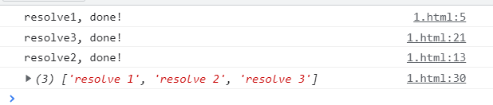
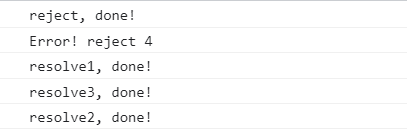
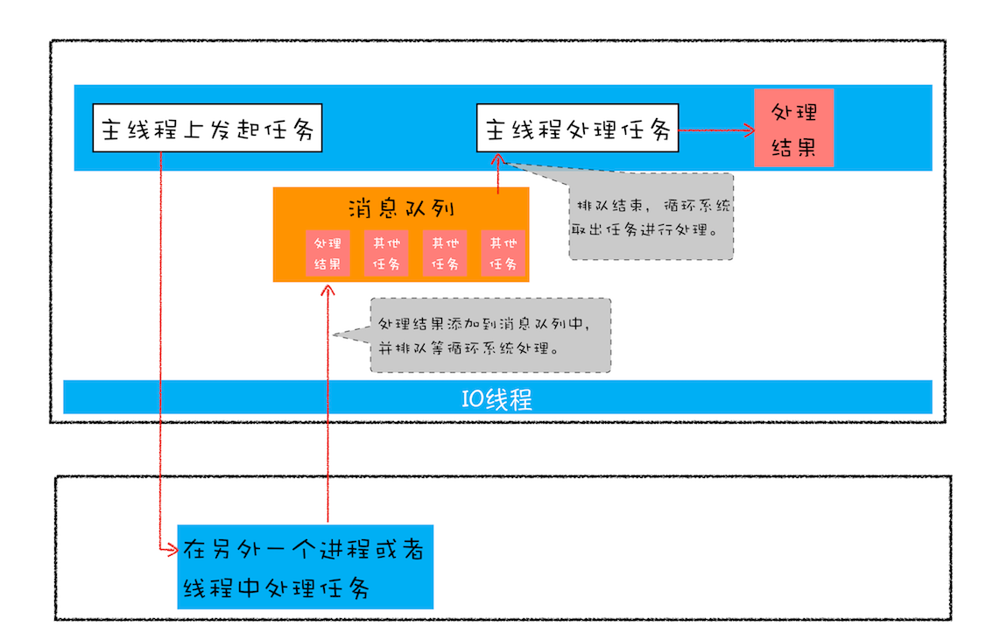

## 1 基础

### 1.1 引子

没有 Promise 时：异步网络请求方式

```js
// request.js 定义请求方式
function requestData(url, successCallback, failtureCallback) {
    // 模拟网络请求
    setTimeout(() => {
        // 拿到请求的结果
        // url传入的是coderwhy, 请求成功
        if (url === "200") {
            // 成功
            const names = ["abc", "cba", "nba"];
            successCallback(names);
        } else {
            // 否则请求失败
            let errMessage = "请求失败, url错误";
            failtureCallback(errMessage);
        }
    }, 3000);
}

// main.js 在组件中调用网络请求API，同时要自定义传入两个回调函数（成功/失败）
requestData(
    "0",
    (res) => {
        console.log(res);
    },
    (err) => {
        console.log(err);
    }
);
```

这种回调的方式有很多的弊端:

1. 需要定义成功和失败的 callback：
    1. 如果是自己封装的 requestData，在封装时必须要自己自定义函数名称 / 调用函数；
    2. 如果使用的是别人封装的 requestData / 第三方库，那必须去看别人的源码或者文档， 才知道这个函数的使用方式。
2. 接收到网络请求的数据后，剩余的处理逻辑被放在了回调函数中，这导致：
    1. 失去控制权。调用回调函数的时机不在自己手里，而是在请求函数中。
    2. 回调地狱。书写方式不是自上而下的习惯性思维，而是变成层层嵌套的结构，增加编码和阅读困难。

### 1.2 Promise

Promise 是一个类：

-   在通过 new 创建 Promise 对象时，我们需要传入一个回调函数，称之为 executor。
    -   Promise 会立即执行 executor，同时会给 executor 传入回调 resolve、reject；

Promise 的 executor 执行情况，有三个状态：

-   待定（pending）: executor 尚未执行完毕，初始状态，既没有被兑现，也没有被拒绝；
-   已兑现（fulfilled / resolved）: executor 调用了 resolve，意味着操作成功完成；
-   已拒绝（rejected）: 意味着操作失败，具体情况有
    1. 失败：executor 调用了 reject；
    2. 错误：executor 函数在执行时，发生了错误（抛出异常），立即变为错误决议，不再执行接下来的代码。

`promise.then()` 可以接收到 executor 的完成情况，`.then` 有两个参数（回调函数）

-   如果是成功，则调用 `then()` 中第一个回调；
-   如果是失败，则调用 `then()` 中第二个回调；

```js
const promise = new Promise((resolve, reject) => {
    // resolve(res) or reject(err)
});

promise.then(
    (res) => {
        console.log("成功:", res);
    },
    (err) => {
        console.log("失败:", err);
    }
);
```

有 Promise 时：异步网络请求方式

```js
// request.js
function requestData(url) {
    // 异步请求的代码会被放入到executor中
    return new Promise((resolve, reject) => {
        // 模拟网络请求
        setTimeout(() => {
            // 拿到请求的结果
            if (url === "200") {
                // 成功
                let names = ["abc", "cba", "nba"];
                resolve(names);
            } else {
                // 失败
                let errMessage = "请求失败, url错误";
                reject(errMessage);
            }
        }, 3000);
    });
}

// main.js
const promise = requestData("200");
promise.then(
    (res) => {
        console.log("请求成功:", res);
    },
    (err) => {
        console.log("请求失败:", err);
    }
);
// 请求成功: ['abc', 'cba', 'nba']
```

### 1.3 resolve, reject 回调

-   **`resolve()` 返回的 `promise`，既可能完成，也可能拒绝，要根据传入参数而定。**
-   `reject()` 会返回一个拒绝的 `Promise`。
-   在 executor 中，执行到 `resolve()` 或 `reject()` 后，executor 不会提前终止，而是把剩余的代码全部执行结束。

#### 1.3.1 resolve

Promise 中，executor 中的回调函数 `resolve()` 可以传递一个参数，这个参数可以是：

-   普通对象、基本数据类型
-   promise 对象
    -   如果是一个 promise 对象，那么此时原 promis 对象的状态不再受到 `resolve()` 决定，而是由传入的这个 promise 对象决定。

下面的例子可以看到，原本 promise 的返回 resolve 是表示成功，但因为传入的 newPromise 状态是失败，所以最终 promise 的状态受 newPromise 决定，变成失败。

```js
const promise = new Promise((resolve, reject) => {
    const newPromise = Promise.reject("newPromise error");
    resolve(newPromise);
}).then(
    (res) => {
        console.log("成功:", res);
    },
    (err) => {
        console.log("失败:", err);
    }
);

// 失败: newPromise error
```

#### 1.3.2 reject

`reject` 失败的状态不会更改，一旦决定，`then` 中一定是失败的。

不同的是，`reject(message)` 中传递的永远是一个失败的 message，不论其内容传递的是基本数据类型、普通对象，还是一个 promise 对象，都会原封不动的传递到 `then` 的第二个回调函数中，当作失败的 message。

-   所以，即使 `reject(Promise.solve())` reject 中传递一个成功的 promise，也不影响 reject 的失败决议，而是把这个成功的 promise 直接当作错误的 message 传递到 then 中。

```js
const promise = new Promise((resolve, reject) => {
    const newPromise = Promise.resolve("success!");
    reject(newPromise);
}).then(
    (res) => {
        console.log("成功:", res);
    },
    (err) => {
        console.log(err instanceof Promise);
        console.log("失败:", err);
    }
);
// ture
// 失败: Promise {<fulfilled>: 'success!'}
```

### 1.4 thenable 对象

具有 then 方法的鸭子类型：一个具有 then 方法的对象，很容易被识别为一个 Promise。这种对象被称为 `thenable` 对象。Promise API 在面对 `thenable` 时，会有不同的表现，总的来说，thenable 对象会干扰 Promise 的正常使用，尽量避免使用 thenable 影响 Promise。

在此举例一个 `thenable`：

```js
// p 是一个thenable对象，拥有then方法
let p = {
    then: function (cb) {
        cb(42);
    },
};

// 调用 p.then，可以看到，resolve 方法可以被使用，但是 reject 是无法使用的
p.then(
    (data) => {
        console.log("resolved", data); // 输出：resolved 42
    },
    (err) => {
        console.log("rejected", err); // 永远不会被执行
    }
);
```

### 1.5 Promise 方法

打印 Promise 的全部对象方法：

共有三个：then、catch、finally

```js
// 默认不可枚举，这里显示的方法名称会变淡
console.log(Promise.prototype);
// or
// 用getOwnPropertyDescriptors可以打印全部自有方法，不论是否可枚举。
console.log(Object.getOwnPropertyDescriptors(Promise.prototype));

// then
// catch
// finally

// consturctor：指向构造函数Promise
// Symbol(Symbol.toStringTag)：规范promise对象的打印格式
```


打印 Promise 的全部静态方法：

共有 6 个：resolve、reject、any、race、all、allSettled

```js
console.log(Object.getOwnPropertyDescriptors(Promise));

// resolve
// reject
// any
// race
// all
// allSettled

// name: Promise的类名
// length: ？？？
// prototype: Promise的原型对象
// Symbol(Symbol.species): getter函数，衍生对象在被创建时，会调用
```


## 2 对象方法 (3)

### 快速对比：

✅ `then(onFulfilled, onRejected)`

-   用于处理 成功结果 / 失败结果
-   接收成功值
-   可继续链式调用（返回新的 Promise）
-   返回值：
    -   一个立即值，它会被会被包装为一个 `Promise`，然后返回；
    -   一个 `thenable` 或者 `Promise`，会一直 **展开**(执行)。直到得到一个立即值，然后包装为一个 Promise 并返回。

❌ `catch(onRejected)`

-   用于处理 错误情况
-   是 `.then(undefined, onRejected)` 的语法糖
-   可以统一捕捉上面链条中的异常
-   返回值：
    -   一个立即值，它会被会被包装为一个 `Promise`，然后返回；
    -   一个 `thenable` 或者 `Promise`，会一直 **展开**(执行)。直到得到一个立即值，然后包装为一个 Promise 并返回。

🧼 `finally()`

-   不关心结果（成功 or 失败）
-   常用于：关闭 loading / 清理资源 / 日志
-   不会改变链条结果（它不能接收值）
-   返回值：
    -   被包装为 Promise，但不改变链条结果（返回值为 undefined）
    -   如果返回值是一个 promise 对象，那么这个 promise 对象的状态会决定 finally 的返回值。

```js
// finally 例子
Promise.resolve("ok")
    .finally(() => {
        console.log("finally 执行了");
        return "ignored"; // 被忽略，不影响主链结果
    })
    .then((res) => console.log("结果:", res));
// 输出：finally 执行了 → 结果: ok

// 整体三个方法的例子
new Promise((resolve, reject) => {
    setTimeout(() => {
        // resolve("成功");
        reject("失败");
    }, 500);
})
    .then((res) => {
        console.log("成功：", res);
    })
    .catch((err) => {
        console.log("失败：", err);
    })
    .finally(() => {
        console.log("清理：无论成功失败都会执行");
    });
```

### 2.1 .then

then 调用链原则：

-   Promise 的成功是可以连续传递的；
-   Promise 的失败如果没有被捕获，就会连续往下传递，直到被捕获掉；
-   Promise 的失败一旦被捕获掉，就会又转变为成功状态。

> 当 `then(..)` 的 **完成回调函数** 或 **失败回调函数** 的返回值是：
>
> -   一个立即值，它会被会被包装为一个 `Promise`，然后返回；
> -   一个 `thenable` 或者 `Promise`，会一直 **展开**(执行)。直到得到一个立即值，然后包装为一个 Promise 并返回。
> -   **所以，回调函数的 `return` 后，总会等待一个立即值，返回包装好这个立即值的 `promise`。**

then 方法：

-   then 方法接受两个回调函数，第一个成功时会执行，第二个失败时会执行。
-   then 方法可以进行链式调用，形成连续的 promise 调用。
-   then 方法最终会返回一个新的 promise 对象。
    -   then 方法会对返回的内容进行：`Promise.resolve(xxx)` 调用。

注：

-   then 方法会对返回的内容 xxx，进行 `Promise.resolve(xxx)` 包装，从而达到返回新 promise 对象的效果，这导致：
-   如果编写代码时，返回一个非 promise 对象（ obj 普通对象 / 基本数据类型 / `unefined`），那么 then 会包装为一个 `Promise.resolve(返回值)`，成功状态的 promise，成功的参数为 原来返回的值。
-   如果编写代码时，返回一个 promise 对象，那么 `Promise.reslove(promsise)` 的结果取决于 promise 的状态。这相当于直接返回了这个 promise 对象。

```js
new Promise((resolve, reject) => {
    resolve("success 1");
})
    .then((res) => {
        console.log(res);
        return "success 2"; // 返回非promise对象，then会包装为成功的promise对象
    })
    .then((res) => {
        console.log(res);
        return Promise.reject("error"); // 返回promise对象，状态不变，相当于直接返回
    })
    .then(
        (res) => {
            console.log("never executed");
        },
        (err) => {
            console.log("错误：", err);
        }
    );

// success 1
// success 2
// 错误： error
```

如果返回的是一个 thenable 对象：

-   then 照常执行 `Promise.resolve()`，但 thenable 被误认为是一个 Promise，所以第一个 then 方法最终会返回这个 thenable 对象。然后第二个 then 方法实际上执行的是 thenable 中自定义的 then 方法。

```js
const promise = Promise.resolve();

promise
    .then((res) => {
        return {
            then: function (resolve, reject) {
                console.log("thenable 我被执行了");
                resolve(222222);
            },
        };
    })
    .then((res) => {
        console.log("执行结果");
        console.log("res:", res);
    });

// thenable 我被执行了
// 执行结果
// res: 222222
```

### 1.2 .catch

`catch` 方法，只接受一个失败回调函数。就相当于 then 方法不定义第一个成功回调函数，只定义第二个失败回调函数。

-   `catch` 在 executor 返回失败 / 内部抛错 时触发。
-   `catch` 的返回值：catch 成功捕获了错误，返回的 promise 对象会恢复成功状态。
    -   `catch` 依然会返回一个 promise 对象。其逻辑和 `then()` 的返回值相同。会对返回值进行 `Promise.resolve()` 进行包裹。如果返回值是非 promise 对象，则返回成功；如果返回值是 promise 对象，则返回状态遵循这个 promise 对象返回的状态。

`catch` 是违反了 Promise A+ 的定义，当它出现在 then 调用链中时，是一个兜底的作用。未被捕获的错误会 冒泡 / 顺延 到下一个 `then` 中。不论在 `then` 调用链中的哪一个 `then` 中发生了错误，都会被最后 `catch` 捕获到这个错误。

比如：

```js
promise.then(1).then(2).then(3).catch();
```

`catch` 会 “监听” promise 和 3 个 then 是否抛出错误，如果前面的 then 中定义了错误捕获回调（第二个回调），没有错误流到 catch，catch 就不会触发；如果 then 中没有捕获掉错误，就会让错误顺着 then 链依次抛出，直到被 catch 捕获。

-   catch 兜底 promise 和前面三个 then 出现的错误，所以 then 调用链并不是依次顺着执行的。
-   如果 promise 和前面三个 then 没有出现错误，catch 不会被执行。

```js
const promise = Promise.resolve();

promise.then(undefined, (err) => {
    // err 逻辑
});
// catch 语法糖
promise.catch((err) => {
    // eer逻辑
});
```

注意：`catch` 违反了 Promise A\* 的定义：

```js
const promise = Promise.reject("错误");

promise
    .then((res) => {
        console.log("success");
    })
    .catch((err) => {
        console.log(err);
    });

// 打印：错误
// then 中没有定义错误捕获回调，所以继续抛出错误
// catch 被执行，

promise
    .then(
        (res) => {
            console.log("success");
        },
        (err) => {
            console.log("then err:", err);
        }
    )
    .catch((err) => {
        console.log("catch err:", err);
    });

// 打印：then err: 错误
// then 中定义了错误捕获回调，没有错误传递给 catch
// catch 没有执行
```

### 2.3 .finally

是 ES9（ES2018）的新特性：

-   无论 Promise 对象无论变成 fulfilled 还是 reject 状态，最终都会被执行的代码。
-   不接收参数，通常做收尾的 **清除工作**。
-   finally 也不遵循 Promise A+ 规范。

## 3 类方法 (6)

### 快速对比：

`Promise.all()`：短路机制，只要有一个失败，就立即返回失败。否则等待成功后按顺返回成功；
`Promise.allSettled()`：等全部完成，不管成功或失败，返回 { status, value/reason }[]；
`Promise.race()`：谁先完成就返回谁（成功或失败）；
`Promise.any()`：返回第一个成功的结果；全部失败的话，最终报错（返回 AggregateError）；

### 3.1 Promise.resolve

通常把一个非 Promise 对象转化为 Promise 对象。

> `Promise.resolve(...)` 方法可以把一个待验证的、将要使用的 promise，检测并包装为一个可以信任的 `Promise` 对象。

resolve 参数的形态：

-   参数是一个 基本类型或对象（立即值（非 Promise、非 thenable ）），包装为一个 promise 对象并返回。
-   参数本身是 Promise，就会返回这个 promise 本身。
-   参数是一个 thenable 对象，就会试图 **展开**(执行对象的 then 方法) ，展开过程直到获得一个具体的立即值（非 Promise），然后返回一个用这个值填充的 promise。

```js
const p = {
    then: function (resolve, reject) {
        console.log("thenable 我被执行了");
        resolve(222222);
    },
};

// 传递一个 thenable，就会展开这个thenable，展开为一个最终值，包装到一个 Promise 中。
Promise.resolve(p).then(
    (data) => {
        console.log(data); // 输出：2222222
    },
    (error) => {
        console.log(error); // 永远不会被执行
    }
);

// thenable 我被执行了
// 222222
```

### 3.2 Promise.reject

生成一个 rejected 状态的 promise 对象。

rejected 的参数不论传递的是什么，都会当作 rejected 状态的错误 message 返回。不会和 `Promise.resolve` 一样进行包装。

-   即使是 promise 对象，或 thenable 对象，都会原封不动当作错误 message 返回。不会对其进行 “展开”。

```js
const promise = Promise.reject("rejected message");
// or
const promise2 = new Promsie((resolve, reject) => {
    reject("rejected message");
});
```

### 3.3 Promise.all

等待所有 promise 对象都为完成状态后才会返回。一旦有一个 promise 对象为失败状态，就会立即返回 这个失败状态，丢弃其他 promise 对象状态。

-   返回一个新的 promise。

-   传给 `Promise.all([...])` 的数组中的成员，可以是 `Promise` / `thenable` / 立即值。

    -   数组中的成员均会经过 `Promise.resolve()` 过滤，确保参数均为 `Promise` 对象。

-   数组中的成员中一旦 **有** `reject` 决议，就立即把这个 `reject` 决议设置为拒绝理由，并返回，不再理会其他成员的决议。
-   数组中的成员如果 **没有** `reject` 决议，就一直等待所有成员全部 `fulfill`，把它们成功决议传递的值打包成一个数组，然后再包装为一个成功决议的 `Promise` 并返回。
    -   数组中成员顺序 按照传递 `Promise.all([...])` 时的成员顺序，不是决议完成的先后顺序。
-   ⚠️ 如果传入的是空数组 `[]`，就会立即为完成状态。

使用举例：

先定义 3 个不同时间的成功决议，1 个失败决议。

```js
// 1000 毫秒后成功决议
let p1 = new Promise((resolve, reject) => {
    setTimeout(() => {
        console.log("resolve1, done!");
        resolve("resolve 1");
    }, 1000);
});

// 8000 毫秒后成功决议
let p2 = new Promise((resolve, reject) => {
    setTimeout(() => {
        console.log("resolve2, done!");
        resolve("resolve 2");
    }, 8000);
});

// 4000 毫秒后成功决议
let p3 = new Promise((resolve, reject) => {
    setTimeout(() => {
        console.log("resolve3, done!");
        resolve("resolve 3");
    }, 4000);
});

// 失败决议
let p4 = new Promise((resolve, reject) => {
    setTimeout(() => {
        console.log("reject, done!");
        reject("reject 4");
    }, 0);
});
```

如果 `Promise.all([...])` 的参数数组中，全部会成功决议：

```js
Promise.all([p1, p2, p3]).then(
    (data) => {
        console.log(data);
    },
    (err) => {
        console.log("Promise.all reject!", err);
    }
);
```

最终的返回结果可以看到：

-   所有成员全部成功决议，`Promise.all` 才会成功决议；
-   `Promise.all` 返回的 `Promise` 信息是一个数组，这个数组就是所有传入 `promise` 的完成消息所组成的数组。
-   这个数组的成员的顺序，和完成时间顺序无关，和传入时的顺序一致。



如果 `Promise.all([...])` 的参数数组中，有失败决议：

```js
Promise.all([p1, p2, p3, p4]).then(
    (data) => {
        console.log(data);
    },
    (err) => {
        console.log("Promise.all reject!", err);
    }
);
```

可以看到，一旦有成员失败， `Promise.all([...])` 就拿着这个失败成员的决议，直接返回为失败决议。不再理会其他成员的决议。



### 3.4 Promise.allSettled

all 方法有一个缺陷：当入参数组中有一个 Promise 变成 reject 状态时，all 就会立即返回 reject 状态的新 Promise。

这导致入参数组中其他 resolved 状态，以及依然处于 pending 状态的 Promise，无法获取对应结果。

在 ES11（ES2020）中，添加了新的 API `Promise.allSettled`：

-   该方法会在所有的 Promise 都有结果（settled），返回的 promise 对象才有完成状态。
-   返回的 Promise 一定是 resolved 的，不再有 rejected 状态；
-   allSettled 返回的 promise 对象的决议值是依然是一个数组，其成员不再是具体的决议值，而变成一个对象，其代表了入参的 promise 成员返回的状态 + 决议值：
    -   status：promise 成员的返回状态
    -   value / reason：成员返回的决议值。如果状态是 fulfilled 就为 value；如果是 rejected 就是 reason。
-   allSettled 返回的 promise 对象携带的决议值，不再是 `Promise.all` 方法中每个入参 promise 成员的具体成功值。

举例：

```js
Promise.allSettled([p1, p2, p3, p4]).then(
    (data) => {
        console.log(data);
    },
    (err) => {
        console.log("allsettled reject!", err);
    }
);
```


### 3.5 Promise.race

1. 门闩、静态。返回第一个跨过终点线的 Promise 对象，而抛弃其他 Promise。

    - 一旦有任何一个 Promise 决议为完成， `Promise.race([...])` 就会完成；
    - 一旦有任何一个 Promise 决议为拒绝，它就会拒绝。

2. 传给 `Promise.race([...])` 的数组中的成员，可以是 `Promise` / `thenable` / 立即值。

    - 如果传入了一个空数组，则 `Promise.race([...])` 永远不会决议；

    - 如果数组中有成员是立即值，则成员中第一个立即值胜出。

### 3.6 Promise.any

ES2021（ES12）的新特性。返回第一个决议为成功的 Promise 对象，不关心 promise 的错误结果。

-   和 rece 类似，最终把入参数组中的某个 promise 对象的决议，做为最终决议返回。
-   门闩、静态。不同的是，any 会等待第一个跨过终点线的，且决议为 **fulfilled 成功** 的 promise 对象。
-   如果所有成员都是返回了 rejected，那么最终会返回 rejected 状态，且 error 错误并不是 promise 成员返回的错误决议值，而是 any 自定义的错误。
    -   可以通过 `err.errors` 拿到所有的错误决议值：

```js
const p4 = new Promise((resolve, reject) => {
    setTimeout(() => {
        console.log("reject, done!");
        reject("reject 4");
    }, 10);
});

const p5 = Promise.reject("reject 5");

Promise.any([p4, p5])
    .then((res) => {
        console.log("res:", res);
    })
    .catch((err) => {
        console.log(err); // AggregateError: All promises were rejected
        console.log(err.errors); // ['reject 4', 'reject 5']
    });
```


## 4 问题

### 问题 2：Promise 解决的痛点是什么？

Web 页面是单线程架构模型，这种模型决定了我们编写代码的形式——异步编程。

基于异步编程模型是基于页面的事件循环系统实现的：

当我们需要获取一些非常耗时的任务时，比如网络下载任务、获取用户输入信息等任务，这些任务都会放到页面主线程之外的进程（IO 进程、网络进程）中去执行，等待有了结果后，主线程再接着处理这些任务。

这样就避免了耗时任务一直占用页面主线程的情况。



上图就是一个典型的异步任务。主线程发起一个异步任务后，就丢给其他进程去处理。此时主进程可以着手处理其他任务。等这个异步任务有了结果，就放入消息队列中排队，然后主线程去处理这个结果。

**这就是页面编程的最大特点 —— 异步回调。**

写出来的代码会把一些关键的逻辑点打乱，真正执行的起来，不是按照写代码的顺序去往下执行。所以这种风格的代码不符合人的线性思维方式。

流程如下，主线程：

1. 请求资源，请求一个异步网络调用 `a` ；
2. 等待结果，执行别的任务；
3. 得到结果，根据结果调用对应的回调函数。

```js
请求a(function(请求结果a)){
	处理请求结果a
}
```

如果要连续的请求资源，比如获得 `a` 资源后，接着获得 `b` 资源；等 `b` 资源得到后，去获得 `c` 资源 ...

流程如下，主线程：

```js
请求a(function(请求结果a)){
    请求b(function(请求结果b)){
		请求c(function(请求结果c)){
			...
		}
	}
}
```

如果回调函数嵌套太多，就会形成 **回调地狱**。

**形成回调地狱的原因：**

1. **嵌套调用。**下一个异步任务的开始，依赖上一个异步任务的请求结果。这会需要**在上一个异步任务的回调函数内部去执行新的业务逻辑。**
2. **任务的不确定性。**每个异步任务都会有多种可能的结果（成功、失败等），这在代码中就需要为每个任务准备至少两套回调函数，增加了代码的混乱程度。

**回调函数带来的问题：**

1. 代码混乱，可读性差；
2. 耦合度过高，可维护性差，复用性差。

所以，我们希望的异步处理方式是这样的：

```js
let 请求结果1 = 请求1();
let 请求结果2 = 请求2(请求结果1成功的回调，请求结果1失败的回调);
let 请求结果3 = 请求3(请求结果2成功的回调，请求结果2失败的回调);
let 请求结果4 = 请求2(请求结果3成功的回调，请求结果3失败的回调);
let 请求结果5 = 请求3(请求结果4成功的回调，请求结果4失败的回调);
```

这需要解决形成回调地狱的两个问题：

1. 消灭嵌套调用；
2. 合并多个任务的错误处理。

Promise 是如何解决这回调地狱的这两个问题的：

**首先，Promise 实现了回调函数的延时绑定技术。**

1. `new Promise(...)` 在创建的同时，会立即执行（同步调用）参数中的任务，然后会异步等待一个结果。产生的结果（完成 / 失败）会保存在返回的 `Promise` 中。
2. 当我们通过调用 `.then(...)` 处理这个结果时，才会动态绑定回调函数。绑定好后，才会执行回调函数。
3. 为了实现延时绑定，V8 引擎把调用回调函数改成了微任务。这样既可以让回调函数延时被调用，又提升了代码的执行效率。

**其次，Promise 实现了将回调函数的返回值穿透到最外层**

把每次执行回调函数后的处理结果，穿透到最外层，就能避免回调地狱的层层嵌套结构。

下面是 Promise 的调用逻辑：

```js
new Promise(请求1)
    .then(请求2(请求结果1成功的回调))
    .then(请求3(请求结果2成功的回调))
    .then(请求4(请求结果3成功的回调))
    .then(请求5(请求结果4成功的回调))
    .catch(处理异常(异常信息));
```

```js
// 自己定义的一个Bromise，传递参数为一个异步任务executor
function Bromise(executor) {
    // 回调函数初始化时为 null
    var onResolve_ = null;
    var onReject_ = null;

    // 模拟实现 .then。
    // 模拟实现调用时绑定。只有在调用 then 时，才会绑定成功回调函数。
    this.then = function (onResolve, onReject) {
        onResolve_ = onResolve;
    };

    // 延迟定义 resolve 回调
    // 在调用到 onResolve_ 函数的时候，Bromise.then 还没有执行，
    // 所以要利用 setTimout延迟调用。而V8 引擎是通过微任务来延迟调用的。
    function resolve(value) {
        setTimeout(() => {
            onResolve_(value);
        }, 0);
    }

    // 在创建Bromise的时候，就会同步立即执行传递的executor任务。
    executor(resolve, null);
}

// 使用 Bromise
// 定义一个异步任务 executor
function executor(resolve, reject) {
    // 这里是任务内容...
    resolve(100);
}
// 定义异步任务成功时的回调
function onResolve(value) {
    console.log(value);
}

let demo = new Bromise(executor);
demo.then(onResolve);
```

### 问题 3：Promise 中为什么要延时绑定回调函数？

1.  Web 页面是基于单线程的执行模型（主线程），这决定了我们必须采用异步编程模型。

    -   浏览器中的 JavaScript 引擎和 DOM 操作都在同一个线程中执行（主线程）。
    -   若同步代码长时间占用主线程，会阻塞 UI 渲染、用户交互等，造成页面卡顿。

2.  早期异步编程主要依赖回调函数（callback）实现，如事件监听、Ajax 回调等。

    -   这种写法一旦嵌套较深，会导致所谓的“回调地狱”，代码难以维护。

3.  为了解决回调地狱的问题，ES6 引入了 Promise 对象。

    -   Promise 提供了更优雅的链式异步编程方式，可以让异步逻辑像同步一样编排。

4.  但 Promise 的 .then() 并不是“同步执行”，而是规定为：

    -   所有 .then() 注册的回调必须 异步执行，即使 resolve() 是同步调用的。

5.  为了保证 .then() 回调异步执行，Promise 的实现使用了 “微任务队列（microtask queue）”。

6.  在调用 `.then()` 时，再绑定回调函数，确保 then 的异步执行。

### 问题 4：Promise 中为什么要引入微任务？

`promise` 采用 `.then` 延时绑定回调机制。（上文）

1. 为了保证 .then() 回调异步执行，可以用宏任务和微任务两种方式。
   -   Promise 选择了使用 “微任务队列（microtask queue）”
   -   每次 .then() / .catch() / .finally() 都会将对应回调压入微任务队列。
   -   微任务的优先级高于宏任务（setTimeout、setInterval），会在当前执行栈清空后立即运行。
   -   这样做保证了 Promise 调用链的处理，上下文环境是高度一致的。
