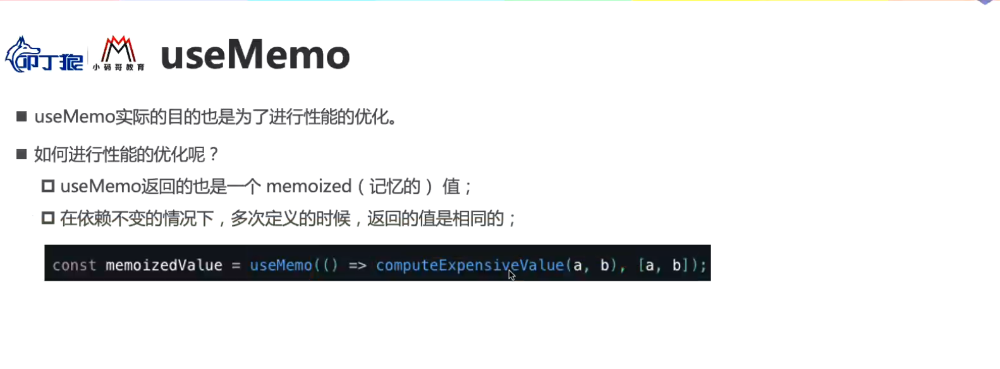

### 🍊 组件间的通信方式（8种）

父组件 => 子组件：

1. Props
2. Refs

子组件 => 父组件：

1. Callback Function
2. Event Bubbling 事件冒泡

兄弟组件之间：

1. Parent Component：共同祖先

不太相关的组件之间：

1. Context
4. 观察者模式 Event Bus
5. Redux 等


**（1）props + Callback Function**

1. 【父组件】给【子组件】传递数据：通过 `props` 传递
2. 【子组件】给【父组件】传递数据：通过 `props` 传递，要求父子组件给子传递一个回调函数，子组件通过调用这个函数，把数据传递给父组件。
   - 在函数组件中的 hooks，useState 创建的 `setCount()` ，传递给子组件。

需要使用 shallowEqual 优化，防止子组件频繁渲染：

- 函数组件，memo 包裹子组件 + useMemo 值 + useCallback 函数；
- 类组件，PureComponent 继承。


**（2）Refs**

父组件通过 `refs` 直接调用子组件实例

- [useImperativeHandle](https://www.ninjee.co/docs/frontEnd/React#useimperativehandle)：用于父组件调用子组件的属性/方法。子组件对外暴露 / 提供部分功能

- forwardRef：用于转发 ref。函数组件（有 props, ref 参数）传入 forwardRef，返回绑定好 ref 的新组件。

```jsx
const Father = () => {
  const sonRef = useRef();
  return (
    <div>
      <Son ref={sonRef} value="子组件内容" />
      <button onClick={() => sonRef.current.handle1()}>点击打印 sonRef</button>
    </div>
  );
};

const Son = forwardRef((props, ref) => {
  const input = useRef();
  useImperativeHandle( ref, () => {
    return {
      handle1: foo
    };
  }, []);

  const foo = () => {
    console.log("foo function!");
    console.log(input.current.value);
  };

  return (
    <div>
      <input type="text" defaultValue={props.value} ref={input} />
    </div>
  );
});

// 点父组件的 button 后，控制栏输出：foo function 子组件内容
```


**（3）Event Bubbling 事件冒泡**

利用原生 dom 元素的事件冒泡机制，父组件拿到子组件的 dom 元素。

```js
const Father = () => {
  return (<div
      onClick={(e) => console.log(e.target.previousSibling.value) }
    >
      <Son />
    </div>);
};

const Son = () => {
  return (<div>
      <input defaultValue="请输入内容..." />
      <button>Click</button>
    </div>);
};

// 点子组件的 button 后，控制栏输出：请输入内容...
```


**（4）context - provider**

-   缺点1：context 是一个全局变量，当组件庞大复杂的时候，全局命名空间会变得繁杂，变量的来源和去向不清楚。
-   缺点2：如果没有及时的在卸载组件时取消订阅，context 没有清空，造成内存泄露。

消息订阅与发布机制

1. 先订阅，再发布（理解：有一种隔空对话的感觉）
2. 适用于任意组件间通信
3. 要在类组件的 `componentWillUnmount` 中取消订阅

```jsx
// 【1】创建一个全局的上下文组件。
const ThemeContext = React.createContext("light");

// 【2】父，通过 ThemeContext.Provider包裹子组件，value 传递值。
class Father extends React.Component {
  render() {
    return (
      <ThemeContext.Provider value={{ name: "123" }}>
        <MidComponent />
      </ThemeContxt.Provider>
    );
  }
}

// 中间组件
function MidComponent() {
  return <div><ThemedButton /></div>;
}

//【3】孙，通过 contextType 声明要使用 context
class ThemedButton extends React.Component {
  static contextType = ThemeContext;
  render() {
    // 123
    return <div>{this.context.name}</div>;  
  }
}

//【4】孙，或者通过 Consumer，在 return 中直接拿到 value
class ThemedButton extends React.Component {
  render() {
    // 123
    return <ThemeContext.Consumer>{(value) => value.name}</ThemeContext.Consumer>
  }
}

//【5】函数组件用 useContext 拿到 value
function ThemedButton() {
  const value = React.useContext(ThemeContext);
  // 123
  return <div>{value.name}</div>;
}
```

**（5）Event Bus** 

- https://juejin.cn/post/7101481154565865486
- https://segmentfault.com/a/1190000023585646
- https://codesandbox.io/s/wizardly-wave-rrmw5v?file=/src/Context.jsx

**（6）redux**

使用 redux 管理组件间的数据，达到完全可控。


# 5 文件结构：

public ---- 静态资源文件夹

​			favicon.icon ------ 网站页签图标

​            index.html -------- 主页面，项目只有一个 `.html` 文件，SPA（single page app）单页面应用。

src ---- 源码文件夹

​            App.js --------- App 组件，项目只有一个父组件，放到 `<div id="root"></div>` 中，其余自己添加的组件，都放到 App 组件中。 

​            index.js ------- 入口文件，引入 react 核心库、react-dom 核心库、App 组件等必要的资源。

​		    ...... 


### 1 启动流程

1. 在 `src` 下 `index.js`:
   - 引入 react 核心库；
   - 引入 react-dom 核心库；
   - 引入 index CSS 样式；
   - 引入 App 组件；
   - 触发 `ReactDOM.render()` 渲染 App 组件；
     - 引入 App 组件时，就会把相应的 CSS、JS 代码全部引入。

2. 在 `index.js` 文件执行后，React 通过 webpack 的配置文件，找到 `public` 下的 `index.html`：
   - 依次执行 `index.html` 中的程序，
3. 最终，渲染出 `index.html` 的页面。


# 6 router

## 1 路由基础

SPA 的 定义：

1. 单页Web应用（single page web application，SPA）。
2. 整个应用只有 **一个完整的页面**。
3. 点击页面中的链接 **不会刷新** 页面，只会做页面的 **局部更新。**
4. 数据都需要通过 ajax 请求获取, 并在前端异步展现。


路由的定义：一个路由就是一个映射关系 (key / value)：

- key 是一个路径，如`"/serch/users"`；
- value 可能是 function（后端） 或 component（前端）。


### 🍊 链接如何跳转

**链接的跳转是依靠 BOM 中 window.history 实现的。**

通过 `history.js` 库，简单介绍一下基本的实现原理：

1. 提前准备工作：`let history = History.createBrowserHistory()`。通过 `history.js` 库，创建一个比直接调用 BOM 更方便的方式，来修改 BOM 中的 `window.history` 属性。
2. 当用户点击 `a` 标签，触发了 `onClick` 回调函数：
   1. 使用 `history.push()` 往历史记录中添加一个地址。
   2. 使用 `return false` 阻止浏览器的自动跳转行为；
3. 在函数 `history.listen(location = > { console.log("请求路由路径变化了", location)})` 的监听中，我们就可以通过 `location` 参数获得变化的路径，然后根据不同的路径再展示不同的组件到页面。


**前端路由的跳转，也是依靠 BOM： `window.history` 的属性操作来实现的。**


### BrowserHistory 和 HashHistory 的区别

BrowserHistory 是 H5 推出的 `history` 身上的 API；

HashHistory 是利用 hash值（锚点跳转），兼容性更强， `#` 锚点后的信息被当做前端内容，不会回传给后端服务器。

```jsx
// BrowserHistory的地址:
127.0.0.1:5500/index.html/test1

// HashHistory的地址，多了一个'#'，锚点的标记
127.0.0.1:5500/index.html#/test1
```


## 2 路由的使用

#### 1 明确好界面中的导航区、展示区

- 导航区，点击后会发生页面变化的链接；
- 展示区，页面变化的主体。每个展示区，都是一个组件。


#### 导航区+展示区的使用：

传统的 HTML 中 `a` 标签：

```html
<!-- 作为对比：原生html中，靠<a>跳转不同的页面 -->
<a className="list-group-item" href="./about.html">About</a>
<a className="list-group-item active" href="./home.html">Home</a>
```

在 React 中，使用路由依靠 **路由链接** 实现切换组件。

首先需要在使用路由的外侧，包裹一个 Router 类的标签，有两种可选择：`BrowserRoute` 或 `HashRoute`。

- `Router` 组件有两种，`BrowserRoute` 或者 `HashRouter`。

在整个项目的路由跳转中，要在同一个 `BrowserRouter`  标签的管理下。通常是整个项目都是同一个 `BrowserRouter`  的管理。


**路由组件的 props**

传递 props 和 **很多路由相关信息** 给路由组件，子路由组件的 `this.props` 有：

- `history`
- `location`
- `match  `
- 还有很多，不常用

```jsx
// this.props 中的三大属性：
history:
    go: ƒ go(n)
    goBack: ƒ goBack()
    goForward: ƒ goForward()
    push: ƒ push(path, state)
    replace: ƒ replace(path, state)

location:
    pathname: "/about"
    search: ""
    state: undefined

match:
	params: {}
    path: "/about"
    url: "/about"
```

history 中的 5 个方法，在 3.11 编程式路由导航中有详细介绍。

- `go(step)` ：指定参数的数字前进 / 后退。如果是 2，前进 2 步；如果是 -2 后退，2 步。
- `goBack()`：后退 1 步；
- `goForward()`：前进 1 步；
- `push(path, state)`：采用 push 方法记录历史，默认采用 push 方法。
- `replace(path, state)`：采用 replace 方法记录历史，会把点击后的网页历史，顶替掉上一个网页的历史


```jsx
{/*一般组件 */}
<Home name={Moxy} />

{/*路由组件 */}
<Route path="/about" component={About} />
```


## 3 路由组件

### 1 NavLink 和 Link 组件有什么不同？

Link 替换了 HTML 中的 `a` 标签，是 Route 中实现跳转功能的导航区。

NavLink 组件比 Link 组件多了添加样式功能，可以在用户点击某个 NavLink 后，为这个标签添加类名：

```js
<NavLink activeClassName="blue" className="list-group-item" to="/about">About</Link>
<NavLink activeClassName="blue" className="list-group-item" to="/home">Home</Link>
<NavLink activeClassName="blue" className="list-group-item" to="/head">Header</Link>
<NavLink activeClassName="blue" className="list-group-item" to="/foot">Footer</Link>
```

- 当该链接被激活时，就会把 `activeClassName` 的属性值添加为类名。如果不设置 `activeClassName` 属性，就会默认添加类名  `active` 。


### 2 Switch 组件解决了什么问题？

 React-route 的查找原则：

- 依次把所有 Route 都匹配一遍，如果 path 属性值匹配成功，就会展示该组件，这会极大的影响匹配效率。

假设 Route 非常多，每次匹配都需要把所有 Route 都遍历一遍。而如果查找的 `/home` 是列表的第二行，我们希望只要匹配成功，就不再往下接着匹配，提高匹配效率，这时候就使用 Switch 组件了：

```jsx
imprt Switch form 'react-router-dom'
{/* 注册路由 */}
<Switch>
    <Route path="/about" component={About}/>
    <Route path="/home" component={Home}/>
    <Route path="/home" component={Test}/>
</Switch>  
```

- 只需要把 Route 包裹在 Switch 中使用即可。
- Switch 是单一匹配，一旦匹配成功，就不会再去查找和匹配剩余的 Route。


### 3  路由的模糊匹配与严格匹配

#### 1 模糊匹配

如果地址栏输入以下两个链接：

- /about
- /home

如果我们尝试跳转：`<Route path="/home/a/b" component={Home} />`，根据模糊匹配原则，虽然没有 `/a/b` 的地址，但是先匹配 `/home`，发现一致，则匹配成功，展示 Home 组件。


我们希望当用户输入默认网址时，才会展示 Home 组件。这就需要对主页地址 `/` 设置 exact。在设置了精确匹配后，之后地址栏输入完全一致的主页地址，才会展示 Home 组件。

- 如果不设置 `exact`，地址 `/about` 会首先匹配到 `path="/"`，然后展示 Home。如果是用 switch，就不会再展示 About 组件了。`<Switch>` 中只要匹配一次成功，就会停止匹配。所以不论地址输入哪一个网页，都会匹配到 Home 组件。


#### 2 严格匹配

```jsx
// 开启严格匹配
<Route exact={true} path="/home" component={Home} />
// 或
<Route exact path="/home" component={Home} />
```

当我们注册路由时，`exact` 属性置为 true，就会开启精准匹配。必须所有地址完全一致，才可以匹配成功。

- 如果不主动设置属性为 `true`，则默认是 `true`。

一般情况下不会开启严格匹配。严格匹配的开启，可能会导致二级路由匹配失败的问题。


## 4 Redirect 重定向

```jsx
// 开头需要引入 Redirect 组件
import {Route, Switch, Redirect} from 'react-router-dom'

{/* 注册路由 */}
<Switch>
    <Route path="/about" component={About} />
    <Route path="/home" component={Home} />
    <Redirect to="/about" />
</Switch>
```

- 如果其他路由都无法匹配，Redirect 作为 “兜底”，最终会定向到 `/about` 的 Route 路由。


##  5 向路由组件传递参数

使用频率：`params` > `search` > `state`

#### 1 match.params 参数

- 父组件：
  - 路由链接 (携带参数)：`<Link to='/demo/test/${msgObj.name}/${msgObj.age}'}>详情</Link>`
  - 注册路由 (声明接收)：`<Route path="/demo/test/:name/:age" component={Test}/>`
- 子组件：
  - 接收参数：`this.props.match.params`


#### 2 search 参数

- 父组件：
  - 路由链接 (携带参数)：`<Link to='/demo/test?name=${msg.name}&age=${msg.age}'}>详情</Link>`
  - 注册路由 (无需声明，正常注册即可)：`<Route path="/demo/test" component={Test}/>`

- 子组件：
  - 接收参数：`this.props.location.search`
    - 使用 `querystring` 方法，同时注意删除链接地址开头的小问号 `?`。

特点：

- 获取到的 search 是 `urlencoded` 编码字符串，需要借助 `querystring` 解析。
- 收到的消息是：`"?name=Moxy&age=18"`，形式是 `"key=value&key=value"` 叫做 `urlencoded` 编码。


#### 3 state 参数

- 父组件：
  - 路由链接(携带参数)：`<Link to={{pathname:'/demo/test', state:{name:'tom',age:18}}}>详情</Link>`
  - 注册路由(无需声明，正常注册即可)：`<Route path="/demo/test" component={Test}/>`

- 子组件：
  - 接收参数：`this.props.location.state`

特点：

- state 参数路由链接中，`to` 属性值是一个对象，而不是字符串地址；

- 页面地址栏中没有参数；

- 因为 state 不通过地址栏传递参数，所以当我们直接输入地址栏访问：`localhost:3000/test/about`；而不是通过点击链接的形式访问这个地址，就会发生找不到参数的问题，此时 `this.props.location.state` 的值是 `undfined`。

  ```jsx
  // 所以，接收参数要：
  const {id, title} = this.props.loction.state || {}
  // 如果 state 有值，就接收值；如果没有值，就接受一个空对象。
  ```

- 如果传递过参数，即使用户页面刷新也可以保留住参数。

  - params 和 search 刷新也能保留住参数，因为他们的参数直接在地址栏就体现了


## 6 BrowserRouter 与 HashRouter 的区别总结：

1. 底层原理不一样：
   - BrowserRouter：使用的是 H5 的 history API，只兼容 IE10 以上版本。
   - HashRouter：使用的是 URL 的哈希值，兼容性更好。
2. `path` 表现形式不一样
   - BrowserRouter 的路径中没有 `#`，例如：`localhost:3000/demo/test`;
   - HashRouter 的路径包含 `#`，例如：`localhost:3000/#/demo/test`；
3. 刷新后对路由 `state` 参数的影响
   - BrowserRouter：没有任何影响，因为 `state` 保存在 `history` 对象中；
   - HashRouter：刷新后会导致路由 `state` 参数的丢失，
     - HashRouter 没有使用 html5 中的 history API，无法从历史记录中得到 `key` 和 `state` 的值，所以当刷新路由后 `state` 值会丢失导致页面显示异常。
     - 哈希历史记录不支持 `location.key` 和 `location.state`。
4. 备注：
   - HashRouter 可以用于解决一些路径错误相关的问题。
   - 使用最多的是 BrowserRouter。


## 7 react-router-config

通过配置 config 形成路由映射关系的数组。

-   导航区正常使用 `NavLink`；
-   跳转区调用 `renderRoutes(routes)` 实现路由；


# 7 redux

## 7.1 基础

### 7.1.1 为什么要用 Redux

JavaScript 开发的应用程序，已经变得越来越复杂了：

- 需要管理的状态更复杂；
- 服务器返回的数据、缓存中读取的数据、用户点击按钮 / 表单提交等生成的数据、UI 状态的数据。

所以，管理不断变化的 state 是非常困难的：

- 状态之间相互会存在依赖，一个变化通常会引起另一个变化；
- 我们想更好的追踪和控制 state 发生的变化：
  - 发生变化的时机、原因、结果。

然而，React 只是在视图层帮助我们解决了 DOM 的渲染过程，State 依然是我们自己来管理：

- 组件自定义 state、通过 props 在组件之间进行通信、通过在父组件存放数据进行子组件数据共享；

综上，Redux 就是一个帮助我们集中管理 state 的容器：

- Redux 是 JavaScript 的状态容器，提供了 **可预测** 的状态管理。
  - 发生变化的时机、原因、结果，都可以控制和追踪。
- Redux 体积非常小，且不仅在 React，在其他两个框架也能使用。


## 7.1.2 基本结构：

### index.js (store)

对外的入口，共 4 行：引入 redux、引入 reducer、创建 store、导出 store。

store：存储数据 state，提供派发方法 dispatch


### reducer.js

数据集中处理函数

- 纯函数，因为 state 是只读的，只能通过 dispatch 派发去修改。
- 将 state 和 action 结合起来生成一个新的 state


### actionCreators.js (action)

定义更新数据的具体方式。是函数的集合。

有两种 action：

- 同步 action：返回的是一个对象，包含了 actionType 和 value，提供送给 reducer 对 state 进行操作。
- 异步 action：返回的是一个函数，在这个函数中可以异步从网络获取资源。当获取到资源后，再调用同步 action，去更新 state。


### constant.js

保存 action 操作的 **所有类型名 type**，方便查阅和修改。


## 7.3 Redux 流程

当我们要对某个 Component 组件的 state 进行修改时，会发生如下流程：

1. **Central Store**。
   - 从 Central Store 出发，redux 中只会定义一个 store 用来存储整个项目中的数据。

2. **Subscription**。 
   - 在这个 Component 的 `componentDidMount()` 组件加载完毕的回调中，添加 `store.subscribe()`  订阅。也就是一旦 store 中的数据发生变化，就会调用这个监听函数。
   
   - 当用户发生对数据修改的行为（点击按钮、输入表单等等），就会触发 `Dispatches`，Store 中的数据就会发生改变，进而我们设定的 subscribe 订阅监听就会被触发。
   - 在 Subscription 中添加 `this.setState()` ，把 store 中变化的数据，更新到这个 Component 组件中的 state 。
   - 此时 React 会更新组件的 state，并触发 `render()` 去重新渲染页面，呈现新数据。
   
3. **Component**。
   - 通过在组件的 `componentDidMount()` 中订阅  `this.setState()` ，就会让这个组件自身的 state 随着 store 中的 state 变化而保持最新。也就是说，store 中会保存全部需要共享的数据，组件会额外的保存一份 store 中自己需要的数据。

   - 同时在组件中的 `button` 按钮定义触发事件，一旦触发，就使用 Dispatches 派发 Action，去更新 store 中的数据。

4. **Action**。
   - Actions，是提前定义好的多种对数据的操作方法。
   - 在这里定义 Dispatch 派发时， 同时指定要执行的 action 名称以及传入对应的操作参数。

5. **Reducer**。
   - Redux 通过 Reducer 把数据修改。 
   - reducer 收到需要操作的 state 和 操作方法 action，根据 `action.type` ，对数据进行操作。最后返回一个新的 state。
   - Redux 会把这个 state 更新到自己的 store 中。

6. 进入一个新的循环，一旦 store 发生改变就会被订阅到，然后调用 `this.setState()` 同步更新组件的 state，最后


## 7.4 react-redux

利用 react-redux 实现了将 redux 进入 react。

-   在 react hook 中，使用 `useSelector` 获取 redux 中想要的 state，同时设定了监听。一旦 state 发生更新，就会更新所有使用了 `useSelector`  获取该值的组件。
    -   注意：state 只要有一个值发生更新，就会导致所有 useSeleoctor 更新。解决，使用 `shallowEqual`。


利用：发布订阅结构，subscribe 和 unsubscribe。


## 7.5 中间件 — 组件中的异步操作


把对网络请求的发送，获取网络资源，放到 redux 中。也就是利用 异步 action 获取网络资源。

**使用中间件 (Middleware)**

- 这个**中间件的目的是在`dispatch`的`action`和最终达到的`reducer`之间，扩展一些自己的代码**
- 比如日志记录、**异步网络请求**、添加代码调试功能等等


####  `redux-thunk` 是如何做到让我们可以发送异步的请求呢？

- 默认情况下的`dispatch(action)`，`action` 需要是一个 `JavaScript` 的对象
- `redux-thunk` 让 `dispatch(action())` 中的 `action()` 原本是返回一个值，现在可以 **返回一个函数**
- 该函数会被调用，并且会 **自动的** 传给这个函数两个参数：`dispatch` 方法 +  `getState` 方法。
  - 这使得这个函数内部可以使用 `dispatch` 更新数据、使用 `getState` 获取数据
    - `dispatch` 方法：用于我们之后再次派发 `action`；
    - `getState` 方法：考虑到我们之后的一些操作需要依赖原来的状态，用于让我们可以获取之前的一些数据；


## combinReducers  拆分 reducer

如果项目对数据的操作：

1. 条目非常多，可能有上千行，reducer 非常长；
2. 对数据的操作有明显的类别，如异步网络申请数据、本地数据、不同的组件数据等。

# 8 单向数据流

有三个理解：

1. React 官网中有提到单向数据流：
   - 只的就是通过 props 进行数据传递。一个项目中，组件是按以树的结构组织起来的。上层的组件可以通过  props 向下层组件传递数据。也就是父组件可以单向的向子组件传递数据。
2. Vue 和 React 中，每个组件内部也有一个单向数据流：
   - 一个组件从功能的实现上看，有三个模块：
     1. UI，组件最终展示的数据和界面；
     2. action，对组件中数据的操作方式，比如增删改等操作；
     3. State，组件数据保存的地方，组件的状态。
   - 所以，在 UI、action、State 之间也是按照单向数据流传递的：
     - 在 UI 页面中，用户通过交货产生了对数据的操作，触发 action；
     - React 接收到特定的 action 操作，进而对组件的 State 进行修改；
     - 组件的 State 一旦发生变化，就会触发 `render()` 重新渲染 UI ，页面发生变化。
3. Redux 中，对数据的操作也是一个单项数据流：
   - 一个 Store 从对数据的操作来看，有 3 个模块：
     1. UI，组件最终展示的数据和界面；
     2. Dispatch，组件中对数据的操作方式，比如增删改等操作；
     3. Store，组件中保存数据的地方。
        - Reducer，Store 中保存对数据操作的地方。Dispatch 触发 Reducer ，完成对数据的操作。
        - State，Store 中保存数据的地方。
     4. 所以，数据在UI、Dispatch、Store（Reducer、State）中也是一个单项数据流：
        - 用户通过 UI 界面触发事件，引发 Dispatch 派发申请对数据进行操作；
        - Dispatch 调用 Store 中的 Reducer，通过携带的 action 识别 Reducer 中对应的操作。然后修改数据；
        - 修改后的数据会更新 Store 中的 State。
        - 数据更新完毕后，会通知 React 组件，最终 `render()` 重新渲染 UI 界面。


# 9 React Hooks

对函数式组件扩展了功能，可以让函数式组件也拥有 class 组件的各种方法。

```jsx
const [currentPage, setCurrentPage] = useState(1);

const { topAlbums, total } = useSelector(
  (state) => ({
    topAlbums: state.getIn(["album", "topAlbums"]),
    total: state.getIn(["album", "topTotal"]),
  }),
  shallowEqual
);
const dispatch = useDispatch();

useEffect(() => {
  dispatch(getTopAlbumsAction(1));
  dispatch(changeTopAreaAction());
}, [dispatch]);
```


## 9.1 class 组件缺点

Class 组件存在问题：

- class 中有非常多的模式问题：this 指向问题，constructor 问题等等。
- 组件的复用非常麻烦：需要通过高阶组件去复用。


## 9.2 hooks

### 三个基本 hooks + 六个扩展 hooks

- useState、useEffect、createContext

- useReducer、useCallback、useMemo、useRef、useImperativeHandle、useLayoutEffect

  

#### useState

创建一个 state ，提供了 state 值 count，和更新 state 的方法 setCount。

```js
const [count, setCount] = useState(0);
```


#### useEffect

如果不添加末尾的依赖数组：

- 只要组件调用被重新渲染，就会触发 `useEffect` 的回调函数（不执行 `return` 内的回调函数）；

- 只要组件调用被卸载，就会触发 `useEffect` 回调函数 `return` 的回调函数。

重新渲染：相当于：`componenWillMount` + `componentWillUpdate`

卸载：相当于 `componentDidupdate`


如果末尾添加一个空白的依赖数组 `[]`，只在第一次加载组件时执行回调，卸载组件时执行 return。

重新渲染：相当于：`componentDidMount`


如果依赖中添加了变量依赖，则如果变量值发生改变，就会重新定义 `useEffect` 中的回调函数。

```jsx
//在函数组件中使用 hooks
useEffect(()=>{
    console.log("订阅一些事件")
    console.log(“只要组件重新渲染就会调用这里，相当于componentDidMount+componentDidUpdate”)
    
    return ()=>{
        console.log("取消订阅事件")
        console.log("在卸载组件前，或重新渲染组件前，都会调用这里")
    }
})

//给useEffect添加了第二个参数，一个空数组
useEffect(()=>{
    console.log(“组件第一次渲染调用这里，相当于componentDidMount”)
    
    return ()=>{
        console.log("取消订阅事件")
        console.log("在卸载组件前调用这里,相当于componentWillUnmount")
    }
},[])
```


#### createContext


 使用 Context Hook就可以解决使用时层层嵌套的这个问题：


如何使用context

-   首先要引入 React 内置的 React Context API 📦
-   然后创建 `provider`，提供数据的组件通过 provider 把数据传输出去。
-   最后创建  `consumer ` ，使用数据的组件，通过 `consumer` 获得数据。使用 usecontext hook 可以不用创建 `consumer`

当 Provider 的 `value` 值发生变化时，它内部的所有消费组件都会重新渲染。Provider 及其内部 consumer 组件都不受制于 `shouldComponentUpdate` 函数，因此当 consumer 组件在其祖先组件退出更新的情况下也能更新。

链接：https://juejin.cn/post/6989054367064129573


### useReducer

1. useReducer 是 useState hooks 的扩展。在逻辑相对复杂的情况下，可以用 reducer 的 switch 进行判断，通过 dispatch 达到对同一个 state 有不同的更新方法。
2. 如果多个组件均有一个相同的判断方式（可以用同一个 switch 判断），那么单独定义一个 reducer 纯函数，然后不同的组件 import 引入这个 reducer 即可。

使用1：在一个组件中使用 reducer：

```jsx
// 1 引入 useReducer
import React, { useReducer } from "react";

// 2 定义 reducer方法，这个方法接收两个参数：要操作的数据 state，操作的方法名称 action
function reducer(state, action) {
  switch (action.type) {
    case "increment":
      return { ...state, counter: state.counter + 1 };
    case "decrement":
      return { ...state, counter: state.counter - 1 };
    default:
      return;
  }
}

export default function Home() {
  // 3 创建一个 Reducer，输入两个参数：一个reducer方法，一个数据对象，
  // 	useReducer 会返回两个结构：
  // 		1. 存放数据的 state 对象，保存的就是 {counter:0}，
  //		2. 触发 action 的方法，dispatch，使用 dispatch 来操作 state。
  const [state, dispatch] = useReducer(reducer, { counter: 0 });

  return (
    <div>
      <h2>Home当前计数：{state.counter}</h2>
      {/* 4 对state进行操作，通过调用 dispatch()方法，传入action对象，成员有操作的方法名称type。*/}
      {/*  React会拿着方法名称 action.type在reducer纯函数中重找对应的操作方法，然后更新state*/}       
      <button onClick={(e) => dispatch({ type: "increment" })}>+1</button>
      <button onClick={(e) => dispatch({ type: "decrement" })}>-1</button>
    </div>
  );
}
```


使用2：多个组件共用一个 reducer：

- 需要注意的是，这里的 `useReducer` 只是对 `useState` 的一种特殊用法。使用方式类似了 redux 中的 reducer。但是 `useReducer` 是无法共享 state 数据的，和 redux 也毫无关系。唯一可以共享的只是 `reducer` 纯函数，操作 state 的方法。

```jsx
// reducer.js
// 导出一个 reducer 纯函数
export default function reducer(state, action) {
    switch(action.type) {
        case "increment":
            return {...state, counter: state.counter + 1};
        case "decrement":
            return {...state, counter: state.counter - 1};
        default:
            return state;
    }
}


// home.js
// Home 组件等其他组件可以共用这个方法
import React, { useReducer } from "react";
// 引入 Reducer 纯函数
import reducer from './reducer'

export default function Home() {
  const [state, dispatch] = useReducer(reducer, { counter: 0 });

  return (
    <div>
      <h2>Home 当前计数：{state.counter}</h2>
      <button onClick={(e) => dispatch({ type: "increment" })}>+1</button>
      <button onClick={(e) => dispatch({ type: "decrement" })}>-1</button>
    </div>
  );
}


// about.js
// About 组件等其他组件可以共用这个方法
import React, { useReducer } from "react";
// 引入 Reducer 纯函数
import reducer from './reducer'

export default function About() {
  const [state, dispatch] = useReducer(reducer, { counter: 0 });

  return (
    <div>
      <h2>About 当前计数：{state.counter}</h2>
      <button onClick={(e) => dispatch({ type: "increment" })}>+1</button>
      <button onClick={(e) => dispatch({ type: "decrement" })}>-1</button>
    </div>
  );
}
```


###  useCallback

需要配合 `PureComponent` 使用。PureComponent 实现了如果子组件的 props 和 state 没有变化，就不会随着父组件重新渲染而重新渲染。

- 实际目的是为了性能优化。用于 **子组件需要向父组件传递信息，所以通过调用父组件 props 传递的回调函数来实现** 时使用。
- 换句话说，就是缓存了父组件传递给子组件的一个【回调方法】。

如何进行优化?

1. useCallback会返回一个函数的 memoized（记忆的）值；
2. 在依赖不变的情况下，多次定义的时候，返回的值是相同的。
   - 只有定义的依赖发生改变，返回的值才会改变。


useCallBack 的使用，在父组件定义回调函数是包裹：

```jsx
const increment2 = useCallback(() => {
    console.log("执行increment2函数");
    setcount(count + 1);
}, [count]);
```

- 只要依赖 `count` 变量发生变化，useCallBack 就会返回一个新的值，useCallBack 参数中的回调函数会被 **重新定义**，也就是说 increment2 会被重新定义。
- 但是，如果 `count` 变量没有发生变化，useCallBack 就会返回一个相同的值。increment2 不会被重新定义。


#### 情况二：有效使用

useCallback 有性能优化：

useCallback 在什么时候使用？

场景：父组件有一个回调函数，传递给他的子组件。当父组件发生渲染，即使子组件的 state 没有发生改变。但是 `props` 中的 “这个回调函数” 因为父组件的重新渲染而被重定义了，也就是说重新渲染后的回调函数虽然和之前的回调函数长得一模一样，但是地址不同了，这时候子组件依然要进行重新渲染。

所以：当父组件给子组件传递一个回调函数时，父组件可以把这个回调函数用 `useCallBack` 包裹一下，防止子组件因为这个回调函数而频繁渲染。


**前置知识：**

父组件渲染，子组件也一定会渲染。

如果希望父组件发生渲染时，如果子组件在其内部没有 state 和 props 变化，就节约开销不发生渲染，就采取：

- 类组件中：组件继承 `PureComponent` 类，快捷键 `rpc`；
- 函数组件中：组件用 `memo()` 包裹。


进一步说，如果我们希望子组件中，`state` 和 `props` 变化受影响的回调函数，需要进行重定义。而不受影响的回调函数，我们希望不要重定义，这是时候就可以使用 `useCallBack`。

- 先用 `memo()` 包裹这个函数组件；
- 再用 `useCallBack` Hook。


### 3.4 useMemo



使用方式：

1. useMemo 需要传递两个参数：
   1. 参数一：回调函数，执行回调后，回调的返回值会作为 `useMemo()` 函数的返回值。
   2. 参数二：依赖值，只有依赖值发生变化，才会执行回调函数。
2. useMemo 有一个返回值：
   - 返回的值就是回调函数的返回值。

相当于给回调函数外面包裹了一个壳子。这导致了回调函数不会在每次渲染组件的时候都被执行，而是有条件的在 count 发生更新时，才会执行。提升了性能。


#### **使用场景一：复杂计算**

**只有当创建行为本身会产生高昂的开销（比如计算上千次才会生成变量值），才有必要使用 `useMemo`，当然这种场景少之又少。**

```jsx
import React, { useState } from "react";

export default function MemoHookDemo01() {
  const [count, setCount] = useState(10);
  const [show, setShow] = useState(true);

  function calcNumber(count) {
    console.log("执行了clcNumber");
    let total = 0;
    for (let i = 1; i <= count; i++) {
      total += i;
    }
    return total;
  }

  return (
    <div>
      <h2>计算数字的和：{calcNumber(count)}</h2>
      <button onClick={(e) => setCount(count + 1)}> +1 </button>
      <button onClick={(e) => setShow(!show)}>show切换</button>
    </div>
  );
}
```

 

当我们点击 “show切换” 的时候，可以看到 `calcNumber` 也重新执行了。

但是，当点击 “show切换” 时，只改变 `state` 中 `show` 的值，而没有改变 `count` 的值。所以在理想状态下，如果 count 的值不发生改变，最好可以不执行 `calcNumber ` 方法，不需要重新计算 `total` 的值。

这时候就需要使用 `useMemo()` 方法了。

```jsx
import React, { useMemo, useState } from "react";

// 使用 useMemo 解决性能问题。
export default function MemoHookDemo012() {
  const [count, setCount] = useState(10);
  const [show, setShow] = useState(true);

  function calcNumber(count) {
    console.log("执行了clcNumber");
    let total = 0;
    for (let i = 1; i <= count; i++) {
      total += i;
    }
    return total;
  }

  // 使用 UseMemo
  const total = useMemo(() => {
    return calcNumber(count);
  }, [count]);

  return (
    <div>
      <h2>计算数字的和：{total}</h2>
      <button onClick={(e) => setCount(count + 1)}> +1 </button>
      <button onClick={(e) => setShow(!show)}>show切换</button>
    </div>
  );
}
```

这时点击 “show切换” 后，就不会执行 `calcNumber` 了，控制台没有输出。


#### 使用场景二：父组件给子组件通过 props 传递局部变量

```jsx
import React, { useState, memo } from "react";

// 子
const LJInfo = memo((props) => {
  console.log("LJInfo重新渲染");
  return (
    <div>
      <h2>姓名：{props.info.name}</h2>
      <h2>年龄：{props.info.age}</h2>
    </div>
  );
});

// 父
export default function MemoHookDemo021() {
  console.log("MemoHookDemo02渲染");
  const info = { name: "Moxy", age: 18 };
  const [show, setShow] = useState(true);

  return (
    <div>
      <HYInfo info={info} />
      <button onClick={(e) => setShow(!show)}>show切换</button>
    </div>
  );
}
```

即使子组件有 `memo()` 嵌套，当点击 `button` 后，父组件的 show 更新，导致了父组建重新渲染，导致了 info 也更新，导致了子组建重新渲染。

- 可以通过把 `info` 局部变量转化为 useState 保存，解决这个问题。


父组件 `MemoHookDemo021` 有：

1. 变量：
   1. state 中有 `show` 变量
   2. 有一个局部变量 `info`，保存了一个对象，对象成员是 `name` 和 `age`。
2. 操作：
   1. 局部变量 `info` 通过 `props` 传递给子组件。
   2. 点击 `button` 后，会改变 show 的值。但不影响 `info` 的值。

子组件 `HYInfo` 有：

1. 子组件通过 `memo()` 包裹。
2. 通过 `props` 接收到父组件传递过来的 `info` 里面保存了 `name` 和 `age`，然后显示在页面上。


虽然子组件通过 `memo()` 包裹，当父组件中传递过来的 `props` 和自身 `state` 不发生改变，父组件的重新渲染就不会导致子组件也跟着重新渲染。

但是本例中父组件传递过来的 `info` 是父组件的局部变量，也就是说当父组件点击 `button` 后，发生了父组件的重新渲染，然后局部变量 `info` 就会被重新定义。此时传递给子组件的 `info` 已经不再是上一次传递的 `info` 了，通过 `memo()` 的浅对比发现 `props` 不一致，所以子组件会触发重新渲染。


**使用 useMemo**

```jsx
import React, { useState, memo } from "react";

const LJInfo = memo((props) => {
  console.log("LJInfo重新渲染");
  return (
    <div>
      <h2>姓名：{props.info.name}</h2>
      <h2>年龄：{props.info.age}</h2>
    </div>
  );
});

export default function MemoHookDemo021() {
  console.log("MemoHookDemo02渲染");
  const info = useMemo(()=>{ name: "Moxy", age: 18 }, []);
  const [show, setShow] = useState(true);

  return (
    <div>
      <HYInfo info={info} />
      <button onClick={(e) => setShow(!show)}>show切换</button>
    </div>
  );
}
```

 

只需要在 `info` 局部变量获取值时，外层套一个 `useMemo()` 即可。因为这里不需要依赖任何值变化，所以第二个参数传入一个空数组。

不论点击 “show切换” 多少次，都不会导致子组件的重新渲染了。


### useRef

使用 ref 的另一种方法。


1. 为什么不能引用函数式组件？

- 答：因为只有 class组件 才有实例，函数组件没有实例，无法获取。


2. **useRef 保存的值 / 元素一直不变，不论组件如何渲染变化，只要是在同一个生命周期，就保持不变 。** 
   - 除非是自己对值重新定义：


### useImperativeHandle

#### 回顾 forwardRef 的用法

在父组件，想通过一个方法拿到子组件中的元素。

```jsx
import React, { useRef, forwardRef } from "react";

const HYInput = forwardRef((props, ref) => {
  return <input ref={ref} type="text" />;
});

export default function ForwardRefDemo() {
  const inputRef = useRef();
  return (
    <div>
      <HYInput ref={inputRef} />
      <button onClick={(e) => inputRef.current.focus()}>聚焦</button>
    </div>
  );
}
```

 

父组件的 `inputRef` 保存了子组件中 `input` 元素。然后点击父组件的聚焦 `button` 后，子组件的输入框被聚焦。

1. 父组件是使用 `useRef()` 创建一个 `ref` 变量。然后通过 `props` 传递给子组件 `ref={inputRef}`；
2. 子组件 `HYInput` 通过一个`forwardRef` 包裹。就可以把父组件的 `ref` 变量传递过来赋值元素。
3. `forwardRef` 拥有两个参数 `(props, ref)`，然后直接把 ref 添加到元素的标签名即可。


#### useImperativeHandle 的用法


forwardRef 虽然可以实现父组件抓取子组件的元素。 

有缺点：子组件把自己的元素暴露太多了，父组件获取到子组件某个元素的 ref 后，可以对子组件的这个 DOM 元素任意修改。

useImperativeHandle 可以限制这个元素暴露哪些要素，禁止暴露哪些要素


### 3.7 useLayoutEffect


useEffect 的执行流程：

1. Component 的数据发生改变，组件重新 rendered。
2. 重新调用组件代码，然后获取到 return 的 jsx 结构。
3. 通过 diff 算法，生成虚拟 DOM。
4. 然后把  虚拟 DOM 同步到 真实 DOM 上。（页面变化）
5. 最后执行 useEfffect。


useLayoutEffect 的执行流程：

1. Component 的数据发生改变，组件重新 rendered。
2. 重新调用组件代码，然后获取到 return 的 jsx 结构。
3. 通过 diff 算法，生成虚拟 DOM。
4. 执行 useLayoutEffect，此时会 **阻塞 DOM**。
   - **有可能重新渲染**：这里可以 DOM 进行改动，如果进行了改动，会再执行一遍 Component 中的 render，返回一个新的 Jsx，然后 diff 算法 生成虚拟 DOM。
5. 最后改动的虚拟 DOM 同步到 真实 DOM 上。（页面变化）


### 3.8 对比：memo、useCallback 和 useMemo

首先，memo 和 useCallback 、useMemo 是不同的。

- useCallback 、useMemo 是 Hook，在组件内部使用，以提升加载性能。
- 而 memo 在组件的外部使用，通常把一个函数子组件包裹在 `memo()` 中。
  - memo 仅用在函数子组件，而对象子组件是用 PureComponent，效果相同。
  - memo 的作用原理是，当父组件重新渲染后，memo 会浅对比父组件渲染前后，子组件的 state 和 props 是否发生变化（对象就是对比地址值是否相同，数值就仅对比数值）。


其次，对比 useCallback 和 useMemo：

不同的是：

- useCallback 缓存了父组件传递给子组件的一个【**回调方法**】。缓存的是一个 **函数**。

- useMemo 缓存了一个【局部变量】，缓存的是一个 **值**。可以用于组件内部缓存值，也可以用于父组件缓存传递给子组件的值。

- 换句话说，useCallback 的返回值是一个函数，useMemo 返回的是任意值（数字、对象、函数）。useMemo 可以实现一个 useCallback。

  ```jsx
  // 下面两者的效果是相同的
  const increment1 = useCallback(() => {
      console.log("执行incrememt1函数")
      setCount(count + 1)
  }, [count])
  
  const increment2 = useMemo(() =>{
      return () => {
          console.log("执行increment2函数")
          setCount(count + 1)
      }
  },[count])
  ```

相同的是：

-  `useCallback` 和 `useMemo` 的触发时机相同，如果传递的第二个数组参数中，有依赖的变量发生变化，就会执行回调函数。


### 3.9 对比：Component 和 PureComponent 

父组件渲染，子组件也一定会渲染。

如果我们希望子组件的 state 和 porps 没有变化的时候，不要随着父组件去渲染，就可以使用 PureComponent。


❗️❗️**`PureComponent` 组件创建了默认的 `shouldComponentUpdate` 行为。**

这个默认的 `shouldComponentUpdate` 行为会一一比较 `props` 和 `state` 中所有的属性，只有当其中任意一项发生改变时，才会进行重绘。

- `PureComponent` 使用浅比较判断组件是否需要重绘。


## 4.4 自定义 Hook


使用 useEffect 就可以实现：

```jsx
useEffect(() => {
    console.log("CustomHookLifeDemo01组件被创建了");
    return () => {
        console.log("CustomHookLifeDemo01组件被销毁了");
    };
}, []);
```

如果想在一个普通函数中使用 hook，要使用自定义 hook：

- 在函数名称前添加 `use` 即可。

```jsx
// 在普通函数中使用，是不允许的
function LoggingLife(name) {
    useEffect(() => {
        console.log("CustomHookLifeDemo01组件被创建了");
        return () => {
            console.log("CustomHookLifeDemo01组件被销毁了");
        };
    }, []);
}

// 在自定义Hook中使用，可以：
function useLoggingLife(name) {
    useEffect(() => {
        console.log("CustomHookLifeDemo01组件被创建了");
        return () => {
            console.log("CustomHookLifeDemo01组件被销毁了");
        };
    }, []);
}
```


# 10 项目补充知识点

### axios 封装

### AntDesign


### redux-immutable 性能优化

#### 问题：

数据应当具有不可变性，reducer 应当是一个纯函数，不能修改数据。

recommend 组件中，有非常多的数据：

排行榜、歌手列表、歌曲列表、歌单列表等等

现在的代码中，一旦发生数据更新，recommend 中所有的 state 数据都要浅拷贝一份，然后创建好一个新的 state，这样非常影响性能。

- reducer 是一个纯函数：

  ```jsx
  function reducer(state = defaultState, action) {
    switch (action.type) {
      case actionTypes.CHANGE_TOP_BANNERS:
        return { ...state, topBanners: action.topBanners };
      default:
        return state;
    }
  }
  ```

#### 解决：

既能 **保持数据不可变性**，又能 **节省内存，不要整个拷贝** 。

引入一个新的库解决 —— **ImmutableJS**

- ImmutableJS 对象的特点是，只要修改了对象，就会返回一个新的对象，旧的对象不会改变。
- ImmutableJS  使用了 Persistent Data Structure（持久化数据结构，或一致性数据结构）
  - 这是一种保存数据的数据结构
  - 当数据被修改时，会返回一个对象，但是返回的这个新对象会 **尽可能** 利用之前的数据结构，尽可能的节省内存。

一张图模拟这个过程：


- `const im = Immutable`：创建 Immutable 
- `Map()`、`List()`：创建映射、创建列表。
  - `Map()` 只是浅层转化，如果成员仍然是一个对象，这个成员是一个普通对象。
- `im.fromJS(obj)`：深层转化。如果有多层嵌套的对象，使用这个方法可以把内部嵌套的对象都转化为一个 immutable 对象。
- `get()` ：获取数据
- `set()` ：修改数据
- `state.getIn(["recommend", "topBanners"])` ：向内层获取数据，传入的是可迭代的对象。
  - 这段代码的意思是：`state` 是一个 `immutable` 对象，获取它成员 `recommend` 的数据；然后这个 `recommend` 也是一个 `immutable` 对象，继续获取它的成员 `topBanners` 的数据。
  - 相当于：`state.get("recommend").("topBanners")`

- `redux-immutable` 中的 `combineReducers` 可以实现 `immutable` 和 `redux` 的 `combineReducers` 融合。


-   `useSelector`：获取 state 中该组件需要的值。一旦 redux 中的值发生变化，就会调用 useSelector 导致所有组件全部重新渲染。
-   `shallowEqual`：会对比更新后的 state 中，当前组件使用的值，是否发生了变化。如果新的 state 中，使用的值和原有 state 中的值相同，就不会引起该组件的重新 render。这个比较是浅对比。

```js
// ---- 性能优化
// ---- connect的mapStateToProps会把state和组件形成依赖，进而如果依赖的数据没有改变，这个组件也不会被重新渲染，节约开销
// ---- 但是使用useSelector如果只传入第一个参数，就不会有这种浅对比，只要有state发生变化，就会重新渲染组件。
// ---- useSelector使用的是“===”来比较，但是每次返回的有state的对象，都是新创建的，所以一定不相等，一定会重新渲染。
// ---- 解决方案：shallowEqual的引入
// ---- 直接传入 shallowEqual 为第二个参数即可。
// ---- 理论上，只要使用 useSelector，就需要传入 shallowEqual，除非希望一旦state变化，组件要重新渲染的时候不传入。
```


### 实现水平居中：


```css
left: 50%; 
transform: translateX(-50%);
```

原理：

- `left: 50%; `：元素的尺寸忽略，移动距离是 **包含块宽度** 的一半。是以包含块的左边界为原点，让元素的左边空出包含块宽度的一半。
- `transform: translateX(-50%);`：移动距离是 **元素宽度** 的一半。是以包含块的左边界为原点，让元素向左移动元素宽度的一半。


默认，中间的播放条在最左端


添加 `left: 50%; ` 后，播放条右移了 半个网页宽度，


添加 `transform: translateX(-50%);` 后，播放条左移了 半个播放条的宽度。


总结：

- `left` 的移动距离是参考包含块尺寸的；

- `transform` 的移动距离是参考元素自身的。


# 10 项目中遇到的最大问题

因为经验的不足，前期出现流程化的不严谨性缺失。就会导致后期在补救时，代码出现不规范的冗余、内存泄漏等问题；


歌词的解析，以及歌词的显示。

-   遇到未知知识，如何学习？
-   如何把别人的知识，融入到自己的业务逻辑中？
-   记录，并提出今后可优化的部分。


