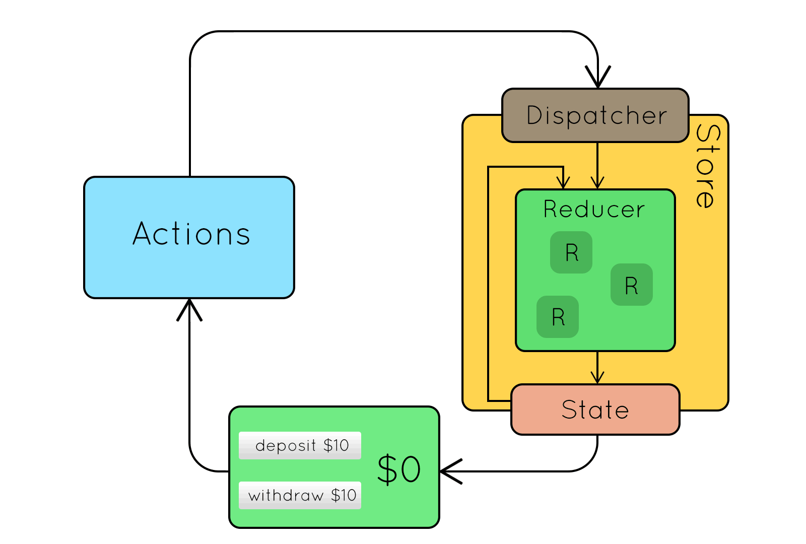
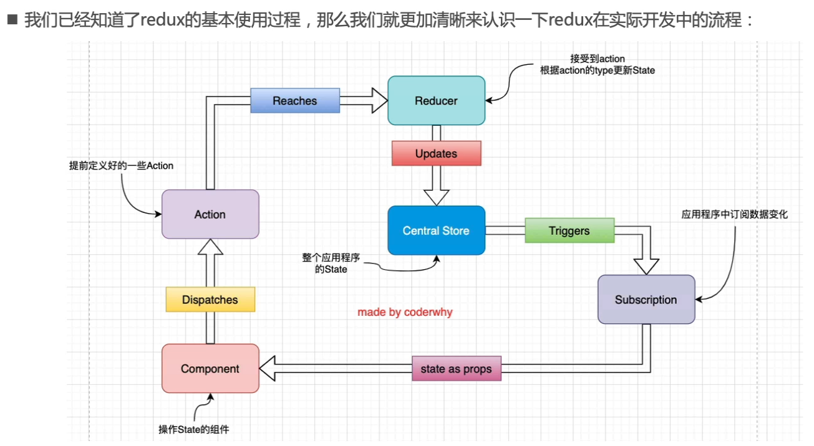
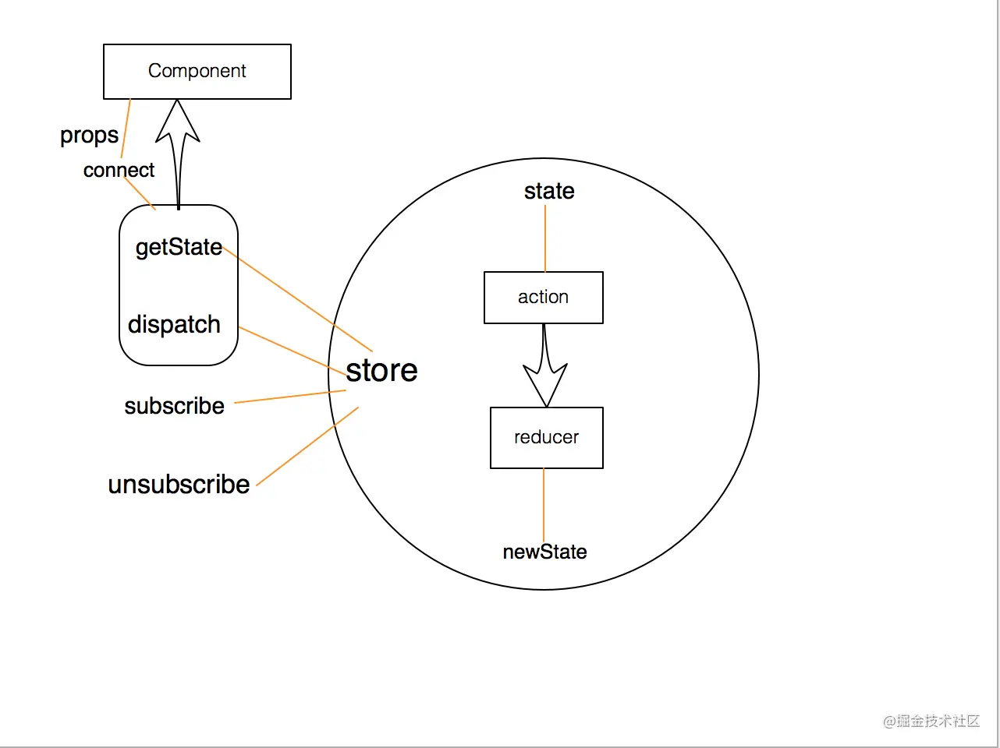
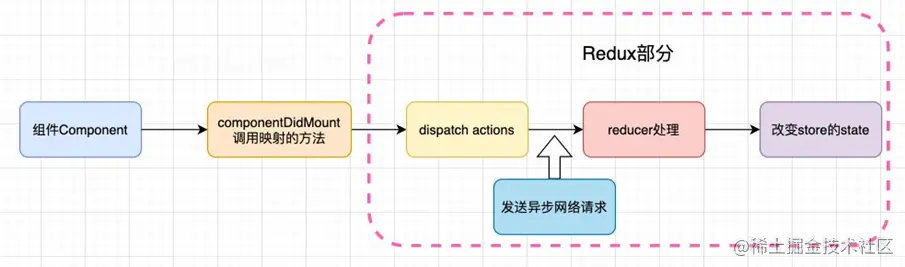
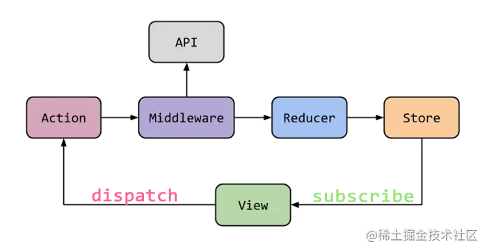
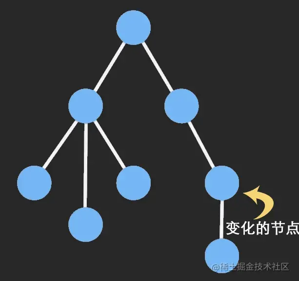

### 🍊 组件间的通信方式（8种）

父组件 => 子组件：

1. Props
2. Refs

子组件 => 父组件：

1. Callback Function
2. Event Bubbling 事件冒泡

兄弟组件之间：

1. Parent Component：共同祖先

不太相关的组件之间：

1. Context
4. 观察者模式 Event Bus
5. Redux 等


**（1）props + Callback Function**

1. 【父组件】给【子组件】传递数据：通过 `props` 传递
2. 【子组件】给【父组件】传递数据：通过 `props` 传递，要求父子组件给子传递一个回调函数，子组件通过调用这个函数，把数据传递给父组件。
   - 在函数组件中的 hooks，useState 创建的 `setCount()` ，传递给子组件。

需要使用 shallowEqual 优化，防止子组件频繁渲染：

- 函数组件，memo 包裹子组件 + useMemo 值 + useCallback 函数；
- 类组件，PureComponent 继承。


**（2）Refs**

父组件通过 `refs` 直接调用子组件实例

- [useImperativeHandle](https://www.ninjee.co/docs/frontEnd/React#useimperativehandle)：用于父组件调用子组件的属性/方法。子组件对外暴露 / 提供部分功能

- forwardRef：用于转发 ref。函数组件（有 props, ref 参数）传入 forwardRef，返回绑定好 ref 的新组件。

```jsx
const Father = () => {
  const sonRef = useRef();
  return (
    <div>
      <Son ref={sonRef} value="子组件内容" />
      <button onClick={() => sonRef.current.handle1()}>点击打印 sonRef</button>
    </div>
  );
};

const Son = forwardRef((props, ref) => {
  const input = useRef();
  useImperativeHandle( ref, () => {
    return {
      handle1: foo
    };
  }, []);

  const foo = () => {
    console.log("foo function!");
    console.log(input.current.value);
  };

  return (
    <div>
      <input type="text" defaultValue={props.value} ref={input} />
    </div>
  );
});

// 点父组件的 button 后，控制栏输出：foo function 子组件内容
```


**（3）Event Bubbling 事件冒泡**

利用原生 dom 元素的事件冒泡机制，父组件拿到子组件的 dom 元素。

```js
const Father = () => {
  return (<div
      onClick={(e) => console.log(e.target.previousSibling.value) }
    >
      <Son />
    </div>);
};

const Son = () => {
  return (<div>
      <input defaultValue="请输入内容..." />
      <button>Click</button>
    </div>);
};

// 点子组件的 button 后，控制栏输出：请输入内容...
```


**（4）context - provider**

-   缺点1：context 是一个全局变量，当组件庞大复杂的时候，全局命名空间会变得繁杂，变量的来源和去向不清楚。
-   缺点2：如果没有及时的在卸载组件时取消订阅，context 没有清空，造成内存泄露。

消息订阅与发布机制

1. 先订阅，再发布（理解：有一种隔空对话的感觉）
2. 适用于任意组件间通信
3. 要在类组件的 `componentWillUnmount` 中取消订阅

```jsx
// 【1】创建一个全局的上下文组件。
const ThemeContext = React.createContext("light");

// 【2】父，通过 ThemeContext.Provider包裹子组件，value 传递值。
class Father extends React.Component {
  render() {
    return (
      <ThemeContext.Provider value={{ name: "123" }}>
        <MidComponent />
      </ThemeContxt.Provider>
    );
  }
}

// 中间组件
function MidComponent() {
  return <div><ThemedButton /></div>;
}

//【3】孙，通过 contextType 声明要使用 context
class ThemedButton extends React.Component {
  static contextType = ThemeContext;
  render() {
    // 123
    return <div>{this.context.name}</div>;  
  }
}

//【4】孙，或者通过 Consumer，在 return 中直接拿到 value
class ThemedButton extends React.Component {
  render() {
    // 123
    return <ThemeContext.Consumer>{(value) => value.name}</ThemeContext.Consumer>
  }
}

//【5】函数组件用 useContext 拿到 value
function ThemedButton() {
  const value = React.useContext(ThemeContext);
  // 123
  return <div>{value.name}</div>;
}
```

**（5）Event Bus** 

- https://juejin.cn/post/7101481154565865486
- https://segmentfault.com/a/1190000023585646
- https://codesandbox.io/s/wizardly-wave-rrmw5v?file=/src/Context.jsx

**（6）redux**

使用 redux 管理组件间的数据，达到完全可控。


## React Router

### 🍊 redux 与 react-router 整合

**好处 / 特点：**

- 将 router 信息同步到 store 中，从 store 中获得。
- 通过redux 的 dispatch actions 导航
- 集成 Redux 可以支持在 Redux devtools 中路由改变的时间履行调试

**流程，涉及到 [🔗](https://juejin.cn/post/6844904175671705614#heading-9)：**

1. Redux 相关：
   - `<Provider />` 传入创建好的 store，提供 redux 能力。包裹 `<App />`，是一个 root reducer。

2. Router 相关：

   - 创建 `history` 对象，利用 `createBrowserHistory()` 创建。

   - 使用 `<connectRouter />`包裹 `<App />`， 返回绑定了 history 的 root reducer。
     - `routerMiddleware(history)` 中间件绑定 history 到 reducer，实现用 api 修改 store 中的路由。
     - 这里还涉及到 thunk、store 等知识，间上面的链接。

```tsx
import * as createHistory from 'history'
const history = createHistory.createBrowserHistory()

render(
  <Provider store={store}>
    <ConnectedRouter history={history}>
      <App />
    </ConnectedRouter>
  </Provider>,
  document.getElementById('app')
)
```


### 🍊 React Router 流程

```js
import ReactDOM from 'react-dom';
import Home from './page/Home'
import About from './page/About'
import Me from './page/Me'
import { BrowserRouter, Link, Switch, Route } from 'react-router-dom'

ReactDOM.render(
  <BrowserRouter>
    <nav>
      <ul>
        <li><Link to="/home" >Home</Link></li>
        <li><Link to="/about" >About</Link></li>
        <li><Link to="/me" >Me</Link></li>
        <li><Link to="/other" >other</Link></li>
        <li><Redirect to="/login" /></li>
      </ul>
    </nav>
    <Switch>
      <Route path="/home" component={Home}></Route>
      <Route path="/about" component={About}></Route>
      <Route path="/me" component={Me}></Route>
      <Redirect from='/aboutMe' to='/Me'/></Redirect>
    </Switch>
  </BrowserRouter>,
  document.getElementById('root')
);
```

**当地址栏改变 url，组件的更新渲染都经历了什么？**

拿 history 模式做参考。

1. **`ConnectedRouter` 组件**。
   - 当 url 改变，随之 history 对象改变，触发事件监听 `popstate` ，触发回调 `handlePopState`；
     - hash 模式就是触发 `hashChange` 事件。
   - 触发 history 对象的 `setstate()`，产生新的 `location` 对象，保存当前 URL 信息。
2. **`Router` 组件。** 通过 **Provider context** 把 `hisotry`、`history.location`、`match` 传递下去。
3. **`switch` 组件**。通过 Consumer context 拿到 URL，匹配符合的 `Route` 组件。
4. **`Route` 组件**。渲染对应组件，同时通过 Consumer context，把 `hisotry`、`history.location`、`match` 通过 props 传递下去，让业务组件可以获得路有关信息。


**主动 `history.push()` 来切换路由，组件的更新渲染经历了什么？**

1. 生成最新 `location` 对象；
2. 通过 `window.history.pushState()` 改变当前浏览器的 URL (路由)；
3. **`ConnectedRouter` 组件**。**主动触发** `history.setState()`，传递新的 Location 对象，更新 URL 信息。
4. 和上面第二步一样了。


**路由组件的 props**

传递 props 和 **很多路由相关信息** 给路由组件，子路由组件的 `this.props` 有：

```jsx
// this.props 中的三大属性：
history:			// 对URL进行操作
    go: ƒ go(n)
    goBack: ƒ goBack()
    goForward: ƒ goForward()
    push: ƒ push(path, state)
    replace: ƒ replace(path, state)

location:
    pathname: "/about"  // 当前URL信息
    search: ""
    state: undefined

match: 
	params: {}  // URL中的参数
    path: "/about"
    url: "/about"
```


### 🍊 文件结构 / 启动流程：

public ---- 静态资源文件夹

​			favicon.icon ------ 网站页签图标

​            index.html -------- 主页面，项目只有一个 `.html` 文件，SPA（single page app）单页面应用。

src ---- 源码文件夹

​            App.js --------- App 组件，项目只有一个父组件，放到 `<div id="root"></div>` 中，其余自己添加的组件，都放到 App 组件中。 

​            index.js ------- 入口文件，引入 react 核心库、react-dom 核心库、App 组件等必要的资源。

​		    ...... 

**启动流程：**

1. 在 `src` 下 `index.js`:
   - 引入 react 核心库 (React.Element)；
   - 引入 react-dom 核心库 (render)；
   - 引入 redux、router 等中间件。
   - 引入 index CSS 样式；
   - 引入根组件 App ；
   - 触发 `ReactDOM.render()` 渲染 App 组件；
     - 引入 App 组件时，就会把相应的 CSS、JS 代码全部引入。
2. 在 `index.js` 文件执行后，React 通过 webpack 的配置文件，找到 `public` 下的 `index.html`：
   - 依次执行 `index.html` 中的程序，
3. 最终，渲染出 `index.html` 的页面。


### 🍊 链接如何跳转

**链接的跳转是依靠 BOM 中 window.history 实现的。**

通过 `history.js` 库，简单介绍一下基本的实现原理：

1. 提前准备工作：`let history = History.createBrowserHistory()`。通过 `history.js` 库，创建一个比直接调用 BOM 更方便的方式，来修改 BOM 中的 `window.history` 属性。
2. 当用户点击 `a` 标签，触发了 `onClick` 回调函数：
   1. 使用 `history.push()` 往历史记录中添加一个地址。
   2. 使用 `return false` 阻止浏览器的自动跳转行为；
3. 在函数 `history.listen(location = > { console.log("请求路由路径变化了", location)})` 的监听中，我们就可以通过 `location` 参数获得变化的路径，然后根据不同的路径再展示不同的组件到页面。


### 🍊 SPA 定义

1. 单页Web应用（single page web application，SPA）。
2. 整个应用只有 **一个完整的页面**。
3. 点击页面中的链接 **不会刷新** 页面，只会做页面的 **局部更新。**
4. 数据都需要通过 ajax 请求获取, 并在前端异步展现。


路由的定义：一个路由就是一个映射关系 (key / value)：

- key 是一个路径，如`"/serch/users"`；
- value 可能是 function（后端） 或 component（前端）。


### 🍊 BrowserHistory 和 HashHistory 的区别

BrowserHistory 是 H5 推出的 `history` 身上的 API，兼容性问题；

HashHistory 是利用 hash值（锚点跳转），兼容性更强， `#` 锚点后的信息被当做前端内容，不会回传给后端服务器。

- 进一步的，后端需要处理 `index.html` 地址的响应即可，而 Browser 还需要后端对子页面 URL 访问做出响应。

```jsx
// BrowserHistory的地址:
127.0.0.1:5500/index.html/test1

// HashHistory的地址，多了一个'#'，锚点的标记
127.0.0.1:5500/index.html#/test1
```


### 🍊 NavLink 和 Link 组件有什么不同？

Link 替换了 HTML 中的 `a` 标签，是 Route 中实现跳转功能的导航区。

NavLink 组件比 Link 组件多了添加样式功能，可以在用户点击某个 NavLink 后，为这个标签添加类名：

```js
<NavLink activeClassName="blue" className="list-group-item" to="/about">About</Link>
<NavLink activeClassName="blue" className="list-group-item" to="/home">Home</Link>
<NavLink activeClassName="blue" className="list-group-item" to="/head">Header</Link>
<NavLink activeClassName="blue" className="list-group-item" to="/foot">Footer</Link>
```

- 当该链接被激活时，就会把 `activeClassName` 的属性值添加为类名。如果不设置 `activeClassName` 属性，就会默认添加类名  `active` 。


### 🍊 路由的模糊匹配与严格匹配

**1 模糊匹配**

如果地址栏输入以下两个链接：

- /about
- /home

如果我们尝试跳转：`<Route path="/home/a/b" component={Home} />`，根据模糊匹配原则，虽然没有 `/a/b` 的地址，但是先匹配 `/home`，发现一致，则匹配成功，展示 Home 组件。


我们希望当用户输入默认网址时，才会展示 Home 组件。这就需要对主页地址 `/` 设置 exact。在设置了精确匹配后，之后地址栏输入完全一致的主页地址，才会展示 Home 组件。

- 如果不设置 `exact`，地址 `/about` 会首先匹配到 `path="/"`，也会展示 Home。如果用 switch，在 `<Switch>` 中只要匹配一次成功，就会停止匹配。所以不论地址输入哪一个网页，都会匹配到 Home 组件。


**2 严格匹配**

```jsx
// 开启严格匹配
<Route exact={true} path="/home" component={Home} />
// 或
<Route exact path="/home" component={Home} />
```

当我们注册路由时，`exact` 属性置为 true，就会开启精准匹配。必须所有地址完全一致，才可以匹配成功。

- 如果不主动设置属性为 `true`，则默认是 `true`。

一般情况下不会开启严格匹配。严格匹配的开启，可能会导致二级路由匹配失败的问题。


# 7 redux

## 7.1 基础

### 7.1.1 为什么要用 Redux

JavaScript 开发的应用程序，已经变得越来越复杂了：

- 需要管理的状态更复杂；
- 服务器返回的数据、缓存中读取的数据、用户点击按钮 / 表单提交等生成的数据、UI 状态的数据。

所以，管理不断变化的 state 是非常困难的：

- 状态之间相互会存在依赖，一个变化通常会引起另一个变化；
- 我们想更好的追踪和控制 state 发生的变化：
  - 发生变化的时机、原因、结果。

然而，React 只是在视图层帮助我们解决了 DOM 的渲染过程，State 依然是我们自己来管理：

- 组件自定义 state、通过 props 在组件之间进行通信、通过在父组件存放数据进行子组件数据共享；

综上，Redux 就是一个帮助我们集中管理 state 的容器：

- Redux 是 JavaScript 的状态容器，提供了 **可预测** 的状态管理。
  - 发生变化的时机、原因、结果，都可以控制和追踪。
- Redux 体积非常小，且不仅在 React，在其他两个框架也能使用。


## 7.1.2 基本结构：

### index.js (store)

对外的入口，共 4 行：引入 redux、引入 reducer、创建 store、导出 store。

store：存储数据 state，提供派发方法 dispatch


### reducer.js

数据集中处理函数

- 纯函数，因为 state 是只读的，只能通过 dispatch 派发去修改。
- 将 state 和 action 结合起来生成一个新的 state


### actionCreators.js (action)

定义更新数据的具体方式。是函数的集合。

有两种 action：

- 同步 action：返回的是一个对象，包含了 actionType 和 value，提供送给 reducer 对 state 进行操作。
- 异步 action：返回的是一个函数，在这个函数中可以异步从网络获取资源。当获取到资源后，再调用同步 action，去更新 state。


### constant.js

保存 action 操作的 **所有类型名 type**，方便查阅和修改。







## 7.3 Redux 流程

当我们要对某个 Component 组件的 state 进行修改时，会发生如下流程：

1. **Central Store**。
   - 从 Central Store 出发，redux 中只会定义一个 store 用来存储整个项目中的数据。

2. **Subscription**。 
   - 在这个 Component 的 `componentDidMount()` 组件加载完毕的回调中，添加 `store.subscribe()`  订阅。也就是一旦 store 中的数据发生变化，就会调用这个监听函数。
   
   - 当用户发生对数据修改的行为（点击按钮、输入表单等等），就会触发 `Dispatches`，Store 中的数据就会发生改变，进而我们设定的 subscribe 订阅监听就会被触发。
   - 在 Subscription 中添加 `this.setState()` ，把 store 中变化的数据，更新到这个 Component 组件中的 state 。
   - 此时 React 会更新组件的 state，并触发 `render()` 去重新渲染页面，呈现新数据。
   
3. **Component**。
   - 通过在组件的 `componentDidMount()` 中订阅  `this.setState()` ，就会让这个组件自身的 state 随着 store 中的 state 变化而保持最新。也就是说，store 中会保存全部需要共享的数据，组件会额外的保存一份 store 中自己需要的数据。

   - 同时在组件中的 `button` 按钮定义触发事件，一旦触发，就使用 Dispatches 派发 Action，去更新 store 中的数据。

4. **Action**。
   - Actions，是提前定义好的多种对数据的操作方法。
   - 在这里定义 Dispatch 派发时， 同时指定要执行的 action 名称以及传入对应的操作参数。

5. **Reducer**。
   - Redux 通过 Reducer 把数据修改。 
   - reducer 收到需要操作的 state 和 操作方法 action，根据 `action.type` ，对数据进行操作。最后返回一个新的 state。
   - Redux 会把这个 state 更新到自己的 store 中。

6. 进入一个新的循环，一旦 store 发生改变就会被订阅到，然后调用 `this.setState()` 同步更新组件的 state，最后


## 7.4 react-redux

利用 react-redux 实现了将 redux 进入 react。

-   在 react hook 中，使用 `useSelector` 获取 redux 中想要的 state，同时设定了监听。一旦 state 发生更新，就会更新所有使用了 `useSelector`  获取该值的组件。
    -   注意：state 只要有一个值发生更新，就会导致所有 useSeleoctor 更新。解决，使用 `shallowEqual`。




利用：发布订阅结构，subscribe 和 unsubscribe。


## 7.5 中间件 — 组件中的异步操作



把对网络请求的发送，获取网络资源，放到 redux 中。也就是利用 异步 action 获取网络资源。

**使用中间件 (Middleware)**

- 这个**中间件的目的是在`dispatch`的`action`和最终达到的`reducer`之间，扩展一些自己的代码**
- 比如日志记录、**异步网络请求**、添加代码调试功能等等



####  `redux-thunk` 是如何做到让我们可以发送异步的请求呢？

- 默认情况下的`dispatch(action)`，`action` 需要是一个 `JavaScript` 的对象
- `redux-thunk` 让 `dispatch(action())` 中的 `action()` 原本是返回一个值，现在可以 **返回一个函数**
- 该函数会被调用，并且会 **自动的** 传给这个函数两个参数：`dispatch` 方法 +  `getState` 方法。
  - 这使得这个函数内部可以使用 `dispatch` 更新数据、使用 `getState` 获取数据
    - `dispatch` 方法：用于我们之后再次派发 `action`；
    - `getState` 方法：考虑到我们之后的一些操作需要依赖原来的状态，用于让我们可以获取之前的一些数据；


## combinReducers  拆分 reducer

如果项目对数据的操作：

1. 条目非常多，可能有上千行，reducer 非常长；
2. 对数据的操作有明显的类别，如异步网络申请数据、本地数据、不同的组件数据等。

# 8 单向数据流

有三个理解：

1. React 官网中有提到单向数据流：
   - 只的就是通过 props 进行数据传递。一个项目中，组件是按以树的结构组织起来的。上层的组件可以通过  props 向下层组件传递数据。也就是父组件可以单向的向子组件传递数据。
2. Vue 和 React 中，每个组件内部也有一个单向数据流：
   - 一个组件从功能的实现上看，有三个模块：
     1. UI，组件最终展示的数据和界面；
     2. action，对组件中数据的操作方式，比如增删改等操作；
     3. State，组件数据保存的地方，组件的状态。
   - 所以，在 UI、action、State 之间也是按照单向数据流传递的：
     - 在 UI 页面中，用户通过交货产生了对数据的操作，触发 action；
     - React 接收到特定的 action 操作，进而对组件的 State 进行修改；
     - 组件的 State 一旦发生变化，就会触发 `render()` 重新渲染 UI ，页面发生变化。
3. Redux 中，对数据的操作也是一个单项数据流：
   - 一个 Store 从对数据的操作来看，有 3 个模块：
     1. UI，组件最终展示的数据和界面；
     2. Dispatch，组件中对数据的操作方式，比如增删改等操作；
     3. Store，组件中保存数据的地方。
        - Reducer，Store 中保存对数据操作的地方。Dispatch 触发 Reducer ，完成对数据的操作。
        - State，Store 中保存数据的地方。
     4. 所以，数据在UI、Dispatch、Store（Reducer、State）中也是一个单项数据流：
        - 用户通过 UI 界面触发事件，引发 Dispatch 派发申请对数据进行操作；
        - Dispatch 调用 Store 中的 Reducer，通过携带的 action 识别 Reducer 中对应的操作。然后修改数据；
        - 修改后的数据会更新 Store 中的 State。
        - 数据更新完毕后，会通知 React 组件，最终 `render()` 重新渲染 UI 界面。


## redux-immutable 性能优化

#### 问题：

数据应当具有不可变性，reducer 应当是一个纯函数，不能修改数据。

recommend 组件中，有非常多的数据：

排行榜、歌手列表、歌曲列表、歌单列表等等

现在的代码中，一旦发生数据更新，recommend 中所有的 state 数据都要浅拷贝一份，然后创建好一个新的 state，这样非常影响性能。

- reducer 是一个纯函数：

  ```jsx
  function reducer(state = defaultState, action) {
    switch (action.type) {
      case actionTypes.CHANGE_TOP_BANNERS:
        return { ...state, topBanners: action.topBanners };
      default:
        return state;
    }
  }
  ```

#### 解决：

既能 **保持数据不可变性**，又能 **节省内存，不要整个拷贝** 。

引入一个新的库解决 —— **ImmutableJS**

- ImmutableJS 对象的特点是，只要修改了对象，就会返回一个新的对象，旧的对象不会改变。
- ImmutableJS  使用了 Persistent Data Structure（持久化数据结构，或一致性数据结构）
  - 这是一种保存数据的数据结构
  - 当数据被修改时，会返回一个对象，但是返回的这个新对象会 **尽可能** 利用之前的数据结构，尽可能的节省内存。

一张图模拟这个过程：



- `const im = Immutable`：创建 Immutable 
- `Map()`、`List()`：创建映射、创建列表。
  - `Map()` 只是浅层转化，如果成员仍然是一个对象，这个成员是一个普通对象。
- `im.fromJS(obj)`：深层转化。如果有多层嵌套的对象，使用这个方法可以把内部嵌套的对象都转化为一个 immutable 对象。
- `get()` ：获取数据
- `set()` ：修改数据
- `state.getIn(["recommend", "topBanners"])` ：向内层获取数据，传入的是可迭代的对象。
  - 这段代码的意思是：`state` 是一个 `immutable` 对象，获取它成员 `recommend` 的数据；然后这个 `recommend` 也是一个 `immutable` 对象，继续获取它的成员 `topBanners` 的数据。
  - 相当于：`state.get("recommend").("topBanners")`

- `redux-immutable` 中的 `combineReducers` 可以实现 `immutable` 和 `redux` 的 `combineReducers` 融合。


-   `useSelector`：获取 state 中该组件需要的值。一旦 redux 中的值发生变化，就会调用 useSelector 导致所有组件全部重新渲染。
-   `shallowEqual`：会对比更新后的 state 中，当前组件使用的值，是否发生了变化。如果新的 state 中，使用的值和原有 state 中的值相同，就不会引起该组件的重新 render。这个比较是浅对比。

```js
// ---- 性能优化
// ---- connect的mapStateToProps会把state和组件形成依赖，进而如果依赖的数据没有改变，这个组件也不会被重新渲染，节约开销
// ---- 但是使用useSelector如果只传入第一个参数，就不会有这种浅对比，只要有state发生变化，就会重新渲染组件。
// ---- useSelector使用的是“===”来比较，但是每次返回的有state的对象，都是新创建的，所以一定不相等，一定会重新渲染。
// ---- 解决方案：shallowEqual的引入
// ---- 直接传入 shallowEqual 为第二个参数即可。
// ---- 理论上，只要使用 useSelector，就需要传入 shallowEqual，除非希望一旦state变化，组件要重新渲染的时候不传入。
```


## ==== 新旧对比 ==

React 15 的生命周期删除了什么，为什么删除？

React 16 的异步中断可更新解决了什么问题，之前的更新机制是什么样的？
