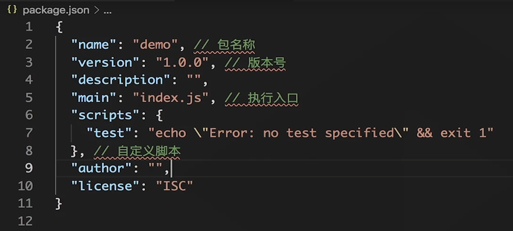
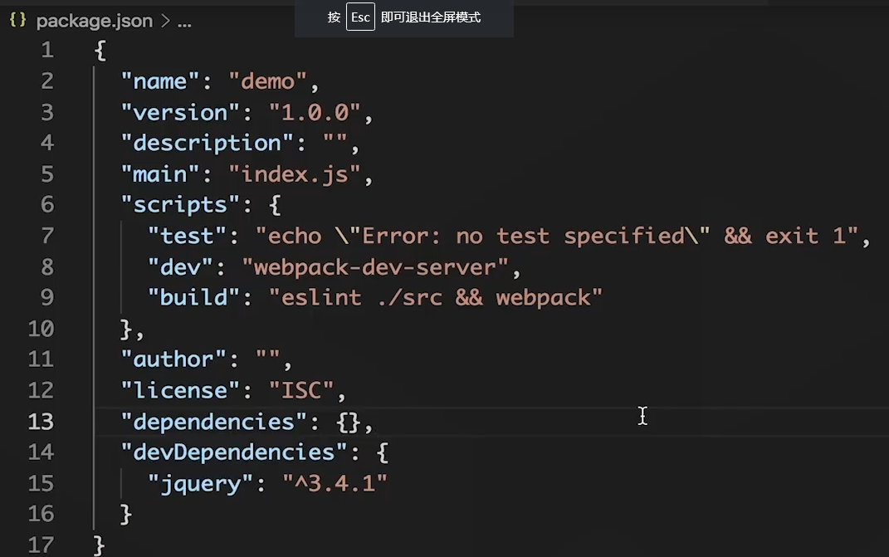
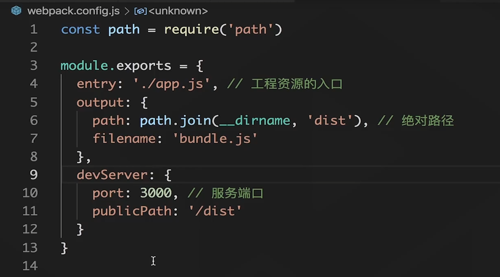
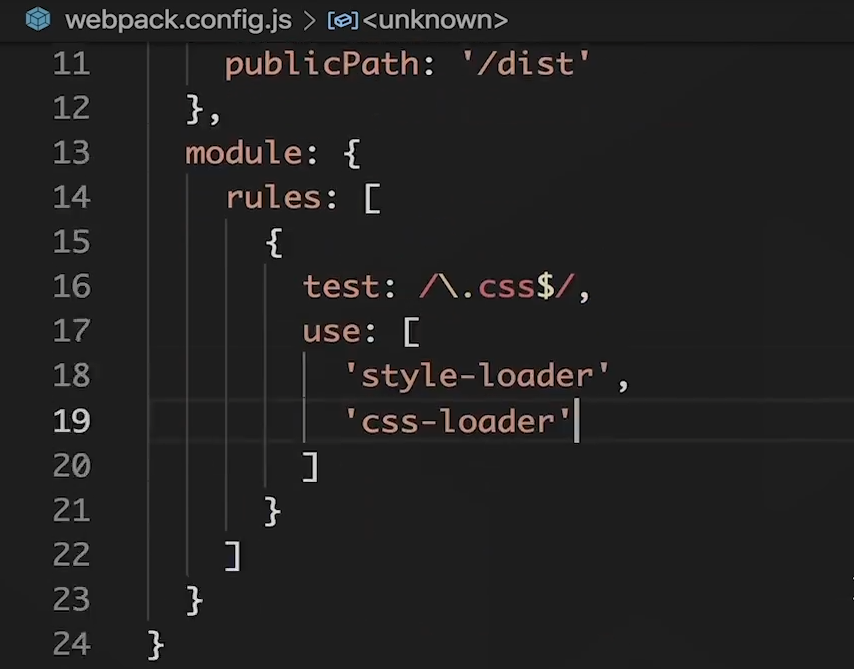
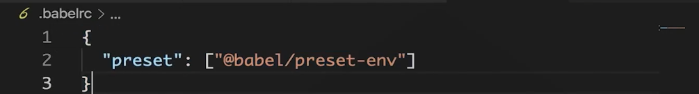
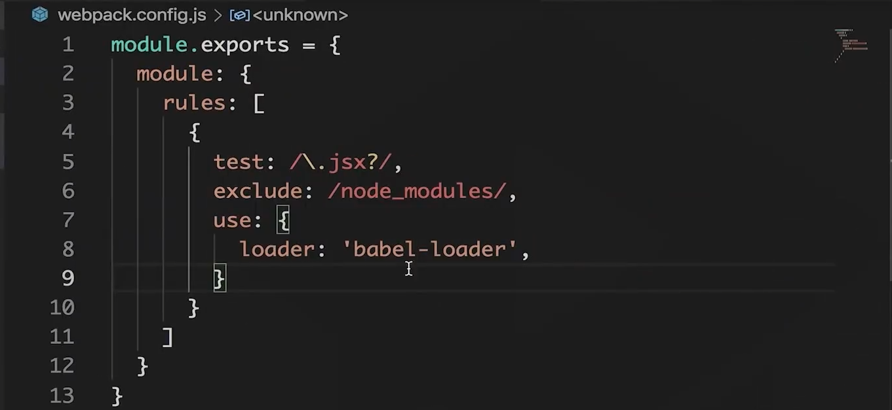
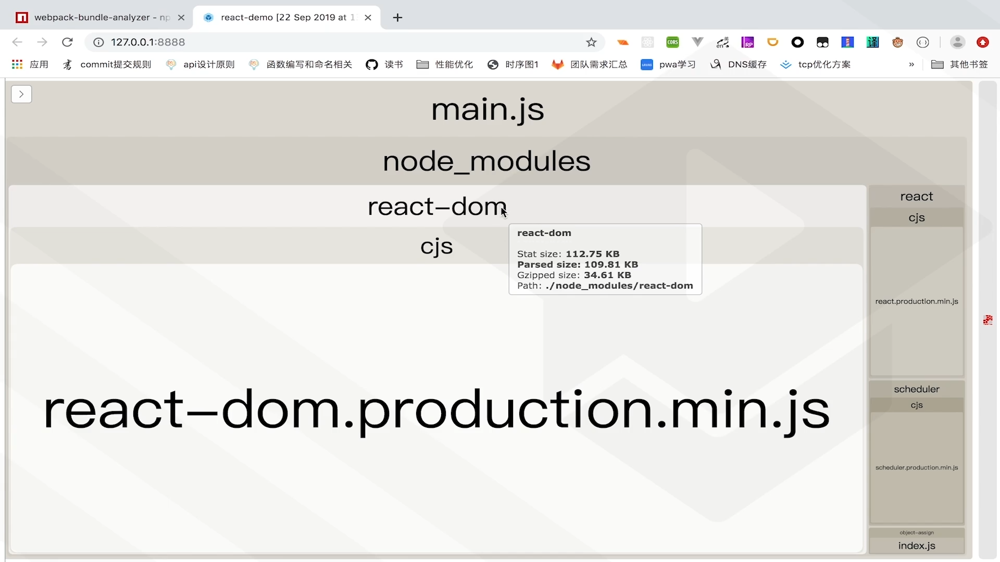

# Part Ⅲ Webpack

## 1. 定义

[Webpack 官网](webpackjs.com./api/)

[掘金 - 分析 webpack 原理](https://juejin.cn/post/7023242274876162084)

放到了最下面


### 1.2 webpack 产生的背景

首先，为什么打包？因为：

1. 各个依赖文件的关系难以梳理，耦合程度较高，代码难以维护。
2. 把所有依赖包都打包成为一个js文件（bundle.js）文件，会有效降低文件请求次数，一定程度提升性能。
3. 逻辑多、文件多，项目复杂度提高

为什么要用webpack？因为：

1. webpack 除提供上述功能外，还充当了“翻译官”的角色，例如将 TS、ES6 翻译为低版本的语法，将less、sass 翻译为 css 等功能。
2. 强大而灵活，plugin 可插拔，按需加载。


重点：

1. 理解前端模块化，各种模块化方式是如何实现的；
2. 理解 Webpack 打包的核心思路；
3. 理解 Webpack 中的 ‘关键人物’；


### 1.3 前端模块化

早起模块化的实现方法：

不同的 module（moduleA.js， moduleB.js，moduleC.js） 会放在不同的 js 文件中。但是如果把所有的 js 文件通过 `script` 标签引入同一个 HTML 文件中时，这些 js 文件都会绑定到全局作用域中。这就导致了如果在不同的 js 文件中不小心使用了相同的变量名，就会发生命名冲突和值的覆盖。

为了避免这种命名空间的冲突，会采用模块化封装，下面是一个早期的封装方式，采用立即执行函数 IIFE 和 闭包实现：

```js
// 定义模块内的模块作用域
(function(window){
    var name = "susan"
    var sex = "female"
    functioon tell(){
        console.log("im ", this.name)
    }
    window.susanModule = {tell}
})(window)
```

最终这个 susanModule 绑定在了 window 全局对象中，在 node 环境中是 global 对象。

封装的好处就是，该暴露的数值可以暴露，想隐藏的数值也隐藏。

- 这里的例子中 name  和 sex 的变量就变得无法修改，而只能通过 tell function 去访问，达到了对数据的封装，提升安全性。


#### 模块化的优点

- 模块化的封装（该暴露的暴露，该隐藏的隐藏）
- 重用性（不同的网页可以通用相同的模块）
- 解除耦合（不同的模块之间不会相互关联影响）


### 1.4 模块化方案进化史

随着模块化优势体现，开发者更倾向于使用模块化协同开发项目，于是在发展过程中形成了很多规范：AMD、COMMONJS、ES6 MODULE


#### 1.4.1 AMD

Asynchronous Module Definition（异步模块定义）
定义最早，目前很少使用。

```js
// 求和模块，参数依次是：当前模块名、依赖的模块、模块内容
define("getSum", ["math"], function(math){
	return function (a,b){
    	log("sum:"+ math.sum(a, b))
    }
})
```

#### 1.4.2 COMMONJS

2009年出的规范，原本是为服务端的规范，后来 nodejs 采用 commonjs 模块化规范

- 模块必须显示的引入

```js
// 通过require函数来引用
const math = require("./math");

// 通过exports将其导出
exports.getSum = function(a,b){
	return a + b;
}
```


#### 1.4.3 ES6 MODULE

目前使用最多的便是这个，JavaScript 提供了原生支持的模块打包方式，使用 `import` 和 `export`。

```js
// 通过import函数来引用
import math from "./math";

// 通过export将其导出
export function sum(a, b){
	return a + b;
}
```


### 1.5 Webpack 的打包机制

根据 `import` 引入等关键字，将依赖文件打包成一个文件。


#### 1.5.1 输出文件

输出文件的大体结构：

```js
(function(module) {
	var installedModules = {};
    function __webpack_require__(moduleId){
    	// SOME CODE
    }
    // 。。。
    return __webpack_require__(0); // entry file
})([ /* modules array */])
```

上述结构中的核心方法：

```js
function __webpack_require__(moduleId){
	// check if module is in cache
    if(installedModules[moduleId]){
    	return installedModules[moduleId].exports;
    }
    // create a new module (and put into cache)
    var module = installedModules[moduleId] = {
    	i: moduleId,
        l: false,
        exports: {}
    };
    // exe the module func
    modules[moduleId].call{
    	module.exports,
        module,
        module.exports,
        __webpack_require__
    };
    // flag the module as loaded
    module.l = true;
    // return the exxports of the module
    return module.exports;
}
```

#### 1.5.2 Webpack打包过程

1. 从入口文件开始，分析整个应用的依赖树
2. 将每个依赖模块包装起来，放到一个数组中等待调用
3. 实现模块加载的方法，并把它放到模块执行的环境中，确保模块间可以互相调用
4. 把执行入口文件的逻辑放在一个函数表达式中，并立即执行这个函数


## 2. 配置开发环境 -- npm、包管理器

-  创建一个工程：`npm init`
-  也可以使用 `npm init -y`，直接生成了一个默认配置的 `package.json`，不需要一路回车。

分析：`package.json` 版本信息文件



- 运行自定义命令：`npm run test`，就可以运行 `test` 后面命令的值，类似一个快捷键。这里就执行了后面的 `echo..` 这个命令。


安装时的命令：

- `npm config set registry https://registry.npm.taobao.org` 下载包的地址调整为淘宝镜像
- `npm install loadash --save`
  - `--save`，npm5xx 以上可省略。下载好包后，还会把这个包放到 `package.json` 的 `dependencies` 字段下保存：`"loadash: "^1.0.0`。
  - `--save-dev`，指定当前环境是开发环境。会把这个包放到 `package.json` 的 `devDependencies` 字段下保存：`"loadash: "^1.0.0`。
  - `--only=prod`，`--only=dev` 指定这个包安装在生产环境下 / 开发环境下。如果不指定，则默认会安装在 `node_modules` 中。在较大的工程项目中会实现环境区分， 比如只安装 `dependencies` 提升安装速度。
- `npm` 安装 `webpack-cli`，`webpack-dev-server`。
  - 事实上，在 `node_modules` 中项目已经装好了这些依赖，不需要在重新 `npm` 安装后才能运行 `webpack-dev-server` ，可以直接：`./node_modules/.bin/webpack-dev-server` 运行该依赖。




主要有两种依赖：

1. `dependencies` 生产环境下的依赖。通常项目迁移到别处时，重现安装依赖会默认 `dependencies` 中的依赖，这里放和项目习惯的功能模块。
2. `devDependencies`  开发环境下的依赖。 通常反正构建工具、质量检测工具。


语义化版本：

在 `dependencies` 和 `devDependencies`  中的依赖，可以使用语义化版本号。重新安装依赖 `npm install` 后，会实现自动更新小版本或中版本，在不该动大版本的情况下，不需要用户手动修改版本号，就可以尽可能的使最新的版本。

- `^version`：会自动更新中版本和小版本；
  - `^1.0.1`  ==> `1.x.x`
- `~version`：会自动更新小版本；
  - `~1.0.1` ===> `1.0.x`
- `version`：不更新，只安装规定的版本。


`package.json` 中的 `"scripts"` 字段

```json
"scripts" : {
    "test": "echo \"Error: no test specifed\" && exit 1",
    "dev" : 
}
```

`dev`：运行 `npm run dev` 可以原地启动一个 webpack 开发服务器。

`build`：运行 `npm run build` 可以对代码格式做校验，对文件进行打包。


`npm install` 的过程：

1. 寻找包版本信息文件 (package.json)，依照它来进行安装；
2. 查找 `package.json` 中的依赖，并检查项目中其他的版本信息文件；
3. 如果发现了新包，就更新版本信息文件； 


#### 问题一：执行 `npm install xxx -???`

| npm install xxx + | [不写]   /  -s  /  --save     | -d  /  --save-dev             | -g  /  --global            |
| ----------------- | ----------------------------- | ----------------------------- | -------------------------- |
| 安装方式          | 项目默认安装                  | 项目默认安装                  | 操作系统全局安装           |
| 安装位置          | node_modules 文件夹下         | node_modules 文件夹下         | AppDataAppData\Roaming\npm |
| 模块引入          | dependencies 字段下           | devDependencies 字段下        | dependencies 字段下        |
| 使用              | `./node_modules/.bin/webpack` | `./node_modules/.bin/webpack` | `webpack` 直接启动         |
|                   |                               |                               |                            |


#### 问题二：webpack 各文件的作用？

| 文件名                |                                                     |      |
| --------------------- | --------------------------------------------------- | ---- |
| `node_modules` 文件夹 | 项目引入的模块都放置在这里                          |      |
| `dist` 文件夹         | 打包成功后，文件会放置在这里                        |      |
| `dist/index.html`     | 打包后，html 入口文件                               |      |
| `dist/main.js`        | 打包后，js 文件                                     |      |
|                       |                                                     |      |
| `src` 文件夹          | 编写的代码文件都放置在这里                          |      |
| `src/App.jsx`         | React 包裹在最外层的组件                            |      |
| `src/index.jsx`       | React 接入 html 的入口文件                          |      |
| `src/index.html`      | html 入口文件                                       |      |
|                       |                                                     |      |
| `package.json`        | 默认的配置文件                                      |      |
| `package-lock.json`   |                                                     |      |
| `webpack.config.js`   | webpack 额外的配置文件，通常在这里调整 webpack 设置 |      |
| `.babelrc`            | 调整 babel 的设置文件                               |      |
|                       |                                                     |      |


## 3. Webpack 核心特性

### 3.1 安装和入口

入口文件： `src/index.js` 当运行 `webpack ` 进行打包后，会把 `index` 入口文件中引入的全部模块打包起来，放到 `dist/main.js` 中。

如果想修改入口文件，就需要自定义配置，通常会在根目录一个定义文件 `webpack.config.js` 来修改和定义配置：



- `entry` ：工程资源的入口，俗称入口文件，可以理解为依赖树的根，可以有多个入口，每个入口都会有一个对应的打包结果： `./app.js`。
- `output` ：打包结果，俗称出口文件：`dist/bundule.js`。
  - `path` ：必须是绝对路径，所以这里用到了 `path.join()` 校验地址；
  - `filename`：打包结果的文件名。


`webpack-dev-server`：监听工程文件的改动，可以自动打包文件，刷新浏览器。

- `port`，修改默认的服务器地址，：`localhost:8080`


### 3.2 loader - 文件加载器

`loader` 是一个文件维度的操作，通常文件的操作的包，就需要用 loader 加载。比如后面会讲到的 babel 就需要通过 loader 加载。


接着上文的 webpack.config.js 文件



可以让 webpack 打包和引入 css、less、scss、png 等各种模块；

`npm install css-loader --save-dev`，安装可以引入 css 的 loader。

在 `webpack.config.js` 使用 `loader`。

- `module` 下的 `rules` 中配置。
  - `test`：`.css` 处理 `.css` 文件。
  - `use`：这个文件需要被哪些 loader 来处理；
    - `style-loader`：自动生成一个样式 style 标签，加载该样式；
    - `css-loader`：让  js 可以解析  `import sytle.css`  这个代码；

**注意，loader 的实际配置顺序是从下往上的，和书写的方式相反。**

- 所以我们想优先加载的配置，要放在末尾。这里的顺序是固定的，即，先加载 `css-loader` 再加载 `style-loader`。

生效后，可以解析 js 代码中的 `import sytle.css` 这类文件了。


### 3.3 plugins - 插件

节点维度的处理。

`plugin` 通过事件监听机制，改变文件打包后的输出结果。

- 比如，对资源进行压缩处理，让文件更快的从服务端传递给浏览器。从代码中去掉不需要的内容，如注释、换行、空格等等，减小整体体积。


安装一个压缩的 plugin：`npm install uglifyjs-webpack-plugin --save-dev`

安装后，就可以在 `webpack.config.js` 的 `plugin` 中引入并生效：

1. 在文件的开头需要引入这个库：`const UglifyJSPlugin = require('uglifyjs-webpack-plugin')` 
2. 在 `plugin` 字段中创建并引入这个库：


## 4. webpack 构建工程

### 4.1 构建

模拟一个 `react` 项目的构建过程：

- `npm install react react-dom`
- 安装 webpack 依赖，webpack 和 webpack 的命令行 cil工具。
  - `npm install webpack webpack-cli -d`
    - development 开发环境下安装，是 `--save-dev` 的简写。模块会写入到 `devDependencies ` 字段下，安装在项目的 `node_modules` 中。需要输入 `./node_modules/.bin/webpack` 命令使用 webpack。
  - `npm install webpack webpack-cli -g`
    - 安装在电脑操作系统的全局中，可以输入 `webpack` 命令直接启动。一般会安装到AppDataAppData\Roaming\npm目录下
  - `npm install webpack webpack-cli`
    - 默认，在生产环境下安装


### 4.2 babel

`babel` 可以把 ES6、Jsx 等形式的 js 文件，转化为 ES5 版本的 js 文件。通常使用 loader 引入。

相关的常用库有 (5)：

- `@babel/core`、`@babel/cil`、`@babel/preset-env`、`@babel/preset-react`、`babel-loader`


- `npm install @babel/core @babel/cil -g`

  - 安装 babel 的核心库 core 和命令行 cil 工具。

- `npm install @babel/preset-env @babel/preset-react` 

  - 安装 babel 的转换规则，这个包可以把高版本的 JS 代码转换为 低版本的 ES5；

  - `preset-env` 可以把高版本 Js 代码转化为 ES5；

  - `preset-react` 可以把 Jsx 格式的文件转化为 Js 文件；

  - 安装好后，可以把包含 ES5 的代码 `test.js` ，通过在命令行运行 `babel test.js --presets=@babel/preset-env` 直接转化为  ES5 代码:

    ```js
    // test.js 文件
    [1,2,3].map((item) => {
        console.log(item)
    })
    ```

    

- `npm install babel-loader` 

  - 通过 loader 的方式引入 babel，需要这个库的支持。


**改进1：**可以在 `package.json` 中制定 babel 规则：


这样就不需要在输入 `babel test.js --presets=@babel/preset-env`  去寻找规则，直接 `babel test.js` 就可以了。

**改进2：**直接创建一个独立的文件 `.babelrc` ，可以更方便的修改 babel 规则。

- `babel` 会优先查找 `.babelrc` 这个文件，如果不存在就会遍历到 `package.json` 中去寻找。




在项目中引入 `babel`，通过文件操作层级的 `loader`。

在 `webpack.config.js` 中自定义：



- test：通过正则，引入 .js 和 .jsx 格式文件。
- exclude：排除在外的地址，不转换 node_modules 中的文件。
- use：
  - loader：加载方式使用 babel-loader，需要提前 npm 安装 `babel-loader`。

```js
module.exports = {
  module:{
    rules: [
      {
        test: /\.jsx?/,							// 需要转化 .js 和 .jsx 文件
        exclude: /node_modules/,		// 排除 node_modules 地址的文件
        use: {
					loader: 'babel-loader',		// 使用babel-loader加载babel规则
          options: {
            babelrc: false,					// 告知babel，没有babelrc规则文件，babel规则都在这里找
            presets: [							// 引入babel转化规则
              require.resolve('@babel/preset-react'),		// 转化jsx语法
              [require.resolve('@babel/preset-env', {module: false})] //转化高版本JS语法，
            ],													//不转化module规则，因为webpack支持import,export规则
            cacheDirecrtory: ture,			//需要添加缓存，默认是false，添加缓存后可以提升加载速度
          }
      	}
      }
    ]
  }
}
```


### 4.3 html-webpack-plugin

插件的基本作用就是转化并生成 html 文件。

- 为 html 文件中引入的外部资源如 script、link 动态添加每次 compile 后的 hash，防止引用缓存的外部文件问题；
- 可以生成创建 html 入口文件，比如单页面可以生成一个 html 文件入口，配置 N 个 html-webpack-plugin 可以生成 N 个页面入口；

安装：`npm install html-webpack-plugin -d`

配置：在 `webpack.config.js` 中，

1. 引入 `const HtmlWebPackPlugin = require('html-webpack-plugin')`

2. 在 module 中配置：

   ```js
   const HtmlWebPackPlugin = require('html-webpack-plugin')
   const path = require('path')   // 会把所有路径引入，并转化为绝对路径
   
   module.exports = {
     module: {
      // 上面 babel 相关设置在这里
     },
     plugins :[
       new HTMLWebPackPlugin({														// 引入HTMLWebPackPlugin
         template: path.resolve(__dirname, 'src/index.html'),    // 打包的文件地址
         filename: 'index.html'					 // 文件打包完后在目标地址中的名字，通常与原文件名称相同
       })
     ]
   }
   ```

   

`import` 不写后缀：

`import ./text.js` node.js 中，默认可以不写 .js 文件后缀，在 webpack.consig.js 中可以配置更多的文件：

```json
module.exports = {
  resolve: {
    extensions: ['.wasm', '.mjs', '.js', '.jsx', '.json']
  }
}
```

指定 jsx 的入口文件：

```json
module.exports = {
  entry: path.resolve(__dirname, 'src/index.jsx')
}
```


### 4.4 wepack-dev-server

webpack-dev-server 是一个小型的node.js Express 服务器。 简单来说，webpack-dev-server就是一个小型的静态文件服务器。使用它，可以为 webpack 打包生成的资源文件提供Web服务。

1.  webpack-dev-server 有两种模式支持自动刷新——iframe模式和inline模式。
    - 在 iframe 模式下：页面是嵌套在一个 iframe 内，在代码发生改动的时候，这个 iframe 会重新加载；
    - 在 inline 模式下：一个小型的 webpack-dev-server 客户端会作为入口文件打包，这个客户端会在后端代码改变的时候动态刷新页面。
2.  webpac-dev-server 支持 Hot Module Replacement，即模块热替换，在前端代码变动的时候无需整个刷新页面，只把变化的部分替换掉。使用 HMR 功能也有两种方式：命令行方式和 Node.js API。


使用 HMR 热替换，`webpack.config.js`：

1. 引入 `webpack`

```js
const webpack = require('webpack')
module.exports = {
  // ... 其他文件
  plygins:[
    // ... 其他文件
    ,
    new webpack.HotModuleReplacementPlugin()
  ],
    devServer: {
      hot: true;
    }
}
```

2. 对需要热更新的文件添加配置，在 `index.jsx` 入口文件，添加：

```js
import App from "./App"

if(module.hot) {      // 如果发现module中有hot属性，表明已经设置了热替换，则引入热替换功能
  module.hot.accept( error => {
      if(error) console.log("热替换出BUG了")
    })
}
```

3. `webpack-dev-server --open` 启动服务，查看是否有效果。
   - 在 `scripts` 中，可以配置命令行提升代码效率，不需要再输入一长串的命令了，只需要 `npm run start`：


## 5. webpack 性能优化

1. 打包结果优化

2. 构建过程优化

3. Tree-Shaking


### 5.1 打包体积优化

webpack 自带的压缩方式

1. 安装 `npm install webpack-bundle-analyzer` 可视化 webpack 分析器，打包过程中会出现分析后的页面
2. 在 webpack.config.js 中，开头引入`const TerserPlugin = require('terser-webpack-plugin')`
3. 配置：

```js
const TerserPlugin = require('terser-webpack-plugin')

module.exports = {
  optimization: {
    minimizer: [new TerserPlugin({
      cache: true,   // 使用缓存，加快构建速度
      parallel： true,   // 开启多线程，提高打包速度
      terserOptions: {
      compress: {			// 	移除无用代码：断点、控制台输出等等
      unsed: true,
      drop_debugger: true, 
      drop_console: true,
      dead_code: true
    }
    }
    })]
  }
}
```


执行后，可以通过 `webpack-bundle-analyzer` 查看哪些文件体积大，然后针对性的优化。




WebPack 5 自带。

内部本身就自带 js 压缩功能，他内置了 terser-webpack-plugin 插件，我们不用再下载安装。而且在 mode=“production” 的时候会自动开启 js 压缩功能。

> 如果你要在开发环境使用，就用下面：

```js
  // webpack.config.js中
  module.exports = {
     optimization: {
       usedExports: true, //只导出被使用的模块
       minimize : true // 启动压缩
     }
  }
```


### 5.2 打包速度优化

思路一，减少干活的量：从文件体积上减小。删掉体积大的，用不上的文件，不去打包，比如：

```js
module:{
  rules: [
    {
      exclude: /node_loader/,
    }
  ]
}
```

思路二，增加干活的人：采用多线程打包，可以根据cpu数量构建线程池，有两种常见的库：

- `HappyPack`

- `thread-loader`

思路三，提前干活：预编译一些不常变化的模块。

思路四，缓存：虽然时效性会差，但上次编译过的模块，如果没有修改，应该依然可用。

思路五，使用更好的库，比如：

- `fast-sass-loader`，快速的处理 sass 文件，比 `sass-loader` 速度更快。


### 5.3 Tree-Shaking

webpack 自带的优化方法，顾名思义，摇晃树把不好的树叶都晃下来，这里的实现原理是把文件中的无用代码全部消除。

- 作用：例如定义了一个 util，里面很多公用的方法，但是很多方法没有用到，那么在 dev 环境打包时候，输出文件中就可以看到很多没用到的方法声明，但是在 product 生产环境打包时候，输出文件中就没有这些方法，消除掉这部分没用的代码。


## 6 问题

### 6.1 plugin 是什么

plugin 是节点纬度的操作。某一个事件节点，会触发特定的 plugin。

-   从机制上来说，plugin 基于 **事件监听** 实现。
    -   Webpack 运行的生命周期中会广播出许多事件（钩子），Plugin 可以 **监听事件**，在合适的时机通过 Webpack 提供的 API 改变输出结果。
-   从结果上来说，plugin 是一个 **扩展器 / 拦截器**。
    -   webpack 打包的是基于事件驱动的，plugin 通过监听 webpack 打包过程中的某些节点，从而通过 **回调函数** 执行各种任务。


### 6.2 loader 是什么

loader 是文件纬度的操作。通过 loader 可以将各种格式的文件转化为浏览器可识别的格式。

它具有三个特点：文件加载器、一个函数、单一职责。

-   它是 **文件加载器**。它能够加载资源文件，并对这些文件进行一些处理，诸如编译、压缩等。

-   它只是 **一个函数**，是一个封装的 JavaScript 模块。它接收其他代码，然后返回将其转化后的结果，并且一个文件还可以链式的经过多个 `loader` 转化（如 ` scss-loader => css-loader => style-loader` ）。

-   一个 `Loader` 的 **职责是单一的**，只需要完成一种转化。如果一个源文件需要经历多步转化才能正常使用，就通过多个 `Loader` 去转化。


### 6.3 区分： loader 和 plugin

loader 是文件维度的操作，将 Webpack 不认识的、多种多样的格式内容转化为认识的、低版本的内容。

- 比如使用 babel 把所有的 js 文件都进行转化，`babel-loader`
- CSS 相关的引入：`css-loader`、`sass-loader`、`sass-loader`
  - `style-loader` 通过动态添加 `style` 标签的方式，引入样式到节点上。
  - `postcss `、`postcss-loader`、`postcss-preset-env` 自动添加CSS3属性前缀
- 导入图片和使用地址：`url-loader`、`file-loader`
- 解析 `.vue` 文件：`vue-loader`


plugin 是节点维度的操作，比如 `index.html` 所谓入口文件，需要引入全部的 js  库等等。插件（Plugin）可以贯穿 Webpack 打包的生命周期，执行不同的任务

- 使用 `html-webpack-plugin`，把打包好的 js 和 css 文件自动引入 HTML 中。

- 使用 `clean-webpack-plugin`，在每次打包前，清空上次打包遗留的历史文件。


### 6.4 Webpack 是什么？

一个现代 JavaScript 应用程序的静态模块打包器

1. 默认：只对 js 进行处理，其他类型文件	需要配置 loader 或者插件进行处理。
2. 打包：将各个依赖文件进行梳理打包，形成一个 JS 依赖文件。


从历史看来，前端正在经历蓬勃发展：

- 更方便的实现 html，出现 jsx
- 更好用的实现 css，出现 sass less
- 更好的模块化开发，出现 AMD，commonJs，ES6
- 把各种新方案应用到支持较旧的浏览器中，出现 babel
- 因为文件格式越来越多样，转化方式越来越多，出现了对打包方式、打包速度等优化的需求。
- Webpack 应运而生，是一个模块打包的解决方案，也是一个融合前端新技术的平台；

只要在 Webpack 中简单配置，就可以使用 jsx、TypeScript、babel 等各种各样的功能，所以，Webpack 是：

- 是前端发展的产物：
- 模块化打包方案；
- 工程化方案。

