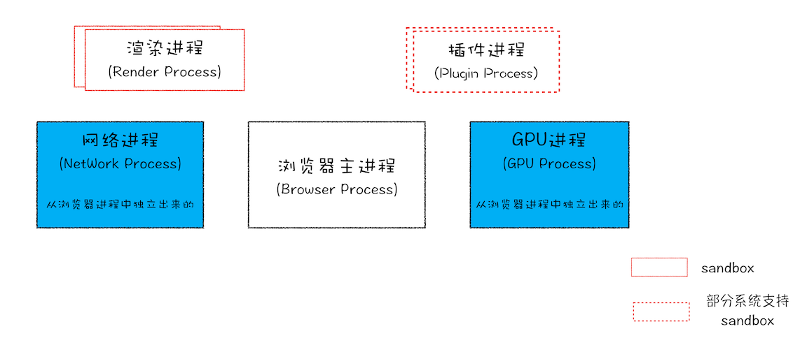

# 1. 浏览器总体

## 问题1： Chrome 进程架构是怎样的？



从图中可以看出，最新的 Chrome 浏览器包括：1 个浏览器（Browser）主进程、1 个 GPU 进程、1 个网络（NetWork）进程、多个渲染进程和多个插件进程。

- 浏览器进程。主要负责界面显示、用户交互、子进程管理，同时提供存储等功能。

- 渲染进程。核心任务是将 HTML、CSS 和 JavaScript 转换为用户可以与之交互的网页，排版引擎 Blink 和 JavaScript 引擎 V8 都是运行在该进程中，默认情况下，Chrome 会为每个 Tab 标签创建一个渲染进程。出于安全考虑，渲染进程都是运行在沙箱模式下。

- GPU 进程。其实，Chrome 刚开始发布的时候是没有 GPU 进程的。而 GPU 的使用初衷是为了实现 3D CSS 的效果，只是随后网页、Chrome 的 UI 界面都选择采用 GPU 来绘制，这使得 GPU 成为浏览器普遍的需求。最后，Chrome 在其多进程架构上也引入了 GPU 进程。

- 网络进程。主要负责页面的网络资源加载，之前是作为一个模块运行在浏览器进程里面的，直至最近才独立出来，成为一个单独的进程。

- 插件进程。主要是负责插件的运行，因插件易崩溃，所以需要通过插件进程来隔离，以保证插件进程崩溃不会对浏览器和页面造成影响。


## 问题2：仅仅打开了 1 个页面，为什么有 4 个进程？

打开 1 个页面至少需要 4 个进程：

- 1 个网络进程
- 1 个浏览器进程
- 1 个 GPU 进程
- 1 个渲染进程

- 如果打开的页面有运行插件的话，还需要再加上 1 个插件进程。


## 问题3：打开多个页面，会有几个进程？

默认情况下，Chrome 会为每个页面分配一个渲染进程，也就是说，每打开一个新页面就会配套创建一个新的渲染进程。

当多个网页是同一站点（same-site）是，共用一个渲染进程。

- 同一站点的定义：根域名（例如，geekbang.org）加上协议（例如，https:// 或者 http://）。包含了该根域名下的所有子域名和不同的端口，以下都是同一站点。

```html
// 它们都是属于同一站点，因为它们的协议都是 HTTPS，而且根域名也都是 geekbang.org。
https://time.geekbang.org
https://www.geekbang.org
https://www.geekbang.org:8080
```


所以，当 n 个网页是同一站点（same-site）：

- 1 个网络进程
- 1 个浏览器进程
- 1 个 GPU 进程
- **1 个渲染进程**

- 如果打开的页面有运行插件的话，还需要再加上 x 个插件进程。


当 n 个网页不是同一站点（same-site）：

- 1 个网络进程
- 1 个浏览器进程
- 1 个 GPU 进程
- **n 个渲染进程**

- 如果打开的页面有运行插件的话，还需要再加上 x 个插件进程。


## 问题4：浏览器同时打开多个页签，他们端口一样吗？如果一样，数据怎么知道去哪个页签？

端口一样的。

浏览器的网络进程知道每个 TCP 连接所对应的标签是哪个。所以通过 TCP 建立的下载通道下载完成所需数据后，会把数据分发给对应的渲染进程。


## 问题5：TCP 传送数据时，浏览器端就做渲染处理了吗？

如果前面数据包丢了，后面数据包先来是要等吗？

浏览器进程接收到 HTTP 响应头中的 **content-type** 类型时就开始准备渲染进程了；

网络进程一旦接受到服务器的 **响应体** ，就开始传输给渲染进程，渲染进程边读取其中的数据，边 DOM 解析。

- 此时 TCP 传输通道关闭与否并不影响渲染进程进行渲染操作，数据传输是在网络进程中的。

至于 HTTP 不用担心数据包丢失的问题，因为丢包和重传都是在传输层的 TCP 协议解决的。应用层的 HTTP 能保证数据按照顺序接收的。

- 也就是说，从传输层（TCP）到应用层（HTTP）时，数据就已经是完整的了。


# 2. HTTP 流程

## 问题1：一个完整的 HTTP 请求过程是什么样的？

一个 HTTP 请求经历了 9 个阶段：


假设：再浏览器地址里键入极客时间网站的地址：http://time.geekbang.org/index.html。

首先会划分为两个流程：

1.  浏览器端（的网络线程）发起 HTTP 请求流程，包括 6 个阶段：
    -   构建请求、查找缓存、准备 IP 和端口、等待 TCP 队列、建立 TCP 连接、发送 HTTP 请求。
2.  服务器端处理 HTTP 请求流程，包括 3 个阶段：
    -   处理请求、响应请求、断开 TCP 连接。

### 浏览器端发起 HTTP 请求

#### 1. 构建请求

浏览器构建 **请求行** 信息，为发起网络请求做数据准备。

```
GET /index.html HTTP1.1
```

#### 2. 查找缓存

在浏览器缓存中查询是否有要请求的文件。

>   浏览器缓存是一种在本地保存资源副本，以供下次请求时直接使用的技术。

当浏览器发现请求的资源：

-   在浏览器缓存中存有副本。那么它会拦截请求，返回该资源的副本，并直接结束后续请求。
-   没有发现副本。它会准备发起网络请求。

#### 3. 准备 IP 地址和端口

通过 URL 地址，来解析 IP 和端口信息。


IP 地址的获取：域名系统

>   域名系统：把域名和 IP 地址做一一映射关系。简称 DNS（Domain Name System）。

浏览器会先查找自身的 **DNS 数据缓存服务** ，如果域名之前解析过了，浏览器会直接得到 IP 和端口信息。

否则，会向 DNS 服务器申请查找 URL 地址的 IP 信息。


端口号的获取：端口号会在 URL 地址中指明，HTTP 协议默认是 80 端口。

#### 4. 等待 TCP 队列

Chrome 有个机制，同一个域名同时最多只能建立 6 个 TCP 连接。

如果在同一个域名下同时有 10 个请求发生，那么其中 4 个请求会进入排队等待状态，直至进行中的请求完成。

如果当前请求数量少于 6，会直接进入下一步，建立 TCP 连接。

#### 5. 建立 TCP 连接

3 次握手，详见 TCP 相关知识。

#### 6. 发送 HTTP 请求

一旦建立了 TCP 连接，浏览器就可以和服务器进行通信了，此时开始传输 HTTP 中的数据。

浏览器会依次发送：**请求行**、**请求头** 和 **请求体**。

下图是 HTTP 的请求数据格式，通过在终端输入

```
curl -i  https://time.geekbang.org/
```


#### 结构：

-   **请求行**：浏览器发送请求行是为了就是告诉服务器，当前我需要什么资源。
    -   请求方法
    -   请求 URI（Uniform Resource Identifier）
    -   HTTP 版本协议
-   **请求头**：则传递一些与连接相关的基础信息，比如包含了：
    -   浏览器所使用的 **操作系统**、**浏览器内核**；
    -   当前请求的 **域名信息**、浏览器端的 **Cookie** ；
    -   等等
-   **请求体**：存放了浏览器向服务器传递的数据。


#### 请求方法：

常用的请求方法有： **Get** 和 **POST**

**Get**：用于浏览器向服务器获取资源和数据，上文就是一个 **Get** 请求。

**POST**：用于浏览器向服务器发送数据，发送的数据保存在 **请求体** 中。比如登录一个网站，就需要通过 POST 方法把用户信息发送给服务器。

 

### 服务器端处理 HTTP 请求

#### 1. 处理请求

服务器收到来自浏览器的请求后，会分析请求，然后给出对应响应。

#### 2. 响应请求

服务器在收到来自浏览器的请求后开始准备响应的数据，然后通过 **服务器性响应** 返回给浏览器：

服务器会依次发送：**响应行**、**响应头** 和 **响应体**。

下图是一个服务器响应的数据结构：


服务器会依次发送：响应行、响应头和响应体。

**响应行**：服务器首先返回 **响应行**，包括：

-   HTTP 协议版本。
-   状态码：通过状态码来告知浏览器，该响应的大致情况。比如 200 表示处理成功，301 表示需要重定向，404 表示没有找到 URL 对应的资源。

**响应头**：响应头包含了服务器自身的一些信息。比如服务器生成返回数据的时间、返回的数据类型（JSON、HTML、流媒体等类型），以及服务器要在客户端保存的 Cookie 等信息。

**响应体**：通常，响应体就包含了 HTML 的实际内容。


**状态码：301 重定向**

当你在浏览器中打开 `geekbang.org` 后，你会发现最终打开的页面地址是 https://www.geekbang.org。

这两个 URL 之所以不一样，是因为涉及到了一个重定向操作。此时服务器返回的响应行和响应头，可以通过在终端输入以下代码来查看：

```
curl -I http://time.geekbang.org/
```

显示如下：


状态码 301，就告知了浏览器，需要重定向。具体含义是：浏览器需要重新导航，请求的 URL 地址应该是响应头的 **Location** 字段中保存的值。

接下来，浏览器获取 **Location** 字段中的地址，并使用该地址 **重新导航**。

-   导航的定义：用户发出 URL 请求到页面开始解析的这个过程，就叫做导航。


#### 3. 断开 TCP 连接

通常情况下，一旦服务器向客户端返回了请求数据，就会关闭 TCP 连接。

4 次挥手，详见 TCP 相关知识。


如果浏览器或者服务器在其头信息中加入了：

```
Connection:Keep-Alive
```

则表明 TCP 连接在发送后将仍然保持打开状态，这样浏览器就可以继续通过同一个 TCP 连接发送请求。

-   优点：提升资源加载速度，省去多次请求所需要的建立 TCP 连接的时间。
    -   比如，一个页面中的图片都来自同一个 Web 站点。初始化一个持久连接，通过复用该连接以批量请求资源。


## 问题2：发起网络请求前查找缓存有什么好处？

-   **服务端。**缓解服务器端压力，提升性能（获取资源的耗时更短了）；
-   **客户端。**缓存提升了资源加载的速度。


## 问题3：浏览器发起网络请求的步骤有哪些？


上图可见，一共有三个阶段：

1.  建立 TCP 连接。3 次握手；
2.  传输数据：
    1.  浏览器发送 HTTP 请求：浏览器会依次发送：**请求行**、**请求头** 和 **请求体**。
    2.  服务器处理 HTTP 请求
    3.  服务器响应：服务器会依次发送：**响应行**、**响应头** 和 **响应体**。
3.  断开 TCP 连接。4 次挥手。


## 问题4：为什么很多站点第二次打开速度会很快？

涉及到两个缓存机制，浏览器在第一次打开网页后，会缓存如下两个内容：

-   DNS 缓存
-   页面资源缓存


### DNS 缓存

在浏览器本地，会有一个 DNS 缓存表，把对应的 IP 和域名关联起来，需要时查阅。如果发现 IP 和域名不可达（域名更新了），则会重新向 DNS 查找 IP，及时更新表中信息。


### 页面资源缓存

通过一个具体案例来说明情况：


上图是当浏览器对同一个地址，在不同时间段向服务器发送  HTTP 请求时的处理方式：


#### 第一次发送请求

当浏览器向服务器发送一个 HTTP 请求，用以获取指定地址的资源。浏览器会首先查找自身的缓存中是否有对应地址的资源。因为是第一次请求，自然没有缓存，所以会像 服务器发起 HTTP 请求。

在收到来自服务器的数据后，浏览器会通过 **响应头** 中 **Cache-Control** 字段来判断是否缓存该资源。`Cache-Control` 字段存在：

-   `Max-age` ：设置缓存资源的生命周期，一旦到期后，就会丢弃该资源。比如上图设置的缓存过期时间是 2000 秒。
-   `Age`：资源当前的生命周期，随着时间推移会增加。


#### 第二次发送请求

浏览器第二次发送请求，先检查自身的缓存中是否有对应地址的资源。通过判断 `Max-age` 和 `Age`得 知还在生命周期内，则拦截请求，返回缓存中的数据。


#### 第三次发送请求

浏览器第二次发送请求，先检查自身的缓存中是否有对应地址的资源。通过判断 `Max-age` 和 `Age`得 知还在资源过期了，浏览器则会继续发起网络请求。

发送网络请求会在 HTTP 请求头中带上：

```
If-None-Match:"4f80f-13c-3a1xb12a"
```

服务器收到请求头后，会根据 If-None-Match 的值来判断请求的资源是否有更新。

-   如果没有更新，就返回 304 状态码，相当于服务器告诉浏览器：“这个缓存可以继续使用，这次就不重复发送数据给你了。”
-   如果资源有更新，服务器就直接返回最新资源给浏览器。


## 问题5：用户登录状态是如何保持的？

通过浏览器的 **Cookie** 来实现。

-   服务器响应头的 `Set-Cookie` 字段；
-   浏览器请求头的 `Cookie` 字段。


#### 流程

当用户打开登录页面，在登录框里填入用户名和密码，点击确定按钮。

-   浏览器：触发页面脚本生成用户登录信息，然后调用 **POST** 方法提交用户登录信息给服务器。
-   服务器：接收到浏览器提交的信息之后，查询后台，验证用户登录信息是否正确。如果正确：
    1.  生成一段表示用户身份的字符串；
    2.  把该字符串写到 **响应头** 的 `Set-Cookie` 字段，如：`Set-Cookie: UID=3431uad;`
    3.  把 **响应头** 发送给浏览器。
-   浏览器：在接收到服务器的响应头后，开始解析响应头，遇到响应头里含有 `Set-Cookie` 字段，会把字段信息保存到本地的 `Cookie` 。

当用户再次访问该页面时。

-   浏览器：发起 HTTP 请求前会先：
    1.  读取之前保存的 `Cookie` 数据；
    2.  把数据写进 **请求头** 里的 `Cookie` 字段里，如：`Cookie: UID=3431uad;`
    3.  将 **请求头** 发送给服务器。
-   服务器：收到 HTTP 请求头数据之后，
    1.  查找请求头里面的 `Cookie` 。当查找到包含`UID=3431uad` 的信息时，
    2.  服务器查询后台，判断该用户是否是已登录状态。如果已登录，
    3.  生成含有该用户信息的页面数据；
    4.  把数据发送给浏览器。
-   浏览器：收到数据，展示用户登录的状态信息。


## 问题6：浏览器刷新操作，ctrl+F5 和 F5 有什么区别？

ctrl+F5：强制刷新，也就是资源全部走网络，通过 HTTP请求获取。

F5：正常处理流程。缓存中如果有资源，就会本地直接获取。


# 2. 浏览器工作流程


## 问题1：从输入URL到页面展示，这中间发生了什么？

下图是一个完整的流程示意图：


这里面涉及到四个进程的分工合作：

- 浏览器进程：负责用户交互、其他进程管理、文件存储等。
- 渲染进程：负责把从网络下载的 HTML、JavaScript、CSS、图片等资源解析为可以显示和交互的页面。
- 网络进程：为浏览器进程和渲染进程提供网络下载功能。
- GPU 进程：为渲染进程提供栅格化加速，加快生成位图。


完整的过程，分为两大阶段，**导航** 和 **渲染**：

#### 第一阶段：导航阶段

用户发出

URL 请求到页面开始解析。

用户可以感知到的导航阶段，就是在浏览器的地址栏里面输入了一个地址后，之前的页面没有立马消失，而是要加载一会儿才会更新出空白页面。

此时的状态：

- **屏幕** 正展示之前已经渲染好的页面。
- **浏览器进程** 中存有这个页面的状态。
- **用户** 输入在地址栏输入了一串关键字。
- **地址栏** 分析用户输入的内容，然后生成对应的 **URL 请求**。

详细过程：

1. **用户**：输入内容

   - 浏览器进程 接收到地址栏的 **URL 请求**，便将该 URL 转发给 **网络进程**。

2. **网络进程**：提交 URL 请求，

   - 如果是 HTTP 协议，此时会发起一个 **HTTP 请求**，见相关问题：

     - 构建请求、查找本地资源缓存、查找本地 DNS 缓存、DNS 获取 IP 和端口、

     - 等待 TCP 队列、建立 TCP 连接、发送 HTTP 请求

   - 网络进程 发起真正的 **URL 请求**。
   - 服务器 收到 URL 请求，返回 **响应头**。
   - 网络进程 收到 **响应头数据**，**解析** 响应头数据，然后 **转发** 给浏览器进程。
     - 301 重定向
     - 分析数据类型是获取其实资源，还是获取一个 HTML 页面。
     - 断开 TCP 连接，或者 `Connection:Keep-Alive` 保持连接。

3. **浏览器进程**：准备渲染进程

   - 浏览器进程 收到 **数据** ，发送 **提交导航 (CommitNavigation)消息** 到渲染进程。
   - 渲染进程 收到消息后，直接和网络进程建立 **数据管道**，准备接收 **HTML 数据**。

4. **渲染进程**：提交文档

   - 渲染进程 向浏览器进程 **确认提交**，告诉浏览器进程：“已经准备好接受和解析页面数据了”。

   - 浏览器进程 收到 **确认提交** 后，便移除之前旧的文档，然后 **更新** 浏览器进程中的页面状态。

#### 第二阶段：渲染阶段

渲染出显示的页面，然后展示在屏幕上。

用户可以感知到的渲染阶段，就是空白页面要过一段时间，才会刷新为有内容的漂亮网页。

此时的状态：

- **浏览器进程** 等待渲染进程提交新页面；

- **渲染进程** 开始渲染网页。

- **网络进程** 在渲染进程执行网页渲染时，同步下载 HTML、CSS、JavaScript 和图片等资源。

详细过程：

1. **DOM。** **渲染进程** 将 **HTML** 内容转换为能够读懂的 **DOM 树** 结构。
2. **CSSOM。** **渲染引擎** 将 **CSS 样式表** 转化为浏览器可以理解的 **styleSheets**，构建 **CSSOM**。并计算出 DOM 节点的样式。
3. **Layout。** **渲染引擎** 创建 **布局树**，并计算元素的布局信息。
4. **Layer**。 **渲染引擎** 对布局树进行分层，并生成 **分层树**。
5. **Paint。** **渲染引擎** 为每个图层生成 **绘制列表**，并将其提交到 **合成线程**。
6. **合成线程** 进行栅格化 (raster) 操作：
   1. **tiles。** 先将图层分成 **图块**，
   2. **raster。** 然后在 **光栅化线程池** 中将图块转换成 **位图**，
   3. **draw quad。** 最后发送 **绘制图块命令 DrawQuad** 给浏览器进程。
7. **display。** **浏览器进程** 根据 DrawQuad 消息生成 **页面**，并 **显示** 到显示器上。


关于导航和渲染的具体过程，参见它们各自的相关问题。

### 参考文献：

> [当你在浏览器中输入 google.com 并且按下回车之后发生了什么？](https://github.com/skyline75489/what-happens-when-zh_CN)


## 问题2：一个完整的导航流程是怎样的 ？

用户发出 **URL 请求** 到 **页面开始解析** 的这个过程，就叫做导航。

分为以下 4 个大阶段：

1. 用户：输入内容

   - **浏览器进程** 接收到地址栏的 **URL 请求**，便将该 URL 转发给 **网络进程**。

2. 网络进程：提交 URL 请求

   - **网络进程** 发起真正的 **URL 请求**。
   - **服务器** 收到 URL 请求，返回 **响应头**。
   - **网络进程** 收到 **响应头数据**，**解析** 响应头数据，然后 **转发** 给浏览器进程。

3. 浏览器进程调度：准备渲染进程

   - **浏览器进程** 收到 **数据** ，发送 **提交导航 (CommitNavigation)消息** 到渲染进程。
   - **渲染进程** 收到消息后，直接和网络进程建立 **数据管道**，准备接收 **HTML 数据**。

4. 渲染进程：提交文档
   - **渲染进程** 向浏览器进程 **确认提交**，告诉浏览器进程：“已经准备好接受和解析页面数据了”。

   - **浏览器进程** 收到 **确认提交** 后，便移除之前旧的文档，然后 **更新** 浏览器进程中的页面状态。


导航完成的标志是：

1. 更新浏览器界面状态，包括：
   - 安全状态、地址栏的 URL、前进后退的历史状态
2. 更新 Web 页面，显示为**空白页面**。


### 1. 用户输入

当用户在地址栏中输入一个查询关键字时，地址栏会判断输入的内容：

- 如果是 **搜索内容**，地址栏会使用浏览器默认的搜索引擎，来合成新的带搜索关键字的 URL。
- 如果是符合 **URL 规则**，比如输入的是 `time.geekbang.org`，那么地址栏会根据规则，把这段内容加上协议，合成为完整的 URL，如 `https://time.geekbang.org`。


#### 1.1 `beforeunload` 事件

当用户输入关键字并键入回车之后，这意味着当前页面即将要被替换成新的页面。在这个流程继续之前，浏览器还给了当前页面一次执行 `beforeunload` 事件的机会。

`beforeunload` 事件中可以的操作：

1. 页面退出前，执行一些数据清理操作；
2. 询问用户是否要离开当前页面，比当前页面可能有未提交完成的表单等情况；
3. 直接取消导航，让浏览器不再执行任何后续工作。


经过 `beforeunload` 事件后，页面进入开始加载 URL 浏览器状态。当浏览器刚开始加载一个地址之后，标签页上的图标便进入了加载状态。

但此时页面显示的依然是之前打开的页面内容。只有当进入提交文档阶段，页面内容才会被替换。会被替换为空白。


### 2. URL 请求阶段

进入页面资源请求过程。

此时，

1. **浏览器进程** 会通过进程间通信（IPC）把 **URL 请求** 发送至 **网络进程**。

2. **网络进程** 接收到 URL 请求后，会在这里发起真正的 URL 请求流程。

具体内容，可以参考 “一个完整的 HTTP 请求过程是什么样的？”

以下都是 **网络进程** 进行的操作：

1. 构建请求；
2. 查找本地的资源缓存；
3. 准备 IP地址和端口信息；
   - 这里会先查找本地的 DNS 缓存。
4. 等待 TCP 队列、建立 TCP 连接；
   - 如果是 HTTPS 协议，还需要在 TCP 基础上建立 TLS 连接。
5. 依次发送：**请求行**、**请求头** 和 **请求体**。
6. **服务器** 接收到请求信息后，根据信息生成 响应行、响应头和响应体，发给网络进程。
7. 网络进程接收了 **响应行** 和 **响应头** 之后，会判断：
   1. 重定向
   2. 数据类型
8. 网络进程 **解析** **相应体** 的内容。


#### 2.1 重定向

网络进程接收了 **响应行** 和 **响应头** 之后，可能会发生 **重定向**。


如果 **响应行** 的状态码：

- 是 `200`，浏览器可以继续处理该请求。
- 包含了 `301`、`302` 一类的跳转信息，浏览器需要跳转到新的地址继续导航；


#### 2.2 数据类型的处理

网络进程接完成了 **重定向** 阶段后，会判断涉数据的类型。

- URL 请求有时是一个下载类型，有时是正常的 HTML 页面，那么浏览器是如何区分它们呢？


服务器在 **响应头** 的 **Content-Type** 字段，会告诉浏览器，它将要返回的响应体数据是什么类型：

如果是一个 HTML 网页，响应头中的 Content-type 字段的值是 text/html，显示如下：

```
curl -I https://time.geekbang.org/
```


如果是一个安装包，其 Content-Type 的值是 application/octet-stream，显示如下：

```
curl -I https://res001.geekbang.org/apps/geektime/android/2.3.1/official/geektime_2.3.1_20190527-2136_offical.apk
```


网络进程会根据判断的结果进行不同的处理：

- 如果是一个安装包，浏览器判断为下载类型，那么该请求会被提交给浏览器的下载管理器，同时该 URL 请求的导航流程就此结束。
- 如果是一个 HTML，浏览器则会继续进行导航流程。


### 3. 准备渲染进程

默认情况下，Chrome 会为每个页面分配一个渲染进程，也就是说，每打开一个新页面就会配套创建一个新的渲染进程。

当多个网页是同一站点（same-site）是，共用一个渲染进程。

- 同一站点的定义：根域名（例如，geekbang.org）加上协议（例如，https:// 或者 http://）。包含了该根域名下的所有子域名和不同的端口，以下都是同一站点。

```js
// 它们都是属于同一站点，因为它们的协议都是 HTTPS，而且根域名也都是 geekbang.org。
https://time.geekbang.org
https://www.geekbang.org
https://www.geekbang.org:8080
```


### 4. 提交文档

浏览器进程将网络进程接收到的 HTML 数据提交给渲染进程。

具体流程是：

1. **浏览器进程** 接收到 **网络进程** 的响应头数据后，向 **渲染进程** 发起 **“提交文档”** 的消息；
2. **渲染进程** 收到消息后，和 **网络进程** 建立传输数据的 **管道**；
3. **渲染进程** 完成数据传输后，给 **浏览器进程** 返回 **“确认提交”** 的消息。
4. **浏览器进程**  收到消息后，更新浏览器界面状态，包括：
   - 安全状态、地址栏的 URL、前进后退的历史状态
5. **浏览器进程** 更新 Web 页面，显示为**空白页面**。
6. 至此，导航完成。

更新内容如下图所示：


用户可以感知到的导航阶段，就是在浏览器的地址栏里面输入了一个地址后，之前的页面没有立马消失，而是要加载一会儿才会更新出空白页面。


## 问题3：一个完整的渲染流程是怎样的 ？从 HTML CSS JavaScript 怎样渲染成一个网页？


从图中可以看出，左边输入的是 HTML、CSS、JavaScript 数据，这些数据经过中间渲染模块的处理，最终输出为屏幕上的像素。

下面是一个完整的渲染流程：


结合上图，一个完整的渲染流程大致可总结为如下：

1. **DOM。** **渲染进程** 将 **HTML** 内容转换为能够读懂的 **DOM 树** 结构。
2. **CSSOM。** **渲染引擎** 将 **CSS 样式表** 转化为浏览器可以理解的 **styleSheets**，并计算出 DOM 节点的样式。
3. **Layout。** **渲染引擎** 创建 **布局树**，并计算元素的布局信息。
4. **Layer**。 **渲染引擎** 对布局树进行分层，并生成 **分层树**。
5. **Paint。** **渲染引擎** 为每个图层生成 **绘制列表**，并将其提交到 **合成线程**。
6. **合成线程** 进行栅格化 (raster) 操作：
   1. **tiles。** 先将图层分成 **图块**，
   2. **raster。** 然后在 **光栅化线程池** 中将图块转换成 **位图**，
   3. **draw quad。** 最后发送 **绘制图块命令 DrawQuad** 给浏览器进程。
7. **display。** **浏览器进程** 根据 DrawQuad 消息生成 **页面**，并 **显示** 到显示器上。


下面会关注这三点来分别介绍每个阶段：

- 该阶段接收的内容
- 该阶段对这个内容进行的处理
- 该阶段输出的内容


### 1. 构建 DOM 树

把 HTML 转化为浏览器能够理解的结构。

下图就是一个 DOM 树的构建过程：


#### 分析

该阶段接收的内容：HTML 文件

该阶段处理的过程：经过 HTML 解析器解析

该阶段输出的内容：DOM 树


#### 查看

在开发者工具中，选择 `Console` 标签打开控制台，输入 `document`，看到完整的 DOM 树结构：


### 2. 构建 CSSOM（样式计算 Recalculate Style）

计算出 DOM 节点中每个元素的具体样式。

分为三个阶段：

- CSS 文本转换为 styleSheets。
- 标准化 CSS 属性值的单位
- 计算 DOM 中每个节点的具体样式，生成 CSSOM。


#### 分析

该阶段接收的内容：CSS 文件  （ `<link>`、`<style>`、`<style="xx">`，3 个途径）

该阶段处理的过程：

1. CSS 文本转化为 styleSheets 格式，
2. 标准化 CSS 属性值的单位，
3. 通过继承规则和层叠规则计算样式。

该阶段输出的内容：CSSOM。


#### 2.1 CSS 文本转换为 styleSheets

当渲染引擎接收到 CSS 文本时，会执行一个转换操作，将 CSS 文本转换为浏览器可以理解的结构——styleSheets，也就是 CSSOM。


**查看**

在开发者工具中，控制台输入 `document.styleSheets`，看到引擎把获取到的所有 CSS 文本全部转化为 styleSheetes。

获取来源：`<link>` 引用的外部 CSS 文件、`<style>` 标签内的 CSS 文件、 元素 `style` 属性。


#### 2.2 标准化 CSS 属性值的单位

比如，`2em` 被解析成了 `32px`，red 被解析成了 `rgb(255,0,0)`，`bold` 被解析成了 `700`……


#### 2.3 计算 DOM 中每个节点的最终样式

通过 CSS 的 **继承规则** 和 **层叠规则**，计算出每个节点的具体样式

CSS 继承：就是每个 DOM 节点都包含有父节点的样式。

CSS 层叠：它是一个定义了如何合并来自多个源的属性值的算法。


**查看**

查看继承：开发者工具中，选择 `element` 标签中的 `style` 子标签。

- 图中区域 2，表示了被选中标签身上添加的所有元素样式；
- 图中区域3，表示了这些元素样式的来源。


查看层叠：开发者工具中，选择 `element` 标签中的 `Computed` 子标签：

会显示该 DOM 元素最终计算的样式。


### 3. 布局 Layout

计算出 DOM 树中可见元素的几何位置，我们把这个计算过程叫做布局。


#### 分析

该阶段接收的内容：DOM 树、CSSOM。

该阶段处理的过程：

1. 将 DOM 树和 CSSOM 合并，删除页面不可见的元素；
2. 然后计算出节点的 坐标，写入 DOM 树中。

该阶段输出的内容：包含坐标的布局树。


#### 3.1 创建布局树

构建一棵只包含可见元素的 **布局树**，排除`head` 标签，`display:none` 属性等元素。

下图是创建布局树的过程：


#### 3.2 布局计算

计算布局树节点的 **坐标位置** 。

在执行布局操作的时候，会把布局运算的结果重新写回布局树中，所以布局树既是输入内容也是输出内容。

Chrome 团队正在重构布局代码，让这两个步骤分开。


### 4. 分层 Layer

这类似 Ps 中的图层，渲染引擎需要为特定的节点生成专用的图层，并生成一棵对应的图层树（LayerTree）。

- 页面中有很多复杂的效果，如一些复杂的 3D 变换、页面滚动，或者使用 `z-indexing` 做 z 轴排序等。

#### 分析

该阶段接收的内容：包含坐标的布局树。

该阶段处理的过程：**渲染引擎** 为节点生成各自的图层。

该阶段输出的内容：图层树。


满足以下两点中的一个，就会新建一个图层：

- 拥有层叠上下文属性的元素会被提升为单独的一层。更多内容，参见 CSS 的 **层叠上下文** 章节。
- 需要剪裁（clip）的地方会被创建为图层。
  - 如`overflow:auto;` 如果内容超过 div 边框，就会出现裁。此时这个文字节点会新建图层。


#### 查看

在开发者工具，选择 `Layers` 标签，就可以可视化页面的分层情况，如下图所示：

 `Layers` 标签默认是不显示的，在 More tools 中找到。


### 5. 图层绘制 Paint

在完成图层树的构建之后，**渲染引擎** 会把一个图层的绘制拆分成很多小的 **绘制指令**，然后再把这些指令 **按照顺序** 组成一个待 **绘制列表**，如下图所示：


#### 分析

该阶段接收的内容：图层树

该阶段处理的过程：**渲染引擎** 按照顺序确定绘制列表。

该阶段输出的内容：绘制列表。


#### 查看

在开发者工具，选择 `Layers` 标签的 `document` 子标签，就可以查看绘制列表的形成：


### 6. 栅格化 raster

**渲染引擎** 制作出 **绘制列表**后，提交（commit）给它的 **合成线程** 来对图层树中的每个图层进行绘制。所谓栅格化，是指将图块转换为 **位图**。

#### 分析

该阶段接收的内容：绘制列表

该阶段处理的过程：渲染引擎的 **合成线程**，

1. 对所有图层划分图块，
2. 进行栅格化操作。优先处理覆盖视口的图块。可能会涉及到 GPU 进程参与。

该阶段输出的内容：位图


合成线程会将所有图层划分为多个 **图块**（tile），这些图块的大小通常是 256x256 或者 512x512。

然后，合成线程会先确定 **视口**（ViewPort）相对于 **页面** 的位置，优先转换视口区域的 **可见图块**（visible tiles）：


渲染进程维护了一个 **栅格化线程池**，所有的图块栅格化都是在线程池内执行的。如果栅格化操作使用了 GPU，那么最终生成位图的操作是在 GPU 中完成的。GPU 操作是在 GPU 进程中，这里涉及到了跨进程协作，最终运行方式如下图所示：


### 7. 合成和显示 display

#### 分析

该阶段接收的内容：位图

该阶段处理的过程：一旦所有图块都被光栅化，

1. **合成线程** 就会生成一个绘制图块的命令 —— **DrawQual**，然后将该命令提交给浏览器进程。

2. **浏览器进程** 中的 **viz 组件** ，接收 **DrawQuad** 命令，将其页面内容绘制到 **显存** 中的 **后缓存区**，
3. **浏览器进程** 最后把内容显示在屏幕上。

该阶段输出的内容：显示漂亮的网页。


用户可以感知到的渲染阶段，就是空白页面要过一段时间，才会刷新为有内容的漂亮网页。


## 问题4：从输入 URL 到网页最终展示的过程中，页面在视觉上会发生几次变化？

从发起 URL 请求开始，到首次显示页面的内容，在视觉上经历的三个阶段，按照时间顺序：

-   导航阶段开始（即将构建 URL 请求）。

阶段一：展示之前页面内容，没有更新。

-   导航阶段结束，渲染阶段开始（渲染进程开始从网络进程获取 HTML 文件）。

阶段二：展示空白页面，更新了：前进后退、安全状态、地址了URL。

-   渲染阶段结束（页面被绘制出来）。

阶段三：展示渲染的页面内容。


性能影响：

阶段一：主要受是网络质量或者是服务器处理时间的影响

阶段二：见，“如何缩短白屏时间” 相关问题。


# 3. DOM 相关

## 问题1：什么是 DOM，主要作用是什么？

从网络传给渲染引擎的 HTML 文件字节流是无法直接被渲染引擎理解的，所以要将其转化为渲染引擎能够理解的内部结构，这个结构就是 DOM。

在渲染引擎中，DOM 有三个层面的作用：

-   从页面的视角来看，DOM 是生成页面的基础数据结构。
-   从 JavaScript 脚本视角来看，DOM 提供给 JavaScript 脚本操作的接口。通过这套接口，JavaScript 可以对 DOM 结构进行访问，从而改变文档的结构、样式或内容。
-   从安全视角来看，DOM 是一道安全防护线，一些不安全的内容在 DOM 解析阶段就被拒之门外了。


## 问题2：DOM 树如何生成？如何解析 HTML？

#### 两个重点：

-   **HTML 解析器**：在渲染引擎中（渲染进程），有一个叫 HTML 解析器（HTMLParser）的模块，它的职责就是负责将 **HTML 字节流** 转换为 **DOM 结构**。

-   **边加载边解析**：HTML 解析器并不是等整个文档加载完成之后再解析的，而是网络进程加载了多少数据，HTML 解析器便解析多少数据。


#### 具体流程：

1.   网络进程接收到响应头之后，会根据响应头中的 `content-type` 字段来判断文件的类型：

     -   如果 `content-type` 的值是 `text/html`，就判断这是一个 HTML 文件，然后为该请求 **选择/创建一个渲染进程**。

2.   渲染进程准备好之后，网络进程和渲染进程之间会建立一个 **共享数据的管道**：

     -   **网络进程** 通过 TCP 连接服务器，获取到按序到达的字节流，同时就传递到管道中；

     -   **渲染进程** 则从管道中读取字节流，然后让 HTML 解析器动态地解析为 DOM 树。


## 问题3：JavaScript 和 CSS 文件的加载（下载），会阻塞 DOM 树的构建（Parse HTML）吗？

#### **结论：CSS 文件不阻塞 DOM 的生成，不阻塞 Javascript 的加载，但是会阻塞 JavaScript 的执行。**


#### JavaScript 文件阻塞 DOM 树构建：

如果在渲染进程中 HTML 解析器在逐行解析 HTML 文件时，当解析到 `<script>` 标签，渲染引擎会判断这是一段脚本，此时 HTML 解析器就会暂停 DOM 的解析，因为接下来的 JavaScript 可能要修改当前已经生成的 DOM 结构。这时候 HTML 解析器暂停工作，JavaScript 引擎介入，并执行 script 标签中的这段脚本。当这段脚本执行完毕后，HTML 解析器才会继续解析 DOM。

-   Chrome 浏览器对此做了一个优化，**预解析操作**。当渲染引擎收到字节流之后，会开启一个 **预解析线程**，用来分析 HTML 文件中包含的 JavaScript、CSS 等相关文件，解析到相关文件之前，预解析线程会提前下载这些文件。当然，如果解析到了 JavaScript 文件的位置，JavaScript 文件还没有下载完，依然会发生阻塞问题。


情况一：

在执行 Parse HTML 的时候，如果遇到 **内联的 JavaScript 脚本**，那么会暂停当前的 HTML 解析而去执行 JavaScript 脚本，在 JavaScript 脚本执行完毕后，再继续往下解析：

```html
<html>
    <body>
        极客时间
        <script>
        document.write("--foo")
        </script>
    </body>
</html>
```


情况二：

如果内联的脚本替换成 **js 外部文件**。这种情况下，当解析到 JavaScript 的时候，会先暂停 DOM 解析，并下载 foo.js 文件。等待下载完成后，执行这段 JS 文件，然后再继续往下解析 DOM。

```html
<html>
    <body>
        极客时间
        <script type="text/javascript" src="foo.js"></script>
    </body>
</html>
```


使用 `async` 和 `defer` 标签，会有不同的表现效果：

| script 标签      | 多个 JS 文件的执行顺序        | 是否阻塞解析 HTML      |
| ---------------- | ----------------------------- | ---------------------- |
| `<script>`       | 顺序执行（HTML 中的引入顺序） | 阻塞                   |
| `<script async>` | 乱序执行（下载完成的顺序）    | 可能阻塞，也可能不阻塞 |
| `<script defer>` | 顺序执行（HTML 中的引入顺序） | 不阻塞                 |

具体参见下面的问题：`script` 标签中的 `async` 和 `defer` 属性有什么作用？


#### CSS 间接阻塞 DOM 树构建：

如果代码里 **先** 引用了外部的 CSS 文件，那么在执行 **后面的**  JavaScript 之前，要等待这个 CSS 文件下载完成，并解析生成 CSSOM 对象之后，才能执行 JavaScript 脚本。

-   因为 JavaScript 代码有可能会访问元素样式，而按照文档从上至下的顺序，在上面的 CSS 文件有可能修改了这些元素的样式。
-   JavaScript 引擎在解析 JavaScript 之前，是不知道 JavaScript 是否操纵了 CSSOM 的，所以渲染引擎在遇到 JavaScript 脚本时，不管该脚本是否操纵了 CSSOM，都会执行 CSS 文件下载，解析操作，再执行 JavaScript 脚本。

```html
<html>
    <head>
        <style type="text/css" src = "theme.css"></style> 
    </head>
    <body>
        <p>极客时间</p>
        <script>
            let e = document.getElementsByTagName('p')[0]
            e.style.color = 'blue'
        </script>
    </body>
</html>
```


如果 JavaScript 代码中没有访问 **CSS 文件中定义的元素样式**，是不会阻塞 DOM 树的构建。

此时，如果 CSS 文件下载失败，只会让页面丢失相应的 CSS 样式。


所以，

1.   CSS 不会直接地阻塞 DOM 的生成，但是有可能会间接影响；
2.   CSS 不阻塞 Javascript 的加载，但是会阻塞 JavaScript 的执行；
3.   CSS 会阻塞页面的渲染。
4.   JavaScript 文件会阻塞 DOM 的生成，也就是会阻塞页面的渲染，会阻塞页面的渲染。


如果把 CSS 文件放在文档的最后面加载执行：

-   CSS 文件不会阻塞 DOM 的生成，也不会阻塞 JavaScript 的执行。但是浏览器在解析完DOM 后，要花费额外时间来解析 CSS 文件。而无法优化解析效率，在解析 DOM 的时候，并行解析 CSS。

如果 CSS 文件在头部、JavaScript 文件在尾部：

-   这样 JavaScript 只会在最后时刻去改变 DOM 生成，在此之前不会影响到 DOM 的正常解析。而在头部的 CSS文件也会尽可能的提前解析，不去阻塞 JavaScript 的执行，从而使页面尽快的完成 **DOM 解析** 和 **样式计算**。


## 问题4：`script` 标签中的 `async` 和 `defer` 属性有什么作用？

在 HTML 中会遇到以下三类 `script`：

```html
<script src='xxx'></script>
<script src='xxx' async></script>
<script src='xxx' defer></script>
```

下面分析：


#### script

浏览器在解析 HTML 的时候，如果遇到一个没有任何属性的 script 标签，就会 **暂停解析 HTML**。先发送网络请求下载 JS 文件，然后执行该代码。当代码执行完毕后继续解析。

-   为什么暂停解析 HTML？
-   因为如果解析到 `<script>` 标签时，渲染引擎判断这是一段脚本，此时 HTML 解析器就会暂停 DOM 的解析，因为接下来的 JavaScript 可能要修改当前已经生成的 DOM 结构。

#### async script

当浏览器遇到带有 async 属性的 script 时，**异步** 下载该脚本**，不阻塞浏览器解析 HTML**，一旦下载好 Js 文件，

- 如果此时 **HTML 解析尚未完成**，就会 **暂停解析 HTML**，先执行 JS 代码，后继续解析。
- 如果**此时 HTML 解析早已完成**，则 **没有产生阻塞**，按下载完成的顺序去执行 JS 文件。

#### defer script

当浏览器遇到带有 defer 属性的 script 时，**异步** 下载该脚本，**不阻塞浏览器解析 HTML**。等待 HTML 解析完毕后，再执行 JS 代码。

#### 总结：

| script 标签      | 多个 JS 文件的执行顺序        | 是否阻塞解析 HTML      |
| ---------------- | ----------------------------- | ---------------------- |
| `<script>`       | 顺序执行（HTML 中的引入顺序） | 阻塞                   |
| `<script async>` | 乱序执行（下载完成的顺序）    | 可能阻塞，也可能不阻塞 |
| `<script defer>` | 顺序执行（HTML 中的引入顺序） | 不阻塞                 |

所以，

- 默认情况下，Js 文件会阻塞 DOM 树构建。
- 带有 `async` 属性的 Js 文件可能阻塞，也可能不阻塞。
- 带有 `defer` 属性的 Js 文件不会阻塞 DOM 树构建。


## 问题5：如何优化 CSS 和 JavaScript 阻塞 DOM 树的构建（Parse HTML）？

-   官方优化：Chrome 浏览器对此做了一个优化，**预解析操作**。当渲染引擎收到字节流之后，会开启一个 **预解析线程**，用来分析 HTML 文件中包含的 JavaScript、CSS 等相关文件，解析到相关文件之前，预解析线程会提前下载这些文件。
-   自己优化：
    -   CDN 来加速 JavaScript 文件的加载；
    -   压缩 JavaScript 文件的体积；
    -   如果 JavaScript 文件中没有操作 DOM 相关代码，就可以将该 JavaScript 脚本设置为 **异步加载**，通过 `async` 或 `defer`。
        -   `async` 标志的脚本文件一旦加载完成，会立即执行；
        -   `defer` 标记的脚本文件，在 `DOMContentLoaded` 事件之前执行。
            -   `DOMContentLoaded`: 当页面的内容解析完成后，则触发该事件。
            -   `onLoad`: 等待页面的所有资源都加载完成才会触发，这些资源包括css、js、图片视频等。


## 4. 性能优化

## 问题1：FP（First Paint）是什么？

在衡量 Web 页面性能的时候有一个重要的指标叫“FP（First Paint）”，是指从页面加载到首次开始绘制的时长。

影响 FP 的其中一个重要的因素是网络加载速度。


## 问题2：CSS 如何影响首次加载的白屏时间？

白屏时间是如下这个时间段：

-   从导航阶段刚完成、渲染阶段刚开启：渲染进程获取到 HTML 文件，开始解析。
-   到渲染阶段完成：页面显示渲染后到网页。


这其中，CSS 文件需要被解析为浏览器可以使用的 CSSOM。

下面通过几个案例来分析 CSS 解析 CSSOM 这个过程，在什么情况下阻塞 DOM，什么情况下阻塞渲染：

### 情况1：HTML 文件没有引入 JavaScript 脚本。

```css
//theme.css
div{ 
    color : coral;
    background-color:black
}
```

```html
<html>
  <head>
      <link href="theme.css" rel="stylesheet">
  </head>
  <body>
      <div>geekbang com</div>
  </body>
</html>
```

执行流程如下：

1.   渲染进程请求 HTML 文件后，会等待一段空闲时间（此时网络进程去联系服务器）。
2.   渲染进程开始从网络进程中获取到 HTML 文件的字节流，边获取边解析 HTML。
3.   渲染进程完成 DOM 构建后，请求 CSS 文件，会等待一段时间（此时网络进程去联系服务器）。
4.   渲染进进程从网络进程获取到 CSS 文件后，边获取边构建 CSSOM。
5.   渲染进程完成 CSSOM 构建，然后依次完成布局树、图层树、绘制、栅格化等操作；
6.   浏览器进程最终把渲染好的页面展示出来。


这其中，构建 CSOM 之前，有一段空间时间，是网络进程构建请求，然后通过 TCP 连接获取 CSS 文件的等待时间。

### 情况2：HTML 文件引入了 JavaScript 脚本。

```css
//theme.css
div{ 
    color : coral;
    background-color:black
}
```

```html
<html>
  <head>
      <link href="theme.css" rel="stylesheet">
  </head>
  <body>
      <div>geekbang com</div>
      <script> 									//	引入了JavaScript脚本
          console.log('time.geekbang.org')
      </script>
      <div>geekbang com</div>
  </body>
</html>
```

-   在解析 DOM 的过程中，如果遇到了 JavaScript 脚本，那么需要先暂停 DOM 解析去执行 JavaScript，因为 JavaScript 有可能会修改当前状态下的 DOM。
-   而执行 JavaScript 脚本前，还需要完成对 CSS 文件的解析（CSS文件位置在 JavaScript 脚本的上边），因为 JavaScript 有可能会读取 CSS 对元素应用的样式。

这就形成了 DOM 解析等待 JavaScript 执行、JavaScript 执行等待这些 CSS文件转化为 CSSOM 阻塞链。


### 情况3：CSS 和 JavaScript 是外部文件

```html
<html>
<head>
    <link href="theme.css" rel="stylesheet">
</head>
<body>
    <div>geekbang com</div>
    <script src='foo.js'></script>
    <div>geekbang com</div>
</body>
</html>
```

CSS 和 JavaScript 都是外部文件，需要加载。此时若引入 Chrome 预解析线程，则情况如下：

在接收到 HTML 数据之后，预解析线程会开始预解析 HTML 文件中的资源。当HTML 预解析器识别出来了有 CSS 文件和 JavaScript 文件需要下载，然后就并行发起这些文件的下载请求。这样，就会缩短 JavaScript 阻塞时间。


## 问题3：如何缩短首次加载时的白屏时间？

为了研究白屏时间的影响因素，我们从渲染阶段的全部步骤：解析 HTML、下载 CSS、下载 JavaScript、生成 CSSOM、执行 JavaScript、生成布局树、绘制页面一系列操作来分析。

所以要想缩短白屏时长，可以有以下策略：

-   Chrome 官方策略：
    -   预解析线程。当渲染进程接收 HTML 文件字节流时，会预先加载/解析 CSS 和 JavaScript 文件，缩短阻塞时间。
    -   DOM 和 CSSOM 同时构建。如果条件允许，DOM 和 CSSOM 可以同步构建。

-   解决下载 CSS 和 JavaScript 导致的阻塞问题：
    -   **直接内联 JavaScript、内联 CSS 。**这样获取到 HTML 文件之后就可以直接开始渲染流程了。
    -   **减少 JavaScript 文件大小。**比如通过 webpack 等工具移除一些不必要的注释，并压缩 JavaScript 文件。
    -   **减小 CSS 文件大小。**通过媒体查询属性，将一个大 CSS 文件拆分为多个不同用途的子文件，只在特定的场景下才会按需加载。
-   保证 HTML 解析不被 JavaScript 脚本阻塞，推迟 JavaScript 脚本执行：
    -   将一些不需要在解析 HTML 阶段使用的 **JavaScript 标记**  `async` 或者 `defer`。


## 问题4：什么是重排、重绘和合成？

这三个概念和渲染流水线相关：

### 1. 更新了元素的几何属性（重排）


通过 JavaScript 或者 CSS 修改元素的 **几何位置属性**，例如改变元素的宽度、高度等，那么浏览器会触发 **重新布局**，解析之后的一系列子阶段，这个过程就叫 **重排**。

**总结：重排需要更新完整的渲染流水线，开销最大，重排会触发重绘。**


### 2. 更新元素的绘制属性（重绘）


如果修改 **没有** 导致元素 **几何位置的变换** ，比如更新元素的背景颜色，那么 **布局阶段** 将不会被执行，直接进入了 **绘制阶段**，然后执行之后的一系列子阶段，这个过程就叫 **重绘**。

**总结：重绘省去了布局和分层阶段，执行效率比重排高一些。**


### 3. 避开重排和重绘（合成）


如果既不修改元素的几何位置属性，也不修改元素的背景色等属性，渲染引擎将跳过布局和绘制，只执行后续的合成操作，我们把这个过程叫做 **合成**。

比如，使用 CSS 的 transform 来实现动画效果，这可以避开重排和重绘阶段，直接在非主线程上执行合成动画操作。

**总结：相对于重绘和重排，合成能大大提升绘制效率。**


## 问题5：如何减少重排和重绘？

1. **减少重排的范围。**减去不需要重排的元素。

2. **读写分离操作。**对 DOM 属性要读写分离，因为读的前提是要绘制出来，读之前要触发绘制。批量写入后再读取，减少了重绘次数。

   ```js
   // bad
   div.style.left = '10px';
   console.log(div.offsetLeft);
   div.style.top = '10px';
   console.log(div.offsetTop);
   
   // good
   div.style.width = '20px';
   div.style.height = '20px';
   console.log(div.offsetWidth);
   console.log(div.offsetHeight);
   ```

3. **样式集中改变。**通过对 class 名操作样式，而不是频繁操作 style。利用 class 集中改变样式。

   ```js
   div.style.left = '10px';
   div.style.top = '10px';
   // good 
   div.className += "Mystyle"
   ```

4. **批量 dom 操作。**例如 createDocumentFragment，或者使用框架，例如 React

5. **避免使用 table 布局。**

6. **优化动画。**动画的平滑效果与对CPU资源的消耗要达到平衡，还可以启动GPU加速。

7. **限制窗口大小的调整。**窗口大小变化，就一定会导致重排重绘。


## 问题6：什么是节流和防抖？

### 定义：

**应用背景：**当某个事件频繁触发，就会导致频繁的调用回掉函数，造成性能损失。防抖和节流的作用，就是降低事件触发的频率，在一个周期内只触发一次即可。

-   **节流（throttle）：**当事件第一次被触发，必须等待一个规定的时间后，才能再次触发。在等待规定时间期间，所有触发申请会被拒绝。
-   **防抖（debounce）：** 有一个缓冲时间，申请触发事件，如果在缓冲时间尚未到期前，依然有触发事件申请，则旧申请作废，新申请重新开始计算缓冲时间。只有在缓冲时间内没有新的申请，事件才会被触发。


**总结：**

-   **节流** 是 LOL 中的释放技能：一直按Q（申请触发事件），不会无限释放技能，只有当技能冷却（delay）结束后才能释放一次；
-   防抖 是 LOL 中的回程：一直按回程（申请触发事件），回城有一个引导时间（delay），会一直重置回城引导时间。只有在引导时没有被打断（新的申请触发事件），才能回城。


### 示例代码：

```js
function resize(e) {
    console.log("窗口大小改变了");
}
window.addEventListener('resize', resize);
```


### 节流（throttle）

#### 1. 时间戳版

```js
function throttle(func, delay) {
    var last = 0;
    return function () {
        var now = Date.now();
        if (now >= delay + last) {
            func.apply(this, arguments);
            last = now;
        } else {
            console.log("距离上次调用的时间差不满足要求哦");
        }
    }
}

function resize(e) {
    console.log("窗口大小改变了");
}
window.addEventListener('resize', throttle(resize, 1000));
```

#### 2. 定时器版

```js
function throttle(func, delay) {
    var timer = null;
    return function () {
        if (!timer) {
            func.apply(this, arguments);
            timer = setTimeout(() => {
                timer = null;
            }, delay);
        } else {
            console.log("上一个定时器尚未完成");
        }
    }
}

function resize(e) {
    console.log("窗口大小改变了");
}
window.addEventListener('resize', throttle(resize, 1000));
```


### 防抖（debounce）

```js
function debounce(func, delay) {
    var timeout;
    return function() {
        clearTimeout(timeout);
        timeout = setTimeout(()=>{
            func.apply(this, arguments);
        }, delay);
    }
}

function resize(e) {
    console.log("窗口大小改变了");
}
window.addEventListener('resize', debounce(resize, 1000));
```


### 引用

1.   [掘金 (juejin.cn)](https://juejin.cn/post/6962949488646291486)
2.   [函数防抖和节流 - 掘金 (juejin.cn)](https://juejin.cn/post/6844903651278848014)


# 原文：

> [浏览器工作原理与实践-极客时间 (geekbang.org)](