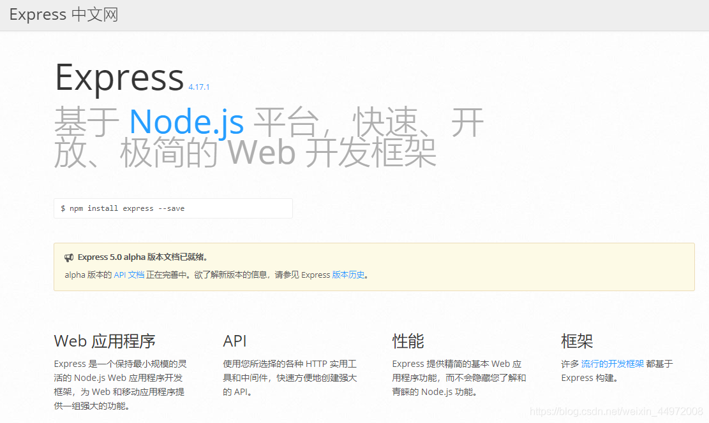
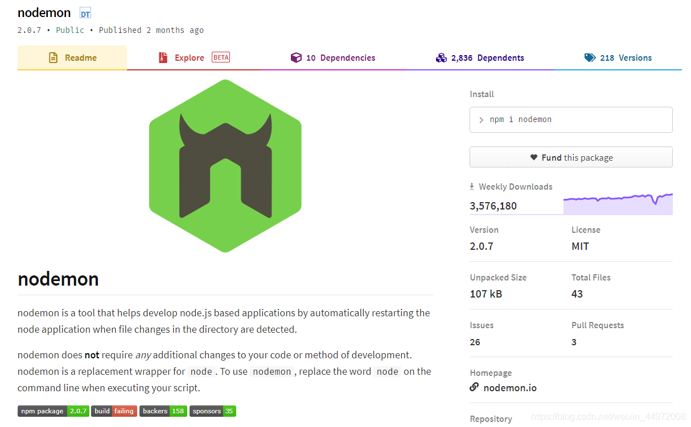
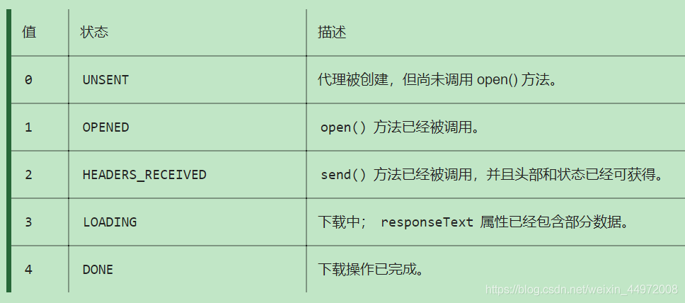
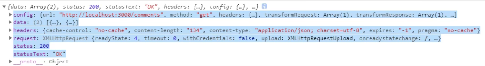

## 1. 综述

### 1.1 Ajax 简介

AJAX 全称为 Asynchronous JavaScript And XML，就是异步的 JS 和 XML。

通过 AJAX 可以在浏览器中向服务器发送异步请求，最大的优势：**无刷新获取数据**。AJAX 不是新的编程语言，而是一种将现有的标准组合在一起使用的新方式。

### 1.2 XML 简介

XML 可扩展标记语言。
XML 被设计用来传输和存储数据。
XML 和HTML 类似，不同的是HTML 中都是预定义标签，而XML 中没有预定义标签，全都是自定义标签，用来表示一些数据。

```xml
<student>
	<name>孙悟空</name>
	<age>18</age>
	<gender>男</gender>
</student>
```

现在已经被JSON 取代了。

```json
{"name":"孙悟空","age":18,"gender":"男"}
```

### 1.3 AJAX 的特点

优点

1. 可以无需刷新页面而与服务器端进行通信
2. 允许你根据用户事件来更新部分页面内容

缺点

1. 没有浏览历史，不能回退
2. 存在跨域问题(同源)
3. SEO 不友好


## 2. HTTP 请求

### 2.1 不同类型的请求及其作用

1. `GET`: 从服务器端 **读取** 数据（查）
2. `POST`: 向服务器端 **添加** 新数据 （增）
3. `PUT`: **更新** 服务器端已经数据 （改）
4. `DELETE`: **删除** 服务器端数据 （删）


### 2.2 区别 一般http请求 与 ajax请求

ajax请求 是一种特别的 http请求
对服务器端来说, 没有任何区别, 区别在浏览器端
浏览器端发请求: 只有XHR 或fetch 发出的才是ajax 请求, 其它所有的都是非ajax 请求
浏览器端接收到响应
(1) 一般请求: 浏览器一般会直接显示响应体数据, 也就是我们常说的刷新/跳转页面
(2) ajax请求: 浏览器不会对界面进行任何更新操作, 只是调用监视的回调函数并传入响应相关数据


## 3. express

### 3.1 express 基本



- https://www.expressjs.com.cn/

1. 初始化环境：`npm init --yes` 
2. 安装 express：`npm install express --save`
3. 代码边写好后，启动服务器：`node xxx.js`

服务器基本代码：

```js
// 1. 引入express
const express = require('express');

// 2. 创建应用对象
const app = express();

// 3. 创建路由规则
// request 是对请求报文的封装
// response 是对响应报文的封装
app.get('/', (request, response) => {
  // 设置响应头 设置允许跨域
  response.setHeader('Access-Control-Allow-Origin', '*');
  // 设置响应体
  response.send("Hello Ajax");
});

// 4. 监听端口，启动服务
app.listen(8000, () => {
  console.log("服务已经启动, 8000 端口监听中...");
 })
```


### 3.2 nodemon 基本

- https://www.npmjs.com/package/nodemon

一旦服务器的文件内容有修改，自动重新启动服务：



- `npm install -g nodemon`
- 安装后，使用`ndoemon server.js` 去启动程序。一旦代码发生变化，就会自动重新启动。


## 4. Ajax 使用

### 4.1 步骤

```js
// 1.创建XMLHttpRequest对象
let xhr = new XMLHttpRequest();

// 2.设置请求信息（请求行 + 请求头）
// 请求行（请求方式 + URL）
xhr.open('GET', 'http://127.0.0.1:8000/server?a=100&b=200&c=300');
// 请求头（可省略）
xhr.setRequestHeader('Content-Type', 'application/x-www-form-urlencoded');

// 3.发送请求（请求体）
xhr.send(body)
// post使用，get请求没有请求体


// 4.接收响应（事件绑定）
xhr.onreadystatechange = () => {
	// readyState 是 xhr对象中的属性, 表示状态 0 1 2 3 4
	if(xhr.readyState == 4 && xhr.status == 200){
        
        // xhr.responseXML 接收 xml格式 的响应数据
        // xhr.responseText 接收 文本格式 的响应数据
		const text = xhr.responseText;
        console.log('状态码', xhr.status); 
        console.log('状态字符串', xhr.statusText); 
        console.log('所有响应头', xhr.getAllResponseHeaders()); 
        console.log('响应体', xhr.response); 
	}
}
```


`readyState` 代表的状态：

0. －（未初始化）还没有调用 `send()` 方法；
1. －（载入）已调用 `send()` 方法，正在发送请求；
2. －（载入完成）`send()` 方法执行完成，已经发送请求，并接收到响应行和头 line + header 的信息；
3. －（解析）开始下载并解析响应体 body；
4. －（完成）响应内容下载并解析完成 / 或操作失败。




### 4.2 API 总结

- `let xhr = new XMLHttpRequest();`：创建 XHR 对象的构造函数
- `xhr.status`：响应状态码值，如 200、404
- `xhr.statusText`：响应状态文本，如 ’ok‘、‘not found’
- `xhr.readyState`：标识请求状态的只读属性 0-1-2-3-4
- `xhr.onreadystatechange`：绑定 readyState 改变的监听
- `xhr.responseType`：指定响应数据类型，如果是 ‘json’，得到响应后自动解析响应
- `xhr.response`：响应体数据，类型取决于 responseType 的指定
- `xhr.timeout`：指定请求超时时间，默认为 0 代表没有限制
- `xhr.ontimeout`：绑定超时的监听
- `xhr.onerror`：绑定请求网络错误的监听
- `xhr.open()`：初始化一个请求，参数为：(method, url[, async])
- `xhr.send(data)`：发送请求
- `xhr.abort()`：中断请求 （发出到返回之间）
- `xhr.getResponseHeader(name)`：获取指定名称的响应头值
- `xhr.getAllResponseHeaders()`：获取所有响应头组成的字符串
- `xhr.setRequestHeader(name, value)`：设置请求头


### 4.3 案例

#### 4.3.1 请求一个 json 数据响应

服务器中添加一条规则：

```js
// all  表明该规则可以适配 post get 等全部请求方式
app.all('/json-server', (request, response) => {
  // 设置响应头, 设置允许跨域
  response.setHeader('Access-Control-Allow-Origin', '*');
  // 设置响应头, 设置允许自定义头信息
  response.setHeader('Access-Control-Allow-Headers', '*');
  // 响应一个数据
  const data = {
    name: 'atguigu'
  };
  // 对象序列化为字符串
  let str = JSON.stringify(data)
  // 设置响应体 
  response.send(str);
});
```

客户端中发送 Ajax：

```js
// 1.发送请求
const xhr = new XMLHttpRequest();

// 2.初始化
xhr.open('GET', 'http://127.0.0.1:8000/json-server');
// 自动转换: 设置响应体数据的类型
xhr.responseType = 'json';

// 3.发送
xhr.send();

// 4.事件绑定
xhr.onreadystatechange = function(){
    if(xhr.readyState === 4){
        if(xhr.status >= 200 && xhr.status < 300){
            // 转化为 json 有两种方式
            // [1]手动用 JSON.parse(xhr.response)
            // [2]自动转换，在初始化是设置解析类型为：responseType
            console.log(xhr.response); // 已经自动变成 json
        }
    }
}
```


#### 4.3.2 请求超时与网络异常

```js
// 超时设置 （2秒）
xhr.timeout = 2000;
// 超时回调
xhr.ontimeout = function(){
	alert('网络超时，请稍后重试')
}
// 网络异常回调
xhr.onerror = function(){
	alert('网络异常，请稍后重试')
}

// 手动取消请求
xhr.abort()
```


## 5 跨域

### 5.1 同源策略

同源策略(Same-Origin Policy) 最早由 Netscape 公司提出，是浏览器的一种安全策略；

- 同源： 协议、域名、端口号必须完全相同

- 跨域： 违背同源策略就是跨域

### 5.2 如何解决跨域

#### 5.2.1 JSONP

JSONP 是什么

- JSONP (JSON with Padding)，是一个非官方的跨域解决方案，只支持 get 请求。

JSONP 怎么工作的？

- 在网页有一些标签天生具有跨域能力，比如：`img`、 `link`、 `iframe`、 `script`。JSONP 就是利用 `script` 标签的跨域能力来发送请求的。

JSONP 使用

```js
// 【客户端】
// 1.动态的创建一个script标签
let script = document.createElement("script");

// 2.设置script的src，设置接收数据的回调函数。
//   把回调函数名通过URL传递给服务器，让服务器调用。
script.src = "http://localhost:3000/testAJAX?callback=handle";
function handle(data) {
	console.log(data.name);
};

// 3.将script添加到body中
document.body.appendChild(script);


// 【服务器】
//  服务器返回必须是一个函数调用，这个函数客户端必须提前声明，不然无法调用
all.get("/testAJAX" , function (req , res) {
	console.log("收到请求");
	const callback = req.query.callback; 
	const obj = {
		name: "Moxy",
		age: 18
	}
    const data = JSON.stringify(obj);
    res.send(`${callback}(${data})`)      // handle(data)
});
```


#### 5.2.2 CORS

CORS（Cross-Origin Resource Sharing），跨域资源共享。CORS 是官方的跨域解决方案，它的特点是不需要在客户端做任何特殊的操作，完全在服务器中进行处理，支持 get 和 post 请求。跨域资源共享标准新增了一组 HTTP 首部字段，允许服务器声明哪些源站通过浏览器有权限访问哪些资源。


CORS 使用

- 通过设置一个响应头来告诉浏览器，该请求允许跨域，浏览器收到该响应以后就会对响应放行。

服务端：

```js
all.get("/testAJAX" , function (req , res) {
	//通过res设置响应头，允许跨域请求
	//res.set("Access-Control-Allow-Origin","http://127.0.0.1:3000");
	res.set("Access-Control-Allow-Origin","*");
	res.send("testAJAX 返回的响应");
});
```


## 6 fetch - AJAX

`fetch` 的基本使用：

请求：`fetch('URL', {init})`

响应：`.then(response => { .. })`处理响应信息

```js
fetch('http://127.0.0.1:8000/fetch-server?vip=10', {
    //请求方法
    method: 'POST',
    //请求头
    headers: {
        name: 'Nliver'
    },
    //请求体
    body: 'username=admin&password=admin'
}).then(response => {
	// 不能直接获取，而是要根据数据类型，处理后 return，在下一个 then 拿到数据。
    // return response.text();
    return response.json();
}).then(response => {
    console.log(response);
})
```


# Part Ⅱ Axios

Promise based HTTP client for  the browser and node.js.

- `npm install axios`

- `yarn add axios`


## 1 特性

- 从浏览器中创建 [XMLHttpRequests](https://developer.mozilla.org/en-US/docs/Web/API/XMLHttpRequest)
- 从 node.js 创建 [http](http://nodejs.org/api/http.html) 请求
- 支持 [Promise](https://developer.mozilla.org/en-US/docs/Web/JavaScript/Reference/Global_Objects/Promise) API
- 拦截请求和响应
- 转换请求数据和响应数据
- 取消请求
- 自动转换 JSON 数据
- 客户端支持防御 [XSRF](http://en.wikipedia.org/wiki/Cross-site_request_forgery)


### 1.1 API


| 基本方法                            | 作用                                     |
| :---------------------------------- | ---------------------------------------- |
| `axios(config)`                     | 通用/最本质的发任意类型请求的方式        |
| `axios(url[, config])`              | 可以只指定 url 发 get 请求               |
| **基本方法的别名**                  |                                          |
| `axios.request(config)`             | 等同于 `axios(config)`                   |
| `axios.get(url[, config])`          | 发 get 请求                              |
| `axios.delete(url[, config])`       | 发 delete 请求                           |
| `axios.post(url[, data, config])`   | 发 post 请求（`data` 请求体）            |
| `axios.put(url[, data, config])`    | 发 put 请求（`data` 请求体）             |
|                                     |                                          |
| axios.head(url[, config])           |                                          |
| axios.options(url[, config])        |                                          |
| axios.patch(url[, data[, config]])  |                                          |
|                                     |                                          |
| **额外配置**                        |                                          |
| `axios.defaults.xxx`                | 请求的默认全局配置                       |
| `axios.interceptors.request.use()`  | 添加请求拦截器                           |
| `axios.interceptors.response.use()` | 添加响应拦截器                           |
| **创建 axios 实例**                 |                                          |
| `axios.create([config])`            | 创建一个新的 axios (它没有下面的功能)    |
| **取消请求**                        |                                          |
| `axios.CancelToken()`               | 用于创建取消请求的错误对象               |
| `axios.Cancel()`                    | 用于创建取消请求的 token 对象            |
| `axios.isCancel()`                  | 是否是一个取消请求的错误                 |
| **并发调用 axios**                  |                                          |
| `axios.all(promises)`               | 用于批量执行多个异步请求                 |
| `axios.spread(callback)`            | 用来指定接收所有成功数据的回调函数的方法 |


### 1.2 基本方法

##### `axios(config)`

- 根据 `method` 属性值的不同，可以发送 get、post、delete、put 各种请求。
- 效果和 `axios.get()`、`axios.post()`、`axios.delete()`、`axios.put()` 相同。

```js
// 发送 POST 请求
axios({
  method: 'post',
  url: '/user/12345',
  data: {
    firstName: 'Fred',
    lastName: 'Flintstone'
  }
});

// 发送 GET 请求
axios({
  method:'get',
  url:'http://bit.ly/2mTM3nY',
})
```

##### `axios(url[, config])` 默认发送 GET 请求

```js
axios('/user/12345');
```


##### `axios.get()` 和 `axios.post()`

GET 请求：

```js
// 为给定 ID 的 user 创建请求
axios.get('/user?ID=12345')
    .then(response  => {
    console.log(response);
})

// 上面的请求也可以这样做
axios.get('/user', {
    params: {
        ID: 12345
    }
}).then(response => {
    console.log(response);
})
```

POST 请求：

```js
axios.post('/user', {
    firstName: 'Fred',
    lastName: 'Flintstone'
})
    .then(response => {
    console.log(response);
})
```


##### `axios.all()` 和 `axios.spread()`

并发执行：

```js
const getUserAccount = () => {
  return axios.get('/user/12345');
}

const getUserPermissions = () => {
  return axios.get('/user/12345/permissions');
}

axios.all([getUserAccount(), getUserPermissions()])
  .then(axios.spread((acct, perms) => {
    // 两个请求现在都执行完成
  }));
```


### 1.3 config 配置

- [axios 中文文档](http://www.axios-js.com/zh-cn/docs/index.html#axios-head-url-config)

只有 `url` 是必需的。如果没有指定 `method`，请求将默认使用 `get` 方法。

以下是常用的配置请求：

```js
{
   // 用于请求的服务器 URL
  url: '/user',

  // 创建请求时使用的方法
  method: 'get', // default
      
  // 请求头
  headers: {'X-Requested-With': 'XMLHttpRequest'},

  // `baseURL` 将自动加在 `url` 前面，除非 `url` 是一个绝对 URL。
  // URL == baseURL + url
  baseURL: 'https://some-domain.com/api/',
  
  // 跟在 URL 后面的参数
  params: {
    ID: 12345
  },
  
  // 请求体数据，只适用于 'PUT', 'POST', 和 'PATCH'
  data: {
    firstName: 'Fred'
  },
      
  // 指定请求超时的毫秒数(0 表示无超时时间)，ICU会自动中断请求
  timeout: 1000,

  // 服务器响应的数据类型：arraybuffer, blob, document, json, text, stream
  responseType: 'json', // default
}
```


以下是一般常见的配置

```js
{
//【请求拦截器】、【响应拦截器】
  // 允许在向服务器发送前，修改请求数据，用 PUT, POST 和 PATCH 方法中
  // 后面数组中的函数必须返回一个字符串，或 ArrayBuffer，或 Stream
  transformRequest: [function (data, headers) {
    // 对 data 进行任意转换处理
    return data;
  }],

  // 数据在传递给 then/catch 前，修改响应数据
  transformResponse: [function (data) {
    // 对 data 进行任意转换处理
    return data;
  }],
      
      
  // 跨域请求时是否需要使用凭证
  withCredentials: false, // default

   // `xsrfCookieName` 是用作 xsrf token 的值的cookie的名称
  xsrfCookieName: 'XSRF-TOKEN', // default

  // `xsrfHeaderName` is the name of the http header that carries the xsrf token value
  xsrfHeaderName: 'X-XSRF-TOKEN', // default

  // 'proxy' 定义代理服务器的主机名称和端口
  // `auth` 表示 HTTP 基础验证应当用于连接代理，并提供凭据
  // 这将会设置一个 `Proxy-Authorization` 头，覆写掉已有的通过使用 `header` 设置的自定义 `Proxy-Authorization` 头。
  proxy: {
    host: '127.0.0.1',
    port: 9000,
    auth: {
      username: 'mikeymike',
      password: 'rapunz3l'
    }
  },

  // `cancelToken` 指定用于取消请求的 cancel token
  cancelToken: new CancelToken(function (cancel) {
  })
}
```


### 1.4 response 响应结果



axios 请求响应的结果，包含一下信息：

```js
{
  status: 200, 			// 响应状态码
  statusText: 'OK',		// 响应字符串
  headers: {},			// 响应头
  data: {},    			// 响应体：默认会自动进行 JSON 解析

  config: {},           // 发送请求时的配置信息（请求类型、请求URL、请求体等等）
  request: {}           // XMLHttpRequest 实例对象
}
```

```js
axios.get('/user/12345')
  .then(function(response) {
    console.log(response.data);
    console.log(response.status);
    console.log(response.statusText);
    console.log(response.headers);
    console.log(response.config);
  });
```


### 1.5 默认配置

如果同一个 axios 实例，定义了多个 axios 请求，且这些请求有相同的地方，比如他们的 baseURL 都是发送给同一个域名端口，比如他们的超时时间都定义为统一的 3000。这时便可以对这一系列 axios 请求进行默认配置定义，避免了每一个 axios 请求都需要再重新定义一次，增加了重复代码。

**默认配置的优先级顺序**

- `config` 的优先级是最高的：`config` 参数配置 > `defaults` 默认属性  >  `lib/defaults.js` 库的默认值。


全局的 axios 默认值，使用 `dafaults` 属性值配置。

```js
axios.defaults.method = 'GET'
axios.defaults.baseURL = 'http://localhost:3000';
axios.defaults.params= {id:100};  // URL中传递的参数
axios.defaults.timeout = 3000;
axios.defaults.headers.post['Content-Type'] = 'application/x-www-form-urlencoded';
```


自定义实例默认值

```js
// 创建实例时，进行默认配置
const instance = axios.create({
  baseURL: 'https://api.example.com'
});

// 创建实例后，进行默认配置
instance.defaults.headers.common['Authorization'] = AUTH_TOKEN;
```


### 1.6 创建实例

##### `axios.create([config])`

可以自由创建不同的 axios 实例，从而设置 `defaults` 默认配置参数等等不会相互干涉。

当项目较大，后端提供的端口有不同的服务器时，可以根据服务器的不同分别创建对应的 axios 实例，提高效率。

```js
const instance = axios.create({
  baseURL: 'https://some-domain.com/api/',
  timeout: 1000,
  headers: {'X-Custom-Header': 'foobar'}
});
```

`instance` 实例化对象功能和 `axios` 几乎是差不多的（后面会区分），可以使用的 API：

- 发送请求的各种方法；
- 默认配置 `defaults` 属性，拦截器 `interceptors` 属性。

```js
axios.prototype.request(config)

axios.prototype.get(url[, config])
axios.prototype.put(url[, data[, config]])
axios.prototype.delete(url[, config])
axios.prototype.post(url[, data[, config]])
axios.prototype.patch(url[, data[, config]])

axios.prototype.head(url[, config])
axios.prototype.options(url[, config])
```

- 但是没有 `cancel()` 、`all()`、`CancelToken()` 的这些方法。


### 1.7 拦截器

拦截器就是一些函数，分为请求拦截器和响应拦截器。

在发送请求时，会调用请求拦截器，对所有发送的请求进行最后的处理；

- 常常在这里进行合理性判断，取消请求，修改 config 参数等等；

在接收响应时，会调用响应拦截器，对所有接收的响应进行初次的处理；

- 通常在这里对数据进行预处理，比如统一对失败的请求进行结果统计；对响应数据进行格式化处理。

```js
// 添加请求拦截器 (config, error )
axios.interceptors.request.use(config => {
    console.log("请求拦截器 成功")   	// 在发送请求之前做些什么
    return config;
  }, error => {
	console.log("请求拦截器 失败")		// 对请求错误做些什么
    return Promise.reject(error);
  });

// 添加响应拦截器 (response, error)
axios.interceptors.response.use(response => {
    console.log("响应拦截器 成功")   	// 对响应数据做点什么
    return response;
  }, error => {
    console.log("响应拦截器 失败")   	// 对响应错误做点什么
    return Promise.reject(error);
  });
```

- 内部使用 promise 实现的；
- 使用 `axios.interceptors.request.use` 和 `axios. interceptors.response.use` 方法。
- 请求拦截器的参数是（config，error），config 表示请求的配置参数；
- 响应拦截器的参数是（response，error），response 表示响应的全部结果；


拦截器的 Pomise 顺序：

```js
// 添加请求拦截器 (config, error )
axios.interceptors.request.use(config => {
    console.log("请求拦截器 成功")
	throw '参数出了问题'   // 这里让拦截器把请求状态调整为失败
  }, error => {
	console.log("请求拦截器 失败")
    return Promise.reject(error);
  });

// 添加响应拦截器 (response, error)
axios.interceptors.response.use(response => {
    console.log("响应拦截器 成功")  
    return response;
  }, error => {
    console.log("响应拦截器 失败")   
    return Promise.reject(error);
  });

// 发送请求
axios({
    method: 'GET',
    url: 'http://localhost:3000/posts'
}).then(response => {
    console.log(response)
}).catch(error =>{
    console.log(error)
})
```

此时的执行顺序：

1. axios 发送请求，`.then()` 等待 `promise`  决议；
2. Request interceptors 请求拦截器执行，
   - 输出：`请求拦截器 成功`  ；
   - throw 参数出了问题，保存在 error 中，然后 promise reject 继续失败决议；
3. Response interceptors 响应拦截器执行，
   - 输出：`响应拦截器 失败`，然后 promise reject 继续失败决议；
4. axios 请求的 `.then()` 接收到失败的 promise。
   - 输出：`参数出了问题`


拦截器的 Promise 顺序：

```js
// Promise
// 设置请求拦截器  config 配置对象
axios.interceptors.request.use(function (config) {
    console.log('请求拦截器 成功 - 1号');
    //修改 config 中的参数
    config.params = {
        a: 100
    };

    return config;
}, function (error) {
    console.log('请求拦截器 失败 - 1号');
    return Promise.reject(error);
});

axios.interceptors.request.use(function (config) {
    console.log('请求拦截器 成功 - 2号');
    //修改 config 中的参数
    config.timeout = 2000;
    return config;
}, function (error) {
    console.log('请求拦截器 失败 - 2号');
    return Promise.reject(error);
});

// 设置响应拦截器
axios.interceptors.response.use(function (response) {
    console.log('响应拦截器 成功 1号');
    return response.data;
    // return response;
}, function (error) {
    console.log('响应拦截器 失败 1号')
    return Promise.reject(error);
});

axios.interceptors.response.use(function (response) {
    console.log('响应拦截器 成功 2号')
    return response;
}, function (error) {
    console.log('响应拦截器 失败 2号')
    return Promise.reject(error);
});

//发送请求
axios({
    method: 'GET',
    url: 'http://localhost:3000/posts'
}).then(response => {
    console.log('自定义回调处理成功的结果');
    console.log(response);
});
```

- 流程: 请求拦截器2 => 请求拦截器1 => 发ajax请求 => 响应拦截器1 => 响应拦截器 2 => 请求的回调


### 1.8 取消请求

```js
axios({
    method: 'GET',
    url: 'http://localhost:3000/posts',
    // 1. 添加配置对象属性
    cancelToken: new axios.CancelToken((c) => {  
    })
})

let cancel // 用于保存取消请求的函数
const getProducts = () => {
  axios({
    url: 'http://localhost:4000/products1',
    cancelToken: new axios.CancelToken( c => { 
      // c 是用于取消当前请求的函数,保存取消函数,用于之后可能需要取消当前请求
      cancel = c;
    })
  }).then(
    response => {
      cancel = null
      console.log('请求1成功了', response.data)
    },
    error => {
      cancel = null
      console.log('请求1失败了', error.message, error) 
      // 请求1失败了 强制取消请求 Cancel {message: "强制取消请求"}
    }
  )
}

// 执行取消请求的函数
const cancelReq = () => {
  // alert('取消请求')
  if (typeof cancel === 'function'){
    cancel('强制取消请求')
  } else {
    console.log('没有可取消的请求')
  }
}
```

- 在 `axios` 中设置了 `cancelToken` 属性，然后把其中的回调函数 `cancel` 放到外部环境中。
- 当希望该请求取消时，调用 `cancel` 方法即可。
- 在请求完成、或失败后，要及时清空 `cancel` 的引用。

可以配合节流和防抖进行复习：

- 节流：技能

- 防抖：回城


## 2 Axios 封装

- https://juejin.cn/post/6968630178163458084#heading-13

- https://juejin.cn/post/6999932338566070308

- https://juejin.cn/post/6847009771606769677

看一下 react 是如何封装的


大致分为三个阶段：

**1、请求之前**

一般的接口都会有鉴权认证（token），因此在接口的请求头里面，我们需要带上token值以通过服务器的鉴权认证。

- 但是如果每次请求的时候再去添加，会大大的加大工作量，而且很容易出错。使用 axios 提供了拦截器机制，在请求的拦截器中可以添加token。

```js
// 请求拦截
axios.interceptors.request.use((config) => {
  //....省略代码
  config.headers.x_access_token = token
  return config
}, function (error) {
  return Promise.reject(error)
})
```

**2、响应之后**

请求接口，并不是每一次请求都会成功。那么当接口请求失败的时候的统一处理：

- 可以获取到服务器返回的状态码，然后根据状态码进行相对应的操作。

```js
// 响应拦截
axios.interceptors.response.use(function (response) {
  if (response.data.code === 401 ) { //
    //用户 token 失效，清空用户信息
    sessionStorage.user = ''
    sessionStorage.token = ''
    window.location.href = '/';//返回登录页
    //接口 Promise 返回错误状态，错误信息 msg
    return Promise.reject(msg)
  }
  if(response.status!==200||response.data.code!==200){
    // 接口请求失败，具体根据实际情况判断
    message.error(msg);//提示错误信息
    return Promise.reject(msg)//接口Promise返回错误状态
  }
  return response
}, function (error) {
  if (axios.isCancel(error)) {
    requestList.length = 0
    throw new axios.Cancel('cancel request')
  } else {
    message.error('网络请求失败,请重试')
  }
  return Promise.reject(error)
})
```

**3、使用axios**

我在网易云音乐项目中的封装：

`config.js` 保存一些常量。

```js
const devBaseURL = "http://123.207.32.32:9001";
const proBaseURL = "http://123.207.32.32:9001";

export const BASE_URL = process.env.NODE_ENV === "development" ? devBaseURL : proBaseURL;
export const TIMEOUT = 5000;
```

`request.js` 请求之前 + 响应之后

```js
import axios from "axios";
import { BASE_URL, TIMEOUT } from "./config";

const instance = axios.create({
  baseURL: BASE_URL,
  timeout: TIMEOUT,
});

instance.interceptors.request.use(
  (config) => {
    // 1.发送网络请求时, 在界面的中间位置显示Loading的组件
    // 2.某一些请求要求用户必须携带token, 如果没有携带, 那么取消请求，并直接跳转到登录页面s [shi]
    // 3.params/data序列化的操作
    return config;
  },
  (err) => {
    return 0;
  }
);

instance.interceptors.response.use(
  (res) => {
    return res.data;
  },
  (err) => {
    // 判断HTTP状态码，然后进行对应的操作
    if (err && err.response) {
      switch (err.response.status) {
        case 400:
          console.log("请求错误");
          break;
        case 401:
          console.log("未授权访问");
          break;
        default:
          console.log("其他错误信息");
      }
    }
    return err;
  }
);

export default instance;
```

`player.js` 的                                                                                                                                                                                                                 

```js
import request from "./request";
export function getSongDetail(ids) {
  return request({
    url: "/song/detail",
    params: {
      ids,
    },
  });
}

export function getLyric(id) {
  return request({
    url: "/lyric",
    params: {
      id,
    },
  });
}
```

调用：

```js
getSongDetail(idx).then( res => {
    console.log(res)
})

getLyric(idx).then( res => {
    console.log(res)
})
```

