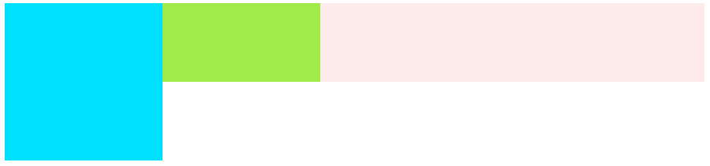
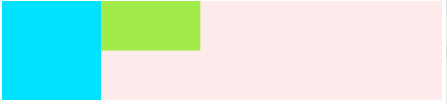
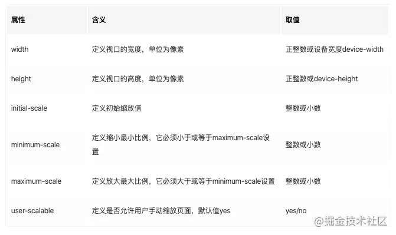
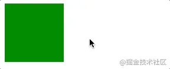
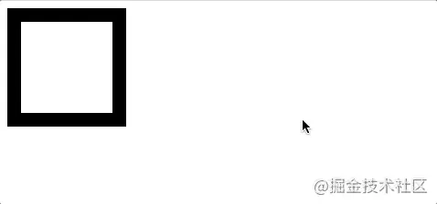

## 正常流

-   包含块类型，是通过 position 属性确定的；
-   盒类型，是通过 display 属性确定的。

### 1. 盒模型

#### 1.0 box-sizing

`box-sizing` 的作用，设置 `width` / `height` 的作用范围；

-   标准盒模型 `content-box`：默认。`width` 相当于 `content` 的宽度，只作用于 `content` 区域。
-   怪异盒模型 `border-box`：`width` 作用于 `content` + `padding` + `border` 三个区域。

默认情况下，盒子的总宽度 == `content` + `padding` + `border`，也就是 `width + padding + border`

IE 的老标准是怪异盒模型，此时的总宽度是 `width`

注意：

-   `background-color `的作用范围是 `content + padding + border`，如果 `border` 有颜色，会额外覆盖调背景色，如果 border 为透明，则 border 的颜色是 background-color。
-   box-sizing 不考虑 margin 外边距。

#### display 显示类型

设置元素的外部和内部显示类型。

-   外部显示类型：决定了该元素处在正常流中的表现：是块级元素，还是内联级元素。

-   内部显示类型：决定该元素的后代元素排版 / 布局方式：flow layout、grid、flex。

默认：

-   `static`：默认正常流 flow layout。遵循 CSS 2 系列的排版规则，是一个 BFC / IFC。

外部显示类型为`block`：

-   `block`
-   `table`：外部显示为 `block`，内部显示为 `table`。
-   `flex`：外部显示类型为 `block`，内部显示类型为 `flex`。
    -   该盒子的所有直接子元素都会成为 flex 元素，会根据弹性盒子（Flexbox）规则进行布局。
-   `grid`：同上，内部会变成 grid 盒子。

外部显示类型为 `inline`：

-   `inline`、`inline-table`、`inline-flex`、`inline-grid`：与上文对应，外部显示为 `inline`。

-   `inline-block`：外部显示类型为 `inline`，内部显示类型为 `block`，这个盒子能设置 `width` 了。

其他：

-   `list-item`：元素创建为盒子后：一个主块盒 + 一个标记盒。
-   `none`：该元素和后代都从 DOM 中删除。

#### `inline-block` 特性

内部显示类型为块级元素 block-level element，外部显示类型为行内级元素 inline-level element。

-   拥有部分 block 的性质：
    -   width、height 有效，可以设置盒子内容 content 的大小；
    -   padding、margin、border 会推开其他盒子。
    -   盒子内的文本内容，会在盒内换行，不会横向溢出盒子。
-   拥有部分 inline 的性质：

    -   盒子不会主动换行，多个内联块盒子会并排排放，和正常流一样，只有达到边界才会 “被迫” 换行；

-   
    -   如果设置了 width 内容宽度：则该盒子的宽度固定，盒内的文本一但过多，就会纵向溢出盒子。
    -   如果没有设置 width 内容宽度：则该盒子的宽度随着文本内容的增多而撑开。但如果盒子边界达到容器宽度，文本内容也会在盒子中换行。
-   总结：` inline-block` 内联块盒，也就是说，是盒子之间内联关系的，内部块级的盒子。

#### 1.2 position 定位方式

通过 position 确定盒子在环境中的具体位置、定位方式。参考包含块，通过 top, right, bottom, left 属性确定偏移量。

-   `static`：默认定位。元素按照正常流的方式排版， 盒偏移量（top, right, bottom, left 属性）无效。
-   `relative`：相对定位。先按照 **正常流排版**，然后按照 原始位置为基、盒偏移量为距离进行定位。
-   `absolute`：绝对定位。先 **脱离正常流**， 然后按照 包含块为基、盒偏移量为距离进行定位。
-   `fixed`：固定定位。先 **脱离正常流**，然后按照 包含块（绝大多数情况下是 **视口**）为基、盒偏移量为距离进行定位。
-   `sticky`：粘性定位（CSS3）。是 **相对定位** 和 **固定定位** 的混合。基于盒偏移量值进行偏移。
    -   元素在跨越特定阈值（盒偏移量）前为相对定位，之后为固定定位。
    -   其包含块必须拥有“滚动机制”：`overflow` 非 visible 元素。overflow：hidden、scroll、auto。

**包含块**

定义 '包含块' 概念的目的：确定一个元素的尺寸和位置，需要一个参照物，这个参照物是就是它的包含块。

确定一个元素的包含块的过程完全依赖于这个元素自身的 `position` 属性（与 position 知识重合）：

-   '**static**', '**relative**', '**sticky**'(CSS 3)：包含块是该元素的直系祖先块元素的内容区的边缘组成。
    -   直系祖先块元素 Block container box 其内容可以放下正常流动。
    -   内容区（盒的 content）
-   'absolute'：包含块是由它的直系的、非 `static` 的祖先元素的内边距区的边缘组成。
    -   非 'static' 的祖先元素（position: fixed, absolute, relative, sticky）
    -   内边距区（盒的 padding）
-   'fixed'：通常情况直接理解为是视口，下面是详细情况。
    -   连续媒体(continuous media)的情况下：包含块是适口 viewport；
    -   分页媒体(paged media)的情况下：包含块是分页区域 (page area)。
-   （太细了先不管）'absolute', 'fixed'：如果满足以下条件，会是直系父元素的内边距区的边缘组成。
    -   `transform` 或 `perspective` 的值不是 `none`
    -   `will-change`的值是 `transform` 或 `perspective`
    -   等等等等

Block container box，放下一个正常流，那就是 block container box，同时这个盒子会创建一个 BFC：

-   block：块
-   inline-block：内联块
-   list-item：列表
-   table-cells：表格子项
-   table-captions：表格标题
-   flex item：（CSS 3）flex 盒子项
-   grid cells：（CSS 3）grid 盒子项

#### float 与清除浮动

让元素 **脱离正常流**，沿其容器的左侧或右侧放置，容器内的其他 **文本** 和 **内联元素** 会添加 `margin` 后环绕它。

**clear 清除浮动**

**向下移动**：不允许被清除浮动的元素的左边/右边挨着浮动元素。让它移动到它左边/右边浮动元素的下面。

-   针对 float 元素：可以让该 float 元素 **不是平移** 的方式排到其他浮动元素后，而是 **另起一行拍到第一个** 。
-   针对 非 float 元素：可以让该元素的文本 / 内联元素，不是环绕 float 元素。而是将该元素的内容全部移到 float 元素的下方。同时会发生外边距折叠。

值：none、left、right、both

### 2. 格式化上下文

基本的定位方案有：

1. normal flow： 正常流。格式化上下文的方式排版内容（块级、行内级）。不浮动、不绝对定位。
    - 在正常流的块级格式化上下文中，盒子会垂直依次排列；
    - 在正常流的行内级格式化上下文中，盒子会水平依次排列。
2. float：浮动。当一个元素被定位浮动时，它会先按照正常流来摆放，然后向该行的左/右 “挪动”，会脱离正常流。
3. absolute：广义的绝对定位（absolute + fixed），当一个元素被绝对定位时，会脱离正常流。

-   Formatting context：格式化上下文
-   Block formatting context：块级格式化上下文，简称 BFC。
-   Inline formatting context：行内级格式化上下文，简称 IFC。

在一个 BFC 中，所有块级元素，会从包含块的内容块(content)顶部开始，在 **垂直方向** 依次排版。

**BFC 对 float / clear 的影响：**

-   **浮动定位** 和 **清除浮动** 时只会影响同一个 BFC 内的元素。
-   **浮动** 不会影响其它 BFC 中元素的布局，而 **清除浮动** 只能清除同一 BFC 中在它 **前 / 后面的元素** 的浮动。
-   计算 BFC 的高度时，内部的浮动元素也要参与计算（解决 float 高度坍塌）。

**BFC 对 外边距折叠的影响：**

-   外边距折叠（Margin collapsing）只会发生在属于同一 BFC 中。
-   只要是在同一个 BFC 中，块元素不论父子结构，在纵向上都会折叠。**兄弟** 、**父子** 块级元素都会发生。

**注意：IFC、flex、grid 之间都不会发生 Margin Collapse。**因为边距折叠只会发生在一个 BFC 中，如果创建了新的 BFC，就不会发生边距折叠。

#### BFC 的生成条件

-   该元素内部必须是一个 block-level element：因为内部显示类型只有是块级元素，才会生成块级格式化上下文 BFC。
-   该元素的内部可以放正常流：反情况理解，如果内部不能防止正常流（比如，块级的替换元素 img，内部不受 CSS 样式影响，flex 内部必须放置 flex-item 等），那该元素的内部就不会生成一个 BFC，而是会放置特定的内容物。

具体情况（5）：

-   `<html>` 根元素。
-   `float` 元素。
-   `position` 脱离正常流元素。`fixed`、`absolute` 固定定位、绝对定位的元素。
-   `display` 创建包含块元素：

    -   内联块和列表：`inline-block`、`list-item`
    -   表格相关：`table-cells`、`table-captions`、`table`、`inline-table`；
    -   `flex` 和 `grid` 相关：fiex item、grid cell。

-   `overflow` 非 visible 元素。overflow：hidden、scroll、auto。
    -   `overflow` 属性是当内容移除元素边框时的处理方式。

### 3. 脱离正常流

**flow**：流，是页面排版的基本规则。

基本定位方案（上文）：正常流、float、absolute (fixed、absolute)

定义：

当一个元素的定位方案是 **浮动**、**绝对定位(absolute & fixed)** 或 **根元素**，那它会在当前正常流（标准文档流）之外，此时该元素可视为流外元素。

特点：

1. 每一个流外元素的内部，都会产生一个新的流。
2. 如果 A 元素内部的正常流中，有一个 B 元素脱离 A 内部的正常流，则 B 元素被当成流外元素，B 元素内正常流下的内容已不属于 A 元素的流。B 元素属于 A 元素的流。
3. **新的流内部，会创建一个新的 BFC。而创建新的 BFC，并不一定要通过脱离文档正常流实现。**

### 4. 高度坍塌和清除浮动

高度坍塌：指父元素本来应该包括子元素的高度，但是实际上父元素比子元素的高度要小。

-   视觉效果上：父元素没有包裹上部分子元素，导致子元素高度高于父元素。
-   本质上：子元素的包含块本就不是视觉上的父元素。脱离正常流后，自然溢出。

```html
<style>
    .container {
        background: rgb(253, 234, 234);
    }

    .box1 {
        float: left;
        width: 200px;
        height: 200px;
        background-color: rgb(0, 225, 255);
    }

    .box2 {
        width: 400px;
        height: 100px;
        background: rgb(160, 235, 74);
    }
</style>

<div class="container">
    <div class="box1"></div>
    <div class="box2"></div>
</div>
```



出现 `container` 高度坍塌的原因：

1. `box1` 设置为浮动，脱离了当前正常流，移动到当前位置的左边。
2. `container` 内失去了 `box1` 的占位，所以高度参考 `box2`，出现了高度坍塌。
    - `box1` 的包含块不是 `container`，而是根元素 `html`。`container` 自然无法包裹脱离正常流的 `box1`。

#### 解决方式一：BFC

`container` 设置 `overflow：auto` 其内部创建了一个 BFC，根据规则 BFC 的高度计算需要参考 `float` 元素，所以元素会被撑开。

-   只要让 `container` 成为 `box1` 的包含块即可撑开 `container` 的高度。
-   因为 `container` 创建了一个 BFC，此时 `box1` 的包含块就是 `container` 了，所以 `container` 自然被 `box1` 撑开

#### 解决方式二：clear float

`clear` 清除浮动，会让被清除浮动的元素移动到浮动元素的下方。那么我们通过 CSS 创建一个内容为空的伪元素，然后让他清除浮动，就可以解决这个

-   注意这个伪元素必须设置为 `block`，否则变成内联了，无法撑开。
-   `::after` 会为选中元素的 **内容的最后位置** ，添加一个 **新元素**。在这里其实是对 `container` 容器内 **添加了一个子元素** 。

```css
.container::after {
    content: "";
    display: block;
    clear: both;
}
```



# 常见问题

## CSS 的继承

#### 常见非继承属性

1. 盒模型：float, margin, padding, border
2. 块级尺寸：height，width，max-height, min-height, max-width, min-width
3. 位置：display、position、left、right、top、bottom
4. 背景属性：background
5. 生成内容：content
6. 层叠：z-index
7. 文本效果：text-shadow

#### 常见可继承属性

1. 字体系列：font-family，font-size
2. 文本系列：text-indent，line-height，color
3. 元素可见性：visibility
4. 表格布局：border-style
5. 列表布局：list-style list-style-type
6. 光标属性：cursor

## **CSS 单位**

### 长度单位

-   相对长度单位：
    -   相对字体长度单位：em、ex、rem、ch；
    -   相对视区长度单位：vh、vw、vmin、vmax；
-   绝对长度单位：px、(剩余非常少见:) pt、cm、mm、pc 等。

相对字符长度：

font-size 指定字符的大小。

-   ex：是相对字符 x 高度。**相对于父元素的字体大小**。

-   em：是相对字符 m 的宽度，也是汉字的宽度和高度。即一个字模的宽度。根据不同的英文字体，宽度会发生变化。但中文通常一个汉字正好是一个 m 的宽度和高度。**相对于父元素的字体大小**。

-   rem：root 的 em。1 rem 和根字符大小一样，**相对于根元素字体的大小。**
-   ch：是阿拉伯字母 0 的宽度。等宽字体。

### px、em、rem 区别

1. `px`：固定的像素，一旦设置了就无法因为适应页面大小而改变，且不会随着屏幕分辨率而改变。
2. `em` ：相对其父元素来设置字体大小。
3. `rem`：相对于 `<html>` 根元素来设置字体大小。
4. `30%`：如果要设置多列布局，使用百分号是更好的选择。但是 `%` 的计算非常困难。

**`em`：**

-   元素字体的 `em`，是相对于 **父元素** 字体大小 `font-size`；
-   元素的 `width`/`height`/`padding`/`margin`的 `em`，是相对于 **该元素** 的字体大小 `font-size`；

**`rem`：**

-   **全部的长度都相对于根元素**。

-   通常做法是给 `html` 元素设置一个字体大小，然后其他元素的长度单位就为 `rem`。

结论：`em` 的计算值是基于父元素的，不同元素的参照物不一样（都是该元素父元素），所以在计算的时候方便，相比之下 `rem` 就只有一个参照物（html 元素），这样计算起来更清晰。

### vw / vh 和 % 区别

CSS3 的新特性，与视图窗口有关

-   `vw`、`vh`： 相对于视图窗口的宽度，相对于视图窗口的高度。
-   `%`：大部分相对于祖先元素，也有相对于自身的情况比如（border-radius、translate 等)，计算复杂。

| 单位 | 含义                                 |
| ---- | ------------------------------------ |
| vw   | 相对于视窗的宽度，视窗宽度是 `100vw` |
| vh   | 相对于视窗的高度，视窗高度是 `100vh` |
| vmin | vw 和 vh 中的较小值                  |
| vmax | vw 和 vh 中的较大值                  |

`px` 如何转化为 `vw`：

-   `1px = （1/375）*100 vw`，假设使用 iPhone X 的 `375px` 作为视口宽度。

总结：`vm vh` 在 IE 和 Opera 的兼容性存在问题。但搭配 flex 效果更好。

### px 和视口

**1 像素**

| 像素     | 区别                                                                                                                                                            |
| -------- | --------------------------------------------------------------------------------------------------------------------------------------------------------------- |
| css 像素 | 逻辑分辨率 `px`，为 web 开发者提供，在 css 和 html 中使用的一个抽象单位。<br />移动设备分辨率的不同，会有 Dpr2，Dpr3 等等几倍屏，会放大像素点，获得更清晰效果。 |
| 物理像素 | 物理分辨率，只与设备的硬件密度有关，任何设备的物理像素都是固定的。                                                                                              |

**2 视口**

浏览器显示内容的屏幕区域。

布局视口（layout viewport）：网页内容的实际尺寸；

视觉视口（visual viewport）：浏览器可展示页面的尺寸；

-   在 PC 端可以改变浏览器尺寸，而在移动端视觉视口就是其设备屏幕的大小。

所以最佳情况下，要把布局视口和视觉视口的宽度 `1:1` 匹配。电脑的布局视口默认为：980px

下面是我在 Flower Library 项目中的划分：

```css
/* 对屏幕在 0~768px, 768~992px, 992~1140px 分辨率设置自己的css。 */
@media (min-width: 768px) {
    .form-cell_title {
        margin: 2.5rem;
    }
}
@media (min-width: 992px) {
    .form-cell_title {
        margin: 3.2rem;
    }
}

@media (min-width: 1140px) {
    .form-cell_title {
        margin: 3.2rem;
    }
}
```

典型设备的尺寸：

-   iPhone 5：`320px`、iPhone X：`375px`
-   iPad：`768px`、iPad Pro：`1024px`
-   电脑：`1024px`

所以最佳的划分：

-   `768px` 以下是移动手机端；
-   `768px` ~ `1024px` 是平板；
-   `1024px` 以上是笔记本，`1440px` 是更大尺寸的笔记本。

移动端的视口适配：

```html
<meta
    name="viewport"
    content="
  width=device-width; 
  initial-scale=1; 
  maximum-scale=1; 
  minimum-scale=1; 
  user-scalable=no;
"
/>
```



## 响应式布局

一共有 5 个手段，可以配合使用：

1. 使用 CSS3 的媒体查询 `@media`：
    - 优点：根据不同显示设备宽度，设定不同的页面样式，非常方便直观。比如可以通过 @media 设置不同尺寸的图片。
    - 缺点：通常一个屏幕宽度，就需要配套一个 @media 样式。如果页面构成复杂，则**需要改变的样式太多**，那么多套样式代码会很繁琐。
2. 使用 `%` 百分比，来做栅格系统。
    - 优点：不用像 @media 一样设置多套样式；
    - 缺点：计算起来复杂。如果只计算 width 和 height 还行，他们是父元素的宽高百分比；而其他如果 padding、margin、border-redius 等等属性，百分比的参考值是完全不同的。
3. 使用 CSS3 的视口单位 `vm/vh`。
    - 优点：设计原理与百分比布局类似，也是栅格系统。视口宽度和高度都是 100 个单位，解决了计算复杂的问题。
    - 缺点：对 IE 和 Opera 可能存在兼容性问题。
4. 使用 `em`。
    - 缺点：`em` 是相对于父元素的字体大小 font-size，存在不易察觉的继承问题。
5. 使用 `rem` 改进 `em`。
    - 优点：`rem` 是相对于根元素 `html` 的字体大小 font-size，解决了 `em` 的计算复杂问题。
    - 缺点：我觉得 `rem` 配合媒体查询，是挺好用的 …可能存在 JS 代码对 `rem` 动态计算转换为 `px` 有点绕。但是现在也有对应的自动转换工具。

## **flex 属性**

主轴（4）：

-   `flex-flow` == `flex-direction + flex-wrap`；
-   `justify-content`、`align-content`；

交叉轴（1）+ 间隙（3）：

-   `align-items`；
-   `gap` == `row-gap` + `column-gap`；

flex item（6）：

-   `flex` == `flex-grow` + `flex-shrink` + `flex-basis`；
-   `align-self`， `order`

🍊 **1 主轴布局**

-   `flex-direction`：主轴方向。
    -   row、row-reverse、column、column-reverse。主轴方向向右、向左、向下、向上。
-   `flex-wrap`：是否换行。
    -   nowrap、wrap、wrap-reverse。不换行、换行、反方向换行（如果默认交叉轴向下，则会向上换行）
-   `flex-flow`：`主轴方向 + 换行` 的简写。
    -   `<flex-direction> || <flex-wrap>`
-   `justify-content`：主轴方向上，各 item 的布局方式。解决主轴方向的 item 剩余空间。
    -   flex-start、flex-end、center、space-between、space-around、space-evenly。
    -   主轴起点开始、终点开始、居中、两端对齐、平均分布在 item 两边、空隙全部平均分布。
-   `align-content`：当 item 在容器中出现折行时，如何解决在交叉轴方向的容器内剩余空间。

🍊 **2 交叉轴布局**

-   `align-items`：交叉轴方向，各 iitem 的布局方式。解决交叉轴方向的 item 剩余空间。
-   ![image-20211122165506460[20]](images/HTML&CSS.assets/image-20211122165506460.png)

🍊 **3 item 属性**

-   `flex-grow`、`flex-shrink`：设置 item 的拉伸 / 收缩比例。`number`，defalue 1

![image-20211122164827115[20]](images/HTML&CSS.assets/image-20211122164827115.png)

-   `flex-basis`：兼容性差，分配剩余空间之前的默认尺寸。
    -   `auto`：参考我的宽高属性。或者是 `% 、rem` 等等
-   `flex`：`flex-grow + flex-shrink + flex-basis` 的集合。
-   `align-self`：单个 flex item 纵向的排版：auto | flex-start | flex-end | center | baseline | stretch。

![image-20211122164851842[20]](images/HTML&CSS.assets/image-20211122164851842.png)

-   `order`：对单个 item 进行排序。

![image-20211122164750330[20]](images/HTML&CSS.assets/image-20211122164750330.png)

🍊 **4 间隙**

-   `row-gap`, `column-gap`：flex item 之间的空隙，在计算剩余空间之前应用。
-   `gap` ：是 上面两个的简写。

![image-20211122165252887[20]](images/HTML&CSS.assets/image-20211122165252887.png)

## 7 居中对齐

### 7.1 垂直居中

🍊 **方法一：正常流**

**单行内容**：把 height 和 line-height 设置为相同的尺寸，就可以实现单行文字 + 图片的近似垂直居中的效果：

-   如果文字长度一旦过多，出现了折行，此时因行间距 line-height 的影响，就会溢出粉色盒子。

```html
<div>我在这里近似垂直居中了</div>
<style>
    div {
        height: 100px;
        width: 200px;
        line-height: 100px;
        background-color: pink;
    }
</style>
```

![image[20]](images/HTML&CSS.assets/%E6%88%AA%E5%B1%8F2021-08-05%20%E4%B8%8B%E5%8D%8810.36.08.png)

**多行内容：**

1.  span 设置为 inline-block，已确保内部可以拥有自己的行间距。同时设置自己的行间距为 30px。
2.  div 行间距设置为 200px，利用宽度为 0 的 strut 支撑节点，把 div 的高度撑起来的同时，此时 “文字的中线” 也在盒子的近似中间水平。
    -   **明确一点：** div 作为一个 block 是不需要行高的，它设置 line-height 就是为了子内联元素的继承。最直接的，宽度为 0 的 strut 支撑节点继承了这一属性。
    -   父容器最开始会有一个不可见的、0 宽度的、透明节点行内盒子,官方称它 strut。
3.  span 此时设置上下居中对齐，也就是 `vertical-align: middle;` 那么它就会寻找所在父元素的 “文字的中线” 去对齐。最终效果就是水平近似居中对齐。

```html
<div>
    <span>我居中了吗？我居中了吗？我居中了吗？我居中了吗？我居中了吗？我居中了吗？我居中了吗？我居中了吗？我居中了吗？我居中了吗？我居中了吗？ </span>
</div>
<style>
    div {
        line-height: 200px;
        background-color: pink;
    }

    span {
        display: inline-block;
        line-height: 30px;
        vertical-align: middle;
    }
</style>
```

![image[30]](images/HTML&CSS.assets/%E6%88%AA%E5%B1%8F2021-08-06%20%E4%B8%8A%E5%8D%8811.21.32.png)

**图片 + 文字的垂直居中：**

```html
<div>我居中了吗？</div>
<style>
    div {
        height: 400px;
        line-height: 400px;
        background-color: pink;
    }

    img {
        vertical-align: middle;
    }
</style>
```

**`vertical-align` : 文字和图片等内联元素的居中，是参考 “文字的中线”，而不是盒子实际尺寸的中线。**

-   如果上面的 `div` 只设置了尺寸高度 `height`， 而没有设置文字行高 `line-height`，就无法达到垂直居中的效果。


绝对垂直居中：

```css
.parent::after,
.son {
    display: inline-block;
    vertical-align: middle;
}
.parent::after {
    content: "";
    height: 100%;
}
```

🍊 **方法二：`Flex Box`**

```css
.parent {
    display: flex;
    align-items: center;
}
```

🍊 **方法三：绝对定位**

`transform`

```css
.son {
    position: absolute;
    top: 50%; /* 向下移动包含块height的50% */
    transform: translate(0, -50%); /* 向上移动自身height的50% */
}
```

`top: 50%`

```css
.son {
    position: absolute;
    top: 50%; /* 向下移动包含快高度的50% */
    height: 高度; /* 定义好自己的高度 */
    margin-top: -0.5高度; /* 向上移动自身高度的50% */
}
```

### 7.2 水平居中

🍊 **方法一：正常流**

行内元素

```css
.parent {
    text-align: center;
}
```

块级元素

```css
.son {
    margin: 0 auto;
}
```

🍊 **方法二：`Flex Box`**

```
.parent {
    display: flex;
    justify-content: center;
}
```

🍊 **方法三：绝对定位**

`transform`

```js
.son {
    position: absolute;
    left: 50%;
    transform: translate(-50%, 0);
}
```

`left: 50%`

```css
.son {
    position: absolute;
    width: 180px;
    left: 50%;
    margin-left: -90px; /* 总宽度的一半*/
}
```

`left/right: 0`

```css
.son {
    position: absolute;
    width: 180px;
    left: 0;
    right: 0;
    margin: 0 auto;
}
```

### 7.3 水平 + 垂直居中

三种方法：

-   `Flex Box`：`parent` === `justify-content: center;` + `align-items: center;`

-   绝对定位： `transform`
-   绝对定位：`left / top: 50%`；

```css
.son {
    position: absolute;
    left: 50%;
    top: 50%;
    transform: translate(-50%, -50%);
}

.son {
    position: absolute;
    width: 180px;
    left: 50%;
    top: 50%;
    margin-left: -90px;
    margin-top: -90px;
}
```

## **🍊 元素的隐藏**

-   `display: none;`
    1. DOM 结构：在 DOM 中，不会渲染，不占据正常流的空间；
    2. DOM 事件监听：❌
    3. 性能：动态改变此属性时会 **引起重排重绘**，性能较差；
    4. 继承：不会被子元素继承，毕竟子类也不会被渲染（直接没，不存在继承问题了）；
    5. `transition`：`transition` 不支持 `display`。
-   `visibility: hidden;`
    1. DOM 结构：会渲染，不会消失，占据空间；
    2. DOM 事件监听：❌
    3. 性能：动态改变此属性时会 **引起重绘**，性能较高；
    4. 继承：会被子元素继承，子元素可以通过设置 `visibility: visible`; 来取消隐藏；
    5. `transition`：`visibility` 会立即显示，隐藏时可以延时
-   `opacity: 0;`
    1. DOM 结构：透明度为 100%，会渲染，不会消失，占据空间；
    2. DOM 事件监听：✅
    3. 性能：提升为合成层，**不会触发重绘**，性能较高；
    4. 继承：会被子元素继承，子元素并不能通过 `opacity: 1` 来取消隐藏；
    5. `transition`：`opacity` 可以延时显示和隐藏

**文本的隐藏**

**利用字号**：`font-size: 0` 文字就会在视觉层隐藏，但是屏幕阅读设备、DOM 流中依然存在；

**利用缩进**：`text-indent` 设置为一个非常大的负值，则改行文本会因溢出盒子，甚至 html 页面而消失不见。但是会出现溢出容器问题。

```css
.hide-text {
    text-indent: 100%; /* 百分比相对于包含块来决定的，100%则正好让文本想左移动了包含块的长度 */
    white-space: nowrap; /* 规定文本不换行，这样该段落的所有文字都可以利用缩进移动到最左边，消失不见 */
    overflow: hidden；; /* 解决溢出容器的问题 */
}
```

**盒子的隐藏**

`z-index` 层叠上下文。当层叠上下文内的某个父元素拥有一个背景色，那把要隐藏的元素的 z-index 设置为负值便可以达到效果隐藏 / 遮挡的效果。这是一个可访问性隐藏。对原来的布局、以及元素的行为没有任何影响。

**图片的隐藏**

`clip` 利用裁剪效果。可以达到隐藏的效果，但缺点是元素需要绝对定位。focus 控件焦点也会有细微问题。

## 9 CSS3 新特性

文字相关的属性：

column：文本的多栏布局，定义一共有几栏；

column-gap：文本的多栏布局，定义两个栏间隔的宽度；

column-span：文本的多栏布局，定义该元素实现跨栏（通常是文中的小标题）；

text-feature-settings：控制 OpenType 字体中的高级印刷功能。

font-variant-numeric：控制数字，分数和序号标记的替代字形

font-kerning：使用字体中储存的字距信息。

text-shadow：为文字添加阴影。阴影值由元素在 X 和 Y 方向的偏移量、模糊半径和颜色值组成。

## CSS 选择符

**🌈 1 基本选择符**

元素选择符： `p`

ID 选择符：`#myId`

类选择符：`.myClass`

通用选择符：`*` 选择所有元素。

后代选择符： `[空格]` ，如 `blockquote p` 则选择了块引用的 **所有** p 后代（子后代、子孙后代全部包括）。

多选：`, ` ，用逗号连接，则表示连续选择多个元素，同时应用相同的 CSS 属性。

**🌈 2 高级选择符**

子选择符：`>` ，如 `#nav > li` 选择了 id 为 nav 的 li 元素的 **直接后代** 的 **全部元素 li**。

相邻同辈选择符：`+`，如 `h2 + p` 只选择了 h2 元素 **后面** 的、拥有 **共同父元素** 的 **一个元素** p。

一般同辈选择符：`~`，如 `h2 ~ p` 会选择 h2 元素 **后面** 的、拥有 **共同父元素** 的 **全部元素** p。

**🌈 3 属性选择符**

属性选择符 1 ：`标签名[属性名]` ，比如 `abbr[title]`。表示选择所有这些属性：`<abbr title="xxxx">`。

属性选择符 2 ：`标签名[属性名="属性值"]`，如 `abbr[title="a"]`。选择这些属性：`<abbr title="a">`。

要匹配以某些字符开头的属性值：等号前加 `^`，如 `a[href^='http:']`

要匹配包含某些字符的属性值：等号前加上 `$`，如 `img[src$=".png"]`

要匹配以空格分隔的字符串中的属性值：等号前加上 `~`，如 `a[rel~=next]`

要匹配开头指定值或指定值后连接一个短线：`|`，如 `a[lang|=en]` ，可以匹配属性值为 en 或 en-us。

**🌈 4 伪元素和伪类**

伪类和伪元素可用来修饰不在文档树中的部分。这样做通常是为了不想给页面添加额外的标记，但又想创建 / 选择一些元素。

-   **伪类** `:` 是 **选择元素**，**伪元素** `::` 是 **创建元素**。

**4.1 伪类**

通过伪类选择器，可以找到那些不存在 DOM 树中的信息，或者不能被常规 CSS 选择器获取到的信息。

-   状态伪类：获取不存在与 DOM 树中的信息。比如 a 标签的 `:link`、`visited`，这些信息不存在与 DOM 树结构中，只能通过 CSS 选择器来获取；

-   结构化伪类：获取不能被常规 CSS 选择器获取的信息。比如：获取第一个子元素，无法用常规的 CSS 选择器获取，只能通过 `:first-child` 获取。

状态伪类

-   未访问过的链接，或其他可交互元素：`a:link`
-   访问过的链接，或其他可交互元素：`a:visited`
-   鼠标悬停 、 键盘聚焦的链接，或其他可交互元素：`a:hover`、`a:focus`
-   活动状态的可交互元素：`a:active`

-   注：存在样式覆盖，伪类需按序定义：`:link`, `visited`, `:hover`, `:focus`, `:active`。

结构化伪类：

-   `:not()`：反选

-   `:target`：目标，选中：URL 中有 `...index.html#section2` 锚点，且 DOM 中有元素 id 为锚点名。

-   `:nth-child()`：找到当前元素的所有兄弟元素，然后排序，最后根据入参匹配。

-   `:nth-last-child()` ：属性值和 `:nth-child()` 相同，只不过它是倒着数。

-   `:nth-of-type(n)`：匹配指定类型的第 N 个兄弟元素，**与元素类型有关**。可使用表达式。

    -   如 `.myDiv p:nth-of-type(3)`：匹配 class 值为 myDiv 内的第 3 个 p 元素。

-   `:first-child` 相当于 `:nth-child(1)`
-   `:last-child` 相当于 `:nth-last-child(1)`

**4.2 伪元素**

伪元素用于创建一些 **不在文档树中的元素**，并为其添加样式。

-   `::before`：在选中元素的 **内容（content）** 的前面插入一个伪元素。**（内部的开头添加一个子元素）**
-   `::after`：在选中元素的 **内容（content）** 的后面插入一个伪元素。**（内部的末尾添加一个子元素）**

## 12. CSS 优先级

当出现多条规则同时选择一个元素的情况时，通过 层叠 的机制来处理这种冲突。

层叠机制的重要性级别从高到低如下所示：

1. `!important` 标注的用户样式；
2. `!important` 标注的网页样式；
3. 网页样式；
4. 用户样式；
5. 浏览器的默认样式。

给用户的 `!important` 标注提升为最高权重，主要出于无障碍交互的需要。比如，允许阅读困难的用户使用高对比度的用户样式表。

#### 特殊性

在满足上文层叠规则后，再按照选择符的特殊性排序。特殊性更高的选择符会覆盖特殊性、低的选择符。如果两条规则的特殊性相等，则后定义的覆盖之前的规则。

任何选择符的特殊性都对应于 4 个级别，按照权重由大到小依次是：

1. 行内样式，记为 1；
2. ID 选择符
3. class 类选择符、伪类选择符、属性选择符
4. type 元素类型选择符、伪元素选择符

| 选择符                                                   | 特殊性     |                                      |
| -------------------------------------------------------- | ---------- | ------------------------------------ |
| `style="xxx"`                                            | 1, 0, 0, 0 |                                      |
| `#myContainer #content {}`                               | 0, 2, 0, 0 |                                      |
| `div #content {}`                                        | 0, 1, 0, 1 |                                      |
| `div p {}`                                               | 0, 0, 0, 2 |                                      |
| `#content > [id="main"] .new:nth-of-type(1) h2.first {}` | 0, 1, 4, 1 | 依次是：<br />100, 10, 10, 10, 1, 10 |
| `div > #main > h2 {}`                                    | 0, 1, 0, 2 | 依次是：1, 100, 1                    |

-   注 1 ：`*` 通用选择符的权重最小，可以看似是 0。
-   注 2 ：继承而来的样式没有权重，所以即使是权重最小的 `*` 通用选择符也能轻易覆盖继承的样式。

```html
<h2>这段话的字体是红色的，但是紧跟后面的 em 是黑色的。<em>我是黑色的</em></h2>

<style>
    * {
        color: black;
    }
    h2 {
        color: red;
    }
</style>
```

## CSS 特效 / 动画

**CSS 动画 精简版总结**

`animation` 动画：关键帧、往复性；

`transition` 过渡：属性、触发动作、一次性；

`transform` 变形：改变 CSS 形状的属性。

| 属性               | 含义                                                                                                               |
| ------------------ | ------------------------------------------------------------------------------------------------------------------ |
| animation（动画）  | 用于设置动画属性，他是一个简写的属性，包含 6 个属性，比 `transition` 更强大。                                      |
| transition（过渡） | 用于设置元素的样式过度，和 `animation` 有着类似的效果，但细节上有很大的不同                                        |
| transform（变形）  | 可以把元素静态旋转、缩放、移动，和设置样式的动画并没有什么关系，<br />就相当于 color 一样用来设置元素的 “外表样式” |
| translate（移动）  | translate 只是 transform 的一个属性值，即移动。除此之外还有 `scale` 等                                             |
| scale （缩放）     | transform 的一个属性值                                                                                             |

#### transition 过渡

比如一个属性的背景色从 `红色` 变为 `黑色`，就是一种过渡。

-   过渡有三个要素：开始状态、结束状态、过渡触发点

-   `@media`、`:hover`、`:focus` 等等，都是过渡的触发点。

`transition` 的要点：

-   一条 `transition` 规则，只能定义一个属性变化；
-   只能定义开始和结束状态，没有中间状态；
-   需要事件触发（比如 `:hover`），无法自动触发；

语法：`transition: property duration timing-function delay;`

| 值                | 描述                       |
| ----------------- | -------------------------- |
| `property`        | 要实现的过渡效果           |
| `duration`        | 过渡的时间（s / ms）       |
| `timing-function` | 速度曲线                   |
| `delay`           | 触发后，过渡延迟执行的时间 |

```css
/* 给box定义一个"过渡动画"：变形 1s完成 缓进 推迟1s执行 */
.box {
    transition: transform 1s ease-in 1s;
}
/* "变形"的触发时机是 :hover，180旋转+长宽缩小0.5*/
.box:hover {
    transform: rotate(180deg) scale(0.5, 0.5);
}
```

-   `transition` 产生动画的条件是 `transition` 设置的 `property` 发生变化，也就是这里的第一个属性值（`transform` 变形）。



#### animation

通过自定义动画组合，实现了`animation` 的多个 `transition` 的效果叠加，并且可操作性更强。

animation 是 8 个属性的简写：以下属性如果单独写，要加 `animation-xxx`：
`animation: name duration timing-function delay iteration-count direction play-state fill-mode;`

| 值              | 描述                                                                                                                                                                                                                                                      |
| --------------- | --------------------------------------------------------------------------------------------------------------------------------------------------------------------------------------------------------------------------------------------------------- |
| name            | 与 `@keyframes` 定义的动画名称一致，调用定义好的动画；                                                                                                                                                                                                    |
| duration        | 执行动画的总时间；                                                                                                                                                                                                                                        |
| timing-function | 速度曲线，应用在每一个小动画上，而不是整体应用一次；                                                                                                                                                                                                      |
| delay           | 整个 animation 执行动画之前等待的时间；                                                                                                                                                                                                                   |
| iteration-count | 动画的播放次数，具体(`number`) / 无线(`infinite`)                                                                                                                                                                                                         |
| direction       | 动画播放方向：<br />normal (按时间轴顺序)，<br />reverse (时间轴反方向运行)<br />alternate (轮流，即来回往复进行)<br />alternate-reverse (动画先反运行，再轮流往复执行)                                                                                   |
| play-state      | 控制动画的暂停和继续：running (继续)，paused (暂停)                                                                                                                                                                                                       |
| fill-mode       | 控制动画结束后元素的样式，有四个值：<br />none (动画开始的状态)，<br />forwards (动画结束的状态)，<br />backwards (动画第一帧的状态)，<br />both (根据 direction 轮流应用 forwards 和 backwards )，<br /> 注意与 iteration-count 不要冲突(动画执行无限次) |

相比 transition，animation 的优点：

-   一个动画可以有多个中间节点，每个节点都能定义自己的样式；
-   动画可以指定执行次数、可以暂停和继续，可以自动执行，不需要触发机制。
-   可以指定动画结束后是否恢复样式；
-   可以指定动画的播放形式。

```css
.box {
    height: 100px;
    width: 100px;
    border: 15px solid black;
    animation: changebox 1s ease-in-out 1s infinite alternate running forwards;
}

.box:hover {
    animation-play-state: paused;
}

@keyframes changebox {
    10% {
        background: red;
    }
    50% {
        width: 80px;
    }
    70% {
        border: 15px solid yellow;
    }
    100% {
        width: 180px;
        height: 180px;
    }
}
```

-   定义了一个 `changebox` 的动画组合。组合中通过百分比的形式，定义了每个阶段需要达成的 “目标”。
-   动画在 `:hover` 后，设置为 `paused` 会暂停。



## 问题

### clientX/Y, screenX/Y, offsetX/Y

**这些值都是只读的**。都是检测鼠标位置的参数。

-   `MouseEvent.clientX / clientY`：鼠标位置相对于**浏览器窗口左上角**的水平 / 垂直坐标（单位像素）。
    -   有别名：`MouseEvent.x`和`MouseEvent.y`。
-   `MouseEvent.screenX / screenY`：鼠标位置相对于**屏幕视口左上角**的水平 / 垂直坐标（单位像素）。
-   `MouseEvent.offsetX / offsetY`：鼠标位置与 **目标节点左上边缘 (padding)** 的水平 / 垂直距离（单位像素）。
-   `MouseEvent.pageX / pageY`：鼠标位置与 **文档左上边缘的距离**（单位像素）。
    -   包括文档不可见的部分。

## 判断页面滚动到底部并加载更多数据？

```javascript
window.onscroll = function (e) {
    const { scrollHeight, scrollTop, clientHeight } = document.documentElement;

    if (clientHeight + scrollTop >= scrollHeight) {
        console.log("==加载更多==");
    }
};
```

**如果：视口高度 + 已滚动高度 >= 网页高度**，表明视口已经滑动到网页底部，需要额外加载网页。

```js
// 网页的总高度
document.documentElement.scrollHeight;
document.body.scrollHeight;

// 网页已经滚动的高度
document.documentElement.scrollTop;

// 当前视口的高度 / 浏览器高度
document.documentElement.clientHeight;
// == window.innerHeight - 水平滚动条高度
```

-   `Element.scrollHeight` 得到一个整数值（小数会四舍五入），表示当前元素的总高度（单位像素），包括溢出容器、当前不可见的部分。包括 padding，但是不包括 border、margin 以及水平滚动条的高度（如果有水平滚动条的话），还包括伪元素（::before 或::after）的高度。
-   `Element.scrollTop` 表示当前元素的**垂直滚动条向下滚动的像素数量**。如果没有滚动条，该属性为 0。
-   `document.documentElement.clientHeight` 表示当前视口的高度（即浏览器窗口的高度），等同于 window.innerHeight 属性减去水平滚动条的高度（如果有的话）。
-   `document.body.clientHeight` 的高度则是网页的实际高度。

## 如何画 0.5px 的线

在一个 1080p 的屏幕上，它的像素数量是 1920 \* 1080，即横边有 1920 个像素，而竖边为 1080 个。

Mac 在 4k 显示器，默认分辨率为 1080p，它的 dpr = 4，即长和宽用 4 个像素表示 1 个像素。

所以，设置 0.5px 的线，在这台显示器上用 2 个像素表示，显示更细，有美观效果。

方案一：直接设置 `0.5px`，浏览器会对不满足 `1px` 的进行四舍五入，不同内核的解决方案还不同。

方案二：`height: 1px + transform: scaleY(0.5)` 有些浏览器的显示会变虚。

方案三：在 2 基础上，额外添加 `transform-origin: 50% 100%` 让缩放的基点往下移动 50%

方案四：使用 SVG 绘制一个 0.5px 的线。

```css
<div class="line"></div>

/* 方案三 */
height: 1px;
transform: scaleY(0.5);
transform-origin: 50% 100%;
```

## link 和 @import 的区别

CSS 有 4 种引入方式：

-   **内联样式**：即行内样式，通过标签的 style 属性，在标签上直接写样式。
-   **嵌入样式**：通过 style 标签，在网页上创建嵌入的样式表。
-   **外链样式**：通过 link 标签，链接外部样式文件到页面中。
-   **导入样式**：通过 CSS 提供的 @import 语法，在样式表中链接其他样式表。

```less
/* link */
<link rel="stylesheet" type="text/css" href="index.css">

/* @import */
/* 必须出现在样式表中其他的样式之前，否则 @import 引用的样式表不会生效 */
@import url("index.css")
```

**区别**：

-   **来源**。`<link>` 是 HTML 提供的标签；`@import` 是 CSS 提供的语法规则。
-   **加载时机**。link 标签引入的 CSS 被同时加载；@import 引入的 CSS 将 **在页面加载完毕后被加载**。
-   **兼容性**。 `link` 兼容性高，`@import` 在 IE5+ 才兼容。

**`@import` 引入 CSS 的弊端**：

-   使用 @import 引入 CSS 会影响浏览器的并行下载。

    使用 @import 引用的 CSS 文件，只有在执行到 `@import` 才下载。所以在下载并解析主 CSS 文件后，浏览器才会知道还有 @import 的文件，然后才下载 + 解析 + 构建 CSSOM。

-   多个 @import 会导致下载顺序紊乱

    在 IE 中，`@import` 会引发资源文件的下载顺序被打乱，即排列在 `@import` 后面的 js 文件先于 `@import` 下 载。这导致 js 的执行会被阻塞，需要等待 HTML 代码更靠上的 CSS 文件下载+解析完毕，才能执行。

## BEM 命名规范

一种前端 CSS 命名方法。块（block）、元素（element）、修饰符（modifier）的简写。

规则如下：`block__element_modifier`

-   `- `中划线 ：连字符。多个单词的连接方式，**禁止驼峰命名**。
-   `__` 双下划线：`父元素__子元素`：`container-box__name-box`
-   `_` 单下划线：描述元素的状态，比如 active 选中时状态，错误状态：`box__button--danger`。

**好处：**

-   代码复用
-   减少命名冲突
-   命名结构清晰，识别度高，通过名称可简略看出 DOM 结构。

## HTML 语义化标签

[链接 🔗](/docs/frontEnd/HTML&CSS#5-%E8%AF%AD%E4%B9%89%E7%B1%BB%E6%A0%87%E7%AD%BE)

## initial, inherit, unset, revert 代表什么

❗️ 放在可继承属性的问题之后。

原则：

-   CSS 属性有些支持继承，有些不支持继承。
-   CSS 属性如果不设置，存在默认值 (初始值)。
    -   继承属性，默认值不能设置，只能参考父元素（最终是根元素 HTML）
    -   非继承属性，默认值可以任意设置。
-   浏览器有一个默认样式表 User-Agent，用来对 (b/strong 加粗、i/em 倾斜、列表符号) 等定义初始样式。

这四个参数可以在任意属性中使用：

-   `initial` 默认：让元素应用 CSS 最初的初始值。不是浏览器默认样式表，其也是后期定义的。
-   `inherited` 继承：可继承属性向上查找：父元素 > HTML 根元素 > 浏览器默认样式表 > initial CSS 初始值。
-   `unset` 不设置：根据属性是否可继承，分为：
    -   继承属性，效果为 `inherit` 继承。
    -   非继承属性，效果为 `initial` 默认。
-   `revert` 恢复：继承属性效果为 `inherit`继承，非继承属性效果为 `浏览器默认样式`。

## 伪类/伪元素的应用

**伪类：**

-   兄弟元素的选取：`:nth-child`, `:nth-last-child`, `:nth-last-of-type()`, `:first-child`
-   用户的聚焦 focus、链接 link、tab 的高亮 active 等。

**伪元素：**

-   解决高度坍塌问题。在父元素中的最后位置(`::after`)，创建一个空伪元素，并清除浮动。

    `.container::after { content: ""; display: block;  clear: both; }`

-   `::after` 为文字添加末尾装饰，比如省略号：`...`
-   `::before` 为文字添加开头装饰，比如波浪线 `～`。不直接添加文字，达到只是视觉效果添加修饰，不改变文本含义，同时不影响搜索引擎对网站的抓取
-   `::after` 在文字前引入一个 icon。
