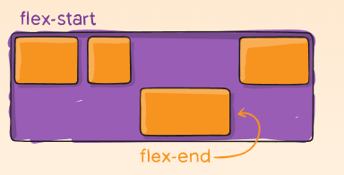
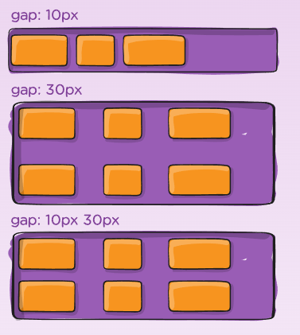
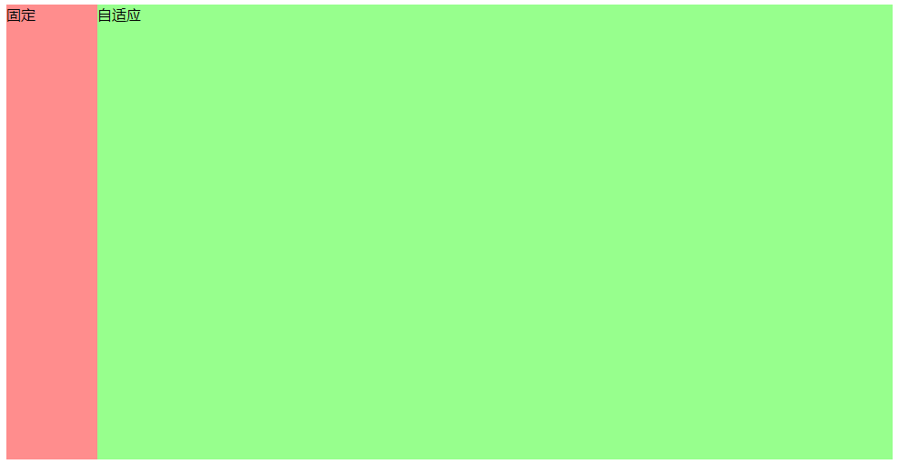

# 正常流

## 1. 盒模型

### 1.0 box-sizing

`box-sizing` 设置 `width` 宽度的作用范围；

- `content-box`：默认，`width` 就相当于 `content` 的宽度，其只作用于 `content` 区域。
- `border-box`：`width` 作用于 `content` + `padding` + `border` 三个区域。

默认情况下，盒子的总宽度 == `width` + `padding` + `border`

设置了 `border-box`,盒子的总宽度 ==  `width`

- `border-box` 盒子是 IE 的老标准。


### 1.1 display 显示类型

设置元素的外部和内部显示类型。

- 外部显示类型：决定了该元素处在正常流中的表现：是块级元素，还是内联级元素。

- 内部显示类型：决定该元素的后代元素排版 / 布局方式：flow layout、grid、flex。

#### 可选的值（1+5+5+2）：

默认：

- `static`：默认正常流 flow layout。遵循 CSS 2 系列的排版规则，是一个 BFC / IFC。

外部显示类型为`block`：

- `block`
- `table`：外部显示为 `block`，内部显示为 `table`。
- `flex`：外部显示类型为 `block`，内部显示类型为 `flex`。
  - 该盒子的所有直接子元素都会成为 flex 元素，会根据弹性盒子（Flexbox）规则进行布局。
- `grid`：同上，内部会变成 grid 盒子。 

外部显示类型为 `inline`：

- `inline`、`inline-table`、`inline-flex`、`inline-grid`：与上文对应，外部显示为 `inline`。

- `inline-block`：外部显示类型为 `inline`，内部显示类型为 `block`，这个盒子能设置 `width` 了。

其他：

- `list-item`：元素创建为盒子后：一个主块盒 + 一个标记盒。
- `none`：该元素和后代都从 DOM 中删除。


#### `inline-block` 的特性：

内部显示类型为块级元素 block-level element，外部显示类型为行内级元素 inline-level element。

- 拥有部分 block 的性质：
  - width、height 有效，可以设置盒子内容 content 的大小；
  - padding、margin、border 会推开其他盒子。

- 拥有部分 inline 的性质：
  - 盒子不会主动换行，多个内联块盒子会并排排放，和正常流一样，只有达到边界才会 “被迫” 换行；

- 问题：
  - 如果设置了 width 内容宽度：则该盒子内的文本内容，会在盒内换行，不会横向溢出盒子。一但文本内容过多，就会纵向溢出盒子。
  - 如果没有设置 width 内容宽度：则该盒子的宽度，会随着文本内容的增多而撑开。但是如果盒子边界达到容器宽度，文本内容会在盒子中换行。
- 总结：` inline-block` 内联块盒，也就是说，是盒子之间内联关系的，内部块级的盒子。


### 1.2 position 定位方式

通过 position 确定定位方式。参考包含块，通过 top, right, bottom, left 属性确定偏移量。

#### 可选的值（5）

- `static`：默认定位。元素按照正常流的方式排版， 盒偏移量（top, right, bottom, left 属性）无效。
- `relative`：相对定位。先按照 **正常流排版**，然后按照 原始位置为基、盒偏移量为距离进行定位。
- `absolute`：绝对定位。先 **脱离正常流**， 然后按照 包含块为基、盒偏移量为距离进行定位。
- `fixed`：固定定位。先 **脱离正常流**，然后按照 包含块（绝大多数情况下是 **视口**）为基、盒偏移量为距离进行定位。
- `sticky`：粘性定位（CSS3）。是 **相对定位** 和 **固定定位** 的混合。基于盒偏移量值进行偏移。
  - 元素在跨越特定阈值（盒偏移量）前为相对定位，之后为固定定位。


### 1.3 float 与清除浮动

让元素 **脱离正常流**，沿其容器的左侧或右侧放置，容器内的其他 **文本** 和 **内联元素** 会添加 `margin` 后环绕它。

#### clear 清除浮动

**向下移动**：不允许被清除浮动的元素的左边/右边挨着浮动元素。让它移动到它左边/右边浮动元素的下面。

- 针对 float 元素：可以让该 float元素 **不是平移** 的方式排到其他浮动元素后，而是 **另起一行拍到第一个** 。
- 针对 非float 元素：可以让该元素的文本 / 内联元素，不是环绕 float 元素。而是将该元素的内容全部移到 float 元素的下方。同时会发生外边距折叠。


值：none、left、right、both


## 2. 格式化上下文

- Formatting context：格式化上下文
- Block formatting context：块级格式化上下文，简称 BFC。
- Inline formatting context：行内级格式化上下文，简称 IFC。

在一个BFC中，所有块级元素，会从包含块的内容块(content)顶部开始，在 **垂直方向** 依次排版。

**BFC 对 float / clear 的影响：**

- **浮动定位** 和 **清除浮动** 时只会应用于同一个 BFC 内的元素。
- **浮动** 不会影响其它 BFC 中元素的布局，而 **清除浮动** 只能清除同一 BFC 中在它 **前 / 后面的元素** 的浮动。
- 计算 BFC 的高度时，内部的浮动元素也要参与计算（解决 float 高度坍塌）。

**BFC 对 外边距折叠的影响：**

- 外边距折叠（Margin collapsing）只会发生在属于同一 BFC 中。
- 只要是在同一个 BFC 中，块元素不论父子结构，在纵向上都会折叠。**兄弟** 、**父子** 块级元素都会发生。

**注意：IFC、flex、grid 之间都不会发生 Margin Collapse。**因为边距折叠只会发生在一个 BFC 中，如果创建了新的BFC，就不会发生边距折叠。


#### 2.1 BFC 的生成条件 (5)：

- 该元素内部必须是一个 block-level element：因为内部显示类型只有是块级元素，才会生成块级格式化上下文 BFC。
- 该元素的内部可以放正常流：反情况理解，如果内部不能防止正常流（比如，块级的替换元素 img，内部不受 CSS 样式影响，flex 内部必须放置 flex-item 等），那该元素的内部就不会生成一个 BFC，而是会放置特定的内容物。

具体情况（5）：

- `<html>` 根元素。
- `float` 元素。
- `position` 脱离正常流元素。`fixed`、`absolute` 固定定位、绝对定位的元素。
- `display` 创建包含块元素：
  - 内联块和列表：`inline-block`、`list-item`
  - 表格相关：`table-cells`、`table-captions`、`table`、`inline-table`；
  - `flex` 和 `grid` 相关：fiex item、grid cell。

- `overflow` 非 visible 元素。overflow：hidden、scroll、auto。
  - `overflow` 属性是当内容移除元素边框时的处理方式。


## 3. 高度坍塌和清除浮动

高度坍塌：指父元素本来应该包括子元素的高度，但是实际上父元素比子元素的高度要小。

```html
<style>
  .container {
    background: rgb(253, 234, 234);
  }

  .box1 {
    float: left;
    width: 200px;
    height: 200px;
    background-color: rgb(0, 225, 255);
  }

  .box2 {
    width: 400px;
    height: 100px;
    background: rgb(160, 235, 74);
  }
</style>

<div class="container">
  <div class="box1"></div>
  <div class="box2"></div>
</div>
```


出现 `container` 高度坍塌的原因：

1. `box1` 设置为浮动，脱离了当前正常流，移动到当前位置的左边。
2. `container` 内失去了 `box1` 的占位，所以高度参考 `box2`，出现了高度坍塌。
   -  `box1` 的包含块不是 `container`，而是根元素 `html`。`container` 自然无法包裹脱离正常流的 `box1`。

#### 解决方式一：BFC

`container` 设置 `overflow：auto` 其内部创建了一个 BFC，根据规则 BFC 的高度计算需要参考 `float` 元素，所以元素会被撑开。

- 只要让 `container` 成为 `box1` 的包含块即可撑开 `container` 的高度。
- 因为 `container` 创建了一个 BFC，此时 `box1` 的包含块就是 `container` 了，所以 `container` 自然被 `box1` 撑开


#### 解决方式二：clear float

`clear` 清除浮动，会让被清除浮动的元素移动到浮动元素的下方。那么我们通过 CSS 创建一个内容为空的伪元素，然后让他清除浮动，就可以解决这个问题：

- 注意这个伪元素必须设置为 `block`，否则变成内联了，无法撑开。
- `::after` 会为选中元素的 **内容的最后** ，添加一个 新元素。在这里其实是对 `container` 容器内 **添加了一个子元素** 。

```css
.container::after {
    content: "";
    display: block; 
    clear: both;
}
```


# 常见问题

## 0. css 属性的继承

#### 常见非继承属性

1. 尺寸：height，width，max-height, min-height, max-width, min-width
2. 位置：display、position、left、right、top、bottom
3. 文本效果：text-shadow
4. 背景属性：background
5. 生成内容：content
6. 层叠：z-index
7. 盒模型属性：float，margin, padding, border

#### 常见可继承属性

1. 字体系列属性：font-family，font-size
2. 文本系列属性：text-indent，line-height，color
3. 元素可见性：visibility
4. 表格布局属性：border-style
5. 列表布局属性：list-style list-style-type
6. 光标属性：cursor


## 1. CSS 单位怎么区分

相对长度单位：相对字体长度单位（em、ex、rem、ch）、相对视区长度单位（vh、vw、vmin、vmax）

### 1.0 长度单位

相对长度单位：

-   相对字体长度单位（em、ex、rem、ch）

-   相对视区长度单位（vh、vw、vmin、vmax）

绝对长度单位：（px、剩余非常少见：pt、cm、mm、pc等）


相对字符长度：

ex：是字符 x 高度，与 font-size 对应。font-size 值越大，则 ex 就越大；

em：是传统 m 的宽度，也是汉字的高度。即一个字模的宽度。根据不同的英文字体，宽度会发生变化。但中文通常一个汉字正好是一个 m 的宽度和高度。

- font-size 是按照父元素字符尺寸来计算。

rem：root 的 em。1 rem 和根字符大小一样，font-size 都按照根字符来计算。

ch：是阿拉伯字母 0 的宽度。等宽字体。


### 1.1 `px`、`em`、`rem` 的区别

1. `px`：固定的像素，一旦设置了就无法因为适应页面大小而改变。
2. `em` ：相对其父元素来设置字体大小。
3. `rem`：相对于 `<html>` 根元素来设置字体大小。
4. `30%`：如果要设置多列布局，使用 百分号是更好的选择。但是 `%` 的计算非常困难。

**`em`：**

- 子元素字体大小的 `em`，是相对于 **父元素** 字体大小 `font-size`；
- 元素的 `width`/`height`/`padding`/`margin`的 `em`，是相对于 **该元素** 的字体大小 `font-size`；

**`rem`：**

- **全部的长度都相对于根元素**。

- 通常做法是给 `html` 元素设置一个字体大小，然后其他元素的长度单位就为 `rem`。

结论：`em` 的计算值是基于父元素的，不同元素的参照物不一样（都是该元素父元素），所以在计算的时候不方便，相比之下 `rem` 就只有一个参照物（html元素），这样计算起来更清晰。


### 1.2 `vw` / `vh` 和 `%` 的区别

CSS3 的新特性，与视图窗口有关

- `vw`、`vh`： 相对于视图窗口的宽度，相对于视图窗口的高度。
- `%`：大部分相对于祖先元素，也有相对于自身的情况比如（border-radius、translate等)，计算复杂。

| 单位 | 含义                                 |
| ---- | ------------------------------------ |
| vw   | 相对于视窗的宽度，视窗宽度是 `100vw` |
| vh   | 相对于视窗的高度，视窗高度是 `100vh` |
| vmin | vw和vh中的较小值                     |
| vmax | vw和vh中的较大值                     |

`px` 如何转化为 `vw`：

- `1px = （1/375）*100 vw`，假设使用 iPhone X 的 `375px` 作为视口宽度。


### 1.3 px 和视口

#### 1 像素

| 像素     | 区别                                                         |
| -------- | ------------------------------------------------------------ |
| css像素  | 逻辑分辨率 `px`，为web开发者提供，在css和html中使用的一个抽象单位。<br />移动设备分辨率的不同，会有 Dpr2，Dpr3 等等几倍屏，会放大像素点，获得更清晰效果。 |
| 物理像素 | 物理分辨率，只与设备的硬件密度有关，任何设备的物理像素都是固定的。 |

#### 2 视口

浏览器显示内容的屏幕区域。

布局视口（layout viewport）：网页内容的实际尺寸；

视觉视口（visual viewport）：浏览器可展示页面的尺寸；

- 在PC 端可以改变浏览器尺寸，而在移动端视觉视口就是其设备屏幕的大小。

所以最佳情况下，要把布局视口和视觉视口的宽度 `1:1` 匹配。电脑的布局视口默认为：980px

下面是我在 Flower Library 项目中的划分：

```css
/* 对屏幕在 0~768px, 768~992px, 992~1140px 分辨率设置自己的css。 */
@media (min-width:768px) {
    .form-cell_title { margin: 2.5rem;}
}
@media (min-width:992px) {
    .form-cell_title { margin: 3.2rem;}
}

@media (min-width:1140px) {
    .form-cell_title { margin: 3.2rem;}
}
```

典型设备的尺寸：

- iPhone 5：`320px`、iPhone X：`375px`
- iPad：`768px`、iPad Pro：`1024px`
- 电脑：`1024px`

所以最佳的划分：

- `768px` 以下是移动手机端；
- `768px` ~ `1024px` 是平板；
- `1024px` 以上是笔记本，`1440px` 是更大尺寸的笔记本。


移动端的视口适配：

```html
<meta name="viewport" content="
  width=device-width; 
  initial-scale=1; 
  maximum-scale=1; 
  minimum-scale=1; 
  user-scalable=no;
">
```


总结：

1. `vm vh` 在 IE 和 Opera 的兼容性存在问题。但搭配 flex 效果更好。


## 2. 响应式布局的方式有哪些

一共有 5 个手段，可以配合使用：

1. 使用 CSS3 的媒体查询 `@media`：
   - 优点：根据不同显示设备宽度，设定不同的页面样式，非常方便直观。比如可以通过 @media 设置不同尺寸的图片。
   - 缺点：通常一个屏幕宽度，就需要配套一个 @media 样式。如果页面构成复杂，则**需要改变的样式太多**，那么多套样式代码会很繁琐。
2. 使用 `%` 百分比，来做栅格系统。
   - 优点：不用像 @media 一样设置多套样式；
   - 缺点：计算起来复杂。如果只计算 width 和 height 还行，他们是父元素的宽高百分比；而其他如果 padding、margin、border-redius 等等属性，百分比的参考值是完全不同的。
3. 使用 CSS3 的视口单位 `vm/vh`。
   - 优点：设计原理与百分比布局类似，也是栅格系统。视口宽度和高度都是 100 个单位，解决了计算复杂的问题。
   - 缺点：对 IE 和 Opera 可能存在兼容性问题。
4. 使用 `em`。
   - 缺点：`em` 是相对于父元素的字体大小 font-size，存在不易察觉的继承问题。
5. 使用 `rem` 改进 `em`。
   - 优点：`rem` 是相对于根元素 `html` 的字体大小 font-size，解决了 `em` 的计算复杂问题。
   - 缺点：我觉得 `rem` 配合媒体查询，是挺好用的 …可能存在 JS 代码对 `rem` 动态计算转换为 `px` 有点绕。但是现在也有对应的自动转换工具。


## 3. flex 的属性有哪些

#### 概述：

主轴（4）：

- `flex-flow`  ==  `flex-direction + flex-wrap`；
- `justify-content`、`align-content`；

交叉轴（1）+ 间隙（3）：

- `align-items`；
- `gap`  ==  `row-gap` + `column-gap`；

flex item（6）：

- `flex` == `flex-grow` + `flex-shrink` + `flex-basis`；
- `align-self`， `order`


#### 1 主轴布局

- `flex-direction`：主轴方向。
  - row、row-reverse、column、column-reverse。主轴方向向右、向左、向下、向上。
- `flex-wrap`：是否换行。
  - nowrap、wrap、wrap-reverse。不换行、换行、反方向换行（如果默认交叉轴向下，则会向上换行）
- `flex-flow`：`主轴方向 + 换行` 的简写。
  -  `<flex-direction> || <flex-wrap>`
- `justify-content`：主轴方向上，各 item 的布局方式。解决主轴方向的 item 剩余空间。
  - flex-start、flex-end、center、space-between、space-around、space-evenly。
  - 主轴起点开始、终点开始、居中、两端对齐、平均分布在 item 两边、空隙全部平均分布。

 

- `align-content`：当 item 在容器中出现折行时，如何解决在交叉轴方向的容器内剩余空间。

 

#### 2 交叉轴布局

- `align-items`：交叉轴方向，各 iitem 的布局方式。解决交叉轴方向的 item 剩余空间。

 

#### 3 item 属性

- `flex-grow`、`flex-shrink`：设置 item 的拉伸 / 收缩比例。`number`，defalue 1

 

- `flex-basis`：兼容性差，分配剩余空间之前的默认尺寸。
  - `auto`：参考我的宽高属性。或者是 `% 、rem` 等等
- `flex`：`flex-grow + flex-shrink + flex-basis` 的集合。
- `align-self`：改变单个 flex item 的排版行为：auto | flex-start | flex-end | center | baseline | stretch。

 

- `order`：对单个 item 进行排序。

 

#### 4. 间隙

- `row-gap`, `column-gap`：flex item 之间的空隙，在计算剩余空间之前应用。
- `gap` ：是 上面两个的简写。

 


## 4. 有哪些常见的 CSS 页面布局

三代排版技术：

- 基于正常流的布局：
  - `display` 属性（文档流布局） + `position` 属性（定位布局） + `float`属性（浮动布局）。
  - table 表格布局、float 浮动布局
  - 涉及到了 IFC BFC 的知识。
- Flex 布局；
- 网格布局；
- CSS `Houdini`。


响应式布局：`@media` + `rem` 首选、使用 `vh/vm` 也可以，但是CSS3新特性兼容性不好；

流式布局：典型网站是 pinterest.com 用 `flex` 最方便

两栏布局：

三栏布局（圣杯布局）：左右固定，中间自适应。

- 左边：宽度固定，设置左浮动；右边宽度固定，设置右浮动；中间宽度 ：`width:100%`设置左浮动。双飞翼布局 / 圣杯布局
- 中间宽度 ：`width:100%` 设置左浮动。左边：宽度固定，设置左浮动；右边宽度固定，设置右浮动；

双飞翼布局：是国内淘宝UE对圣杯布局的优化。把 margin 的设定从 contaienr 放到了 center 中，center 的内容通过 inner 额外包裹。


实现水平、垂直居中的方式：

1.  `text-align:center` 仅行内元素有效
2.  `vertical-align` 多行居中
3.  将行内元素的 `line-height` 和 `height` 设置为相同（水平居中）
4.  绝对定位。父元素设置 `position:reletive`。子元素设置 `position:absolute`，然后使用 `top:50%; left:50%`，把左上角对齐父容器的一半，最后使用 `margin-top` 和 `margin-left` 为子元素的一半 ，实现居中对齐。
5.  `transform: translateX(-50%) translateY(-50%);`上面的绝对定位方法只要将 `margin` left 和 top 改为 `50%` 就可以实现 **宽度和高度未知** 的居中，兼容性不好。


## 5. CSS 中与文字 / 排版相关的属性有哪些？

### CSS2.2（尽量按重要性排序）:

**具体每个属性的用法，再看一下书中勾画的部分**

line-height：文字的行高 / 行间距。

vertical-align：设置文字垂直对齐方式。

text-indent：字符的缩进（可以设置隐藏文字）。

text-align：对齐元素（左对齐、右对齐、左右散开对齐）。

letter-spacing：设置单个字符之间的间距。

word-spacing：设置单词之间的间距（约等于增 / 减空格的宽度）。

word-break：换行时机。

word-wrap：换行时机（CSS3 改名为 overflow-wrap）。

white-spoace：处理空白字符的方式（比如多个遇到多个连续空格，最后只显示一个）。

text-decoration：content area 文字内容区域四周的边框（可以定义一个下划线）。

text-transform：字符全部大写 / 小写。

-   应用1：身份证输入，末尾字母 X，用户虽然输入了小写，用该属性转换为大写；
-   应用2：验证码输入，网站的验证码不区分大小写，用户输入了小写，用该属性转换为大写。

伪元素 / 伪类

`::first-letter` 选择器：选中段落的首字符

`:first-line` 选择器：选中段落的首字符


#### font 系列

@font-face：CSS的一种变量。利用 font-family和src属性，可以自定义 / 替换原本的字体，也可以引入多种格式的字体。

font：是 font 系列的综合。

color：字体颜色

font-family：字体系列。

font-weight：字重。文字的粗细程度。

font-style：斜体风格。normal, italic, oblique。

font-variant：小体形大写字母


### CSS 的颜色

#### color

rgba(255, 255, 255, .7)

hsla(240, 100%, 50%, .7)

#### backgroundf'le [fu'le]

background-color：插入背景颜色

background-position：背景的位置的偏移值

background-repeat：背景图像的重复。默认在水平和垂直方向上重复。

background-attachement：背景图像的位置是在视口内固定，或者随着包含它的区块滚动。

background-image：设置一个或者多个背景图像。

background-size：背景图片大小。

background-clip：裁剪背景图片。元素背景（背景图片或颜色）是否延伸到边框、内边距盒子、内容盒子下面。


## 7 居中对齐

### 7.1 垂直居中

#### (1) 正常流

单行内容：把 height 和 line-height 设置为相同的尺寸，就可以实现单行文字 + 图片的近似垂直居中的效果：

- 如果文字长度一旦过多，出现了折行，此时因行间距 line-height 的影响，就会溢出粉色盒子。

```html
<div>
  	我在这里近似垂直居中了
</div>
<style>
  div {
    height: 100px;
    width: 200px;
    line-height: 100px;
    background-color: pink;
  }
</style>
```

 

多行内容：

```html
<div>
  <span>我居中了吗？我居中了吗？我居中了吗？我居中了吗？我居中了吗？我居中了吗？我居中了吗？我居中了吗？我居中了吗？我居中了吗？我居中了吗？
  </span>
</div>
<style>
  div {
    line-height: 200px;
    background-color: pink;
  }

  span {
    display: inline-block;
    line-height: 30px;
    vertical-align: middle;
  }
</style>
```

 

1.   span 设置为 inline-block，已确保内部可以拥有自己的行间距。同时设置自己的行间距为 30px。
2.   div 行间距设置为 200px，利用宽度为 0 的strut 支撑节点，把 div 的高度撑起来的同时，此时 “文字的中线” 也在盒子的近似中间水平。
     -   **明确一点：** div 作为一个 block 是不需要行高的，它设置 line-height 就是为了子内联元素的继承。最直接的，宽度为 0 的strut 支撑节点继承了这一属性。
3.   span 此时设置上下居中对齐，也就是 `vertical-align: middle;` 那么它就会寻找所在父元素的 “文字的中线” 去对齐。最终效果就是水平近似居中对齐。


图片 + 文字的垂直居中：

```html
<div>
  
</div>
<style>
  div {
    height: 400px;
    line-height: 400px;
    background-color: pink;
  }

  img {
    vertical-align: middle;
  }
</style>
```

**`vertical-align` : 文字和图片等内联元素的居中，是参考 “文字的中线”，而不是盒子实际尺寸的中线。**

如果上面的 `div` 只设置了尺寸高度 `height`， 而没有设置文字行高 `line-height`，就无法达到垂直居中的效果。

 

绝对垂直居中：

```css
.parent::after, .son{
    display:inline-block;
    vertical-align:middle;
}
.parent::after{
    content:'';
    height:100%;
}
```

#### (2) `Flex Box`

```css
.parent {
    display: flex;
    align-items: center;
}
```

#### (3) 绝对定位

`transform`

```css
.son {
    position: absolute;
    top: 50%;    /* 移动包含块height的50% */ 
    transform: translate( 0, -50%);   /* 移动自身height的50% */
}
```

`top: 50%`

```css
.son {
    position: absolute;
    top: 50%;
    height: 高度;
    margin-top: -0.5高度;
}
```


### 7.2 水平居中

#### (1) 正常流

行内元素

```css
.parent {
    text-align: center;
}
```

块级元素

```css
.son {
    margin: 0 auto;
}
```

#### (2) `Flex Box`

```
.parent {
    display: flex;
    justify-content: center;
}
```

#### (3) 绝对定位

`transform`

```js
.son {
    position: absolute;
    left: 50%;
    transform: translate(-50%, 0);
}
```

`left: 50%`

```css
.son {
    position: absolute;
    width: 180px;
    left: 50%;
    margin-left: -90px;
}
```

`left/right: 0`

```css
.son {
    position: absolute;
    width: 180px;
    left: 0;
    right: 0;
    margin: 0 auto;
}
```

### 7.3 水平 + 垂直居中

三种方法：

- `Flex Box`：`parent` ===  `justify-content: center;` + `align-items: center;`

- 绝对定位： `transform`
- 绝对定位：`left / top:50%`；

```css
.son {
    position: absolute;
    left: 50%;
    top:  50%;
    transform: translate(-50%, -50%);
}

.son {
    position: absolute;
    width: 180px;
    left: 50%;
    top:  50%;
    margin-left: -90px;
    margin-top:  -90px;
}
```


## 8. 元素的隐藏

- `display: none;`
  1. DOM 结构：在 DOM 中，不占据正常流的空间；
  2. 事件监听：**无法进行 DOM 事件监听；**
  3. 性能：动态改变此属性时会 **引起重排重绘**，性能较差；
  4. 继承：不会被子元素继承，毕竟子类也不会被渲染（直接没，不存在继承问题了）；
  5. `transition`：`transition` 不支持 `display`。
- `visibility: hidden;`
  1. DOM 结构：元素被隐藏，会被渲染不会消失，占据空间；
  2. 事件监听：**无法进行 DOM 事件监听；**
  3. 性能：动态改变此属性时会 **引起重绘**，性能较高；
  4. 继承：会被子元素继承，子元素可以通过设置 `visibility: visible`; 来取消隐藏；
  5. `transition`：`visibility` 会立即显示，隐藏时会延时
- `opacity: 0;`
  1. DOM 结构：透明度为 100%，元素隐藏，占据空间；
  2. 事件监听：可以进行 DOM 事件监听；
  3. 性能：提升为合成层，**不会触发重绘**，性能较高；
  4. 继承：会被子元素继承，子元素并不能通过 `opacity: 1` 来取消隐藏；
  5. `transition`：`opacity` 可以延时显示和隐藏


**文本的隐藏**

利用字号：`font-size: 0` 文字就会在视觉层隐藏，但是屏幕阅读设备、DOM流中依然存在；

利用缩进：`text-indent` 设置为一个非常大的负值，则改行文本会因溢出盒子，甚至 html 页面而消失不见。但是会出现溢出容器问题。

```css
.hide-text {
  	text-indent: 100%;    /* 百分比相对于包含块来决定的，100%则正好让文本想左移动了包含块的长度 */ 
  	white-space: nowrap;  /* 规定文本不换行，这样该段落的所有文字都可以利用缩进移动到最左边，消失不见 */
  	overflow: hidden；    /* 解决溢出容器的问题 */ 
}
```

**盒子的隐藏**

`z-index` 层叠上下文。当层叠上下文内的某个父元素拥有一个背景色，那把要隐藏的元素的 z-index 设置为负值便可以达到效果隐藏 / 遮挡的效果。这是一个可访问性隐藏。对原来的布局、以及元素的行为没有任何影响。


**图片的隐藏**

`clip`  利用裁剪效果。可以达到隐藏的效果，但缺点是元素需要绝对定位。focus 控件焦点也会有细微问题。


## 9 CSS3 新特性

文字相关的属性：

column：文本的多栏布局，定义一共有几栏；

column-gap：文本的多栏布局，定义两个栏间隔的宽度；

column-span：文本的多栏布局，定义该元素实现跨栏（通常是文中的小标题）；

text-feature-settings：控制OpenType字体中的高级印刷功能。

font-variant-numeric：控制数字，分数和序号标记的替代字形

font-kerning：使用字体中储存的字距信息。

text-shadow：为文字添加阴影。阴影值由元素在X和Y方向的偏移量、模糊半径和颜色值组成。


## 10 height、line-height、vartical-align 和 font-size

`line-height`：就是文字间的行间距，也称为行高。它能影响文字之间的间距，vertical-align 也会影响到文字的上下间距。

`vartical-align`：垂直对齐方式，决定文本的垂直对齐高度基于哪一条线。所以， vartical-align 主要应用在内联元素。（还支持 table-cell 等）


**总结：height、line-height、font-size 三者的关系**

`line-height` 与 `font-size`：

-   行高 > 字号，则字符上下有半行距的空隙；
-   行高 = 字号，则字符正好占满行高；
-   行高 < 字号，则多行字符会上下 “挤” 再一起。

`height` 与 `line-height`：

-   height > line-height，则容器尺寸大，行间距小，默认情况下字会像写文章一样顺次往下排布。
-   height = line-height，则容器和行间距一样，达到近似居中的效果。
-   height < line-height，则容器尺寸小，行间距大，字会挤到盒子的外面。

|                | 定义                    | 百分比值（50% 为例）                           |      |
| -------------- | ----------------------- | ---------------------------------------------- | ---- |
| height         | 盒子的高度              | 父容器实际高度 x 50%                           |      |
| line-height    | 行间距，文字的高度      | 父容器实际高度 x 50%                           |      |
| vertical-align | 垂直对齐的方式          | 当前 line-height x 50%                         |      |
| width          | 盒子的宽度              | 父容器实际宽度 x 50%                           |      |
| padding        | 内联元素的padding会断行 | 不论上下左右，都是：<br />父容器实际宽度 x 50% |      |
| margin         | 可以为负值              | --                                             |      |


## 11. CSS 选择符

#### 选择符的种类（5）

- 基本、高级、属性、伪元素、伪类

#### 1 基本选择符

元素选择符： `p`

ID选择符：`#myId`

类选择符：`.myClass`

通用选择符：`*` 选择所有元素。

后代选择符： `[空格]` ，如 `blockquote p` 则选择了块引用的所有 p 后代（子后代、子孙后代全部包括）。

多选：`, ` ，用逗号连接，则表示连续选择多个元素，同时应用相同的 CSS 属性。

#### 2 高级选择符

子选择符：`>` ，如 `#nav > li`  选择了 id 为 nav 的 li 元素的直接后代，也就是子后代，**多个元素**。

相邻同辈选择符：`+`，如 `h2 + p` 只选择了 h2 元素 **后面** 的、拥有 **共同父元素** 的 **一个元素** p。

一般同辈选择符：`~`，如 `h2 ~ p` 会选择 h2 元素 **后面** 的、拥有 **共同父元素** 的 **全部元素** p。

#### 3 属性选择符

属性选择符 1 ：`标签名[属性名]` ，比如 `abbr[title]`。表示选择所有这些属性：`<abbr title="xxxx">`。

属性选择符 2 ：`标签名[属性名="属性值"]`，如 `abbr[title="a"]`。选择这些属性：`<abbr title="a">`。

要匹配以某些字符开头的属性值：等号前加 `^`，如 `a[href^='http:']` 

要匹配包含某些字符的属性值：等号前加上 `$`，如 `img[src$=".png"]` 

要匹配以空格分隔的字符串中的属性值：等号前加上 `~`，如 `a[rel~=next]` 

要匹配开头指定值或指定值后连接一个短线：`|`，如 `a[lang|=en]` ，可以匹配属性值为 en 或 en-us。

#### 4 伪元素和伪类

伪类和伪元素可用来修饰不在文档树中的部分。这样做通常是为了不想给页面添加额外的标记，但又想创建 / 选择一些元素。

- **伪类** `:` 是 **选择元素**，**伪元素** `::` 是 **创建元素**。

#### 4.1 伪类	

通过伪类选择器，可以找到那些不存在 DOM 树中的信息，或者不能被常规 CSS 选择器获取到的信息。

- 获取不存在与DOM树中的信息。比如 a 标签的 :link、visited，这些信息不存在与 DOM 树结构中，只能通过 CSS 选择器来获取；

- 获取不能被常规CSS选择器获取的信息。比如：获取第一个子元素，无法用常规的 CSS 选择器获取，只能通过 :first-child 获取。

##### 状态伪类：

未访问过的链接，或其他可交互元素：`a:link`

访问过的链接，或其他可交互元素：`a:visited`

鼠标悬停 、 键盘聚焦的链接，或其他可交互元素：`a:hover`、`a:focus`

活动状态的可交互元素：`a:active`

- 注：为了防止后定义的样式覆盖前面定义的样式，上面这几个伪类要按照以下顺序依次定义：`:link`, `visited`, `:hover`, `:focus`, `:active`。

##### 结构化伪类：

`:not()`：反选

`:target`：目标

`:nth-child()`：根据不同的属性值，来选择子元素：

- odd、even、n、2n+4：选中奇数、偶数、第 n 个元素（1开始）、（n = 0, 1, 2...）的表达式结果

- `nth-child(n+3)` ：选择列表中的标签从第 3 个开始到最后（>=3）

  `nth-child(-n+3)` ：选择列表中的标签从 0 到 3，即小于 3 的标签(<=3)

`:nth-last-child()` ：属性值和 `:nth-child()` 相同，只不过它是倒着数。

- `nth-last-child(3)` ：选择列表中的倒数第 3 个标签

`:nth-of-type(n)`：匹配指定类型的第 N 个子元素，**与元素类型有关**。可以插入含 n 的表达式，来选中同类型元素。

- 如 `.myDiv p:nth-of-type(3)`：匹配 class 值为 myDiv 内的第 3 个 p 元素。


`:first-child` 相当于 `:nth-child(1)`

`:last-child` 相当于 `:nth-last-child(1)`

`:only-child`：配没有任何兄弟元素的元素

- 相当于：`:first-child:last-child`或者`:nth-child(1):nth-last-child(1)`。

`:only-of-type()`：匹配父元素中，类型是唯一的那个子元素。

- `.myDiv :only-of-type()`：在 .myDiv 中，寻找类型唯一的子元素，如果有，则匹配成功。注意 .myDiv 后有一个空格。


#### 4.2 伪元素

伪元素用于创建一些 **不在文档树中的元素**，并为其添加样式。

比如说，我们可以通过 `:before` 来在一个元素前增加一些文本，并为这些文本添加样式。虽然用户可以看到这些文本，但是这些文本实际上不在文档树中。

> 因此，伪类与伪元素的区别在于：有没有创建一个文档树之外的元素。

- `::before`：在选中元素的 **内容（content）** 的前面插入一个伪元素。**（内部的开头添加一个子元素）**
- `::after`：在选中元素的 **内容（content）** 的后面插入一个伪元素。**（内部的末尾添加一个子元素）**

- `::first-letter` ：选择一段文本的第一个字符，如 `p::first-letter`。

- `::first-line`：选择一段文本的第一行，如 `#myPara::first-letter`。

其他常见的伪元素有：`::selection`、`::placeholder` 等。


#### ::after 和 :after 的区别

在实际的开发工作中，我们会看到有人把伪元素写成`:after`，这实际是 CSS2 与 CSS3新旧标准的规定不同而导致的。

CSS2 中的伪元素和伪类都使用 1 个冒号，在 CSS3 中，为了区分伪类和伪元素，规定伪元素使用 2 个冒号。所以，对于 CSS2 标准的老伪元素，比如`:first-line`，`:first-letter`，`:before`，`:after`，写一个冒号浏览器也能识别，但对于 CSS3 标准的新伪元素，比如 `::selection`，就必须写2个冒号了。


## 12. CSS 优先级 / 层叠 cascade

当出现多条规则同时选择一个元素的情况时，通过 层叠 的机制来处理这种冲突。

层叠机制的重要性级别从高到低如下所示：

1. `!important` 标注的用户样式；
2. `!important` 标注的网页样式；
3. 网页样式；
4. 用户样式；
5. 浏览器的默认样式。

给用户的 `!important` 标注提升为最高权重，主要出于无障碍交互的需要。比如，允许阅读困难的用户使用高对比度的用户样式表。


#### 特殊性

在满足上文层叠规则后，再按照选择符的特殊性排序。特殊性更高的选择符会覆盖特殊性、低的选择符。如果两条规则的特殊性相等，则后定义的覆盖之前的规则。

任何选择符的特殊性都对应于 4 个级别，按照权重由大到小依次是：

1. 行内样式，记为 1；
2. ID 选择符
3. class 类选择符、伪类选择符、属性选择符
4. type 类型选择符、伪元素选择符

| 选择符                                                       | 特殊性     |                                |
| ------------------------------------------------------------ | ---------- | ------------------------------ |
| `style="xxx"`                                                | 1, 0, 0, 0 |                                |
| `#myContainer #content {}`                                   | 0, 2, 0, 0 |                                |
| `div #content {}`                                            | 0, 1, 0, 1 |                                |
| `div p {}`                                                   | 0, 0, 0, 2 |                                |
| `#content > [id="main"] .news-story:nth-of-type(1) h2.first {}` | 0, 1, 4, 1 | 依次是：100, 10, 10, 10, 1, 10 |
| `div > #main > h2 {}`                                        | 0, 1, 0, 2 | 依次是：1, 100, 1              |
|                                                              |            |                                |

- 注 1 ：`*` 通用选择符的权重最小，可以看似是 0。
- 注 2 ：继承而来的样式没有权重，所以即使是权重最小的 `*` 通用选择符也能轻易覆盖继承的样式。

```html
<h2>
    这段话的字体是红色的，但是紧跟后面的 em 是黑色的。<em>我是黑色的</em>
</h2>

<style>
    * {
        color: black;
    }
    h2 {
        color: red;
    }
</style>
```


## 13. 应用 CSS 样式的方法

方法 1 ：`style` 

把样式直接放在 style 元素中，然后把 style 放置在页面文档的 head 部分。

```html
<style>
	/* 这里写入样式 */
</style>
```

优点：不通过外部方式引入 CSS，浏览器不需要额外下载 CSS 文件而耽误建立连接的时间。

缺点：一个 CSS 样式不能在多个页面重用。


方法 2 ：`link`

```html
<link href="Mycss.css" rel="stylesheet" />
```

使用 link 元素把独立的 CSS 文件引入到页面中。

优点：可以在不同的 HTML 页面中复用；功能不同的页面，可以按需加载不一样的 CSS样式文件，不需要一次性全部加载。

缺点：需要额外下载 CSS 文件，但通常速度会很快。


方法3：`@import`

在 HTML 文档的 head 部分把 @import 指令放在一个 style 元素中，也相当于从外部引入了 CSS 文件。

```html
<style>
	@import url("Mycss.css");
</style>
```

当有多个 CSS 样式应用时，声明次序就是它们在 HTML 源代码中出现的次序。也就是说，出现当有多个 CSS 样式均定义了某一个元素时，最后一个加载的 CSS 规则，会最终被应用到元素上的样式。通常所有的 CSS 样式都在 head 部分中引入。


## 14. 常见布局

### 14.1 两栏布局（3）



利用 `float` + `margin` 实现

```css
.left {
    background-color: #f00;
    float: left;
    width: 100px;
}
.right {
    background-color: #0f0;
    margin-left: 100px; /*大于等于#left的宽度*/
}
```


利用 `float` + `overflow` 实现

```css
.left {
    float: left;
    width: 100px;
    background-color: #f00;
}
.right {
    overflow: hidden; /*触发bfc达到自适应*/
    background-color: #0f0;
}
```

从整体来看，`left` 和 `right` 被一个 `body` 包裹，`left` 是左浮动。所以这两个盒子会并排放在一起；

从各自来看，`left` 和 `right` 内部都是一个 BFC，都脱离了正常流，所以内容相互不影响。

优缺点：

- 优点：代码简单，容易理解，无需关注定宽的宽度，利用 `bfc` 达到自适应效果
- 缺点：浮动脱离文档流，需要手动清除浮动，否则会产生高度塌陷；不支持ie6


利用 `flex` 实现：

```css
#parent{
    display: flex;
}
#left {
    width: 100px;
    background-color: #f00;
}
#right {
    flex: 1; /*均分了父元素剩余空间*/
    background-color: #0f0;
}
```


### 14.1 三栏布局（3）

#### 两列定宽,一列自适应


**使用 `float` + `margin` 实现**

```css
#parent{
    min-width: 310px; /*100+10+200,防止宽度不够,子元素换行*/
}
#left {
    margin-right: 10px;  /*#left和#center间隔*/
    float: left;
    width: 100px;
    background-color: #f00;
}
#center{
    float: left;
    width: 200px;
    background-color: #eeff2b;
}
#right {
   margin-left: 320px;  /*等于#left和#center的宽度之和加上间隔,多出来的就是#right和#center的间隔*/
   background-color: #0f0;
}
```

**使用 `float` + `overflow` 实现**

```css
#parent{
    min-width: 320px; /*100+10+200+20,防止宽度不够,子元素换行*/
}
#left {
    margin-right: 10px; /*间隔*/
    float: left;
    width: 100px;
    background-color: #f00;
}
#center{
    margin-right: 10px; /*在此定义和#right的间隔*/
    float: left;
    width: 200px;
    background-color: #eeff2b;
}
#right {
    overflow: hidden;  /*触发bfc*/
    background-color: #0f0;
}
```

#### 「 重要‼️」两侧定宽, 中间自适应

好文章，复习时候看看：[圣杯布局与双飞翼布局 - 知乎 (zhihu.com)](https://zhuanlan.zhihu.com/p/58355168)

双飞翼是淘宝UE对圣杯布局的改进，两者都是中间自适应，两边固定的结构。不同的是解决中间位置的 center 如何让出左右两侧的距离。

-   双飞翼办法：
-   圣杯办法：在 left center right 的最外层包裹的 container 下手：调整它的 margin，空出左右两侧的位置；
-   双飞翼：在 center 内部包裹一层 inner，所有元素放到 inner 。调整 inner 的 margin，空出左右两侧的位置；
    -   双飞翼不需要对 container 进行调整，每个模块的逻辑得到了进一步的区分。


**为什么 `margin-left: -100%` 会让 left 栏目向上移动？**

1.   三个 float 元素的顺序依次是： center、left、right，他们都是向左做浮动；
2.   三个左浮动的元素会依次从左向右排开，如果一行的位置不够，则后面的元素会移动到下一行的左边，**这个特性和 inline 一样**
3.   因为 center 的宽度设定为 `width:100%` 占满了包含块的全部宽度，所以 left 就自然移动到了下一行；
4.   而 `margin-left` 有两条应用规则：
     -   对于父子关系，`margin-left` 的宽度是父元素的左边界和子元素的左边界之间的距离；
     -   对于兄弟关系，`margin-left` 的宽度是前一个元素右边界和后一个元素左边界的距离；
5.   当我们设定 `margin-left: -xx%` 给 left 栏时，left 会向左做移动。**这个特性和 inline 一样**，如果一直左移动，当上一行能放下这个 left 元素时，就会移动到上一行。
6.   所以，设定 `margin-left: -100%` 时，left 元素会向左移动包含块的宽度的距离，正好移动到 center 和 left 的左边界重合。

-   需要注意的是，当两个元素之间的 margin 为负时，就会发生层叠上下文的 z 轴覆盖问题。

在 float 元素中调整 `margin-left` 和 `margin-right` 不只是会单纯的左右移动，如果上下空间足够，就会和 inline 的正常流那样，顺势向上一行或者下一行移动。

-   而相对定位中的 `left` 和 `right` 不会发生折行问题，即使会把元素移出屏幕，就会单纯的只向左 / 右移动。

##### 双飞翼布局方法


```html
<!DOCTYPE html>
<html lang="en">

<head>
  <meta charset="UTF-8">
  <title>Document</title>
  <style>
    .header,
    .footer {
      height: 100px;
      background-color: rgb(195, 239, 255);
    }
    .main {
      width: 100%;
      height: 500px;
    }
    .inner {
      margin: 0 215px 0 115px;
    }
    .center {
      float: left;
      width: 100%;
      height: 100%;
      background-color: rgb(255, 195, 195);
    }
    .left {
      float: left;
      position: relative;
      margin-left: -100%;
      width: 100px;
      height: 100%;
      background-color: rgb(238, 206, 125);
    }
    .right {
      float: left;
      position: relative;
      margin-left: -200px;
      width: 200px;
      height: 100%;
      background-color: rgb(195, 255, 227);
    }
    /*给 container 加上 clearfix 类*/
    .clearfix::after {
      clear: both;
      display: block;
      content: "";
    }
  </style>

<body>
  <div class="header"></div>
  <div class="main">
    <div class="center clearfix">
      <div class="inner">中间自适应</div>
    </div>
    <div class="left">左边固定100px，margin 15px</div>
    <div class="right">右边固定200px，margin 15px</div>
  </div>
  <div class="footer"></div>
</body>
```

##### 圣杯布局方法


```html
<style>
    .header, .footer {
      height: 100px;
      background-color: rgb(255, 172, 172);
    }
    .container {
      margin: 0 215px 0 115px;
      height: 600px;
    }
    .center {
      float: left;
      width: 100%;
      height: 100%;
      background-color: rgb(255, 255, 179);
    }
    .left {
      float: left;
      position: relative;
      left: -115px;
      margin-left: -100%;
      width: 100px;
      height: 100%;
      background-color: rgb(179, 255, 254);
    }
    .right {
      float: left;
      position: relative;
      left: 230px;
      margin-left: -215px;
      width: 200px;
      height: 100%;
      background-color: rgb(204, 179, 255);
    }
  
  /*给 container 加上 clearfix 类*/
  .clearfix::after{
  clear: both;
  display: block;
  content: "";
  }
</style>

<body>
  <div class="main">
    <div class="header"></div>
    <div class="container clearfix"> 
      <div class="center">中间自适应</div>
      <div class="left">左列定宽</div>
      <div class="right">右列定宽</div>
    </div>
    <div class="footer"></div>
  </div>
</body>
```

父容器 `parent` 需要利用 `margin` 空出 left 和 right 的总宽度。这样 `center` 只会撑满包含块的 content 宽度，让出了 left 和 right 的空间。


**使用 `flex` 实现**

```html
<style>
#parent {
    height: 500px;
    display: flex;
}
#left {
    width: 100px;
    background-color: #f00;
}
#center {
    flex: 1;  /*均分#parent剩余的部分*/
    background-color: #eeff2b;
}
#right {
    width: 200px;
    background-color: #0f0;
}
</style>

<body>
<div id="parent">
    <div id="left">左列定宽</div>
    <div id="center">中间自适应</div>
    <div id="right">右列定宽</div>
</div>
</body>
```

**使用绝对定位：**

```html
<style>
#parent {
    position: relative; /*子绝父相*/
}
#left {
    position: absolute;
    top: 0;
    left: 0;
    width: 100px;
    height: 500px;
    background-color: #f00;
}
#center {
    height: 500px;
    margin-left: 100px; /*大于等于#left的宽度,或者给#parent添加同样大小的padding-left*/
    margin-right: 200px;  /*大于等于#right的宽度,或者给#parent添加同样大小的padding-right*/
    background-color: #eeff2b;
}
#right {
    position: absolute;
    top: 0;
    right: 0;
    width: 200px;
    height: 500px;
    background-color: #0f0;
}
</style>

<body>
<div id="parent">
    <div id="left">左列定宽</div>
    <div id="center">中间自适应</div>
    <div id="right">右列定宽</div>
</div>
</body>
```


## 15. CSS 动画

精简版总结：

`animation` 动画：关键帧、往复性；

`transition` 过渡：属性、触发动作、一次性；

`transform` 变形：改变 CSS 形状的属性。

| 属性               | 含义                                                         |
| ------------------ | ------------------------------------------------------------ |
| animation（动画）  | 用于设置动画属性，他是一个简写的属性，包含6个属性，比 `transition` 更强大。 |
| transition（过渡） | 用于设置元素的样式过度，和 `animation` 有着类似的效果，但细节上有很大的不同 |
| transform（变形）  | 可以把元素静态旋转、缩放、移动，和设置样式的动画并没有什么关系，<br />就相当于color一样用来设置元素的 “外表样式” |
| translate（移动）  | translate 只是 transform 的一个属性值，即移动。除此之外还有 `scale` 等 |
| scale （缩放）     | transform 的一个属性值                                       |

#### transition 过渡

比如一个属性的背景色从 `红色` 变为 `黑色`，就是一种过渡。

- 过渡有三个要素：开始状态、结束状态、过渡触发点

- `@media`、`:hover`、`:focus` 等等，都是过渡的触发点。

`transition` 的要点：

- 一条 `transition` 规则，只能定义一个属性变化；
- 只能定义开始和结束状态，没有中间状态；
- 需要事件触发（比如 `:hover`），无法自动触发；

语法：`transition: property duration timing-function delay;`

| 值                | 描述                       |
| ----------------- | -------------------------- |
| `property`        | 要实现的过渡效果           |
| `duration`        | 过渡的时间（s / ms）       |
| `timing-function` | 速度曲线                   |
| `delay`           | 触发后，过渡延迟执行的时间 |

```css
/* 给box定义一个"过渡动画"：变形 1s完成 缓进 推迟1s执行 */
.box {
    transition: transform 1s ease-in 1s;
}
/* "变形"的触发时机是 :hover，180旋转+长宽缩小0.5*/
.box:hover {
    transform: rotate(180deg) scale(.5, .5);
}
```

- `transition` 产生动画的条件是 `transition` 设置的 `property` 发生变化，也就是这里的第一个属性值（`transform` 变形）。

 

#### animation

通过自定义动画组合，实现了`animation` 的多个 `transition` 的效果叠加，并且可操作性更强。

animation 是 8 个属性的简写：以下属性如果单独写，要加 `animation-xxx`：
`animation: name duration timing-function delay iteration-count direction play-state fill-mode;`

| 值              | 描述                                                         |
| --------------- | ------------------------------------------------------------ |
| name            | 与 `@keyframes` 定义的动画名称一致，调用定义好的动画；       |
| duration        | 执行动画的总时间；                                           |
| timing-function | 速度曲线，应用在每一个小动画上，而不是整体应用一次；         |
| delay           | 整个 animation执行动画之前等待的时间；                       |
| iteration-count | 动画的播放次数，具体(`number`) / 无线(`infinite`)            |
| direction       | 动画播放方向：<br />normal (按时间轴顺序)，<br />reverse (时间轴反方向运行)<br />alternate (轮流，即来回往复进行)<br />alternate-reverse (动画先反运行，再轮流往复执行) |
| play-state      | 控制动画的暂停和继续：running (继续)，paused (暂停)          |
| fill-mode       | 控制动画结束后元素的样式，有四个值：<br />none (动画开始的状态)，<br />forwards (动画结束的状态)，<br />backwards (动画第一帧的状态)，<br />both (根据 direction 轮流应用 forwards 和 backwards )，<br />           注意与 iteration-count 不要冲突(动画执行无限次) |

相比 transition，animation 的优点：

- 一个动画可以有多个中间节点，每个节点都能定义自己的样式；
- 动画可以指定执行次数、可以暂停和继续，可以自动执行，不需要触发机制。
- 可以指定动画结束后是否恢复样式；
- 可以指定动画的播放形式。

```css
.box {
    height: 100px;
    width: 100px;
    border: 15px solid black;
    animation: changebox 1s ease-in-out 1s infinite alternate running forwards;
}

.box:hover {
    animation-play-state: paused;
}

@keyframes changebox {
    10% {
        background: red;
    }
    50% {
        width: 80px;
    }
    70% {
        border: 15px solid yellow;
    }
    100% {
        width: 180px;
        height: 180px;
    }
}
```

- 定义了一个 `changebox` 的动画组合。组合中通过百分比的形式，定义了每个阶段需要达成的 “目标”。
- 动画在 `:hover` 后，设置为 `paused` 会暂停。

 

## 16 实现图片的旋转

```css
.rotate {
    width: 100px;
    height: 100px;
    background-color: pink;
    animation: rotate 3s linear infinite;
}

@keyframes rotate {
    0% {
        transform: rotate(0);
    }

    100% {
        transform: rotate(360deg);
    }
}
```


## 17. CSS 实现图形

#### triangle 三角形

关键词：`transparent` 透明的

步骤一：给四个边设置不同的颜色：

```html
<style>
  .triangle {
    width: 0;
    height: 0;
    border-top: 100px solid #f00;
    border-right: 100px solid #0f0;
    border-bottom: 100px solid #00f;
    border-left: 100px solid #ff0;
  }
</style>

<div class="triangle"></div>
```


步骤二：只需要将任意三边设置为 `transparent`，则剩下的一边就是一个三角形。

- 对这条边设置宽度，可以调整三角形的高度：

```css
.triangle {
    width: 0;
    height: 0;
    border: 100px solid transparent;
    border-bottom: 173px solid #0ff;
}
```

- 注意上方还有顶边的 `100px` 空隙，如果去掉需要用负的 margin。


- 梯形只需要对盒子设置一个宽高即可：

```css
.object {
    width: 50px;
    height: 50px;
    border: 100px solid transparent;
    border-bottom: 100px solid #0ff;
}
```

​           


circle  圆形

关键属性：`border-radius`，把四个边的圆角都设置一个百分比。

```html
<style>
    .circle {
        width: 100px;
        height: 100px;
        border-radius: 50%;
        background-color: cyan;
    }
</style>

<div class="circle"></div>
```

 

## 18 阴影效果

#### 文字阴影（`text-shadow`）

`text-shadow: h-shadow v-shadow blur color;`

- 对应的属性：x-方向偏移、y-方向偏移、模糊半径、颜色。

```css
 /*测试一  Moxy*/
 text-shadow:2px 3px 12px #000;  
 
 /*测试二 Ninjee*/
 text-shadow:2px 3px 1px #000;
```


#### 盒子阴影（`box-shadow`）

`box-shadow: offset-x offset-y blur-radius spread-radius color  `

- x-方向偏移值、y- 方向偏移值 、模糊半径、扩张半径、阴影颜色

`offset-x offset-y`：往右下投影则为正，右上则为负。这和 `top`、`left` 的数值计算是一致的。

 

模糊半径 `blur-radius`、扩张半径 `spread-radius`


#### 多重阴影

可以一次涉及多种阴影，每一个阴影用 “`,`” 隔开即可：

```css
box-shadow:-10px 0 10px red, 10px 0 10px blue,0 -10px 10px yellow,0 10px 10px green;
```


#### drop-shadow 阴影

`drop-shadow` 

```css
drop-shadow(offset-x offset-y blur-radius spread-radius color)
```

- 和 `box-shadow` 属性的语法几乎相同，都是添加阴影的方法。

不同点：

- `box-shadow` 属性：在元素的整个框后面创建一个盒子形状的矩形阴影； 
- `drop-shadow()` 过滤器：创建一个 **符合图像本身形状** (alpha通道) 的阴影。


注意三角形的位置。使用 `box-shadow` 三角形的位置是没有阴影的；但是使用` drop-shadow` 有。

```html
<style>
    .bubble-box {
        width: 150px;
        margin: 40px; padding: 50px;
        background-color: #66CCFF;
        position: relative;
        font-size: 24px;
    }
    .triangle {
        position: absolute;
        left: -40px;
        width: 0; height: 0;
        overflow: hidden;
        border: 20px solid transparent;
        border-right-color: #66CCFF;
    }
    .box-shadow {
        box-shadow: 5px 5px 10px black;
    }
    .drop-shadow {
        filter: drop-shadow(5px 5px 10px black);
    }
</style>
<div class="bubble-box box-shadow">
    <i class="triangle"></i>
    box-shadow
</div>
<div class="bubble-box drop-shadow">
    <i class="triangle"></i>
    filter: drop-shadow
</div>
```


## 问题：clientX/Y, screenX/Y, offsetX/Y

**这些值都是只读的**。都是检测鼠标位置的参数。

- `MouseEvent.clientX / clientY`：鼠标位置相对于**浏览器窗口左上角**的水平 / 垂直坐标（单位像素）。
  - 有别名：`MouseEvent.x`和`MouseEvent.y`。
- `MouseEvent.screenX / screenY`：鼠标位置相对于**屏幕视口左上角**的水平 / 垂直坐标（单位像素）。
- `MouseEvent.offsetX / offsetY`：鼠标位置与 **目标节点左上边缘 (padding)** 的水平 / 垂直距离（单位像素）。
- `MouseEvent.pageX / pageY`：鼠标位置与 **文档左上边缘的距离**（单位像素）。
  - 包括文档不可见的部分。


## 问题：判断页面滚动到底部并加载更多数据？

```javascript
window.onscroll = function (e) {
  const { scrollHeight, scrollTop, clientHeight } = document.documentElement;
  
  if(clientHeight + scrollTop >= scrollHeight) {
    console.log('==加载更多==');
  }
}
```

**如果：视口高度 + 已滚动高度 >= 网页高度**，表明视口已经滑动到网页底部，需要额外加载网页。

```js
// 网页的总高度
document.documentElement.scrollHeight;
document.body.scrollHeight;

// 网页已经滚动的高度
document.documentElement.scrollTop;

// 当前视口的高度 / 浏览器高度
document.documentElement.clientHeight;
// == window.innerHeight - 水平滚动条高度
```

- `Element.scrollHeight` 得到一个整数值（小数会四舍五入），表示当前元素的总高度（单位像素），包括溢出容器、当前不可见的部分。包括 padding，但是不包括 border、margin 以及水平滚动条的高度（如果有水平滚动条的话），还包括伪元素（::before或::after）的高度。
- `Element.scrollTop` 表示当前元素的**垂直滚动条向下滚动的像素数量**。如果没有滚动条，该属性为 0。
- `document.documentElement.clientHeight` 表示当前视口的高度（即浏览器窗口的高度），等同于window.innerHeight属性减去水平滚动条的高度（如果有的话）。
- `document.body.clientHeight` 的高度则是网页的实际高度。


