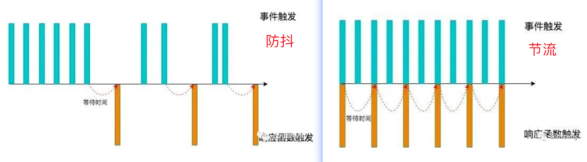
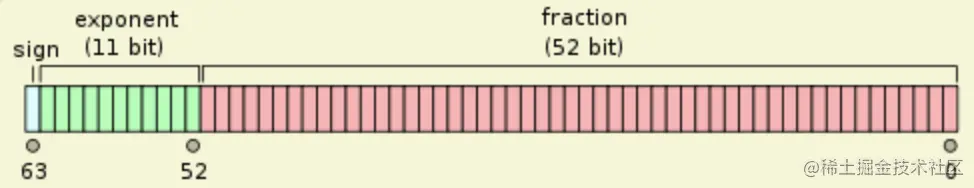

### 问题：闭包 

**问题一：什么是闭包？**

1. 变量的集合：堆内存中的闭包

   在 JavaScript 中，根据词法作用域中作用域嵌套的规则，如果外部函数内嵌套了一个内部函数，那么内部函数总是可以访问外部函数中声明的变量。

   当通过调用一个外部函数返回一个内部函数后，即使这个外部函数已经执行结束了，但是若内部函数引用了外部函数的变量，那么这些被引用的变量会依然保存在内存中，我们就把这些变量的集合称为闭包。

   即时删除了当前执行上下文，其生成的闭包依然被其他环境持有，所以不会被销毁。

2. 执行上下文的精简：

   在即将销毁一个执行上下文时，如果该执行上下文内部有被其他作用域引用的变量，则会把这些变量进行打包，只销毁用不到的用不到变量和其他结构，就这样形成了一个闭包 Closure。

3. 作用域链的一环：内存管理（垃圾回收）

   查找顺序：当前词法环境（块作用域）、当前变量环境（函数作用域）、外部环境 outer（闭包、执行上下文。

**问题二：为什么要放在堆内存中？**

涉及到 js 的 **内存管理** 和 **垃圾回收** 机制。

- [内存管理 + 垃圾回收](https://www.ninjee.co/docs/frontEnd/JavaScript/%E4%BD%9C%E7%94%A8%E5%9F%9F%E9%93%BE%E5%92%8C%E9%97%AD%E5%8C%85#1-%E5%86%85%E5%AD%98%E7%AE%A1%E7%90%86)

**问题三：闭包的应用场景**

原理：内部函数，使用外部函数的变量，就形成了闭包。
目的：私有化数据，把变量放在私有化函数里，通过私有化来保持数据。

- 节流、防抖：保持对回调函数、timer 的引用。[🔗](https://www.ninjee.co/docs/code/writtenJs/jsAPI#4-%E9%98%B2%E6%8A%96%E8%8A%82%E6%B5%81-)

  - 通过 timer 记录最近一次触发事件的时机。使用 timer 私有化定时器，保持对定时器时间的引用，保持数据。确定触发时机后， 会调用回调函数。

    节流，降低事件的触发的频率。防抖，确保事件必须大于延迟事件后才触发。

- 柯里化（高阶函数）：[🔗](https://www.ninjee.co/docs/code/writtenJs/jsAPI#81-%E6%9F%AF%E9%87%8C%E5%8C%96-curry-)单一职责原则，把多步骤逻辑进行拆分，达到复用。闭包保存了每个步骤的处理结果，以便调用下一个逻辑时使用，达到了复用效果。

  - 高阶函数：满足任意条件： 1：函数可以作为参数被传递 2：函数可以作为返回值输出

**问题四：闭包的缺点**

内存泄露。闭包延长了变量的生命周期，使这些原本应当销毁的变量继续留存在内存中。当这些变量不再需要时，如果依然保持引用，则变量依然没有销毁，变量多余的生命周期就是内存泄漏。

- 解决：当闭包不再使用时，保持的引用赋值为 `null` 等其他值，只要解除对闭包的引用，即可在被 GC 回收。

对于一个闭包来说，只要有一个函数执行上下文保持对它的引用。这个闭包就无法被 GC 回收。

如果大量使用闭包，且有常驻调用栈的函数大量引用了闭包，这导致大量闭包长期保存在堆内存中，消耗大量内存。最终影响网页的性能。

所以，闭包的使用有可能会占用大量内存、进而造成内存泄漏。

**问题五：内存泄露的情况**

- 定时器设置后没有及时销毁。`setTimeout`, `setInterval`
- DOM 引用。用 js 进行 DOM 操作时，会使用变量缓存 DOM 节点。移除节点的时候，没有同步释放引用。
- 使用 Map 和 Set。存储对象时，因对对象保持引用，不能销毁。而应当使用 weakMap、weakSet。
- 绑定非常多的事件监听，但不再使用后不及时销毁。

**问题六：垃圾回收机制（开头）**


### 问题：let、var 的区别

思路：let、var、const、function 一起讲。

提升与暂时性死区：[🔗](https://www.ninjee.co/docs/frontEnd/JavaScript/%E6%8F%90%E5%8D%87%E4%B8%8E%E6%9A%82%E6%97%B6%E6%80%A7%E6%AD%BB%E5%8C%BA)

- 暂时性死区：标准规定，`let` 和 `const` 创建的变量仅允许创建提升，不允许初始化和赋值提升。在变量仅创建、尚未初始化和赋值的阶段，不允许 JS 引擎访问，此时处于暂时性死区，报错：`ReferenceError`。
- `function` 函数的创建、初始化和赋值均会被提升。
- `var` 变量的创建和初始化被提升，赋值不会被提升。
- `let` 和 `const` 变量的创建被提升，初始化和赋值不会被提升。它们被提升到了块作用域中。

其他：版本不同、作用域不同。


### 问题：isNaN, Number.isNaN

**isNaN() 是es5中的语法，而 Number.isNaN() 是es6的新语法**

- `isNaN` 用来判断一个值是否为NaN。但是，**只对数值有效**，如果传入其他值，会被先转成数值。
  - 比如，传入字符串的时候，字符串会被先转成 NaN，所以最后返回 true。也就是说，isNaN 为 true 的值，有可能不是 NaN，而是一个字符串。

- `Number.isNaN()` 不存在转换的过程，只有对于 NaN 才返回 true，非 NaN 一律返回 false。

```js
isNaN('abc')  // true
Number.isNaN('abc')  // false
```


### 问题：防抖 / 节流的应用场景



**防抖 debounce**

只有等待了一段时间没有事件触发，才会真正的执行响应函数。

- 当事件触发时，相应的函数并不会立即触发，会等待一定的时间，**延迟执行**。
- 当事件密集触发时，函数的触发会被 **频繁的推迟**；

**应用场景**

- 监听浏览器滚动事件，完成某些特定操作； 
- 用户缩放浏览器的 resize 事件。
  - 只在缩放结束，才触发事件，减少页面的频繁渲染，造成卡顿。和 Windows 页面的缩放 / 拖动优化相同
- 输入框中频繁的输入内容，搜索或者提交信息；
  - 比如，在淘宝中搜索：MacBook。当用户按下 M，会进行一次联想内容搜索，将 M 开头的内容呈现出来。但用户可能对 M 开头的内容联想并不关心。依次输入剩余的字母。如果没有防抖，会进行 7 次网络请求，消耗系统性能。
    - 引入防抖：设置 1s 的防抖，用户如果快速输入 "Mac"，在期间时不会进行网络请求的联想搜索的。只在 'Mac' 输入结束时，进行一次网络请求。
      - 从用户角度：用户可能会对 Mac 的相关产品感兴趣，有可能忘记 MacBook 的全称怎么拼。
      - 从性能角度：节约了多次网络请求。


**节流 throttle**

立即执行。事件触发时，就会立即执行。

- 如果事件被频繁触发，节流函数会按照 **一定频率** 来执行函数； 
- 不论有多少次触发这个事件，**执行频繁总是固定的**；

**应用场景**

- 监听页面的滚动事件； 
- 监听鼠标移动事件； 
- 用户频繁点击按钮操作； 
- 游戏中的一些设计：经典飞机大战，用户会持续按下 / 频繁发射按钮，但子弹的射速需要保持一定。


### 问题：Number.MAX_SAFE_INTEGER 怎么来的

Js 用双精度 64 位浮点格式 Double-precision floating-point format，表示数字。

JS 中的`Number`类型只能安全地表示`-9007199254740991 (-(2^53-1))` 和`9007199254740991(2^53-1)`之间的整数，任何超出此范围的整数值都可能失去精度。

- `Number.MAX_SAFE_INTEGER` 常量，表示最大安全 **整数**
  `Number.MIN_SAFE_INTEGER` 常量，表示最小安全整数
- `Number.MAX_VALUE` 常量，表示最大数，属性值接近于 `1.79E+308`。大于 `MAX_VALUE` 的值代表 "`Infinity`"。

javascript 中的数都是用 IEEE754 标准的双精度浮点数来表示的：



sign 为 0 表示正数，为 1 表示负数；exponent 表示科学计数法中的指数部分，实际存储的时候必须加上一个偏移值 1023；fraction 表示小数点后的部分，整数部分永远为 1，计算机不存储，但是运算的时候会加上。

```js
// 最大数：
(Math.pow(2, 53) - 1) * Math.pow(2, 971) // 1.7976931348623157e+308
(Math.pow(2, 53) - 1) * Math.pow(2, 971) === Number.MAX_VALUE // true

// 最大安全整数：
Math.pow(2, 53) - 1 === Number.MAX_SAFE_INTEGER // true
2 ** 53 - 1 === Number.MAX_SAFE_INTEGER					// true
```

`0.1 + 0.2 == 0.3` 的判断，使用最小精度值：

```js
Math.abs(0.1 + 0.2 - 0.3) <= Number.EPSILON;
```


### 问题：js 中怎么表示浮点数？

- `parseFloat(number/string)`：解析一个参数（必要时先转换为字符串）并返回一个浮点数。

- `parseInt(string, radix)` ：解析一个字符串并返回指定基数的十进制整数。

  - `radix` 是 2-36 之间的整数，表示被解析字符串的基数。

  - 默认为 10， 例如 `16` 是十六进制数，尽量指定。

```js
parseFloat(3.14);
parseFloat('3.14');
parseFloat('  3.14  ');
parseFloat('314e-2');
parseFloat('0.0314E+2');
parseFloat('3.14some non-digit characters');
parseFloat({ toString: function() { return "3.14" } });
// 均为 3.14
```

### 问题：0.1+0.2=？0.6-0.4=？


解决 0.1 + 0.2 的问题，用 `toFixed(num)`

-  `num.toFixed(num)`：**截断。**保留 num 位小数，格式化一个数值。
  - 入参：默认为 0；出参：string 返回字符串。

```js
// 解决
(0.1 + 0.2).toFixed(2).;  // '0.30' string
parseFloat((0.1 + 0.2).toFixed(2)) // 0.3


// 常用
function financial(x) {
  return Number.parseFloat(x).toFixed(2);
}
```


### 问题：闭包的使用场景

几乎所有开发都离不开闭包。只要对逻辑进行封装和模块化，就会有闭包的产生。

注意目的是：

- 将变量私有。
- 持有一个在当前作用域之上的公共变量。

防抖、节流、柯里化、包括组件内也大量使用。

- 回调函数中，大概率会产生闭包。

附：

- 柯里化的意义：单一职责（让每个函数处理逻辑单一）、复用参数逻辑（处理好的逻辑可以复用）
- 柯里化的使用场景：log 日志打印、`connect(state, dispath)(Component)`


### 问题：WeakSet/Map 使用场景 / 注意事项

weak 特点：对象约束（成员只能是对象）、垃圾回收（弱引用）、无法遍历、无法清空。

- WeakMap 只支持 object 作为成员的 key。

使用场景：通常和 Reflex 相关。


### 问题：什么是栈空间、堆空间

在 JavaScript 的运行时， 主要有三种类型内存空间：代码空间、栈空间、堆空间。

栈内存：存放基本类型的变量，对象的引用和方法调用，遵循先入后出的原则。

- 体积小，速度快。

堆内存：存放所有引用类型、闭包 (是一个集合) 变量。

- 在运行时，Js 会在堆中 **动态地** 申请某个大小的内存空间。堆内存实际上指的就是（满足堆内存性质的）优先队列的一种数据结构，即更靠前的元素有更高的优先权。
- 操作系统中：空闲内存通过链表登记保存。当系统收到程序的申请时，会遍历该链表，寻找第一个空间大于所申请空间的分区，切分申请的大小，将剩余的分区再链接到链表上。
  - 根据链表的形式，有：
    - **（使用）首次适应算法：链表按地址递增串联。 查表顺序从 0 开始；**
    - 临近适应算法：链表首位相连，查表则从上一次查找位置开始；
    - 最佳适应算法：链表按空间递增串联。查表也从小到大开始；
    - 最差适应算法：链表按空间递减串联。查表也从大到小开始，先用大的。
- 有闭包的存在，容易有内存泄露产生。


### 问题：Symbol 的作用

在 ES6 前，对象的属性名都是字符串形式，那么很容易造成属性名的冲突：

- 如，在某个外来对象中添加一个新属性，但是我们在不确定它原来内部有什么内容的情况下，很容易造成命名冲突，从而覆盖掉它内部的某个属性； 
- 如，手写 js 中的 apply、call、bind 实现时，要添加一个 fn 属性，如果它内部原来已经有了 fn 属性就会发生覆盖；
- 如，开发中使用混入，如果混入的多个对象间出现了同名属性，必然有一个会被覆盖掉；

Symbol 用来生成一个 **独一无二的值**。 


### 问题：为什么 Symbol/BigInt 不能 new

在引用类型中，有三种原始值包装类型：String、Number、Boolean。

- 原始值："abc"、123 等不是对象，**原始值包装类型**  是用来把原始值包装成包装类型的对象。
- 使用 new 创建 string、number、boolean 会创建一个对象，而不再是基本数据类型。

```js
const num = new Number(123);
typeof num; // "object"
Object.prototype.toString.call(num); // '[object Number]'
num == 123;  // true
num === 123; // false
```

- 不使用 new 创建，则会发生自动类型转化，将入参转化为基本数据类型。

```js
Number('123');	 // 123
```

包装类型的主要目的，是可以让基本数据类型调用包装方法，**自动装箱/拆箱**

```js
// 自动装箱/拆箱
'abc'.length // 3 让不能具有方法的 string，可以使用 length 属性
(123).toString // '123'
```

**而 Symbol、BigInt 没有原始值的包装类型，自然也能不存在 new 创建。**


更进一步，如何鉴定是否用 new 调用？ `this instaneof xxx`

- new 调用的过程：创建空对象、绑定原型链，所以用 instanceof 可以检测出。

```js
function mySymbol() {
  console.log(this);
  if (this instanceof mySymbol) {
    throw new Error('Uncaught TypeError: mySymbol is not a constructor')
  }
}
// 测试
mySymbol() // window
new mySymbol() // mySymbol {}
// Uncaught TypeError: A is not a constructor
```


### 问题：WeakMap/WeakSet 应用场景

weak 系列中，成员指向的对象是弱引用。简单说当 weakSet 中保存的对象，除 weakSet 保持引用之外，没有任何引用，则 GC 会对其进行垃圾回收。

主要是为了解决潜在的 **内存泄露** 问题。

- [内存管理 + 垃圾回收](https://www.ninjee.co/docs/frontEnd/JavaScript/%E4%BD%9C%E7%94%A8%E5%9F%9F%E9%93%BE%E5%92%8C%E9%97%AD%E5%8C%85#1-%E5%86%85%E5%AD%98%E7%AE%A1%E7%90%86)，[WeakSet](https://www.ninjee.co/docs/frontEnd/JavaScript/Symbol,%20Set,%20Map#22-weakset)

**缓存数据**：在实现深拷贝时，就使用了 WeakMap，来收集所有已拷贝的对象。因为是弱引用，所以当 WeakMap 中引用的对象因没有其他用处而想销毁时，无需考虑深拷贝过程中 WeakMap 对其的引用关系，可直接销毁。所以 WeakMap 常常用来收集和统计数据，当数据在内存中销毁，WeakMap 中的引用也自动销毁。


### 问题：类型判断的方式

类型判断的方法：

- `typeof` 操作符。可以判断基本数据类型值。
- `instenceof` 操作符。可以判断引用类型值，但不好用。
- `Object.prototype.toString()` 函数。可以判断基本 + 引用类型值，替代`instanceof` 操作符。
- [更多](https://www.ninjee.co/docs/frontEnd/JavaScript/%E5%AF%B9%E8%B1%A1#312-%E5%A4%8D%E4%B9%A0%E7%B1%BB%E5%9E%8B%E5%88%A4%E6%96%A).


- `typeof` 可以判断基本数据类型 + `function`，其余都是 `object`
  - 注意，`typeof null ==> object` 

- `A instanceof obj` 根据原型链来判断，左边表达式的原型链上，是否可以找到右边对象的原型 `obj.prototype`。
- `Object.prototype.toString()` 函数。调用默认的 `toString()`，可以正确输出 `"object type"`。


```js
// toString 返回更适合观察的打印值  ==> string 类型
[1, 2, 3].toString();   // "1,2,3"
([]).toString();        // ""
[10].toString();        // "10"
(new Date()).toString();     // "Sun Apr 18 2021 21:23:13 GMT+0800 (中国标准时间)"

// valueOf 返回原始值,或该对象本身  ==> 自身类型
[1, 2, 3].valueOf();   // (3) [1, 2, 3] 返回自身
(new Date()).valueOf()  // 1618753134122 毫秒数
```


### 问题：分页拉取-数据重复

- https://juejin.cn/post/6938220313838616589

解决有三个思路：

- 前端一次获得完整的数据集，自行分割
- 固定数据集范围
  - 后端解决：比如 15分钟间隔，更新一次数据集，日志和时间戳绑定。
- 无限滚动的页面，前端拼接内容时，过滤掉重复的数据集。


### 问题：可枚举 / 不可枚举

- [枚举性](https://www.ninjee.co/docs/frontEnd/JavaScript/%E5%AF%B9%E8%B1%A1#32-%E5%8F%AF%E6%9E%9A%E4%B8%BE%E5%B1%9E%E6%80%A7--%E4%B8%8D%E5%8F%AF%E6%9E%9A%E4%B8%BE%E5%B1%9E%E6%80%A7)
- [定义特性](https://www.ninjee.co/docs/frontEnd/JavaScript/%E5%AF%B9%E8%B1%A1#23-%E5%B1%9E%E6%80%A7%E7%9A%84%E7%89%B9%E6%80%A7)


### 问题：判断一个对象是否有某个属性

```js
const a = {test:123}

// 对象的方法
a.hasOwnProperty('test'); // true
"test" in a // true ⚠️原型链上的也包含

// 转数组
Object.keys(a).indexOf("test"); // 0
Object.keys(a).includes("test"); // true
// 转 map set
new Map(Object.entries(a)).has("test"); // true
new Set(Object.keys(a)).has("test");   // true

/** 获得属性的方法 **/
obj.hasOwnProperty("name");		// 自有属性（不区分枚举）

// Object系列，不考虑原型链上的属性
	// - 只遍历自身可枚举：Symbol.iterator
for...of
Object.keys(object);
Object.values(object); 
Object.entries(object);
	// - 不区分枚举
Object.getOwnPropertyNames()	// 全部自有属性（不区分枚举）
Object.getOwnPropertySymbols() // 全部自有Symbol属性（不区分枚举）
	//  - Reflect
Reflect.ownKeys()  // 全部属性名：String + Symbol（上面的属性相加）
```


### 问题：async & await 处理异常

三种方式[🔗](https://juejin.cn/post/6844903998969872392)：

- try catch。
- 封装一个函数，在 await 时捕获 promise 产生的异常。
- async 函数返回一个 promise，在这里捕获异常。

方法二：

```js
// to.js
export default function to(promise) {
   return promise.then(data => {
      return [null, data];
   })
   .catch(err => [err]);
}

import to from './to.js';

// 使用：
async function asyncTask(cb) {
  let err, user, savedTask;

  [err, user] = await to(UserModel.findById(1));
  if(!user) return cb('No user found');

  [err, savedTask] = await to(TaskModel({userId: user.id, name: 'Demo Task'}));
  if(err) return cb('Error occurred while saving task');

  if(user.notificationsEnabled) {
    const [err] = await to(NotificationService.sendNotification(user.id, 'Task Created'));  
    if(err) return cb('Error while sending notification');
  }
  cb(null, savedTask);
}
```

方法三：

```js
async function task(){
  return await req();
}

task().catch(e => console.error(e))
```


## 事件循环的题：

```js
 const async1 = async () => {
  console.log('async1');
  setTimeout(() => {
    console.log('timer1')
  }, 2000)
  await new Promise(resolve => {   // promise没有resolve后续不会执行
    console.log('promise1')
  })
  console.log('async1 end')
  return 'async1 success'
} 
console.log('script start');
async1().then(res => console.log(res));
console.log('script end');
Promise.resolve(1)						// 	这里把 1 顺次传递，因为下面的 then 方法没有接收 res。
  .then(2)
  .then(Promise.resolve(3))
  .catch(4)
  .then(res => console.log(res))
setTimeout(() => {
  console.log('timer2')
}, 1000)

// script start
// async1
// promise1
// script end
// 1
// timer2
// timer1
```


==== 坑 ===========================================

**常用 API：**

- string / number (包装对象) 常用 api：[🔗](https://juejin.cn/post/6985349103681011725#heading-12)
- array 常用 api：[🔗](https://www.ninjee.co/docs/frontEnd/JavaScript/z-ArrayAPI).
- object 常用 api：[🔗](https://www.ninjee.co/docs/frontEnd/JavaScript/%E5%AF%B9%E8%B1%A1#8-object-api).

