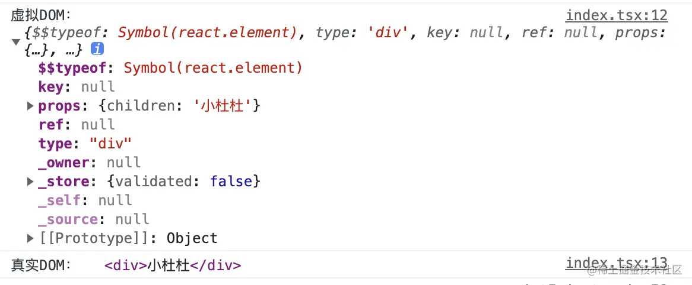
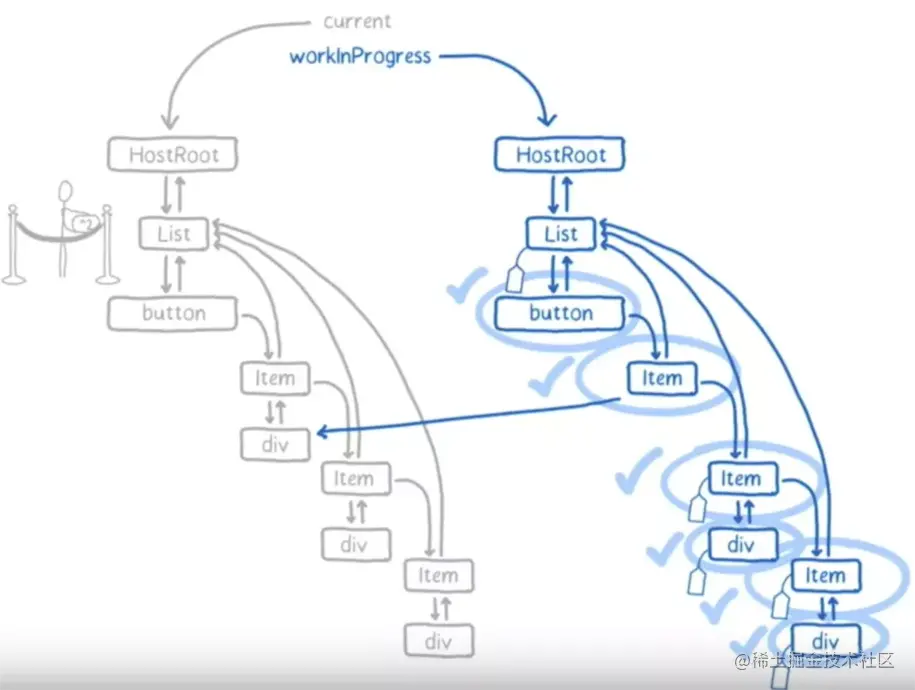

## React 设计理念

### 问题：React 运行机制 / 架构

##### 设计理念

浏览器的性能瓶颈在 CPU 和 IO。

React 解决 CPU / IO 的瓶颈：**异步可中断的更新**。

浏览器的刷新率通常为 60Hz/s，也就是 16.6ms 刷新一次页面。

- 16.6ms 中，浏览器需要完成：JS脚本执行、样式布局、样式绘制。

当渲染的处理时间超过 16.6ms，页面就会卡顿。通常使用节流（间隔触发）、防抖（最后一个触发），都是通过限制更新频率来提升性能。

React 把同步更新，变为异步可中断进行更新。React 通过 fiber 把渲染任务切分为多个小段，每个小段执行完毕后会把主动权交还浏览器，浏览器则可根据当前任务的优先级，把剩余时间分配给更重要的任务，以确保尽可能的响应及时。

- 16.6ms 中，当浏览器执行完重要任务后，会把剩余时间交给 React 取执行尚未处理完的任务，如果剩余时间不够，就会把剩余任务在下一个 16.6ms 周期中执行。

这样，浏览器就有充足的时间进行样式布局和页面绘制，而 React 也可以在分配给自己的时间内执行完任务。

##### 异步可中断

React 15+ 实现了异步可中断的架构。

- Scheduler 调度器：调度更新，给更新任务安排优先级。
- Reconcoler 协调器：决定需要更新什么组件，当更高优任务来到时，可中断当前任务。
- Renderer 渲染器：将组件更新到视图中，渲染过程是同步且不可中断的，需要一气呵成。

在 render 函数的执行周期中，有调度（事件触发）、协调（render）、渲染（commit）三个阶段：


#### 1 调度阶段

当 React 需要更新时，更新任务首先被 Scheduler 调度器 处理。

处理的工作有：

- **创建项目根 Fiber 节点**。首次渲染页面时，会创建唯一的根节点 FiberRoot Node。
- **创建应用根 Fiber 节点**。每一个 `ReactDOM.render()` 都会创建一个 rootFiber。
- **初始化事件**。Scheduler 会把任务按照优先级排序，让更高优的任务首先进入 Reconciler 协调器进行下一步处理。


#### 2 协调阶段

**协调阶段是 Reconcoler 协调器在参与，也被称为 render 阶段**，如下图 renderRootSync 都为协调阶段。


Scheduler 调度器会通过 diff 算法，处理传入的更新任务。diff 完毕后，会由 fiber 构成一颗新的 fiber 树，然后提交给 Renderer 渲染器进一步处理。

- 关于 virtual DOM 的概念，有两种说法：
  - 广义的说，由 fiber 组成的树为 fiber 树，也是一个 virtual DOM 树；
  - 狭义的说，通过 React element 组成的树，是 virtual DOM 树，在协调阶段，会把 virtual DOM 转化为 fiber tree。
- 关于组件中的 render 函数的作用：
  - 在调和阶段的整体任务，是通过 fiber 节点构建一棵 workInProgress fiber tree。这个构建过程是从根节点向子节点深度优先遍历完成的。
  - 遇到，某个组件，会执行其调和阶段的生命周期函数，然后调用组件的 render。 render 会根据本次更新中的 state 变化，通过 `React.createElement` 生成新的 React Element 对象，在新的对象上保存了新的 state + props 状态。
  - 该组件的 fiber 节点会根据对应的 React element 完成构建。同时对副作用变化打上标记。


##### 该阶段的特点：

- **可暂停**。而在 Reconciler 在进行 diff 算法时，如果调度器传来一个更高优的任务，那么当前处理的更新任务会被暂停，让调度器放入任务队列中，优先处理传入的更高优任务。
- **用户透明**。由于调度器和协调器是在内存中工作，即使 diff 中断，用户也无法感知到页面渲染被中断 / 卡顿。
- **构建 work In Progres 树**。diff 算法会构建一颗虚拟 dom 树，视图上真实存在的节点，都有一个对应的节点在虚拟 dom 上。需要更新的节点会被打上标记 Update。被打了标记的虚拟 dom 会交给渲染器。

##### 该阶段的工作：

**调和 work IN Progress Tree**，也可以理解为构建 work IN Progress Tree。

构建过程是一个递归过程，从  `rootFiber`  开始向下深度优先遍历的，具体可以分为 n 个：递阶段 + 归阶段。

**（1）递阶段**

递阶段，是向下调和的过程。

调用 **beginWork** 方法，从  `rootFiber`  开始向下深度优先遍历，为遍历到的每个 fiber 节点。

该方法会根据传入的 `Fiber节点` 创建 `子Fiber节点`，并将这两个 `Fiber节点` 连接起来（**fiber.child** 指针）。当遍历到叶子节点（即没有子组件的组件）时就会进入 “归” 阶段。

如果不是初次渲染，而是更新页面，此时已经存在一个构建好的 **Current Tree**，**beginWork** 方法会由 fiberRoot 根节点，按照 **child** 指针逐层向下调和。

beginWork 具体的工作如下：

- 对于组件，执行部分生命周期，执行 render ，得到最新的 children。
- 向下遍历调和 children ，复用 oldFiber ( diff 算法)。
- 打不同的副作用标签 effectTag ，比如类组件的生命周期，或者元素的增加，删除，更新。这些被标记的节点，会在归阶段收集起来，形成单项链表 effectList。

```js
// 生命周期钩子会在协调阶段被调用：
constructor
componentWillMount 废弃
componentWillReceiveProps 废弃
static getDerivedStateFromProps
shouldComponentUpdate
componentWillUpdate 废弃
render


// 常见的 effect tag
export const Placement = /*             */ 0b0000000000010;  // 插入节点
export const Update = /*                */ 0b0000000000100;  // 更新fiber
export const Deletion = /*              */ 0b0000000001000;  // 删除fiebr
export const Snapshot = /*              */ 0b0000100000000;  // 快照
export const Passive = /*               */ 0b0001000000000;  // useEffect的副作用
export const Callback = /*              */ 0b0000000100000;  // setState的 callback
export const Ref = /*                   */ 0b0000010000000;  // ref
```


**（2）归阶段**

归阶段，是向上并归的过程。

调用 **completeWork** 方法，来处理当前的 Fiber 节点。

当某个 `Fiber节点` 执行完 `completeWork`，如果其存在 `兄弟Fiber节点`（**fiber.sibling** 指针 ），会进入其 `兄弟Fiber` 的 “递”阶段。如果不存在 `兄弟Fiber`，会进入 `父级Fiber` 的“归”阶段（**fiber.return** 指针）。

在此期间会形成 effectList 单项副作用链表。如果是初次渲染的初始化流程，会创建 DOM ，对于 DOM 元素进行事件收集，处理 style，className 等工作。

- completeUnitOfWork
  会将 effectTag 的 Fiber 节点会被保存在一条被称为 effectList 的单向链表中。在 之后的 commit 阶段，将不再需要遍历每一个 fiber ，只需要执行更新 effectList 就可以了。
- completeWork 阶段
  对于组件，会处理 context ；
  对于元素标签初始化，会创建真实 DOM ，将子孙 DOM 节点插入刚生成的 DOM 节点中；
  会触发 diffProperties 处理 props ，比如事件收集，style，className 处理，在15章讲到过。


**（3）进入循环**

“递”和“归”阶段会交错执行，直到 “归” 到 `rootFiber` 根结点。至此，`render阶段` 的工作就结束了。

- 构成（调和）了由 fiber 节点构成的 work IN Progress Tree 树。
- 构成了接下来 commit 阶段需要执行更新的 effectList 副作用链表。


#### 3 渲染阶段

**渲染器工作的阶段，是 Renderer 渲染器在参与，被称为 commit 阶段**，下图中，commitRoot 就是 commit 阶段。


本次更新由哪些组件需要更新视图，会让渲染器来分别执行这些视图更新操作。

每一个子阶段都是一个 while 循环，**从头开始** 遍历副作用链表。

- 视图更新操作：对 DOM 节点的增、删、查、改。
- 渲染器把被打了标记的虚拟 dom 对应的真实 dom 节点执行更新 dom 的操作。
- Mutation 突变，对于浏览器来说，就是 DOM 操作。


该阶段触发的生命周期函数有：

```js
// before mutation 阶段
getSnapshotBeforeUpdate

// mutation 阶段
componentWillUnmount

// layout 阶段
componentDidMount
componentDidUpdate
```


**（1）mutation 前阶段**

通常被称之为 before mutation 阶段，调用函数 `commitBeforeMutationEffects`。

- **class 组件**。执行 `getSnapshotBeforeUpdate` 生命周期函数。因为 Before mutation 还没修改真实的 DOM 所以此时类组件可以获得更新 DOM 前的快照。
- **函数组件**。创建微任务，给 `useEffect` 的回调函数设定 normal Scheduler Priority，然后等待 commit 完成后，再 **异步执行**。防止同步执行时阻塞浏览器做视图渲染（如果对 dom 操作，则又要重协调）。


**（2）mutaiton 阶段**

通常被称之为 mutation 阶段，调用函数 `commitMutationEffects`。

遍历包含 EffectTag 的 fiber 节点，所组成的 effectList 链表。处理每一个 fiber 节点的副作用，这些副作用有：

- **DOM 相关操作**：增删改。Placement 插入，Update 更新 DOM 属性，Deletion 删除。
- **class 组件**。调用 class 组件 componentWillUnmount 生命周期函数。
- **函数组件**。执行 useLayoutEffect 的销毁函数，useLayoutEffect 是 **同步执行** 的。
- **Ref 属性**。解绑/更新 Ref 属性。


**（2.1）更改 current 指针**

在进入 layout 节点前，会执行：

```js
root.current = finishedWork;
```

这就是 React 架构的双缓存机制中，Work In Progress Fiber 树完成渲染，此时 `fiberRoot.current` 指针会从之前的 current Fiber 树，指向现在的 Work In Progress Fiber 树。此时，Work In Progress Fiber 树，就变成了新的 Current Fiber 树。

在该实际触发，是因为在 layout 阶段会执行 `componentDidMount` 和 `componentDidUpdate `这两个生命周期函数，此时，Current Fiber 树已经指向了本次完成的 Work In Progress Fiber 树，这两个生命周期会对新的 Current Fiber 树进行操作。


**（3）mutation 后阶段**

通常被称之为 layout 阶段，调用函数 `commitLayoutEffects`。

- **函数组件**。
  - 执行 useLayoutEffect 的回调函数，是 **同步执行** 的。
  - 绑定 useEffect 的销毁 + 回调函数，以便在 commit 阶段完成后，**异步执行** useEffect 销毁 + 回调函数。
- **类组件**。
  - 根据组件状态，同步执行，调用 class 生命周期：
    - ComponentDidMount（组件挂载）、ComponentDidUpdate（组件卸载）
  - 同步执行 `this.setState(arg, callback)` 中的 `callback`回调。
- 处理 Ref 属性。


### 问题：algebraic effects

Process 进程、Thread 线程、Coroutine 协程、Fiber 纤程

- JavaScript 通过 Generator，在协程层面实现了异步可中断更新。

algebraic effects 代数效应：是函数式编程中的概念，用于将副作用从函数调用中分离。

> - https://zhuanlan.zhihu.com/p/380855727
>
> - https://juejin.cn/post/6844903976299675662


#### algebraic effects 的由来

- 在异步编程中，如果想用同步的思维编写代码，就要使用 async/await。但 async 函数具有传染性，调用 async 的函数也必须要用 async 定义。这样逐渐传染出去，所有的函数都需要变成异步函数，造成了大范围影响，同步异步代码也不易区分。

新的需求：在同步代码中，可以调用异步函数并获得结果。但不影响同步函数的逻辑（同步函数不要 async 定义）

- try/catch  + throw 具有跳出当前代码块（throw 区），然后冒泡到 try/catch 被捕获，在 catch 继续执行代码的能力。

新的需求：Js 中，具有从同步代码跳出的逻辑，就是 try/catch 了，但只能从 throw 跳出到 catch，不可以再携带结果回到 throw 中。我们如何定义这样的功能呢？

- 此时我们需要一个可以在 throw 区暂停执行，从 catch 区域获取答案，再跳回 throw 处继续执行代码的 “异步” 能力。这就是许多文章中说的定义一个语法：perform，try/handle，resume with。

```js
function getName(user) {
  let name = user.name;
  if (name === null) {
    // 1. 我们在这里 perform 了一个 effect：name = perform 'ask_name';
    name = perform 'ask_name';
    // 4. …… 然后最终回到了这里（name 现在是「Arya Stark」了 
  }
  return name;
}

function makeFriends(user1, user2) {
  user1.friendNames.add(getName(user2));
  user2.friendNames.add(getName(user1));
}

const arya = { name: null };
const gendry = { name: 'Gendry' };

try {
  makeFriends(arya, gendry);
} handle (effect) {
  // 2. 我们跳到了handler（就像 try/catch）
  if (effect === 'ask_name') {
    // 3. 然而我们可以 resume with 一个值（这就不像 try / catch 了！）
    resume with 'Arya Stark';
  }
}
```

- 通过 perform + resume with 实现对后续流程的控制，控制反转 + 控制恢复。
- 通过 try/handle 实现跨调用栈捕获当前 continuation（延续—），在上面的例子中，就是让同步代码可以继续执行下去的那个值（name）。resume with 可以替换 当前的 continuaiton，让 perform 处恢复执行。

需求满足：通过上述的语法糖，实现了在同步代码中，调用一个异步函数但不影响同步代码区的目的。


#### Algebraic Effects 解决的问题

**分离了 "主逻辑做什么" 和 "副作用实现"**。

在上面的例子中，

- **主逻辑** 就是 getName 函数要通过 user 对象获得并返回 name。
- **副作用** 就是当出现找不到名字时，通过 perform 拿到一个名字。

所以，副作用的实现：perform 处的 `ask_name` 换来了 resume with 处的 `Arya Stark`。就是代数效应需要解决的核心问题。通过穿透调用栈的换元法实现副作用。

- Algebraic: 代数式，可以理解成初中数学的 **换元法**。
- Effect：副作用。

总结来说，代数效应解决了 **分离了 "主逻辑做什么" 和 "副作用实现"**，也就是确保主逻辑和代码不受影响的情况下，实现副作用。这需要：

1. 穿透能力：可以跨调用栈获取当前 Continuation。
2. 恢复执行：可以替换当前 Continuation 内 Effect 的实现。


#### React Hooks 思想

React Hooks 的代码示例：

```jsx
function useLog(id) { 
  useEffect(() => { 
    console.log(id, 'mount') 
    return () => { 
      console.log(id, 'unmount') 
    } 
  }, []) 
} 
 
function Foo() { 
  useLog('Example') 
  return <div>Foo</div> 
} 
 
function Bar() { 
  useLog('Bar') 
  return <div>Bar</div> 
} 
```

穿透能力：

useHook 实现了穿透调用栈的效果。不论 hooks 如何嵌套在作用域中，只要保证是同步调用 hooks，都能正确作用于对应组件。

每一个 Function Component 看作是 React 里的 Continuation，对 Continuation 的调度是交给 React Fiber 控制的，也就是 fiber 实现了代数效应。

恢复执行：`useHook(callback)` 中，callback 是该组件副作用的实现，hook 抽象出了 React 组件里的副作用。让组件内的主逻辑不受影响。


### 问题：初次渲染 / 更新 的区别

##### 初次渲染

初次渲染时，没有两颗相同的 fiber tree。 FiberRootNode.current 会指向一个单独的 RootFiberNode 节点，其节点下没有任何子节点（即`current Fiber树`为空）。

于此同时，会在内存中构建 Work In Progress Fiber Tree。WIP 树和 CUR 树的 FiberNode 节点会通过 .alternate 相互指向：


当 workInProgress 树构建完成后，代码中称之为 finishedTree，此时 `.current` 指针指向 finishedTree，使其变为 current fiber tree，初始化流程在协调阶段的任务完成。


##### 更新 Update

基于上述 tree，当用户点击一次按钮，发生页面更新时，会重新创建一颗 workInProgress tree。

通过 diff 算法，workInProgress tree 会决定是否复用 current fiber tree 同一层级的 fiber 节点数据。

- 能被复用，本次更新中，需要做组件的 update、元素的 move 和 update 等操作；
- 不能复用，本次更新中，需要做组件的 mount 和 umount、元素的 insert 和 delete 等操作。

在构建 workInProgress Fiber 树时,  **会尝试复用 current Fiber 树中已有的 Fiber 节点内的属性**。在 **首屏渲染** 时，只有 rootFiber 存在对应的 current fiber（即 rootFiber.alternate），无法复用。

- **处于同一层次的节点，会通过 .alternate 属性相互指向，workInProgress tree 也会优先复用 current fiber tree  处在同一层次节点的属性。**

RootFiber 已经创建不需要复制，但其子节点由于尚不存在， 则 react 需要重新创建一份，和 current 树上的 fiber 建立起 alternate 关联，然后复制 current 树上节点的属性。渲染完毕后，workInProgresss 再次变成 current 树。


##### 再次更新

如果进行下一次更新，那么会将 current 的 alternate 作为基础（如图右树），复制一份作为 workInProgresss ，然后进行更新。

- 所谓 “复制”，具体是指在构建 workInProgress Fiber 树时会尝试复用 current Fiber 树中已有的 Fiber 节点（.alternate 可以相互指向的，同一层次的节点）内的属性。而决定是否复用过程，就是 diff 算法。


> https://juejin.cn/post/7118259566868955167
>
> https://github.com/lizuncong/mini-react/blob/master/docs/render/%E6%B7%B1%E5%85%A5%E6%A6%82%E8%BF%B0%20React%E5%88%9D%E6%AC%A1%E6%B8%B2%E6%9F%93%E5%8F%8A%E7%8A%B6%E6%80%81%E6%9B%B4%E6%96%B0%E4%B8%BB%E6%B5%81%E7%A8%8B.md
>
> https://www.jianshu.com/p/6660d3ab0394


### 问题：哪些方式可以触发 update 更新？

对于用户来说，对 UI 的操作都有可能触发 update 更新：拖动组件、输入文本、点击按钮改变 state 等等。

对 React 内部来说，通过对 DOM 事件监听，会触发对应的回调函数，按照可以触发更新的方法所隶属的组件分类：

- `ReactDOM.render()` —— HostRoot
- `this.setState()` —— ClassComponent
- `this.forceUpdate()` —— ClassComponent
- `useState()` —— FunctionComponent
- `useReducer()` —— FunctionComponent

可以看到，一共三种组件（`HostRoot` | `ClassComponent` | `FunctionComponent`）可以触发 update 更新。


## diff

### 问题：什么是 virtual DOM

从结构来看：虚拟 DOM 是一个 JavaScript 对象。其保存了每一个节点的 type、props、key、ref、children 等信息（具体看 fiber 结构）。

从本质来看：在 React 运行时，有两颗 virtual DOM（双缓存机制）：current fiber 树 + work in progress fiber 树。其是由于 fiber 对象所组成的。

从来源来看：虚拟 DOM 是通过 `React.creatElement()` 创建的 React Element 构建的 DOM 树。

对比真实DOM来看：virtual DOM要比真实 DOM 轻的多，少了很多用不到的默认属性和方法。


测试：

用 `React.createElement` 和 `document.createElement` 创建节点并打印：

```js
const VDOM = React.createElement('div', {}, '小杜杜');
const DOM = document.createElement("div");
DOM.innerHTML = '小杜杜';

console.log(`虚拟DOM：`, VDOM);
console.log(`真实DOM：`, DOM);
```

结果：



虚拟 DOM 是一个 js 对象，而真实 DOM 上还挂在了许多默认属性和方法：


虚拟 DOM 的结构：

- type：实际的标签
- props：标签内部的属性（除 `key` 和 `ref` ，会形成单独的 `key` 名）
- children: 为节点内容

```jsx
// 转化前
<div className='Index'>
  <div>Hello World 123</div>
  <ul>
    <li>React</li>
    <li>Vue</li>
  </ul>
</div>

// 转化后
{
  type: 'div',
    props: { class: 'Index' },
      children: [
        {
          type: 'div',
          children: 'Hello World 123'
        },
        {
          type: 'ul',
          children: [
            {
              type: 'li',
              children: 'React'
            },
            {
              type: 'li',
              children: 'Vue'
            },
          ]
        }
      ]
}
```


### 问题：virtual DOM 的优势

主要有三：提高效率、提升性能、增强兼容性。

##### 1. 提高效率

使用原生 JS 的时候，我们需要的关注点在 **操作DOM** 上，而 `React` 会通过 `virtual DOM` 来确保 `DOM` 的匹配。程序员只需使用 JSX 来进行声明式编程，也就是说，程序员不需关系 dom 是如何构建 / 操作 / 更新的，React 会处理一切，而只需要关系业务逻辑。

##### 2. 提升性能

虚拟 DOM 通过 diff 算法 + 基于双缓存的批量处理机制，优化了每次更新真实 DOM 得操作，使更新尽可能的局部、改动尽可能的少，从而减少对真实 DOM 的操作，最终提升性能。

##### 3. 增强兼容性

基于 virtual DOM，让 React 可以兼容各种浏览器，甚至跨平台兼容。

- `React` 基于虚拟 DOM 实现了一套自己的事件机制，并且模拟了事件冒泡和捕获的过程，采取 **事件代理**、**批量更新** 等方法，从而磨平了各个浏览器的事件兼容性问题。
- 对于跨平台，`React` 和 `React Native` 都是根据 **虚拟DOM** 渲染出相应平台的 `UI` 层，只不过不同的平台有不同的渲染引擎而已。

> - https://juejin.cn/post/7116326409961734152


### 问题：diff 原理

##### 概述

从 React 的运行原理来说，React diff 是协调（**reconciliation**）阶段的主要任务，协调阶段也称 render 阶段。React diff 会计算出 Virtual DOM 中真正变化的部分，并构建好一颗 Work In Progress Fiber Tree 和一个 EffectList 单项符作用链表，**指名哪些节点需要被更新**。在渲染阶段（commit 阶段），React 会只针对 effectList 上的 fiber 节点进行 DOM 操作，而不是对整个页面（树）进行重新渲染。

传统 diff 算法使用循环递归对节点一次对比，时间复杂度为 *O(n^3)* 。React 改进后将时间复杂度降为 *O(n)*。

React diff 的策略有：

1. Web UI 中 DOM 节点跨层级的移动操作特别少，可以忽略不计。
2. 拥有相同类的两个组件将会生成相似的树形结构，拥有不同类的两个组件将会生成不同的树形结构。
3. 对于同一层级的一组子节点，它们可以通过唯一 id 进行区分。

基于以上三个前提策略，React 分别对 tree diff、component diff 以及 element diff 进行算法优化：

- tree diff、component diff、element diff

##### tree diff

基于策略一，React 对树的 diff 算法进行优化，即两棵树只会对同一层次的节点进行比较，而不考虑跨等次的节点比较。而在初次构建 fiber tree 时，基于双缓存的思想，已经构建好了 work in progress fiber tree 和 current fiber tree，且两棵树的统一层级的 fiber 节点会用 fiber.alternate 相互连接。这样对一棵树只需遍历一次，便能完成整个 DOM 树的比较。

- **跨层级移动操作的处理**。React 对节点跨层级的移动操作不会 diff 比较，只有销毁旧节点和重新创建。所以通过同层遍历，React 发现同级节点已经发生变化，则会把该节点和其子节点全部销毁，然后重新创建新节点。


**🚀 性能优化**：在页面中使用 antd 的 model 模态框时，尽可能不要移除该节点，而是使用 css 隐藏掉。


##### component diff

React 是基于组件构建应用的，diff 算法会在组件间也有优化，基于策略 2：

- 如果是不同类型的组件进行 diff，和 “跨层级的移动操作” 一样，会直接销毁整个旧组件，重新创建新组件。
- 如果是同一类型的组件进行 diff，则 DOM 结构大致相似，会按照 tree diff 算法进行比较。


**🚀 性能优化**：如果是同一个组件，本次更新时 Virtual DOM 没有任何变化（props、state 也没有变化），那么用户可以通过性能优化告知 React ，diff 会跳过该组件的对比。

- 对于 class 组件来说，通过 shouldComponentUpdate + shallowEqual，或直接使用 PureComponent。
- 对于 function 组件来说，通过 React.memo 包裹。

> **shouldComponentUpdate** 
>
> render （调合）阶段的生命周期函数。**用于拦截组件渲染**。
>
> 1. 父组件更新，子组件必须更新。
>
> 当使用component时，父组件的state或prop更新时，无论子组件的state、prop是否更新，都会触发子组件的更新，这会形成很多没必要的render，浪费很多性能。
>
> 2. shallowEqual 可以浅对比组件的 props 和 state 是否发生变化，从而避免无意义的 render。
>
> 在 shouldComponentUpdate 中，使用 shallowEqual 比较组件的 props 和 state 是否发生变化，最后返回 true 的时候，当前组件进行 render；返回 false 则不进行 render。
>
> 
>
> **PureComponent / React.memo**
>
> PureComponent 是针对类组件的语法糖，而 React.memo 让函数组件也可以使用，通过 React.memo 包裹函数组件，回返回一个高阶组件。
>
> - 另：函数组件没有 shouldComponentUpdate 周期。
>
> React 给出了官方的定义：使用 PureComponent 定义组件。可以完成上述 2 的操作。PureComponent 会在 shouldComponentUpdate 周期进行一次 shallowEqual 浅对比，从而尽可能避免 render。


##### element diff

当 fiber 节点处于同一层级时，React diff 提供了三种节点操作，分别为：**INSERT_MARKUP**（插入）、**MOVE_EXISTING**（移动）和 **REMOVE_NODE**（删除）。

- **插入**：当前节点所在的组件，不在原来的集合中存在，即是全新的节点，执行插入操作。
- **移动**：当前节点所在的组件，存在于原来的集合中，且节点内可更新（ DOM 结构相似等递归判断），则根据 React 唯一 key 进行区分，并且执行移动操作。
  - 如：(A,B,C,D) → (A,D,B,C)，传统 diff 会把 B,C,D 全部销毁并重新创建，而 React 仅移动位置。
- **删除**：当前节点的所在组件虽然存在在原来的集合中，但节点不能直接复用和更新，所以需要删除旧节点。或旧节点已经不再需要，执行销毁。

节点间的移动策略，是通过节点下标 lastIndex/_mountIndex 判断，这里不细说了。


可否复用的原则：

- 如果 key 未定义，则默认 key = null。
- 更新后，判断 key 是否改变：
  - key 改变，不能复用。
  - key 没改变，继续判断 type 是否改变：
    - type 改变，不能复用。
    - type 没变，当前节点可以复用。需要判断其 children 下的节点是否需要更新。


**🚀 性能优化**：

1. 对同一层级的一组子节点，可以给它们添加唯一的 key 进行区分，则 React 可以在更新前后通过 key 去判断该节点及其子节点是否发生更新，提升性能。
2. 尽可能保持 DOM 结构稳定，减少大量移动同级节点的操作，比如从队头插入新节点 / 将对尾巴的节点移动到队头。

> 参考：
>
> https://juejin.cn/post/7116326409961734152
>
> https://juejin.cn/post/6844903944796258317
>
> https://zhuanlan.zhihu.com/p/20346379
>
> https://juejin.cn/book/6945998773818490884/section/6959807335720026150


### 问题：双缓存模型

**产生原因**：

1. 双缓存模型是一个解决图形编程中 “**闪烁问题**” 的方案。其基本原理是在内存中绘制当前帧，绘制完毕后直接用当前帧替换上一帧，由于省掉了帧与帧之间替换的时间因此可以有效的避免闪烁问题。 
2. react 15+ 的新架构，协调阶段的异步可中断。通过双缓存，当更高优任务来到，需要中断当前 diff 的树时，由于存在 current fiber tree 正常工作。所以 workInProgress fiber tree 的中断并重新构建，不会影响页面的正常展示，对用户透明。


**实施阶段**：在协调阶段，react 通过 双缓存机制输出两颗 fiber tree（work in progress fiber tree 内存中的树，current fiber tree 渲染树）。这两棵树中，同级节点通过 `fiber.alternate` 指针相互连接。current fiber tree 代表了页面正在展示的 DOM 内容，而 work in progress fiber tree 是内存中 react 正在构建的 fiber tree，是本次更新之后页面展示的 DOM 内容。

**实施过程**：当触发更新时，react 会通过 diff 算法（官方称 Reconciliation）对比 current fiber tree，构建一颗 work in progress fiber tree。

- 在构建 workInProgress Fiber 树时,  **会尝试复用 current Fiber 树中已有的 Fiber 节点内的属性**。在 **首屏渲染** 时，只有 rootFiber 存在对应的 current fiber（即 rootFiber.alternate）。
  - 更多见问题：初次渲染 / 更新的区别。
- 引入协调阶段的工作内容：深度遍历优先、递阶段、归阶段、构建 effectList 副作用链。
- 渲染阶段：在下一次渲染的时候，直接复用缓存树做为下一次渲染树，上一次的渲染树又作为缓存树，这样可以防止只用一颗树更新状态的丢失的情况，又加快了 DOM 节点的替换与更新。

总结：一个元素最多存在两个版本的 fiber 节点，一个 current 版本和当前浏览器页面对应，一个 WorkInProgress 版本，WorkInProgress 版本是正在协调的节点。


## Fiber

### 问题1 为什么要引入 Fiber 架构？

fiber 是针对单进程的一种调度策略。

在操作系统中，介绍过常见的单处理进程调度策略：

- 先到先得(First-Come-First-Served, FCFS)
  - 优点：简单，易实现
  - 缺点：对短进程不利、对 I/O 密集型进程不理。
- 轮转
  - 抢占策略。确定合理的时间片长度，公平地给每一个进程一定的执行时间，当时间消耗完毕或阻塞，操作系统就会调度其他进程，将执行权抢占过来。
- 最短进程优先(Shortest Process Next, SPN)
  - 缺点：对长进程不利，会饥饿。
- 最短剩余时间(Shortest Remaining Time, SRT)
  - 根据剩余时间的长短，优先执行可最快完成的进程。
  - 缺点：对长进程不利，会饥饿。
- 最高响应比优先(HRRN)
  - 响应比 = （等待执行时间 + 进程执行时间） / 进程执行时间
  - 解决长进程饥饿问题，引入了等待执行时间，让等待时间较长的可以尽可能优先执行。
- 反馈法，多队列
  - 每个进程一开始都有相同的优先级，每次被抢占(需要配合其他抢占策略使用，如轮转)，优先级就会降低一级。因此通常它会根据优先级划分多个队列

浏览器中，JavaScript 的执行也是单线程的。Javascript 引擎和页面渲染引擎在同一个`渲染线程`，GUI 渲染和 Javascript执行 两者是互斥的。如果让 js执行长期占据渲染进程，浏览器就会呈现 “卡死” 状态，页面无法刷新。

对于’前端框架‘来说，解决这种问题有三个方向:

- 1️⃣ 优化每个任务，让它有多快就多快。挤压CPU运算量
- 2️⃣ 快速响应用户，让用户觉得够快，不能阻塞用户的交互
- 3️⃣ 尝试 Worker 多线程

Vue 从1⃣️角度入手，通过模版 + 响应式机制，提升任务运行速度。

React 从2⃣️角度入手，通过 fiber 架构，把任务切分，提升浏览器响应速度。

具体为：

React 有三大模块：

- Scheduler 调度器：调度更新.

- Reconcoler 协调器：决定需要更新什么组件.

- Renderer 渲染器：将组件更新到视图中.

其中，`Reconcilation` 协调阶段是 CPU 密集型操作，fiber 把该环节切分，使 `Reconcilation` 过程变成可中断，适时的让出 CPU 执行权（16.6ms），好处：

- 不再一次性操作大量 DOM 节点，而是分批延时对 DOM 进行操作。提升了浏览器的响应速度。
- 给浏览器一点喘息的机会，他会对代码进行编译优化（JIT）及进行热代码优化，或者对reflow进行修正


### 问题2 什么是 Fiber

是一种流程控制机制：

- 一个动态执行单元（异步可中断 + 控制权让出）
- 一个执行单元（`requestIdleCallback`)
- 一种数据结构（ fibfer 节点）


#### 1 流程控制机制

Fiber 也称协程、或者纤程。 是一种控制流程的让出机制。协程和线程并不一样，协程本身是没有并发或者并行能力的（需要配合线程）。

Fiber 实现了代数效应（看代数效应的例子），可以近似的理解为是 async/await + try/catch 的结合。

- 普通函数的执行过程中无法被中断和恢复：async/await 实现了中断和恢复。
- 但因此导致了副作用：async具有传染性，需要全部的函数都为 async。如果可以类似 try/catch 的效果，让副作用和主逻辑分离，则代码逻辑更清晰。

**React 渲染的过程可以被中断，可以将控制权交回浏览器，让位给高优先级的任务，浏览器空闲后再恢复渲染**


合作式调度 Cooperative Scheduling：浏览器中没有抢占机制，无法中断正在执行的任务，所以 React 需要具备让出机制，主动让出控制权。

这是一种给予信任的契约合作机制：React 会根据自己的任务量，向浏览器申请适量的时间片。而浏览器会先执行更高优先级的任务，再把剩余时间分给 React，React 也会在规定的时间内完成任务执行，归还控制权。


那么，如何确定剩余时间呢？或者哪些任务是更高优先级的呢？

在一帧（16.6 ms）中，浏览器会执行以下任务：

- 处理用户输入事件
- Javascript执行
- requestAnimation 调用
- 布局 Layout
- 绘制 Paint

如果在执行完这些必须任务后，还有剩余的时间，就可给 React 去使用：

浏览器调用 `requestIdleCallback` 的回调：


为了避免剩余时间不足，任务被饿死，React 定义了一个超时时间。如果任务等待时间到达超时时间后，就会提升优先级，立即执行。

- `Immediate`(-1) - 这个优先级的任务会同步执行, 或者说要马上执行且不能中断
- `UserBlocking`(250ms) 这些任务一般是用户交互的结果, 需要即时得到反馈
- `Normal` (5s) 应对哪些不需要立即感受到的任务，例如网络请求
- `Low` (10s) 这些任务可以放后，但是最终应该得到执行. 例如分析通知
- `Idle` (没有超时时间) 一些没有必要做的任务 (e.g. 比如隐藏的内容), 可能会被饿死


#### 2 执行单元

将它视作一个执行单元，每次执行完一个 '执行单元'，React 就会检查现在还剩多少时间，如果没有时间就将控制权让出去。

流程：

- 假设用户调用 `setState` 更新组件, 这个待更新的任务会先放入队列中，然后通过 `requestIdleCallback` 请求浏览器调度。

- 浏览器有空闲时间，或者任务超时，就会调用 `performWork` 来循环遍历，并执行队列中的任务。

`workLoop` ：它会从更新队列 (updateQueue) 中弹出更新任务来执行，每执行完一个 ‘`执行单元`‘ ，就检查一下剩余时间是否充足，如果充足就进行执行下一个 `执行单元`，反之则停止执行，保存现场，等下一次有执行权时恢复。


#### 3 一种数据结构

查看问题3.


### 问题3 Fiber 的结构

在 React 16以前，Reconcilation 是同步的、递归执行的。也就是说，Dom 的构建基于 **函数调用栈** 的Reconcilation算法，因此通常也称它为`Stack Reconcilation`。

但基于调用栈的方式不能随意中断 / 恢复现场，也不利于异步处理的代数效应实现。 如果要恢复递归现场，可能需要从头开始，恢复到之前的调用栈。

所以，React 16 通过模拟函数调用栈，将递归转化成迭代，使用 **链表** 构建。

 每个 VirtualDOM 节点，都使用一个 `Fiber` 表示：

```js
interface Fiber {
  /**
   * ⚛️ 节点的类型信息
   */
  // 标记 Fiber 类型: 函数/类组件、根元素、dom元素、文本节点、Fragment、MemoComponent等
  tag: WorkTag,
  // 节点元素类型, 是具体的类组件、函数组件、宿主组件(字符串)
  type: any,

  /**
   * ⚛️ 结构信息
   */ 
  // 指向父节点，或者render该节点的组件
  return: Fiber | null,
  // 指向第一个子节点
  child: Fiber | null,
  // 指向下一个兄弟节点
  sibling: Fiber | null,
    
  /**
   * ⚛️ 节点状态 state
   */
  // 节点实例(状态)：
  //        对于宿主组件，这里保存宿主组件的实例, 例如DOM节点。
  //        对于类组件来说，这里保存类组件的实例
  //        对于函数组件说，这里为空，因为函数组件没有实例
  stateNode: any,
  // 新的、待处理的props
  pendingProps: any,
  // 上一次渲染的props
  memoizedProps: any, // props、events
  // 上一次渲染的组件状态	
  memoizedState: any, // state、hooks

  /**
   * ⚛️ 副作用
   */
  // 当前节点的副作用类型，例如节点更新、删除、移动
  effectTag: SideEffectTag,
  // 和节点关系一样，React 同样使用链表来将所有有副作用的Fiber连接起来
  nextEffect: Fiber | null,

  /**
   * ⚛️ 替身
   * 指向旧树中的节点，WorkInProgress会把alternate对应的fiber属性完整的复制过来
   */
  alternate: Fiber | null,
}
```

Fiber 包含的属性可以划分为 5 个部分:

- **🆕 结构信息**
  - Fiber 使用链表的形式来表示节点在树中的定位，将 virtualDom 构建起来。
- **节点类型信息**
  - tag 表示节点的分类、type 保存具体的类型值，如div、Component。
- **节点的状态**
  - 节点的组件实例、props、state 等，它们将影响组件的输出。
- **🆕 副作用**
  - 在 Reconciliation 过程中发现的 '副作用'(**变更需求**) 就保存在节点的 `effectTag` 中(想象为打上一个标记)。
  - 使用链表结构，将本次渲染的所有节点副作用都收集起来。在遍历过程中 React 会将所有有 ‘副作用’ 的节点都通过 `nextEffect` 连接起来。
- **🆕 替身** 
  - React 在 Reconciliation 过程中会构建一颗新的 virtualDOM (官方称为**workInProgress tree**，**WIP树**)。是一颗表示当前工作进度的树。
  - 还有一颗表示已渲染界面的**旧树（current tree）**，这棵树代表了已经渲染的并正在显示的页面。
  - React就是一边和旧树比对，一边构建WIP树的。 alternate 指向旧树的同等节点。



上图是 Reconciliation 完成后的状态，左边是旧树，右边是WIP树。对于需要变更的节点，都打上了'标签'。 在提交阶段，React 就会将这些打上标签的节点应用变更。


### 问题：Fiber 更新机制

初始化更新：

**第一步：创建 fiberRoot 和 rootFiber**

- `fiberRoot`：首次构建应用， 创建唯一的 fiberRoot 节点，是整个 React 应用的根基。
- `rootFiber`： 通过 `ReactDOM.render()` 渲染出来的。一个 React 应用可以有多 ReactDOM.render 创建的 rootFiber ，但是只能有一个 fiberRoot（应用根节点）。

```js
// rootFiber
ReactDOM.render(<Index/>, document.getElementById('app'));
```

第一次挂载的过程中，会将 fiberRoot 和 rootFiber 建立起关联。

- `fiberRoot.current = rootFiber;`


**第二步：workInProgress 和 current**

待续。


## 生命周期 hooks

### 问题：useEffect 和 useLayoutEffect 的区别

useEffect 是异步调用的，useLayoutEffect 是同步调用的。

- useEffect 在 before mutation 阶段给它定义 mormal 优先级，然后绑定调用时机，在 commit 阶段完成后异步调用。在 layout 阶段，会绑定 useEffect 的 销毁函数、回调函数。在 commit 阶段完成后，按照优先级，最终会异步执行 销毁函数、回调函数。
- useLayoutEffect 在 muation 阶段会执行销毁函数，在layout 阶段会执行回调函数。


### 问题：React 生命周期（8）

> - https://projects.wojtekmaj.pl/react-lifecycle-methods-diagram/

类组件的生命周期，从 React 运行阶段 + 组件处理类型来分析。

- React 运行有三个阶段：调度、协调、渲染。
- 组件的处理有三个类型：挂载、更新、卸载。


组件挂载会执行：

- 协调阶段：constructor、static getDerivedStateFrpmProps、render

- 渲染阶段：componentDidMount

组件更新会执行：

- 协调阶段：static getDerivedStateFrpmProps、shouldComponentUpdate（forceUpdate不执行）、render
- 渲染阶段：getSnapshotBeforeUpdate、componentDidUpdate

组件卸载会执行：

- 渲染阶段：componentWillUnmount


#### 协调阶段 render

协调阶段的生命周期函数是不包含副作用的。

组件挂载：

**`constructor(props)`**
类组件的继承、props 传递、初始化 state。

- 在初始化阶段执行，可直接对 `this.state` 赋值。其他生命周期函数中只能通过 `this.setState` 修改 state，不能直接为 `this.state` 赋值。

```js
constructor(props) {
  super(props);
  this.state = {number: 0};
  this.handlexxx = this.handlexxx.bind(this);
}
```


共有：

**`static get­Derived­State­From­Props（props, state)`**

做为 `componentWillMount`、`componentWillUpdate` 和 `componentWillReceiveProps` 的替代方案。在调用 render 前，最后一次修改 state 的机会。它可以返回一个对象，用来更新 state；返回 null 则不更新。

- 做为静态方法，其内部使用 this 拿不到组件实例。


组件更新：

**`shouldComponentUpdate(nextProps, nextState)`**

只有在通过修改 props 或 state 时才会触发。首次渲染和 forceUpdate 不会触发。这里是 React 给用户判断，组件是否应当更新的时机。如果返回 flase，则组件不会调用 render 及以后的方法，不会更新。

- **性能优化**。通过将  `this.props` 和 nextProps 比较，以及将 `this.state` 与 nextState 比较，并返回 false，让组件跳过更新。
- **关联知识**：`Diff`、`PureComponent`、`React.memo()`。


**`render`**

render 函数必须实现，它的返回值将构建为 fiber node，参与到 WorkInProgress Fiber Tree 的构建。

render 函数是纯函数，相同的 state 和 props，它总是返回相同的渲染结果。

render 会返回：React Element、Fragments、string / number（会当作文本节点）、false / null（空）。


#### 渲染阶段 commit

渲染阶段又有三个阶段：before mutation、mutation、layout。

**(1) 在 before mutation 时**

 **`getSnapshotBeforeUpdate(prevProps, prevState)` 组件更新** 

在页面即将渲染、DOM 树尚未改变时触发。可以在这里获取 DOM 改变前的信息。

它接收两个参数，分别是：上一个状态的 props 和上一个状态的 state。它的返回值将会传递给 componentDidUpdate 生命周期钩子的第三个参数。

**使用场景：**获取更新前 DOM 的信息时。例如：需要以特殊方式处理滚动位置的聊天线程等。


**(2) 在 mutaiton 时**

**`componentWillUnmount` 组件卸载**

会在组件卸载以及销毁之前调用。

**使用场景**：执行组件的清理操作，例如：清除 timer、取消网络请求、清除订阅等。


**(3) 在 layout 时**

layout 阶段，这两个生命周期的调用时机是相同的，一个是针对组件首次挂载，一个是针对组件更新。

**`componentDidMount` 组件挂载**

该生命周期方法会在组件挂载之后执行，也只会执行一次，也就是将组件对应的 DOM 插入 DOM 树中之后调用。

- **注意避免**：它会在浏览器更新视图之前调用，如果在 componentDidMount 中**直接调用** `this.setState`，它会触发额外的渲染，会再一次调用 render 函数，但是浏览器中视图的更新只会执行一次。
- **使用场景**：依赖于 DOM 的初始化操作。发送网络请求、监听事件、获取到真实 DOM。

```js
componentDidMount(){
  fetch('https://api.github.com/users').then(res=>res.json()).then(users=>{
    console.log(users);
    this.setState({users});
  });
}
```


**`componentDidUpdate(prevProps, PrevState, snapshot) ` 组件更新**

该生命周期方法会在组件更新之后执行，只会执行一次。

该函数有三个参数：前一个状态的 props，前一个状态的 state、getSnapshotBeforeUpdate 的返回值。

可以（不建议）在生命周期中直接调用 `this.setState`。但必须包裹在一个条件语句中，否则会导致死循环。

**使用场景：**对 DOM 进行操作，或者进行网络请求。


#### 问题：React 17 为什么会废弃 3 个生命周期

componentWillMount、componentWillReceiveProps、componentWillUpdate 这三个生命周期函数在 React 17 版本被废弃。而 React 添加静态方法 static getDerivedStateFromProps 来代替。

React 16 更新了 fiber 架构，提出了调度、协调、渲染三大阶段。其中协调阶段是异步可中断的，如果调度阶段安排了优先级更高的任务，当前协调的任务可被中断。

这导致协调（render）阶段的生命周期函数可能会被多次执行，所以这些函数需要实现无副作用的纯函数。如果使用旧生命周期函数，在这里定义了网络请求，那么有可能会执行多次网络请求。而通过新的静态方法 getDerivedStateFromProps，开发者无法从 this 正常获取组件实例，那么就不能修改 state 和发送网络请求了。避免生命周期的不安全使用。


### 问题：生命周期函数的执行顺序

父子组件间，生命周期函数的触发顺序：


总结：

在 render 阶段的生命周期函数，自上而下调用，即父组件先调用，子组件后调用。

然后是 commit 阶段中，划分每一个子阶段。每个在阶段都是子组件先调用，后父组件调用。

- before mutation：getSnapshotBeforeUpdate（更新）
- mutation：componentWillUnmoun (卸载)
- layout：componentDidMount（挂载）或 componentDidUpdate（更新）

最后的生命周期函数

```jsx
import React from 'react';

class App extends React.Component {
  constructor(props) {
    super(props);
    this.state = {count: 0,}
    console.log('App constructor');
  }

  static getDerivedStateFromProps() {
    console.log('App static getDerivedStateFromProps');
    return null;
  }

  shouldComponentUpdate(nextProps) {
    console.log('App shouldComponentUpdate');
    return true;
  }

  getSnapshotBeforeUpdate(prevProps) {
    console.log('App getSnapshotBeforeUpdate');
    return null;
  }
  
  componentDidMount() {
    console.log('App componentDidMount');
  }

  componentDidUpdate() {
    console.log('App componentDidUpdate');
  }

  render() {
    console.log('App render');
    return (
      <div>
        <div onClick={() => this.setState((count) => ({ count: count + 1 }))}>App</div>
        <Child order={1} />
        <Child order={2} />
      </div>
    )
  }
}

class Child extends React.Component {
  constructor(props) {
    super(props);
    this.state = {count: 0}
    console.log(`Child${this.props.order} constructor`);
  }

  static getDerivedStateFromProps(props) {
    console.log(`Child${props.order} static getDerivedStateFromProps`);
    return null;
  }

  shouldComponentUpdate(nextProps) {
    console.log(`Child${nextProps.order} shouldComponentUpdate`);
    return true;
  }

  getSnapshotBeforeUpdate(prevProps) {
    console.log(`Child${prevProps.order} getSnapshotBeforeUpdate`);
    return null;
  }
  
  componentDidMount() {
    console.log(`Child${this.props.order} componentDidMount`);
  }
  
  componentDidUpdate() {
    console.log(`Child${this.props.order} componentDidUpdate`);
  }

  render() {
    console.log(`Child${this.props.order} render`);
    return (
      <div onClick={() => this.setState((count) => ({ count: count + 1 }))}>
        Child{this.props.order}
      </div>
    )
  }
}

export default App;
```

首次渲染：


子组件状态改变：当点击文字 Child1 时，其执行结果如下：


父组件状态改变：点击父组件文字，让 `this.seteState` 触发


### 问题：React hooks

React 16+ 开始，通过 fiber 结构实现了协调阶段的异步可中断。每个组件都会被转化为 fiber node，参与 WorkInProgress fiber tree 的构建。

#### Hooks 的特点

在调和阶段，hooks 会被初始化并绑定在函数组件 fiber.memoizedState 上。

- 对于类组件 fiber ，用 memoizedState 保存 state 信息；**对于函数组件 fiber ，用 memoizedState 保存 hooks 信息**。

**链表**。在 memoizedState 属性中，hooks 通过 .next 属性把绑定在当前函数组件的 hooks 连接起来，形成一个链表。

**创建**。函数组件的 hooks 在挂载会调用 Mount 函数，在更新时会调用 update函数。比如第一次调用 useState 会执行 mountState，后面再调用 useState 会执行 updateState。而这个函数的执行，会根据不同的 hooks 会生成对应的 hooks 对象，绑定在 next 链上。

- updateQueue 存放每个 useEffect/useLayoutEffect 产生的副作用组成的链表。在 commit 阶段更新这些副作用。

**有序**。所以，React 用链表来严格保证 hooks 的顺序。如果我们在函数组件中对 hooks 的添加使用 if 判断语句。这会导致一次更新的前后 hooks 链不一致，具体来说，current tree 和  WorkInProgress 中，对同一个函数组件的 hooks 链保存的内容不一致。如果此时 WorkIn Progress 要从 current 中读取 `state`、`ref` 等信息，原本按照 next 链条去对等读取（类似数组下标读取），但因为前后两次 hooks 链已经发生改变，对等位的 hooks 对象不一致，所以发生错误，React 防止错误发生，会抛出错误。

- 这就是为什么 Hooks 不可以在条件语句定义了。


#### Hooks 介绍 (9)

数据更新驱动：useState、useReducer

执行副作用：useEffect、useLayoutEffect

状态获取/传递：useContext、useRef、useImperativeHandle

状态派生/保存：useMemo、useCallback


#### useState

```js
const [ state , setState ] = useState(initData);
```

- state：目的提供给 UI ，作为渲染视图的数据源。
- setState：改变 state 的函数，推动函数组件渲染的触发函数。
- initData：获得 state 的初始值。有两种情况，如果是具体值，直接作为初始值。 如果是函数，执行函数的返回值做为初始化值。

**注意事项**：

- **“所谓异步”**，在函数组件一次执行上下文中，state 的值是固定不变的。
  - 且当前执行上下文中获取不到 setState 改变的值，只有在下一次 render 后才能获取到。
- **浅对比**，如果 setState 传入了相同的值，组件就不会触发 render 更新。


#### useReducer

useReducer 是 react-hooks 提供的能够在无状态组件中运行的，类似 redux 的功能 api。

useReducer 是 useState hooks 的扩展。在逻辑相对复杂的情况下，可以用 reducer 的 switch 进行判断，通过 dispatch 达到对同一个 state 有不同的更新方法。

```js
const [ state , dispatch ] = useReducer((state, action) => {
  switch(action.type) {
      //增加、减少、清空、赋值..
      return newState;
  }
});

// 使用：
dispatch({ type: "increment" });
```

- state：目的提供给 UI ，作为渲染视图的数据源。
- dispatch：改变 state 的函数，推动函数组件渲染的触发函数。和 useState 的 setState 一样。
- reducer：相当于 redux 的 reducer。是一个入参有 旧state + action、内部有 switch 的纯函数。函数内部实现了根据不同的 type，对 state 进行操作并返回，从而更新 state。

使用方式：

1. **封装**。当对 state 更新的逻辑相对复杂，可以通过 useReducer 包装。
2. **复用**。如果多个组件均有一个相同的判断方式（可以用同一个 switch 判断），那么单独定义一个 reducer 纯函数，然后不同的组件 import 引入这个 reducer 即可。


#### useEffect

```js
useEffect(()=>{
  // code..
  return destory;
},[dep1, dep2])
```

- 第一个参数为 callback，主体为 useEffect 的回调函数，当依赖发生变化时执行。
- return destory 销毁函数，作为下一次 callback 执行之前调用，用于清除上一次 callback 产生的副作用。
- 第二个参数为依赖，是一个数组，当依赖项改变，就会执行上一次的销毁函数，新的回调函数。
  - 如果不添加任何依赖，组件 render 就会触发，挂载 / 更新都会触发；
  - 如果添加空数组 `[]`，组件只有在挂载时触发。

useEffect 是 **异步调用** 的。关联知识：渲染（commit阶段工作流程）：

- before mutation：创建微任务，给 `useEffect` 的回调函数设定 normal Scheduler Priority，加入任务队列。
- layout：绑定 useEffect 的销毁 + 回调函数。
- commit 完成，等待主线程任务完成（DOM 更新，视图绘制完毕）。异步执行 useEffect 的（上一次）销毁函数 + （本次）回调函数。

**useEffect 回调函数不会阻塞浏览器绘制视图。**

**使用方式**：

- 回调函数：初始化 state、异步数据请求、注册事件监听、设置定时器；
- 销毁函数：注销事件监听、清楚定时器。


#### useLayoutEffect

参数逻辑和 useEffect 相同，只是触发时机不同，useLayoutEffect 同步调用。在渲染阶段：

- mutation 阶段：执行 useLayoutEffecta 的销毁函数；
- layout 阶段：执行 useLayoutEffect 的回调函数。

**使用方式：**

- 回调函数：在最后绘制 dom 前，需要对 dom 进行调整，注意不要死循环。


useEffect 和 useLayoutEffect 的区别：

1. 前者异步调用，后者同步调用（参考在 commit 阶段的处理流程）。
2. 前者不会阻塞浏览器绘制，后者的回调函数会阻塞浏览器绘制。

所以，如果要对 DOM 进行修改，则不可以在 useEffect 中设置， useEffect 执行是在浏览器绘制视图之后，接下来又改 DOM ，会导致浏览器再次回流和重绘。而 useLayoutEffect 在 commit 阶段同步执行，阻塞浏览器的绘制，重新进入协调阶段，则页面不会发生画面闪现，抖动的问题。


#### useContext

useContext 可以代替 `context.Consumer` 来获取 Provider 中保存的 value 值，而不需要创建 `comsumer`。

- 使用 `Context` 可以避免的组件的层层 `props` 嵌套的问题。但是使用 `context.Consumer` 拿值时，会包裹一层 `<Comsumer>` 组件。

使用 useContext hook 可以不用 `<Consumer>` 嵌套。

**使用方式**：获取全局的class 前缀，或者国际化，UI 主题颜色等。

```jsx
/* 用useContext方式 */
const DemoContext1 = ()=> {
  const value = useContext(Context);
  return <div> my name is { value.name }</div>
}

/* 用Context.Consumer 方式 */
const DemoContext2 = ()=>{
  return <Context.Consumer>
    { (value)=> <div> my name is { value.name }</div> }
  </Context.Consumer>
}

export default ()=>{
  return <div>
    <Context.Provider value={{ name:'alien' , age:18 }} >
      <DemoContext1 />
      <DemoContext2 />
    </Context.Provider>
  </div>
}
```


#### useRef

useRef 用来保持一个对象的引用。接受一个状态 initState 作为初始值，返回一个 ref 对象。该对象的 `.current` 属性就是 ref 对象保持引用的对象（initState），也可以通过 `.current` 来改变引用状态。

```js
const cur = React.useRef(initState);
cur.current  // ref element
```

特点：不论该组件如何更新，该引用都不会被销毁，而一直保存在内存中不变。

**使用方式**：通常用来保持对 DOM 元素的引用，或对一个固定状态的引用。

```jsx
const DemoUseRef = () =>{
  const dom = useRef(null);
  const handerSubmit = () =>{
    console.log(dom.current);
    //  打印dom节点：<div>表单组件</div>  
  }
  return <div>
    <div ref={dom}>表单组件</div>
    {/* ref 标记当前dom节点 */}
    <button onClick={()=>handerSubmit()}>提交</button> 
  </div>
}
```


#### useImperativeHandle

用于父组件调用子组件的属性/方法。子组件对外暴露 / 提供部分功能，供父组件调用。


引：**`React.forwardRef()`** 用于转发 ref。

- 把一个函数组件（有 props, ref 两个参数）传入 forwardRef，会返回一个 绑定好 ref 的新组件。

下面的例子中，通过 forwardRef，Father 传递给 Son 一个 sonRef 对象。而 Son 接收到 sonRef 后，把它绑定在 input DOM 元素上。这样，父组件就持有了一个子组件中 input 元素的引用。

```jsx
import React,{useRef,forwardRef} from 'react'

const Son = forwardRef((props, ref) => {
  return <div>
    <input type="text" defaultValue={props.value} ref={ref} />
  </div>
})

const Father = () => {
  const sonRef = useRef(null);
  return <div>
    <Son ref={sonRef} value='子组件' />
    <button onClick={() => console.log(sonRef.current)}>点击打印 sonRef</button>
   
  </div>
}

// 点击子组件的 button 后，控制栏输出：<input type="text" value="子组件"></input>
```

> 代码：https://codesandbox.io/s/festive-elion-4w514b?file=/src/App.js

上面的例子可以看到，对于 Son 来说，入参 `ref` 就是父组件发来的，用于调用子组件的引用。但有时子组件需要对父组件暴露更多指定的属性和方法，这是就需要 `useImperativeHandle` 对其打包。

**useImperativeHandle**  接收三个参数：

- ref：父组件传递过来的 ref，也就是将要绑定的 ref 引用。
- callback：初始化时会调用该函数，返回一个对象，这个对象会绑定在 ref 引用上，被父组件引用。
- deps：数组，成员是依赖项，当依赖发生改变，就会重新执行 callback，重新添加绑定。

```jsx
const SonComponent = forwardRef((props, ref) => {

  useImperativeHandle(ref,() => {
    return {
      handle1: () => {},
      handle2: () => {}
      // ..
    }
  }, deps);

}
```

**使用场景**：当父组件需要使用子组件部分属性和方法，而子组件不希望把自己全部内容都对外暴露时，通过 `forward.Ref` + `useImperativeHandle` 的配合，可以针对性的暴露部分功能。实现父组件调用子组件的部分方法。

- 父组件是一个提交组件，n 个子组件是表单。父组件需要调用全部子组件的提交函数，让子组件把表单信息提交给父组件。


#### useMemo

```js
const memoizedValue = useMemo(() => { 
  // function 
}, deps);
```

性能优化。useMemo 会缓存一个 **引用**，这个引用可以是一个具体的值、对象、函数。在初始化组件时，会调用回调函数，并让 `memoizedValue` 缓存回调函数的返回值。当 deps 依赖项不发生变化时，即使发生多次 render，也不会重新执行回调函数，`memoizedValue` 会一直持相同的引用，从而节省相同代码的执行。

- 如果不添加依赖，则 `useMemo` 在每次渲染时都会计算新的值。

**使用场景**：

1. 复杂计算，当创建一个值，会产生高昂的开销（比如计算上千次才会生成变量值），有必要使用 `useMemo`，当然这种场景少之又少。
2. 通过 props ，父组件给子组件传递局部变量。父组件把这个局部变量通过 useMemo 传递给子组件。不论父组件如何 rerender，该变量不会发生改变。所以通过 `memo()` 的包裹的子组件，会对传入的变量 shallow equal，顺利的避免重新渲染。
   - 如果传入变量在父组件中，没有通过 useMemo 包裹，仅使用 `memo()`包裹自组件是没用的。加入传入变量是一个对象 object，父组件每次 render 都会导致该 object 重新创建，子组件的 shallow equal 会发现前后 object 地址不一致，从而判定为 props 发生改变，而重新 render。


#### useCallback

和 useMemo 的功能、触发机制相同，在依赖项变化后，会让 `memoizedValue` 重新缓存引用。不同的是，useMemo 会执行回调函数，并缓存得到的函数返回值；而 useCallback 直接缓存这个回调函数，并不会执行。

```jsx
const memoizedValue = useCallback(() => { 
  // function 
}, deps);
```

- 这个回调函数并不会执行，而是直接缓存。
- useCallback 是 useMemo 的一种特例，因为 useMemo 可以引用/缓存任何值（对象、函数），而 useCallback 只能引用/缓存函数。

**使用场景**：父组件给子组件传递一个回调函数时，会把该回调函数通过 useCallback 包裹后再返回。原理同 useMemo 一样，子组件需要用 `memo()` 包裹。这样，即使父组件 render，但被 useCallback 包裹的回调函数不会发生改变，所以子组件通过 shallow equal，顺利避免重新渲染。


useMemo 和 useCallback 的区别：

相同：

1. 从逻辑上来说，触发逻辑相同，两个 hooks 的返回值 `memoizedValue` 会对一个值保持引用(缓存)。在依赖项不变的情况下，不论组件 render 多少次，都不该引用(缓存)都不会更新。
2. 从目的上来说，两者都是性能优化，尽可能减少子组件的 render。

不同：

1. 从代码上来说，useMemo 的回调函数会被执行，`memoizedValue` 缓存被执行的返回值；useCallback 的回调函数不会被执行，而是被 `memoizedValue` 直接缓存。
2. 从效果上来说，useMemo 可以缓存任何值（基本值、对象、函数），而 useCallback 仅能缓存函数。
3. 从原理上来说，useCallback 是 useMemo 的语法糖，是一个特例。useMemo 除了可以避免子组件重新渲染外，还可以包裹计算复杂的函数，减少复杂计算的执行次数。


## State

### 问题：state API

类组件的 state：

```jsx
setState(obj, callback);

/* 第一个参数为object类型 */
this.setState({ number:1 },()=>{
  console.log(this.state.number) //获取最新的number
})

/* 第一个参数为function类型 */
this.setState((state, props)=>{
  return { number:1 } 
})
```

- 第一个参数：
  obj 为一个对象，则为即将合并的 state ；
  obj 是一个函数，那么当前组件的 state 和 props 将作为参数，返回值用于合并新的 state。
- 第二个参数 callback ：函数内的 state 为 setState 更新后的最新值，作为依赖 state 变化的副作用函数。

一次事件中，触发了 `setState()`，React 底层会做如下事情：

1. 调度阶段：setState 会产生当前更新的优先级（基于 lane）
2. 协调阶段：从根部 fiber 节点 (fiber Root)，向下调和子节点：发现更新的组件，合并 state，触发组件 render 函数。最终得到 finished fiber tree (work in progress) + effectList。
3. 渲染 mutation 阶段：进入 commit 阶段，通过 effectList 单项副作用链，完成对真实 DOM 的操作。更新流程完成
4. 渲染 layout 阶段：执行 `setState(obj, callback)` 中 callback。所以此时获取的 state 是更新后的值。


函数组件的 state

```js
[state, dispatch] = useState(initData);
```

- state：数据源，
- dispatch：类似 setState 函数，推动函数组件渲染的渲染函数。
- initData：可以是初始值 / 函数。如果是函数，则执行后返回的值为初始值。

注意：dispatch 的参数也可以是函数，入参为对应 state 上一次更新后的最新值：

```jsx
const [number , setNumbsr] = React.useState(0);
const handleClick=()=>{
   setNumber((state) => state + 1)  // state - > 0 + 1 = 1
   setNumber(8)  // state - > 8
   setNumber((state) => state + 1)  // state - > 8 + 1 = 9
}
```


### 问题：state 的批量更新

关联问题：setState 的更新流程、state 是同步更新 (同步执行) 还是异步更新？


**关于更新流程：**

setState 会调用 dispathAction，创建一个 update 对象放到对应元素 fiber 节点的 updateQueue 上，然后调度渲染。


**关于同步还是异步：**

我的理解：如果没有异步环境更新 state，state 是在同一个执行上下文（调用栈）执行的。所以理论上来说是同步执行的。通常讨论的点是 state 是批量更新，还是非批量更新。

- 虽然我们讨论的是 setState 的同步异步，但这个不是 setTimeout、Promise 那种异步调用，而是指 setState 执行后，state 是否立刻改变了，是否可以在当前执行上下文中得到改变的值，组件是否 render 了。
- 回答批量更新的要点：
  - 先说 state 的更新顺序：flushSync 可以提前批量更新，直接 render。然后是批量更新，最后一个 setState 执行并 render。最后是异步环境（微任务/宏任务）遇到一个 setState，就立即 render。
  - 再说类组件和函数组件的区别：（1）类组件 api 可以回调监听到 state 更新，函数组件只能用 useEffect 副作用监听。（2）类组件异步更新 state，可在当前执行上下文获取到更新后的值（看起来像同步的），函数组件在当前执行上下文的 state 不会发生变化。


**关于批量更新：**

用户触发事件，会推动 React 的组件更新。所以 state 更新的源头还是触发事件。React 使用自定义的事件机制（关联：React 事件知识）。

React 使用 dispatchEvent 同一调度所有元素 fiber 上绑定的事件，在 dispatchEvent 中，会开启 state 批量更新，待 **同步** 更新完毕后，关闭批量更新：

- 如没有定义异步 state 操作（没有在 setTimeout、promise 中更新 state），连续的 setState 更新操作会被统一的批量更新。也就是说多个 setState 只会执行最后一个，得到一个 state 结果后，才**执行一次 render 函数**。

当异步环境时，批量更新是默认关闭的：

- 如果定义异步 state 操作，如在同一个 setTimeout 中连续定义三个 setState，因为此时没有批量更新，就会遇到一个 setState，就先执行，然后触发 render，触发 setState 回调，接着继续往下执行其他 setState。最终会 **执行 3 次 render 函数**。

**所以，如果采用异步环境更新 state，就会导致多次的 render 调用，也会导致视图的多次渲染，影响性能。**

- 通过 `unstable_batchedUpdates` 包裹可以手动开启批量更新。


**批量更新举例**：

```jsx
handleClick= () => {
  this.setState({ number:this.state.number + 1 },()=>{   
    console.log( 'callback1', this.state.number);  
  });
  console.log(this.state.number);
  this.setState({ number:this.state.number + 1 },()=>{   
    console.log( 'callback2', this.state.number);  
  });
  console.log(this.state.number);
  this.setState({ number:this.state.number + 1 },()=>{   
    console.log( 'callback3', this.state.number);  
  });
  console.log(this.state.number);
}
// 点击按钮，触发事件后的打印：
// 0, 0, 0, callback1 1 ,callback2 1 ,callback3 1
```

React 更新流程：

- 在批量更新环境下：
- 缓存第 1 个 setState 但不更新 state；调用 `console.log()` 打印：0；
- 缓存第 2 个 setState 但不更新 state；调用 `console.log()` 打印：0；
- 缓存第 3 个 setState 但不更新 state；调用 `console.log()` 打印：0；
- 合并 state，触发最后一个 setState，state 更新为 1；
- 调用 render，更新 state；
- 依次调用 3 个 setState 的回调函数，打印 `callback1/2/3   1`


**异步环境更新举例**：

```js
handleClick = () => {
  // setTimeout 包裹
  setTimeout(() => {
    this.setState({ number:this.state.number + 1 },()=>{   
      console.log( 'callback1', this.state.number);  
    });
    console.log(this.state.number);
    this.setState({ number:this.state.number + 1 },()=>{   
      console.log( 'callback2', this.state.number);  
    });
    console.log(this.state.number);
    this.setState({ number:this.state.number + 1 },()=>{   
      console.log( 'callback3', this.state.number);  
    });
    console.log(this.state.number);
  })
}
```

- 非批量更新环境：
- 遇到第 1 个 setState，更新 state，触发 render，调用 setState 回调，打印 `callback1 1`。
- 调用 `console.log()`，打印：1。
- 遇到第 2 个 setState，更新 state，触发 render，调用 setState 回调，打印 `callback1 2`
- 调用 `console.log()`，打印：2。
- 遇到第 3 个 setState，更新 state，触发 render，调用 setState 回调，打印 `callback1 3`
- 调用 `console.log()`，打印：3。


**手动调用批量更新**

```jsx
import ReactDOM from 'react-dom'
const { unstable_batchedUpdates } = ReactDOM

setTimeout(()=>{
  // 使用 unstable_batchedUpdates 包裹
  unstable_batchedUpdates(()=>{
    this.setState({ number:this.state.number + 1 })
    console.log(this.state.number)
    this.setState({ number:this.state.number + 1})
    console.log(this.state.number)
    this.setState({ number:this.state.number + 1 })
    console.log(this.state.number) 
  })
})
```


#### 函数组件 注意1

上面的例子如果换成函数组件，所有的 `console.log(number)` 都无法获取更新后的 number 值，即使用 setTimeout 包裹，避免批量更新也不行：

```jsx
const [ number , setNumber ] = React.useState(0)
const handleClick = ()=>{
  // 优先级更新
  ReactDOM.flushSync(()=>{
    setNumber(2);
    console.log(number);  // 0
  })
 	// 批量更新
  setNumber(1);
  console.log(number);		// 0
	// 异步: 滞后更新
  setTimeout(()=>{
    setNumber(3);
    console.log(number);	// 0
  })   
}
```

原因：函数组件的更新，就是函数的执行。每次执行，都会重新声明 state。所以改变的 state 只有在下次函数组件执行时才会被更新。所以在如上同一个函数执行上下文中，number 一直为0，无论怎么打印，都拿不到最新的 state 。


#### 函数组件 注意2

函数组件如果在一次更新前后，仅有 state 发生变化，且更新时，setState 传入了相同的值（或相同的内存空间），则不会触发 render，更新会被阻止。因为 React 内部在处理 dispacthAction 时，会 shallow equal 浅对比 state 更新前后的值，如果相同则忽略本次更新。

```jsx
export default function Index(){
  const [state  , dispatchState] = useState({name:'alien'});
  const handleClick = () => { // 点击按钮，视图没有更新。
    state.name = 'ninjee';
    dispatchState(state); // 直接操作state对象，在内存中指向的地址相同。
  }
  return <div>
    <span>{state.name}</span>
    <button onClick={handleClick}>changeName++</button>
  </div>
}
```

- 正确的使用方式，要浅拷贝一份再传递给 dispatch

```js
const handleClick = () => {
  const newState = state;  // 创建 newState
  newState.name = "ninjee";
  dispatchState(state);
}
```


### 问题：useState 和 setState 区别

函数组件 useState 和类组件 setState 的区别。

相同点：

- **推动更新**。useState 的 dispatch 和 setState 都可以更新 state，推动组件更新和渲染。
- **批量更新**。通过事件驱动触发更新，都有批量更新规则。
  - 非事件驱动：比如在 setTimeout 中异步更新。
  - forceUpdate

不同点：

- **浅对比**。类组件不会浅比较更新前后 state 的变化，函数组件会默认比较，这就需要在更新时传递一个新的对象。
  - 类组件如果定义 pureComponent，或在 shouldComponentUpdate 生命周期函数中自定义，可以达到浅对比效果。
- **监听变化**。类组件 setState 有专门监听 state 变化的回调函数 callback，可以获取最新state；但是在函数组件中，只能通过 useEffect 执行 state 变化引起的副作用。
- **底层原理**。setState 在底层处理逻辑上主要是和老 state 进行合并处理，而 useState 更倾向于重新赋值。


### 问题：state 中的更新顺序

> 类组件 setState 和函数组件 dispatch 的概念相同，这里用类组件 setState 举例。

state 的更新可以通过 `flushSync` 提升优先级：

```js
ReactDOM.flushSync(()=>{
  this.setState({ number: 3 });
})
```

`flushSync` 的逻辑是，当处于同步条件下（开启批量更新），遇到 `flushSync` 定义的 setState，就会发生 state 合并，**并执行 `flushSync` 定义的 state 更新，调用 render**。然后再继续往下执行其他同步环境（开启批量更新）下 setState。

 React 同一组件中 setState **更新优先级** 关系是:

同步环境，默认开启批量更新：

- 高优先级更新 flushSync 中的 setState，已经缓存的 setState 都合并 (丢弃)。
  - 其内部也存在批量更新。
- 正常执行上下文中 setState，执行最后一个 setState，将已经缓存的都丢弃。

异步环境，默认关闭批量更新：

- Promise 中的 setState，立即执行 + render + 渲染，然后往下执行。
- setTimeout 中的 setState，立即执行 + render + 渲染，然后往下执行。
  - **注意调用顺序**：执行 setState  => 执行 render => 执行 setState 后面的代码。


### 问题：函数组件中，监听 state 的变化

类组件中，推动更新 state 的方法是 `setState({}, callback);`

其中，第二个参数的触发时机，是当前 state 完成更新，页面完成渲染（render + commit 完成），再异步调用，可以获得 state 更新后的最新值，达到监听 state 变化的目的。

函数组件中，推动 state 更新的方法是 `const [state, dispatch] = useState(0)` 中的 dispatch，该函数不支持第二个回调参数。

**监听方式：**自定义 hooks

通过 `useEffect` 添加该 state 的依赖，可以达到监听 state 变化的目的。

- 缺点：useEffect 初始化会调用一次，需要其他方法阻止初始化调用。
  - 解决：useUpdateEffect：useRef 自定义（关联问题）。

使用参考：https://codesandbox.io/s/agitated-pare-fwln3f?file=/src/App.js


## 事件机制

### 问题：事件机制

React 事件的几个特点：

1. **兼容性**。不同的浏览器，对事件存在不同的兼容性，React 创建了一个兼容全浏览器的事件系统，以抹平不同浏览器的差异。
2. **版本**。v17 之前 React 事件全部绑定在 document 上；v17 之后 React 把事件绑定在 app 对应的容器container 上。
   - 将事件绑定在同一容器统一管理，防止很多事件直接绑定在原生的 DOM 元素上，产生兼容性问题。
3. **重新定义事件**。由于不是绑定在真实的 DOM 上，所以 React 需要模拟一套事件流：事件捕获 -> 事件源 -> 事件冒泡；重写了事件源对象 event 。
4. **一个事件源**。基于**事件委托**，在整个 React 应用中只绑定一个事件源。在 v17 以前，这个事件绑定在 document 上，在 v17 以后，这个事件绑定在 app 容器上，这样更有利于一个 html 下存在多个应用（微前端）。
   - 事件委托：利用事件的冒泡原理，把事件绑定在父元素上面，把所有子元素各自处理的事情交给父元素统一处理，达到性能优化的效果。
5. **事件合成**。React 应用中，元素绑定的事件并不是原生事件，而是React 合成的事件，比如 onClick 是由 click 合成，onChange 是由 blur ，change ，focus 等多个事件合成。
6. **按需绑定**。不是一次性绑定所有事件，比如开发者添加 onClick 事件，React 就会绑定 click 事件；比如添加 onChange 事件，会绑定 `[blur，change ，focus ，keydown，keyup]` 多个事件。

事件触发的细节：

1. **元素 fiber 节点保存**。事件触发的回调函数，会在对应 DOM 的 fiber 节点上保存，具体是在 fiber.memoizedProps 属性上。
   - fiber.memoizedStates 上保存了 hooks 回调函数。
2. **事件队列**。在触发某个元素的事件后，会从该事件源触发，通过 `fiber.return` 向上收集全部对应事件的回调函数，通过数组保存。冒泡放在队头，捕获放在队尾。最终收集到 app 后截止，事件中心 dispatchEvent 会逐步调用这些回调函数（捕获 + 冒泡）。


使用：

```js
export default function Index(){
  const handleClick=(e)=>{ 
    console.log('模拟冒泡阶段执行');
    e.stopPropagation() /* 阻止事件冒泡 */
  } 
  const handleClickCapture = ()=>{ console.log('模拟捕获阶段执行') }
  return <div>
    <button onClick={ handleClick  } onClickCapture={ handleClickCapture }  >点击</button>
  </div>
}
```

- 冒泡阶段：React 绑定的事件比如 onClick，onChange，默认会在模拟冒泡阶段执行。
- 捕获阶段：在捕获阶段执行：事件 + Capture 后缀，如 onClickCapture，onChangeCapture
- 阻止冒泡：用 `e.stopPropagation()`。
- 阻止默认行为：
  - 原生事件： `e.preventDefault()` 和 `return false` 可以用来阻止事件默认行为
  - React 事件：只能用 `e.preventDefault()`，注意这里的 event 对象和相应方法，都被 React 重新实现了。


### 问题：一次点击事件触发的流程

如点击一个 button 按钮，触发 onClick 事件。


React 事件系统可分为三个部分：

1. 事件合成。初始化会注册不同的事件插件。
2. 事件绑定。在一次渲染过程中，对事件标签中事件的收集，向 container 注册事件。
3. 事件触发。第三个就是一次用户交互，事件触发，到事件执行一系列过程。


事件绑定：React 事件会绑定在对应 DOM 元素的 fiber 对象上，具体是 fiber.memoizedProps 属性上。


（1）批量更新

执行 dispatchEvent，会把真实事件源 DOM (button) 传递给 dispatchEvent，通过真实 DOM 找到对应的 fiber 节点。

（2）合成事件源

接下来会通过 onClick 找到对应的处理插件 SimpleEventPlugin ，合成事件源 event。

- event 包含 preventDefault (阻止默认行为)、stopPropagation (阻止继续冒泡) 等方法。

（3）形成事件队列

通过事件源 fiber.return 向上遍历，遇到元素类型 fiber，就会收集事件到数组中：

- 遇到 onClickCapture 捕获阶段触发，就 unshift 放在队头，
- 遇到 onClick 冒泡阶段触发，就 push 放在对尾。

最终收集到顶端 app 组件，形成执行队列。

（4）执行事件队列

依次执行数组里面的事件回调函数，如果遇到 `event.isPropagationStopped === true` 就会中断后续的回调执行，达到阻止冒泡的效果。


### 问题：Component、PureComponent 、memo()

**`PureComponent` 组件创建了默认的 `shouldComponentUpdate` 行为。**

这个默认的 `shouldComponentUpdate` 行为会执行 shallow equal，逐一比较即将 render 前后， `props` 和 `state` 是否发生改变，如果没有改变，就会阻止组件接下来的 render 以及之后的生命周期函数的执行，提升性能。

而函数组件没有生命周期的概念，也无法使用 PureComponent，所以 React 16+ 定义了`React.memo()` 方法，它既可以包裹 class component，也可以包裹 function component，达到和 PureComponent 相同的效果。

- 通常和 useMemo、useCallback hooks 配合使用。


## 其他

### 问题：JSX, element, fiber, dom 的关系

首先必须需要弄明白 React.element ，fiber 和真实 DOM 三者是什么关系。

- jsx 语法，是创建 `React.creatElement()` 的语法糖。
  - jsx 语法最终会被 babel 转译为各种 `React.creatElement()`。最终，这些代码会被执行，从而创建 React element 对象，
- React element 是 js 对象，上面保存了 props，children 等信息。有人这么表达：React element 组成的 DOM树，就是 virtul DOM。
- DOM 是元素在浏览器上给用户直观的表象。
- fiber 可以说是是 element 和真实 DOM 之间的交流枢纽站。
  - 每一个类型 element 都会有一个与之对应的 fiber 类型，element 变化引起更新流程都是通过 fiber 层面做一次调和改变，fiber 通过链表形式，构建出一颗 fiber 树。最终会在渲染阶段，转化为真实 DOM 并渲染在页面上。
  - 也就是说，React element 组成了 virtualDOM，在 render（协调）阶段转化为 fiber tree，在 commit(渲染) 阶段转化为真实DOM。


所以：JSX 最终会转变为 `React.createElement()` 并执行，从而创建 React element（virtual DOM），最终合并到 fiber 节点上。而 fiber 节点之间通过链表连接，最终构造为一颗 fiber 树。


### 问题：什么是受控组件？

在 HTML 的表单元素中，它们通常自己维护一套 `state`，并随着用户的输入自己进行 `UI`上的更新，这种行为是不被我们程序所管控的。而如果将 `React` 里的 `state` 属性和表单元素的值建立依赖关系，再通过 `onChange` 等事件与 `setState()` 结合更新 `state` 属性，就能达到控制用户输入过程中表单发生的操作。被 `React` 以自身 state 控制取值的表单输入元素就叫做 **受控组件**。


在 `HTML` 中，表单元素（如`<input>`、 `<textarea>` 和 `<select>`）之类的表单元素通常自己维护 state，并根据用户输入进行更新。

利用表单自己维护的 state，也能获取表单提交的信息：

- 通过 `createRef` 绑定 input DOM节点，然后在 `onSubmit`  监听：`this.ref.current.value` 就可以获得表单中的输入值。

这种利用 DOM 自身能力获取表单值的方式，就是非受控组件，如下面：

```jsx
import React, { Component } from 'react';

export class UnControll extends Component {
  constructor (props) {
    super(props);
    this.inputRef = React.createRef();
  }
  handleSubmit = (e) => {
    console.log('获得input的值: ', this.inputRef.current.value);
    e.preventDefault();
  }
  render () {
    return (
      <form onSubmit={e => this.handleSubmit(e)}>
        <input defaultValue="lindaidai" ref={this.inputRef} />
        <input type="submit" value="提交" />
      </form>
    )
  }
}
```

受控组件。

把表单的输入、submit 收集表单信息通过 React 的 state 管理起来，就是受控组件。

```jsx
class TestComponent extends React.Component {
  constructor (props) {
    super(props);
    this.state = {
      username: "lindaidai"
    }
  }
  onChange (e) {
    console.log(e.target.value);
    this.setState({
      username: e.target.value
    })
  }
  render () {
    return <input name="username" value={this.state.username} onChange={(e) => this.onChange(e)} />
  }
}
```


### 问题：什么是无状态组件？

数据就是状态（state），数据的变化就是状态的变化（setState()）。有维护自己状态存储和变化机制的组件叫做有状态组件；把状态的维护抽离到父组件中，没有 state 维护的叫做无状态组件或 UI 组件。


### 问题：HOC / 高阶组件

通常项目中的权限鉴定，就是利用了高阶组件 HOC。高阶组件实现了相同功能和逻辑的复用。

高阶函数：一个将函数作为参数并且返回值也是函数的函数。

高阶组件：是以组件作为参数，返回组件的函数。达到功能强化的目的。

- 个人理解：类似对象的 `object.create()` 混入增强效果。


使用场景：

- **对组件的拦截，本质上是对渲染的控制。**不仅可以控制是否渲染组件，还可以像 dva 中 dynamic 那样懒加载/动态加载组件。
- **让 props 中混入一些额外的数据。**比如，项目中想让一个非 Route 组件，也能通过 props 获取路由实现跳转，但是不想通过父级路由组件层层绑定 props ，这个时候就需要一个 HOC 把改变路由的 history 对象混入 props 中，于是 withRoute 诞生了。
- **不想改变组件，只是监控组件的内部状态。**比如对组件内的点击事件做一些监控，或者加一次额外的生命周期。


常用的高阶组件有 **属性代理** 和 **反向继承** 两种：

**属性代理**

属性代理，就是用组件包裹一层代理组件，在代理组件上对源组件的强化操作。

- 返回的是一个新组件，被包裹的原始组件将在新的组件里被挂载。

```jsx
function HOC(WrapComponent){
  return class Advance extends React.Component{
    state={
      name:'alien'
    }
    render(){
      return <WrapComponent { ...this.props } { ...this.state }  />
    }
  }
}
```

优点：

- **低耦合**。正向属性代理，更适合做一些开源项目的 HOC。属性代理可以和业务组件低耦合。只对组件增加了渲染控制、props 参数控制，无须知道业务组件内做了些什么。
- **兼容性**。同样适用于类组件和函数组件。
- **渲染可控**。可以完全隔离业务组件的渲染，因为属性代理返回了个新组件，相比反向继承，可以完全控制业务组件是否渲染。
- **可嵌套**。可以嵌套使用，多个 HOC 可以嵌套使用，一般不限制包装 HOC 的先后顺序。

缺点：

- **Ref 问题**。因其产生了一个新组件，所以需要配合 forwardRef 来转发 ref。

- **获取状态**。需要 ref 获取组件实例，才能获取原始组件的状态。

- **无法继承静态属性**。如果需要继承需要手动处理，或者引入第三方库。

  

**反向继承**

反向继承包装后的组件 **继承** 了原始组件本身，所以此时无须再挂载业务组件。

```jsx
class Index extends React.Component{
  render(){
    return <div> hello,world </div>
  }
}
function HOC(Component){
  /* 直接继承需要包装的组件 */
  return class wrapComponent extends Component{ 
  	// ...
  }
}
export default HOC(Index);
```

优点：

- **获取状态**。组件内部状态可直接获取：state ，props ，生命周期，绑定的事件函数等。
- **继承静态属性**。因为继承关系，可以直接继承静态属性和方法。

缺点：

- **高耦合**。和被包装的组件耦合度高，是对原始组件的直接继承并改造。
- **兼容性**。函数组件无法使用。
- **不可随意嵌套**。多个反向继承 HOC 嵌套在一起，当前状态会覆盖上一个状态。比如说有多个 componentDidMount ，当前 componentDidMount 会覆盖上一个 componentDidMount。导致对副作用的管理可能失控。


### 🍊 组件间的通信方式（8种）

父组件 => 子组件：

1. Props
2. Refs

子组件 => 父组件：

1. Callback Function
2. Event Bubbling 事件冒泡

兄弟组件之间：

1. Parent Component：共同祖先

不太相关的组件之间：

1. Context
2. 观察者模式 Event Bus
3. Redux 等


**（1）props + Callback Function**

1. 【父组件】给【子组件】传递数据：通过 `props` 传递
2. 【子组件】给【父组件】传递数据：通过 `props` 传递，要求父子组件给子传递一个回调函数，子组件通过调用这个函数，把数据传递给父组件。
   - 在函数组件中的 hooks，useState 创建的 `setCount()` ，传递给子组件。

需要使用 shallowEqual 优化，防止子组件频繁渲染：

- 函数组件，memo 包裹子组件 + useMemo 值 + useCallback 函数；
- 类组件，PureComponent 继承。


**（2）Refs**

父组件通过 `refs` 直接调用子组件实例

- [useImperativeHandle](https://www.ninjee.co/docs/frontEnd/React#useimperativehandle)：用于父组件调用子组件的属性/方法。子组件对外暴露 / 提供部分功能

- forwardRef：用于转发 ref。函数组件（有 props, ref 参数）传入 forwardRef，返回绑定好 ref 的新组件。

```jsx
const Father = () => {
  const sonRef = useRef();
  return (
    <div>
      <Son ref={sonRef} value="子组件内容" />
      <button onClick={() => sonRef.current.handle1()}>点击打印 sonRef</button>
    </div>
  );
};

const Son = forwardRef((props, ref) => {
  const input = useRef();
  useImperativeHandle( ref, () => {
    return {
      handle1: foo
    };
  }, []);

  const foo = () => {
    console.log("foo function!");
    console.log(input.current.value);
  };

  return (
    <div>
      <input type="text" defaultValue={props.value} ref={input} />
    </div>
  );
});

// 点父组件的 button 后，控制栏输出：foo function 子组件内容
```


**（3）Event Bubbling 事件冒泡**

利用原生 dom 元素的事件冒泡机制，父组件拿到子组件的 dom 元素。

```js
const Father = () => {
  return (<div
      onClick={(e) => console.log(e.target.previousSibling.value) }
    >
      <Son />
    </div>);
};

const Son = () => {
  return (<div>
      <input defaultValue="请输入内容..." />
      <button>Click</button>
    </div>);
};

// 点子组件的 button 后，控制栏输出：请输入内容...
```


**（4）context - provider**

-   缺点1：context 是一个全局变量，当组件庞大复杂的时候，全局命名空间会变得繁杂，变量的来源和去向不清楚。
-   缺点2：如果没有及时的在卸载组件时取消订阅，context 没有清空，造成内存泄露。

消息订阅与发布机制

1. 先订阅，再发布（理解：有一种隔空对话的感觉）
2. 适用于任意组件间通信
3. 要在类组件的 `componentWillUnmount` 中取消订阅

```jsx
// 【1】创建一个全局的上下文组件。
const ThemeContext = React.createContext("light");

// 【2】父，通过 ThemeContext.Provider包裹子组件，value 传递值。
class Father extends React.Component {
  render() {
    return (
      <ThemeContext.Provider value={{ name: "123" }}>
        <MidComponent />
      </ThemeContxt.Provider>
    );
  }
}

// 中间组件
function MidComponent() {
  return <div><ThemedButton /></div>;
}

//【3】孙，通过 contextType 声明要使用 context
class ThemedButton extends React.Component {
  static contextType = ThemeContext;
  render() {
    // 123
    return <div>{this.context.name}</div>;  
  }
}

//【4】孙，或者通过 Consumer，在 return 中直接拿到 value
class ThemedButton extends React.Component {
  render() {
    // 123
    return <ThemeContext.Consumer>{(value) => value.name}</ThemeContext.Consumer>
  }
}

//【5】函数组件用 useContext 拿到 value
function ThemedButton() {
  const value = React.useContext(ThemeContext);
  // 123
  return <div>{value.name}</div>;
}
```

**（5）Event Bus** 

- https://juejin.cn/post/7101481154565865486
- https://segmentfault.com/a/1190000023585646
- https://codesandbox.io/s/wizardly-wave-rrmw5v?file=/src/Context.jsx

**（6）redux**

使用 redux 管理组件间的数据，达到完全可控。


## 自定义 hook

### 问题：阻止 useEffect 初始化调用

```js
const useUpdateEffect = (callback, deps) => {
	const firstMount = useRef(true);
  useEffect(() => {
    if (firstMount.current) {
      firstMount.current = false;
      return;
    }
    callback();
  }, deps);
}
```

- 缺点：callback 中不可以有 hooks，因为使用了 if 判断
  - 关联：hooks 为什么不能用 if。问题：Hooks 的特点之一，有序。


## React Router

### 🍊 redux 与 react-router 整合

**好处 / 特点：**

- 将 router 信息同步到 store 中，从 store 中获得。
- 通过redux 的 dispatch actions 导航
- 集成 Redux 可以支持在 Redux devtools 中路由改变的时间履行调试

**流程，涉及到 [🔗](https://juejin.cn/post/6844904175671705614#heading-9)：**

1. Redux 相关：
   - `<Provider />` 传入创建好的 store，提供 redux 能力。包裹 `<App />`，是一个 root reducer。

2. Router 相关：

   - 创建 `history` 对象，利用 `createBrowserHistory()` 创建。

   - 使用 `<connectRouter />`包裹 `<App />`， 返回绑定了 history 的 root reducer。
     - `routerMiddleware(history)` 中间件绑定 history 到 reducer，实现用 api 修改 store 中的路由。
     - 这里还涉及到 thunk、store 等知识，间上面的链接。

```tsx
import * as createHistory from 'history'
const history = createHistory.createBrowserHistory()

render(
  <Provider store={store}>
    <ConnectedRouter history={history}>
      <App />
    </ConnectedRouter>
  </Provider>,
  document.getElementById('app')
)
```


### 🍊 React Router 流程

```js
import ReactDOM from 'react-dom';
import Home from './page/Home'
import About from './page/About'
import Me from './page/Me'
import { BrowserRouter, Link, Switch, Route } from 'react-router-dom'

ReactDOM.render(
  <BrowserRouter>
    <nav>
      <ul>
        <li><Link to="/home" >Home</Link></li>
        <li><Link to="/about" >About</Link></li>
        <li><Link to="/me" >Me</Link></li>
        <li><Link to="/other" >other</Link></li>
        <li><Redirect to="/login" /></li>
      </ul>
    </nav>
    <Switch>
      <Route path="/home" component={Home}></Route>
      <Route path="/about" component={About}></Route>
      <Route path="/me" component={Me}></Route>
      <Redirect from='/aboutMe' to='/Me'/></Redirect>
    </Switch>
  </BrowserRouter>,
  document.getElementById('root')
);
```

**当地址栏改变 url，组件的更新渲染都经历了什么？**

拿 history 模式做参考。

1. **`ConnectedRouter` 组件**。
   - 当 url 改变，随之 history 对象改变，触发事件监听 `popstate` ，触发回调 `handlePopState`；
     - hash 模式就是触发 `hashChange` 事件。
   - 触发 history 对象的 `setstate()`，产生新的 `location` 对象，保存当前 URL 信息。
2. **`Router` 组件。** 通过 **Provider context** 把 `hisotry`、`history.location`、`match` 传递下去。
3. **`switch` 组件**。通过 Consumer context 拿到 URL，匹配符合的 `Route` 组件。
4. **`Route` 组件**。渲染对应组件，同时通过 Consumer context，把 `hisotry`、`history.location`、`match` 通过 props 传递下去，让业务组件可以获得路有关信息。


**主动 `history.push()` 来切换路由，组件的更新渲染经历了什么？**

1. 生成最新 `location` 对象；
2. 通过 `window.history.pushState()` 改变当前浏览器的 URL (路由)；
3. **`ConnectedRouter` 组件**。**主动触发** `history.setState()`，传递新的 Location 对象，更新 URL 信息。
4. 和上面第二步一样了。


**路由组件的 props**

传递 props 和 **很多路由相关信息** 给路由组件，子路由组件的 `this.props` 有：

```jsx
// this.props 中的三大属性：
history:			// 对URL进行操作
    go: ƒ go(n)
    goBack: ƒ goBack()
    goForward: ƒ goForward()
    push: ƒ push(path, state)
    replace: ƒ replace(path, state)

location:
    pathname: "/about"  // 当前URL信息
    search: ""
    state: undefined

match: 
	params: {}  // URL中的参数
    path: "/about"
    url: "/about"
```


### 🍊 文件结构 / 启动流程：

public ---- 静态资源文件夹

​			favicon.icon ------ 网站页签图标

​            index.html -------- 主页面，项目只有一个 `.html` 文件，SPA（single page app）单页面应用。

src ---- 源码文件夹

​            App.js --------- App 组件，项目只有一个父组件，放到 `<div id="root"></div>` 中，其余自己添加的组件，都放到 App 组件中。 

​            index.js ------- 入口文件，引入 react 核心库、react-dom 核心库、App 组件等必要的资源。

​		    ...... 

**启动流程：**

1. 在 `src` 下 `index.js`:
   - 引入 react 核心库 (React.Element)；
   - 引入 react-dom 核心库 (render)；
   - 引入 redux、router 等中间件。
   - 引入 index CSS 样式；
   - 引入根组件 App ；
   - 触发 `ReactDOM.render()` 渲染 App 组件；
     - 引入 App 组件时，就会把相应的 CSS、JS 代码全部引入。
2. 在 `index.js` 文件执行后，React 通过 webpack 的配置文件，找到 `public` 下的 `index.html`：
   - 依次执行 `index.html` 中的程序，
3. 最终，渲染出 `index.html` 的页面。


### 🍊 链接如何跳转

**链接的跳转是依靠 BOM 中 window.history 实现的。**

通过 `history.js` 库，简单介绍一下基本的实现原理：

1. 提前准备工作：`let history = History.createBrowserHistory()`。通过 `history.js` 库，创建一个比直接调用 BOM 更方便的方式，来修改 BOM 中的 `window.history` 属性。
2. 当用户点击 `a` 标签，触发了 `onClick` 回调函数：
   1. 使用 `history.push()` 往历史记录中添加一个地址。
   2. 使用 `return false` 阻止浏览器的自动跳转行为；
3. 在函数 `history.listen(location = > { console.log("请求路由路径变化了", location)})` 的监听中，我们就可以通过 `location` 参数获得变化的路径，然后根据不同的路径再展示不同的组件到页面。


### 🍊 SPA 定义

1. 单页Web应用（single page web application，SPA）。
2. 整个应用只有 **一个完整的页面**。
3. 点击页面中的链接 **不会刷新** 页面，只会做页面的 **局部更新。**
4. 数据都需要通过 ajax 请求获取, 并在前端异步展现。


路由的定义：一个路由就是一个映射关系 (key / value)：

- key 是一个路径，如`"/serch/users"`；
- value 可能是 function（后端） 或 component（前端）。


### 🍊 BrowserHistory 和 HashHistory 的区别

BrowserHistory 是 H5 推出的 `history` 身上的 API，兼容性问题；

HashHistory 是利用 hash值（锚点跳转），兼容性更强， `#` 锚点后的信息被当做前端内容，不会回传给后端服务器。

- 进一步的，后端需要处理 `index.html` 地址的响应即可，而 Browser 还需要后端对子页面 URL 访问做出响应。

```jsx
// BrowserHistory的地址:
127.0.0.1:5500/index.html/test1

// HashHistory的地址，多了一个'#'，锚点的标记
127.0.0.1:5500/index.html#/test1
```


### 🍊 NavLink 和 Link 组件有什么不同？

Link 替换了 HTML 中的 `a` 标签，是 Route 中实现跳转功能的导航区。

NavLink 组件比 Link 组件多了添加样式功能，可以在用户点击某个 NavLink 后，为这个标签添加类名：

```js
<NavLink activeClassName="blue" className="list-group-item" to="/about">About</Link>
<NavLink activeClassName="blue" className="list-group-item" to="/home">Home</Link>
<NavLink activeClassName="blue" className="list-group-item" to="/head">Header</Link>
<NavLink activeClassName="blue" className="list-group-item" to="/foot">Footer</Link>
```

- 当该链接被激活时，就会把 `activeClassName` 的属性值添加为类名。如果不设置 `activeClassName` 属性，就会默认添加类名  `active` 。


### 🍊 路由的模糊匹配与严格匹配

**1 模糊匹配**

如果地址栏输入以下两个链接：

- /about
- /home

如果我们尝试跳转：`<Route path="/home/a/b" component={Home} />`，根据模糊匹配原则，虽然没有 `/a/b` 的地址，但是先匹配 `/home`，发现一致，则匹配成功，展示 Home 组件。


我们希望当用户输入默认网址时，才会展示 Home 组件。这就需要对主页地址 `/` 设置 exact。在设置了精确匹配后，之后地址栏输入完全一致的主页地址，才会展示 Home 组件。

- 如果不设置 `exact`，地址 `/about` 会首先匹配到 `path="/"`，也会展示 Home。如果用 switch，在 `<Switch>` 中只要匹配一次成功，就会停止匹配。所以不论地址输入哪一个网页，都会匹配到 Home 组件。


**2 严格匹配**

```jsx
// 开启严格匹配
<Route exact={true} path="/home" component={Home} />
// 或
<Route exact path="/home" component={Home} />
```

当我们注册路由时，`exact` 属性置为 true，就会开启精准匹配。必须所有地址完全一致，才可以匹配成功。

- 如果不主动设置属性为 `true`，则默认是 `true`。

一般情况下不会开启严格匹配。严格匹配的开启，可能会导致二级路由匹配失败的问题。


### 问题：React中路由传递参数有几种方法？

1. params（常用）

```js
<Route path='/path/:name' component={Path}/>
<link to="/path/2">xxx</Link>
this.props.history.push({pathname:"/path/" + name});
// 读取参数
this.props.match.params.name

const params = useParams();
// 特点：放入了URL中，刷新url参数依然存在。但长度受限制，且用户可以感知
```

2. query

```js
<Route path='/query' component={Query}/>
<Link to={{ path : ' /query' , query : { name : 'sunny' }}}>
this.props.history.push({pathname:"/query",query: { name : 'sunny' }});

// 读取参数用: 
this.props.location.query.name
// 特点：参数可以传递任意数据结构。缺点：刷新地址栏，参数丢失
```

3. state

```js
<Route path='/sort ' component={Sort}/>
<Link to={{ path:'/sort', state:{name:'sunny'}}}> 
this.props.history.push({pathname:"/sort ",state : { name : 'sunny' }});
//读取参数用: 
this.props.location.query.state 
const {state} = useLocation()
// 特点：同 state
```

- `<HashRouter>` 不支持  `location.state`

4. search(常用)

```js
<Route path='/web/departManange ' component={DepartManange}/>
<link to="web/departManange?tenantId=12121212">xxx</Link>
this.props.history.push({pathname:"/web/departManange?tenantId" + row.tenantId});
// 读取参数用: 
this.props.location.search
new URLSearchParams((useLocation().search))
```


## 设计

### 🍊 实现一个打星组件

```jsx
/*-- App.jsx --*/
function App() {
    return (
        <div className="App">
            <StarRating />
        </div>
    );
}

/*-- Star.jsx --*/
import React, { useEffect, useState } from "react";

/** 制作星级评分组件 */
function StarRating(props) {
  // 最终选中
  const [rates, setRates] = useState(Array.from(new Array(5), () => false));
  // 鼠标移动
  const [select, setSelect] = useState(-1);

  // 初始化
  useEffect(() => {
    const newRates = [true, true, true, false, false];
    setRates(newRates);
  }, []);

  // 点击后，将选中的涂上颜色
  const changeClick = (starIndex) => {
    const newRates = Array.from(new Array(5), (item, index) => {
      return index <= starIndex ? true : false;
    });
    setRates(newRates);
  };

  // 鼠标移动到区域内，记录下坐标
  const changeMouse = (starIndex) => {
    setSelect(starIndex);
  };

  // 判断Star是否涂上颜色
  const getMarked = (index) => {
    if (select === -1) return rates[index];
    return index <= select;
  };

  return (
    <div
      onMouseMove={(e) => {
        // @ts-ignore
        changeMouse(e?.target?.getAttribute("star-key"));
      }}
      onMouseLeave={(e) => setSelect(-1)}
      onClick={(e) => {
        changeClick(e?.target?.getAttribute("star-key"));
      }}
      >
      {Array.from(new Array(5), (item, index) => (
        <Star starKey={index} key={index} marked={getMarked(index)} />
      ))}
    </div>
  );
}

function Star({ starKey, marked = false }) {
  return (
    <span star-key={starKey} style={{ color: "yellowgreen", cursor: "pointer" }}>
      {/* 空星，实星 */}
      {marked ? "\u2605" : "\u2606"}
    </span>
  );
}

export default StarRating;
```


### 🍊 实现一个轮播图组件

```jsx
/*-- App.jsx --*/
function App() {
  return (
    <div className="App">
    <Carousel 
    	carouselItems={[<div>item 1</div>, <div>item 2</div>, <div>item 3</div>]} />
    </div>
  );
}

/*-- Carousel.jsx --*/
import React from "react";

function Carousel(props) {
  // active 当前轮播激活的索引
  const [active, setActive] = React.useState(0);
  const style = {
    carousel: {
      position: "relative",
    },
    carouselItem: {
      position: "absolute",
      visibility: "hidden",
    },
    visible: {
      visibility: "visible",
    },
  };
  React.useEffect(() => {
    // 将 active 的值更新为下一个项的索引
    setTimeout(() => {
      const { carouselItems } = props;
      // 因为active在render中使用了，active改变会影响视图而重新渲染，所以也会再次触发useEffect
      setActive((active + 1) % carouselItems.length);
    }, 1000);
  });
  const { carouselItems, ...rest } = props;
  return (
    <div
      style={style.carousel}
      >
      {carouselItems.map((item, index) => {
        // 激活就显示，否则隐藏
        const activeStyle = active === index ? style.visible : {};
        // 克隆出一个组件来渲染
        return React.cloneElement(item, {
          ...rest,
          style: {
            ...style.carouselItem,
            ...activeStyle,
          },
          key: index,
        });
      })}
    </div>
  );
}

export default Carousel;
```


## 其他

### 问题1：构建 React 项目？什么是前端工程化？

前端工程师是一个思想，是为了我们项目的降本提效。

- 技术选型、工作流、git 分支命名工作分配、代码规范、前后端/UI交流
- 开发：开发规范（CSS 命名、JS 模块化区分、文件/组件拆分划分、组件化）
- 单元测试：
- 提测阶段：
- 发布阶段：
- code review
- 埋点监测：量化指标性能优化 + 错误预警

附：项目开发流程

PRD初审、PRD复审、设计稿评审

开发（工作分配、工作排期）、测试环境部署、联调 & 冒烟测试、

测试用例评审、产品走查 & 提测、测试（4天）、预发环境部署

上线


### 问题3：React 15 16 17区别

1. React 15：旧生命周期，更新不可中断
2. React 16：新生命周期，fiber 架构，function 组件，异步更新可中断
3. React 17：事件委托从 document -> app 根容器上。防止同一个项目中，不同React版本、不同框架等的事件冲突。


### 问题：单向数据流

有三个理解：

1. React 官网中有提到单向数据流：
   - 只的就是通过 props 进行数据传递。一个项目中，组件是按以树的结构组织起来的。上层的组件可以通过  props 向下层组件传递数据。也就是父组件可以单向的向子组件传递数据。
2. React 中，每个组件内部也有一个单向数据流：
   - 一个组件从功能的实现上看，有三个模块：
     1. UI，组件最终展示的数据和界面；
     2. action，对组件中数据的操作方式，比如增删改等操作；
     3. State，组件数据保存的地方，组件的状态。
   - 所以，在 UI、action、State 之间也是按照单向数据流传递的：
     - 在 UI 页面中，用户通过交货产生了对数据的操作，触发 action；
     - React 接收到特定的 action 操作，进而对组件的 State 进行修改；
     - 组件的 State 一旦发生变化，就会触发 `render()` 重新渲染 UI ，页面发生变化。
3. Redux 中，对数据的操作也是一个单项数据流：
   - 一个 Store 从对数据的操作来看，有 3 个模块：
     1. UI，组件最终展示的数据和界面；
     2. Dispatch，组件中对数据的操作方式，比如增删改等操作；
     3. Store，组件中保存数据的地方。
        - Reducer，Store 中保存对数据操作的地方。Dispatch 触发 Reducer ，完成对数据的操作。
        - State，Store 中保存数据的地方。
     4. 所以，数据在UI、Dispatch、Store（Reducer、State）中也是一个单项数据流：
        - 用户通过 UI 界面触发事件，引发 Dispatch 派发申请对数据进行操作；
        - Dispatch 调用 Store 中的 Reducer，通过携带的 action 识别 Reducer 中对应的操作。然后修改数据；
        - 修改后的数据会更新 Store 中的 State。
        - 数据更新完毕后，会通知 React 组件，最终 `render()` 重新渲染 UI 界面。
