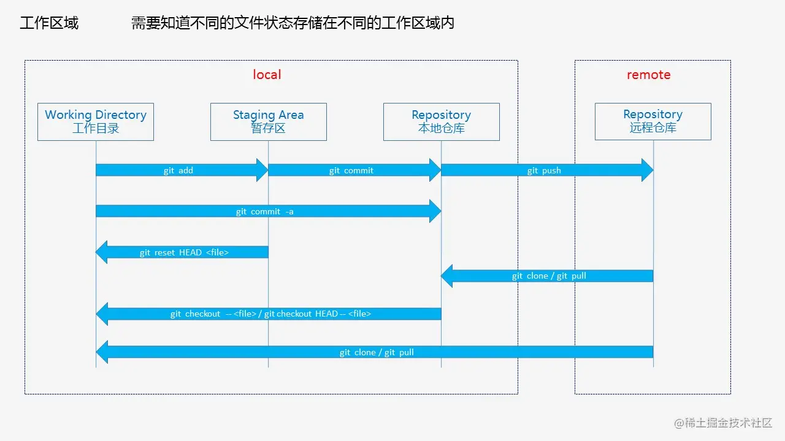
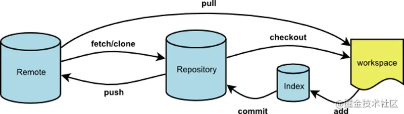

## 1. git 整体结构



git 的整体结构：

1. remote 远程：远程仓库
2. local 本地：
   - 工作 working：当前敲代码的地方。
   - 暂存区 staging：如果想还原上一次提交的状态，同时保存现场，可以把代码放入暂存。
   - 本地仓库 repository：提交代码，但尚未 push 到远程仓库。

git 的工作流：



1. 正常工作流

```shell
# 开发前
git pull # 拉远程代码
# 本地开发中...

git status 	 		# 查看：当前改动的文件
git add .   		# 添加：跟踪改动的文件
git commit -m "feat: javascript document had pushed" # 提交：把修改提交到本地仓库，同时添加描述

```

