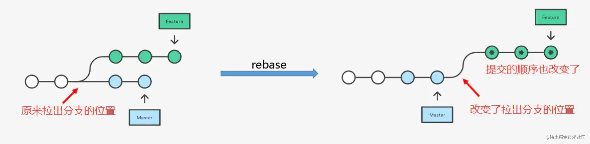
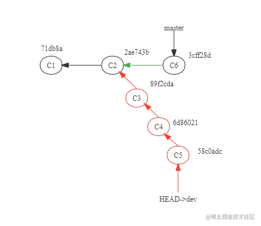
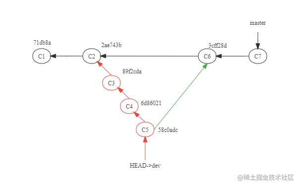
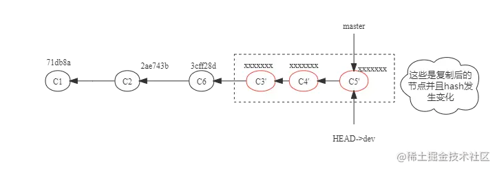

## 1. git 整体结构


git 的整体结构：

1. remote 远程：远程仓库
2. local 本地：
   - 工作 working：当前敲代码的地方。
   - 暂存区 staging area：将本地修改的代码，先暂存到 暂存区，也就是下图的 index。
   - 本地仓库 repository：提交代码，但尚未 push 到远程仓库。

git 的工作流：


1. 正常工作流

```shell
# 开发前
git pull # 拉远程代码
# 本地开发中...

git status 	 		# 查看：当前改动的文件
git add .   		# 暂存：跟踪改动的文件
git commit -m "feat: javascript document had pushed" # 提交：把修改提交到本地仓库，同时添加描述
git push				# 上传：将修改上传到远程仓库
```

2. 如果有两人开发，需要 rebase

```sh
# 开发前：拉取别人更新：<远程主机名> <远程分支名>:<本地分支名>
git pull origin feat-equipment:feat-equpiment-point-0414
# 这相当于 git fetch + git merge
# 本地开发中...

# 提交前：必须 rebase 别人代码，并解决冲突
git pull --rebase origin feat-equipment  # 如果要pull到当前分支，可省略不写
# 解决冲突：用本地分支的代码、用远端分支的代码、两者的代码都用
... ... 
# 本地分支更改后，把更改的代码提交
gst
git add .
git commit -m "feat: 解决冲突"
git push --set-upstream origin feat-equpiment-point-0414

# 发现 本地对应的远端分支发生冲突，此时覆盖远端，也可以创建一个新分支更保险：
git checkout -b feat-equpiment-point-0418
git push --set-upstream origin feat-equpiment-point-0418
# 如果是覆盖
git push -f

# 冲突解决完毕，可以提mr到feat-equipment中
```

3. 如果需要暂存当前代码。

场景：正在开发自己的需求，突然要 fix hot bug，此时要暂存现场，还原上一次提交状态。

```shell
# 暂存
git stash
git stash save "message"   # 执行存储时，添加备注，方便查找。

# 查看 / 清空
git stash list
git stash clear

# 恢复
git stash pop 		# 应用最近一次暂存的修改，并删除暂存的记录
git stash apply 	# 应用某个存储，不删除记录，默认使用第一个，stash@{0}
git stash apply stash@{$num} 	# 点名应用某个记录
```

4. 如果新开发一个功能，需要创建新分支

```shell
# 切换到主分支
git checkout feat-equipment
# 创建 + 切换 新分支
git branch feat-equipment-0817
git checkout feat-equipment-0817
# 开发中...

# 暂存
gst
git add .

# 提交
git push --set-upstream origin feat-equipment-0817
```


## 2. 常用指令

### branch 新建/查看/删除分支

```shell
# 新建本地分支，但不切换
git branch <branch-name>
# 查看本地分支
git branch
# 查看远程分支
git branch -r
# 查看本地和远程分支
git branch -a
# 删除本地分支
git branch -d <branch-nane> 	# 该分支必须完全和它的上游分支 merge 完成
git branch -D <branch-nane>		# 硬删除，直接本地删除不检查 merge
# 重新命名分支
git branch -m <old-branch-name> <new-branch-name>
```


### checkout 切换

```sh
# 切换到新分支
git checkout 新分支名
# 创建+切换
git checkout -b 新分支名
```


### push 上传 / 删除远程

```sh
# 创建的新本地分支上传到服务器
git push origin fix-houlinjie-0222

# 删除服务器上的分支
git push origin fix-houlinjie-0222 --delete
```


### diff 比较

```sh
# 比较暂存区（index）和工作区（workspace）之间的差异
git diff

# 比较本地仓库（Repository）和工作区（workspace）之间的差异
git diff <someCommit>
git diff HEAD      # 和 HEAD 进行比较
git diff 3f0c1b    # 和历史中某个节点比较

# 比较本地仓库（Repository）和暂存区（index）之间的差异
git diff --cached <someCommit>

# 两个比较仓库（Repository）进行比较
git diff <someCommit1> 和 <someCommit2>
```


### 删除

```sh
# 删除本地未跟踪的文件
git clean -df
-d   # 删除未跟踪目录以及目录下的文件，如果目录下包含其他git仓库文件，并不会删除（-dff可以删除）。
-f   # 如果 git cofig 下的 clean.requireForce 为true，那么clean操作需要-f(--force)来强制执行。
-i   # 进入交互模式
-n   # 查看将要被删除的文件，并不实际删除文件
```


### merge 

```shell
# 在解决冲突时，想放弃合并，就采用 abort 则在本阶段已经解决的冲突将全部回滚，到合并之前的状态
git merge  --abort
```


### rebase 变基



- 将分支 rebase 到主分支上，相当于在主分支的最新位置，额外增加了新分支提交的 log。
- 好处：更清晰的看到主分支 log 历史，严格按先后顺序。
- 一次解决每次 commit 的冲突，最后提交。

```sh
git rebase master
# 解决冲突
# feature：待变基分支、当前分支
# master：基分支、目标分支

# 手动解决冲突：应用当前分支、应用目标分支、都应用
git add
git rebase --continue  	# 继续检查冲突
git rebase --abort 			# 放弃本次reabse，回退

# 解决完毕后，合并提交
git push --set-upstream master
```


### 撤销更改

```sh
# 本地工作区撤销更改，此时还没有 add
# add 和 checkout 是反义词
git checkout -- <filename>
git checkout .			# 全部

# 本地暂存区撤销更改,此时已经add，还没commit
git reset   # 退回到 add，但修改还在
git checkout .		# 清空工作区
# 或者
git reset --hard

# 本地仓库，撤销更改，此时 add + commit
git reset --hard origin/master  # 从远程重新拉取
```


### alias 别称

通常会使用别称，来提升效率：

```shell
# 语法
git config --global alias.<简化的字符> 原始命令

# 常用
git config --global alias.gst git status   		# gst
git config --global alias.gco git checkout		# gco

# 添加快捷指令
alias gp='git push'
alias gts='git status'
```

- 这些命令其实是更新全局的 .gitconfig 文件，该文件用来保存全局的 git 配置，`vim ~/.gitconfig`，执行这段命令后，展示了通过 `git config --global alias` 添加的 `alias`。
- 也可以直接修改 .gitconfig 文件中 alias 修改别称。


## 3. 问题

### 问题：merge 和 rebase 区别

- https://juejin.cn/post/7123826435357147166

当前状况：



**git merge**：会让 2 个分支的提交按照提交时间进行排序，并且会把最新的2个commit合并成一个commit。

- 最后的分支树呈现非线性的结构
- 两个分支的 log，会按照时间顺序合并。
- 会产生一个新的 merge commit。

如下图：




**git rebase**：将 dev 的当前提交复制到 master 的最新提交之后，会形成一个线性的分支树。

- 会对分支的每次 commit，都进行 rebase：修改每次 commit 的代码，并重新提交生成一个新的 commit。
- 对应的，被 rebase 的旧 commit 会被删除。
- 相当于把 dev 分支所有的提交，都线性放在 master 上最新的 commit 之后。

如下图：



